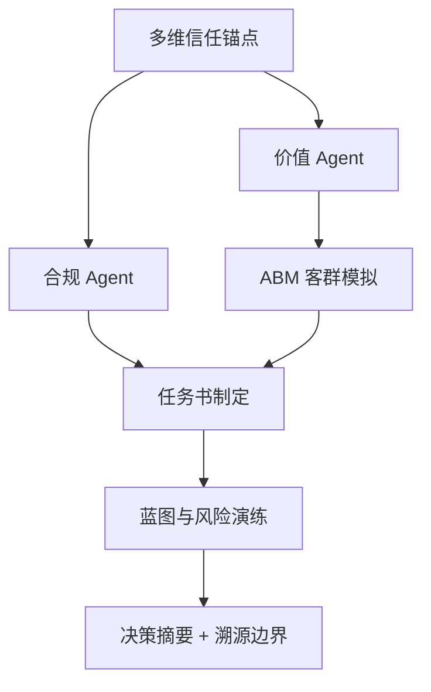

# DDS Agent v2 决策推演报告

## 输入假设
- 地块输入：{'city': '三亚', 'district': '给我三亚海棠区', 'address': '三亚海棠区青田村', 'lng': None, 'lat': None, 'radius_km': 5.0, 'expected_price': None, 'price_band': 0.15}
- 客户目标：{}

## 决策逻辑图


## 决策摘要
- 结论：可进入投拓测算，但需先补齐一级法定硬约束后才能定最终拿地价。
- 拿地敏感区间：{'conservative': None, 'balanced': None, 'aggressive': None, 'unit': None}
- 核心机会：暂无明确高置信机会
- 硬性阻断：['缺少容积率假设，无法形成楼面口径敏感区间。']

## Data Foundation
```json
{
  "level_1_legal_constraints": {
    "status": "missing_level_1_constraints",
    "trust_weight": 1.0,
    "available": false,
    "required_before_final_pricing": [
      "容积率上限",
      "用地性质",
      "限高",
      "退线",
      "绿地率",
      "车位指标",
      "商业比例",
      "产权/分割销售口径"
    ]
  },
  "level_2_gis_physical": {
    "status": "available",
    "trust_weight": 0.7,
    "nearest_poi": {
      "school": {
        "label": "学校",
        "name": "三亚市海棠区青田第一幼儿园",
        "distance_m": 417
      },
      "hospital": {
        "label": "医院",
        "name": "上工谷运动医学康复医疗中心",
        "distance_m": 138
      },
      "bus": {
        "label": "公交站",
        "name": "上工谷(公交站)",
        "distance_m": 374
      },
      "mall": {
        "label": "商场",
        "name": "老李便利店(青田风情小镇店)",
        "distance_m": 374
      }
    },
    "competitor_sample_count": 9
  },
  "level_3_market_sentiment": {
    "status": "sentiment_not_connected",
    "trust_weight": 0.35,
    "proxy_signals": {
      "product_type": null,
      "benchmark": null,
      "room_type_supply": {
        "商业户型": 4,
        "2室户型": 4,
        "3室户型": 4,
        "4室户型": 2,
        "别墅户型": 2,
        "1室户型": 1
      },
      "note": "当前用竞品标签、户型结构、对标项目价格作为三级情绪/非标溢价的弱代理。"
    },
    "online_evidence": []
  }
}
```

## Compliance Agent
```json
{
  "role": "合规 Agent",
  "verdict": "conditional",
  "hard_constraints_missing": [
    "容积率上限",
    "用地性质",
    "限高",
    "退线",
    "绿地率",
    "车位指标",
    "商业比例",
    "产权/分割销售口径"
  ],
  "warnings": [
    "缺少一级法定硬约束，当前只能输出投拓初判，不能作为最终拿地价。"
  ],
  "blockers": [
    "缺少容积率假设，无法形成楼面口径敏感区间。"
  ],
  "pricing_boundary": "只能给楼面地价敏感区间，最终价格需等一级数据校准。"
}
```

## Value Agent
```json
{
  "role": "价值 Agent",
  "market_avg_price_cny": 58750.0,
  "benchmark": null,
  "benchmark_premium_ratio": null,
  "opportunities": [],
  "product_reference": {
    "observed_area_ranges": [
      "200-228㎡",
      "113-281㎡",
      "65-88㎡",
      "55-215㎡",
      "57-144㎡",
      "69-78㎡",
      "107-203㎡",
      "111-201㎡",
      "57-132㎡"
    ],
    "observed_room_types": [
      "商业户型",
      "2室户型,3室户型,4室户型",
      "2室户型,3室户型",
      "1室户型,2室户型,3室户型,别墅户型",
      "商业户型",
      "商业户型",
      "2室户型,3室户型,4室户型",
      "别墅户型",
      "商业户型"
    ],
    "top_price_projects": [
      {
        "project_name": "新湖海棠春晓",
        "price": 100000.0,
        "area_range": "200-228㎡",
        "room_types": "商业户型"
      },
      {
        "project_name": "保利C+国际博览中心",
        "price": 65000.0,
        "area_range": "57-144㎡",
        "room_types": "商业户型"
      },
      {
        "project_name": "绿城·凤鸣观棠",
        "price": 35000.0,
        "area_range": "113-281㎡",
        "room_types": "2室户型,3室户型,4室户型"
      },
      {
        "project_name": "保利海晏",
        "price": 35000.0,
        "area_range": "107-203㎡",
        "room_types": "2室户型,3室户型,4室户型"
      }
    ]
  },
  "online_cross_check": {
    "status": "not_run",
    "source_count": 0,
    "sources": []
  }
}
```

## ABM Market Agent
```json
{
  "role": "ABM 市场模拟 Agent",
  "method": "规则化 MVP：用产品方向、周边价格、对标溢价、配套信号估算支付意愿。",
  "personas": [
    {
      "name": "高净值康养",
      "score": 68,
      "preferences": [
        "私密性",
        "医疗康养",
        "圈层",
        "安静"
      ],
      "payment_sensitivity": "对医疗真实性和服务品质敏感"
    },
    {
      "name": "投资收藏",
      "score": 68,
      "preferences": [
        "稀缺性",
        "品牌对标",
        "资产流动性",
        "租售潜力"
      ],
      "payment_sensitivity": "对政策限制和转手流动性敏感"
    },
    {
      "name": "度假改善",
      "score": 58,
      "preferences": [
        "景观",
        "低密",
        "家庭停留",
        "配套便利"
      ],
      "payment_sensitivity": "对总价和物业维护成本敏感"
    },
    {
      "name": "家庭旅居",
      "score": 58,
      "preferences": [
        "学校",
        "商业",
        "交通",
        "空间弹性"
      ],
      "payment_sensitivity": "对日常生活便利和总价门槛敏感"
    }
  ],
  "top_personas": [
    {
      "name": "高净值康养",
      "score": 68,
      "preferences": [
        "私密性",
        "医疗康养",
        "圈层",
        "安静"
      ],
      "payment_sensitivity": "对医疗真实性和服务品质敏感"
    },
    {
      "name": "投资收藏",
      "score": 68,
      "preferences": [
        "稀缺性",
        "品牌对标",
        "资产流动性",
        "租售潜力"
      ],
      "payment_sensitivity": "对政策限制和转手流动性敏感"
    }
  ]
}
```

## Briefing Engine
```json
{
  "role": "任务书制定 Agent",
  "product_positioning": "以待定产品为方向，先验证低密/私密/景观/康养服务是否真实支撑高端溢价。",
  "target_price_band": {
    "conservative": 49938.0,
    "balanced": 58750.0,
    "aggressive": 70500.0,
    "unit": "元/㎡"
  },
  "performance_brief": [
    "私密性等级：控制公共界面干扰，强化院落/入户/露台的边界感。",
    "视觉通透度：优先把景观面和主力功能空间绑定，避免只做符号化立面。",
    "垂直动线效率：低密产品需减少无效交通面积，保证可售效率。",
    "到达仪式感：车行、人行、会所或公共入口形成清晰等级。",
    "可售弹性：面积段要覆盖主力客群支付能力，避免只堆大面积高总价。",
    "服务配置：康养、度假、物业服务必须能被客户感知，否则不能计入溢价假设。"
  ],
  "premium_hypotheses": [
    "品牌/稀缺资源/低密私密性可支撑溢价。",
    "普通商业配套和表层景观包装不应被高估为核心溢价。",
    "若一级合规数据不支持商墅口径，产品定位需立即切换。"
  ],
  "compliance_dependency": [
    "容积率上限",
    "用地性质",
    "限高",
    "退线",
    "绿地率",
    "车位指标",
    "商业比例",
    "产权/分割销售口径"
  ]
}
```

## Blueprint Logic
```json
{
  "role": "蓝图与风险 Agent",
  "scenario_prices": {
    "conservative_sale_price": 50000.0,
    "base_sale_price": 58750.0,
    "benchmark_discount_sale_price": null
  },
  "land_value_sensitivity": null,
  "risk_curve": [
    {
      "risk": "政策风险",
      "level": "高",
      "trigger": "一级硬约束未补齐"
    },
    {
      "risk": "市场风险",
      "level": "中",
      "trigger": "高端样本价格离散，需验证成交和去化"
    },
    {
      "risk": "成本风险",
      "level": "中",
      "trigger": "低密产品景观、立面、会所、地下空间成本敏感"
    },
    {
      "risk": "产品错配",
      "level": "中",
      "trigger": "商墅若总价过高，会压缩家庭旅居客群"
    }
  ],
  "next_data_required": [
    "出让合同/控规图则",
    "可售面积和计容口径",
    "建安成本",
    "税费和融资成本",
    "目标利润率",
    "竞品真实成交/去化速度"
  ]
}
```

## Traceability / 数据边界
```json
{
  "parcel_report_meta": {
    "generated_at": "2026-05-12T02:00:22",
    "version": "parcel-report-mvp-1",
    "data_scope": "Vault/2026新楼盘 本地四城样本"
  },
  "source_scope": "Vault/2026新楼盘 本地四城样本",
  "location": {
    "lng": 109.678675,
    "lat": 18.283274,
    "source": "amap_geocode",
    "formatted_addr": "海南省三亚市海棠区青田村",
    "level": "村庄",
    "adcode": "460202"
  },
  "evidence_counts": {
    "nearby_competitors": 9,
    "amenity_categories": 7
  },
  "trust_weights": {
    "level_1": 1.0,
    "level_2": 0.7,
    "level_3": 0.35
  },
  "online_sources": {
    "status": "not_run",
    "count": 0,
    "items": []
  }
}
```

