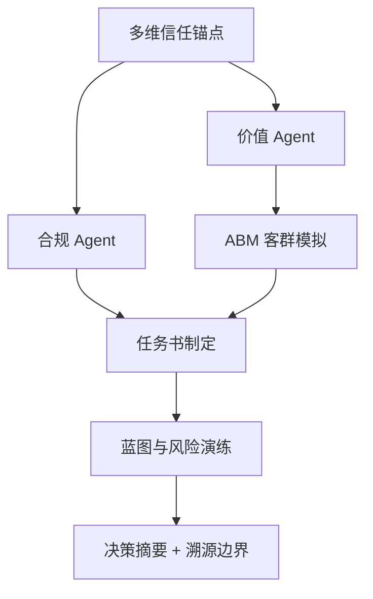

# DDS Agent v2 决策推演报告

## 输入假设
- 地块输入：{'city': '三亚', 'district': '海棠区', 'address': '海棠区南田路16号', 'lng': 109.71899, 'lat': 18.4104}
- 客户目标：{'product_type': '低密商墅', 'floor_area_ratio': 1.2, 'benchmark': '保利棠隐'}

## 决策逻辑图


## 决策摘要
- 结论：可进入投拓测算，但需先补齐一级法定硬约束后才能定最终拿地价。
- 拿地敏感区间：{'conservative': 28455.0, 'balanced': 33536.0, 'aggressive': 38617.0, 'unit': '元/㎡土地口径粗算'}
- 核心机会：对标项目显著高于周边均价，说明存在稀缺资源或强产品力溢价，但需要验证成交真实性和去化速度。
- 硬性阻断：['需确认用地性质是否允许商墅/低密产品', '需确认可售分割、产权年限和商办/住宅监管口径']

## Data Foundation
```json
{
  "level_1_legal_constraints": {
    "status": "missing_level_1_constraints",
    "trust_weight": 1.0,
    "available": false,
    "required_before_final_pricing": [
      "容积率上限",
      "用地性质",
      "限高",
      "退线",
      "绿地率",
      "车位指标",
      "商业比例",
      "产权/分割销售口径"
    ]
  },
  "level_2_gis_physical": {
    "status": "available",
    "trust_weight": 0.7,
    "nearest_poi": {},
    "competitor_sample_count": 12
  },
  "level_3_market_sentiment": {
    "status": "sentiment_not_connected",
    "trust_weight": 0.35,
    "proxy_signals": {
      "product_type": "低密商墅",
      "benchmark": "保利棠隐",
      "room_type_supply": {},
      "note": "当前用竞品标签、户型结构、对标项目价格作为三级情绪/非标溢价的弱代理。"
    },
    "online_evidence": []
  }
}
```

## Compliance Agent
```json
{
  "role": "合规 Agent",
  "verdict": "conditional",
  "hard_constraints_missing": [
    "容积率上限",
    "用地性质",
    "限高",
    "退线",
    "绿地率",
    "车位指标",
    "商业比例",
    "产权/分割销售口径"
  ],
  "warnings": [
    "容积率 1.2 是客户假设，尚未由出让合同或控规文件确认。",
    "缺少一级法定硬约束，当前只能输出投拓初判，不能作为最终拿地价。"
  ],
  "blockers": [
    "需确认用地性质是否允许商墅/低密产品",
    "需确认可售分割、产权年限和商办/住宅监管口径"
  ],
  "pricing_boundary": "只能给楼面地价敏感区间，最终价格需等一级数据校准。"
}
```

## Value Agent
```json
{
  "role": "价值 Agent",
  "market_avg_price_cny": 84687,
  "benchmark": {
    "project_name": "保利棠隐",
    "unit_price_cny": 175000,
    "area_range": "135-143㎡",
    "room_types": "",
    "district": "海棠区",
    "lng": 109.737722,
    "lat": 18.325534,
    "status": "在售"
  },
  "benchmark_premium_ratio": 2.07,
  "opportunities": [
    "对标项目显著高于周边均价，说明存在稀缺资源或强产品力溢价，但需要验证成交真实性和去化速度。",
    "客户目标产品为低密商墅，应优先验证低密、私密性、到达仪式感和景观资源是否能支撑溢价。"
  ],
  "product_reference": {
    "observed_area_ranges": [
      "135-143㎡",
      "118-347㎡",
      "200-228㎡",
      "611-886㎡",
      "175-275㎡",
      "95-168㎡",
      "57-144㎡",
      "138-600㎡",
      "515-660㎡",
      "96-128㎡",
      "123-190㎡"
    ],
    "observed_room_types": [
      "4/5室",
      "2/4室",
      "5/6室",
      "3/4/5室",
      "2/3室",
      "1/2/3/4/5室",
      "3/4/5/6室",
      "4/5室",
      "2/3/4/5室",
      "3/6室"
    ],
    "top_price_projects": [
      {
        "project_name": "保利棠隐",
        "price": 175000,
        "area_range": "135-143㎡",
        "room_types": ""
      },
      {
        "project_name": "海棠湾·云境",
        "price": 150000,
        "area_range": "118-347㎡",
        "room_types": "4/5室"
      },
      {
        "project_name": "新湖海棠春晓",
        "price": 100000,
        "area_range": "200-228㎡",
        "room_types": "2/4室"
      },
      {
        "project_name": "君御别墅",
        "price": 100000,
        "area_range": "611-886㎡",
        "room_types": "5/6室"
      },
      {
        "project_name": "海棠101",
        "price": 100000,
        "area_range": "175-275㎡",
        "room_types": "3/4/5室"
      }
    ]
  },
  "online_cross_check": {
    "status": "not_run",
    "source_count": 0,
    "sources": []
  }
}
```

## ABM Market Agent
```json
{
  "role": "ABM 市场模拟 Agent",
  "method": "Random Utility + MNL，蒙特卡洛 N=1000",
  "city": "三亚",
  "product": {
    "name": "低密商墅",
    "unit_price": 84687,
    "area": 220,
    "pref_score": {
      "景观": 0.85,
      "私密": 0.9,
      "圈层": 0.7,
      "户型": 0.75,
      "通勤": 0.3,
      "学校": 0.4,
      "品牌": 0.8
    }
  },
  "n_personas": 1000,
  "avg_buy_probability": 0.079,
  "top_personas": [
    {
      "name": "高净值康养",
      "share": 0.687,
      "raw_count": 102,
      "score": 53.1,
      "wtp_p50": 80139.0,
      "wtp_p90": 126312.0
    },
    {
      "name": "度假投资",
      "share": 0.238,
      "raw_count": 280,
      "score": 6.7,
      "wtp_p50": 29148.0,
      "wtp_p90": 50141.0
    },
    {
      "name": "本地改善",
      "share": 0.034,
      "raw_count": 154,
      "score": 1.8,
      "wtp_p50": 6439.0,
      "wtp_p90": 10409.0
    }
  ],
  "personas": [
    {
      "name": "高净值康养",
      "share": 0.687,
      "raw_count": 102,
      "score": 53.1,
      "wtp_p50": 80139.0,
      "wtp_p90": 126312.0
    },
    {
      "name": "度假投资",
      "share": 0.238,
      "raw_count": 280,
      "score": 6.7,
      "wtp_p50": 29148.0,
      "wtp_p90": 50141.0
    },
    {
      "name": "本地改善",
      "share": 0.034,
      "raw_count": 154,
      "score": 1.8,
      "wtp_p50": 6439.0,
      "wtp_p90": 10409.0
    },
    {
      "name": "外地候鸟-华北",
      "share": 0.026,
      "raw_count": 236,
      "score": 0.9,
      "wtp_p50": 9275.0,
      "wtp_p90": 15354.0
    },
    {
      "name": "外地候鸟-东北",
      "share": 0.009,
      "raw_count": 130,
      "score": 0.6,
      "wtp_p50": 6475.0,
      "wtp_p90": 10310.0
    },
    {
      "name": "外地候鸟-西北",
      "share": 0.006,
      "raw_count": 98,
      "score": 0.5,
      "wtp_p50": 8513.0,
      "wtp_p90": 13141.0
    }
  ],
  "wtp_distribution": [
    {
      "range": "1574-14218",
      "count": 596
    },
    {
      "range": "14218-26861",
      "count": 153
    },
    {
      "range": "26861-39505",
      "count": 92
    },
    {
      "range": "39505-52148",
      "count": 57
    },
    {
      "range": "52148-64792",
      "count": 32
    },
    {
      "range": "64792-77436",
      "count": 13
    },
    {
      "range": "77436-90079",
      "count": 19
    },
    {
      "range": "90079-102723",
      "count": 8
    },
    {
      "range": "102723-115367",
      "count": 6
    },
    {
      "range": "115367-128010",
      "count": 24
    }
  ],
  "wtp_summary": {
    "p10": 4667.0,
    "p50": 11066.0,
    "p90": 53625.0,
    "unit": "元/㎡"
  },
  "sellthrough_curve": [
    {
      "month": 1,
      "monthly_sales": 3.2,
      "cumulative": 3.2
    },
    {
      "month": 2,
      "monthly_sales": 3.2,
      "cumulative": 6.3
    },
    {
      "month": 3,
      "monthly_sales": 3.2,
      "cumulative": 9.5
    },
    {
      "month": 4,
      "monthly_sales": 3.2,
      "cumulative": 12.6
    },
    {
      "month": 5,
      "monthly_sales": 3.2,
      "cumulative": 15.8
    },
    {
      "month": 6,
      "monthly_sales": 2.2,
      "cumulative": 18.0
    },
    {
      "month": 7,
      "monthly_sales": 2.2,
      "cumulative": 20.2
    },
    {
      "month": 8,
      "monthly_sales": 2.2,
      "cumulative": 22.4
    },
    {
      "month": 9,
      "monthly_sales": 2.2,
      "cumulative": 24.6
    },
    {
      "month": 10,
      "monthly_sales": 2.2,
      "cumulative": 26.8
    },
    {
      "month": 11,
      "monthly_sales": 2.2,
      "cumulative": 29.0
    },
    {
      "month": 12,
      "monthly_sales": 1.5,
      "cumulative": 30.6
    },
    {
      "month": 13,
      "monthly_sales": 1.5,
      "cumulative": 32.1
    },
    {
      "month": 14,
      "monthly_sales": 1.5,
      "cumulative": 33.7
    },
    {
      "month": 15,
      "monthly_sales": 1.5,
      "cumulative": 35.2
    },
    {
      "month": 16,
      "monthly_sales": 1.5,
      "cumulative": 36.7
    },
    {
      "month": 17,
      "monthly_sales": 1.5,
      "cumulative": 38.3
    },
    {
      "month": 18,
      "monthly_sales": 1.1,
      "cumulative": 39.4
    },
    {
      "month": 19,
      "monthly_sales": 1.1,
      "cumulative": 40.5
    },
    {
      "month": 20,
      "monthly_sales": 1.1,
      "cumulative": 41.5
    },
    {
      "month": 21,
      "monthly_sales": 1.1,
      "cumulative": 42.6
    },
    {
      "month": 22,
      "monthly_sales": 1.1,
      "cumulative": 43.7
    },
    {
      "month": 23,
      "monthly_sales": 1.1,
      "cumulative": 44.8
    },
    {
      "month": 24,
      "monthly_sales": 0.8,
      "cumulative": 45.5
    }
  ],
  "price_sensitivity": [
    {
      "price_delta": "-10%",
      "avg_buy_prob": 0.095,
      "vs_base_pct": 20.8
    },
    {
      "price_delta": "-5%",
      "avg_buy_prob": 0.085,
      "vs_base_pct": 8.0
    },
    {
      "price_delta": "+5%",
      "avg_buy_prob": 0.071,
      "vs_base_pct": -9.5
    },
    {
      "price_delta": "+10%",
      "avg_buy_prob": 0.069,
      "vs_base_pct": -12.0
    }
  ],
  "confidence": {
    "score": 1.0,
    "level": "高",
    "note": "MVP 阶段使用合成人口分布，L1 真实成交数据接入后置信度可升至 0.9+"
  }
}
```

## 户型配比 Agent（反向匹配）
**方法**：反向匹配 v1（efu 最高户型分桶 + MNL）  
**总户数**：120  
**总预期销售额**：15.39 亿元  
**整体去化预估**：80.6 月  

| 户型 | 面积 | 单价 | 推荐套数 | 占比 | 主力客群 | 预期销售额 |
|---|---:|---:|---:|---:|---|---:|
| 150㎡四房 | 150㎡ | 84687 | 118 | 98.0% | 高净值康养(54%), 度假投资(46%) | 14.99 亿 |
| 220㎡商墅 | 220㎡ | 91462 | 2 | 2.0% | 高净值康养(100%) | 0.40 亿 |
| 280㎡大宅 | 280㎡ | 97390 | 0 | 0.0% | — | 0.00 亿 |

## 5 年客群迁移 Agent
**方法**：客群马尔可夫迁移 v1  
**累计退出率**：28.5%  

### 关键迁移 (Y0 → Y5)

| 客群 | Y0 | Y5 | 变化 | 趋势 |
|---|---:|---:|---:|---|
| 高净值康养 | 10% | 22% | +12pp | 上升 |
| 外地候鸟-东北 | 13% | 8% | -5pp | 下降 |
| 外地候鸟-华北 | 24% | 19% | -5pp | 下降 |
| 本地改善 | 15% | 19% | +4pp | 上升 |
| 外地候鸟-西北 | 10% | 6% | -4pp | 下降 |

### 年度分布演化

| 年份 | Top 3 客群 |
|---:|---|
| Y0 | 度假投资 28%, 外地候鸟-华北 24%, 本地改善 15% |
| Y1 | 度假投资 27%, 外地候鸟-华北 23%, 本地改善 16% |
| Y2 | 度假投资 27%, 外地候鸟-华北 22%, 本地改善 17% |
| Y3 | 度假投资 26%, 外地候鸟-华北 21%, 高净值康养 18% |
| Y4 | 度假投资 26%, 高净值康养 20%, 外地候鸟-华北 20% |
| Y5 | 度假投资 25%, 高净值康养 22%, 本地改善 19% |

## Briefing Engine
```json
{
  "role": "任务书制定 Agent",
  "product_positioning": "以低密商墅为方向，先验证低密/私密/景观/康养服务是否真实支撑高端溢价。",
  "target_price_band": {
    "conservative": 71984.0,
    "balanced": 84687,
    "aggressive": 114327.0,
    "unit": "元/㎡"
  },
  "performance_brief": [
    "私密性等级：控制公共界面干扰，强化院落/入户/露台的边界感。",
    "视觉通透度：优先把景观面和主力功能空间绑定，避免只做符号化立面。",
    "垂直动线效率：低密产品需减少无效交通面积，保证可售效率。",
    "到达仪式感：车行、人行、会所或公共入口形成清晰等级。",
    "可售弹性：面积段要覆盖主力客群支付能力，避免只堆大面积高总价。",
    "服务配置：康养、度假、物业服务必须能被客户感知，否则不能计入溢价假设。"
  ],
  "premium_hypotheses": [
    "品牌/稀缺资源/低密私密性可支撑溢价。",
    "普通商业配套和表层景观包装不应被高估为核心溢价。",
    "若一级合规数据不支持商墅口径，产品定位需立即切换。"
  ],
  "compliance_dependency": [
    "容积率上限",
    "用地性质",
    "限高",
    "退线",
    "绿地率",
    "车位指标",
    "商业比例",
    "产权/分割销售口径"
  ]
}
```

## Blueprint Logic
```json
{
  "role": "蓝图与风险 Agent",
  "scenario_prices": {
    "conservative_sale_price": 67500.0,
    "base_sale_price": 84687,
    "benchmark_discount_sale_price": 131250.0
  },
  "land_value_sensitivity": {
    "conservative_land_value": 28455.0,
    "balanced_land_value": 33536.0,
    "aggressive_land_value": 38617.0,
    "unit": "元/㎡土地口径粗算",
    "floor_area_ratio": 1.2,
    "floor_area_ratio_source": "user_input"
  },
  "risk_curve": [
    {
      "risk": "政策风险",
      "level": "高",
      "trigger": "一级硬约束未补齐"
    },
    {
      "risk": "市场风险",
      "level": "中",
      "trigger": "高端样本价格离散，需验证成交和去化"
    },
    {
      "risk": "成本风险",
      "level": "中",
      "trigger": "低密产品景观、立面、会所、地下空间成本敏感"
    },
    {
      "risk": "产品错配",
      "level": "中",
      "trigger": "商墅若总价过高，会压缩家庭旅居客群"
    }
  ],
  "next_data_required": [
    "出让合同/控规图则",
    "可售面积和计容口径",
    "建安成本",
    "税费和融资成本",
    "目标利润率",
    "竞品真实成交/去化速度"
  ]
}
```

## Traceability / 数据边界
```json
{
  "parcel_report_meta": {
    "generated_at": "2026-05-27T12:00:00",
    "version": "real-parcel-test",
    "data_scope": "Vault/2026新楼盘/三亚 · 海棠区"
  },
  "source_scope": "Vault/2026新楼盘/三亚 · 海棠区",
  "location": {
    "city": "三亚",
    "district": "海棠区",
    "lng": 109.71899,
    "lat": 18.4104
  },
  "evidence_counts": {
    "nearby_competitors": 12,
    "amenity_categories": 0
  },
  "trust_weights": {
    "level_1": 1.0,
    "level_2": 0.7,
    "level_3": 0.35
  },
  "online_sources": {
    "status": "not_run",
    "count": 0,
    "items": []
  }
}
```

