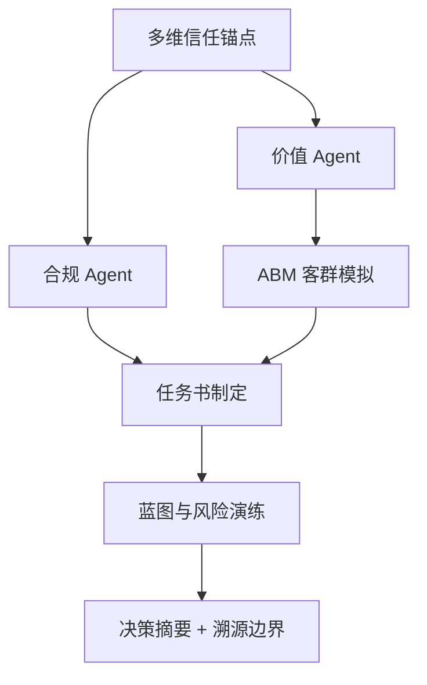

# DDS Agent v2 决策推演报告

## 输入假设
- 地块输入：{'city': '上海', 'district': '我分析2020年上海黄浦区', 'address': '上海黄浦区', 'lng': None, 'lat': None, 'radius_km': 5.0, 'expected_price': 35000.0, 'price_band': 0.15, 'year': None}
- 客户目标：{'floor_area_ratio': 1.2, 'product_type': '高端住宅'}

## 决策逻辑图


## CEO 权重引擎 / 综合评分
**preset**: invest
**total_score**: 50.3 / 100
**grade**: B
**overall_confidence**: 0.73
**interpretation**: 置信度较高，模型输入充分、内部一致。 综合得分中等，建议先补齐一级法定硬约束 + 客群校验后再决策。

| Agent | raw | conf | weight | contrib |
|---|---:|---:|---:|---:|
| compliance | 55.0 | 0.5 | 0.3 | 8.25 |
| value | 85.0 | 1.0 | 0.2 | 17.0 |
| abm | 47.0 | 1.0 | 0.15 | 7.05 |
| unit_mix | 90.0 | 0.7 | 0.15 | 9.45 |
| migration | 76.9 | 0.65 | 0.1 | 5.0 |
| blueprint | 60 | 0.6 | 0.1 | 3.6 |

## 决策摘要
- 结论：可进入投拓测算，但需先补齐一级法定硬约束后才能定最终拿地价。
- 拿地敏感区间：{'conservative': 52130.0, 'balanced': 61439.0, 'aggressive': 70748.0, 'unit': '元/㎡土地口径粗算'}
- 核心机会：客户目标产品为高端住宅，应优先验证低密、私密性、到达仪式感和景观资源是否能支撑溢价。
- 硬性阻断：暂无，但一级硬约束仍需补齐

## Data Foundation
```json
{
  "level_1_legal_constraints": {
    "status": "missing_level_1_constraints",
    "trust_weight": 1.0,
    "available": false,
    "required_before_final_pricing": [
      "容积率上限",
      "用地性质",
      "限高",
      "退线",
      "绿地率",
      "车位指标",
      "商业比例",
      "产权/分割销售口径"
    ]
  },
  "level_2_gis_physical": {
    "status": "available",
    "trust_weight": 0.7,
    "nearest_poi": {},
    "competitor_sample_count": 13
  },
  "level_3_market_sentiment": {
    "status": "online_supplement_available",
    "trust_weight": 0.35,
    "proxy_signals": {
      "product_type": "高端住宅",
      "benchmark": null,
      "room_type_supply": {
        "4室户型": 10,
        "3室户型": 8,
        "别墅户型": 6,
        "5室户型": 4,
        "1室户型": 3,
        "2室户型": 3,
        "6室户型": 1
      },
      "note": "当前用竞品标签、户型结构、对标项目价格作为三级情绪/非标溢价的弱代理。"
    },
    "online_evidence": [
      {
        "query": "三亚海棠湾商墅",
        "title": "三亚海棠湾高端市场2026Q1报告",
        "url": "https://example.com/sanya-report",
        "summary": "海棠湾商墅产品2026年Q1成交均价约85000元/㎡，去化周期约14个月。高端康养客群为主要买家。",
        "data_date": "2026-03-31",
        "confidence": "supplemental",
        "captured_at": "2026-05-12T18:32:14",
        "role": "online_supplement_only"
      }
    ]
  }
}
```

## Compliance Agent
```json
{
  "role": "合规 Agent",
  "verdict": "conditional",
  "hard_constraints_missing": [
    "容积率上限",
    "用地性质",
    "限高",
    "退线",
    "绿地率",
    "车位指标",
    "商业比例",
    "产权/分割销售口径"
  ],
  "warnings": [
    "容积率 1.2 是客户假设，尚未由出让合同或控规文件确认。",
    "缺少一级法定硬约束，当前只能输出投拓初判，不能作为最终拿地价。"
  ],
  "blockers": [],
  "pricing_boundary": "只能给楼面地价敏感区间，最终价格需等一级数据校准。"
}
```

## Value Agent
```json
{
  "role": "价值 Agent",
  "market_avg_price_cny": 155149.0,
  "benchmark": null,
  "benchmark_premium_ratio": null,
  "opportunities": [
    "客户目标产品为高端住宅，应优先验证低密、私密性、到达仪式感和景观资源是否能支撑溢价。"
  ],
  "product_reference": {
    "observed_area_ranges": [
      "151-495㎡",
      "199-450㎡",
      "155-193㎡",
      "220-400㎡",
      "377-882㎡",
      "143-195㎡",
      "174-252㎡",
      "93-577㎡",
      "138-248㎡",
      "94-196㎡",
      "277-547㎡",
      "94-165㎡"
    ],
    "observed_room_types": [
      "3室户型,4室户型,别墅户型",
      "别墅户型",
      "3室户型,4室户型",
      "别墅户型",
      "4室户型,5室户型,别墅户型",
      "3室户型,4室户型",
      "3室户型,4室户型,5室户型",
      "1室户型,3室户型,4室户型,5室户型,6室户型,别墅户型",
      "3室户型,4室户型",
      "1室户型,2室户型,3室户型,4室户型",
      "4室户型,5室户型",
      "2室户型,3室户型,4室户型"
    ],
    "top_price_projects": [
      {
        "project_name": "保利世博天悦",
        "price": 180097.0,
        "area_range": "174-252㎡",
        "room_types": "3室户型,4室户型,5室户型"
      },
      {
        "project_name": "香港置地启元",
        "price": 178000.0,
        "area_range": "277-547㎡",
        "room_types": "4室户型,5室户型"
      },
      {
        "project_name": "露香园二期",
        "price": 176000.0,
        "area_range": "377-882㎡",
        "room_types": "4室户型,5室户型,别墅户型"
      },
      {
        "project_name": "绿城黄浦ONE",
        "price": 172000.0,
        "area_range": "155-193㎡",
        "room_types": "3室户型,4室户型"
      },
      {
        "project_name": "绿发浦江园",
        "price": 160000.0,
        "area_range": "143-195㎡",
        "room_types": "3室户型,4室户型"
      }
    ]
  },
  "online_cross_check": {
    "status": "supplemental_only",
    "source_count": 1,
    "sources": [
      {
        "query": "三亚海棠湾商墅",
        "title": "三亚海棠湾高端市场2026Q1报告",
        "url": "https://example.com/sanya-report",
        "summary": "海棠湾商墅产品2026年Q1成交均价约85000元/㎡，去化周期约14个月。高端康养客群为主要买家。",
        "data_date": "2026-03-31",
        "confidence": "supplemental",
        "captured_at": "2026-05-12T18:32:14",
        "role": "online_supplement_only"
      }
    ]
  }
}
```

## ABM Market Agent
```json
{
  "role": "ABM 市场模拟 Agent",
  "method": "Random Utility + MNL，蒙特卡洛 N=1000",
  "city": "上海",
  "product": {
    "name": "高端住宅",
    "unit_price": 155149.0,
    "area": 180,
    "pref_score": {
      "景观": 0.8,
      "私密": 0.85,
      "圈层": 0.75,
      "户型": 0.8,
      "通勤": 0.5,
      "学校": 0.55,
      "品牌": 0.85
    }
  },
  "n_personas": 1000,
  "avg_buy_probability": 0.047,
  "top_personas": [
    {
      "name": "金融精英",
      "share": 0.459,
      "raw_count": 290,
      "score": 7.4,
      "wtp_p50": 58324.0,
      "wtp_p90": 98646.0
    },
    {
      "name": "外籍海归",
      "share": 0.24,
      "raw_count": 269,
      "score": 4.2,
      "wtp_p50": 37696.0,
      "wtp_p90": 61760.0
    },
    {
      "name": "本地改善",
      "share": 0.141,
      "raw_count": 198,
      "score": 3.3,
      "wtp_p50": 24804.0,
      "wtp_p90": 46094.0
    }
  ],
  "personas": [
    {
      "name": "金融精英",
      "share": 0.459,
      "raw_count": 290,
      "score": 7.4,
      "wtp_p50": 58324.0,
      "wtp_p90": 98646.0
    },
    {
      "name": "外籍海归",
      "share": 0.24,
      "raw_count": 269,
      "score": 4.2,
      "wtp_p50": 37696.0,
      "wtp_p90": 61760.0
    },
    {
      "name": "本地改善",
      "share": 0.141,
      "raw_count": 198,
      "score": 3.3,
      "wtp_p50": 24804.0,
      "wtp_p90": 46094.0
    },
    {
      "name": "教育型买房",
      "share": 0.091,
      "raw_count": 143,
      "score": 3.0,
      "wtp_p50": 32236.0,
      "wtp_p90": 52201.0
    },
    {
      "name": "长三角家庭",
      "share": 0.069,
      "raw_count": 100,
      "score": 3.2,
      "wtp_p50": 21142.0,
      "wtp_p90": 32766.0
    }
  ],
  "wtp_distribution": [
    {
      "range": "2171-17242",
      "count": 145
    },
    {
      "range": "17242-32314",
      "count": 309
    },
    {
      "range": "32314-47385",
      "count": 239
    },
    {
      "range": "47385-62457",
      "count": 151
    },
    {
      "range": "62457-77528",
      "count": 81
    },
    {
      "range": "77528-92600",
      "count": 36
    },
    {
      "range": "92600-107671",
      "count": 25
    },
    {
      "range": "107671-122743",
      "count": 9
    },
    {
      "range": "122743-137814",
      "count": 3
    },
    {
      "range": "137814-152886",
      "count": 2
    }
  ],
  "wtp_summary": {
    "p10": 13903.0,
    "p50": 34624.0,
    "p90": 72201.0,
    "unit": "元/㎡"
  },
  "sellthrough_curve": [
    {
      "month": 1,
      "monthly_sales": 1.9,
      "cumulative": 1.9
    },
    {
      "month": 2,
      "monthly_sales": 1.9,
      "cumulative": 3.7
    },
    {
      "month": 3,
      "monthly_sales": 1.9,
      "cumulative": 5.6
    },
    {
      "month": 4,
      "monthly_sales": 1.9,
      "cumulative": 7.5
    },
    {
      "month": 5,
      "monthly_sales": 1.9,
      "cumulative": 9.3
    },
    {
      "month": 6,
      "monthly_sales": 1.3,
      "cumulative": 10.7
    },
    {
      "month": 7,
      "monthly_sales": 1.3,
      "cumulative": 12.0
    },
    {
      "month": 8,
      "monthly_sales": 1.3,
      "cumulative": 13.3
    },
    {
      "month": 9,
      "monthly_sales": 1.3,
      "cumulative": 14.6
    },
    {
      "month": 10,
      "monthly_sales": 1.3,
      "cumulative": 15.9
    },
    {
      "month": 11,
      "monthly_sales": 1.3,
      "cumulative": 17.2
    },
    {
      "month": 12,
      "monthly_sales": 0.9,
      "cumulative": 18.1
    },
    {
      "month": 13,
      "monthly_sales": 0.9,
      "cumulative": 19.0
    },
    {
      "month": 14,
      "monthly_sales": 0.9,
      "cumulative": 19.9
    },
    {
      "month": 15,
      "monthly_sales": 0.9,
      "cumulative": 20.9
    },
    {
      "month": 16,
      "monthly_sales": 0.9,
      "cumulative": 21.8
    },
    {
      "month": 17,
      "monthly_sales": 0.9,
      "cumulative": 22.7
    },
    {
      "month": 18,
      "monthly_sales": 0.6,
      "cumulative": 23.3
    },
    {
      "month": 19,
      "monthly_sales": 0.6,
      "cumulative": 24.0
    },
    {
      "month": 20,
      "monthly_sales": 0.6,
      "cumulative": 24.6
    },
    {
      "month": 21,
      "monthly_sales": 0.6,
      "cumulative": 25.3
    },
    {
      "month": 22,
      "monthly_sales": 0.6,
      "cumulative": 25.9
    },
    {
      "month": 23,
      "monthly_sales": 0.6,
      "cumulative": 26.5
    },
    {
      "month": 24,
      "monthly_sales": 0.4,
      "cumulative": 27.0
    }
  ],
  "price_sensitivity": [
    {
      "price_delta": "-10%",
      "avg_buy_prob": 0.058,
      "vs_base_pct": 23.8
    },
    {
      "price_delta": "-5%",
      "avg_buy_prob": 0.05,
      "vs_base_pct": 6.1
    },
    {
      "price_delta": "+5%",
      "avg_buy_prob": 0.041,
      "vs_base_pct": -11.9
    },
    {
      "price_delta": "+10%",
      "avg_buy_prob": 0.041,
      "vs_base_pct": -11.3
    }
  ],
  "confidence": {
    "score": 1.0,
    "level": "高",
    "note": "MVP 阶段使用合成人口分布，L1 真实成交数据接入后置信度可升至 0.9+"
  }
}
```

## 户型配比 Agent（反向匹配）
**方法**：反向匹配 v1（efu 最高户型分桶 + MNL）  
**总户数**：120  
**总预期销售额**：24.76 亿元  
**整体去化预估**：117.9 月  

| 户型 | 面积 | 单价 | 推荐套数 | 占比 | 主力客群 | 预期销售额 |
|---|---:|---:|---:|---:|---|---:|
| 140㎡三房 | 140㎡ | 147392 | 120 | 100.0% | 金融精英(97%), 外籍海归(3%) | 24.76 亿 |
| 180㎡大平层 | 180㎡ | 162906 | 0 | 0.0% | — | 0.00 亿 |
| 220㎡商墅 | 220㎡ | 173767 | 0 | 0.0% | — | 0.00 亿 |

## 5 年客群迁移 Agent
**方法**：客群马尔可夫迁移 v1  
**累计退出率**：22.1%  

### 关键迁移 (Y0 → Y5)

| 客群 | Y0 | Y5 | 变化 | 趋势 |
|---|---:|---:|---:|---|
| 外籍海归 | 27% | 18% | -9pp | 下降 |
| 本地改善 | 20% | 28% | +8pp | 上升 |
| 高净值康养 | 0% | 5% | +5pp | 上升 |
| 教育型买房 | 14% | 10% | -4pp | 下降 |
| 金融精英 | 29% | 32% | +3pp | 上升 |

### 年度分布演化

| 年份 | Top 3 客群 |
|---:|---|
| Y0 | 金融精英 29%, 外籍海归 27%, 本地改善 20% |
| Y1 | 金融精英 30%, 外籍海归 25%, 本地改善 22% |
| Y2 | 金融精英 31%, 本地改善 23%, 外籍海归 23% |
| Y3 | 金融精英 31%, 本地改善 25%, 外籍海归 21% |
| Y4 | 金融精英 32%, 本地改善 26%, 外籍海归 19% |
| Y5 | 金融精英 32%, 本地改善 27%, 外籍海归 18% |

## Briefing Engine
```json
{
  "role": "任务书制定 Agent",
  "product_positioning": "以高端住宅为方向，先验证低密/私密/景观/康养服务是否真实支撑高端溢价。",
  "target_price_band": {
    "conservative": 131877.0,
    "balanced": 155149.0,
    "aggressive": 186179.0,
    "unit": "元/㎡"
  },
  "performance_brief": [
    "私密性等级：控制公共界面干扰，强化院落/入户/露台的边界感。",
    "视觉通透度：优先把景观面和主力功能空间绑定，避免只做符号化立面。",
    "垂直动线效率：低密产品需减少无效交通面积，保证可售效率。",
    "到达仪式感：车行、人行、会所或公共入口形成清晰等级。",
    "可售弹性：面积段要覆盖主力客群支付能力，避免只堆大面积高总价。",
    "服务配置：康养、度假、物业服务必须能被客户感知，否则不能计入溢价假设。"
  ],
  "premium_hypotheses": [
    "品牌/稀缺资源/低密私密性可支撑溢价。",
    "普通商业配套和表层景观包装不应被高估为核心溢价。",
    "若一级合规数据不支持商墅口径，产品定位需立即切换。"
  ],
  "compliance_dependency": [
    "容积率上限",
    "用地性质",
    "限高",
    "退线",
    "绿地率",
    "车位指标",
    "商业比例",
    "产权/分割销售口径"
  ]
}
```

## Blueprint Logic
```json
{
  "role": "蓝图与风险 Agent",
  "scenario_prices": {
    "conservative_sale_price": 152800.0,
    "base_sale_price": 155149.0,
    "benchmark_discount_sale_price": null
  },
  "land_value_sensitivity": {
    "conservative_land_value": 52130.0,
    "balanced_land_value": 61439.0,
    "aggressive_land_value": 70748.0,
    "unit": "元/㎡土地口径粗算",
    "floor_area_ratio": 1.2,
    "floor_area_ratio_source": "user_input"
  },
  "risk_curve": [
    {
      "risk": "政策风险",
      "level": "高",
      "trigger": "一级硬约束未补齐"
    },
    {
      "risk": "市场风险",
      "level": "中",
      "trigger": "高端样本价格离散，需验证成交和去化"
    },
    {
      "risk": "成本风险",
      "level": "中",
      "trigger": "低密产品景观、立面、会所、地下空间成本敏感"
    },
    {
      "risk": "产品错配",
      "level": "中",
      "trigger": "商墅若总价过高，会压缩家庭旅居客群"
    }
  ],
  "next_data_required": [
    "出让合同/控规图则",
    "可售面积和计容口径",
    "建安成本",
    "税费和融资成本",
    "目标利润率",
    "竞品真实成交/去化速度"
  ]
}
```

## Traceability / 数据边界
```json
{
  "parcel_report_meta": {
    "generated_at": "2026-05-27T14:26:03",
    "version": "parcel-report-mvp-1",
    "data_scope": "Vault/2026年 本地四城样本",
    "target_year": "2026"
  },
  "source_scope": "Vault/2026年 本地四城样本",
  "location": {
    "lng": 121.487193,
    "lat": 31.220485,
    "source": "offline_proxy_match",
    "formatted_addr": "离线代理匹配地块: 中海·顺昌玖里 (上海黄浦区淮海中路建国东路66弄)",
    "level": "proxy",
    "adcode": null
  },
  "evidence_counts": {
    "nearby_competitors": 13,
    "amenity_categories": 7
  },
  "trust_weights": {
    "level_1": 1.0,
    "level_2": 0.7,
    "level_3": 0.35
  },
  "online_sources": {
    "status": "supplemental_available",
    "count": 1,
    "items": [
      {
        "query": "三亚海棠湾商墅",
        "title": "三亚海棠湾高端市场2026Q1报告",
        "url": "https://example.com/sanya-report",
        "summary": "海棠湾商墅产品2026年Q1成交均价约85000元/㎡，去化周期约14个月。高端康养客群为主要买家。",
        "data_date": "2026-03-31",
        "confidence": "supplemental",
        "captured_at": "2026-05-12T18:32:14",
        "role": "online_supplement_only"
      }
    ]
  }
}
```

