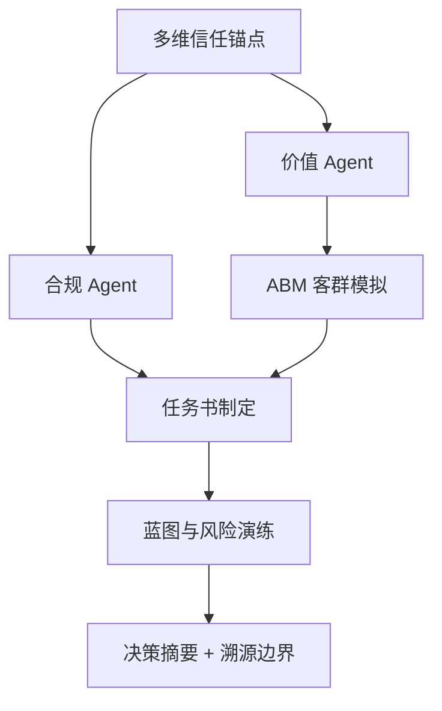

# DDS Agent v2 决策推演报告

## 输入假设
- 地块输入：{'city': '三亚', 'district': '海棠区', 'address': '海棠区南田路16号', 'lng': 109.71899, 'lat': 18.4104}
- 客户目标：{'product_type': '低密商墅', 'floor_area_ratio': 1.2, 'benchmark': '保利棠隐'}

## 决策逻辑图


## CEO 权重引擎 / 综合评分
**preset**: invest
**total_score**: 53.9 / 100
**grade**: B
**overall_confidence**: 0.73
**interpretation**: 置信度较高，模型输入充分、内部一致。 综合得分中等，建议先补齐一级法定硬约束 + 客群校验后再决策。

| Agent | 原始评分 | 置信度 | 权重 | 贡献分 | 评分分布 |
|---|---:|---:|---:|---:|:---:|
| compliance | 45.0 | 0.5 | 0.3 | 6.75 | `[====------]` |
| value | 100 | 1.0 | 0.2 | 20.0 | `[==========]` |
| abm | 62.0 | 1.0 | 0.15 | 9.3 | `[======----]` |
| unit_mix | 100 | 0.7 | 0.15 | 10.5 | `[==========]` |
| migration | 67.3 | 0.65 | 0.1 | 4.37 | `[=======---]` |
| blueprint | 50 | 0.6 | 0.1 | 3.0 | `[=====-----]` |

## 决策摘要
- 结论：可进入投拓测算，但需先补齐一级法定硬约束后才能定最终拿地价。
- 拿地敏感区间：{'conservative': 28455.0, 'balanced': 33536.0, 'aggressive': 38617.0, 'unit': '元/㎡土地口径粗算'}
- 核心机会：对标项目显著高于周边均价，说明存在稀缺资源或强产品力溢价，但需要验证成交真实性和去化速度。
- 硬性阻断：['需确认用地性质是否允许商墅/低密产品', '需确认可售分割、产权年限和商办/住宅监管口径']

## L3级线上舆情校验与交叉比对
| 舆情来源 | 爆料时间 | 爆料摘要 | 关联校验匹配 | 关联度得分 | 校验结论 |
| :--- | :--- | :--- | :--- | :--- | :--- |
| 三亚海棠湾高端市场2026Q1报告 | 2026-03-31 | 海棠湾商墅产品2026年Q1成交均价约85000元/㎡，去化周期约14个月。高端康养客群为主要买家。 | 城市匹配(三亚), 概念匹配 | 0.6 | ✅ 高度相关，强力校验 |


## Data Foundation
```json
{
  "level_1_legal_constraints": {
    "status": "missing_level_1_constraints",
    "trust_weight": 1.0,
    "available": false,
    "required_before_final_pricing": [
      "容积率上限",
      "用地性质",
      "限高",
      "退线",
      "绿地率",
      "车位指标",
      "商业比例",
      "产权/分割销售口径"
    ]
  },
  "level_2_gis_physical": {
    "status": "available",
    "trust_weight": 0.7,
    "nearest_poi": {},
    "competitor_sample_count": 12
  },
  "level_3_market_sentiment": {
    "status": "online_supplement_available",
    "trust_weight": 0.35,
    "proxy_signals": {
      "product_type": "低密商墅",
      "benchmark": "保利棠隐",
      "room_type_supply": {},
      "note": "当前用竞品标签、户型结构、对标项目价格作为三级情绪/非标溢价的弱代理。"
    },
    "online_evidence": [
      {
        "query": "三亚海棠湾商墅",
        "title": "三亚海棠湾高端市场2026Q1报告",
        "url": "https://example.com/sanya-report",
        "summary": "海棠湾商墅产品2026年Q1成交均价约85000元/㎡，去化周期约14个月。高端康养客群为主要买家。",
        "data_date": "2026-03-31",
        "confidence": "supplemental",
        "captured_at": "2026-05-12T18:32:14",
        "role": "online_supplement_only",
        "cross_check_score": 0.6,
        "cross_check_matches": [
          "城市匹配(三亚)",
          "概念匹配"
        ],
        "is_highly_relevant": true
      }
    ]
  }
}
```

## Compliance Agent
```json
{
  "role": "合规 Agent",
  "verdict": "conditional",
  "hard_constraints_missing": [
    "容积率上限",
    "用地性质",
    "限高",
    "退线",
    "绿地率",
    "车位指标",
    "商业比例",
    "产权/分割销售口径"
  ],
  "warnings": [
    "容积率 1.2 是客户假设，尚未由出让合同或控规文件确认。",
    "缺少一级法定硬约束，当前只能输出投拓初判，不能作为最终拿地价。"
  ],
  "blockers": [
    "需确认用地性质是否允许商墅/低密产品",
    "需确认可售分割、产权年限和商办/住宅监管口径"
  ],
  "pricing_boundary": "只能给楼面地价敏感区间，最终价格需等一级数据校准。"
}
```

## Value Agent
```json
{
  "role": "价值 Agent",
  "market_avg_price_cny": 84687,
  "benchmark": {
    "project_name": "保利棠隐",
    "unit_price_cny": 175000,
    "area_range": "135-143㎡",
    "room_types": "",
    "district": "海棠区",
    "lng": 109.737722,
    "lat": 18.325534,
    "status": "在售"
  },
  "benchmark_premium_ratio": 2.07,
  "opportunities": [
    "对标项目显著高于周边均价，说明存在稀缺资源或强产品力溢价，但需要验证成交真实性和去化速度。",
    "客户目标产品为低密商墅，应优先验证低密、私密性、到达仪式感和景观资源是否能支撑溢价。"
  ],
  "product_reference": {
    "observed_area_ranges": [
      "135-143㎡",
      "118-347㎡",
      "200-228㎡",
      "611-886㎡",
      "175-275㎡",
      "95-168㎡",
      "57-144㎡",
      "138-600㎡",
      "515-660㎡",
      "96-128㎡",
      "123-190㎡"
    ],
    "observed_room_types": [
      "4/5室",
      "2/4室",
      "5/6室",
      "3/4/5室",
      "2/3室",
      "1/2/3/4/5室",
      "3/4/5/6室",
      "4/5室",
      "2/3/4/5室",
      "3/6室"
    ],
    "top_price_projects": [
      {
        "project_name": "保利棠隐",
        "price": 175000,
        "area_range": "135-143㎡",
        "room_types": ""
      },
      {
        "project_name": "海棠湾·云境",
        "price": 150000,
        "area_range": "118-347㎡",
        "room_types": "4/5室"
      },
      {
        "project_name": "新湖海棠春晓",
        "price": 100000,
        "area_range": "200-228㎡",
        "room_types": "2/4室"
      },
      {
        "project_name": "君御别墅",
        "price": 100000,
        "area_range": "611-886㎡",
        "room_types": "5/6室"
      },
      {
        "project_name": "海棠101",
        "price": 100000,
        "area_range": "175-275㎡",
        "room_types": "3/4/5室"
      }
    ]
  },
  "vector_evidence": {
    "status": "ok",
    "source": "vault_fallback",
    "collection": "Vault CSV (近 5 年)",
    "items": [
      {
        "text": "2023年 · 海棠·华府 (陵水) · 45000 元/㎡ · 49-165㎡ · nan",
        "metadata": {
          "year": 2023,
          "project_name": "海棠·华府",
          "district": "陵水",
          "address": "三亚陵水土福湾滨海度假区",
          "unit_price": 45000,
          "area_range": "49-165㎡",
          "developer": "nan",
          "price_distance": 0.469,
          "product_match": true
        }
      },
      {
        "text": "2025年 · 宏翡翠墅 (陵水) · 42452 元/㎡ · 49-165㎡ · 世茂",
        "metadata": {
          "year": 2025,
          "project_name": "宏翡翠墅",
          "district": "陵水",
          "address": "三亚陵水土福湾滨海度假区",
          "unit_price": 42452,
          "area_range": "49-165㎡",
          "developer": "世茂",
          "price_distance": 0.499,
          "product_match": true
        }
      },
      {
        "text": "2023年 · 海棠梅林苑 (陵水) · 37782 元/㎡ · 49-165㎡ · 大华",
        "metadata": {
          "year": 2023,
          "project_name": "海棠梅林苑",
          "district": "陵水",
          "address": "三亚陵水土福湾滨海度假区",
          "unit_price": 37782,
          "area_range": "49-165㎡",
          "developer": "大华",
          "price_distance": 0.554,
          "product_match": true
        }
      },
      {
        "text": "2022年 · 海棠碧水城 (陵水) · 35644 元/㎡ · 49-165㎡ · 美的置业",
        "metadata": {
          "year": 2022,
          "project_name": "海棠碧水城",
          "district": "陵水",
          "address": "三亚陵水土福湾滨海度假区",
          "unit_price": 35644,
          "area_range": "49-165㎡",
          "developer": "美的置业",
          "price_distance": 0.579,
          "product_match": true
        }
      },
      {
        "text": "2023年 · 天使·海棠明悦 (海棠区) · 33628 元/㎡ · 113-195㎡ · nan",
        "metadata": {
          "year": 2023,
          "project_name": "天使·海棠明悦",
          "district": "海棠区",
          "address": "三亚海棠区海棠湾南田温泉度假区南田路18号",
          "unit_price": 33628,
          "area_range": "113-195㎡",
          "developer": "nan",
          "price_distance": 0.603,
          "product_match": true
        }
      }
    ],
    "note": "chromadb 未配置或无数据，使用 Vault 价格相似度兜底"
  },
  "online_cross_check": {
    "status": "supplemental_only",
    "source_count": 1,
    "sources": [
      {
        "query": "三亚海棠湾商墅",
        "title": "三亚海棠湾高端市场2026Q1报告",
        "url": "https://example.com/sanya-report",
        "summary": "海棠湾商墅产品2026年Q1成交均价约85000元/㎡，去化周期约14个月。高端康养客群为主要买家。",
        "data_date": "2026-03-31",
        "confidence": "supplemental",
        "captured_at": "2026-05-12T18:32:14",
        "role": "online_supplement_only",
        "cross_check_score": 0.6,
        "cross_check_matches": [
          "城市匹配(三亚)",
          "概念匹配"
        ],
        "is_highly_relevant": true
      }
    ]
  }
}
```

## 类似地块证据（向量库/Vault 兜底）
**来源**: vault_fallback · Vault CSV (近 5 年)  
_chromadb 未配置或无数据，使用 Vault 价格相似度兜底_  

| # | 项目 | 区域 | 年份 | 单价 | 面积段 | 开发商 | 相似度 |
|---:|---|---|---:|---:|---|---|---:|
| 1 | 海棠·华府 | 陵水 | 2023 | 45000 | 49-165㎡ | nan | — |
| 2 | 宏翡翠墅 | 陵水 | 2025 | 42452 | 49-165㎡ | 世茂 | — |
| 3 | 海棠梅林苑 | 陵水 | 2023 | 37782 | 49-165㎡ | 大华 | — |
| 4 | 海棠碧水城 | 陵水 | 2022 | 35644 | 49-165㎡ | 美的置业 | — |
| 5 | 天使·海棠明悦 | 海棠区 | 2023 | 33628 | 113-195㎡ | nan | — |

## ABM Market Agent
```json
{
  "role": "ABM 市场模拟 Agent",
  "method": "Random Utility + MNL，蒙特卡洛 N=1000",
  "city": "三亚",
  "product": {
    "name": "低密商墅",
    "unit_price": 84687,
    "area": 220,
    "pref_score": {
      "景观": 0.85,
      "私密": 0.9,
      "圈层": 0.7,
      "户型": 0.75,
      "通勤": 0.3,
      "学校": 0.4,
      "品牌": 0.8
    }
  },
  "n_personas": 1000,
  "avg_buy_probability": 0.062,
  "top_personas": [
    {
      "name": "高净值康养",
      "share": 0.703,
      "raw_count": 88,
      "score": 49.5,
      "wtp_p50": 77610.0,
      "wtp_p90": 121721.0
    },
    {
      "name": "度假投资",
      "share": 0.195,
      "raw_count": 266,
      "score": 4.5,
      "wtp_p50": 30836.0,
      "wtp_p90": 47613.0
    },
    {
      "name": "本地改善",
      "share": 0.049,
      "raw_count": 158,
      "score": 1.9,
      "wtp_p50": 6078.0,
      "wtp_p90": 10485.0
    }
  ],
  "personas": [
    {
      "name": "高净值康养",
      "share": 0.703,
      "raw_count": 88,
      "score": 49.5,
      "wtp_p50": 77610.0,
      "wtp_p90": 121721.0
    },
    {
      "name": "度假投资",
      "share": 0.195,
      "raw_count": 266,
      "score": 4.5,
      "wtp_p50": 30836.0,
      "wtp_p90": 47613.0
    },
    {
      "name": "本地改善",
      "share": 0.049,
      "raw_count": 158,
      "score": 1.9,
      "wtp_p50": 6078.0,
      "wtp_p90": 10485.0
    },
    {
      "name": "外地候鸟-华北",
      "share": 0.031,
      "raw_count": 252,
      "score": 0.8,
      "wtp_p50": 9568.0,
      "wtp_p90": 15613.0
    },
    {
      "name": "外地候鸟-东北",
      "share": 0.014,
      "raw_count": 140,
      "score": 0.6,
      "wtp_p50": 5716.0,
      "wtp_p90": 11313.0
    },
    {
      "name": "外地候鸟-西北",
      "share": 0.009,
      "raw_count": 96,
      "score": 0.6,
      "wtp_p50": 7956.0,
      "wtp_p90": 13309.0
    }
  ],
  "wtp_distribution": [
    {
      "range": "1564-14174",
      "count": 620
    },
    {
      "range": "14174-26784",
      "count": 125
    },
    {
      "range": "26784-39394",
      "count": 106
    },
    {
      "range": "39394-52004",
      "count": 73
    },
    {
      "range": "52004-64614",
      "count": 25
    },
    {
      "range": "64614-77224",
      "count": 7
    },
    {
      "range": "77224-89834",
      "count": 15
    },
    {
      "range": "89834-102444",
      "count": 14
    },
    {
      "range": "102444-115054",
      "count": 3
    },
    {
      "range": "115054-127664",
      "count": 12
    }
  ],
  "wtp_summary": {
    "p10": 4428.0,
    "p50": 10476.0,
    "p90": 46896.0,
    "unit": "元/㎡"
  },
  "sellthrough_curve": [
    {
      "month": 1,
      "monthly_sales": 2.5,
      "cumulative": 2.5
    },
    {
      "month": 2,
      "monthly_sales": 2.5,
      "cumulative": 5.0
    },
    {
      "month": 3,
      "monthly_sales": 2.5,
      "cumulative": 7.4
    },
    {
      "month": 4,
      "monthly_sales": 2.5,
      "cumulative": 9.9
    },
    {
      "month": 5,
      "monthly_sales": 2.5,
      "cumulative": 12.4
    },
    {
      "month": 6,
      "monthly_sales": 1.7,
      "cumulative": 14.1
    },
    {
      "month": 7,
      "monthly_sales": 1.7,
      "cumulative": 15.9
    },
    {
      "month": 8,
      "monthly_sales": 1.7,
      "cumulative": 17.6
    },
    {
      "month": 9,
      "monthly_sales": 1.7,
      "cumulative": 19.3
    },
    {
      "month": 10,
      "monthly_sales": 1.7,
      "cumulative": 21.1
    },
    {
      "month": 11,
      "monthly_sales": 1.7,
      "cumulative": 22.8
    },
    {
      "month": 12,
      "monthly_sales": 1.2,
      "cumulative": 24.0
    },
    {
      "month": 13,
      "monthly_sales": 1.2,
      "cumulative": 25.2
    },
    {
      "month": 14,
      "monthly_sales": 1.2,
      "cumulative": 26.4
    },
    {
      "month": 15,
      "monthly_sales": 1.2,
      "cumulative": 27.7
    },
    {
      "month": 16,
      "monthly_sales": 1.2,
      "cumulative": 28.9
    },
    {
      "month": 17,
      "monthly_sales": 1.2,
      "cumulative": 30.1
    },
    {
      "month": 18,
      "monthly_sales": 0.9,
      "cumulative": 30.9
    },
    {
      "month": 19,
      "monthly_sales": 0.9,
      "cumulative": 31.8
    },
    {
      "month": 20,
      "monthly_sales": 0.9,
      "cumulative": 32.6
    },
    {
      "month": 21,
      "monthly_sales": 0.9,
      "cumulative": 33.5
    },
    {
      "month": 22,
      "monthly_sales": 0.9,
      "cumulative": 34.3
    },
    {
      "month": 23,
      "monthly_sales": 0.9,
      "cumulative": 35.2
    },
    {
      "month": 24,
      "monthly_sales": 0.6,
      "cumulative": 35.8
    }
  ],
  "price_sensitivity": [
    {
      "price_delta": "-10%",
      "avg_buy_prob": 0.072,
      "vs_base_pct": 16.6
    },
    {
      "price_delta": "-5%",
      "avg_buy_prob": 0.069,
      "vs_base_pct": 11.7
    },
    {
      "price_delta": "+5%",
      "avg_buy_prob": 0.055,
      "vs_base_pct": -11.4
    },
    {
      "price_delta": "+10%",
      "avg_buy_prob": 0.056,
      "vs_base_pct": -9.5
    }
  ],
  "confidence": {
    "score": 1.0,
    "level": "高",
    "note": "MVP 阶段使用合成人口分布，L1 真实成交数据接入后置信度可升至 0.9+"
  },
  "top_pains": [
    {
      "pain": "冬季一线大都市雾霾严重且气温多变",
      "weight": 0.231,
      "raw_score": 43.6
    },
    {
      "pain": "气管炎与风湿多发",
      "weight": 0.231,
      "raw_score": 43.6
    },
    {
      "pain": "寻觅顶奢海岛养生胜地",
      "weight": 0.231,
      "raw_score": 43.6
    },
    {
      "pain": "原环境工作压力极大",
      "weight": 0.072,
      "raw_score": 13.7
    },
    {
      "pain": "身心处于亚健康状态",
      "weight": 0.072,
      "raw_score": 13.7
    }
  ],
  "top_details": [
    {
      "need": "独立电梯直达",
      "weight": 0.158,
      "raw_score": 43.6
    },
    {
      "need": "带私家泳池",
      "weight": 0.158,
      "raw_score": 43.6
    },
    {
      "need": "全套房奢华设计",
      "weight": 0.158,
      "raw_score": 43.6
    },
    {
      "need": "主卫配独立双人按摩浴缸",
      "weight": 0.158,
      "raw_score": 43.6
    },
    {
      "need": "配专业医疗呼叫器",
      "weight": 0.158,
      "raw_score": 43.6
    }
  ],
  "temporal_consistency": {
    "status": "ok",
    "consistency_score": 0.667,
    "level": "高",
    "ref_years": [
      2015,
      2020,
      2024
    ],
    "snapshots": [
      {
        "year": 2015,
        "top3": [
          "本地改善",
          "度假投资",
          "外地候鸟-华北"
        ],
        "n_samples": 400
      },
      {
        "year": 2020,
        "top3": [
          "高净值康养",
          "本地改善",
          "度假投资"
        ],
        "n_samples": 400
      },
      {
        "year": 2024,
        "top3": [
          "高净值康养",
          "本地改善",
          "度假投资"
        ],
        "n_samples": 400
      }
    ],
    "interpretation": "2015-2024 跨年度 top3 客群高度重合（67%），模型稳定，预测可信。"
  }
}
```

## 客群语义画像（痛点 + 细节需求）
_来自 N=1000 个真实虚拟样本的购房意愿加权聚合_  

### 核心居住痛点

| 排名 | 痛点 | 权重 | 影响权重图表 |
|---:|---|---:|:---:|
| 1 | 冬季一线大都市雾霾严重且气温多变 | 23.1% | `[==========]` |
| 2 | 气管炎与风湿多发 | 23.1% | `[==========]` |
| 3 | 寻觅顶奢海岛养生胜地 | 23.1% | `[==========]` |
| 4 | 原环境工作压力极大 | 7.2% | `[===-------]` |
| 5 | 身心处于亚健康状态 | 7.2% | `[===-------]` |

### 核心细节需求

| 排名 | 需求 | 权重 | 影响权重图表 |
|---:|---|---:|:---:|
| 1 | 独立电梯直达 | 15.8% | `[==========]` |
| 2 | 带私家泳池 | 15.8% | `[==========]` |
| 3 | 全套房奢华设计 | 15.8% | `[==========]` |
| 4 | 主卫配独立双人按摩浴缸 | 15.8% | `[==========]` |
| 5 | 配专业医疗呼叫器 | 15.8% | `[==========]` |

## 户型配比 Agent（反向匹配）
**方法**：反向匹配 v1（efu 最高户型分桶 + MNL）  
**总户数**：120  
**总预期销售额**：15.32 亿元  
**整体去化预估**：87.7 月  

| 户型 | 面积 | 单价 | 推荐套数 | 占比 | 占比图表 | 主力客群 | 预期销售额 |
|---|---:|---:|---:|---:|:---:|---|---:|
| 150㎡四房 | 150㎡ | 84687 | 119 | 99.1% | `[==========]` | 高净值康养(52%), 度假投资(48%) | 15.12 亿 |
| 220㎡商墅 | 220㎡ | 91462 | 1 | 0.9% | `[----------]` | 高净值康养(100%) | 0.20 亿 |
| 280㎡大宅 | 280㎡ | 97390 | 0 | 0.0% | `[----------]` | — | 0.00 亿 |

## 5 年客群迁移 Agent
**方法**：客群马尔可夫迁移 v1  
**累计退出率**：28.7%  

### 关键迁移 (Y0 → Y5)

| 客群 | Y0 | Y5 | 变化 | 趋势 |
|---|---:|---:|---:|---|
| 高净值康养 | 9% | 21% | +13pp | 上升 |
| 外地候鸟-东北 | 14% | 9% | -5pp | 下降 |
| 外地候鸟-华北 | 25% | 20% | -5pp | 下降 |
| 本地改善 | 16% | 20% | +4pp | 上升 |
| 外地候鸟-西北 | 10% | 6% | -3pp | 下降 |

### 年度分布演化

| 年份 | Top 3 客群 |
|---:|---|
| Y0 | 度假投资 27%, 外地候鸟-华北 25%, 本地改善 16% |
| Y1 | 度假投资 26%, 外地候鸟-华北 24%, 本地改善 17% |
| Y2 | 度假投资 26%, 外地候鸟-华北 23%, 本地改善 17% |
| Y3 | 度假投资 25%, 外地候鸟-华北 22%, 本地改善 18% |
| Y4 | 度假投资 24%, 外地候鸟-华北 21%, 高净值康养 19% |
| Y5 | 度假投资 24%, 高净值康养 21%, 外地候鸟-华北 20% |

## 时间穿越 Agent（历史年份对比）
**城市**: 三亚  
**产品**: 低密商墅  
**价格趋势**: 2010 → 2026 (7866 → 34829 元/㎡, 4.43× 增长，年化 CAGR 9.7%)

### 各年快照对比

| 年份 | 均价 | 平均买率 | WTP-p50 | Top3 客群 |
|---:|---:|---:|---:|---|
| Y2010 | 7866 | 0.057 | 1154.0 | 度假投资 56% · 高净值康养 34% · 本地改善 8% |
| Y2020 | 16298 | 0.184 | 4413.0 | 度假投资 57% · 高净值康养 39% · 本地改善 2% |
| Y2026 | 34829 | 0.206 | 10107.0 | 度假投资 68% · 高净值康养 30% · 本地改善 1% |

### 客群迁徙轨迹

| Archetype | Y2010 | Y2020 | Y2026 |
|---|---:|---:|---:|
| 度假投资 | 56% | 57% | 68% |
| 高净值康养 | 34% | 39% | 30% |
| 本地改善 | 8% | 2% | 1% |

## Briefing Engine
```json
{
  "role": "任务书制定 Agent",
  "product_positioning": "以低密商墅为方向，先验证低密/私密/景观/康养服务是否支撑高端溢价。",
  "target_price_band": {
    "conservative": 71984.0,
    "balanced": 84687,
    "aggressive": 114327.0,
    "unit": "元/㎡"
  },
  "performance_brief": [
    "私密性等级：控制公共界面干扰，强化院落/入户/露台的边界感。",
    "视觉通透度：优先把景观面和主力功能空间绑定，避免只做符号化立面。",
    "垂直动线效率：低密产品需减少无效交通面积，保证可售效率。",
    "到达仪式感：车行、人行、会所或公共入口形成清晰等级。",
    "可售弹性：面积段要覆盖主力客群支付能力，避免只堆大面积高总价。",
    "服务配置：康养、度假、物业服务必须能被客户感知，否则不能计入溢价假设。",
    "【核心居住痛点对冲设计】",
    "  - 痛点 1：冬季一线大都市雾霾严重且气温多变 (加权占比 23.1%) ➔ 设计方案：提供专项户型治理/配套对冲策略。",
    "  - 痛点 2：气管炎与风湿多发 (加权占比 23.1%) ➔ 设计方案：提供专项户型治理/配套对冲策略。",
    "  - 痛点 3：寻觅顶奢海岛养生胜地 (加权占比 23.1%) ➔ 设计方案：提供专项户型治理/配套对冲策略。",
    "【核心看房细节需求攻坚】",
    "  - 细节 1：独立电梯直达 (加权占比 15.8%) ➔ 设计标准：深化图纸该专项细节，列入核心营销点。",
    "  - 细节 2：带私家泳池 (加权占比 15.8%) ➔ 设计标准：深化图纸该专项细节，列入核心营销点。",
    "  - 细节 3：全套房奢华设计 (加权占比 15.8%) ➔ 设计标准：深化图纸该专项细节，列入核心营销点。"
  ],
  "premium_hypotheses": [
    "品牌/稀缺资源/低密私密性可支撑溢价。",
    "普通商业配套和表层景观包装不应被高估为核心溢价。",
    "若一级合规数据不支持商墅口径，产品定位需立即切换。"
  ],
  "compliance_dependency": [
    "容积率上限",
    "用地性质",
    "限高",
    "退线",
    "绿地率",
    "车位指标",
    "商业比例",
    "产权/分割销售口径"
  ],
  "pain_hedging_guide": [
    "【核心居住痛点对冲设计】",
    "  - 痛点 1：冬季一线大都市雾霾严重且气温多变 (加权占比 23.1%) ➔ 设计方案：提供专项户型治理/配套对冲策略。",
    "  - 痛点 2：气管炎与风湿多发 (加权占比 23.1%) ➔ 设计方案：提供专项户型治理/配套对冲策略。",
    "  - 痛点 3：寻觅顶奢海岛养生胜地 (加权占比 23.1%) ➔ 设计方案：提供专项户型治理/配套对冲策略。",
    "【核心看房细节需求攻坚】",
    "  - 细节 1：独立电梯直达 (加权占比 15.8%) ➔ 设计标准：深化图纸该专项细节，列入核心营销点。",
    "  - 细节 2：带私家泳池 (加权占比 15.8%) ➔ 设计标准：深化图纸该专项细节，列入核心营销点。",
    "  - 细节 3：全套房奢华设计 (加权占比 15.8%) ➔ 设计标准：深化图纸该专项细节，列入核心营销点。"
  ]
}
```

## Blueprint Logic
```json
{
  "role": "蓝图与风险 Agent",
  "scenario_prices": {
    "conservative_sale_price": 67500.0,
    "base_sale_price": 84687,
    "benchmark_discount_sale_price": 131250.0
  },
  "land_value_sensitivity": {
    "conservative_land_value": 28455.0,
    "balanced_land_value": 33536.0,
    "aggressive_land_value": 38617.0,
    "unit": "元/㎡土地口径粗算",
    "floor_area_ratio": 1.2,
    "floor_area_ratio_source": "user_input"
  },
  "risk_curve": [
    {
      "risk": "政策风险",
      "level": "高",
      "trigger": "一级硬约束未补齐"
    },
    {
      "risk": "去化风险",
      "level": "高",
      "trigger": "当前预售价偏离客群WTP上限 808%"
    },
    {
      "risk": "回款瓶颈",
      "level": "中",
      "trigger": "加权首付比例仅 55%，过度依赖银行按揭放款节奏"
    },
    {
      "risk": "项目错配",
      "level": "中",
      "trigger": "商墅若总价过高，会压缩家庭旅居客群"
    }
  ],
  "absorption_simulation": {
    "total_units": 500,
    "sellout_months": 100.0,
    "monthly_absorption_rate_units": 5.0,
    "price_to_wtp_ratio": 8.08,
    "estimated_avg_dp_ratio": 0.55
  },
  "quarterly_cash_flow": {
    "inflows_wan": [
      8360.7,
      15243.7,
      15243.7,
      15243.7,
      15243.7,
      15243.7,
      15243.7,
      15243.7
    ],
    "outflows_wan": [
      189008.4,
      8579.2,
      8579.2,
      8579.2,
      8579.2,
      1829.2,
      1829.2,
      1829.2
    ],
    "net_cash_flow_wan": [
      -180647.7,
      6664.4,
      6664.4,
      6664.4,
      6664.4,
      13414.4,
      13414.4,
      13414.4
    ]
  },
  "financial_indicator": {
    "simulated_irr_annual": "-55.1%",
    "irr_level": "低",
    "note": "项目年化模拟 IRR 表现预警，拿地风险极大，需压降地价"
  },
  "next_data_required": [
    "出让合同/控规图则",
    "可售面积和计容口径",
    "建安成本",
    "税费和融资成本",
    "目标利润率",
    "竞品真实成交/去化速度"
  ]
}
```

## Traceability / 数据边界
```json
{
  "parcel_report_meta": {
    "generated_at": "2026-05-27T12:00:00",
    "version": "real-parcel-test",
    "data_scope": "Vault/2026新楼盘/三亚 · 海棠区"
  },
  "source_scope": "Vault/2026新楼盘/三亚 · 海棠区",
  "location": {
    "city": "三亚",
    "district": "海棠区",
    "lng": 109.71899,
    "lat": 18.4104
  },
  "evidence_counts": {
    "nearby_competitors": 12,
    "amenity_categories": 0
  },
  "trust_weights": {
    "level_1": 1.0,
    "level_2": 0.7,
    "level_3": 0.35
  },
  "online_sources": {
    "status": "supplemental_available",
    "count": 1,
    "items": [
      {
        "query": "三亚海棠湾商墅",
        "title": "三亚海棠湾高端市场2026Q1报告",
        "url": "https://example.com/sanya-report",
        "summary": "海棠湾商墅产品2026年Q1成交均价约85000元/㎡，去化周期约14个月。高端康养客群为主要买家。",
        "data_date": "2026-03-31",
        "confidence": "supplemental",
        "captured_at": "2026-05-12T18:32:14",
        "role": "online_supplement_only",
        "cross_check_score": 0.6,
        "cross_check_matches": [
          "城市匹配(三亚)",
          "概念匹配"
        ],
        "is_highly_relevant": true
      }
    ]
  }
}
```

