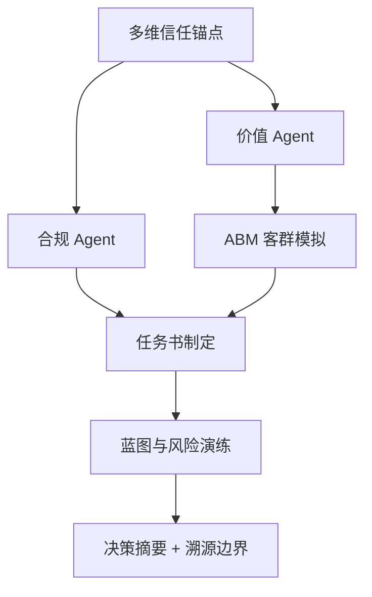

# DDS Agent v2 决策推演报告

## 输入假设
- 地块输入：{'city': '杭州', 'district': '拱墅区', 'address': '杭州市拱墅区祥泰街398号', 'lng': 120.16234, 'lat': 30.32891}
- 客户目标：{'product_type': '改善产品', 'floor_area_ratio': 2.5, 'benchmark': '英蓝岫町华庭', 'total_units': 200}

## 决策逻辑图


## CEO 权重引擎 / 综合评分
**preset**: invest
**total_score**: 58.7 / 100
**grade**: B+
**overall_confidence**: 0.73
**interpretation**: 置信度较高，模型输入充分、内部一致。 综合得分中等，建议先补齐一级法定硬约束 + 客群校验后再决策。

| Agent | 原始评分 | 置信度 | 权重 | 贡献分 | 评分分布 |
|---|---:|---:|---:|---:|:---:|
| compliance | 55.0 | 0.5 | 0.3 | 8.25 | `[======----]` |
| value | 81.4 | 1.0 | 0.2 | 16.29 | `[========--]` |
| abm | 100 | 1.0 | 0.15 | 15.0 | `[==========]` |
| unit_mix | 99.8 | 0.7 | 0.15 | 10.47 | `[==========]` |
| migration | 78.1 | 0.65 | 0.1 | 5.08 | `[========--]` |
| blueprint | 60 | 0.6 | 0.1 | 3.6 | `[======----]` |

## 决策摘要
- 结论：可进入投拓测算，但需先补齐一级法定硬约束后才能定最终拿地价。
- 拿地敏感区间：{'conservative': 25506.0, 'balanced': 30061.0, 'aggressive': 34615.0, 'unit': '元/㎡土地口径粗算'}
- 核心机会：对标项目显著高于周边均价，说明存在稀缺资源或强产品力溢价，但需要验证成交真实性和去化速度。
- 硬性阻断：暂无，但一级硬约束仍需补齐

## L3级线上舆情校验与交叉比对
| 舆情来源 | 爆料时间 | 爆料摘要 | 关联校验匹配 | 关联度得分 | 校验结论 |
| :--- | :--- | :--- | :--- | :--- | :--- |
| 三亚海棠湾高端市场2026Q1报告 | 2026-03-31 | 海棠湾商墅产品2026年Q1成交均价约85000元/㎡，去化周期约14个月。高端康养客群为主要买家。 | 概念匹配 | 0.2 | ⚠️ 弱相关，仅供参考 |


## Data Foundation
```json
{
  "level_1_legal_constraints": {
    "status": "missing_level_1_constraints",
    "trust_weight": 1.0,
    "available": false,
    "required_before_final_pricing": [
      "容积率上限",
      "用地性质",
      "限高",
      "退线",
      "绿地率",
      "车位指标",
      "商业比例",
      "产权/分割销售口径"
    ]
  },
  "level_2_gis_physical": {
    "status": "available",
    "trust_weight": 0.7,
    "nearest_poi": {},
    "competitor_sample_count": 15
  },
  "level_3_market_sentiment": {
    "status": "online_supplement_available",
    "trust_weight": 0.35,
    "proxy_signals": {
      "product_type": "改善产品",
      "benchmark": "英蓝岫町华庭",
      "room_type_supply": {},
      "note": "当前用竞品标签、户型结构、对标项目价格作为三级情绪/非标溢价的弱代理。"
    },
    "online_evidence": [
      {
        "query": "三亚海棠湾商墅",
        "title": "三亚海棠湾高端市场2026Q1报告",
        "url": "https://example.com/sanya-report",
        "summary": "海棠湾商墅产品2026年Q1成交均价约85000元/㎡，去化周期约14个月。高端康养客群为主要买家。",
        "data_date": "2026-03-31",
        "confidence": "supplemental",
        "captured_at": "2026-05-12T18:32:14",
        "role": "online_supplement_only",
        "cross_check_score": 0.2,
        "cross_check_matches": [
          "概念匹配"
        ],
        "is_highly_relevant": false
      }
    ]
  }
}
```

## Compliance Agent
```json
{
  "role": "合规 Agent",
  "verdict": "conditional",
  "hard_constraints_missing": [
    "容积率上限",
    "用地性质",
    "限高",
    "退线",
    "绿地率",
    "车位指标",
    "商业比例",
    "产权/分割销售口径"
  ],
  "warnings": [
    "容积率 2.5 是客户假设，尚未由出让合同或控规文件确认。",
    "缺少一级法定硬约束，当前只能输出投拓初判，不能作为最终拿地价。"
  ],
  "blockers": [],
  "pricing_boundary": "只能给楼面地价敏感区间，最终价格需等一级数据校准。"
}
```

## Value Agent
```json
{
  "role": "价值 Agent",
  "market_avg_price_cny": 36437,
  "benchmark": {
    "project_name": "英蓝岫町华庭",
    "unit_price_cny": 119999,
    "area_range": "180-240㎡",
    "room_types": "3/5室",
    "district": "拱墅区"
  },
  "benchmark_premium_ratio": 3.29,
  "opportunities": [
    "对标项目显著高于周边均价，说明存在稀缺资源或强产品力溢价，但需要验证成交真实性和去化速度。",
    "客户目标产品为改善产品，应优先验证低密、私密性、到达仪式感和景观资源是否能支撑溢价。"
  ],
  "product_reference": {
    "observed_area_ranges": [
      "180-240㎡",
      "300-301㎡",
      "108-166㎡",
      "105-172㎡",
      "37-43㎡",
      "139-190㎡",
      "104-140㎡",
      "103-139㎡",
      "96-126㎡",
      "99-139㎡",
      "49-95㎡",
      "40-136㎡"
    ],
    "observed_room_types": [
      "3/5室",
      "5室",
      "3/4室",
      "3/4/5室",
      "2室",
      "4/5室",
      "3/4室",
      "3/4室",
      "3/4室",
      "3/4室",
      "1/2/3室",
      "1/2/3室"
    ],
    "top_price_projects": [
      {
        "project_name": "英蓝岫町华庭",
        "price": 119999,
        "area_range": "180-240㎡",
        "room_types": "3/5室"
      },
      {
        "project_name": "滨融府新象·lightart",
        "price": 45000,
        "area_range": "300-301㎡",
        "room_types": "5室"
      },
      {
        "project_name": "绿城熙岸晓月轩",
        "price": 38977,
        "area_range": "108-166㎡",
        "room_types": "3/4室"
      },
      {
        "project_name": "伟星星宜嘉映府",
        "price": 36773,
        "area_range": "105-172㎡",
        "room_types": "3/4/5室"
      },
      {
        "project_name": "绿城凤咏朝阳",
        "price": 36000,
        "area_range": "",
        "room_types": ""
      }
    ]
  },
  "vector_evidence": {
    "status": "ok",
    "source": "vault_fallback",
    "collection": "Vault CSV (近 5 年)",
    "items": [
      {
        "text": "2025年 · 凤银河小区 (拱墅区) · 36427 元/㎡ · 108-166㎡ · 绿城集团",
        "metadata": {
          "year": 2025,
          "project_name": "凤银河小区",
          "district": "拱墅区",
          "address": "杭州拱墅区运河新城平安桥路与拱康路交汇处",
          "unit_price": 36427,
          "area_range": "108-166㎡",
          "developer": "绿城集团",
          "price_distance": 0.0,
          "product_match": false
        }
      },
      {
        "text": "2025年 · 博幸福阁 (萧山区) · 36448 元/㎡ · 59-70㎡ · 路劲",
        "metadata": {
          "year": 2025,
          "project_name": "博幸福阁",
          "district": "萧山区",
          "address": "杭州萧山区钱江世纪城市心北路与奔竞大道交叉口",
          "unit_price": 36448,
          "area_range": "59-70㎡",
          "developer": "路劲",
          "price_distance": 0.0,
          "product_match": false
        }
      },
      {
        "text": "2022年 · 悦碧水台 (拱墅区) · 36466 元/㎡ · 138-194㎡ · 滨江集团",
        "metadata": {
          "year": 2022,
          "project_name": "悦碧水台",
          "district": "拱墅区",
          "address": "杭州拱墅区三塘灯塔巷与新西路交叉口（观成武林学校东侧）",
          "unit_price": 36466,
          "area_range": "138-194㎡",
          "developer": "滨江集团",
          "price_distance": 0.001,
          "product_match": false
        }
      },
      {
        "text": "2022年 · 天琅府 (萧山区) · 36400 元/㎡ · 98-173㎡ · 融信地产,龙湖地产",
        "metadata": {
          "year": 2022,
          "project_name": "天琅府",
          "district": "萧山区",
          "address": "杭州萧山区萧山新城金城路与通惠路交汇处",
          "unit_price": 36400,
          "area_range": "98-173㎡",
          "developer": "融信地产,龙湖地产",
          "price_distance": 0.001,
          "product_match": false
        }
      },
      {
        "text": "2021年 · 锦尚乐居翠苑 (拱墅区) · 36382 元/㎡ · 112-185㎡ · 保利集团,越秀地产,滨江集团",
        "metadata": {
          "year": 2021,
          "project_name": "锦尚乐居翠苑",
          "district": "拱墅区",
          "address": "杭州拱墅区文晖绍兴路和王马路交叉口东南侧",
          "unit_price": 36382,
          "area_range": "112-185㎡",
          "developer": "保利集团,越秀地产,滨江集团",
          "price_distance": 0.002,
          "product_match": false
        }
      }
    ],
    "note": "chromadb 未配置或无数据，使用 Vault 价格相似度兜底"
  },
  "online_cross_check": {
    "status": "supplemental_only",
    "source_count": 1,
    "sources": [
      {
        "query": "三亚海棠湾商墅",
        "title": "三亚海棠湾高端市场2026Q1报告",
        "url": "https://example.com/sanya-report",
        "summary": "海棠湾商墅产品2026年Q1成交均价约85000元/㎡，去化周期约14个月。高端康养客群为主要买家。",
        "data_date": "2026-03-31",
        "confidence": "supplemental",
        "captured_at": "2026-05-12T18:32:14",
        "role": "online_supplement_only",
        "cross_check_score": 0.2,
        "cross_check_matches": [
          "概念匹配"
        ],
        "is_highly_relevant": false
      }
    ]
  }
}
```

## 类似地块证据（向量库/Vault 兜底）
**来源**: vault_fallback · Vault CSV (近 5 年)  
_chromadb 未配置或无数据，使用 Vault 价格相似度兜底_  

| # | 项目 | 区域 | 年份 | 单价 | 面积段 | 开发商 | 相似度 |
|---:|---|---|---:|---:|---|---|---:|
| 1 | 凤银河小区 | 拱墅区 | 2025 | 36427 | 108-166㎡ | 绿城集团 | — |
| 2 | 博幸福阁 | 萧山区 | 2025 | 36448 | 59-70㎡ | 路劲 | — |
| 3 | 悦碧水台 | 拱墅区 | 2022 | 36466 | 138-194㎡ | 滨江集团 | — |
| 4 | 天琅府 | 萧山区 | 2022 | 36400 | 98-173㎡ | 融信地产,龙湖地产 | — |
| 5 | 锦尚乐居翠苑 | 拱墅区 | 2021 | 36382 | 112-185㎡ | 保利集团,越秀地产,滨江集团 | — |

## ABM Market Agent
```json
{
  "role": "ABM 市场模拟 Agent",
  "method": "Random Utility + MNL，蒙特卡洛 N=1000",
  "city": "杭州",
  "product": {
    "name": "改善产品",
    "unit_price": 36437,
    "area": 140,
    "pref_score": {
      "景观": 0.65,
      "私密": 0.55,
      "圈层": 0.55,
      "户型": 0.85,
      "通勤": 0.65,
      "学校": 0.7,
      "品牌": 0.6
    }
  },
  "n_personas": 1000,
  "avg_buy_probability": 0.558,
  "top_personas": [
    {
      "name": "互联网工程师",
      "share": 0.387,
      "raw_count": 336,
      "score": 64.3,
      "wtp_p50": 43071.0,
      "wtp_p90": 53125.0
    },
    {
      "name": "本地改善",
      "share": 0.255,
      "raw_count": 263,
      "score": 54.2,
      "wtp_p50": 31081.0,
      "wtp_p90": 48563.0
    },
    {
      "name": "浙商投资",
      "share": 0.23,
      "raw_count": 208,
      "score": 61.6,
      "wtp_p50": 51418.0,
      "wtp_p90": 52027.0
    }
  ],
  "personas": [
    {
      "name": "互联网工程师",
      "share": 0.387,
      "raw_count": 336,
      "score": 64.3,
      "wtp_p50": 43071.0,
      "wtp_p90": 53125.0
    },
    {
      "name": "本地改善",
      "share": 0.255,
      "raw_count": 263,
      "score": 54.2,
      "wtp_p50": 31081.0,
      "wtp_p90": 48563.0
    },
    {
      "name": "浙商投资",
      "share": 0.23,
      "raw_count": 208,
      "score": 61.6,
      "wtp_p50": 51418.0,
      "wtp_p90": 52027.0
    },
    {
      "name": "学区刚需",
      "share": 0.089,
      "raw_count": 141,
      "score": 35.4,
      "wtp_p50": 22742.0,
      "wtp_p90": 39396.0
    },
    {
      "name": "人才落户",
      "share": 0.038,
      "raw_count": 52,
      "score": 41.2,
      "wtp_p50": 25144.0,
      "wtp_p90": 44656.0
    }
  ],
  "wtp_distribution": [
    {
      "range": "4531-9463",
      "count": 27
    },
    {
      "range": "9463-14395",
      "count": 37
    },
    {
      "range": "14395-19326",
      "count": 69
    },
    {
      "range": "19326-24258",
      "count": 97
    },
    {
      "range": "24258-29189",
      "count": 95
    },
    {
      "range": "29189-34121",
      "count": 98
    },
    {
      "range": "34121-39052",
      "count": 86
    },
    {
      "range": "39052-43984",
      "count": 93
    },
    {
      "range": "43984-48916",
      "count": 64
    },
    {
      "range": "48916-53847",
      "count": 334
    }
  ],
  "wtp_summary": {
    "p10": 17212.0,
    "p50": 38115.0,
    "p90": 52463.0,
    "unit": "元/㎡"
  },
  "sellthrough_curve": [
    {
      "month": 1,
      "monthly_sales": 22.3,
      "cumulative": 22.3
    },
    {
      "month": 2,
      "monthly_sales": 22.3,
      "cumulative": 44.7
    },
    {
      "month": 3,
      "monthly_sales": 22.3,
      "cumulative": 67.0
    },
    {
      "month": 4,
      "monthly_sales": 22.3,
      "cumulative": 89.3
    },
    {
      "month": 5,
      "monthly_sales": 22.3,
      "cumulative": 111.6
    },
    {
      "month": 6,
      "monthly_sales": 15.6,
      "cumulative": 127.3
    },
    {
      "month": 7,
      "monthly_sales": 15.6,
      "cumulative": 142.9
    },
    {
      "month": 8,
      "monthly_sales": 15.6,
      "cumulative": 158.5
    },
    {
      "month": 9,
      "monthly_sales": 15.6,
      "cumulative": 174.1
    },
    {
      "month": 10,
      "monthly_sales": 15.6,
      "cumulative": 189.8
    },
    {
      "month": 11,
      "monthly_sales": 15.6,
      "cumulative": 205.4
    },
    {
      "month": 12,
      "monthly_sales": 10.9,
      "cumulative": 216.3
    },
    {
      "month": 13,
      "monthly_sales": 10.9,
      "cumulative": 227.3
    },
    {
      "month": 14,
      "monthly_sales": 10.9,
      "cumulative": 238.2
    },
    {
      "month": 15,
      "monthly_sales": 10.9,
      "cumulative": 249.2
    },
    {
      "month": 16,
      "monthly_sales": 10.9,
      "cumulative": 260.1
    },
    {
      "month": 17,
      "monthly_sales": 10.9,
      "cumulative": 271.0
    },
    {
      "month": 18,
      "monthly_sales": 7.7,
      "cumulative": 278.7
    },
    {
      "month": 19,
      "monthly_sales": 7.7,
      "cumulative": 286.4
    },
    {
      "month": 20,
      "monthly_sales": 7.7,
      "cumulative": 294.0
    },
    {
      "month": 21,
      "monthly_sales": 7.7,
      "cumulative": 301.7
    },
    {
      "month": 22,
      "monthly_sales": 7.7,
      "cumulative": 309.3
    },
    {
      "month": 23,
      "monthly_sales": 7.7,
      "cumulative": 317.0
    },
    {
      "month": 24,
      "monthly_sales": 5.4,
      "cumulative": 322.4
    }
  ],
  "price_sensitivity": [
    {
      "price_delta": "-10%",
      "avg_buy_prob": 0.603,
      "vs_base_pct": 8.0
    },
    {
      "price_delta": "-5%",
      "avg_buy_prob": 0.584,
      "vs_base_pct": 4.6
    },
    {
      "price_delta": "+5%",
      "avg_buy_prob": 0.543,
      "vs_base_pct": -2.8
    },
    {
      "price_delta": "+10%",
      "avg_buy_prob": 0.522,
      "vs_base_pct": -6.4
    }
  ],
  "confidence": {
    "score": 1.0,
    "level": "高",
    "note": "MVP 阶段使用合成人口分布，L1 真实成交数据接入后置信度可升至 0.9+"
  },
  "top_pains": [
    {
      "pain": "人车不分流",
      "weight": 0.178,
      "raw_score": 219.9
    },
    {
      "pain": "车位常年靠抢",
      "weight": 0.112,
      "raw_score": 138.5
    },
    {
      "pain": "老人爬楼梯不便",
      "weight": 0.112,
      "raw_score": 138.5
    },
    {
      "pain": "户型动静不分区导致孩子学习经常受到打扰",
      "weight": 0.112,
      "raw_score": 138.5
    },
    {
      "pain": "地级市优质医疗高端商业贫瘠",
      "weight": 0.103,
      "raw_score": 127.2
    }
  ],
  "top_details": [
    {
      "need": "必须带朝南超宽双阳台",
      "weight": 0.12,
      "raw_score": 219.9
    },
    {
      "need": "主卫干湿分离",
      "weight": 0.12,
      "raw_score": 219.9
    },
    {
      "need": "预留独立书房/电竞办公舱",
      "weight": 0.12,
      "raw_score": 219.9
    },
    {
      "need": "配全屋智能家居控制系统",
      "weight": 0.12,
      "raw_score": 219.9
    },
    {
      "need": "户型动静分区",
      "weight": 0.076,
      "raw_score": 138.5
    }
  ],
  "temporal_consistency": {
    "status": "ok",
    "consistency_score": 1.0,
    "level": "高",
    "ref_years": [
      2015,
      2020,
      2024
    ],
    "snapshots": [
      {
        "year": 2015,
        "top3": [
          "浙商投资",
          "本地改善",
          "互联网工程师"
        ],
        "n_samples": 400
      },
      {
        "year": 2020,
        "top3": [
          "浙商投资",
          "本地改善",
          "互联网工程师"
        ],
        "n_samples": 400
      },
      {
        "year": 2024,
        "top3": [
          "浙商投资",
          "本地改善",
          "互联网工程师"
        ],
        "n_samples": 400
      }
    ],
    "interpretation": "2015-2024 跨年度 top3 客群高度重合（100%），模型稳定，预测可信。"
  }
}
```

## 客群语义画像（痛点 + 细节需求）
_来自 N=1000 个真实虚拟样本的购房意愿加权聚合_  

### 核心居住痛点

| 排名 | 痛点 | 权重 | 影响权重图表 |
|---:|---|---:|:---:|
| 1 | 人车不分流 | 17.8% | `[==========]` |
| 2 | 车位常年靠抢 | 11.2% | `[======----]` |
| 3 | 老人爬楼梯不便 | 11.2% | `[======----]` |
| 4 | 户型动静不分区导致孩子学习经常受到打扰 | 11.2% | `[======----]` |
| 5 | 地级市优质医疗高端商业贫瘠 | 10.3% | `[======----]` |

### 核心细节需求

| 排名 | 需求 | 权重 | 影响权重图表 |
|---:|---|---:|:---:|
| 1 | 必须带朝南超宽双阳台 | 12.0% | `[==========]` |
| 2 | 主卫干湿分离 | 12.0% | `[==========]` |
| 3 | 预留独立书房/电竞办公舱 | 12.0% | `[==========]` |
| 4 | 配全屋智能家居控制系统 | 12.0% | `[==========]` |
| 5 | 户型动静分区 | 7.6% | `[======----]` |

## 户型配比 Agent（反向匹配）
**方法**：反向匹配 v1（efu 最高户型分桶 + MNL）  
**总户数**：200  
**总预期销售额**：9.24 亿元  
**整体去化预估**：42.6 月  

| 户型 | 面积 | 单价 | 推荐套数 | 占比 | 占比图表 | 主力客群 | 预期销售额 |
|---|---:|---:|---:|---:|:---:|---|---:|
| 110㎡三房 | 110㎡ | 34615 | 130 | 65.0% | `[======----]` | 本地改善(33%), 互联网工程师(32%) | 4.95 亿 |
| 140㎡三房 | 140㎡ | 36437 | 30 | 15.2% | `[==--------]` | 互联网工程师(55%), 本地改善(34%) | 1.53 亿 |
| 180㎡大平层 | 180㎡ | 39352 | 39 | 19.7% | `[==--------]` | 浙商投资(79%), 互联网工程师(17%) | 2.76 亿 |

## 5 年客群迁移 Agent
**方法**：客群马尔可夫迁移 v1  
**累计退出率**：17.9%  

### 关键迁移 (Y0 → Y5)

| 客群 | Y0 | Y5 | 变化 | 趋势 |
|---|---:|---:|---:|---|
| 本地改善 | 26% | 44% | +18pp | 上升 |
| 互联网工程师 | 34% | 24% | -10pp | 下降 |
| 学区刚需 | 14% | 7% | -7pp | 下降 |
| 高净值康养 | 0% | 5% | +5pp | 上升 |

### 年度分布演化

| 年份 | Top 3 客群 |
|---:|---|
| Y0 | 互联网工程师 34%, 本地改善 26%, 浙商投资 21% |
| Y1 | 互联网工程师 31%, 本地改善 31%, 浙商投资 20% |
| Y2 | 本地改善 35%, 互联网工程师 29%, 浙商投资 20% |
| Y3 | 本地改善 38%, 互联网工程师 27%, 浙商投资 19% |
| Y4 | 本地改善 41%, 互联网工程师 26%, 浙商投资 18% |
| Y5 | 本地改善 44%, 互联网工程师 24%, 浙商投资 18% |

## 时间穿越 Agent（历史年份对比）
**城市**: 杭州  
**产品**: 改善产品  
**价格趋势**: 2010 → 2026 (7870 → 28049 元/㎡, 3.56× 增长，年化 CAGR 8.3%)

### 各年快照对比

| 年份 | 均价 | 平均买率 | WTP-p50 | Top3 客群 |
|---:|---:|---:|---:|---|
| Y2010 | 7870 | 0.087 | 2132.0 | 浙商投资 78% · 互联网工程师 10% · 本地改善 8% |
| Y2020 | 16298 | 0.502 | 12234.0 | 互联网工程师 38% · 浙商投资 26% · 本地改善 21% |
| Y2026 | 28049 | 0.726 | 35654.0 | 互联网工程师 35% · 本地改善 26% · 浙商投资 18% |

### 客群迁徙轨迹

| Archetype | Y2010 | Y2020 | Y2026 |
|---|---:|---:|---:|
| 浙商投资 | 78% | 26% | 18% |
| 互联网工程师 | 10% | 38% | 35% |
| 本地改善 | 8% | 21% | 26% |

## Briefing Engine
```json
{
  "role": "任务书制定 Agent",
  "product_positioning": "以改善产品为方向，先验证低密/私密/景观/康养服务是否支撑高端溢价。",
  "target_price_band": {
    "conservative": 30971.0,
    "balanced": 36437,
    "aggressive": 49190.0,
    "unit": "元/㎡"
  },
  "performance_brief": [
    "私密性等级：控制公共界面干扰，强化院落/入户/露台的边界感。",
    "视觉通透度：优先把景观面和主力功能空间绑定，避免只做符号化立面。",
    "垂直动线效率：低密产品需减少无效交通面积，保证可售效率。",
    "到达仪式感：车行、人行、会所或公共入口形成清晰等级。",
    "可售弹性：面积段要覆盖主力客群支付能力，避免只堆大面积高总价。",
    "服务配置：康养、度假、物业服务必须能被客户感知，否则不能计入溢价假设。",
    "【核心居住痛点对冲设计】",
    "  - 痛点 1：人车不分流 (加权占比 17.8%) ➔ 设计方案：提供专项户型治理/配套对冲策略。",
    "  - 痛点 2：车位常年靠抢 (加权占比 11.2%) ➔ 设计方案：提供专项户型治理/配套对冲策略。",
    "  - 痛点 3：老人爬楼梯不便 (加权占比 11.2%) ➔ 设计方案：提供专项户型治理/配套对冲策略。",
    "【核心看房细节需求攻坚】",
    "  - 细节 1：必须带朝南超宽双阳台 (加权占比 12.0%) ➔ 设计标准：深化图纸该专项细节，列入核心营销点。",
    "  - 细节 2：主卫干湿分离 (加权占比 12.0%) ➔ 设计标准：深化图纸该专项细节，列入核心营销点。",
    "  - 细节 3：预留独立书房/电竞办公舱 (加权占比 12.0%) ➔ 设计标准：深化图纸该专项细节，列入核心营销点。"
  ],
  "premium_hypotheses": [
    "品牌/稀缺资源/低密私密性可支撑溢价。",
    "普通商业配套和表层景观包装不应被高估为核心溢价。",
    "若一级合规数据不支持商墅口径，产品定位需立即切换。"
  ],
  "compliance_dependency": [
    "容积率上限",
    "用地性质",
    "限高",
    "退线",
    "绿地率",
    "车位指标",
    "商业比例",
    "产权/分割销售口径"
  ],
  "pain_hedging_guide": [
    "【核心居住痛点对冲设计】",
    "  - 痛点 1：人车不分流 (加权占比 17.8%) ➔ 设计方案：提供专项户型治理/配套对冲策略。",
    "  - 痛点 2：车位常年靠抢 (加权占比 11.2%) ➔ 设计方案：提供专项户型治理/配套对冲策略。",
    "  - 痛点 3：老人爬楼梯不便 (加权占比 11.2%) ➔ 设计方案：提供专项户型治理/配套对冲策略。",
    "【核心看房细节需求攻坚】",
    "  - 细节 1：必须带朝南超宽双阳台 (加权占比 12.0%) ➔ 设计标准：深化图纸该专项细节，列入核心营销点。",
    "  - 细节 2：主卫干湿分离 (加权占比 12.0%) ➔ 设计标准：深化图纸该专项细节，列入核心营销点。",
    "  - 细节 3：预留独立书房/电竞办公舱 (加权占比 12.0%) ➔ 设计标准：深化图纸该专项细节，列入核心营销点。"
  ]
}
```

## Blueprint Logic
```json
{
  "role": "蓝图与风险 Agent",
  "scenario_prices": {
    "conservative_sale_price": 34000,
    "base_sale_price": 36437,
    "benchmark_discount_sale_price": 89999.0
  },
  "land_value_sensitivity": {
    "conservative_land_value": 25506.0,
    "balanced_land_value": 30061.0,
    "aggressive_land_value": 34615.0,
    "unit": "元/㎡土地口径粗算",
    "floor_area_ratio": 2.5,
    "floor_area_ratio_source": "user_input"
  },
  "risk_curve": [
    {
      "risk": "政策风险",
      "level": "高",
      "trigger": "一级硬约束未补齐"
    },
    {
      "risk": "去化风险",
      "level": "中",
      "trigger": "当前预售价偏离客群WTP上限 96%"
    },
    {
      "risk": "回款瓶颈",
      "level": "中",
      "trigger": "加权首付比例仅 38%，过度依赖银行按揭放款节奏"
    },
    {
      "risk": "项目错配",
      "level": "中",
      "trigger": "商墅若总价过高，会压缩家庭旅居客群"
    }
  ],
  "absorption_simulation": {
    "total_units": 500,
    "sellout_months": 13.0,
    "monthly_absorption_rate_units": 38.6,
    "price_to_wtp_ratio": 0.96,
    "estimated_avg_dp_ratio": 0.38
  },
  "quarterly_cash_flow": {
    "inflows_wan": [
      19341.8,
      50633.7,
      50633.7,
      50633.7,
      37437.1,
      9942.1,
      0.0,
      0.0
    ],
    "outflows_wan": [
      83211.2,
      12826.0,
      12826.0,
      12826.0,
      11242.5,
      1193.0,
      0.0,
      0.0
    ],
    "net_cash_flow_wan": [
      -63869.3,
      37807.6,
      37807.6,
      37807.6,
      26194.7,
      8749.0,
      0.0,
      0.0
    ]
  },
  "financial_indicator": {
    "simulated_irr_annual": "340.41%",
    "irr_level": "高",
    "note": "项目年化模拟 IRR 表现优异，可强力推进"
  },
  "next_data_required": [
    "出让合同/控规图则",
    "可售面积和计容口径",
    "建安成本",
    "税费和融资成本",
    "目标利润率",
    "竞品真实成交/去化速度"
  ]
}
```

## Traceability / 数据边界
```json
{
  "parcel_report_meta": {
    "generated_at": "2026-05-28",
    "data_scope": "真实拱墅区竞品 N=15"
  },
  "source_scope": "真实拱墅区竞品 N=15",
  "location": {
    "city": "杭州",
    "district": "拱墅区",
    "lng": 120.16234,
    "lat": 30.32891
  },
  "evidence_counts": {
    "nearby_competitors": 15,
    "amenity_categories": 0
  },
  "trust_weights": {
    "level_1": 1.0,
    "level_2": 0.7,
    "level_3": 0.35
  },
  "online_sources": {
    "status": "supplemental_available",
    "count": 1,
    "items": [
      {
        "query": "三亚海棠湾商墅",
        "title": "三亚海棠湾高端市场2026Q1报告",
        "url": "https://example.com/sanya-report",
        "summary": "海棠湾商墅产品2026年Q1成交均价约85000元/㎡，去化周期约14个月。高端康养客群为主要买家。",
        "data_date": "2026-03-31",
        "confidence": "supplemental",
        "captured_at": "2026-05-12T18:32:14",
        "role": "online_supplement_only",
        "cross_check_score": 0.2,
        "cross_check_matches": [
          "概念匹配"
        ],
        "is_highly_relevant": false
      }
    ]
  }
}
```

