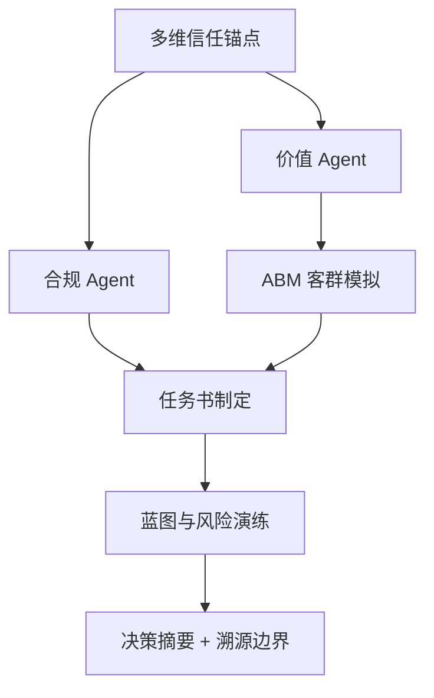

# DDS Agent v2 决策推演报告

## 输入假设
- 地块输入：{'address': '杭州市拱墅区祥泰街398号', 'lng': 120.25663619031, 'lat': 29.999853775164, 'district': 'proxy', 'vision': None}
- 客户目标：{'product_type': '改善产品', 'benchmark': None, 'expected_price': None, 'floor_area_ratio': 2.0, 'year': 2026}

## 决策逻辑图


## CEO 权重引擎 / 综合评分
**preset**: invest
**total_score**: 23.8 / 100
**grade**: D
**overall_confidence**: 0.51
**interpretation**: 置信度中等，可作为决策辅助，重要环节仍需人工复核。 综合得分偏低，需重新评估产品定位、地块价值或拿地价区间。

| Agent | 原始评分 | 置信度 | 权重 | 贡献分 | 评分分布 |
|---|---:|---:|---:|---:|:---:|
| compliance | 55.0 | 0.5 | 0.3 | 8.25 | `[======----]` |
| value | 45.4 | 1.0 | 0.2 | 9.08 | `[=====-----]` |
| abm | 30.0 | 0.3 | 0.15 | 1.35 | `[===-------]` |
| unit_mix | 0.0 | 0.2 | 0.15 | 0.0 | `[----------]` |
| migration | 50.0 | 0.3 | 0.1 | 1.5 | `[=====-----]` |
| blueprint | 60 | 0.6 | 0.1 | 3.6 | `[======----]` |

## 决策摘要
- 结论：可进入投拓测算，但需先补齐一级法定硬约束后才能定最终拿地价。
- 拿地敏感区间：{'conservative': 8612.0, 'balanced': 10149.0, 'aggressive': 11687.0, 'unit': '元/㎡土地口径粗算'}
- 核心机会：客户目标产品为改善产品，应优先验证低密、私密性、到达仪式感和景观资源是否能支撑溢价。
- 硬性阻断：暂无，但一级硬约束仍需补齐

## L3级线上舆情校验与交叉比对
| 舆情来源 | 爆料时间 | 爆料摘要 | 关联校验匹配 | 关联度得分 | 校验结论 |
| :--- | :--- | :--- | :--- | :--- | :--- |
| 三亚海棠湾高端市场2026Q1报告 | 2026-03-31 | 海棠湾商墅产品2026年Q1成交均价约85000元/㎡，去化周期约14个月。高端康养客群为主要买家。 | 概念匹配 | 0.2 | ⚠️ 弱相关，仅供参考 |


## Data Foundation
```json
{
  "level_1_legal_constraints": {
    "status": "missing_level_1_constraints",
    "trust_weight": 1.0,
    "available": false,
    "required_before_final_pricing": [
      "容积率上限",
      "用地性质",
      "限高",
      "退线",
      "绿地率",
      "车位指标",
      "商业比例",
      "产权/分割销售口径"
    ]
  },
  "level_2_gis_physical": {
    "status": "available",
    "trust_weight": 0.7,
    "nearest_poi": {},
    "competitor_sample_count": 12
  },
  "level_3_market_sentiment": {
    "status": "online_supplement_available",
    "trust_weight": 0.35,
    "proxy_signals": {
      "product_type": "改善产品",
      "benchmark": null,
      "room_type_supply": {
        "4室户型": 10,
        "3室户型": 9,
        "别墅户型": 4,
        "2室户型": 3,
        "1室户型": 2,
        "5室户型": 1
      },
      "note": "当前用竞品标签、户型结构、对标项目价格作为三级情绪/非标溢价的弱代理。"
    },
    "online_evidence": [
      {
        "query": "三亚海棠湾商墅",
        "title": "三亚海棠湾高端市场2026Q1报告",
        "url": "https://example.com/sanya-report",
        "summary": "海棠湾商墅产品2026年Q1成交均价约85000元/㎡，去化周期约14个月。高端康养客群为主要买家。",
        "data_date": "2026-03-31",
        "confidence": "supplemental",
        "captured_at": "2026-05-12T18:32:14",
        "role": "online_supplement_only",
        "cross_check_score": 0.2,
        "cross_check_matches": [
          "概念匹配"
        ],
        "is_highly_relevant": false
      }
    ]
  }
}
```

## Compliance Agent
```json
{
  "role": "合规 Agent",
  "verdict": "conditional",
  "hard_constraints_missing": [
    "容积率上限",
    "用地性质",
    "限高",
    "退线",
    "绿地率",
    "车位指标",
    "商业比例",
    "产权/分割销售口径"
  ],
  "warnings": [
    "容积率 2.0 是客户假设，尚未由出让合同或控规文件确认。",
    "缺少一级法定硬约束，当前只能输出投拓初判，不能作为最终拿地价。"
  ],
  "blockers": [],
  "pricing_boundary": "只能给楼面地价敏感区间，最终价格需等一级数据校准。"
}
```

## Value Agent
```json
{
  "role": "价值 Agent",
  "market_avg_price_cny": 15378.0,
  "benchmark": null,
  "benchmark_premium_ratio": null,
  "opportunities": [
    "客户目标产品为改善产品，应优先验证低密、私密性、到达仪式感和景观资源是否能支撑溢价。"
  ],
  "product_reference": {
    "observed_area_ranges": [
      "59-166㎡",
      "100-138㎡",
      "138-279㎡",
      "89-120㎡",
      "59-330㎡",
      "89-120㎡",
      "138-279㎡",
      "89-158㎡",
      "95-130㎡",
      "89-120㎡",
      "91-129㎡",
      "91-129㎡"
    ],
    "observed_room_types": [
      "1室户型,2室户型,3室户型,4室户型,5室户型,别墅户型",
      "3室户型,4室户型",
      "别墅户型",
      "3室户型,4室户型",
      "2室户型,4室户型,别墅户型",
      "3室户型,4室户型",
      "别墅户型",
      "1室户型,2室户型,3室户型,4室户型",
      "3室户型,4室户型",
      "3室户型,4室户型",
      "3室户型,4室户型",
      "3室户型,4室户型"
    ],
    "top_price_projects": [
      {
        "project_name": "滨江交投临澜之城",
        "price": 17000.0,
        "area_range": "100-138㎡",
        "room_types": "3室户型,4室户型"
      },
      {
        "project_name": "旭辉珺和府",
        "price": 14600.0,
        "area_range": "89-120㎡",
        "room_types": "3室户型,4室户型"
      },
      {
        "project_name": "融创森与海之城",
        "price": 14533.0,
        "area_range": "59-166㎡",
        "room_types": "1室户型,2室户型,3室户型,4室户型,5室户型,别墅户型"
      }
    ]
  },
  "vector_evidence": {
    "status": "skipped",
    "reason": "no_city",
    "items": []
  },
  "online_cross_check": {
    "status": "supplemental_only",
    "source_count": 1,
    "sources": [
      {
        "query": "三亚海棠湾商墅",
        "title": "三亚海棠湾高端市场2026Q1报告",
        "url": "https://example.com/sanya-report",
        "summary": "海棠湾商墅产品2026年Q1成交均价约85000元/㎡，去化周期约14个月。高端康养客群为主要买家。",
        "data_date": "2026-03-31",
        "confidence": "supplemental",
        "captured_at": "2026-05-12T18:32:14",
        "role": "online_supplement_only",
        "cross_check_score": 0.2,
        "cross_check_matches": [
          "概念匹配"
        ],
        "is_highly_relevant": false
      }
    ]
  }
}
```

## 类似地块证据（向量库/Vault 兜底）
_向量证据未启用：no_city_

## ABM Market Agent
```json
{
  "role": "ABM 市场模拟 Agent",
  "status": "city_not_configured",
  "error": "未配置城市客群池：None",
  "personas": [],
  "top_personas": []
}
```

## 客群语义画像（痛点 + 细节需求）
_客群语义字段尚未接入_

## 户型配比 Agent（反向匹配）
_户型配比 Agent 未执行：城市未配置 ABM_

## 5 年客群迁移 Agent
_5 年迁移 Agent 未执行_

## 时间穿越 Agent（历史年份对比）
_时间穿越未执行_

## Briefing Engine
```json
{
  "role": "任务书制定 Agent",
  "product_positioning": "以改善产品为方向，先验证低密/私密/景观/康养服务是否支撑高端溢价。",
  "target_price_band": {
    "conservative": 13071.0,
    "balanced": 15378.0,
    "aggressive": 18454.0,
    "unit": "元/㎡"
  },
  "performance_brief": [
    "私密性等级：控制公共界面干扰，强化院落/入户/露台的边界感。",
    "视觉通透度：优先把景观面和主力功能空间绑定，避免只做符号化立面。",
    "垂直动线效率：低密产品需减少无效交通面积，保证可售效率。",
    "到达仪式感：车行、人行、会所或公共入口形成清晰等级。",
    "可售弹性：面积段要覆盖主力客群支付能力，避免只堆大面积高总价。",
    "服务配置：康养、度假、物业服务必须能被客户感知，否则不能计入溢价假设。"
  ],
  "premium_hypotheses": [
    "品牌/稀缺资源/低密私密性可支撑溢价。",
    "普通商业配套和表层景观包装不应被高估为核心溢价。",
    "若一级合规数据不支持商墅口径，产品定位需立即切换。"
  ],
  "compliance_dependency": [
    "容积率上限",
    "用地性质",
    "限高",
    "退线",
    "绿地率",
    "车位指标",
    "商业比例",
    "产权/分割销售口径"
  ],
  "pain_hedging_guide": []
}
```

## Blueprint Logic
```json
{
  "role": "蓝图与风险 Agent",
  "scenario_prices": {
    "conservative_sale_price": 14600.0,
    "base_sale_price": 15378.0,
    "benchmark_discount_sale_price": null
  },
  "land_value_sensitivity": {
    "conservative_land_value": 8612.0,
    "balanced_land_value": 10149.0,
    "aggressive_land_value": 11687.0,
    "unit": "元/㎡土地口径粗算",
    "floor_area_ratio": 2.0,
    "floor_area_ratio_source": "user_input"
  },
  "risk_curve": [
    {
      "risk": "政策风险",
      "level": "高",
      "trigger": "一级硬约束未补齐"
    },
    {
      "risk": "去化风险",
      "level": "中",
      "trigger": "当前预售价偏离客群WTP上限 51%"
    },
    {
      "risk": "回款瓶颈",
      "level": "中",
      "trigger": "加权首付比例仅 40%，过度依赖银行按揭放款节奏"
    },
    {
      "risk": "项目错配",
      "level": "中",
      "trigger": "商墅若总价过高，会压缩家庭旅居客群"
    }
  ],
  "absorption_simulation": {
    "total_units": 500,
    "sellout_months": 10.1,
    "monthly_absorption_rate_units": 49.7,
    "price_to_wtp_ratio": 0.51,
    "estimated_avg_dp_ratio": 0.4
  },
  "quarterly_cash_flow": {
    "inflows_wan": [
      11002.4,
      27506.0,
      27506.0,
      20403.6,
      5850.0,
      0.0,
      0.0,
      0.0
    ],
    "outflows_wan": [
      35459.4,
      10050.7,
      10050.7,
      9198.4,
      7452.0,
      0.0,
      0.0,
      0.0
    ],
    "net_cash_flow_wan": [
      -24457.0,
      17455.3,
      17455.3,
      11205.2,
      -1602.0,
      0.0,
      0.0,
      0.0
    ]
  },
  "financial_indicator": {
    "simulated_irr_annual": "307.06%",
    "irr_level": "高",
    "note": "项目年化模拟 IRR 表现优异，可强力推进"
  },
  "next_data_required": [
    "出让合同/控规图则",
    "可售面积和计容口径",
    "建安成本",
    "税费和融资成本",
    "目标利润率",
    "竞品真实成交/去化速度"
  ]
}
```

## Traceability / 数据边界
```json
{
  "parcel_report_meta": {
    "generated_at": "2026-05-28T15:20:00",
    "target_year": 2026,
    "data_timestamp": "2026-05-27T11:26:14",
    "data_age_days": 1,
    "data_freshness_warning": null,
    "amap_js_key": "1b7f1d2c1a5af932034f72d4ea602283",
    "amap_security_code": "da9ef9ab78e157501fd7f27d08656860",
    "local_data": {
      "total_projects": 16246,
      "csv_files": [
        "三亚（新楼盘-三亚.csv）",
        "上海（新楼盘-上海.csv）",
        "杭州（新楼盘-杭州.csv）",
        "青岛（新楼盘-青岛.csv）"
      ],
      "active_city": "杭州",
      "csv_file": "杭州.csv",
      "csv_mtime": "2026-05-27T11:26:14",
      "data_age_days": 1,
      "data_freshness_warning": null
    }
  },
  "source_scope": "本地样本",
  "location": {},
  "evidence_counts": {
    "nearby_competitors": 12,
    "amenity_categories": 7
  },
  "trust_weights": {
    "level_1": 1.0,
    "level_2": 0.7,
    "level_3": 0.35
  },
  "online_sources": {
    "status": "supplemental_available",
    "count": 1,
    "items": [
      {
        "query": "三亚海棠湾商墅",
        "title": "三亚海棠湾高端市场2026Q1报告",
        "url": "https://example.com/sanya-report",
        "summary": "海棠湾商墅产品2026年Q1成交均价约85000元/㎡，去化周期约14个月。高端康养客群为主要买家。",
        "data_date": "2026-03-31",
        "confidence": "supplemental",
        "captured_at": "2026-05-12T18:32:14",
        "role": "online_supplement_only",
        "cross_check_score": 0.2,
        "cross_check_matches": [
          "概念匹配"
        ],
        "is_highly_relevant": false
      }
    ]
  }
}
```

