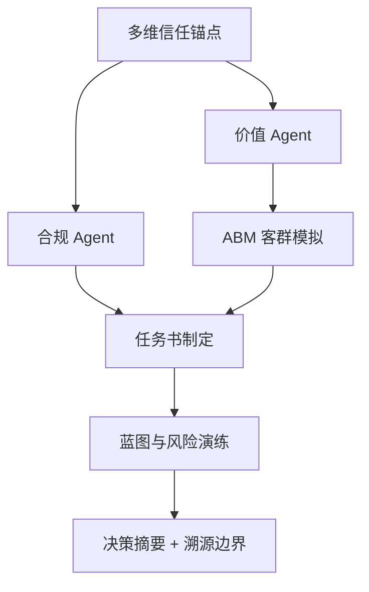

# DDS Agent v2 决策推演报告

## 输入假设
- 地块输入：{'city': '上海', 'address': '121.513349,31.243118', 'lng': 121.513349, 'lat': 31.243118, 'district': None, 'vision': None}
- 客户目标：{'product_type': '改善产品', 'benchmark': None, 'expected_price': None, 'floor_area_ratio': 2.0, 'year': 2026}

## 决策逻辑图


## CEO 权重引擎 / 综合评分
**preset**: invest
**total_score**: 58.7 / 100
**grade**: B+
**overall_confidence**: 0.73
**interpretation**: 置信度较高，模型输入充分、内部一致。 综合得分中等，建议先补齐一级法定硬约束 + 客群校验后再决策。

| Agent | 原始评分 | 置信度 | 权重 | 贡献分 | 评分分布 |
|---|---:|---:|---:|---:|:---:|
| compliance | 55.0 | 0.5 | 0.3 | 8.25 | `[======----]` |
| value | 85.0 | 1.0 | 0.2 | 17.0 | `[========--]` |
| abm | 100 | 1.0 | 0.15 | 15.0 | `[==========]` |
| unit_mix | 100 | 0.7 | 0.15 | 10.5 | `[==========]` |
| migration | 76.9 | 0.65 | 0.1 | 5.0 | `[========--]` |
| blueprint | 50 | 0.6 | 0.1 | 3.0 | `[=====-----]` |

## 决策摘要
- 结论：可进入投拓测算，但需先补齐一级法定硬约束后才能定最终拿地价。
- 拿地敏感区间：{'conservative': 74560.0, 'balanced': 87874.0, 'aggressive': 101189.0, 'unit': '元/㎡土地口径粗算'}
- 核心机会：客户目标产品为改善产品，应优先验证低密、私密性、到达仪式感和景观资源是否能支撑溢价。
- 硬性阻断：暂无，但一级硬约束仍需补齐

## L3级线上舆情校验与交叉比对
| 舆情来源 | 爆料时间 | 爆料摘要 | 关联校验匹配 | 关联度得分 | 校验结论 |
| :--- | :--- | :--- | :--- | :--- | :--- |
| 三亚海棠湾高端市场2026Q1报告 | 2026-03-31 | 海棠湾商墅产品2026年Q1成交均价约85000元/㎡，去化周期约14个月。高端康养客群为主要买家。 | 概念匹配 | 0.2 | ⚠️ 弱相关，仅供参考 |


## Data Foundation
```json
{
  "level_1_legal_constraints": {
    "status": "missing_level_1_constraints",
    "trust_weight": 1.0,
    "available": false,
    "required_before_final_pricing": [
      "容积率上限",
      "用地性质",
      "限高",
      "退线",
      "绿地率",
      "车位指标",
      "商业比例",
      "产权/分割销售口径"
    ]
  },
  "level_2_gis_physical": {
    "status": "available",
    "trust_weight": 0.7,
    "nearest_poi": {
      "school": {
        "label": "学校",
        "name": "昌邑小学陆家嘴校区",
        "distance_m": 539
      },
      "hospital": {
        "label": "医院",
        "name": "上海薇琳医美(浦东院区)",
        "distance_m": 87
      },
      "subway": {
        "label": "地铁站",
        "name": "浦东南路(14号线)地铁站1号口",
        "distance_m": 457
      },
      "bus": {
        "label": "公交站",
        "name": "银城路日照路(公交站)",
        "distance_m": 116
      },
      "mall": {
        "label": "商场",
        "name": "尚悦湾船厂1862",
        "distance_m": 154
      },
      "park": {
        "label": "公园",
        "name": "Partpark局部公园(光音广场)",
        "distance_m": 59
      },
      "supermarket": {
        "label": "超市",
        "name": "尚悦湾船厂1862",
        "distance_m": 154
      }
    },
    "competitor_sample_count": 60
  },
  "level_3_market_sentiment": {
    "status": "online_supplement_available",
    "trust_weight": 0.35,
    "proxy_signals": {
      "product_type": "改善产品",
      "benchmark": null,
      "room_type_supply": {
        "3室户型": 45,
        "4室户型": 42,
        "2室户型": 20,
        "别墅户型": 11,
        "5室户型": 10,
        "1室户型": 5,
        "6室户型": 4,
        "7室户型": 1,
        "商办户型": 1
      },
      "note": "当前用竞品标签、户型结构、对标项目价格作为三级情绪/非标溢价的弱代理。"
    },
    "online_evidence": [
      {
        "query": "三亚海棠湾商墅",
        "title": "三亚海棠湾高端市场2026Q1报告",
        "url": "https://example.com/sanya-report",
        "summary": "海棠湾商墅产品2026年Q1成交均价约85000元/㎡，去化周期约14个月。高端康养客群为主要买家。",
        "data_date": "2026-03-31",
        "confidence": "supplemental",
        "captured_at": "2026-05-12T18:32:14",
        "role": "online_supplement_only",
        "cross_check_score": 0.2,
        "cross_check_matches": [
          "概念匹配"
        ],
        "is_highly_relevant": false
      }
    ]
  }
}
```

## Compliance Agent
```json
{
  "role": "合规 Agent",
  "verdict": "conditional",
  "hard_constraints_missing": [
    "容积率上限",
    "用地性质",
    "限高",
    "退线",
    "绿地率",
    "车位指标",
    "商业比例",
    "产权/分割销售口径"
  ],
  "warnings": [
    "容积率 2.0 是客户假设，尚未由出让合同或控规文件确认。",
    "缺少一级法定硬约束，当前只能输出投拓初判，不能作为最终拿地价。"
  ],
  "blockers": [],
  "pricing_boundary": "只能给楼面地价敏感区间，最终价格需等一级数据校准。"
}
```

## Value Agent
```json
{
  "role": "价值 Agent",
  "market_avg_price_cny": 133143.0,
  "benchmark": null,
  "benchmark_premium_ratio": null,
  "opportunities": [
    "客户目标产品为改善产品，应优先验证低密、私密性、到达仪式感和景观资源是否能支撑溢价。"
  ],
  "product_reference": {
    "observed_area_ranges": [
      "88-170㎡",
      "180-235㎡",
      "377-882㎡",
      "370-740㎡",
      "150-248㎡",
      "65-141㎡",
      "101-356㎡",
      "94-135㎡",
      "155-193㎡",
      "138-248㎡",
      "100-137㎡",
      "130-200㎡"
    ],
    "observed_room_types": [
      "2室户型,3室户型,4室户型",
      "4室户型",
      "4室户型,5室户型,别墅户型",
      "3室户型,4室户型,6室户型",
      "3室户型,4室户型",
      "1室户型,2室户型,3室户型",
      "2室户型,3室户型,4室户型",
      "2室户型,3室户型",
      "3室户型,4室户型",
      "3室户型,4室户型",
      "3室户型,4室户型",
      "3室户型,4室户型"
    ],
    "top_price_projects": [
      {
        "project_name": "保利世博天悦",
        "price": 180097.0,
        "area_range": "174-252㎡",
        "room_types": "3室户型,4室户型,5室户型"
      },
      {
        "project_name": "露香园二期",
        "price": 176000.0,
        "area_range": "377-882㎡",
        "room_types": "4室户型,5室户型,别墅户型"
      },
      {
        "project_name": "滨江凯旋门三期",
        "price": 172800.0,
        "area_range": "127-259㎡",
        "room_types": "2室户型,3室户型,4室户型,5室户型"
      },
      {
        "project_name": "绿城黄浦ONE",
        "price": 172000.0,
        "area_range": "155-193㎡",
        "room_types": "3室户型,4室户型"
      },
      {
        "project_name": "海泰北外滩",
        "price": 170000.0,
        "area_range": "370-740㎡",
        "room_types": "3室户型,4室户型,6室户型"
      }
    ]
  },
  "vector_evidence": {
    "status": "ok",
    "source": "chromadb",
    "collection": "competitor_projects",
    "items": [
      {
        "text": "上海黄浦区打浦桥的凤源A区，地址上海黄浦区打浦桥制造局路466号，物业类型住宅，建筑类型小高层、高层，户型1/2/3室，面积71-142㎡，最新价格元/㎡，参考价格元/㎡，开发商华侨城，容积率2，绿化率20%，装修毛坯，物业费3~3元/㎡/月，标签[\"内中环\", \"配套纯熟\", \"便利店\", \"银行\", \"学校\"]",
        "metadata": {
          "property_type": "住宅",
          "city": "上海",
          "district": "黄浦区",
          "source": "vault",
          "unit_price": 0,
          "project_name": "凤源A区",
          "year": 2013,
          "developer": "华侨城"
        },
        "distance": 0.1906,
        "collection": "competitor_projects"
      },
      {
        "text": "上海青浦区青浦新城的凤台A区，地址上海青浦区青浦新城振盈路79弄等，物业类型临街店铺，建筑类型，户型，面积，最新价格元/㎡，参考价格元/㎡，开发商滨江集团，容积率，绿化率30%，装修毛坯，物业费3.5元/㎡/月，标签[\"车位充足\", \"外郊环\", \"放松限购\"]",
        "metadata": {
          "year": 2015,
          "source": "vault",
          "unit_price": 0,
          "property_type": "临街店铺",
          "developer": "滨江集团",
          "project_name": "凤台A区",
          "district": "青浦区",
          "city": "上海"
        },
        "distance": 0.192,
        "collection": "competitor_projects"
      },
      {
        "text": "上海黄浦区豫园的复地理想榭，地址上海黄浦区豫园昼锦路180弄，物业类型住宅，建筑类型高层，户型2/3/4室，面积89-167㎡，最新价格元/㎡，参考价格元/㎡，开发商融创复地集团，容积率3，绿化率35%，装修带装修，物业费8元/㎡/月，标签[\"装修交付\", \"内环内\", \"南北通透\", \"配套纯熟\", \"银行\"]",
        "metadata": {
          "source": "vault",
          "property_type": "住宅",
          "year": 2022,
          "developer": "融创",
          "unit_price": 0,
          "city": "上海",
          "project_name": "复地理想榭",
          "district": "黄浦区"
        },
        "distance": 0.1924,
        "collection": "competitor_projects"
      },
      {
        "text": "上海松江区佘山的国贸鹭原，地址上海松江区佘山大凉山路1099弄，物业类型住宅，建筑类型{小高层}，户型3室，面积85-96㎡，最新价格47700元/㎡，参考价格47700元/㎡元/㎡，开发商上海贸筑房地产有限公司国贸地产，容积率1.8，绿化率35%，装修带装修，物业费，标签[\"低容积\", \"装修交付\", \"厨卫全明\", \"南北通透\", \"卧室全朝南\"]",
        "metadata": {
          "source": "vault",
          "city": "上海",
          "project_name": "国贸鹭原",
          "developer": "上海贸筑房地产有限公司",
          "district": "松江区",
          "unit_price": 47700,
          "property_type": "住宅",
          "year": 2023
        },
        "distance": 0.1924,
        "collection": "competitor_projects"
      },
      {
        "text": "上海普陀区武宁的上海翠竹佳苑，地址上海普陀区武宁东新路99弄，物业类型住宅，建筑类型高层，户型3/4室，面积136-195㎡，最新价格27288元/㎡元/㎡，参考价格27288元/㎡元/㎡，开发商金地新湖中宝，容积率3.7，绿化率37%，装修带装修，物业费4.28元/㎡/月，标签[\"高绿化率\", \"大平层\", \"装修交付\", \"内环内\", \"厨卫全明\"]",
        "metadata": {
          "unit_price": 27288,
          "developer": "金地",
          "district": "普陀区",
          "project_name": "上海翠竹佳苑",
          "year": 2010,
          "city": "上海",
          "source": "vault",
          "property_type": "住宅"
        },
        "distance": 0.193,
        "collection": "competitor_projects"
      }
    ]
  },
  "online_cross_check": {
    "status": "supplemental_only",
    "source_count": 1,
    "sources": [
      {
        "query": "三亚海棠湾商墅",
        "title": "三亚海棠湾高端市场2026Q1报告",
        "url": "https://example.com/sanya-report",
        "summary": "海棠湾商墅产品2026年Q1成交均价约85000元/㎡，去化周期约14个月。高端康养客群为主要买家。",
        "data_date": "2026-03-31",
        "confidence": "supplemental",
        "captured_at": "2026-05-12T18:32:14",
        "role": "online_supplement_only",
        "cross_check_score": 0.2,
        "cross_check_matches": [
          "概念匹配"
        ],
        "is_highly_relevant": false
      }
    ]
  }
}
```

## 类似地块证据（向量库/Vault 兜底）
**来源**: chromadb · competitor_projects  

| # | 项目 | 区域 | 年份 | 单价 | 面积段 | 开发商 | 相似度 |
|---:|---|---|---:|---:|---|---|---:|
| 1 | 凤源A区 | 黄浦区 | 2013 | 0 | - | 华侨城 | 81% |
| 2 | 凤台A区 | 青浦区 | 2015 | 0 | - | 滨江集团 | 81% |
| 3 | 复地理想榭 | 黄浦区 | 2022 | 0 | - | 融创 | 81% |
| 4 | 国贸鹭原 | 松江区 | 2023 | 47700 | - | 上海贸筑房地产有限公司 | 81% |
| 5 | 上海翠竹佳苑 | 普陀区 | 2010 | 27288 | - | 金地 | 81% |

## ABM Market Agent
```json
{
  "role": "ABM 市场模拟 Agent",
  "method": "Random Utility + MNL，蒙特卡洛 N=1000",
  "city": "上海",
  "product": {
    "name": "改善产品",
    "unit_price": 133143.0,
    "area": 140,
    "pref_score": {
      "景观": 0.65,
      "私密": 0.55,
      "圈层": 0.55,
      "户型": 0.85,
      "通勤": 0.65,
      "学校": 0.7,
      "品牌": 0.6
    }
  },
  "n_personas": 1000,
  "avg_buy_probability": 0.112,
  "top_personas": [
    {
      "name": "金融精英",
      "share": 0.718,
      "raw_count": 290,
      "score": 27.8,
      "wtp_p50": 72684.0,
      "wtp_p90": 123150.0
    },
    {
      "name": "外籍海归",
      "share": 0.154,
      "raw_count": 269,
      "score": 6.4,
      "wtp_p50": 47022.0,
      "wtp_p90": 77113.0
    },
    {
      "name": "本地改善",
      "share": 0.057,
      "raw_count": 198,
      "score": 3.3,
      "wtp_p50": 31294.0,
      "wtp_p90": 57951.0
    }
  ],
  "personas": [
    {
      "name": "金融精英",
      "share": 0.718,
      "raw_count": 290,
      "score": 27.8,
      "wtp_p50": 72684.0,
      "wtp_p90": 123150.0
    },
    {
      "name": "外籍海归",
      "share": 0.154,
      "raw_count": 269,
      "score": 6.4,
      "wtp_p50": 47022.0,
      "wtp_p90": 77113.0
    },
    {
      "name": "本地改善",
      "share": 0.057,
      "raw_count": 198,
      "score": 3.3,
      "wtp_p50": 31294.0,
      "wtp_p90": 57951.0
    },
    {
      "name": "教育型买房",
      "share": 0.046,
      "raw_count": 143,
      "score": 3.6,
      "wtp_p50": 40787.0,
      "wtp_p90": 65824.0
    },
    {
      "name": "长三角家庭",
      "share": 0.025,
      "raw_count": 100,
      "score": 2.8,
      "wtp_p50": 26520.0,
      "wtp_p90": 41083.0
    }
  ],
  "personas_raw": [
    {
      "archetype": "金融精英",
      "age": 44,
      "annual_income": 105.1,
      "total_asset": 1047.3,
      "dp_ratio": 0.4,
      "pref": {
        "景观": 0.7,
        "私密": 0.57,
        "圈层": 0.82,
        "户型": 0.75,
        "通勤": 0.69,
        "学校": 0.81,
        "品牌": 0.76
      },
      "risk_aversion": 0.47,
      "budget_ceiling": 1963.7,
      "family_size": 4,
      "kids": 1,
      "elderly_cohabit": false,
      "social_class": "A",
      "info_channel": "research",
      "decision_urgency": 0.71,
      "job_detail": "量化私募合伙人",
      "life_stage": "三口之家(学龄段)",
      "current_living": "市中心私密洋房住宅",
      "living_pain": "无高端私密会所及管家式物业配套，圈层鱼龙混杂，高净值居住体验差。",
      "detail_need": "要求有超大面宽南向双阳台（观景家政分离），主卧大飘窗能270度直面自然景观。",
      "commute_pref": "主要在陆家嘴/徐家汇CBD上班，首选地铁2/9号线沿线，通勤半小时内。",
      "lifestyle_pref": "周末常去高端商圈消费，热衷打网球和马术，重度手冲咖啡及黑胶唱片发烧友。",
      "funds_source": "夫妻双方积蓄 + 双方父母出资赞助首付 + 公积金商业组合贷款",
      "brand_service_need": "非仁恒、绿城、万科等金牌开发商不买，极度看重高端精装质量与顶级物业的增值口碑。",
      "vacation_frequency": "常年本地稳定居住，工作日职住通勤动线规则单一。"
    },
    {
      "archetype": "金融精英",
      "age": 43,
      "annual_income": 73.8,
      "total_asset": 638.9,
      "dp_ratio": 0.4,
      "pref": {
        "景观": 0.58,
        "私密": 0.46,
        "圈层": 0.71,
        "户型": 0.78,
        "通勤": 0.78,
        "学校": 0.87,
        "品牌": 0.66
      },
      "risk_aversion": 0.48,
      "budget_ceiling": 1198.0,
      "family_size": 4,
      "kids": 0,
      "elderly_cohabit": false,
      "social_class": "A",
      "info_channel": "research",
      "decision_urgency": 0.47,
      "job_detail": "券商研究所资深有色分析师",
      "life_stage": "成熟期核心家庭",
      "current_living": "陆家嘴核心区江景大平层",
      "living_pain": "无高端私密会所及管家式物业配套，圈层鱼龙混杂，高净值居住体验差。",
      "detail_need": "讲究超高得房率（超85%），主卧套房必须配备独立步入式衣帽间与干湿分离双卫。",
      "commute_pref": "主要在陆家嘴/徐家汇CBD上班，首选地铁2/9号线沿线，通勤半小时内。",
      "lifestyle_pref": "周末常去高端商圈消费，热衷打网球和马术，重度手冲咖啡及黑胶唱片发烧友。",
      "funds_source": "夫妻双方积蓄 + 双方父母出资赞助首付 + 公积金商业组合贷款",
      "brand_service_need": "重性价比，不盲信大牌，但要求物业管理有序、绿化修剪及时、人防技防规范。",
      "vacation_frequency": "常年本地稳定居住，工作日职住通勤动线规则单一。"
    },
    {
      "archetype": "金融精英",
      "age": 44,
      "annual_income": 3.4,
      "total_asset": 33.4,
      "dp_ratio": 0.4,
      "pref": {
        "景观": 0.57,
        "私密": 0.51,
        "圈层": 0.71,
        "户型": 0.78,
        "通勤": 0.77,
        "学校": 0.8,
        "品牌": 0.7
      },
      "risk_aversion": 0.54,
      "budget_ceiling": 62.6,
      "family_size": 3,
      "kids": 0,
      "elderly_cohabit": false,
      "social_class": "A",
      "info_channel": "research",
      "decision_urgency": 0.97,
      "job_detail": "信托财富管理总监",
      "life_stage": "成熟期核心家庭",
      "current_living": "陆家嘴核心区江景大平层",
      "living_pain": "无高端私密会所及管家式物业配套，圈层鱼龙混杂，高净值居住体验差。",
      "detail_need": "讲究超高得房率（超85%），主卧套房必须配备独立步入式衣帽间与干湿分离双卫。",
      "commute_pref": "主要在陆家嘴/徐家汇CBD上班，首选地铁2/9号线沿线，通勤半小时内。",
      "lifestyle_pref": "周末常去高端商圈消费，热衷打网球和马术，重度手冲咖啡及黑胶唱片发烧友。",
      "funds_source": "名下已有企业股权套现或分红现金，一次性全款付清，基本不加杠杆",
      "brand_service_need": "非仁恒、绿城、万科等金牌开发商不买，极度看重高端精装质量与顶级物业的增值口碑。",
      "vacation_frequency": "常年本地稳定居住，工作日职住通勤动线规则单一。"
    },
    {
      "archetype": "金融精英",
      "age": 32,
      "annual_income": 100.8,
      "total_asset": 704.7,
      "dp_ratio": 0.4,
      "pref": {
        "景观": 0.71,
        "私密": 0.62,
        "圈层": 0.89,
        "户型": 0.76,
        "通勤": 0.64,
        "学校": 0.75,
        "品牌": 0.83
      },
      "risk_aversion": 0.31,
      "budget_ceiling": 1321.2,
      "family_size": 3,
      "kids": 1,
      "elderly_cohabit": false,
      "social_class": "A",
      "info_channel": "research",
      "decision_urgency": 0.58,
      "job_detail": "量化私募合伙人",
      "life_stage": "三口之家(幼龄段)",
      "current_living": "市中心私密洋房住宅",
      "living_pain": "无高端私密会所及管家式物业配套，圈层鱼龙混杂，高净值居住体验差。",
      "detail_need": "要求独立电梯入户，主次卧动线分明，配备独立保姆房和私密后院。",
      "commute_pref": "主要在陆家嘴/徐家汇CBD上班，首选地铁2/9号线沿线，通勤半小时内。",
      "lifestyle_pref": "周末常去高端商圈消费，热衷打网球和马术，重度手冲咖啡及黑胶唱片发烧友。",
      "funds_source": "夫妻双方积蓄 + 双方父母出资赞助首付 + 公积金商业组合贷款",
      "brand_service_need": "非仁恒、绿城、万科等金牌开发商不买，极度看重高端精装质量与顶级物业的增值口碑。",
      "vacation_frequency": "常年本地稳定居住，工作日职住通勤动线规则单一。"
    },
    {
      "archetype": "金融精英",
      "age": 35,
      "annual_income": 93.6,
      "total_asset": 531.1,
      "dp_ratio": 0.4,
      "pref": {
        "景观": 0.69,
        "私密": 0.72,
        "圈层": 0.66,
        "户型": 0.78,
        "通勤": 0.76,
        "学校": 0.87,
        "品牌": 0.77
      },
      "risk_aversion": 0.53,
      "budget_ceiling": 995.9,
      "family_size": 4,
      "kids": 0,
      "elderly_cohabit": true,
      "social_class": "A",
      "info_channel": "research",
      "decision_urgency": 0.93,
      "job_detail": "信托财富管理总监",
      "life_stage": "新婚过渡两居",
      "current_living": "西湖边高精平层",
      "living_pain": "当前房屋属于旧多层无电梯房，父母年纪渐高每天爬楼梯极为吃力。",
      "detail_need": "要求独立电梯入户，主次卧动线分明，配备独立保姆房和私密后院。",
      "commute_pref": "主要在陆家嘴/徐家汇CBD上班，首选地铁2/9号线沿线，通勤半小时内。",
      "lifestyle_pref": "周末常去高端商圈消费，热衷打网球和马术，重度手冲咖啡及黑胶唱片发烧友。",
      "funds_source": "夫妻双方积蓄 + 双方父母出资赞助首付 + 公积金商业组合贷款",
      "brand_service_need": "非仁恒、绿城、万科等金牌开发商不买，极度看重高端精装质量与顶级物业的增值口碑。",
      "vacation_frequency": "常年本地稳定居住，工作日职住通勤动线规则单一。"
    },
    {
      "archetype": "金融精英",
      "age": 44,
      "annual_income": 50.5,
      "total_asset": 412.3,
      "dp_ratio": 0.4,
      "pref": {
        "景观": 0.65,
        "私密": 0.49,
        "圈层": 0.9,
        "户型": 0.85,
        "通勤": 0.65,
        "学校": 0.75,
        "品牌": 0.79
      },
      "risk_aversion": 0.45,
      "budget_ceiling": 773.1,
      "family_size": 3,
      "kids": 1,
      "elderly_cohabit": false,
      "social_class": "A",
      "info_channel": "research",
      "decision_urgency": 0.78,
      "job_detail": "陆家嘴外资投行VP",
      "life_stage": "三口之家(学龄段)",
      "current_living": "陆家嘴核心区江景大平层",
      "living_pain": "无高端私密会所及管家式物业配套，圈层鱼龙混杂，高净值居住体验差。",
      "detail_need": "讲究超高得房率（超85%），主卧套房必须配备独立步入式衣帽间与干湿分离双卫。",
      "commute_pref": "主要在陆家嘴/徐家汇CBD上班，首选地铁2/9号线沿线，通勤半小时内。",
      "lifestyle_pref": "周末常去高端商圈消费，热衷打网球和马术，重度手冲咖啡及黑胶唱片发烧友。",
      "funds_source": "夫妻双方积蓄 + 双方父母出资赞助首付 + 公积金商业组合贷款",
      "brand_service_need": "非仁恒、绿城、万科等金牌开发商不买，极度看重高端精装质量与顶级物业的增值口碑。",
      "vacation_frequency": "常年本地稳定居住，工作日职住通勤动线规则单一。"
    },
    {
      "archetype": "金融精英",
      "age": 35,
      "annual_income": 148.6,
      "total_asset": 1539.3,
      "dp_ratio": 0.4,
      "pref": {
        "景观": 0.58,
        "私密": 0.69,
        "圈层": 0.83,
        "户型": 0.75,
        "通勤": 0.66,
        "学校": 0.82,
        "品牌": 1.0
      },
      "risk_aversion": 0.39,
      "budget_ceiling": 2886.1,
      "family_size": 4,
      "kids": 1,
      "elderly_cohabit": false,
      "social_class": "A",
      "info_channel": "research",
      "decision_urgency": 0.84,
      "job_detail": "量化私募合伙人",
      "life_stage": "三口之家(幼龄段)",
      "current_living": "市中心私密洋房住宅",
      "living_pain": "无高端私密会所及管家式物业配套，圈层鱼龙混杂，高净值居住体验差。",
      "detail_need": "讲究超高得房率（超85%），主卧套房必须配备独立步入式衣帽间与干湿分离双卫。",
      "commute_pref": "主要在陆家嘴/徐家汇CBD上班，首选地铁2/9号线沿线，通勤半小时内。",
      "lifestyle_pref": "周末常去高端商圈消费，热衷打网球和马术，重度手冲咖啡及黑胶唱片发烧友。",
      "funds_source": "夫妻双方积蓄 + 双方父母出资赞助首付 + 公积金商业组合贷款",
      "brand_service_need": "非仁恒、绿城、万科等金牌开发商不买，极度看重高端精装质量与顶级物业的增值口碑。",
      "vacation_frequency": "常年本地稳定居住，工作日职住通勤动线规则单一。"
    },
    {
      "archetype": "金融精英",
      "age": 45,
      "annual_income": 17.5,
      "total_asset": 147.2,
      "dp_ratio": 0.4,
      "pref": {
        "景观": 0.55,
        "私密": 0.51,
        "圈层": 0.85,
        "户型": 0.71,
        "通勤": 0.63,
        "学校": 0.85,
        "品牌": 0.84
      },
      "risk_aversion": 0.44,
      "budget_ceiling": 275.9,
      "family_size": 3,
      "kids": 1,
      "elderly_cohabit": true,
      "social_class": "A",
      "info_channel": "research",
      "decision_urgency": 0.73,
      "job_detail": "量化私募合伙人",
      "life_stage": "三口之家(学龄段)",
      "current_living": "西湖边高精平层",
      "living_pain": "当前房屋属于旧多层无电梯房，父母年纪渐高每天爬楼梯极为吃力。",
      "detail_need": "讲究超高得房率（超85%），主卧套房必须配备独立步入式衣帽间与干湿分离双卫。",
      "commute_pref": "主要在陆家嘴/徐家汇CBD上班，首选地铁2/9号线沿线，通勤半小时内。",
      "lifestyle_pref": "周末常去高端商圈消费，热衷打网球和马术，重度手冲咖啡及黑胶唱片发烧友。",
      "funds_source": "名下已有企业股权套现或分红现金，一次性全款付清，基本不加杠杆",
      "brand_service_need": "非仁恒、绿城、万科等金牌开发商不买，极度看重高端精装质量与顶级物业的增值口碑。",
      "vacation_frequency": "常年本地稳定居住，工作日职住通勤动线规则单一。"
    },
    {
      "archetype": "金融精英",
      "age": 43,
      "annual_income": 63.9,
      "total_asset": 387.1,
      "dp_ratio": 0.4,
      "pref": {
        "景观": 0.65,
        "私密": 0.52,
        "圈层": 0.72,
        "户型": 0.73,
        "通勤": 0.76,
        "学校": 0.88,
        "品牌": 0.8
      },
      "risk_aversion": 0.41,
      "budget_ceiling": 725.8,
      "family_size": 4,
      "kids": 2,
      "elderly_cohabit": false,
      "social_class": "A",
      "info_channel": "research",
      "decision_urgency": 0.76,
      "job_detail": "量化私募合伙人",
      "life_stage": "二胎黄金期中大户型",
      "current_living": "陆家嘴核心区江景大平层",
      "living_pain": "无高端私密会所及管家式物业配套，圈层鱼龙混杂，高净值居住体验差。",
      "detail_need": "讲究超高得房率（超85%），主卧套房必须配备独立步入式衣帽间与干湿分离双卫。",
      "commute_pref": "主要在陆家嘴/徐家汇CBD上班，首选地铁2/9号线沿线，通勤半小时内。",
      "lifestyle_pref": "周末常去高端商圈消费，热衷打网球和马术，重度手冲咖啡及黑胶唱片发烧友。",
      "funds_source": "夫妻双方积蓄 + 双方父母出资赞助首付 + 公积金商业组合贷款",
      "brand_service_need": "非仁恒、绿城、万科等金牌开发商不买，极度看重高端精装质量与顶级物业的增值口碑。",
      "vacation_frequency": "常年本地稳定居住，工作日职住通勤动线规则单一。"
    },
    {
      "archetype": "金融精英",
      "age": 35,
      "annual_income": 133.0,
      "total_asset": 1195.8,
      "dp_ratio": 0.4,
      "pref": {
        "景观": 0.59,
        "私密": 0.54,
        "圈层": 0.83,
        "户型": 0.77,
        "通勤": 0.77,
        "学校": 0.95,
        "品牌": 0.87
      },
      "risk_aversion": 0.35,
      "budget_ceiling": 2242.1,
      "family_size": 4,
      "kids": 1,
      "elderly_cohabit": false,
      "social_class": "A",
      "info_channel": "research",
      "decision_urgency": 0.73,
      "job_detail": "陆家嘴外资投行VP",
      "life_stage": "三口之家(幼龄段)",
      "current_living": "陆家嘴核心区江景大平层",
      "living_pain": "无高端私密会所及管家式物业配套，圈层鱼龙混杂，高净值居住体验差。",
      "detail_need": "讲究超高得房率（超85%），主卧套房必须配备独立步入式衣帽间与干湿分离双卫。",
      "commute_pref": "主要在陆家嘴/徐家汇CBD上班，首选地铁2/9号线沿线，通勤半小时内。",
      "lifestyle_pref": "周末常去高端商圈消费，热衷打网球和马术，重度手冲咖啡及黑胶唱片发烧友。",
      "funds_source": "夫妻双方积蓄 + 双方父母出资赞助首付 + 公积金商业组合贷款",
      "brand_service_need": "非仁恒、绿城、万科等金牌开发商不买，极度看重高端精装质量与顶级物业的增值口碑。",
      "vacation_frequency": "常年本地稳定居住，工作日职住通勤动线规则单一。"
    },
    {
      "archetype": "金融精英",
      "age": 47,
      "annual_income": 66.1,
      "total_asset": 403.6,
      "dp_ratio": 0.4,
      "pref": {
        "景观": 0.61,
        "私密": 0.66,
        "圈层": 0.91,
        "户型": 0.81,
        "通勤": 0.66,
        "学校": 0.81,
        "品牌": 0.77
      },
      "risk_aversion": 0.46,
      "budget_ceiling": 756.7,
      "family_size": 3,
      "kids": 1,
      "elderly_cohabit": true,
      "social_class": "A",
      "info_channel": "research",
      "decision_urgency": 0.75,
      "job_detail": "信托财富管理总监",
      "life_stage": "三口之家(学龄段)",
      "current_living": "西湖边高精平层",
      "living_pain": "当前房屋属于旧多层无电梯房，父母年纪渐高每天爬楼梯极为吃力。",
      "detail_need": "要求独立电梯入户，主次卧动线分明，配备独立保姆房和私密后院。",
      "commute_pref": "主要在陆家嘴/徐家汇CBD上班，首选地铁2/9号线沿线，通勤半小时内。",
      "lifestyle_pref": "周末常去高端商圈消费，热衷打网球和马术，重度手冲咖啡及黑胶唱片发烧友。",
      "funds_source": "夫妻双方积蓄 + 双方父母出资赞助首付 + 公积金商业组合贷款",
      "brand_service_need": "非仁恒、绿城、万科等金牌开发商不买，极度看重高端精装质量与顶级物业的增值口碑。",
      "vacation_frequency": "常年本地稳定居住，工作日职住通勤动线规则单一。"
    },
    {
      "archetype": "金融精英",
      "age": 44,
      "annual_income": 75.7,
      "total_asset": 631.2,
      "dp_ratio": 0.4,
      "pref": {
        "景观": 0.56,
        "私密": 0.49,
        "圈层": 0.67,
        "户型": 0.68,
        "通勤": 0.53,
        "学校": 0.75,
        "品牌": 0.87
      },
      "risk_aversion": 0.47,
      "budget_ceiling": 1183.5,
      "family_size": 2,
      "kids": 1,
      "elderly_cohabit": false,
      "social_class": "A",
      "info_channel": "research",
      "decision_urgency": 0.39,
      "job_detail": "信托财富管理总监",
      "life_stage": "三口之家(学龄段)",
      "current_living": "陆家嘴核心区江景大平层",
      "living_pain": "无高端私密会所及管家式物业配套，圈层鱼龙混杂，高净值居住体验差。",
      "detail_need": "核心要求地块属于第一梯队名校学区，且周边500米内解决幼小衔接教育配套。",
      "commute_pref": "主要在陆家嘴/徐家汇CBD上班，首选地铁2/9号线沿线，通勤半小时内。",
      "lifestyle_pref": "周末常去高端商圈消费，热衷打网球和马术，重度手冲咖啡及黑胶唱片发烧友。",
      "funds_source": "夫妻双方积蓄 + 双方父母出资赞助首付 + 公积金商业组合贷款",
      "brand_service_need": "非仁恒、绿城、万科等金牌开发商不买，极度看重高端精装质量与顶级物业的增值口碑。",
      "vacation_frequency": "常年本地稳定居住，工作日职住通勤动线规则单一。"
    },
    {
      "archetype": "金融精英",
      "age": 36,
      "annual_income": 27.1,
      "total_asset": 231.3,
      "dp_ratio": 0.4,
      "pref": {
        "景观": 0.52,
        "私密": 0.59,
        "圈层": 0.73,
        "户型": 0.86,
        "通勤": 0.59,
        "学校": 0.84,
        "品牌": 0.83
      },
      "risk_aversion": 0.33,
      "budget_ceiling": 433.6,
      "family_size": 2,
      "kids": 2,
      "elderly_cohabit": true,
      "social_class": "A",
      "info_channel": "research",
      "decision_urgency": 0.72,
      "job_detail": "陆家嘴外资投行VP",
      "life_stage": "二胎黄金期中大户型",
      "current_living": "西湖边高精平层",
      "living_pain": "当前房屋属于旧多层无电梯房，父母年纪渐高每天爬楼梯极为吃力。",
      "detail_need": "讲究超高得房率（超85%），主卧套房必须配备独立步入式衣帽间与干湿分离双卫。",
      "commute_pref": "主要在陆家嘴/徐家汇CBD上班，首选地铁2/9号线沿线，通勤半小时内。",
      "lifestyle_pref": "周末常去高端商圈消费，热衷打网球和马术，重度手冲咖啡及黑胶唱片发烧友。",
      "funds_source": "夫妻双方积蓄 + 双方父母出资赞助首付 + 公积金商业组合贷款",
      "brand_service_need": "非仁恒、绿城、万科等金牌开发商不买，极度看重高端精装质量与顶级物业的增值口碑。",
      "vacation_frequency": "常年本地稳定居住，工作日职住通勤动线规则单一。"
    },
    {
      "archetype": "金融精英",
      "age": 41,
      "annual_income": 34.2,
      "total_asset": 246.0,
      "dp_ratio": 0.4,
      "pref": {
        "景观": 0.61,
        "私密": 0.48,
        "圈层": 0.8,
        "户型": 0.75,
        "通勤": 0.75,
        "学校": 0.8,
        "品牌": 0.83
      },
      "risk_aversion": 0.53,
      "budget_ceiling": 461.3,
      "family_size": 2,
      "kids": 1,
      "elderly_cohabit": false,
      "social_class": "A",
      "info_channel": "research",
      "decision_urgency": 0.58,
      "job_detail": "陆家嘴外资投行VP",
      "life_stage": "三口之家(学龄段)",
      "current_living": "西湖边高精平层",
      "living_pain": "无高端私密会所及管家式物业配套，圈层鱼龙混杂，高净值居住体验差。",
      "detail_need": "讲究超高得房率（超85%），主卧套房必须配备独立步入式衣帽间与干湿分离双卫。",
      "commute_pref": "主要在陆家嘴/徐家汇CBD上班，首选地铁2/9号线沿线，通勤半小时内。",
      "lifestyle_pref": "周末常去高端商圈消费，热衷打网球和马术，重度手冲咖啡及黑胶唱片发烧友。",
      "funds_source": "夫妻双方积蓄 + 双方父母出资赞助首付 + 公积金商业组合贷款",
      "brand_service_need": "非仁恒、绿城、万科等金牌开发商不买，极度看重高端精装质量与顶级物业的增值口碑。",
      "vacation_frequency": "常年本地稳定居住，工作日职住通勤动线规则单一。"
    },
    {
      "archetype": "金融精英",
      "age": 42,
      "annual_income": 108.1,
      "total_asset": 726.6,
      "dp_ratio": 0.4,
      "pref": {
        "景观": 0.63,
        "私密": 0.49,
        "圈层": 0.78,
        "户型": 0.81,
        "通勤": 0.61,
        "学校": 0.81,
        "品牌": 0.89
      },
      "risk_aversion": 0.38,
      "budget_ceiling": 1362.4,
      "family_size": 2,
      "kids": 2,
      "elderly_cohabit": false,
      "social_class": "A",
      "info_channel": "research",
      "decision_urgency": 0.61,
      "job_detail": "陆家嘴外资投行VP",
      "life_stage": "二胎黄金期中大户型",
      "current_living": "市中心私密洋房住宅",
      "living_pain": "无高端私密会所及管家式物业配套，圈层鱼龙混杂，高净值居住体验差。",
      "detail_need": "讲究超高得房率（超85%），主卧套房必须配备独立步入式衣帽间与干湿分离双卫。",
      "commute_pref": "主要在陆家嘴/徐家汇CBD上班，首选地铁2/9号线沿线，通勤半小时内。",
      "lifestyle_pref": "周末常去高端商圈消费，热衷打网球和马术，重度手冲咖啡及黑胶唱片发烧友。",
      "funds_source": "名下已有企业股权套现或分红现金，一次性全款付清，基本不加杠杆",
      "brand_service_need": "非仁恒、绿城、万科等金牌开发商不买，极度看重高端精装质量与顶级物业的增值口碑。",
      "vacation_frequency": "常年本地稳定居住，工作日职住通勤动线规则单一。"
    },
    {
      "archetype": "金融精英",
      "age": 46,
      "annual_income": 118.1,
      "total_asset": 775.1,
      "dp_ratio": 0.4,
      "pref": {
        "景观": 0.5,
        "私密": 0.54,
        "圈层": 0.72,
        "户型": 0.68,
        "通勤": 0.67,
        "学校": 0.91,
        "品牌": 0.72
      },
      "risk_aversion": 0.53,
      "budget_ceiling": 1453.4,
      "family_size": 3,
      "kids": 1,
      "elderly_cohabit": false,
      "social_class": "A",
      "info_channel": "research",
      "decision_urgency": 0.73,
      "job_detail": "量化私募合伙人",
      "life_stage": "三口之家(学龄段)",
      "current_living": "西湖边高精平层",
      "living_pain": "无高端私密会所及管家式物业配套，圈层鱼龙混杂，高净值居住体验差。",
      "detail_need": "核心要求地块属于第一梯队名校学区，且周边500米内解决幼小衔接教育配套。",
      "commute_pref": "主要在陆家嘴/徐家汇CBD上班，首选地铁2/9号线沿线，通勤半小时内。",
      "lifestyle_pref": "周末常去高端商圈消费，热衷打网球和马术，重度手冲咖啡及黑胶唱片发烧友。",
      "funds_source": "夫妻双方积蓄 + 双方父母出资赞助首付 + 公积金商业组合贷款",
      "brand_service_need": "非仁恒、绿城、万科等金牌开发商不买，极度看重高端精装质量与顶级物业的增值口碑。",
      "vacation_frequency": "常年本地稳定居住，工作日职住通勤动线规则单一。"
    },
    {
      "archetype": "金融精英",
      "age": 35,
      "annual_income": 175.6,
      "total_asset": 993.8,
      "dp_ratio": 0.4,
      "pref": {
        "景观": 0.68,
        "私密": 0.61,
        "圈层": 0.74,
        "户型": 0.7,
        "通勤": 0.74,
        "学校": 0.85,
        "品牌": 0.85
      },
      "risk_aversion": 0.48,
      "budget_ceiling": 1863.4,
      "family_size": 4,
      "kids": 1,
      "elderly_cohabit": false,
      "social_class": "A",
      "info_channel": "research",
      "decision_urgency": 0.7,
      "job_detail": "券商研究所资深有色分析师",
      "life_stage": "三口之家(幼龄段)",
      "current_living": "西湖边高精平层",
      "living_pain": "无高端私密会所及管家式物业配套，圈层鱼龙混杂，高净值居住体验差。",
      "detail_need": "要求独立电梯入户，主次卧动线分明，配备独立保姆房和私密后院。",
      "commute_pref": "主要在陆家嘴/徐家汇CBD上班，首选地铁2/9号线沿线，通勤半小时内。",
      "lifestyle_pref": "周末常去高端商圈消费，热衷打网球和马术，重度手冲咖啡及黑胶唱片发烧友。",
      "funds_source": "夫妻双方积蓄 + 双方父母出资赞助首付 + 公积金商业组合贷款",
      "brand_service_need": "非仁恒、绿城、万科等金牌开发商不买，极度看重高端精装质量与顶级物业的增值口碑。",
      "vacation_frequency": "常年本地稳定居住，工作日职住通勤动线规则单一。"
    },
    {
      "archetype": "金融精英",
      "age": 38,
      "annual_income": 146.5,
      "total_asset": 1137.9,
      "dp_ratio": 0.4,
      "pref": {
        "景观": 0.56,
        "私密": 0.66,
        "圈层": 0.5,
        "户型": 0.83,
        "通勤": 0.59,
        "学校": 0.82,
        "品牌": 0.67
      },
      "risk_aversion": 0.37,
      "budget_ceiling": 2133.5,
      "family_size": 2,
      "kids": 1,
      "elderly_cohabit": false,
      "social_class": "A",
      "info_channel": "research",
      "decision_urgency": 0.63,
      "job_detail": "陆家嘴外资投行VP",
      "life_stage": "三口之家(学龄段)",
      "current_living": "市中心私密洋房住宅",
      "living_pain": "无高端私密会所及管家式物业配套，圈层鱼龙混杂，高净值居住体验差。",
      "detail_need": "讲究超高得房率（超85%），主卧套房必须配备独立步入式衣帽间与干湿分离双卫。",
      "commute_pref": "主要在陆家嘴/徐家汇CBD上班，首选地铁2/9号线沿线，通勤半小时内。",
      "lifestyle_pref": "周末常去高端商圈消费，热衷打网球和马术，重度手冲咖啡及黑胶唱片发烧友。",
      "funds_source": "名下已有企业股权套现或分红现金，一次性全款付清，基本不加杠杆",
      "brand_service_need": "重性价比，不盲信大牌，但要求物业管理有序、绿化修剪及时、人防技防规范。",
      "vacation_frequency": "常年本地稳定居住，工作日职住通勤动线规则单一。"
    },
    {
      "archetype": "金融精英",
      "age": 32,
      "annual_income": 161.8,
      "total_asset": 1404.1,
      "dp_ratio": 0.4,
      "pref": {
        "景观": 0.65,
        "私密": 0.77,
        "圈层": 0.76,
        "户型": 0.72,
        "通勤": 0.73,
        "学校": 0.81,
        "品牌": 0.66
      },
      "risk_aversion": 0.36,
      "budget_ceiling": 2632.7,
      "family_size": 3,
      "kids": 2,
      "elderly_cohabit": true,
      "social_class": "A",
      "info_channel": "research",
      "decision_urgency": 1.0,
      "job_detail": "量化私募合伙人",
      "life_stage": "二胎黄金期中大户型",
      "current_living": "西湖边高精平层",
      "living_pain": "当前房屋属于旧多层无电梯房，父母年纪渐高每天爬楼梯极为吃力。",
      "detail_need": "要求独立电梯入户，主次卧动线分明，配备独立保姆房和私密后院。",
      "commute_pref": "主要在陆家嘴/徐家汇CBD上班，首选地铁2/9号线沿线，通勤半小时内。",
      "lifestyle_pref": "周末常去高端商圈消费，热衷打网球和马术，重度手冲咖啡及黑胶唱片发烧友。",
      "funds_source": "夫妻双方积蓄 + 双方父母出资赞助首付 + 公积金商业组合贷款",
      "brand_service_need": "重性价比，不盲信大牌，但要求物业管理有序、绿化修剪及时、人防技防规范。",
      "vacation_frequency": "常年本地稳定居住，工作日职住通勤动线规则单一。"
    },
    {
      "archetype": "金融精英",
      "age": 50,
      "annual_income": 42.4,
      "total_asset": 237.8,
      "dp_ratio": 0.4,
      "pref": {
        "景观": 0.58,
        "私密": 0.57,
        "圈层": 0.67,
        "户型": 0.8,
        "通勤": 0.6,
        "学校": 0.89,
        "品牌": 0.82
      },
      "risk_aversion": 0.5,
      "budget_ceiling": 445.8,
      "family_size": 4,
      "kids": 1,
      "elderly_cohabit": false,
      "social_class": "A",
      "info_channel": "research",
      "decision_urgency": 0.71,
      "job_detail": "信托财富管理总监",
      "life_stage": "三口之家(学龄段)",
      "current_living": "西湖边高精平层",
      "living_pain": "无高端私密会所及管家式物业配套，圈层鱼龙混杂，高净值居住体验差。",
      "detail_need": "讲究超高得房率（超85%），主卧套房必须配备独立步入式衣帽间与干湿分离双卫。",
      "commute_pref": "主要在陆家嘴/徐家汇CBD上班，首选地铁2/9号线沿线，通勤半小时内。",
      "lifestyle_pref": "周末常去高端商圈消费，热衷打网球和马术，重度手冲咖啡及黑胶唱片发烧友。",
      "funds_source": "名下已有企业股权套现或分红现金，一次性全款付清，基本不加杠杆",
      "brand_service_need": "非仁恒、绿城、万科等金牌开发商不买，极度看重高端精装质量与顶级物业的增值口碑。",
      "vacation_frequency": "常年本地稳定居住，工作日职住通勤动线规则单一。"
    },
    {
      "archetype": "金融精英",
      "age": 42,
      "annual_income": 70.7,
      "total_asset": 406.7,
      "dp_ratio": 0.4,
      "pref": {
        "景观": 0.74,
        "私密": 0.68,
        "圈层": 0.76,
        "户型": 0.76,
        "通勤": 0.7,
        "学校": 0.69,
        "品牌": 0.6
      },
      "risk_aversion": 0.59,
      "budget_ceiling": 762.5,
      "family_size": 3,
      "kids": 1,
      "elderly_cohabit": false,
      "social_class": "A",
      "info_channel": "research",
      "decision_urgency": 0.46,
      "job_detail": "陆家嘴外资投行VP",
      "life_stage": "三口之家(学龄段)",
      "current_living": "陆家嘴核心区江景大平层",
      "living_pain": "无高端私密会所及管家式物业配套，圈层鱼龙混杂，高净值居住体验差。",
      "detail_need": "要求独立电梯入户，主次卧动线分明，配备独立保姆房和私密后院。",
      "commute_pref": "主要在陆家嘴/徐家汇CBD上班，首选地铁2/9号线沿线，通勤半小时内。",
      "lifestyle_pref": "周末常去高端商圈消费，热衷打网球和马术，重度手冲咖啡及黑胶唱片发烧友。",
      "funds_source": "夫妻双方积蓄 + 双方父母出资赞助首付 + 公积金商业组合贷款",
      "brand_service_need": "重性价比，不盲信大牌，但要求物业管理有序、绿化修剪及时、人防技防规范。",
      "vacation_frequency": "常年本地稳定居住，工作日职住通勤动线规则单一。"
    },
    {
      "archetype": "金融精英",
      "age": 47,
      "annual_income": 123.7,
      "total_asset": 872.7,
      "dp_ratio": 0.4,
      "pref": {
        "景观": 0.69,
        "私密": 0.65,
        "圈层": 0.65,
        "户型": 0.8,
        "通勤": 0.76,
        "学校": 0.78,
        "品牌": 0.79
      },
      "risk_aversion": 0.38,
      "budget_ceiling": 1636.3,
      "family_size": 4,
      "kids": 2,
      "elderly_cohabit": false,
      "social_class": "A",
      "info_channel": "research",
      "decision_urgency": 0.97,
      "job_detail": "量化私募合伙人",
      "life_stage": "二胎黄金期中大户型",
      "current_living": "西湖边高精平层",
      "living_pain": "无高端私密会所及管家式物业配套，圈层鱼龙混杂，高净值居住体验差。",
      "detail_need": "讲究超高得房率（超85%），主卧套房必须配备独立步入式衣帽间与干湿分离双卫。",
      "commute_pref": "主要在陆家嘴/徐家汇CBD上班，首选地铁2/9号线沿线，通勤半小时内。",
      "lifestyle_pref": "周末常去高端商圈消费，热衷打网球和马术，重度手冲咖啡及黑胶唱片发烧友。",
      "funds_source": "名下已有企业股权套现或分红现金，一次性全款付清，基本不加杠杆",
      "brand_service_need": "非仁恒、绿城、万科等金牌开发商不买，极度看重高端精装质量与顶级物业的增值口碑。",
      "vacation_frequency": "常年本地稳定居住，工作日职住通勤动线规则单一。"
    },
    {
      "archetype": "金融精英",
      "age": 41,
      "annual_income": 140.9,
      "total_asset": 988.6,
      "dp_ratio": 0.4,
      "pref": {
        "景观": 0.76,
        "私密": 0.7,
        "圈层": 0.84,
        "户型": 0.72,
        "通勤": 0.71,
        "学校": 0.86,
        "品牌": 0.74
      },
      "risk_aversion": 0.48,
      "budget_ceiling": 1853.7,
      "family_size": 2,
      "kids": 1,
      "elderly_cohabit": true,
      "social_class": "A",
      "info_channel": "research",
      "decision_urgency": 0.74,
      "job_detail": "量化私募合伙人",
      "life_stage": "三口之家(学龄段)",
      "current_living": "陆家嘴核心区江景大平层",
      "living_pain": "当前房屋属于旧多层无电梯房，父母年纪渐高每天爬楼梯极为吃力。",
      "detail_need": "要求有超大面宽南向双阳台（观景家政分离），主卧大飘窗能270度直面自然景观。",
      "commute_pref": "主要在陆家嘴/徐家汇CBD上班，首选地铁2/9号线沿线，通勤半小时内。",
      "lifestyle_pref": "周末常去高端商圈消费，热衷打网球和马术，重度手冲咖啡及黑胶唱片发烧友。",
      "funds_source": "夫妻双方积蓄 + 双方父母出资赞助首付 + 公积金商业组合贷款",
      "brand_service_need": "非仁恒、绿城、万科等金牌开发商不买，极度看重高端精装质量与顶级物业的增值口碑。",
      "vacation_frequency": "常年本地稳定居住，工作日职住通勤动线规则单一。"
    },
    {
      "archetype": "金融精英",
      "age": 45,
      "annual_income": 69.2,
      "total_asset": 455.1,
      "dp_ratio": 0.4,
      "pref": {
        "景观": 0.77,
        "私密": 0.66,
        "圈层": 0.69,
        "户型": 0.78,
        "通勤": 0.76,
        "学校": 0.7,
        "品牌": 0.85
      },
      "risk_aversion": 0.52,
      "budget_ceiling": 853.3,
      "family_size": 3,
      "kids": 2,
      "elderly_cohabit": true,
      "social_class": "A",
      "info_channel": "research",
      "decision_urgency": 0.63,
      "job_detail": "信托财富管理总监",
      "life_stage": "二胎黄金期中大户型",
      "current_living": "西湖边高精平层",
      "living_pain": "当前房屋属于旧多层无电梯房，父母年纪渐高每天爬楼梯极为吃力。",
      "detail_need": "要求有超大面宽南向双阳台（观景家政分离），主卧大飘窗能270度直面自然景观。",
      "commute_pref": "主要在陆家嘴/徐家汇CBD上班，首选地铁2/9号线沿线，通勤半小时内。",
      "lifestyle_pref": "周末常去高端商圈消费，热衷打网球和马术，重度手冲咖啡及黑胶唱片发烧友。",
      "funds_source": "夫妻双方积蓄 + 双方父母出资赞助首付 + 公积金商业组合贷款",
      "brand_service_need": "非仁恒、绿城、万科等金牌开发商不买，极度看重高端精装质量与顶级物业的增值口碑。",
      "vacation_frequency": "常年本地稳定居住，工作日职住通勤动线规则单一。"
    },
    {
      "archetype": "金融精英",
      "age": 50,
      "annual_income": 141.5,
      "total_asset": 837.7,
      "dp_ratio": 0.4,
      "pref": {
        "景观": 0.86,
        "私密": 0.62,
        "圈层": 0.77,
        "户型": 0.73,
        "通勤": 0.67,
        "学校": 0.78,
        "品牌": 0.74
      },
      "risk_aversion": 0.32,
      "budget_ceiling": 1570.6,
      "family_size": 2,
      "kids": 1,
      "elderly_cohabit": false,
      "social_class": "A",
      "info_channel": "research",
      "decision_urgency": 0.88,
      "job_detail": "量化私募合伙人",
      "life_stage": "三口之家(学龄段)",
      "current_living": "陆家嘴核心区江景大平层",
      "living_pain": "无高端私密会所及管家式物业配套，圈层鱼龙混杂，高净值居住体验差。",
      "detail_need": "要求有超大面宽南向双阳台（观景家政分离），主卧大飘窗能270度直面自然景观。",
      "commute_pref": "主要在陆家嘴/徐家汇CBD上班，首选地铁2/9号线沿线，通勤半小时内。",
      "lifestyle_pref": "周末常去高端商圈消费，热衷打网球和马术，重度手冲咖啡及黑胶唱片发烧友。",
      "funds_source": "名下已有企业股权套现或分红现金，一次性全款付清，基本不加杠杆",
      "brand_service_need": "非仁恒、绿城、万科等金牌开发商不买，极度看重高端精装质量与顶级物业的增值口碑。",
      "vacation_frequency": "常年本地稳定居住，工作日职住通勤动线规则单一。"
    },
    {
      "archetype": "教育型买房",
      "age": 46,
      "annual_income": 38.6,
      "total_asset": 297.9,
      "dp_ratio": 0.4,
      "pref": {
        "景观": 0.5,
        "私密": 0.33,
        "圈层": 0.71,
        "户型": 0.72,
        "通勤": 0.45,
        "学校": 0.88,
        "品牌": 0.64
      },
      "risk_aversion": 0.43,
      "budget_ceiling": 558.6,
      "family_size": 3,
      "kids": 1,
      "elderly_cohabit": true,
      "social_class": "B",
      "info_channel": "social",
      "decision_urgency": 0.88,
      "job_detail": "国企中层管理",
      "life_stage": "三口之家(学龄段)",
      "current_living": "上海中环品质两居，车位及空间极其拥挤",
      "living_pain": "小区无地下车库且人车不分流，小孩在楼下玩耍或者推婴儿车极为不安全。",
      "detail_need": "要求独立电梯入户，主次卧动线分明，配备独立保姆房和私密后院。",
      "commute_pref": "主要在陆家嘴/徐家汇CBD上班，首选地铁2/9号线沿线，通勤半小时内。",
      "lifestyle_pref": "倡导轻户外，周末常带家人自驾野营或山系徒步，注重生活情调与手作咖啡。",
      "funds_source": "名下已有企业股权套现或分红现金，一次性全款付清，基本不加杠杆",
      "brand_service_need": "重性价比，不盲信大牌，但要求物业管理有序、绿化修剪及时、人防技防规范。",
      "vacation_frequency": "常年本地稳定居住，工作日职住通勤动线规则单一。"
    },
    {
      "archetype": "教育型买房",
      "age": 41,
      "annual_income": 70.0,
      "total_asset": 723.9,
      "dp_ratio": 0.4,
      "pref": {
        "景观": 0.22,
        "私密": 0.32,
        "圈层": 0.63,
        "户型": 0.69,
        "通勤": 0.56,
        "学校": 1.0,
        "品牌": 0.62
      },
      "risk_aversion": 0.59,
      "budget_ceiling": 1357.3,
      "family_size": 3,
      "kids": 1,
      "elderly_cohabit": true,
      "social_class": "B",
      "info_channel": "social",
      "decision_urgency": 0.87,
      "job_detail": "国企中层管理",
      "life_stage": "三口之家(学龄段)",
      "current_living": "上海中环品质两居，车位及空间极其拥挤",
      "living_pain": "小区无地下车库且人车不分流，小孩在楼下玩耍或者推婴儿车极为不安全。",
      "detail_need": "要求独立电梯入户，主次卧动线分明，配备独立保姆房和私密后院。",
      "commute_pref": "主要在陆家嘴/徐家汇CBD上班，首选地铁2/9号线沿线，通勤半小时内。",
      "lifestyle_pref": "倡导轻户外，周末常带家人自驾野营或山系徒步，注重生活情调与手作咖啡。",
      "funds_source": "名下已有企业股权套现或分红现金，一次性全款付清，基本不加杠杆",
      "brand_service_need": "重性价比，不盲信大牌，但要求物业管理有序、绿化修剪及时、人防技防规范。",
      "vacation_frequency": "常年本地稳定居住，工作日职住通勤动线规则单一。"
    },
    {
      "archetype": "教育型买房",
      "age": 46,
      "annual_income": 34.0,
      "total_asset": 320.2,
      "dp_ratio": 0.4,
      "pref": {
        "景观": 0.45,
        "私密": 0.4,
        "圈层": 0.52,
        "户型": 0.74,
        "通勤": 0.71,
        "学校": 1.0,
        "品牌": 0.47
      },
      "risk_aversion": 0.41,
      "budget_ceiling": 600.4,
      "family_size": 3,
      "kids": 1,
      "elderly_cohabit": false,
      "social_class": "B",
      "info_channel": "social",
      "decision_urgency": 0.98,
      "job_detail": "三甲医院主治医师",
      "life_stage": "三口之家(学龄段)",
      "current_living": "上海中环品质两居，车位及空间极其拥挤",
      "living_pain": "小区无地下车库且人车不分流，小孩在楼下玩耍或者推婴儿车极为不安全。",
      "detail_need": "讲究超高得房率（超85%），主卧套房必须配备独立步入式衣帽间与干湿分离双卫。",
      "commute_pref": "主要在陆家嘴/徐家汇CBD上班，首选地铁2/9号线沿线，通勤半小时内。",
      "lifestyle_pref": "倡导轻户外，周末常带家人自驾野营或山系徒步，注重生活情调与手作咖啡。",
      "funds_source": "名下持有一套旧两居，置换回款 65% + 个人理财储蓄补充 + 公积金商业贷",
      "brand_service_need": "重性价比，不盲信大牌，但要求物业管理有序、绿化修剪及时、人防技防规范。",
      "vacation_frequency": "常年本地稳定居住，工作日职住通勤动线规则单一。"
    },
    {
      "archetype": "教育型买房",
      "age": 37,
      "annual_income": 40.0,
      "total_asset": 370.1,
      "dp_ratio": 0.4,
      "pref": {
        "景观": 0.36,
        "私密": 0.43,
        "圈层": 0.65,
        "户型": 0.73,
        "通勤": 0.55,
        "学校": 1.0,
        "品牌": 0.54
      },
      "risk_aversion": 0.44,
      "budget_ceiling": 694.0,
      "family_size": 3,
      "kids": 1,
      "elderly_cohabit": true,
      "social_class": "B",
      "info_channel": "social",
      "decision_urgency": 1.0,
      "job_detail": "国企中层管理",
      "life_stage": "三口之家(幼龄段)",
      "current_living": "上海中环品质两居，车位及空间极其拥挤",
      "living_pain": "小区无地下车库且人车不分流，小孩在楼下玩耍或者推婴儿车极为不安全。",
      "detail_need": "讲究超高得房率（超85%），主卧套房必须配备独立步入式衣帽间与干湿分离双卫。",
      "commute_pref": "主要在陆家嘴/徐家汇CBD上班，首选地铁2/9号线沿线，通勤半小时内。",
      "lifestyle_pref": "倡导轻户外，周末常带家人自驾野营或山系徒步，注重生活情调与手作咖啡。",
      "funds_source": "名下持有一套旧两居，置换回款 65% + 个人理财储蓄补充 + 公积金商业贷",
      "brand_service_need": "重性价比，不盲信大牌，但要求物业管理有序、绿化修剪及时、人防技防规范。",
      "vacation_frequency": "常年本地稳定居住，工作日职住通勤动线规则单一。"
    },
    {
      "archetype": "教育型买房",
      "age": 42,
      "annual_income": 64.7,
      "total_asset": 472.5,
      "dp_ratio": 0.4,
      "pref": {
        "景观": 0.33,
        "私密": 0.36,
        "圈层": 0.59,
        "户型": 0.68,
        "通勤": 0.69,
        "学校": 1.0,
        "品牌": 0.55
      },
      "risk_aversion": 0.65,
      "budget_ceiling": 886.0,
      "family_size": 3,
      "kids": 0,
      "elderly_cohabit": false,
      "social_class": "B",
      "info_channel": "social",
      "decision_urgency": 0.96,
      "job_detail": "重点中学高级教师",
      "life_stage": "成熟期核心家庭",
      "current_living": "上海中环品质两居，车位及空间极其拥挤",
      "living_pain": "老小区隔音差，邻里滋扰严重，且车位严重匮乏，每晚加班回来抢车位像打仗。",
      "detail_need": "要求独立电梯入户，主次卧动线分明，配备独立保姆房和私密后院。",
      "commute_pref": "主要在陆家嘴/徐家汇CBD上班，首选地铁2/9号线沿线，通勤半小时内。",
      "lifestyle_pref": "倡导轻户外，周末常带家人自驾野营或山系徒步，注重生活情调与手作咖啡。",
      "funds_source": "名下已有企业股权套现或分红现金，一次性全款付清，基本不加杠杆",
      "brand_service_need": "重性价比，不盲信大牌，但要求物业管理有序、绿化修剪及时、人防技防规范。",
      "vacation_frequency": "常年本地稳定居住，工作日职住通勤动线规则单一。"
    },
    {
      "archetype": "教育型买房",
      "age": 45,
      "annual_income": 73.8,
      "total_asset": 543.6,
      "dp_ratio": 0.4,
      "pref": {
        "景观": 0.35,
        "私密": 0.41,
        "圈层": 0.54,
        "户型": 0.6,
        "通勤": 0.6,
        "学校": 0.91,
        "品牌": 0.64
      },
      "risk_aversion": 0.48,
      "budget_ceiling": 1019.3,
      "family_size": 3,
      "kids": 1,
      "elderly_cohabit": false,
      "social_class": "B",
      "info_channel": "social",
      "decision_urgency": 0.78,
      "job_detail": "三甲医院主治医师",
      "life_stage": "三口之家(学龄段)",
      "current_living": "上海中环品质两居，车位及空间极其拥挤",
      "living_pain": "小区无地下车库且人车不分流，小孩在楼下玩耍或者推婴儿车极为不安全。",
      "detail_need": "要求独立电梯入户，主次卧动线分明，配备独立保姆房和私密后院。",
      "commute_pref": "主要在陆家嘴/徐家汇CBD上班，首选地铁2/9号线沿线，通勤半小时内。",
      "lifestyle_pref": "倡导轻户外，周末常带家人自驾野营或山系徒步，注重生活情调与手作咖啡。",
      "funds_source": "名下已有企业股权套现或分红现金，一次性全款付清，基本不加杠杆",
      "brand_service_need": "重性价比，不盲信大牌，但要求物业管理有序、绿化修剪及时、人防技防规范。",
      "vacation_frequency": "常年本地稳定居住，工作日职住通勤动线规则单一。"
    },
    {
      "archetype": "教育型买房",
      "age": 36,
      "annual_income": 45.3,
      "total_asset": 436.4,
      "dp_ratio": 0.4,
      "pref": {
        "景观": 0.39,
        "私密": 0.34,
        "圈层": 0.54,
        "户型": 0.77,
        "通勤": 0.49,
        "学校": 1.0,
        "品牌": 0.7
      },
      "risk_aversion": 0.65,
      "budget_ceiling": 818.2,
      "family_size": 3,
      "kids": 2,
      "elderly_cohabit": true,
      "social_class": "B",
      "info_channel": "social",
      "decision_urgency": 0.91,
      "job_detail": "国企中层管理",
      "life_stage": "二胎黄金期中大户型",
      "current_living": "上海中环品质两居，车位及空间极其拥挤",
      "living_pain": "小区无地下车库且人车不分流，小孩在楼下玩耍或者推婴儿车极为不安全。",
      "detail_need": "讲究超高得房率（超85%），主卧套房必须配备独立步入式衣帽间与干湿分离双卫。",
      "commute_pref": "主要在陆家嘴/徐家汇CBD上班，首选地铁2/9号线沿线，通勤半小时内。",
      "lifestyle_pref": "倡导轻户外，周末常带家人自驾野营或山系徒步，注重生活情调与手作咖啡。",
      "funds_source": "名下持有一套旧两居，置换回款 65% + 个人理财储蓄补充 + 公积金商业贷",
      "brand_service_need": "重性价比，不盲信大牌，但要求物业管理有序、绿化修剪及时、人防技防规范。",
      "vacation_frequency": "常年本地稳定居住，工作日职住通勤动线规则单一。"
    },
    {
      "archetype": "教育型买房",
      "age": 47,
      "annual_income": 41.3,
      "total_asset": 261.5,
      "dp_ratio": 0.4,
      "pref": {
        "景观": 0.5,
        "私密": 0.37,
        "圈层": 0.56,
        "户型": 0.68,
        "通勤": 0.59,
        "学校": 0.96,
        "品牌": 0.52
      },
      "risk_aversion": 0.57,
      "budget_ceiling": 490.3,
      "family_size": 4,
      "kids": 0,
      "elderly_cohabit": false,
      "social_class": "B",
      "info_channel": "social",
      "decision_urgency": 0.93,
      "job_detail": "智能新能源车企研发骨干",
      "life_stage": "成熟期核心家庭",
      "current_living": "上海中环品质两居，车位及空间极其拥挤",
      "living_pain": "老小区隔音差，邻里滋扰严重，且车位严重匮乏，每晚加班回来抢车位像打仗。",
      "detail_need": "核心要求地块属于第一梯队名校学区，且周边500米内解决幼小衔接教育配套。",
      "commute_pref": "主要在陆家嘴/徐家汇CBD上班，首选地铁2/9号线沿线，通勤半小时内。",
      "lifestyle_pref": "倡导轻户外，周末常带家人自驾野营或山系徒步，注重生活情调与手作咖啡。",
      "funds_source": "名下持有一套旧两居，置换回款 65% + 个人理财储蓄补充 + 公积金商业贷",
      "brand_service_need": "重性价比，不盲信大牌，但要求物业管理有序、绿化修剪及时、人防技防规范。",
      "vacation_frequency": "常年本地稳定居住，工作日职住通勤动线规则单一。"
    },
    {
      "archetype": "教育型买房",
      "age": 36,
      "annual_income": 65.2,
      "total_asset": 605.5,
      "dp_ratio": 0.4,
      "pref": {
        "景观": 0.39,
        "私密": 0.47,
        "圈层": 0.69,
        "户型": 0.8,
        "通勤": 0.59,
        "学校": 1.0,
        "品牌": 0.66
      },
      "risk_aversion": 0.44,
      "budget_ceiling": 1135.3,
      "family_size": 3,
      "kids": 2,
      "elderly_cohabit": false,
      "social_class": "B",
      "info_channel": "social",
      "decision_urgency": 0.91,
      "job_detail": "国企中层管理",
      "life_stage": "二胎黄金期中大户型",
      "current_living": "上海中环品质两居，车位及空间极其拥挤",
      "living_pain": "小区无地下车库且人车不分流，小孩在楼下玩耍或者推婴儿车极为不安全。",
      "detail_need": "要求独立电梯入户，主次卧动线分明，配备独立保姆房和私密后院。",
      "commute_pref": "主要在陆家嘴/徐家汇CBD上班，首选地铁2/9号线沿线，通勤半小时内。",
      "lifestyle_pref": "倡导轻户外，周末常带家人自驾野营或山系徒步，注重生活情调与手作咖啡。",
      "funds_source": "名下已有企业股权套现或分红现金，一次性全款付清，基本不加杠杆",
      "brand_service_need": "重性价比，不盲信大牌，但要求物业管理有序、绿化修剪及时、人防技防规范。",
      "vacation_frequency": "常年本地稳定居住，工作日职住通勤动线规则单一。"
    },
    {
      "archetype": "教育型买房",
      "age": 39,
      "annual_income": 46.8,
      "total_asset": 477.5,
      "dp_ratio": 0.4,
      "pref": {
        "景观": 0.46,
        "私密": 0.36,
        "圈层": 0.47,
        "户型": 0.73,
        "通勤": 0.5,
        "学校": 1.0,
        "品牌": 0.6
      },
      "risk_aversion": 0.43,
      "budget_ceiling": 895.3,
      "family_size": 4,
      "kids": 1,
      "elderly_cohabit": false,
      "social_class": "B",
      "info_channel": "social",
      "decision_urgency": 1.0,
      "job_detail": "智能新能源车企研发骨干",
      "life_stage": "三口之家(学龄段)",
      "current_living": "上海中环品质两居，车位及空间极其拥挤",
      "living_pain": "小区无地下车库且人车不分流，小孩在楼下玩耍或者推婴儿车极为不安全。",
      "detail_need": "要求独立电梯入户，主次卧动线分明，配备独立保姆房和私密后院。",
      "commute_pref": "主要在陆家嘴/徐家汇CBD上班，首选地铁2/9号线沿线，通勤半小时内。",
      "lifestyle_pref": "倡导轻户外，周末常带家人自驾野营或山系徒步，注重生活情调与手作咖啡。",
      "funds_source": "名下已有企业股权套现或分红现金，一次性全款付清，基本不加杠杆",
      "brand_service_need": "重性价比，不盲信大牌，但要求物业管理有序、绿化修剪及时、人防技防规范。",
      "vacation_frequency": "常年本地稳定居住，工作日职住通勤动线规则单一。"
    },
    {
      "archetype": "教育型买房",
      "age": 48,
      "annual_income": 16.0,
      "total_asset": 163.6,
      "dp_ratio": 0.4,
      "pref": {
        "景观": 0.31,
        "私密": 0.41,
        "圈层": 0.71,
        "户型": 0.72,
        "通勤": 0.57,
        "学校": 1.0,
        "品牌": 0.64
      },
      "risk_aversion": 0.46,
      "budget_ceiling": 306.8,
      "family_size": 3,
      "kids": 1,
      "elderly_cohabit": true,
      "social_class": "B",
      "info_channel": "social",
      "decision_urgency": 0.99,
      "job_detail": "国企中层管理",
      "life_stage": "三口之家(学龄段)",
      "current_living": "上海中环品质两居，车位及空间极其拥挤",
      "living_pain": "小区无地下车库且人车不分流，小孩在楼下玩耍或者推婴儿车极为不安全。",
      "detail_need": "讲究超高得房率（超85%），主卧套房必须配备独立步入式衣帽间与干湿分离双卫。",
      "commute_pref": "主要在陆家嘴/徐家汇CBD上班，首选地铁2/9号线沿线，通勤半小时内。",
      "lifestyle_pref": "倡导轻户外，周末常带家人自驾野营或山系徒步，注重生活情调与手作咖啡。",
      "funds_source": "名下持有一套旧两居，置换回款 65% + 个人理财储蓄补充 + 公积金商业贷",
      "brand_service_need": "重性价比，不盲信大牌，但要求物业管理有序、绿化修剪及时、人防技防规范。",
      "vacation_frequency": "常年本地稳定居住，工作日职住通勤动线规则单一。"
    },
    {
      "archetype": "教育型买房",
      "age": 45,
      "annual_income": 55.4,
      "total_asset": 536.2,
      "dp_ratio": 0.4,
      "pref": {
        "景观": 0.48,
        "私密": 0.38,
        "圈层": 0.72,
        "户型": 0.72,
        "通勤": 0.54,
        "学校": 1.0,
        "品牌": 0.51
      },
      "risk_aversion": 0.43,
      "budget_ceiling": 1005.3,
      "family_size": 4,
      "kids": 0,
      "elderly_cohabit": true,
      "social_class": "B",
      "info_channel": "social",
      "decision_urgency": 1.0,
      "job_detail": "国企中层管理",
      "life_stage": "成熟期核心家庭",
      "current_living": "上海中环品质两居，车位及空间极其拥挤",
      "living_pain": "当前房屋属于旧多层无电梯房，父母年纪渐高每天爬楼梯极为吃力。",
      "detail_need": "讲究超高得房率（超85%），主卧套房必须配备独立步入式衣帽间与干湿分离双卫。",
      "commute_pref": "主要在陆家嘴/徐家汇CBD上班，首选地铁2/9号线沿线，通勤半小时内。",
      "lifestyle_pref": "倡导轻户外，周末常带家人自驾野营或山系徒步，注重生活情调与手作咖啡。",
      "funds_source": "名下持有一套旧两居，置换回款 65% + 个人理财储蓄补充 + 公积金商业贷",
      "brand_service_need": "重性价比，不盲信大牌，但要求物业管理有序、绿化修剪及时、人防技防规范。",
      "vacation_frequency": "常年本地稳定居住，工作日职住通勤动线规则单一。"
    },
    {
      "archetype": "教育型买房",
      "age": 32,
      "annual_income": 39.5,
      "total_asset": 374.8,
      "dp_ratio": 0.4,
      "pref": {
        "景观": 0.46,
        "私密": 0.45,
        "圈层": 0.6,
        "户型": 0.57,
        "通勤": 0.44,
        "学校": 1.0,
        "品牌": 0.51
      },
      "risk_aversion": 0.5,
      "budget_ceiling": 702.8,
      "family_size": 2,
      "kids": 1,
      "elderly_cohabit": true,
      "social_class": "B",
      "info_channel": "social",
      "decision_urgency": 1.0,
      "job_detail": "三甲医院主治医师",
      "life_stage": "三口之家(幼龄段)",
      "current_living": "上海中环品质两居，车位及空间极其拥挤",
      "living_pain": "小区无地下车库且人车不分流，小孩在楼下玩耍或者推婴儿车极为不安全。",
      "detail_need": "核心要求地块属于第一梯队名校学区，且周边500米内解决幼小衔接教育配套。",
      "commute_pref": "主要在陆家嘴/徐家汇CBD上班，首选地铁2/9号线沿线，通勤半小时内。",
      "lifestyle_pref": "倡导轻户外，周末常带家人自驾野营或山系徒步，注重生活情调与手作咖啡。",
      "funds_source": "名下持有一套旧两居，置换回款 65% + 个人理财储蓄补充 + 公积金商业贷",
      "brand_service_need": "重性价比，不盲信大牌，但要求物业管理有序、绿化修剪及时、人防技防规范。",
      "vacation_frequency": "常年本地稳定居住，工作日职住通勤动线规则单一。"
    },
    {
      "archetype": "教育型买房",
      "age": 34,
      "annual_income": 66.1,
      "total_asset": 628.3,
      "dp_ratio": 0.4,
      "pref": {
        "景观": 0.47,
        "私密": 0.25,
        "圈层": 0.62,
        "户型": 0.71,
        "通勤": 0.66,
        "学校": 0.96,
        "品牌": 0.51
      },
      "risk_aversion": 0.44,
      "budget_ceiling": 1178.1,
      "family_size": 3,
      "kids": 1,
      "elderly_cohabit": true,
      "social_class": "B",
      "info_channel": "social",
      "decision_urgency": 1.0,
      "job_detail": "国企中层管理",
      "life_stage": "三口之家(幼龄段)",
      "current_living": "上海中环品质两居，车位及空间极其拥挤",
      "living_pain": "小区无地下车库且人车不分流，小孩在楼下玩耍或者推婴儿车极为不安全。",
      "detail_need": "要求独立电梯入户，主次卧动线分明，配备独立保姆房和私密后院。",
      "commute_pref": "主要在陆家嘴/徐家汇CBD上班，首选地铁2/9号线沿线，通勤半小时内。",
      "lifestyle_pref": "倡导轻户外，周末常带家人自驾野营或山系徒步，注重生活情调与手作咖啡。",
      "funds_source": "名下已有企业股权套现或分红现金，一次性全款付清，基本不加杠杆",
      "brand_service_need": "重性价比，不盲信大牌，但要求物业管理有序、绿化修剪及时、人防技防规范。",
      "vacation_frequency": "常年本地稳定居住，工作日职住通勤动线规则单一。"
    },
    {
      "archetype": "教育型买房",
      "age": 35,
      "annual_income": 49.8,
      "total_asset": 475.2,
      "dp_ratio": 0.4,
      "pref": {
        "景观": 0.32,
        "私密": 0.44,
        "圈层": 0.72,
        "户型": 0.84,
        "通勤": 0.49,
        "学校": 1.0,
        "品牌": 0.69
      },
      "risk_aversion": 0.45,
      "budget_ceiling": 890.9,
      "family_size": 2,
      "kids": 1,
      "elderly_cohabit": true,
      "social_class": "B",
      "info_channel": "social",
      "decision_urgency": 0.97,
      "job_detail": "三甲医院主治医师",
      "life_stage": "三口之家(幼龄段)",
      "current_living": "上海中环品质两居，车位及空间极其拥挤",
      "living_pain": "小区无地下车库且人车不分流，小孩在楼下玩耍或者推婴儿车极为不安全。",
      "detail_need": "讲究超高得房率（超85%），主卧套房必须配备独立步入式衣帽间与干湿分离双卫。",
      "commute_pref": "主要在陆家嘴/徐家汇CBD上班，首选地铁2/9号线沿线，通勤半小时内。",
      "lifestyle_pref": "倡导轻户外，周末常带家人自驾野营或山系徒步，注重生活情调与手作咖啡。",
      "funds_source": "名下持有一套旧两居，置换回款 65% + 个人理财储蓄补充 + 公积金商业贷",
      "brand_service_need": "重性价比，不盲信大牌，但要求物业管理有序、绿化修剪及时、人防技防规范。",
      "vacation_frequency": "常年本地稳定居住，工作日职住通勤动线规则单一。"
    },
    {
      "archetype": "教育型买房",
      "age": 32,
      "annual_income": 50.5,
      "total_asset": 476.4,
      "dp_ratio": 0.4,
      "pref": {
        "景观": 0.37,
        "私密": 0.35,
        "圈层": 0.57,
        "户型": 0.77,
        "通勤": 0.56,
        "学校": 0.96,
        "品牌": 0.52
      },
      "risk_aversion": 0.41,
      "budget_ceiling": 893.3,
      "family_size": 3,
      "kids": 1,
      "elderly_cohabit": true,
      "social_class": "B",
      "info_channel": "social",
      "decision_urgency": 0.65,
      "job_detail": "三甲医院主治医师",
      "life_stage": "三口之家(幼龄段)",
      "current_living": "上海中环品质两居，车位及空间极其拥挤",
      "living_pain": "小区无地下车库且人车不分流，小孩在楼下玩耍或者推婴儿车极为不安全。",
      "detail_need": "讲究超高得房率（超85%），主卧套房必须配备独立步入式衣帽间与干湿分离双卫。",
      "commute_pref": "主要在陆家嘴/徐家汇CBD上班，首选地铁2/9号线沿线，通勤半小时内。",
      "lifestyle_pref": "倡导轻户外，周末常带家人自驾野营或山系徒步，注重生活情调与手作咖啡。",
      "funds_source": "名下持有一套旧两居，置换回款 65% + 个人理财储蓄补充 + 公积金商业贷",
      "brand_service_need": "重性价比，不盲信大牌，但要求物业管理有序、绿化修剪及时、人防技防规范。",
      "vacation_frequency": "常年本地稳定居住，工作日职住通勤动线规则单一。"
    },
    {
      "archetype": "教育型买房",
      "age": 44,
      "annual_income": 77.6,
      "total_asset": 602.0,
      "dp_ratio": 0.4,
      "pref": {
        "景观": 0.54,
        "私密": 0.43,
        "圈层": 0.7,
        "户型": 0.62,
        "通勤": 0.53,
        "学校": 0.88,
        "品牌": 0.51
      },
      "risk_aversion": 0.44,
      "budget_ceiling": 1128.7,
      "family_size": 3,
      "kids": 0,
      "elderly_cohabit": true,
      "social_class": "B",
      "info_channel": "social",
      "decision_urgency": 0.76,
      "job_detail": "重点中学高级教师",
      "life_stage": "成熟期核心家庭",
      "current_living": "上海中环品质两居，车位及空间极其拥挤",
      "living_pain": "当前房屋属于旧多层无电梯房，父母年纪渐高每天爬楼梯极为吃力。",
      "detail_need": "要求独立电梯入户，主次卧动线分明，配备独立保姆房和私密后院。",
      "commute_pref": "主要在陆家嘴/徐家汇CBD上班，首选地铁2/9号线沿线，通勤半小时内。",
      "lifestyle_pref": "倡导轻户外，周末常带家人自驾野营或山系徒步，注重生活情调与手作咖啡。",
      "funds_source": "名下已有企业股权套现或分红现金，一次性全款付清，基本不加杠杆",
      "brand_service_need": "重性价比，不盲信大牌，但要求物业管理有序、绿化修剪及时、人防技防规范。",
      "vacation_frequency": "常年本地稳定居住，工作日职住通勤动线规则单一。"
    },
    {
      "archetype": "教育型买房",
      "age": 43,
      "annual_income": 75.8,
      "total_asset": 509.2,
      "dp_ratio": 0.4,
      "pref": {
        "景观": 0.58,
        "私密": 0.46,
        "圈层": 0.55,
        "户型": 0.75,
        "通勤": 0.46,
        "学校": 0.9,
        "品牌": 0.59
      },
      "risk_aversion": 0.56,
      "budget_ceiling": 954.8,
      "family_size": 3,
      "kids": 1,
      "elderly_cohabit": false,
      "social_class": "B",
      "info_channel": "social",
      "decision_urgency": 0.79,
      "job_detail": "区级税务局一级主办",
      "life_stage": "三口之家(学龄段)",
      "current_living": "上海中环品质两居，车位及空间极其拥挤",
      "living_pain": "小区无地下车库且人车不分流，小孩在楼下玩耍或者推婴儿车极为不安全。",
      "detail_need": "讲究超高得房率（超85%），主卧套房必须配备独立步入式衣帽间与干湿分离双卫。",
      "commute_pref": "主要在陆家嘴/徐家汇CBD上班，首选地铁2/9号线沿线，通勤半小时内。",
      "lifestyle_pref": "倡导轻户外，周末常带家人自驾野营或山系徒步，注重生活情调与手作咖啡。",
      "funds_source": "名下持有一套旧两居，置换回款 65% + 个人理财储蓄补充 + 公积金商业贷",
      "brand_service_need": "重性价比，不盲信大牌，但要求物业管理有序、绿化修剪及时、人防技防规范。",
      "vacation_frequency": "常年本地稳定居住，工作日职住通勤动线规则单一。"
    },
    {
      "archetype": "教育型买房",
      "age": 45,
      "annual_income": 78.2,
      "total_asset": 539.3,
      "dp_ratio": 0.4,
      "pref": {
        "景观": 0.35,
        "私密": 0.34,
        "圈层": 0.53,
        "户型": 0.68,
        "通勤": 0.45,
        "学校": 1.0,
        "品牌": 0.68
      },
      "risk_aversion": 0.44,
      "budget_ceiling": 1011.2,
      "family_size": 3,
      "kids": 1,
      "elderly_cohabit": true,
      "social_class": "B",
      "info_channel": "social",
      "decision_urgency": 0.96,
      "job_detail": "区级税务局一级主办",
      "life_stage": "三口之家(学龄段)",
      "current_living": "上海中环品质两居，车位及空间极其拥挤",
      "living_pain": "小区无地下车库且人车不分流，小孩在楼下玩耍或者推婴儿车极为不安全。",
      "detail_need": "要求独立电梯入户，主次卧动线分明，配备独立保姆房和私密后院。",
      "commute_pref": "主要在陆家嘴/徐家汇CBD上班，首选地铁2/9号线沿线，通勤半小时内。",
      "lifestyle_pref": "倡导轻户外，周末常带家人自驾野营或山系徒步，注重生活情调与手作咖啡。",
      "funds_source": "名下已有企业股权套现或分红现金，一次性全款付清，基本不加杠杆",
      "brand_service_need": "重性价比，不盲信大牌，但要求物业管理有序、绿化修剪及时、人防技防规范。",
      "vacation_frequency": "常年本地稳定居住，工作日职住通勤动线规则单一。"
    },
    {
      "archetype": "教育型买房",
      "age": 47,
      "annual_income": 71.6,
      "total_asset": 561.6,
      "dp_ratio": 0.4,
      "pref": {
        "景观": 0.46,
        "私密": 0.42,
        "圈层": 0.55,
        "户型": 0.75,
        "通勤": 0.54,
        "学校": 1.0,
        "品牌": 0.6
      },
      "risk_aversion": 0.47,
      "budget_ceiling": 1053.1,
      "family_size": 3,
      "kids": 1,
      "elderly_cohabit": true,
      "social_class": "B",
      "info_channel": "social",
      "decision_urgency": 0.86,
      "job_detail": "重点中学高级教师",
      "life_stage": "三口之家(学龄段)",
      "current_living": "上海中环品质两居，车位及空间极其拥挤",
      "living_pain": "小区无地下车库且人车不分流，小孩在楼下玩耍或者推婴儿车极为不安全。",
      "detail_need": "要求独立电梯入户，主次卧动线分明，配备独立保姆房和私密后院。",
      "commute_pref": "主要在陆家嘴/徐家汇CBD上班，首选地铁2/9号线沿线，通勤半小时内。",
      "lifestyle_pref": "倡导轻户外，周末常带家人自驾野营或山系徒步，注重生活情调与手作咖啡。",
      "funds_source": "名下已有企业股权套现或分红现金，一次性全款付清，基本不加杠杆",
      "brand_service_need": "重性价比，不盲信大牌，但要求物业管理有序、绿化修剪及时、人防技防规范。",
      "vacation_frequency": "常年本地稳定居住，工作日职住通勤动线规则单一。"
    },
    {
      "archetype": "教育型买房",
      "age": 44,
      "annual_income": 7.8,
      "total_asset": 45.3,
      "dp_ratio": 0.4,
      "pref": {
        "景观": 0.38,
        "私密": 0.44,
        "圈层": 0.64,
        "户型": 0.72,
        "通勤": 0.6,
        "学校": 0.94,
        "品牌": 0.57
      },
      "risk_aversion": 0.44,
      "budget_ceiling": 85.0,
      "family_size": 3,
      "kids": 0,
      "elderly_cohabit": false,
      "social_class": "B",
      "info_channel": "social",
      "decision_urgency": 0.84,
      "job_detail": "智能新能源车企研发骨干",
      "life_stage": "成熟期核心家庭",
      "current_living": "上海中环品质两居，车位及空间极其拥挤",
      "living_pain": "老小区隔音差，邻里滋扰严重，且车位严重匮乏，每晚加班回来抢车位像打仗。",
      "detail_need": "讲究超高得房率（超85%），主卧套房必须配备独立步入式衣帽间与干湿分离双卫。",
      "commute_pref": "主要在陆家嘴/徐家汇CBD上班，首选地铁2/9号线沿线，通勤半小时内。",
      "lifestyle_pref": "倡导轻户外，周末常带家人自驾野营或山系徒步，注重生活情调与手作咖啡。",
      "funds_source": "名下持有一套旧两居，置换回款 65% + 个人理财储蓄补充 + 公积金商业贷",
      "brand_service_need": "重性价比，不盲信大牌，但要求物业管理有序、绿化修剪及时、人防技防规范。",
      "vacation_frequency": "常年本地稳定居住，工作日职住通勤动线规则单一。"
    },
    {
      "archetype": "教育型买房",
      "age": 44,
      "annual_income": 50.6,
      "total_asset": 323.9,
      "dp_ratio": 0.4,
      "pref": {
        "景观": 0.31,
        "私密": 0.4,
        "圈层": 0.65,
        "户型": 0.72,
        "通勤": 0.59,
        "学校": 1.0,
        "品牌": 0.58
      },
      "risk_aversion": 0.62,
      "budget_ceiling": 607.2,
      "family_size": 4,
      "kids": 1,
      "elderly_cohabit": true,
      "social_class": "B",
      "info_channel": "social",
      "decision_urgency": 1.0,
      "job_detail": "智能新能源车企研发骨干",
      "life_stage": "三口之家(学龄段)",
      "current_living": "上海中环品质两居，车位及空间极其拥挤",
      "living_pain": "小区无地下车库且人车不分流，小孩在楼下玩耍或者推婴儿车极为不安全。",
      "detail_need": "要求独立电梯入户，主次卧动线分明，配备独立保姆房和私密后院。",
      "commute_pref": "主要在陆家嘴/徐家汇CBD上班，首选地铁2/9号线沿线，通勤半小时内。",
      "lifestyle_pref": "倡导轻户外，周末常带家人自驾野营或山系徒步，注重生活情调与手作咖啡。",
      "funds_source": "名下已有企业股权套现或分红现金，一次性全款付清，基本不加杠杆",
      "brand_service_need": "重性价比，不盲信大牌，但要求物业管理有序、绿化修剪及时、人防技防规范。",
      "vacation_frequency": "常年本地稳定居住，工作日职住通勤动线规则单一。"
    },
    {
      "archetype": "教育型买房",
      "age": 37,
      "annual_income": 98.0,
      "total_asset": 901.3,
      "dp_ratio": 0.4,
      "pref": {
        "景观": 0.41,
        "私密": 0.5,
        "圈层": 0.68,
        "户型": 0.61,
        "通勤": 0.67,
        "学校": 1.0,
        "品牌": 0.65
      },
      "risk_aversion": 0.58,
      "budget_ceiling": 1690.0,
      "family_size": 3,
      "kids": 2,
      "elderly_cohabit": true,
      "social_class": "B",
      "info_channel": "social",
      "decision_urgency": 1.0,
      "job_detail": "智能新能源车企研发骨干",
      "life_stage": "二胎黄金期中大户型",
      "current_living": "上海中环品质两居，车位及空间极其拥挤",
      "living_pain": "小区无地下车库且人车不分流，小孩在楼下玩耍或者推婴儿车极为不安全。",
      "detail_need": "要求独立电梯入户，主次卧动线分明，配备独立保姆房和私密后院。",
      "commute_pref": "主要在陆家嘴/徐家汇CBD上班，首选地铁2/9号线沿线，通勤半小时内。",
      "lifestyle_pref": "倡导轻户外，周末常带家人自驾野营或山系徒步，注重生活情调与手作咖啡。",
      "funds_source": "名下已有企业股权套现或分红现金，一次性全款付清，基本不加杠杆",
      "brand_service_need": "重性价比，不盲信大牌，但要求物业管理有序、绿化修剪及时、人防技防规范。",
      "vacation_frequency": "常年本地稳定居住，工作日职住通勤动线规则单一。"
    },
    {
      "archetype": "教育型买房",
      "age": 35,
      "annual_income": 35.1,
      "total_asset": 290.2,
      "dp_ratio": 0.4,
      "pref": {
        "景观": 0.35,
        "私密": 0.41,
        "圈层": 0.6,
        "户型": 0.83,
        "通勤": 0.5,
        "学校": 0.97,
        "品牌": 0.71
      },
      "risk_aversion": 0.52,
      "budget_ceiling": 544.1,
      "family_size": 3,
      "kids": 1,
      "elderly_cohabit": true,
      "social_class": "B",
      "info_channel": "social",
      "decision_urgency": 1.0,
      "job_detail": "重点中学高级教师",
      "life_stage": "三口之家(幼龄段)",
      "current_living": "上海中环品质两居，车位及空间极其拥挤",
      "living_pain": "小区无地下车库且人车不分流，小孩在楼下玩耍或者推婴儿车极为不安全。",
      "detail_need": "要求独立电梯入户，主次卧动线分明，配备独立保姆房和私密后院。",
      "commute_pref": "主要在陆家嘴/徐家汇CBD上班，首选地铁2/9号线沿线，通勤半小时内。",
      "lifestyle_pref": "倡导轻户外，周末常带家人自驾野营或山系徒步，注重生活情调与手作咖啡。",
      "funds_source": "名下已有企业股权套现或分红现金，一次性全款付清，基本不加杠杆",
      "brand_service_need": "非仁恒、绿城、万科等金牌开发商不买，极度看重高端精装质量与顶级物业的增值口碑。",
      "vacation_frequency": "常年本地稳定居住，工作日职住通勤动线规则单一。"
    },
    {
      "archetype": "教育型买房",
      "age": 40,
      "annual_income": 64.5,
      "total_asset": 664.8,
      "dp_ratio": 0.4,
      "pref": {
        "景观": 0.41,
        "私密": 0.32,
        "圈层": 0.7,
        "户型": 0.72,
        "通勤": 0.53,
        "学校": 1.0,
        "品牌": 0.54
      },
      "risk_aversion": 0.58,
      "budget_ceiling": 1246.6,
      "family_size": 4,
      "kids": 1,
      "elderly_cohabit": false,
      "social_class": "B",
      "info_channel": "social",
      "decision_urgency": 1.0,
      "job_detail": "三甲医院主治医师",
      "life_stage": "三口之家(学龄段)",
      "current_living": "上海中环品质两居，车位及空间极其拥挤",
      "living_pain": "小区无地下车库且人车不分流，小孩在楼下玩耍或者推婴儿车极为不安全。",
      "detail_need": "要求独立电梯入户，主次卧动线分明，配备独立保姆房和私密后院。",
      "commute_pref": "主要在陆家嘴/徐家汇CBD上班，首选地铁2/9号线沿线，通勤半小时内。",
      "lifestyle_pref": "倡导轻户外，周末常带家人自驾野营或山系徒步，注重生活情调与手作咖啡。",
      "funds_source": "名下已有企业股权套现或分红现金，一次性全款付清，基本不加杠杆",
      "brand_service_need": "重性价比，不盲信大牌，但要求物业管理有序、绿化修剪及时、人防技防规范。",
      "vacation_frequency": "常年本地稳定居住，工作日职住通勤动线规则单一。"
    },
    {
      "archetype": "外籍海归",
      "age": 42,
      "annual_income": 108.1,
      "total_asset": 790.0,
      "dp_ratio": 0.4,
      "pref": {
        "景观": 0.62,
        "私密": 0.69,
        "圈层": 0.74,
        "户型": 0.74,
        "通勤": 0.6,
        "学校": 0.81,
        "品牌": 0.73
      },
      "risk_aversion": 0.44,
      "budget_ceiling": 1481.3,
      "family_size": 3,
      "kids": 1,
      "elderly_cohabit": false,
      "social_class": "A",
      "info_channel": "social",
      "decision_urgency": 0.8,
      "job_detail": "外资制药巨头亚太研发主管",
      "life_stage": "三口之家(学龄段)",
      "current_living": "市中心私密洋房住宅",
      "living_pain": "无高端私密会所及管家式物业配套，圈层鱼龙混杂，高净值居住体验差。",
      "detail_need": "要求独立电梯入户，主次卧动线分明，配备独立保姆房和私密后院。",
      "commute_pref": "主要在陆家嘴/徐家汇CBD上班，首选地铁2/9号线沿线，通勤半小时内。",
      "lifestyle_pref": "周末常去高端商圈消费，热衷打网球和马术，重度手冲咖啡及黑胶唱片发烧友。",
      "funds_source": "夫妻双方积蓄 + 双方父母出资赞助首付 + 公积金商业组合贷款",
      "brand_service_need": "非仁恒、绿城、万科等金牌开发商不买，极度看重高端精装质量与顶级物业的增值口碑。",
      "vacation_frequency": "常年本地稳定居住，工作日职住通勤动线规则单一。"
    },
    {
      "archetype": "外籍海归",
      "age": 30,
      "annual_income": 94.5,
      "total_asset": 786.2,
      "dp_ratio": 0.4,
      "pref": {
        "景观": 0.6,
        "私密": 0.6,
        "圈层": 0.69,
        "户型": 0.71,
        "通勤": 0.74,
        "学校": 0.92,
        "品牌": 0.91
      },
      "risk_aversion": 0.36,
      "budget_ceiling": 1474.0,
      "family_size": 3,
      "kids": 0,
      "elderly_cohabit": false,
      "social_class": "A",
      "info_channel": "social",
      "decision_urgency": 0.93,
      "job_detail": "外资制药巨头亚太研发主管",
      "life_stage": "新婚过渡两居",
      "current_living": "陆家嘴核心区江景大平层",
      "living_pain": "无高端私密会所及管家式物业配套，圈层鱼龙混杂，高净值居住体验差。",
      "detail_need": "要求独立电梯入户，主次卧动线分明，配备独立保姆房和私密后院。",
      "commute_pref": "主要在陆家嘴/徐家汇CBD上班，首选地铁2/9号线沿线，通勤半小时内。",
      "lifestyle_pref": "周末常去高端商圈消费，热衷打网球和马术，重度手冲咖啡及黑胶唱片发烧友。",
      "funds_source": "夫妻双方积蓄 + 双方父母出资赞助首付 + 公积金商业组合贷款",
      "brand_service_need": "非仁恒、绿城、万科等金牌开发商不买，极度看重高端精装质量与顶级物业的增值口碑。",
      "vacation_frequency": "常年本地稳定居住，工作日职住通勤动线规则单一。"
    },
    {
      "archetype": "外籍海归",
      "age": 40,
      "annual_income": 86.0,
      "total_asset": 599.7,
      "dp_ratio": 0.4,
      "pref": {
        "景观": 0.47,
        "私密": 0.58,
        "圈层": 0.98,
        "户型": 0.73,
        "通勤": 0.71,
        "学校": 0.73,
        "品牌": 0.78
      },
      "risk_aversion": 0.53,
      "budget_ceiling": 1124.4,
      "family_size": 2,
      "kids": 1,
      "elderly_cohabit": false,
      "social_class": "A",
      "info_channel": "social",
      "decision_urgency": 0.51,
      "job_detail": "跨国车企前瞻设计总监",
      "life_stage": "三口之家(学龄段)",
      "current_living": "市中心私密洋房住宅",
      "living_pain": "无高端私密会所及管家式物业配套，圈层鱼龙混杂，高净值居住体验差。",
      "detail_need": "要求独立电梯入户，主次卧动线分明，配备独立保姆房和私密后院。",
      "commute_pref": "主要在陆家嘴/徐家汇CBD上班，首选地铁2/9号线沿线，通勤半小时内。",
      "lifestyle_pref": "周末常去高端商圈消费，热衷打网球和马术，重度手冲咖啡及黑胶唱片发烧友。",
      "funds_source": "夫妻双方积蓄 + 双方父母出资赞助首付 + 公积金商业组合贷款",
      "brand_service_need": "非仁恒、绿城、万科等金牌开发商不买，极度看重高端精装质量与顶级物业的增值口碑。",
      "vacation_frequency": "常年本地稳定居住，工作日职住通勤动线规则单一。"
    },
    {
      "archetype": "外籍海归",
      "age": 30,
      "annual_income": 103.6,
      "total_asset": 520.7,
      "dp_ratio": 0.4,
      "pref": {
        "景观": 0.67,
        "私密": 0.51,
        "圈层": 0.82,
        "户型": 0.64,
        "通勤": 0.68,
        "学校": 0.96,
        "品牌": 0.55
      },
      "risk_aversion": 0.58,
      "budget_ceiling": 976.2,
      "family_size": 2,
      "kids": 1,
      "elderly_cohabit": false,
      "social_class": "A",
      "info_channel": "social",
      "decision_urgency": 0.62,
      "job_detail": "麦肯锡资深咨询顾问",
      "life_stage": "三口之家(幼龄段)",
      "current_living": "西湖边高精平层",
      "living_pain": "无高端私密会所及管家式物业配套，圈层鱼龙混杂，高净值居住体验差。",
      "detail_need": "核心要求地块属于第一梯队名校学区，且周边500米内解决幼小衔接教育配套。",
      "commute_pref": "主要在陆家嘴/徐家汇CBD上班，首选地铁2/9号线沿线，通勤半小时内。",
      "lifestyle_pref": "周末常去高端商圈消费，热衷打网球和马术，重度手冲咖啡及黑胶唱片发烧友。",
      "funds_source": "夫妻双方积蓄 + 双方父母出资赞助首付 + 公积金商业组合贷款",
      "brand_service_need": "重性价比，不盲信大牌，但要求物业管理有序、绿化修剪及时、人防技防规范。",
      "vacation_frequency": "常年本地稳定居住，工作日职住通勤动线规则单一。"
    },
    {
      "archetype": "外籍海归",
      "age": 44,
      "annual_income": 19.1,
      "total_asset": 152.3,
      "dp_ratio": 0.4,
      "pref": {
        "景观": 0.58,
        "私密": 0.56,
        "圈层": 0.79,
        "户型": 0.65,
        "通勤": 0.67,
        "学校": 0.94,
        "品牌": 0.66
      },
      "risk_aversion": 0.36,
      "budget_ceiling": 285.6,
      "family_size": 3,
      "kids": 1,
      "elderly_cohabit": false,
      "social_class": "A",
      "info_channel": "social",
      "decision_urgency": 0.71,
      "job_detail": "外资制药巨头亚太研发主管",
      "life_stage": "三口之家(学龄段)",
      "current_living": "市中心私密洋房住宅",
      "living_pain": "无高端私密会所及管家式物业配套，圈层鱼龙混杂，高净值居住体验差。",
      "detail_need": "核心要求地块属于第一梯队名校学区，且周边500米内解决幼小衔接教育配套。",
      "commute_pref": "主要在陆家嘴/徐家汇CBD上班，首选地铁2/9号线沿线，通勤半小时内。",
      "lifestyle_pref": "周末常去高端商圈消费，热衷打网球和马术，重度手冲咖啡及黑胶唱片发烧友。",
      "funds_source": "名下已有企业股权套现或分红现金，一次性全款付清，基本不加杠杆",
      "brand_service_need": "重性价比，不盲信大牌，但要求物业管理有序、绿化修剪及时、人防技防规范。",
      "vacation_frequency": "常年本地稳定居住，工作日职住通勤动线规则单一。"
    },
    {
      "archetype": "外籍海归",
      "age": 36,
      "annual_income": 59.5,
      "total_asset": 416.1,
      "dp_ratio": 0.4,
      "pref": {
        "景观": 0.48,
        "私密": 0.41,
        "圈层": 0.83,
        "户型": 0.66,
        "通勤": 0.72,
        "学校": 0.82,
        "品牌": 0.66
      },
      "risk_aversion": 0.47,
      "budget_ceiling": 780.3,
      "family_size": 2,
      "kids": 1,
      "elderly_cohabit": false,
      "social_class": "A",
      "info_channel": "social",
      "decision_urgency": 0.88,
      "job_detail": "麦肯锡资深咨询顾问",
      "life_stage": "三口之家(幼龄段)",
      "current_living": "西湖边高精平层",
      "living_pain": "无高端私密会所及管家式物业配套，圈层鱼龙混杂，高净值居住体验差。",
      "detail_need": "要求独立电梯入户，主次卧动线分明，配备独立保姆房和私密后院。",
      "commute_pref": "主要在陆家嘴/徐家汇CBD上班，首选地铁2/9号线沿线，通勤半小时内。",
      "lifestyle_pref": "周末常去高端商圈消费，热衷打网球和马术，重度手冲咖啡及黑胶唱片发烧友。",
      "funds_source": "夫妻双方积蓄 + 双方父母出资赞助首付 + 公积金商业组合贷款",
      "brand_service_need": "重性价比，不盲信大牌，但要求物业管理有序、绿化修剪及时、人防技防规范。",
      "vacation_frequency": "常年本地稳定居住，工作日职住通勤动线规则单一。"
    },
    {
      "archetype": "外籍海归",
      "age": 41,
      "annual_income": 29.7,
      "total_asset": 216.5,
      "dp_ratio": 0.4,
      "pref": {
        "景观": 0.76,
        "私密": 0.55,
        "圈层": 0.63,
        "户型": 0.56,
        "通勤": 0.72,
        "学校": 0.97,
        "品牌": 0.84
      },
      "risk_aversion": 0.4,
      "budget_ceiling": 405.9,
      "family_size": 2,
      "kids": 1,
      "elderly_cohabit": true,
      "social_class": "A",
      "info_channel": "social",
      "decision_urgency": 0.72,
      "job_detail": "外资制药巨头亚太研发主管",
      "life_stage": "三口之家(学龄段)",
      "current_living": "市中心私密洋房住宅",
      "living_pain": "当前房屋属于旧多层无电梯房，父母年纪渐高每天爬楼梯极为吃力。",
      "detail_need": "要求有超大面宽南向双阳台（观景家政分离），主卧大飘窗能270度直面自然景观。",
      "commute_pref": "主要在陆家嘴/徐家汇CBD上班，首选地铁2/9号线沿线，通勤半小时内。",
      "lifestyle_pref": "周末常去高端商圈消费，热衷打网球和马术，重度手冲咖啡及黑胶唱片发烧友。",
      "funds_source": "夫妻双方积蓄 + 双方父母出资赞助首付 + 公积金商业组合贷款",
      "brand_service_need": "非仁恒、绿城、万科等金牌开发商不买，极度看重高端精装质量与顶级物业的增值口碑。",
      "vacation_frequency": "常年本地稳定居住，工作日职住通勤动线规则单一。"
    },
    {
      "archetype": "外籍海归",
      "age": 45,
      "annual_income": 66.8,
      "total_asset": 535.4,
      "dp_ratio": 0.4,
      "pref": {
        "景观": 0.57,
        "私密": 0.58,
        "圈层": 0.83,
        "户型": 0.56,
        "通勤": 0.56,
        "学校": 0.97,
        "品牌": 0.82
      },
      "risk_aversion": 0.37,
      "budget_ceiling": 1003.8,
      "family_size": 3,
      "kids": 1,
      "elderly_cohabit": true,
      "social_class": "A",
      "info_channel": "social",
      "decision_urgency": 0.55,
      "job_detail": "外资制药巨头亚太研发主管",
      "life_stage": "三口之家(学龄段)",
      "current_living": "市中心私密洋房住宅",
      "living_pain": "当前房屋属于旧多层无电梯房，父母年纪渐高每天爬楼梯极为吃力。",
      "detail_need": "核心要求地块属于第一梯队名校学区，且周边500米内解决幼小衔接教育配套。",
      "commute_pref": "主要在陆家嘴/徐家汇CBD上班，首选地铁2/9号线沿线，通勤半小时内。",
      "lifestyle_pref": "周末常去高端商圈消费，热衷打网球和马术，重度手冲咖啡及黑胶唱片发烧友。",
      "funds_source": "夫妻双方积蓄 + 双方父母出资赞助首付 + 公积金商业组合贷款",
      "brand_service_need": "非仁恒、绿城、万科等金牌开发商不买，极度看重高端精装质量与顶级物业的增值口碑。",
      "vacation_frequency": "常年本地稳定居住，工作日职住通勤动线规则单一。"
    },
    {
      "archetype": "外籍海归",
      "age": 45,
      "annual_income": 43.2,
      "total_asset": 321.0,
      "dp_ratio": 0.4,
      "pref": {
        "景观": 0.69,
        "私密": 0.52,
        "圈层": 0.81,
        "户型": 0.59,
        "通勤": 0.73,
        "学校": 0.67,
        "品牌": 0.76
      },
      "risk_aversion": 0.52,
      "budget_ceiling": 601.9,
      "family_size": 2,
      "kids": 0,
      "elderly_cohabit": false,
      "social_class": "A",
      "info_channel": "social",
      "decision_urgency": 0.92,
      "job_detail": "跨国车企前瞻设计总监",
      "life_stage": "成熟期核心家庭",
      "current_living": "西湖边高精平层",
      "living_pain": "无高端私密会所及管家式物业配套，圈层鱼龙混杂，高净值居住体验差。",
      "detail_need": "要求采光通透，全明户型，带多功能嵌入式收纳墙以最大化空间利用。",
      "commute_pref": "主要在陆家嘴/徐家汇CBD上班，首选地铁2/9号线沿线，通勤半小时内。",
      "lifestyle_pref": "周末常去高端商圈消费，热衷打网球和马术，重度手冲咖啡及黑胶唱片发烧友。",
      "funds_source": "名下已有企业股权套现或分红现金，一次性全款付清，基本不加杠杆",
      "brand_service_need": "非仁恒、绿城、万科等金牌开发商不买，极度看重高端精装质量与顶级物业的增值口碑。",
      "vacation_frequency": "常年本地稳定居住，工作日职住通勤动线规则单一。"
    },
    {
      "archetype": "外籍海归",
      "age": 40,
      "annual_income": 91.9,
      "total_asset": 746.7,
      "dp_ratio": 0.4,
      "pref": {
        "景观": 0.55,
        "私密": 0.6,
        "圈层": 0.71,
        "户型": 0.74,
        "通勤": 0.77,
        "学校": 0.94,
        "品牌": 0.88
      },
      "risk_aversion": 0.45,
      "budget_ceiling": 1400.1,
      "family_size": 3,
      "kids": 0,
      "elderly_cohabit": false,
      "social_class": "A",
      "info_channel": "social",
      "decision_urgency": 0.92,
      "job_detail": "跨国车企前瞻设计总监",
      "life_stage": "成熟期核心家庭",
      "current_living": "市中心私密洋房住宅",
      "living_pain": "无高端私密会所及管家式物业配套，圈层鱼龙混杂，高净值居住体验差。",
      "detail_need": "讲究超高得房率（超85%），主卧套房必须配备独立步入式衣帽间与干湿分离双卫。",
      "commute_pref": "主要在陆家嘴/徐家汇CBD上班，首选地铁2/9号线沿线，通勤半小时内。",
      "lifestyle_pref": "周末常去高端商圈消费，热衷打网球和马术，重度手冲咖啡及黑胶唱片发烧友。",
      "funds_source": "名下已有企业股权套现或分红现金，一次性全款付清，基本不加杠杆",
      "brand_service_need": "非仁恒、绿城、万科等金牌开发商不买，极度看重高端精装质量与顶级物业的增值口碑。",
      "vacation_frequency": "常年本地稳定居住，工作日职住通勤动线规则单一。"
    },
    {
      "archetype": "外籍海归",
      "age": 42,
      "annual_income": 105.1,
      "total_asset": 591.6,
      "dp_ratio": 0.4,
      "pref": {
        "景观": 0.7,
        "私密": 0.68,
        "圈层": 0.81,
        "户型": 0.66,
        "通勤": 0.68,
        "学校": 1.0,
        "品牌": 0.87
      },
      "risk_aversion": 0.52,
      "budget_ceiling": 1109.3,
      "family_size": 3,
      "kids": 1,
      "elderly_cohabit": false,
      "social_class": "A",
      "info_channel": "social",
      "decision_urgency": 0.79,
      "job_detail": "外资制药巨头亚太研发主管",
      "life_stage": "三口之家(学龄段)",
      "current_living": "市中心私密洋房住宅",
      "living_pain": "无高端私密会所及管家式物业配套，圈层鱼龙混杂，高净值居住体验差。",
      "detail_need": "核心要求地块属于第一梯队名校学区，且周边500米内解决幼小衔接教育配套。",
      "commute_pref": "主要在陆家嘴/徐家汇CBD上班，首选地铁2/9号线沿线，通勤半小时内。",
      "lifestyle_pref": "周末常去高端商圈消费，热衷打网球和马术，重度手冲咖啡及黑胶唱片发烧友。",
      "funds_source": "名下已有企业股权套现或分红现金，一次性全款付清，基本不加杠杆",
      "brand_service_need": "非仁恒、绿城、万科等金牌开发商不买，极度看重高端精装质量与顶级物业的增值口碑。",
      "vacation_frequency": "常年本地稳定居住，工作日职住通勤动线规则单一。"
    },
    {
      "archetype": "外籍海归",
      "age": 35,
      "annual_income": 90.1,
      "total_asset": 635.4,
      "dp_ratio": 0.4,
      "pref": {
        "景观": 0.75,
        "私密": 0.58,
        "圈层": 0.88,
        "户型": 0.6,
        "通勤": 0.7,
        "学校": 0.88,
        "品牌": 0.68
      },
      "risk_aversion": 0.62,
      "budget_ceiling": 1191.3,
      "family_size": 3,
      "kids": 1,
      "elderly_cohabit": false,
      "social_class": "A",
      "info_channel": "social",
      "decision_urgency": 0.7,
      "job_detail": "外资制药巨头亚太研发主管",
      "life_stage": "三口之家(幼龄段)",
      "current_living": "市中心私密洋房住宅",
      "living_pain": "无高端私密会所及管家式物业配套，圈层鱼龙混杂，高净值居住体验差。",
      "detail_need": "要求有超大面宽南向双阳台（观景家政分离），主卧大飘窗能270度直面自然景观。",
      "commute_pref": "主要在陆家嘴/徐家汇CBD上班，首选地铁2/9号线沿线，通勤半小时内。",
      "lifestyle_pref": "周末常去高端商圈消费，热衷打网球和马术，重度手冲咖啡及黑胶唱片发烧友。",
      "funds_source": "夫妻双方积蓄 + 双方父母出资赞助首付 + 公积金商业组合贷款",
      "brand_service_need": "重性价比，不盲信大牌，但要求物业管理有序、绿化修剪及时、人防技防规范。",
      "vacation_frequency": "常年本地稳定居住，工作日职住通勤动线规则单一。"
    },
    {
      "archetype": "外籍海归",
      "age": 33,
      "annual_income": 17.9,
      "total_asset": 93.8,
      "dp_ratio": 0.4,
      "pref": {
        "景观": 0.51,
        "私密": 0.52,
        "圈层": 0.73,
        "户型": 0.58,
        "通勤": 0.66,
        "学校": 0.72,
        "品牌": 0.74
      },
      "risk_aversion": 0.48,
      "budget_ceiling": 175.9,
      "family_size": 3,
      "kids": 1,
      "elderly_cohabit": false,
      "social_class": "A",
      "info_channel": "social",
      "decision_urgency": 0.9,
      "job_detail": "外资制药巨头亚太研发主管",
      "life_stage": "三口之家(幼龄段)",
      "current_living": "陆家嘴核心区江景大平层",
      "living_pain": "无高端私密会所及管家式物业配套，圈层鱼龙混杂，高净值居住体验差。",
      "detail_need": "核心要求地块属于第一梯队名校学区，且周边500米内解决幼小衔接教育配套。",
      "commute_pref": "主要在陆家嘴/徐家汇CBD上班，首选地铁2/9号线沿线，通勤半小时内。",
      "lifestyle_pref": "周末常去高端商圈消费，热衷打网球和马术，重度手冲咖啡及黑胶唱片发烧友。",
      "funds_source": "夫妻双方积蓄 + 双方父母出资赞助首付 + 公积金商业组合贷款",
      "brand_service_need": "非仁恒、绿城、万科等金牌开发商不买，极度看重高端精装质量与顶级物业的增值口碑。",
      "vacation_frequency": "常年本地稳定居住，工作日职住通勤动线规则单一。"
    },
    {
      "archetype": "外籍海归",
      "age": 34,
      "annual_income": 68.1,
      "total_asset": 603.5,
      "dp_ratio": 0.4,
      "pref": {
        "景观": 0.58,
        "私密": 0.56,
        "圈层": 0.76,
        "户型": 0.67,
        "通勤": 0.55,
        "学校": 0.89,
        "品牌": 0.74
      },
      "risk_aversion": 0.52,
      "budget_ceiling": 1131.6,
      "family_size": 4,
      "kids": 2,
      "elderly_cohabit": false,
      "social_class": "A",
      "info_channel": "social",
      "decision_urgency": 0.8,
      "job_detail": "外资制药巨头亚太研发主管",
      "life_stage": "二胎黄金期中大户型",
      "current_living": "陆家嘴核心区江景大平层",
      "living_pain": "无高端私密会所及管家式物业配套，圈层鱼龙混杂，高净值居住体验差。",
      "detail_need": "要求独立电梯入户，主次卧动线分明，配备独立保姆房和私密后院。",
      "commute_pref": "主要在陆家嘴/徐家汇CBD上班，首选地铁2/9号线沿线，通勤半小时内。",
      "lifestyle_pref": "周末常去高端商圈消费，热衷打网球和马术，重度手冲咖啡及黑胶唱片发烧友。",
      "funds_source": "夫妻双方积蓄 + 双方父母出资赞助首付 + 公积金商业组合贷款",
      "brand_service_need": "非仁恒、绿城、万科等金牌开发商不买，极度看重高端精装质量与顶级物业的增值口碑。",
      "vacation_frequency": "常年本地稳定居住，工作日职住通勤动线规则单一。"
    },
    {
      "archetype": "外籍海归",
      "age": 38,
      "annual_income": 9.2,
      "total_asset": 69.5,
      "dp_ratio": 0.4,
      "pref": {
        "景观": 0.47,
        "私密": 0.45,
        "圈层": 0.81,
        "户型": 0.71,
        "通勤": 0.76,
        "学校": 0.88,
        "品牌": 0.68
      },
      "risk_aversion": 0.59,
      "budget_ceiling": 130.4,
      "family_size": 3,
      "kids": 1,
      "elderly_cohabit": false,
      "social_class": "A",
      "info_channel": "social",
      "decision_urgency": 0.4,
      "job_detail": "跨国车企前瞻设计总监",
      "life_stage": "三口之家(学龄段)",
      "current_living": "市中心私密洋房住宅",
      "living_pain": "无高端私密会所及管家式物业配套，圈层鱼龙混杂，高净值居住体验差。",
      "detail_need": "讲究超高得房率（超85%），主卧套房必须配备独立步入式衣帽间与干湿分离双卫。",
      "commute_pref": "主要在陆家嘴/徐家汇CBD上班，首选地铁2/9号线沿线，通勤半小时内。",
      "lifestyle_pref": "周末常去高端商圈消费，热衷打网球和马术，重度手冲咖啡及黑胶唱片发烧友。",
      "funds_source": "名下已有企业股权套现或分红现金，一次性全款付清，基本不加杠杆",
      "brand_service_need": "重性价比，不盲信大牌，但要求物业管理有序、绿化修剪及时、人防技防规范。",
      "vacation_frequency": "常年本地稳定居住，工作日职住通勤动线规则单一。"
    },
    {
      "archetype": "外籍海归",
      "age": 33,
      "annual_income": 32.5,
      "total_asset": 196.5,
      "dp_ratio": 0.4,
      "pref": {
        "景观": 0.63,
        "私密": 0.68,
        "圈层": 0.84,
        "户型": 0.52,
        "通勤": 0.58,
        "学校": 0.78,
        "品牌": 0.67
      },
      "risk_aversion": 0.54,
      "budget_ceiling": 368.3,
      "family_size": 2,
      "kids": 1,
      "elderly_cohabit": false,
      "social_class": "A",
      "info_channel": "social",
      "decision_urgency": 0.59,
      "job_detail": "麦肯锡资深咨询顾问",
      "life_stage": "三口之家(幼龄段)",
      "current_living": "陆家嘴核心区江景大平层",
      "living_pain": "无高端私密会所及管家式物业配套，圈层鱼龙混杂，高净值居住体验差。",
      "detail_need": "核心要求地块属于第一梯队名校学区，且周边500米内解决幼小衔接教育配套。",
      "commute_pref": "主要在陆家嘴/徐家汇CBD上班，首选地铁2/9号线沿线，通勤半小时内。",
      "lifestyle_pref": "周末常去高端商圈消费，热衷打网球和马术，重度手冲咖啡及黑胶唱片发烧友。",
      "funds_source": "夫妻双方积蓄 + 双方父母出资赞助首付 + 公积金商业组合贷款",
      "brand_service_need": "重性价比，不盲信大牌，但要求物业管理有序、绿化修剪及时、人防技防规范。",
      "vacation_frequency": "常年本地稳定居住，工作日职住通勤动线规则单一。"
    },
    {
      "archetype": "外籍海归",
      "age": 45,
      "annual_income": 45.9,
      "total_asset": 338.6,
      "dp_ratio": 0.4,
      "pref": {
        "景观": 0.46,
        "私密": 0.63,
        "圈层": 0.79,
        "户型": 0.64,
        "通勤": 0.63,
        "学校": 0.73,
        "品牌": 0.75
      },
      "risk_aversion": 0.42,
      "budget_ceiling": 634.8,
      "family_size": 3,
      "kids": 1,
      "elderly_cohabit": false,
      "social_class": "A",
      "info_channel": "social",
      "decision_urgency": 0.83,
      "job_detail": "跨国车企前瞻设计总监",
      "life_stage": "三口之家(学龄段)",
      "current_living": "陆家嘴核心区江景大平层",
      "living_pain": "无高端私密会所及管家式物业配套，圈层鱼龙混杂，高净值居住体验差。",
      "detail_need": "要求独立电梯入户，主次卧动线分明，配备独立保姆房和私密后院。",
      "commute_pref": "主要在陆家嘴/徐家汇CBD上班，首选地铁2/9号线沿线，通勤半小时内。",
      "lifestyle_pref": "周末常去高端商圈消费，热衷打网球和马术，重度手冲咖啡及黑胶唱片发烧友。",
      "funds_source": "夫妻双方积蓄 + 双方父母出资赞助首付 + 公积金商业组合贷款",
      "brand_service_need": "非仁恒、绿城、万科等金牌开发商不买，极度看重高端精装质量与顶级物业的增值口碑。",
      "vacation_frequency": "常年本地稳定居住，工作日职住通勤动线规则单一。"
    },
    {
      "archetype": "外籍海归",
      "age": 35,
      "annual_income": 23.3,
      "total_asset": 146.0,
      "dp_ratio": 0.4,
      "pref": {
        "景观": 0.59,
        "私密": 0.63,
        "圈层": 0.75,
        "户型": 0.64,
        "通勤": 0.71,
        "学校": 0.95,
        "品牌": 0.67
      },
      "risk_aversion": 0.45,
      "budget_ceiling": 273.8,
      "family_size": 4,
      "kids": 2,
      "elderly_cohabit": false,
      "social_class": "A",
      "info_channel": "social",
      "decision_urgency": 0.72,
      "job_detail": "麦肯锡资深咨询顾问",
      "life_stage": "二胎黄金期中大户型",
      "current_living": "陆家嘴核心区江景大平层",
      "living_pain": "无高端私密会所及管家式物业配套，圈层鱼龙混杂，高净值居住体验差。",
      "detail_need": "核心要求地块属于第一梯队名校学区，且周边500米内解决幼小衔接教育配套。",
      "commute_pref": "主要在陆家嘴/徐家汇CBD上班，首选地铁2/9号线沿线，通勤半小时内。",
      "lifestyle_pref": "周末常去高端商圈消费，热衷打网球和马术，重度手冲咖啡及黑胶唱片发烧友。",
      "funds_source": "名下已有企业股权套现或分红现金，一次性全款付清，基本不加杠杆",
      "brand_service_need": "重性价比，不盲信大牌，但要求物业管理有序、绿化修剪及时、人防技防规范。",
      "vacation_frequency": "常年本地稳定居住，工作日职住通勤动线规则单一。"
    },
    {
      "archetype": "外籍海归",
      "age": 35,
      "annual_income": 81.4,
      "total_asset": 567.4,
      "dp_ratio": 0.4,
      "pref": {
        "景观": 0.58,
        "私密": 0.51,
        "圈层": 0.78,
        "户型": 0.68,
        "通勤": 0.65,
        "学校": 0.82,
        "品牌": 0.78
      },
      "risk_aversion": 0.43,
      "budget_ceiling": 1063.8,
      "family_size": 4,
      "kids": 2,
      "elderly_cohabit": false,
      "social_class": "A",
      "info_channel": "social",
      "decision_urgency": 0.67,
      "job_detail": "跨国车企前瞻设计总监",
      "life_stage": "二胎黄金期中大户型",
      "current_living": "市中心私密洋房住宅",
      "living_pain": "无高端私密会所及管家式物业配套，圈层鱼龙混杂，高净值居住体验差。",
      "detail_need": "核心要求地块属于第一梯队名校学区，且周边500米内解决幼小衔接教育配套。",
      "commute_pref": "主要在陆家嘴/徐家汇CBD上班，首选地铁2/9号线沿线，通勤半小时内。",
      "lifestyle_pref": "周末常去高端商圈消费，热衷打网球和马术，重度手冲咖啡及黑胶唱片发烧友。",
      "funds_source": "名下已有企业股权套现或分红现金，一次性全款付清，基本不加杠杆",
      "brand_service_need": "非仁恒、绿城、万科等金牌开发商不买，极度看重高端精装质量与顶级物业的增值口碑。",
      "vacation_frequency": "常年本地稳定居住，工作日职住通勤动线规则单一。"
    },
    {
      "archetype": "外籍海归",
      "age": 35,
      "annual_income": 33.5,
      "total_asset": 262.9,
      "dp_ratio": 0.4,
      "pref": {
        "景观": 0.46,
        "私密": 0.6,
        "圈层": 0.87,
        "户型": 0.65,
        "通勤": 0.8,
        "学校": 0.72,
        "品牌": 0.68
      },
      "risk_aversion": 0.55,
      "budget_ceiling": 492.9,
      "family_size": 3,
      "kids": 1,
      "elderly_cohabit": false,
      "social_class": "A",
      "info_channel": "social",
      "decision_urgency": 0.53,
      "job_detail": "外资制药巨头亚太研发主管",
      "life_stage": "三口之家(幼龄段)",
      "current_living": "西湖边高精平层",
      "living_pain": "无高端私密会所及管家式物业配套，圈层鱼龙混杂，高净值居住体验差。",
      "detail_need": "核心要求地块属于第一梯队名校学区，且周边500米内解决幼小衔接教育配套。",
      "commute_pref": "主要在陆家嘴/徐家汇CBD上班，首选地铁2/9号线沿线，通勤半小时内。",
      "lifestyle_pref": "周末常去高端商圈消费，热衷打网球和马术，重度手冲咖啡及黑胶唱片发烧友。",
      "funds_source": "夫妻双方积蓄 + 双方父母出资赞助首付 + 公积金商业组合贷款",
      "brand_service_need": "重性价比，不盲信大牌，但要求物业管理有序、绿化修剪及时、人防技防规范。",
      "vacation_frequency": "常年本地稳定居住，工作日职住通勤动线规则单一。"
    },
    {
      "archetype": "外籍海归",
      "age": 33,
      "annual_income": 92.8,
      "total_asset": 826.2,
      "dp_ratio": 0.4,
      "pref": {
        "景观": 0.57,
        "私密": 0.38,
        "圈层": 0.81,
        "户型": 0.59,
        "通勤": 0.53,
        "学校": 0.83,
        "品牌": 0.71
      },
      "risk_aversion": 0.43,
      "budget_ceiling": 1549.0,
      "family_size": 2,
      "kids": 0,
      "elderly_cohabit": false,
      "social_class": "A",
      "info_channel": "social",
      "decision_urgency": 0.89,
      "job_detail": "麦肯锡资深咨询顾问",
      "life_stage": "新婚过渡两居",
      "current_living": "陆家嘴核心区江景大平层",
      "living_pain": "无高端私密会所及管家式物业配套，圈层鱼龙混杂，高净值居住体验差。",
      "detail_need": "核心要求地块属于第一梯队名校学区，且周边500米内解决幼小衔接教育配套。",
      "commute_pref": "主要在陆家嘴/徐家汇CBD上班，首选地铁2/9号线沿线，通勤半小时内。",
      "lifestyle_pref": "周末常去高端商圈消费，热衷打网球和马术，重度手冲咖啡及黑胶唱片发烧友。",
      "funds_source": "夫妻双方积蓄 + 双方父母出资赞助首付 + 公积金商业组合贷款",
      "brand_service_need": "非仁恒、绿城、万科等金牌开发商不买，极度看重高端精装质量与顶级物业的增值口碑。",
      "vacation_frequency": "常年本地稳定居住，工作日职住通勤动线规则单一。"
    },
    {
      "archetype": "外籍海归",
      "age": 43,
      "annual_income": 53.3,
      "total_asset": 412.4,
      "dp_ratio": 0.4,
      "pref": {
        "景观": 0.54,
        "私密": 0.4,
        "圈层": 0.84,
        "户型": 0.63,
        "通勤": 0.63,
        "学校": 0.73,
        "品牌": 0.67
      },
      "risk_aversion": 0.59,
      "budget_ceiling": 773.2,
      "family_size": 3,
      "kids": 0,
      "elderly_cohabit": false,
      "social_class": "A",
      "info_channel": "social",
      "decision_urgency": 0.8,
      "job_detail": "麦肯锡资深咨询顾问",
      "life_stage": "成熟期核心家庭",
      "current_living": "西湖边高精平层",
      "living_pain": "无高端私密会所及管家式物业配套，圈层鱼龙混杂，高净值居住体验差。",
      "detail_need": "核心要求地块属于第一梯队名校学区，且周边500米内解决幼小衔接教育配套。",
      "commute_pref": "主要在陆家嘴/徐家汇CBD上班，首选地铁2/9号线沿线，通勤半小时内。",
      "lifestyle_pref": "周末常去高端商圈消费，热衷打网球和马术，重度手冲咖啡及黑胶唱片发烧友。",
      "funds_source": "夫妻双方积蓄 + 双方父母出资赞助首付 + 公积金商业组合贷款",
      "brand_service_need": "重性价比，不盲信大牌，但要求物业管理有序、绿化修剪及时、人防技防规范。",
      "vacation_frequency": "常年本地稳定居住，工作日职住通勤动线规则单一。"
    },
    {
      "archetype": "外籍海归",
      "age": 39,
      "annual_income": 107.9,
      "total_asset": 773.0,
      "dp_ratio": 0.4,
      "pref": {
        "景观": 0.61,
        "私密": 0.5,
        "圈层": 0.81,
        "户型": 0.85,
        "通勤": 0.69,
        "学校": 0.91,
        "品牌": 0.78
      },
      "risk_aversion": 0.38,
      "budget_ceiling": 1449.4,
      "family_size": 3,
      "kids": 1,
      "elderly_cohabit": false,
      "social_class": "A",
      "info_channel": "social",
      "decision_urgency": 1.0,
      "job_detail": "麦肯锡资深咨询顾问",
      "life_stage": "三口之家(学龄段)",
      "current_living": "陆家嘴核心区江景大平层",
      "living_pain": "无高端私密会所及管家式物业配套，圈层鱼龙混杂，高净值居住体验差。",
      "detail_need": "讲究超高得房率（超85%），主卧套房必须配备独立步入式衣帽间与干湿分离双卫。",
      "commute_pref": "主要在陆家嘴/徐家汇CBD上班，首选地铁2/9号线沿线，通勤半小时内。",
      "lifestyle_pref": "周末常去高端商圈消费，热衷打网球和马术，重度手冲咖啡及黑胶唱片发烧友。",
      "funds_source": "名下已有企业股权套现或分红现金，一次性全款付清，基本不加杠杆",
      "brand_service_need": "非仁恒、绿城、万科等金牌开发商不买，极度看重高端精装质量与顶级物业的增值口碑。",
      "vacation_frequency": "常年本地稳定居住，工作日职住通勤动线规则单一。"
    },
    {
      "archetype": "外籍海归",
      "age": 30,
      "annual_income": 51.9,
      "total_asset": 318.1,
      "dp_ratio": 0.4,
      "pref": {
        "景观": 0.62,
        "私密": 0.52,
        "圈层": 0.72,
        "户型": 0.55,
        "通勤": 0.79,
        "学校": 0.84,
        "品牌": 0.71
      },
      "risk_aversion": 0.53,
      "budget_ceiling": 596.4,
      "family_size": 4,
      "kids": 1,
      "elderly_cohabit": false,
      "social_class": "A",
      "info_channel": "social",
      "decision_urgency": 0.63,
      "job_detail": "麦肯锡资深咨询顾问",
      "life_stage": "三口之家(幼龄段)",
      "current_living": "市中心私密洋房住宅",
      "living_pain": "无高端私密会所及管家式物业配套，圈层鱼龙混杂，高净值居住体验差。",
      "detail_need": "核心要求地块属于第一梯队名校学区，且周边500米内解决幼小衔接教育配套。",
      "commute_pref": "主要在陆家嘴/徐家汇CBD上班，首选地铁2/9号线沿线，通勤半小时内。",
      "lifestyle_pref": "周末常去高端商圈消费，热衷打网球和马术，重度手冲咖啡及黑胶唱片发烧友。",
      "funds_source": "夫妻双方积蓄 + 双方父母出资赞助首付 + 公积金商业组合贷款",
      "brand_service_need": "非仁恒、绿城、万科等金牌开发商不买，极度看重高端精装质量与顶级物业的增值口碑。",
      "vacation_frequency": "常年本地稳定居住，工作日职住通勤动线规则单一。"
    },
    {
      "archetype": "外籍海归",
      "age": 39,
      "annual_income": 79.7,
      "total_asset": 523.5,
      "dp_ratio": 0.4,
      "pref": {
        "景观": 0.68,
        "私密": 0.45,
        "圈层": 0.79,
        "户型": 0.66,
        "通勤": 0.6,
        "学校": 0.93,
        "品牌": 0.64
      },
      "risk_aversion": 0.4,
      "budget_ceiling": 981.5,
      "family_size": 3,
      "kids": 1,
      "elderly_cohabit": true,
      "social_class": "A",
      "info_channel": "social",
      "decision_urgency": 0.56,
      "job_detail": "外资制药巨头亚太研发主管",
      "life_stage": "三口之家(学龄段)",
      "current_living": "市中心私密洋房住宅",
      "living_pain": "当前房屋属于旧多层无电梯房，父母年纪渐高每天爬楼梯极为吃力。",
      "detail_need": "核心要求地块属于第一梯队名校学区，且周边500米内解决幼小衔接教育配套。",
      "commute_pref": "主要在陆家嘴/徐家汇CBD上班，首选地铁2/9号线沿线，通勤半小时内。",
      "lifestyle_pref": "周末常去高端商圈消费，热衷打网球和马术，重度手冲咖啡及黑胶唱片发烧友。",
      "funds_source": "夫妻双方积蓄 + 双方父母出资赞助首付 + 公积金商业组合贷款",
      "brand_service_need": "重性价比，不盲信大牌，但要求物业管理有序、绿化修剪及时、人防技防规范。",
      "vacation_frequency": "常年本地稳定居住，工作日职住通勤动线规则单一。"
    },
    {
      "archetype": "本地改善",
      "age": 48,
      "annual_income": 43.9,
      "total_asset": 520.6,
      "dp_ratio": 0.45,
      "pref": {
        "景观": 0.61,
        "私密": 0.46,
        "圈层": 0.63,
        "户型": 0.79,
        "通勤": 0.61,
        "学校": 0.76,
        "品牌": 0.6
      },
      "risk_aversion": 0.53,
      "budget_ceiling": 867.7,
      "family_size": 4,
      "kids": 1,
      "elderly_cohabit": true,
      "social_class": "B",
      "info_channel": "agent",
      "decision_urgency": 0.57,
      "job_detail": "重点中学高级教师",
      "life_stage": "三口之家(学龄段)",
      "current_living": "上海中环品质两居，车位及空间极其拥挤",
      "living_pain": "小区无地下车库且人车不分流，小孩在楼下玩耍或者推婴儿车极为不安全。",
      "detail_need": "要求独立电梯入户，主次卧动线分明，配备独立保姆房和私密后院。",
      "commute_pref": "主要在陆家嘴/徐家汇CBD上班，首选地铁2/9号线沿线，通勤半小时内。",
      "lifestyle_pref": "倡导轻户外，周末常带家人自驾野营或山系徒步，注重生活情调与手作咖啡。",
      "funds_source": "名下已有企业股权套现或分红现金，一次性全款付清，基本不加杠杆",
      "brand_service_need": "重性价比，不盲信大牌，但要求物业管理有序、绿化修剪及时、人防技防规范。",
      "vacation_frequency": "常年本地稳定居住，工作日职住通勤动线规则单一。"
    },
    {
      "archetype": "本地改善",
      "age": 49,
      "annual_income": 61.0,
      "total_asset": 510.9,
      "dp_ratio": 0.45,
      "pref": {
        "景观": 0.48,
        "私密": 0.57,
        "圈层": 0.52,
        "户型": 0.74,
        "通勤": 0.54,
        "学校": 0.76,
        "品牌": 0.67
      },
      "risk_aversion": 0.49,
      "budget_ceiling": 851.6,
      "family_size": 5,
      "kids": 2,
      "elderly_cohabit": false,
      "social_class": "B",
      "info_channel": "agent",
      "decision_urgency": 0.76,
      "job_detail": "国企中层管理",
      "life_stage": "二胎黄金期中大户型",
      "current_living": "上海中环品质两居，车位及空间极其拥挤",
      "living_pain": "小区无地下车库且人车不分流，小孩在楼下玩耍或者推婴儿车极为不安全。",
      "detail_need": "讲究超高得房率（超85%），主卧套房必须配备独立步入式衣帽间与干湿分离双卫。",
      "commute_pref": "主要在陆家嘴/徐家汇CBD上班，首选地铁2/9号线沿线，通勤半小时内。",
      "lifestyle_pref": "倡导轻户外，周末常带家人自驾野营或山系徒步，注重生活情调与手作咖啡。",
      "funds_source": "名下持有一套旧两居，置换回款 65% + 个人理财储蓄补充 + 公积金商业贷",
      "brand_service_need": "重性价比，不盲信大牌，但要求物业管理有序、绿化修剪及时、人防技防规范。",
      "vacation_frequency": "常年本地稳定居住，工作日职住通勤动线规则单一。"
    },
    {
      "archetype": "本地改善",
      "age": 45,
      "annual_income": 76.8,
      "total_asset": 816.8,
      "dp_ratio": 0.45,
      "pref": {
        "景观": 0.49,
        "私密": 0.41,
        "圈层": 0.35,
        "户型": 0.75,
        "通勤": 0.48,
        "学校": 0.63,
        "品牌": 0.65
      },
      "risk_aversion": 0.47,
      "budget_ceiling": 1361.3,
      "family_size": 4,
      "kids": 3,
      "elderly_cohabit": false,
      "social_class": "B",
      "info_channel": "agent",
      "decision_urgency": 0.73,
      "job_detail": "重点中学高级教师",
      "life_stage": "二胎黄金期中大户型",
      "current_living": "上海中环品质两居，车位及空间极其拥挤",
      "living_pain": "小区无地下车库且人车不分流，小孩在楼下玩耍或者推婴儿车极为不安全。",
      "detail_need": "要求独立电梯入户，主次卧动线分明，配备独立保姆房和私密后院。",
      "commute_pref": "主要在陆家嘴/徐家汇CBD上班，首选地铁2/9号线沿线，通勤半小时内。",
      "lifestyle_pref": "倡导轻户外，周末常带家人自驾野营或山系徒步，注重生活情调与手作咖啡。",
      "funds_source": "名下已有企业股权套现或分红现金，一次性全款付清，基本不加杠杆",
      "brand_service_need": "重性价比，不盲信大牌，但要求物业管理有序、绿化修剪及时、人防技防规范。",
      "vacation_frequency": "常年本地稳定居住，工作日职住通勤动线规则单一。"
    },
    {
      "archetype": "本地改善",
      "age": 52,
      "annual_income": 49.4,
      "total_asset": 427.8,
      "dp_ratio": 0.45,
      "pref": {
        "景观": 0.64,
        "私密": 0.51,
        "圈层": 0.61,
        "户型": 0.95,
        "通勤": 0.61,
        "学校": 0.66,
        "品牌": 0.59
      },
      "risk_aversion": 0.47,
      "budget_ceiling": 713.0,
      "family_size": 4,
      "kids": 3,
      "elderly_cohabit": true,
      "social_class": "B",
      "info_channel": "agent",
      "decision_urgency": 0.57,
      "job_detail": "重点中学高级教师",
      "life_stage": "二胎黄金期中大户型",
      "current_living": "上海中环品质两居，车位及空间极其拥挤",
      "living_pain": "小区无地下车库且人车不分流，小孩在楼下玩耍或者推婴儿车极为不安全。",
      "detail_need": "讲究超高得房率（超85%），主卧套房必须配备独立步入式衣帽间与干湿分离双卫。",
      "commute_pref": "主要在陆家嘴/徐家汇CBD上班，首选地铁2/9号线沿线，通勤半小时内。",
      "lifestyle_pref": "倡导轻户外，周末常带家人自驾野营或山系徒步，注重生活情调与手作咖啡。",
      "funds_source": "名下持有一套旧两居，置换回款 65% + 个人理财储蓄补充 + 公积金商业贷",
      "brand_service_need": "重性价比，不盲信大牌，但要求物业管理有序、绿化修剪及时、人防技防规范。",
      "vacation_frequency": "常年本地稳定居住，工作日职住通勤动线规则单一。"
    },
    {
      "archetype": "本地改善",
      "age": 43,
      "annual_income": 32.0,
      "total_asset": 371.7,
      "dp_ratio": 0.45,
      "pref": {
        "景观": 0.49,
        "私密": 0.51,
        "圈层": 0.76,
        "户型": 0.91,
        "通勤": 0.62,
        "学校": 0.73,
        "品牌": 0.61
      },
      "risk_aversion": 0.42,
      "budget_ceiling": 619.6,
      "family_size": 3,
      "kids": 1,
      "elderly_cohabit": true,
      "social_class": "B",
      "info_channel": "agent",
      "decision_urgency": 0.79,
      "job_detail": "三甲医院主治医师",
      "life_stage": "三口之家(学龄段)",
      "current_living": "上海中环品质两居，车位及空间极其拥挤",
      "living_pain": "小区无地下车库且人车不分流，小孩在楼下玩耍或者推婴儿车极为不安全。",
      "detail_need": "讲究超高得房率（超85%），主卧套房必须配备独立步入式衣帽间与干湿分离双卫。",
      "commute_pref": "主要在陆家嘴/徐家汇CBD上班，首选地铁2/9号线沿线，通勤半小时内。",
      "lifestyle_pref": "倡导轻户外，周末常带家人自驾野营或山系徒步，注重生活情调与手作咖啡。",
      "funds_source": "名下持有一套旧两居，置换回款 65% + 个人理财储蓄补充 + 公积金商业贷",
      "brand_service_need": "重性价比，不盲信大牌，但要求物业管理有序、绿化修剪及时、人防技防规范。",
      "vacation_frequency": "常年本地稳定居住，工作日职住通勤动线规则单一。"
    },
    {
      "archetype": "本地改善",
      "age": 45,
      "annual_income": 24.1,
      "total_asset": 280.5,
      "dp_ratio": 0.45,
      "pref": {
        "景观": 0.72,
        "私密": 0.39,
        "圈层": 0.5,
        "户型": 0.85,
        "通勤": 0.61,
        "学校": 0.69,
        "品牌": 0.61
      },
      "risk_aversion": 0.43,
      "budget_ceiling": 467.5,
      "family_size": 5,
      "kids": 2,
      "elderly_cohabit": false,
      "social_class": "B",
      "info_channel": "agent",
      "decision_urgency": 0.76,
      "job_detail": "区级税务局一级主办",
      "life_stage": "二胎黄金期中大户型",
      "current_living": "上海中环品质两居，车位及空间极其拥挤",
      "living_pain": "小区无地下车库且人车不分流，小孩在楼下玩耍或者推婴儿车极为不安全。",
      "detail_need": "要求有超大面宽南向双阳台（观景家政分离），主卧大飘窗能270度直面自然景观。",
      "commute_pref": "主要在陆家嘴/徐家汇CBD上班，首选地铁2/9号线沿线，通勤半小时内。",
      "lifestyle_pref": "倡导轻户外，周末常带家人自驾野营或山系徒步，注重生活情调与手作咖啡。",
      "funds_source": "名下持有一套旧两居，置换回款 65% + 个人理财储蓄补充 + 公积金商业贷",
      "brand_service_need": "重性价比，不盲信大牌，但要求物业管理有序、绿化修剪及时、人防技防规范。",
      "vacation_frequency": "常年本地稳定居住，工作日职住通勤动线规则单一。"
    },
    {
      "archetype": "本地改善",
      "age": 40,
      "annual_income": 30.5,
      "total_asset": 289.3,
      "dp_ratio": 0.45,
      "pref": {
        "景观": 0.57,
        "私密": 0.61,
        "圈层": 0.48,
        "户型": 0.78,
        "通勤": 0.58,
        "学校": 0.65,
        "品牌": 0.65
      },
      "risk_aversion": 0.55,
      "budget_ceiling": 482.2,
      "family_size": 3,
      "kids": 2,
      "elderly_cohabit": true,
      "social_class": "B",
      "info_channel": "agent",
      "decision_urgency": 0.61,
      "job_detail": "区级税务局一级主办",
      "life_stage": "二胎黄金期中大户型",
      "current_living": "上海中环品质两居，车位及空间极其拥挤",
      "living_pain": "小区无地下车库且人车不分流，小孩在楼下玩耍或者推婴儿车极为不安全。",
      "detail_need": "讲究超高得房率（超85%），主卧套房必须配备独立步入式衣帽间与干湿分离双卫。",
      "commute_pref": "主要在陆家嘴/徐家汇CBD上班，首选地铁2/9号线沿线，通勤半小时内。",
      "lifestyle_pref": "倡导轻户外，周末常带家人自驾野营或山系徒步，注重生活情调与手作咖啡。",
      "funds_source": "名下持有一套旧两居，置换回款 65% + 个人理财储蓄补充 + 公积金商业贷",
      "brand_service_need": "重性价比，不盲信大牌，但要求物业管理有序、绿化修剪及时、人防技防规范。",
      "vacation_frequency": "常年本地稳定居住，工作日职住通勤动线规则单一。"
    },
    {
      "archetype": "本地改善",
      "age": 56,
      "annual_income": 36.2,
      "total_asset": 358.9,
      "dp_ratio": 0.45,
      "pref": {
        "景观": 0.52,
        "私密": 0.34,
        "圈层": 0.67,
        "户型": 0.88,
        "通勤": 0.62,
        "学校": 0.64,
        "品牌": 0.7
      },
      "risk_aversion": 0.34,
      "budget_ceiling": 598.1,
      "family_size": 4,
      "kids": 3,
      "elderly_cohabit": false,
      "social_class": "B",
      "info_channel": "agent",
      "decision_urgency": 0.56,
      "job_detail": "智能新能源车企研发骨干",
      "life_stage": "二胎黄金期中大户型",
      "current_living": "上海中环品质两居，车位及空间极其拥挤",
      "living_pain": "小区无地下车库且人车不分流，小孩在楼下玩耍或者推婴儿车极为不安全。",
      "detail_need": "要求独立电梯入户，主次卧动线分明，配备独立保姆房和私密后院。",
      "commute_pref": "主要在陆家嘴/徐家汇CBD上班，首选地铁2/9号线沿线，通勤半小时内。",
      "lifestyle_pref": "倡导轻户外，周末常带家人自驾野营或山系徒步，注重生活情调与手作咖啡。",
      "funds_source": "名下已有企业股权套现或分红现金，一次性全款付清，基本不加杠杆",
      "brand_service_need": "非仁恒、绿城、万科等金牌开发商不买，极度看重高端精装质量与顶级物业的增值口碑。",
      "vacation_frequency": "常年本地稳定居住，工作日职住通勤动线规则单一。"
    },
    {
      "archetype": "本地改善",
      "age": 44,
      "annual_income": 33.1,
      "total_asset": 365.5,
      "dp_ratio": 0.45,
      "pref": {
        "景观": 0.59,
        "私密": 0.54,
        "圈层": 0.64,
        "户型": 0.96,
        "通勤": 0.8,
        "学校": 0.68,
        "品牌": 0.5
      },
      "risk_aversion": 0.46,
      "budget_ceiling": 609.2,
      "family_size": 4,
      "kids": 2,
      "elderly_cohabit": true,
      "social_class": "B",
      "info_channel": "agent",
      "decision_urgency": 0.66,
      "job_detail": "区级税务局一级主办",
      "life_stage": "二胎黄金期中大户型",
      "current_living": "上海中环品质两居，车位及空间极其拥挤",
      "living_pain": "小区无地下车库且人车不分流，小孩在楼下玩耍或者推婴儿车极为不安全。",
      "detail_need": "讲究超高得房率（超85%），主卧套房必须配备独立步入式衣帽间与干湿分离双卫。",
      "commute_pref": "主要在陆家嘴/徐家汇CBD上班，首选地铁2/9号线沿线，通勤半小时内。",
      "lifestyle_pref": "倡导轻户外，周末常带家人自驾野营或山系徒步，注重生活情调与手作咖啡。",
      "funds_source": "名下持有一套旧两居，置换回款 65% + 个人理财储蓄补充 + 公积金商业贷",
      "brand_service_need": "重性价比，不盲信大牌，但要求物业管理有序、绿化修剪及时、人防技防规范。",
      "vacation_frequency": "常年本地稳定居住，工作日职住通勤动线规则单一。"
    },
    {
      "archetype": "本地改善",
      "age": 51,
      "annual_income": 25.9,
      "total_asset": 263.3,
      "dp_ratio": 0.45,
      "pref": {
        "景观": 0.58,
        "私密": 0.5,
        "圈层": 0.51,
        "户型": 0.87,
        "通勤": 0.6,
        "学校": 0.82,
        "品牌": 0.54
      },
      "risk_aversion": 0.46,
      "budget_ceiling": 438.8,
      "family_size": 5,
      "kids": 3,
      "elderly_cohabit": false,
      "social_class": "B",
      "info_channel": "agent",
      "decision_urgency": 0.91,
      "job_detail": "重点中学高级教师",
      "life_stage": "二胎黄金期中大户型",
      "current_living": "上海中环品质两居，车位及空间极其拥挤",
      "living_pain": "小区无地下车库且人车不分流，小孩在楼下玩耍或者推婴儿车极为不安全。",
      "detail_need": "讲究超高得房率（超85%），主卧套房必须配备独立步入式衣帽间与干湿分离双卫。",
      "commute_pref": "主要在陆家嘴/徐家汇CBD上班，首选地铁2/9号线沿线，通勤半小时内。",
      "lifestyle_pref": "倡导轻户外，周末常带家人自驾野营或山系徒步，注重生活情调与手作咖啡。",
      "funds_source": "名下持有一套旧两居，置换回款 65% + 个人理财储蓄补充 + 公积金商业贷",
      "brand_service_need": "重性价比，不盲信大牌，但要求物业管理有序、绿化修剪及时、人防技防规范。",
      "vacation_frequency": "常年本地稳定居住，工作日职住通勤动线规则单一。"
    },
    {
      "archetype": "本地改善",
      "age": 49,
      "annual_income": 48.2,
      "total_asset": 552.2,
      "dp_ratio": 0.45,
      "pref": {
        "景观": 0.62,
        "私密": 0.55,
        "圈层": 0.54,
        "户型": 0.92,
        "通勤": 0.71,
        "学校": 0.64,
        "品牌": 0.48
      },
      "risk_aversion": 0.49,
      "budget_ceiling": 920.4,
      "family_size": 3,
      "kids": 3,
      "elderly_cohabit": false,
      "social_class": "B",
      "info_channel": "agent",
      "decision_urgency": 1.0,
      "job_detail": "智能新能源车企研发骨干",
      "life_stage": "二胎黄金期中大户型",
      "current_living": "上海中环品质两居，车位及空间极其拥挤",
      "living_pain": "小区无地下车库且人车不分流，小孩在楼下玩耍或者推婴儿车极为不安全。",
      "detail_need": "要求独立电梯入户，主次卧动线分明，配备独立保姆房和私密后院。",
      "commute_pref": "主要在陆家嘴/徐家汇CBD上班，首选地铁2/9号线沿线，通勤半小时内。",
      "lifestyle_pref": "倡导轻户外，周末常带家人自驾野营或山系徒步，注重生活情调与手作咖啡。",
      "funds_source": "名下已有企业股权套现或分红现金，一次性全款付清，基本不加杠杆",
      "brand_service_need": "重性价比，不盲信大牌，但要求物业管理有序、绿化修剪及时、人防技防规范。",
      "vacation_frequency": "常年本地稳定居住，工作日职住通勤动线规则单一。"
    },
    {
      "archetype": "本地改善",
      "age": 47,
      "annual_income": 13.6,
      "total_asset": 142.2,
      "dp_ratio": 0.45,
      "pref": {
        "景观": 0.6,
        "私密": 0.56,
        "圈层": 0.59,
        "户型": 0.73,
        "通勤": 0.54,
        "学校": 0.7,
        "品牌": 0.54
      },
      "risk_aversion": 0.42,
      "budget_ceiling": 237.1,
      "family_size": 5,
      "kids": 2,
      "elderly_cohabit": false,
      "social_class": "B",
      "info_channel": "agent",
      "decision_urgency": 0.86,
      "job_detail": "区级税务局一级主办",
      "life_stage": "二胎黄金期中大户型",
      "current_living": "上海中环品质两居，车位及空间极其拥挤",
      "living_pain": "小区无地下车库且人车不分流，小孩在楼下玩耍或者推婴儿车极为不安全。",
      "detail_need": "讲究超高得房率（超85%），主卧套房必须配备独立步入式衣帽间与干湿分离双卫。",
      "commute_pref": "主要在陆家嘴/徐家汇CBD上班，首选地铁2/9号线沿线，通勤半小时内。",
      "lifestyle_pref": "倡导轻户外，周末常带家人自驾野营或山系徒步，注重生活情调与手作咖啡。",
      "funds_source": "名下持有一套旧两居，置换回款 65% + 个人理财储蓄补充 + 公积金商业贷",
      "brand_service_need": "重性价比，不盲信大牌，但要求物业管理有序、绿化修剪及时、人防技防规范。",
      "vacation_frequency": "常年本地稳定居住，工作日职住通勤动线规则单一。"
    },
    {
      "archetype": "本地改善",
      "age": 45,
      "annual_income": 45.2,
      "total_asset": 484.3,
      "dp_ratio": 0.45,
      "pref": {
        "景观": 0.68,
        "私密": 0.59,
        "圈层": 0.5,
        "户型": 0.64,
        "通勤": 0.47,
        "学校": 0.87,
        "品牌": 0.61
      },
      "risk_aversion": 0.42,
      "budget_ceiling": 807.1,
      "family_size": 3,
      "kids": 1,
      "elderly_cohabit": false,
      "social_class": "B",
      "info_channel": "agent",
      "decision_urgency": 0.88,
      "job_detail": "智能新能源车企研发骨干",
      "life_stage": "三口之家(学龄段)",
      "current_living": "上海中环品质两居，车位及空间极其拥挤",
      "living_pain": "小区无地下车库且人车不分流，小孩在楼下玩耍或者推婴儿车极为不安全。",
      "detail_need": "核心要求地块属于第一梯队名校学区，且周边500米内解决幼小衔接教育配套。",
      "commute_pref": "主要在陆家嘴/徐家汇CBD上班，首选地铁2/9号线沿线，通勤半小时内。",
      "lifestyle_pref": "倡导轻户外，周末常带家人自驾野营或山系徒步，注重生活情调与手作咖啡。",
      "funds_source": "名下持有一套旧两居，置换回款 65% + 个人理财储蓄补充 + 公积金商业贷",
      "brand_service_need": "重性价比，不盲信大牌，但要求物业管理有序、绿化修剪及时、人防技防规范。",
      "vacation_frequency": "常年本地稳定居住，工作日职住通勤动线规则单一。"
    },
    {
      "archetype": "本地改善",
      "age": 44,
      "annual_income": 67.6,
      "total_asset": 708.4,
      "dp_ratio": 0.45,
      "pref": {
        "景观": 0.56,
        "私密": 0.57,
        "圈层": 0.37,
        "户型": 0.88,
        "通勤": 0.77,
        "学校": 0.76,
        "品牌": 0.45
      },
      "risk_aversion": 0.45,
      "budget_ceiling": 1180.6,
      "family_size": 4,
      "kids": 2,
      "elderly_cohabit": false,
      "social_class": "B",
      "info_channel": "agent",
      "decision_urgency": 0.72,
      "job_detail": "国企中层管理",
      "life_stage": "二胎黄金期中大户型",
      "current_living": "上海中环品质两居，车位及空间极其拥挤",
      "living_pain": "小区无地下车库且人车不分流，小孩在楼下玩耍或者推婴儿车极为不安全。",
      "detail_need": "讲究超高得房率（超85%），主卧套房必须配备独立步入式衣帽间与干湿分离双卫。",
      "commute_pref": "主要在陆家嘴/徐家汇CBD上班，首选地铁2/9号线沿线，通勤半小时内。",
      "lifestyle_pref": "倡导轻户外，周末常带家人自驾野营或山系徒步，注重生活情调与手作咖啡。",
      "funds_source": "名下持有一套旧两居，置换回款 65% + 个人理财储蓄补充 + 公积金商业贷",
      "brand_service_need": "重性价比，不盲信大牌，但要求物业管理有序、绿化修剪及时、人防技防规范。",
      "vacation_frequency": "常年本地稳定居住，工作日职住通勤动线规则单一。"
    },
    {
      "archetype": "本地改善",
      "age": 47,
      "annual_income": 39.1,
      "total_asset": 348.7,
      "dp_ratio": 0.45,
      "pref": {
        "景观": 0.56,
        "私密": 0.42,
        "圈层": 0.68,
        "户型": 0.98,
        "通勤": 0.62,
        "学校": 0.58,
        "品牌": 0.56
      },
      "risk_aversion": 0.54,
      "budget_ceiling": 581.2,
      "family_size": 4,
      "kids": 3,
      "elderly_cohabit": false,
      "social_class": "B",
      "info_channel": "agent",
      "decision_urgency": 1.0,
      "job_detail": "智能新能源车企研发骨干",
      "life_stage": "二胎黄金期中大户型",
      "current_living": "上海中环品质两居，车位及空间极其拥挤",
      "living_pain": "小区无地下车库且人车不分流，小孩在楼下玩耍或者推婴儿车极为不安全。",
      "detail_need": "要求独立电梯入户，主次卧动线分明，配备独立保姆房和私密后院。",
      "commute_pref": "主要在陆家嘴/徐家汇CBD上班，首选地铁2/9号线沿线，通勤半小时内。",
      "lifestyle_pref": "倡导轻户外，周末常带家人自驾野营或山系徒步，注重生活情调与手作咖啡。",
      "funds_source": "名下已有企业股权套现或分红现金，一次性全款付清，基本不加杠杆",
      "brand_service_need": "重性价比，不盲信大牌，但要求物业管理有序、绿化修剪及时、人防技防规范。",
      "vacation_frequency": "常年本地稳定居住，工作日职住通勤动线规则单一。"
    },
    {
      "archetype": "本地改善",
      "age": 38,
      "annual_income": 73.5,
      "total_asset": 775.7,
      "dp_ratio": 0.45,
      "pref": {
        "景观": 0.51,
        "私密": 0.61,
        "圈层": 0.59,
        "户型": 0.7,
        "通勤": 0.53,
        "学校": 0.72,
        "品牌": 0.58
      },
      "risk_aversion": 0.31,
      "budget_ceiling": 1292.8,
      "family_size": 3,
      "kids": 1,
      "elderly_cohabit": true,
      "social_class": "B",
      "info_channel": "agent",
      "decision_urgency": 0.95,
      "job_detail": "重点中学高级教师",
      "life_stage": "三口之家(学龄段)",
      "current_living": "上海中环品质两居，车位及空间极其拥挤",
      "living_pain": "小区无地下车库且人车不分流，小孩在楼下玩耍或者推婴儿车极为不安全。",
      "detail_need": "要求独立电梯入户，主次卧动线分明，配备独立保姆房和私密后院。",
      "commute_pref": "主要在陆家嘴/徐家汇CBD上班，首选地铁2/9号线沿线，通勤半小时内。",
      "lifestyle_pref": "倡导轻户外，周末常带家人自驾野营或山系徒步，注重生活情调与手作咖啡。",
      "funds_source": "名下已有企业股权套现或分红现金，一次性全款付清，基本不加杠杆",
      "brand_service_need": "重性价比，不盲信大牌，但要求物业管理有序、绿化修剪及时、人防技防规范。",
      "vacation_frequency": "常年本地稳定居住，工作日职住通勤动线规则单一。"
    },
    {
      "archetype": "本地改善",
      "age": 41,
      "annual_income": 47.7,
      "total_asset": 504.9,
      "dp_ratio": 0.45,
      "pref": {
        "景观": 0.53,
        "私密": 0.38,
        "圈层": 0.69,
        "户型": 0.8,
        "通勤": 0.53,
        "学校": 0.79,
        "品牌": 0.47
      },
      "risk_aversion": 0.48,
      "budget_ceiling": 841.4,
      "family_size": 4,
      "kids": 3,
      "elderly_cohabit": false,
      "social_class": "B",
      "info_channel": "agent",
      "decision_urgency": 0.75,
      "job_detail": "三甲医院主治医师",
      "life_stage": "二胎黄金期中大户型",
      "current_living": "上海中环品质两居，车位及空间极其拥挤",
      "living_pain": "小区无地下车库且人车不分流，小孩在楼下玩耍或者推婴儿车极为不安全。",
      "detail_need": "讲究超高得房率（超85%），主卧套房必须配备独立步入式衣帽间与干湿分离双卫。",
      "commute_pref": "主要在陆家嘴/徐家汇CBD上班，首选地铁2/9号线沿线，通勤半小时内。",
      "lifestyle_pref": "倡导轻户外，周末常带家人自驾野营或山系徒步，注重生活情调与手作咖啡。",
      "funds_source": "名下持有一套旧两居，置换回款 65% + 个人理财储蓄补充 + 公积金商业贷",
      "brand_service_need": "重性价比，不盲信大牌，但要求物业管理有序、绿化修剪及时、人防技防规范。",
      "vacation_frequency": "常年本地稳定居住，工作日职住通勤动线规则单一。"
    },
    {
      "archetype": "本地改善",
      "age": 48,
      "annual_income": 26.4,
      "total_asset": 243.4,
      "dp_ratio": 0.45,
      "pref": {
        "景观": 0.46,
        "私密": 0.48,
        "圈层": 0.56,
        "户型": 0.76,
        "通勤": 0.54,
        "学校": 0.72,
        "品牌": 0.65
      },
      "risk_aversion": 0.56,
      "budget_ceiling": 405.7,
      "family_size": 5,
      "kids": 2,
      "elderly_cohabit": true,
      "social_class": "B",
      "info_channel": "agent",
      "decision_urgency": 0.67,
      "job_detail": "智能新能源车企研发骨干",
      "life_stage": "二胎黄金期中大户型",
      "current_living": "上海中环品质两居，车位及空间极其拥挤",
      "living_pain": "小区无地下车库且人车不分流，小孩在楼下玩耍或者推婴儿车极为不安全。",
      "detail_need": "讲究超高得房率（超85%），主卧套房必须配备独立步入式衣帽间与干湿分离双卫。",
      "commute_pref": "主要在陆家嘴/徐家汇CBD上班，首选地铁2/9号线沿线，通勤半小时内。",
      "lifestyle_pref": "倡导轻户外，周末常带家人自驾野营或山系徒步，注重生活情调与手作咖啡。",
      "funds_source": "名下持有一套旧两居，置换回款 65% + 个人理财储蓄补充 + 公积金商业贷",
      "brand_service_need": "重性价比，不盲信大牌，但要求物业管理有序、绿化修剪及时、人防技防规范。",
      "vacation_frequency": "常年本地稳定居住，工作日职住通勤动线规则单一。"
    },
    {
      "archetype": "本地改善",
      "age": 55,
      "annual_income": 25.3,
      "total_asset": 313.0,
      "dp_ratio": 0.45,
      "pref": {
        "景观": 0.58,
        "私密": 0.43,
        "圈层": 0.58,
        "户型": 0.84,
        "通勤": 0.56,
        "学校": 0.73,
        "品牌": 0.58
      },
      "risk_aversion": 0.45,
      "budget_ceiling": 521.7,
      "family_size": 5,
      "kids": 2,
      "elderly_cohabit": true,
      "social_class": "B",
      "info_channel": "agent",
      "decision_urgency": 0.88,
      "job_detail": "国企中层管理",
      "life_stage": "二胎黄金期中大户型",
      "current_living": "上海中环品质两居，车位及空间极其拥挤",
      "living_pain": "小区无地下车库且人车不分流，小孩在楼下玩耍或者推婴儿车极为不安全。",
      "detail_need": "讲究超高得房率（超85%），主卧套房必须配备独立步入式衣帽间与干湿分离双卫。",
      "commute_pref": "主要在陆家嘴/徐家汇CBD上班，首选地铁2/9号线沿线，通勤半小时内。",
      "lifestyle_pref": "倡导轻户外，周末常带家人自驾野营或山系徒步，注重生活情调与手作咖啡。",
      "funds_source": "名下持有一套旧两居，置换回款 65% + 个人理财储蓄补充 + 公积金商业贷",
      "brand_service_need": "重性价比，不盲信大牌，但要求物业管理有序、绿化修剪及时、人防技防规范。",
      "vacation_frequency": "常年本地稳定居住，工作日职住通勤动线规则单一。"
    },
    {
      "archetype": "本地改善",
      "age": 46,
      "annual_income": 18.2,
      "total_asset": 133.5,
      "dp_ratio": 0.45,
      "pref": {
        "景观": 0.53,
        "私密": 0.59,
        "圈层": 0.63,
        "户型": 0.95,
        "通勤": 0.57,
        "学校": 0.66,
        "品牌": 0.62
      },
      "risk_aversion": 0.39,
      "budget_ceiling": 222.5,
      "family_size": 4,
      "kids": 2,
      "elderly_cohabit": false,
      "social_class": "B",
      "info_channel": "agent",
      "decision_urgency": 0.75,
      "job_detail": "区级税务局一级主办",
      "life_stage": "二胎黄金期中大户型",
      "current_living": "上海中环品质两居，车位及空间极其拥挤",
      "living_pain": "小区无地下车库且人车不分流，小孩在楼下玩耍或者推婴儿车极为不安全。",
      "detail_need": "讲究超高得房率（超85%），主卧套房必须配备独立步入式衣帽间与干湿分离双卫。",
      "commute_pref": "主要在陆家嘴/徐家汇CBD上班，首选地铁2/9号线沿线，通勤半小时内。",
      "lifestyle_pref": "倡导轻户外，周末常带家人自驾野营或山系徒步，注重生活情调与手作咖啡。",
      "funds_source": "名下持有一套旧两居，置换回款 65% + 个人理财储蓄补充 + 公积金商业贷",
      "brand_service_need": "重性价比，不盲信大牌，但要求物业管理有序、绿化修剪及时、人防技防规范。",
      "vacation_frequency": "常年本地稳定居住，工作日职住通勤动线规则单一。"
    },
    {
      "archetype": "本地改善",
      "age": 48,
      "annual_income": 41.6,
      "total_asset": 465.9,
      "dp_ratio": 0.45,
      "pref": {
        "景观": 0.63,
        "私密": 0.4,
        "圈层": 0.67,
        "户型": 0.83,
        "通勤": 0.65,
        "学校": 0.69,
        "品牌": 0.65
      },
      "risk_aversion": 0.54,
      "budget_ceiling": 776.5,
      "family_size": 3,
      "kids": 3,
      "elderly_cohabit": false,
      "social_class": "B",
      "info_channel": "agent",
      "decision_urgency": 0.54,
      "job_detail": "国企中层管理",
      "life_stage": "二胎黄金期中大户型",
      "current_living": "上海中环品质两居，车位及空间极其拥挤",
      "living_pain": "小区无地下车库且人车不分流，小孩在楼下玩耍或者推婴儿车极为不安全。",
      "detail_need": "讲究超高得房率（超85%），主卧套房必须配备独立步入式衣帽间与干湿分离双卫。",
      "commute_pref": "主要在陆家嘴/徐家汇CBD上班，首选地铁2/9号线沿线，通勤半小时内。",
      "lifestyle_pref": "倡导轻户外，周末常带家人自驾野营或山系徒步，注重生活情调与手作咖啡。",
      "funds_source": "名下持有一套旧两居，置换回款 65% + 个人理财储蓄补充 + 公积金商业贷",
      "brand_service_need": "重性价比，不盲信大牌，但要求物业管理有序、绿化修剪及时、人防技防规范。",
      "vacation_frequency": "常年本地稳定居住，工作日职住通勤动线规则单一。"
    },
    {
      "archetype": "本地改善",
      "age": 57,
      "annual_income": 18.1,
      "total_asset": 172.0,
      "dp_ratio": 0.45,
      "pref": {
        "景观": 0.54,
        "私密": 0.55,
        "圈层": 0.62,
        "户型": 0.85,
        "通勤": 0.52,
        "学校": 0.73,
        "品牌": 0.69
      },
      "risk_aversion": 0.49,
      "budget_ceiling": 286.6,
      "family_size": 2,
      "kids": 3,
      "elderly_cohabit": false,
      "social_class": "B",
      "info_channel": "agent",
      "decision_urgency": 1.0,
      "job_detail": "重点中学高级教师",
      "life_stage": "二胎黄金期中大户型",
      "current_living": "上海中环品质两居，车位及空间极其拥挤",
      "living_pain": "小区无地下车库且人车不分流，小孩在楼下玩耍或者推婴儿车极为不安全。",
      "detail_need": "讲究超高得房率（超85%），主卧套房必须配备独立步入式衣帽间与干湿分离双卫。",
      "commute_pref": "主要在陆家嘴/徐家汇CBD上班，首选地铁2/9号线沿线，通勤半小时内。",
      "lifestyle_pref": "倡导轻户外，周末常带家人自驾野营或山系徒步，注重生活情调与手作咖啡。",
      "funds_source": "名下持有一套旧两居，置换回款 65% + 个人理财储蓄补充 + 公积金商业贷",
      "brand_service_need": "重性价比，不盲信大牌，但要求物业管理有序、绿化修剪及时、人防技防规范。",
      "vacation_frequency": "常年本地稳定居住，工作日职住通勤动线规则单一。"
    },
    {
      "archetype": "本地改善",
      "age": 56,
      "annual_income": 28.9,
      "total_asset": 346.8,
      "dp_ratio": 0.45,
      "pref": {
        "景观": 0.4,
        "私密": 0.41,
        "圈层": 0.58,
        "户型": 0.71,
        "通勤": 0.6,
        "学校": 0.71,
        "品牌": 0.55
      },
      "risk_aversion": 0.62,
      "budget_ceiling": 577.9,
      "family_size": 5,
      "kids": 2,
      "elderly_cohabit": true,
      "social_class": "B",
      "info_channel": "agent",
      "decision_urgency": 0.61,
      "job_detail": "重点中学高级教师",
      "life_stage": "二胎黄金期中大户型",
      "current_living": "上海中环品质两居，车位及空间极其拥挤",
      "living_pain": "小区无地下车库且人车不分流，小孩在楼下玩耍或者推婴儿车极为不安全。",
      "detail_need": "讲究超高得房率（超85%），主卧套房必须配备独立步入式衣帽间与干湿分离双卫。",
      "commute_pref": "主要在陆家嘴/徐家汇CBD上班，首选地铁2/9号线沿线，通勤半小时内。",
      "lifestyle_pref": "倡导轻户外，周末常带家人自驾野营或山系徒步，注重生活情调与手作咖啡。",
      "funds_source": "名下持有一套旧两居，置换回款 65% + 个人理财储蓄补充 + 公积金商业贷",
      "brand_service_need": "重性价比，不盲信大牌，但要求物业管理有序、绿化修剪及时、人防技防规范。",
      "vacation_frequency": "常年本地稳定居住，工作日职住通勤动线规则单一。"
    },
    {
      "archetype": "本地改善",
      "age": 43,
      "annual_income": 23.7,
      "total_asset": 178.5,
      "dp_ratio": 0.45,
      "pref": {
        "景观": 0.42,
        "私密": 0.4,
        "圈层": 0.54,
        "户型": 0.93,
        "通勤": 0.63,
        "学校": 0.71,
        "品牌": 0.65
      },
      "risk_aversion": 0.67,
      "budget_ceiling": 297.4,
      "family_size": 4,
      "kids": 2,
      "elderly_cohabit": false,
      "social_class": "B",
      "info_channel": "agent",
      "decision_urgency": 0.52,
      "job_detail": "三甲医院主治医师",
      "life_stage": "二胎黄金期中大户型",
      "current_living": "上海中环品质两居，车位及空间极其拥挤",
      "living_pain": "小区无地下车库且人车不分流，小孩在楼下玩耍或者推婴儿车极为不安全。",
      "detail_need": "讲究超高得房率（超85%），主卧套房必须配备独立步入式衣帽间与干湿分离双卫。",
      "commute_pref": "主要在陆家嘴/徐家汇CBD上班，首选地铁2/9号线沿线，通勤半小时内。",
      "lifestyle_pref": "倡导轻户外，周末常带家人自驾野营或山系徒步，注重生活情调与手作咖啡。",
      "funds_source": "名下持有一套旧两居，置换回款 65% + 个人理财储蓄补充 + 公积金商业贷",
      "brand_service_need": "重性价比，不盲信大牌，但要求物业管理有序、绿化修剪及时、人防技防规范。",
      "vacation_frequency": "常年本地稳定居住，工作日职住通勤动线规则单一。"
    },
    {
      "archetype": "本地改善",
      "age": 57,
      "annual_income": 24.2,
      "total_asset": 184.4,
      "dp_ratio": 0.45,
      "pref": {
        "景观": 0.6,
        "私密": 0.58,
        "圈层": 0.47,
        "户型": 0.88,
        "通勤": 0.67,
        "学校": 0.57,
        "品牌": 0.52
      },
      "risk_aversion": 0.49,
      "budget_ceiling": 307.3,
      "family_size": 4,
      "kids": 3,
      "elderly_cohabit": true,
      "social_class": "B",
      "info_channel": "agent",
      "decision_urgency": 0.98,
      "job_detail": "国企中层管理",
      "life_stage": "二胎黄金期中大户型",
      "current_living": "上海中环品质两居，车位及空间极其拥挤",
      "living_pain": "小区无地下车库且人车不分流，小孩在楼下玩耍或者推婴儿车极为不安全。",
      "detail_need": "讲究超高得房率（超85%），主卧套房必须配备独立步入式衣帽间与干湿分离双卫。",
      "commute_pref": "主要在陆家嘴/徐家汇CBD上班，首选地铁2/9号线沿线，通勤半小时内。",
      "lifestyle_pref": "倡导轻户外，周末常带家人自驾野营或山系徒步，注重生活情调与手作咖啡。",
      "funds_source": "名下持有一套旧两居，置换回款 65% + 个人理财储蓄补充 + 公积金商业贷",
      "brand_service_need": "重性价比，不盲信大牌，但要求物业管理有序、绿化修剪及时、人防技防规范。",
      "vacation_frequency": "常年本地稳定居住，工作日职住通勤动线规则单一。"
    },
    {
      "archetype": "长三角家庭",
      "age": 46,
      "annual_income": 29.4,
      "total_asset": 186.9,
      "dp_ratio": 0.45,
      "pref": {
        "景观": 0.48,
        "私密": 0.61,
        "圈层": 0.49,
        "户型": 0.73,
        "通勤": 0.46,
        "学校": 0.82,
        "品牌": 0.53
      },
      "risk_aversion": 0.52,
      "budget_ceiling": 311.5,
      "family_size": 4,
      "kids": 2,
      "elderly_cohabit": true,
      "social_class": "B",
      "info_channel": "agent",
      "decision_urgency": 0.78,
      "job_detail": "智能新能源车企研发骨干",
      "life_stage": "二胎黄金期中大户型",
      "current_living": "上海中环品质两居，车位及空间极其拥挤",
      "living_pain": "小区无地下车库且人车不分流，小孩在楼下玩耍或者推婴儿车极为不安全。",
      "detail_need": "讲究超高得房率（超85%），主卧套房必须配备独立步入式衣帽间与干湿分离双卫。",
      "commute_pref": "主要在陆家嘴/徐家汇CBD上班，首选地铁2/9号线沿线，通勤半小时内。",
      "lifestyle_pref": "倡导轻户外，周末常带家人自驾野营或山系徒步，注重生活情调与手作咖啡。",
      "funds_source": "名下持有一套旧两居，置换回款 65% + 个人理财储蓄补充 + 公积金商业贷",
      "brand_service_need": "重性价比，不盲信大牌，但要求物业管理有序、绿化修剪及时、人防技防规范。",
      "vacation_frequency": "常年本地稳定居住，工作日职住通勤动线规则单一。"
    },
    {
      "archetype": "长三角家庭",
      "age": 37,
      "annual_income": 38.2,
      "total_asset": 261.2,
      "dp_ratio": 0.45,
      "pref": {
        "景观": 0.65,
        "私密": 0.6,
        "圈层": 0.53,
        "户型": 0.85,
        "通勤": 0.42,
        "学校": 0.7,
        "品牌": 0.68
      },
      "risk_aversion": 0.6,
      "budget_ceiling": 435.3,
      "family_size": 4,
      "kids": 2,
      "elderly_cohabit": true,
      "social_class": "B",
      "info_channel": "agent",
      "decision_urgency": 0.79,
      "job_detail": "重点中学高级教师",
      "life_stage": "二胎黄金期中大户型",
      "current_living": "上海中环品质两居，车位及空间极其拥挤",
      "living_pain": "小区无地下车库且人车不分流，小孩在楼下玩耍或者推婴儿车极为不安全。",
      "detail_need": "讲究超高得房率（超85%），主卧套房必须配备独立步入式衣帽间与干湿分离双卫。",
      "commute_pref": "主要在陆家嘴/徐家汇CBD上班，首选地铁2/9号线沿线，通勤半小时内。",
      "lifestyle_pref": "倡导轻户外，周末常带家人自驾野营或山系徒步，注重生活情调与手作咖啡。",
      "funds_source": "夫妻双方积蓄 + 双方父母出资赞助首付 + 公积金商业组合贷款",
      "brand_service_need": "重性价比，不盲信大牌，但要求物业管理有序、绿化修剪及时、人防技防规范。",
      "vacation_frequency": "常年本地稳定居住，工作日职住通勤动线规则单一。"
    },
    {
      "archetype": "长三角家庭",
      "age": 37,
      "annual_income": 42.5,
      "total_asset": 238.7,
      "dp_ratio": 0.45,
      "pref": {
        "景观": 0.55,
        "私密": 0.62,
        "圈层": 0.6,
        "户型": 0.76,
        "通勤": 0.37,
        "学校": 0.62,
        "品牌": 0.67
      },
      "risk_aversion": 0.59,
      "budget_ceiling": 397.8,
      "family_size": 3,
      "kids": 2,
      "elderly_cohabit": false,
      "social_class": "B",
      "info_channel": "agent",
      "decision_urgency": 0.84,
      "job_detail": "智能新能源车企研发骨干",
      "life_stage": "二胎黄金期中大户型",
      "current_living": "上海中环品质两居，车位及空间极其拥挤",
      "living_pain": "小区无地下车库且人车不分流，小孩在楼下玩耍或者推婴儿车极为不安全。",
      "detail_need": "讲究超高得房率（超85%），主卧套房必须配备独立步入式衣帽间与干湿分离双卫。",
      "commute_pref": "主要在陆家嘴/徐家汇CBD上班，首选地铁2/9号线沿线，通勤半小时内。",
      "lifestyle_pref": "倡导轻户外，周末常带家人自驾野营或山系徒步，注重生活情调与手作咖啡。",
      "funds_source": "名下持有一套旧两居，置换回款 65% + 个人理财储蓄补充 + 公积金商业贷",
      "brand_service_need": "重性价比，不盲信大牌，但要求物业管理有序、绿化修剪及时、人防技防规范。",
      "vacation_frequency": "常年本地稳定居住，工作日职住通勤动线规则单一。"
    },
    {
      "archetype": "长三角家庭",
      "age": 55,
      "annual_income": 54.0,
      "total_asset": 376.9,
      "dp_ratio": 0.45,
      "pref": {
        "景观": 0.55,
        "私密": 0.41,
        "圈层": 0.44,
        "户型": 0.87,
        "通勤": 0.23,
        "学校": 0.74,
        "品牌": 0.86
      },
      "risk_aversion": 0.66,
      "budget_ceiling": 628.1,
      "family_size": 3,
      "kids": 2,
      "elderly_cohabit": true,
      "social_class": "B",
      "info_channel": "agent",
      "decision_urgency": 0.82,
      "job_detail": "国企中层管理",
      "life_stage": "二胎黄金期中大户型",
      "current_living": "上海中环品质两居，车位及空间极其拥挤",
      "living_pain": "小区无地下车库且人车不分流，小孩在楼下玩耍或者推婴儿车极为不安全。",
      "detail_need": "讲究超高得房率（超85%），主卧套房必须配备独立步入式衣帽间与干湿分离双卫。",
      "commute_pref": "主要在陆家嘴/徐家汇CBD上班，首选地铁2/9号线沿线，通勤半小时内。",
      "lifestyle_pref": "倡导轻户外，周末常带家人自驾野营或山系徒步，注重生活情调与手作咖啡。",
      "funds_source": "夫妻双方积蓄 + 双方父母出资赞助首付 + 公积金商业组合贷款",
      "brand_service_need": "非仁恒、绿城、万科等金牌开发商不买，极度看重高端精装质量与顶级物业的增值口碑。",
      "vacation_frequency": "常年本地稳定居住，工作日职住通勤动线规则单一。"
    },
    {
      "archetype": "长三角家庭",
      "age": 55,
      "annual_income": 52.0,
      "total_asset": 379.1,
      "dp_ratio": 0.45,
      "pref": {
        "景观": 0.5,
        "私密": 0.49,
        "圈层": 0.6,
        "户型": 0.83,
        "通勤": 0.31,
        "学校": 0.78,
        "品牌": 0.6
      },
      "risk_aversion": 0.59,
      "budget_ceiling": 631.9,
      "family_size": 4,
      "kids": 2,
      "elderly_cohabit": false,
      "social_class": "B",
      "info_channel": "agent",
      "decision_urgency": 1.0,
      "job_detail": "国企中层管理",
      "life_stage": "二胎黄金期中大户型",
      "current_living": "上海中环品质两居，车位及空间极其拥挤",
      "living_pain": "小区无地下车库且人车不分流，小孩在楼下玩耍或者推婴儿车极为不安全。",
      "detail_need": "讲究超高得房率（超85%），主卧套房必须配备独立步入式衣帽间与干湿分离双卫。",
      "commute_pref": "主要在陆家嘴/徐家汇CBD上班，首选地铁2/9号线沿线，通勤半小时内。",
      "lifestyle_pref": "倡导轻户外，周末常带家人自驾野营或山系徒步，注重生活情调与手作咖啡。",
      "funds_source": "夫妻双方积蓄 + 双方父母出资赞助首付 + 公积金商业组合贷款",
      "brand_service_need": "重性价比，不盲信大牌，但要求物业管理有序、绿化修剪及时、人防技防规范。",
      "vacation_frequency": "常年本地稳定居住，工作日职住通勤动线规则单一。"
    },
    {
      "archetype": "长三角家庭",
      "age": 45,
      "annual_income": 34.7,
      "total_asset": 300.8,
      "dp_ratio": 0.45,
      "pref": {
        "景观": 0.63,
        "私密": 0.69,
        "圈层": 0.61,
        "户型": 0.79,
        "通勤": 0.46,
        "学校": 0.66,
        "品牌": 0.76
      },
      "risk_aversion": 0.52,
      "budget_ceiling": 501.3,
      "family_size": 4,
      "kids": 3,
      "elderly_cohabit": true,
      "social_class": "B",
      "info_channel": "agent",
      "decision_urgency": 0.92,
      "job_detail": "三甲医院主治医师",
      "life_stage": "二胎黄金期中大户型",
      "current_living": "上海中环品质两居，车位及空间极其拥挤",
      "living_pain": "小区无地下车库且人车不分流，小孩在楼下玩耍或者推婴儿车极为不安全。",
      "detail_need": "讲究超高得房率（超85%），主卧套房必须配备独立步入式衣帽间与干湿分离双卫。",
      "commute_pref": "主要在陆家嘴/徐家汇CBD上班，首选地铁2/9号线沿线，通勤半小时内。",
      "lifestyle_pref": "倡导轻户外，周末常带家人自驾野营或山系徒步，注重生活情调与手作咖啡。",
      "funds_source": "夫妻双方积蓄 + 双方父母出资赞助首付 + 公积金商业组合贷款",
      "brand_service_need": "非仁恒、绿城、万科等金牌开发商不买，极度看重高端精装质量与顶级物业的增值口碑。",
      "vacation_frequency": "常年本地稳定居住，工作日职住通勤动线规则单一。"
    },
    {
      "archetype": "长三角家庭",
      "age": 46,
      "annual_income": 36.2,
      "total_asset": 227.5,
      "dp_ratio": 0.45,
      "pref": {
        "景观": 0.59,
        "私密": 0.41,
        "圈层": 0.39,
        "户型": 0.74,
        "通勤": 0.39,
        "学校": 0.78,
        "品牌": 0.62
      },
      "risk_aversion": 0.64,
      "budget_ceiling": 379.2,
      "family_size": 4,
      "kids": 2,
      "elderly_cohabit": false,
      "social_class": "B",
      "info_channel": "agent",
      "decision_urgency": 0.68,
      "job_detail": "国企中层管理",
      "life_stage": "二胎黄金期中大户型",
      "current_living": "上海中环品质两居，车位及空间极其拥挤",
      "living_pain": "小区无地下车库且人车不分流，小孩在楼下玩耍或者推婴儿车极为不安全。",
      "detail_need": "讲究超高得房率（超85%），主卧套房必须配备独立步入式衣帽间与干湿分离双卫。",
      "commute_pref": "主要在陆家嘴/徐家汇CBD上班，首选地铁2/9号线沿线，通勤半小时内。",
      "lifestyle_pref": "倡导轻户外，周末常带家人自驾野营或山系徒步，注重生活情调与手作咖啡。",
      "funds_source": "名下持有一套旧两居，置换回款 65% + 个人理财储蓄补充 + 公积金商业贷",
      "brand_service_need": "重性价比，不盲信大牌，但要求物业管理有序、绿化修剪及时、人防技防规范。",
      "vacation_frequency": "常年本地稳定居住，工作日职住通勤动线规则单一。"
    },
    {
      "archetype": "长三角家庭",
      "age": 42,
      "annual_income": 23.7,
      "total_asset": 190.9,
      "dp_ratio": 0.45,
      "pref": {
        "景观": 0.56,
        "私密": 0.46,
        "圈层": 0.6,
        "户型": 0.83,
        "通勤": 0.39,
        "学校": 0.72,
        "品牌": 0.74
      },
      "risk_aversion": 0.64,
      "budget_ceiling": 318.2,
      "family_size": 4,
      "kids": 3,
      "elderly_cohabit": true,
      "social_class": "B",
      "info_channel": "agent",
      "decision_urgency": 0.96,
      "job_detail": "智能新能源车企研发骨干",
      "life_stage": "二胎黄金期中大户型",
      "current_living": "上海中环品质两居，车位及空间极其拥挤",
      "living_pain": "小区无地下车库且人车不分流，小孩在楼下玩耍或者推婴儿车极为不安全。",
      "detail_need": "讲究超高得房率（超85%），主卧套房必须配备独立步入式衣帽间与干湿分离双卫。",
      "commute_pref": "主要在陆家嘴/徐家汇CBD上班，首选地铁2/9号线沿线，通勤半小时内。",
      "lifestyle_pref": "倡导轻户外，周末常带家人自驾野营或山系徒步，注重生活情调与手作咖啡。",
      "funds_source": "名下持有一套旧两居，置换回款 65% + 个人理财储蓄补充 + 公积金商业贷",
      "brand_service_need": "非仁恒、绿城、万科等金牌开发商不买，极度看重高端精装质量与顶级物业的增值口碑。",
      "vacation_frequency": "常年本地稳定居住，工作日职住通勤动线规则单一。"
    },
    {
      "archetype": "长三角家庭",
      "age": 52,
      "annual_income": 36.1,
      "total_asset": 184.7,
      "dp_ratio": 0.45,
      "pref": {
        "景观": 0.54,
        "私密": 0.46,
        "圈层": 0.54,
        "户型": 0.87,
        "通勤": 0.41,
        "学校": 0.8,
        "品牌": 0.63
      },
      "risk_aversion": 0.52,
      "budget_ceiling": 307.8,
      "family_size": 4,
      "kids": 1,
      "elderly_cohabit": false,
      "social_class": "B",
      "info_channel": "agent",
      "decision_urgency": 0.6,
      "job_detail": "智能新能源车企研发骨干",
      "life_stage": "三口之家(学龄段)",
      "current_living": "上海中环品质两居，车位及空间极其拥挤",
      "living_pain": "小区无地下车库且人车不分流，小孩在楼下玩耍或者推婴儿车极为不安全。",
      "detail_need": "讲究超高得房率（超85%），主卧套房必须配备独立步入式衣帽间与干湿分离双卫。",
      "commute_pref": "主要在陆家嘴/徐家汇CBD上班，首选地铁2/9号线沿线，通勤半小时内。",
      "lifestyle_pref": "倡导轻户外，周末常带家人自驾野营或山系徒步，注重生活情调与手作咖啡。",
      "funds_source": "名下持有一套旧两居，置换回款 65% + 个人理财储蓄补充 + 公积金商业贷",
      "brand_service_need": "重性价比，不盲信大牌，但要求物业管理有序、绿化修剪及时、人防技防规范。",
      "vacation_frequency": "常年本地稳定居住，工作日职住通勤动线规则单一。"
    },
    {
      "archetype": "长三角家庭",
      "age": 53,
      "annual_income": 39.8,
      "total_asset": 243.6,
      "dp_ratio": 0.45,
      "pref": {
        "景观": 0.58,
        "私密": 0.37,
        "圈层": 0.5,
        "户型": 0.78,
        "通勤": 0.49,
        "学校": 0.59,
        "品牌": 0.61
      },
      "risk_aversion": 0.51,
      "budget_ceiling": 406.1,
      "family_size": 4,
      "kids": 2,
      "elderly_cohabit": true,
      "social_class": "B",
      "info_channel": "agent",
      "decision_urgency": 0.87,
      "job_detail": "三甲医院主治医师",
      "life_stage": "二胎黄金期中大户型",
      "current_living": "上海中环品质两居，车位及空间极其拥挤",
      "living_pain": "小区无地下车库且人车不分流，小孩在楼下玩耍或者推婴儿车极为不安全。",
      "detail_need": "讲究超高得房率（超85%），主卧套房必须配备独立步入式衣帽间与干湿分离双卫。",
      "commute_pref": "主要在陆家嘴/徐家汇CBD上班，首选地铁2/9号线沿线，通勤半小时内。",
      "lifestyle_pref": "倡导轻户外，周末常带家人自驾野营或山系徒步，注重生活情调与手作咖啡。",
      "funds_source": "名下持有一套旧两居，置换回款 65% + 个人理财储蓄补充 + 公积金商业贷",
      "brand_service_need": "重性价比，不盲信大牌，但要求物业管理有序、绿化修剪及时、人防技防规范。",
      "vacation_frequency": "常年本地稳定居住，工作日职住通勤动线规则单一。"
    },
    {
      "archetype": "长三角家庭",
      "age": 41,
      "annual_income": 43.1,
      "total_asset": 346.9,
      "dp_ratio": 0.45,
      "pref": {
        "景观": 0.59,
        "私密": 0.45,
        "圈层": 0.53,
        "户型": 0.82,
        "通勤": 0.43,
        "学校": 0.66,
        "品牌": 0.5
      },
      "risk_aversion": 0.62,
      "budget_ceiling": 578.2,
      "family_size": 4,
      "kids": 2,
      "elderly_cohabit": false,
      "social_class": "B",
      "info_channel": "agent",
      "decision_urgency": 0.89,
      "job_detail": "智能新能源车企研发骨干",
      "life_stage": "二胎黄金期中大户型",
      "current_living": "上海中环品质两居，车位及空间极其拥挤",
      "living_pain": "小区无地下车库且人车不分流，小孩在楼下玩耍或者推婴儿车极为不安全。",
      "detail_need": "讲究超高得房率（超85%），主卧套房必须配备独立步入式衣帽间与干湿分离双卫。",
      "commute_pref": "主要在陆家嘴/徐家汇CBD上班，首选地铁2/9号线沿线，通勤半小时内。",
      "lifestyle_pref": "倡导轻户外，周末常带家人自驾野营或山系徒步，注重生活情调与手作咖啡。",
      "funds_source": "名下持有一套旧两居，置换回款 65% + 个人理财储蓄补充 + 公积金商业贷",
      "brand_service_need": "重性价比，不盲信大牌，但要求物业管理有序、绿化修剪及时、人防技防规范。",
      "vacation_frequency": "常年本地稳定居住，工作日职住通勤动线规则单一。"
    },
    {
      "archetype": "长三角家庭",
      "age": 50,
      "annual_income": 49.7,
      "total_asset": 330.3,
      "dp_ratio": 0.45,
      "pref": {
        "景观": 0.64,
        "私密": 0.43,
        "圈层": 0.49,
        "户型": 0.73,
        "通勤": 0.32,
        "学校": 0.67,
        "品牌": 0.68
      },
      "risk_aversion": 0.53,
      "budget_ceiling": 550.6,
      "family_size": 5,
      "kids": 2,
      "elderly_cohabit": false,
      "social_class": "B",
      "info_channel": "agent",
      "decision_urgency": 0.77,
      "job_detail": "三甲医院主治医师",
      "life_stage": "二胎黄金期中大户型",
      "current_living": "上海中环品质两居，车位及空间极其拥挤",
      "living_pain": "小区无地下车库且人车不分流，小孩在楼下玩耍或者推婴儿车极为不安全。",
      "detail_need": "要求独立电梯入户，主次卧动线分明，配备独立保姆房和私密后院。",
      "commute_pref": "主要在陆家嘴/徐家汇CBD上班，首选地铁2/9号线沿线，通勤半小时内。",
      "lifestyle_pref": "倡导轻户外，周末常带家人自驾野营或山系徒步，注重生活情调与手作咖啡。",
      "funds_source": "夫妻双方积蓄 + 双方父母出资赞助首付 + 公积金商业组合贷款",
      "brand_service_need": "重性价比，不盲信大牌，但要求物业管理有序、绿化修剪及时、人防技防规范。",
      "vacation_frequency": "常年本地稳定居住，工作日职住通勤动线规则单一。"
    },
    {
      "archetype": "长三角家庭",
      "age": 54,
      "annual_income": 63.0,
      "total_asset": 552.1,
      "dp_ratio": 0.45,
      "pref": {
        "景观": 0.69,
        "私密": 0.39,
        "圈层": 0.53,
        "户型": 0.82,
        "通勤": 0.33,
        "学校": 0.66,
        "品牌": 0.61
      },
      "risk_aversion": 0.36,
      "budget_ceiling": 920.2,
      "family_size": 4,
      "kids": 2,
      "elderly_cohabit": false,
      "social_class": "B",
      "info_channel": "agent",
      "decision_urgency": 0.69,
      "job_detail": "国企中层管理",
      "life_stage": "二胎黄金期中大户型",
      "current_living": "上海中环品质两居，车位及空间极其拥挤",
      "living_pain": "小区无地下车库且人车不分流，小孩在楼下玩耍或者推婴儿车极为不安全。",
      "detail_need": "讲究超高得房率（超85%），主卧套房必须配备独立步入式衣帽间与干湿分离双卫。",
      "commute_pref": "主要在陆家嘴/徐家汇CBD上班，首选地铁2/9号线沿线，通勤半小时内。",
      "lifestyle_pref": "倡导轻户外，周末常带家人自驾野营或山系徒步，注重生活情调与手作咖啡。",
      "funds_source": "名下持有一套旧两居，置换回款 65% + 个人理财储蓄补充 + 公积金商业贷",
      "brand_service_need": "重性价比，不盲信大牌，但要求物业管理有序、绿化修剪及时、人防技防规范。",
      "vacation_frequency": "常年本地稳定居住，工作日职住通勤动线规则单一。"
    },
    {
      "archetype": "长三角家庭",
      "age": 35,
      "annual_income": 38.5,
      "total_asset": 204.9,
      "dp_ratio": 0.45,
      "pref": {
        "景观": 0.54,
        "私密": 0.54,
        "圈层": 0.46,
        "户型": 0.71,
        "通勤": 0.37,
        "学校": 0.78,
        "品牌": 0.88
      },
      "risk_aversion": 0.61,
      "budget_ceiling": 341.6,
      "family_size": 4,
      "kids": 2,
      "elderly_cohabit": false,
      "social_class": "B",
      "info_channel": "agent",
      "decision_urgency": 0.86,
      "job_detail": "智能新能源车企研发骨干",
      "life_stage": "二胎黄金期中大户型",
      "current_living": "上海中环品质两居，车位及空间极其拥挤",
      "living_pain": "小区无地下车库且人车不分流，小孩在楼下玩耍或者推婴儿车极为不安全。",
      "detail_need": "讲究超高得房率（超85%），主卧套房必须配备独立步入式衣帽间与干湿分离双卫。",
      "commute_pref": "主要在陆家嘴/徐家汇CBD上班，首选地铁2/9号线沿线，通勤半小时内。",
      "lifestyle_pref": "倡导轻户外，周末常带家人自驾野营或山系徒步，注重生活情调与手作咖啡。",
      "funds_source": "名下持有一套旧两居，置换回款 65% + 个人理财储蓄补充 + 公积金商业贷",
      "brand_service_need": "非仁恒、绿城、万科等金牌开发商不买，极度看重高端精装质量与顶级物业的增值口碑。",
      "vacation_frequency": "常年本地稳定居住，工作日职住通勤动线规则单一。"
    },
    {
      "archetype": "长三角家庭",
      "age": 55,
      "annual_income": 28.0,
      "total_asset": 233.6,
      "dp_ratio": 0.45,
      "pref": {
        "景观": 0.53,
        "私密": 0.52,
        "圈层": 0.46,
        "户型": 0.89,
        "通勤": 0.4,
        "学校": 0.8,
        "品牌": 0.71
      },
      "risk_aversion": 0.56,
      "budget_ceiling": 389.4,
      "family_size": 5,
      "kids": 2,
      "elderly_cohabit": false,
      "social_class": "B",
      "info_channel": "agent",
      "decision_urgency": 0.78,
      "job_detail": "国企中层管理",
      "life_stage": "二胎黄金期中大户型",
      "current_living": "上海中环品质两居，车位及空间极其拥挤",
      "living_pain": "小区无地下车库且人车不分流，小孩在楼下玩耍或者推婴儿车极为不安全。",
      "detail_need": "讲究超高得房率（超85%），主卧套房必须配备独立步入式衣帽间与干湿分离双卫。",
      "commute_pref": "主要在陆家嘴/徐家汇CBD上班，首选地铁2/9号线沿线，通勤半小时内。",
      "lifestyle_pref": "倡导轻户外，周末常带家人自驾野营或山系徒步，注重生活情调与手作咖啡。",
      "funds_source": "名下持有一套旧两居，置换回款 65% + 个人理财储蓄补充 + 公积金商业贷",
      "brand_service_need": "非仁恒、绿城、万科等金牌开发商不买，极度看重高端精装质量与顶级物业的增值口碑。",
      "vacation_frequency": "常年本地稳定居住，工作日职住通勤动线规则单一。"
    },
    {
      "archetype": "长三角家庭",
      "age": 46,
      "annual_income": 45.7,
      "total_asset": 292.7,
      "dp_ratio": 0.45,
      "pref": {
        "景观": 0.42,
        "私密": 0.6,
        "圈层": 0.55,
        "户型": 0.79,
        "通勤": 0.48,
        "学校": 0.72,
        "品牌": 0.64
      },
      "risk_aversion": 0.59,
      "budget_ceiling": 487.8,
      "family_size": 4,
      "kids": 2,
      "elderly_cohabit": true,
      "social_class": "B",
      "info_channel": "agent",
      "decision_urgency": 0.79,
      "job_detail": "三甲医院主治医师",
      "life_stage": "二胎黄金期中大户型",
      "current_living": "上海中环品质两居，车位及空间极其拥挤",
      "living_pain": "小区无地下车库且人车不分流，小孩在楼下玩耍或者推婴儿车极为不安全。",
      "detail_need": "讲究超高得房率（超85%），主卧套房必须配备独立步入式衣帽间与干湿分离双卫。",
      "commute_pref": "主要在陆家嘴/徐家汇CBD上班，首选地铁2/9号线沿线，通勤半小时内。",
      "lifestyle_pref": "倡导轻户外，周末常带家人自驾野营或山系徒步，注重生活情调与手作咖啡。",
      "funds_source": "名下持有一套旧两居，置换回款 65% + 个人理财储蓄补充 + 公积金商业贷",
      "brand_service_need": "重性价比，不盲信大牌，但要求物业管理有序、绿化修剪及时、人防技防规范。",
      "vacation_frequency": "常年本地稳定居住，工作日职住通勤动线规则单一。"
    },
    {
      "archetype": "长三角家庭",
      "age": 38,
      "annual_income": 53.0,
      "total_asset": 467.0,
      "dp_ratio": 0.45,
      "pref": {
        "景观": 0.55,
        "私密": 0.56,
        "圈层": 0.44,
        "户型": 0.96,
        "通勤": 0.45,
        "学校": 0.63,
        "品牌": 0.59
      },
      "risk_aversion": 0.61,
      "budget_ceiling": 778.3,
      "family_size": 4,
      "kids": 2,
      "elderly_cohabit": false,
      "social_class": "B",
      "info_channel": "agent",
      "decision_urgency": 0.94,
      "job_detail": "智能新能源车企研发骨干",
      "life_stage": "二胎黄金期中大户型",
      "current_living": "上海中环品质两居，车位及空间极其拥挤",
      "living_pain": "小区无地下车库且人车不分流，小孩在楼下玩耍或者推婴儿车极为不安全。",
      "detail_need": "要求独立电梯入户，主次卧动线分明，配备独立保姆房和私密后院。",
      "commute_pref": "主要在陆家嘴/徐家汇CBD上班，首选地铁2/9号线沿线，通勤半小时内。",
      "lifestyle_pref": "倡导轻户外，周末常带家人自驾野营或山系徒步，注重生活情调与手作咖啡。",
      "funds_source": "名下已有企业股权套现或分红现金，一次性全款付清，基本不加杠杆",
      "brand_service_need": "重性价比，不盲信大牌，但要求物业管理有序、绿化修剪及时、人防技防规范。",
      "vacation_frequency": "常年本地稳定居住，工作日职住通勤动线规则单一。"
    },
    {
      "archetype": "长三角家庭",
      "age": 47,
      "annual_income": 52.2,
      "total_asset": 307.1,
      "dp_ratio": 0.45,
      "pref": {
        "景观": 0.59,
        "私密": 0.46,
        "圈层": 0.54,
        "户型": 0.92,
        "通勤": 0.47,
        "学校": 0.6,
        "品牌": 0.73
      },
      "risk_aversion": 0.56,
      "budget_ceiling": 511.8,
      "family_size": 4,
      "kids": 2,
      "elderly_cohabit": true,
      "social_class": "B",
      "info_channel": "agent",
      "decision_urgency": 0.8,
      "job_detail": "重点中学高级教师",
      "life_stage": "二胎黄金期中大户型",
      "current_living": "上海中环品质两居，车位及空间极其拥挤",
      "living_pain": "小区无地下车库且人车不分流，小孩在楼下玩耍或者推婴儿车极为不安全。",
      "detail_need": "讲究超高得房率（超85%），主卧套房必须配备独立步入式衣帽间与干湿分离双卫。",
      "commute_pref": "主要在陆家嘴/徐家汇CBD上班，首选地铁2/9号线沿线，通勤半小时内。",
      "lifestyle_pref": "倡导轻户外，周末常带家人自驾野营或山系徒步，注重生活情调与手作咖啡。",
      "funds_source": "夫妻双方积蓄 + 双方父母出资赞助首付 + 公积金商业组合贷款",
      "brand_service_need": "非仁恒、绿城、万科等金牌开发商不买，极度看重高端精装质量与顶级物业的增值口碑。",
      "vacation_frequency": "常年本地稳定居住，工作日职住通勤动线规则单一。"
    },
    {
      "archetype": "长三角家庭",
      "age": 45,
      "annual_income": 49.3,
      "total_asset": 280.7,
      "dp_ratio": 0.45,
      "pref": {
        "景观": 0.36,
        "私密": 0.41,
        "圈层": 0.47,
        "户型": 0.75,
        "通勤": 0.45,
        "学校": 0.81,
        "品牌": 0.61
      },
      "risk_aversion": 0.5,
      "budget_ceiling": 467.8,
      "family_size": 4,
      "kids": 1,
      "elderly_cohabit": true,
      "social_class": "B",
      "info_channel": "agent",
      "decision_urgency": 0.92,
      "job_detail": "国企中层管理",
      "life_stage": "三口之家(学龄段)",
      "current_living": "上海中环品质两居，车位及空间极其拥挤",
      "living_pain": "小区无地下车库且人车不分流，小孩在楼下玩耍或者推婴儿车极为不安全。",
      "detail_need": "讲究超高得房率（超85%），主卧套房必须配备独立步入式衣帽间与干湿分离双卫。",
      "commute_pref": "主要在陆家嘴/徐家汇CBD上班，首选地铁2/9号线沿线，通勤半小时内。",
      "lifestyle_pref": "倡导轻户外，周末常带家人自驾野营或山系徒步，注重生活情调与手作咖啡。",
      "funds_source": "名下持有一套旧两居，置换回款 65% + 个人理财储蓄补充 + 公积金商业贷",
      "brand_service_need": "重性价比，不盲信大牌，但要求物业管理有序、绿化修剪及时、人防技防规范。",
      "vacation_frequency": "常年本地稳定居住，工作日职住通勤动线规则单一。"
    },
    {
      "archetype": "长三角家庭",
      "age": 50,
      "annual_income": 47.1,
      "total_asset": 321.9,
      "dp_ratio": 0.45,
      "pref": {
        "景观": 0.53,
        "私密": 0.61,
        "圈层": 0.48,
        "户型": 0.81,
        "通勤": 0.39,
        "学校": 0.67,
        "品牌": 0.66
      },
      "risk_aversion": 0.53,
      "budget_ceiling": 536.5,
      "family_size": 5,
      "kids": 2,
      "elderly_cohabit": false,
      "social_class": "B",
      "info_channel": "agent",
      "decision_urgency": 0.76,
      "job_detail": "国企中层管理",
      "life_stage": "二胎黄金期中大户型",
      "current_living": "上海中环品质两居，车位及空间极其拥挤",
      "living_pain": "小区无地下车库且人车不分流，小孩在楼下玩耍或者推婴儿车极为不安全。",
      "detail_need": "要求独立电梯入户，主次卧动线分明，配备独立保姆房和私密后院。",
      "commute_pref": "主要在陆家嘴/徐家汇CBD上班，首选地铁2/9号线沿线，通勤半小时内。",
      "lifestyle_pref": "倡导轻户外，周末常带家人自驾野营或山系徒步，注重生活情调与手作咖啡。",
      "funds_source": "名下已有企业股权套现或分红现金，一次性全款付清，基本不加杠杆",
      "brand_service_need": "重性价比，不盲信大牌，但要求物业管理有序、绿化修剪及时、人防技防规范。",
      "vacation_frequency": "常年本地稳定居住，工作日职住通勤动线规则单一。"
    },
    {
      "archetype": "长三角家庭",
      "age": 51,
      "annual_income": 54.2,
      "total_asset": 396.2,
      "dp_ratio": 0.45,
      "pref": {
        "景观": 0.51,
        "私密": 0.49,
        "圈层": 0.7,
        "户型": 0.76,
        "通勤": 0.3,
        "学校": 0.74,
        "品牌": 0.73
      },
      "risk_aversion": 0.43,
      "budget_ceiling": 660.4,
      "family_size": 5,
      "kids": 2,
      "elderly_cohabit": false,
      "social_class": "B",
      "info_channel": "agent",
      "decision_urgency": 0.51,
      "job_detail": "区级税务局一级主办",
      "life_stage": "二胎黄金期中大户型",
      "current_living": "上海中环品质两居，车位及空间极其拥挤",
      "living_pain": "小区无地下车库且人车不分流，小孩在楼下玩耍或者推婴儿车极为不安全。",
      "detail_need": "讲究超高得房率（超85%），主卧套房必须配备独立步入式衣帽间与干湿分离双卫。",
      "commute_pref": "主要在陆家嘴/徐家汇CBD上班，首选地铁2/9号线沿线，通勤半小时内。",
      "lifestyle_pref": "倡导轻户外，周末常带家人自驾野营或山系徒步，注重生活情调与手作咖啡。",
      "funds_source": "名下持有一套旧两居，置换回款 65% + 个人理财储蓄补充 + 公积金商业贷",
      "brand_service_need": "非仁恒、绿城、万科等金牌开发商不买，极度看重高端精装质量与顶级物业的增值口碑。",
      "vacation_frequency": "常年本地稳定居住，工作日职住通勤动线规则单一。"
    },
    {
      "archetype": "长三角家庭",
      "age": 45,
      "annual_income": 60.4,
      "total_asset": 521.1,
      "dp_ratio": 0.45,
      "pref": {
        "景观": 0.37,
        "私密": 0.48,
        "圈层": 0.54,
        "户型": 0.73,
        "通勤": 0.46,
        "学校": 0.84,
        "品牌": 0.73
      },
      "risk_aversion": 0.61,
      "budget_ceiling": 868.6,
      "family_size": 4,
      "kids": 2,
      "elderly_cohabit": true,
      "social_class": "B",
      "info_channel": "agent",
      "decision_urgency": 1.0,
      "job_detail": "重点中学高级教师",
      "life_stage": "二胎黄金期中大户型",
      "current_living": "上海中环品质两居，车位及空间极其拥挤",
      "living_pain": "小区无地下车库且人车不分流，小孩在楼下玩耍或者推婴儿车极为不安全。",
      "detail_need": "讲究超高得房率（超85%），主卧套房必须配备独立步入式衣帽间与干湿分离双卫。",
      "commute_pref": "主要在陆家嘴/徐家汇CBD上班，首选地铁2/9号线沿线，通勤半小时内。",
      "lifestyle_pref": "倡导轻户外，周末常带家人自驾野营或山系徒步，注重生活情调与手作咖啡。",
      "funds_source": "夫妻双方积蓄 + 双方父母出资赞助首付 + 公积金商业组合贷款",
      "brand_service_need": "非仁恒、绿城、万科等金牌开发商不买，极度看重高端精装质量与顶级物业的增值口碑。",
      "vacation_frequency": "常年本地稳定居住，工作日职住通勤动线规则单一。"
    },
    {
      "archetype": "长三角家庭",
      "age": 46,
      "annual_income": 50.8,
      "total_asset": 376.0,
      "dp_ratio": 0.45,
      "pref": {
        "景观": 0.6,
        "私密": 0.52,
        "圈层": 0.6,
        "户型": 0.72,
        "通勤": 0.35,
        "学校": 0.72,
        "品牌": 0.59
      },
      "risk_aversion": 0.65,
      "budget_ceiling": 626.7,
      "family_size": 4,
      "kids": 3,
      "elderly_cohabit": true,
      "social_class": "B",
      "info_channel": "agent",
      "decision_urgency": 0.72,
      "job_detail": "国企中层管理",
      "life_stage": "二胎黄金期中大户型",
      "current_living": "上海中环品质两居，车位及空间极其拥挤",
      "living_pain": "小区无地下车库且人车不分流，小孩在楼下玩耍或者推婴儿车极为不安全。",
      "detail_need": "讲究超高得房率（超85%），主卧套房必须配备独立步入式衣帽间与干湿分离双卫。",
      "commute_pref": "主要在陆家嘴/徐家汇CBD上班，首选地铁2/9号线沿线，通勤半小时内。",
      "lifestyle_pref": "倡导轻户外，周末常带家人自驾野营或山系徒步，注重生活情调与手作咖啡。",
      "funds_source": "夫妻双方积蓄 + 双方父母出资赞助首付 + 公积金商业组合贷款",
      "brand_service_need": "重性价比，不盲信大牌，但要求物业管理有序、绿化修剪及时、人防技防规范。",
      "vacation_frequency": "常年本地稳定居住，工作日职住通勤动线规则单一。"
    },
    {
      "archetype": "长三角家庭",
      "age": 50,
      "annual_income": 45.9,
      "total_asset": 307.8,
      "dp_ratio": 0.45,
      "pref": {
        "景观": 0.65,
        "私密": 0.46,
        "圈层": 0.56,
        "户型": 0.75,
        "通勤": 0.39,
        "学校": 0.71,
        "品牌": 0.58
      },
      "risk_aversion": 0.46,
      "budget_ceiling": 513.0,
      "family_size": 3,
      "kids": 2,
      "elderly_cohabit": false,
      "social_class": "B",
      "info_channel": "agent",
      "decision_urgency": 0.69,
      "job_detail": "区级税务局一级主办",
      "life_stage": "二胎黄金期中大户型",
      "current_living": "上海中环品质两居，车位及空间极其拥挤",
      "living_pain": "小区无地下车库且人车不分流，小孩在楼下玩耍或者推婴儿车极为不安全。",
      "detail_need": "讲究超高得房率（超85%），主卧套房必须配备独立步入式衣帽间与干湿分离双卫。",
      "commute_pref": "主要在陆家嘴/徐家汇CBD上班，首选地铁2/9号线沿线，通勤半小时内。",
      "lifestyle_pref": "倡导轻户外，周末常带家人自驾野营或山系徒步，注重生活情调与手作咖啡。",
      "funds_source": "夫妻双方积蓄 + 双方父母出资赞助首付 + 公积金商业组合贷款",
      "brand_service_need": "重性价比，不盲信大牌，但要求物业管理有序、绿化修剪及时、人防技防规范。",
      "vacation_frequency": "常年本地稳定居住，工作日职住通勤动线规则单一。"
    },
    {
      "archetype": "长三角家庭",
      "age": 53,
      "annual_income": 23.2,
      "total_asset": 190.4,
      "dp_ratio": 0.45,
      "pref": {
        "景观": 0.66,
        "私密": 0.48,
        "圈层": 0.63,
        "户型": 0.75,
        "通勤": 0.39,
        "学校": 0.85,
        "品牌": 0.62
      },
      "risk_aversion": 0.58,
      "budget_ceiling": 317.4,
      "family_size": 3,
      "kids": 2,
      "elderly_cohabit": false,
      "social_class": "B",
      "info_channel": "agent",
      "decision_urgency": 1.0,
      "job_detail": "三甲医院主治医师",
      "life_stage": "二胎黄金期中大户型",
      "current_living": "上海中环品质两居，车位及空间极其拥挤",
      "living_pain": "小区无地下车库且人车不分流，小孩在楼下玩耍或者推婴儿车极为不安全。",
      "detail_need": "讲究超高得房率（超85%），主卧套房必须配备独立步入式衣帽间与干湿分离双卫。",
      "commute_pref": "主要在陆家嘴/徐家汇CBD上班，首选地铁2/9号线沿线，通勤半小时内。",
      "lifestyle_pref": "倡导轻户外，周末常带家人自驾野营或山系徒步，注重生活情调与手作咖啡。",
      "funds_source": "夫妻双方积蓄 + 双方父母出资赞助首付 + 公积金商业组合贷款",
      "brand_service_need": "重性价比，不盲信大牌，但要求物业管理有序、绿化修剪及时、人防技防规范。",
      "vacation_frequency": "常年本地稳定居住，工作日职住通勤动线规则单一。"
    }
  ],
  "wtp_distribution": [
    {
      "range": "2730-21530",
      "count": 142
    },
    {
      "range": "21530-40331",
      "count": 310
    },
    {
      "range": "40331-59131",
      "count": 239
    },
    {
      "range": "59131-77931",
      "count": 151
    },
    {
      "range": "77931-96732",
      "count": 83
    },
    {
      "range": "96732-115532",
      "count": 35
    },
    {
      "range": "115532-134333",
      "count": 26
    },
    {
      "range": "134333-153133",
      "count": 9
    },
    {
      "range": "153133-171933",
      "count": 3
    },
    {
      "range": "171933-190734",
      "count": 2
    }
  ],
  "wtp_summary": {
    "p10": 17330.0,
    "p50": 43505.0,
    "p90": 89893.0,
    "unit": "元/㎡"
  },
  "sellthrough_curve": [
    {
      "month": 1,
      "monthly_sales": 4.5,
      "cumulative": 4.5
    },
    {
      "month": 2,
      "monthly_sales": 4.5,
      "cumulative": 9.0
    },
    {
      "month": 3,
      "monthly_sales": 4.5,
      "cumulative": 13.5
    },
    {
      "month": 4,
      "monthly_sales": 4.5,
      "cumulative": 18.0
    },
    {
      "month": 5,
      "monthly_sales": 4.5,
      "cumulative": 22.5
    },
    {
      "month": 6,
      "monthly_sales": 3.1,
      "cumulative": 25.6
    },
    {
      "month": 7,
      "monthly_sales": 3.1,
      "cumulative": 28.7
    },
    {
      "month": 8,
      "monthly_sales": 3.1,
      "cumulative": 31.9
    },
    {
      "month": 9,
      "monthly_sales": 3.1,
      "cumulative": 35.0
    },
    {
      "month": 10,
      "monthly_sales": 3.1,
      "cumulative": 38.2
    },
    {
      "month": 11,
      "monthly_sales": 3.1,
      "cumulative": 41.3
    },
    {
      "month": 12,
      "monthly_sales": 2.2,
      "cumulative": 43.5
    },
    {
      "month": 13,
      "monthly_sales": 2.2,
      "cumulative": 45.7
    },
    {
      "month": 14,
      "monthly_sales": 2.2,
      "cumulative": 47.9
    },
    {
      "month": 15,
      "monthly_sales": 2.2,
      "cumulative": 50.1
    },
    {
      "month": 16,
      "monthly_sales": 2.2,
      "cumulative": 52.3
    },
    {
      "month": 17,
      "monthly_sales": 2.2,
      "cumulative": 54.5
    },
    {
      "month": 18,
      "monthly_sales": 1.5,
      "cumulative": 56.1
    },
    {
      "month": 19,
      "monthly_sales": 1.5,
      "cumulative": 57.6
    },
    {
      "month": 20,
      "monthly_sales": 1.5,
      "cumulative": 59.1
    },
    {
      "month": 21,
      "monthly_sales": 1.5,
      "cumulative": 60.7
    },
    {
      "month": 22,
      "monthly_sales": 1.5,
      "cumulative": 62.2
    },
    {
      "month": 23,
      "monthly_sales": 1.5,
      "cumulative": 63.8
    },
    {
      "month": 24,
      "monthly_sales": 1.1,
      "cumulative": 64.8
    }
  ],
  "price_sensitivity": [
    {
      "price_delta": "-10%",
      "avg_buy_prob": 0.149,
      "vs_base_pct": 32.5
    },
    {
      "price_delta": "-5%",
      "avg_buy_prob": 0.135,
      "vs_base_pct": 20.2
    },
    {
      "price_delta": "+5%",
      "avg_buy_prob": 0.099,
      "vs_base_pct": -11.7
    },
    {
      "price_delta": "+10%",
      "avg_buy_prob": 0.084,
      "vs_base_pct": -24.9
    }
  ],
  "confidence": {
    "score": 1.0,
    "level": "高",
    "note": "MVP 阶段使用合成人口分布，L1 真实成交数据接入后置信度可升至 0.9+"
  },
  "top_pains": [
    {
      "pain": "无高端私密会所及管家式物业配套",
      "weight": 0.29,
      "raw_score": 78.8
    },
    {
      "pain": "圈层鱼龙混杂",
      "weight": 0.29,
      "raw_score": 78.8
    },
    {
      "pain": "高净值居住体验差",
      "weight": 0.29,
      "raw_score": 78.8
    },
    {
      "pain": "无电梯",
      "weight": 0.075,
      "raw_score": 20.3
    },
    {
      "pain": "人车不分流",
      "weight": 0.051,
      "raw_score": 13.9
    }
  ],
  "top_details": [
    {
      "need": "独立保姆房",
      "weight": 0.272,
      "raw_score": 45.7
    },
    {
      "need": "讲究超高得房率（超85%）",
      "weight": 0.232,
      "raw_score": 39.0
    },
    {
      "need": "主卧套房必须配备独立步入式衣帽间与干湿分离双卫",
      "weight": 0.232,
      "raw_score": 39.0
    },
    {
      "need": "大面宽南向",
      "weight": 0.088,
      "raw_score": 14.8
    },
    {
      "need": "核心求地块属于第一梯队名校学区",
      "weight": 0.068,
      "raw_score": 11.5
    }
  ],
  "temporal_consistency": {
    "status": "ok",
    "consistency_score": 0.667,
    "level": "高",
    "ref_years": [
      2015,
      2020,
      2024
    ],
    "snapshots": [
      {
        "year": 2015,
        "top3": [
          "教育型买房",
          "金融精英",
          "本地改善"
        ],
        "n_samples": 400
      },
      {
        "year": 2020,
        "top3": [
          "金融精英",
          "本地改善",
          "外籍海归"
        ],
        "n_samples": 400
      },
      {
        "year": 2024,
        "top3": [
          "金融精英",
          "本地改善",
          "外籍海归"
        ],
        "n_samples": 400
      }
    ],
    "interpretation": "2015-2024 跨年度 top3 客群高度重合（67%），模型稳定，预测可信。"
  }
}
```

## 客群语义画像（痛点 + 细节需求）
_来自 N=1000 个真实虚拟样本的购房意愿加权聚合_  

### 核心居住痛点

| 排名 | 痛点 | 权重 | 影响权重图表 |
|---:|---|---:|:---:|
| 1 | 无高端私密会所及管家式物业配套 | 29.0% | `[==========]` |
| 2 | 圈层鱼龙混杂 | 29.0% | `[==========]` |
| 3 | 高净值居住体验差 | 29.0% | `[==========]` |
| 4 | 无电梯 | 7.5% | `[===-------]` |
| 5 | 人车不分流 | 5.1% | `[==--------]` |

### 核心细节需求

| 排名 | 需求 | 权重 | 影响权重图表 |
|---:|---|---:|:---:|
| 1 | 独立保姆房 | 27.2% | `[==========]` |
| 2 | 讲究超高得房率（超85%） | 23.2% | `[=========-]` |
| 3 | 主卧套房必须配备独立步入式衣帽间与干湿分离双卫 | 23.2% | `[=========-]` |
| 4 | 大面宽南向 | 8.8% | `[===-------]` |
| 5 | 核心求地块属于第一梯队名校学区 | 6.8% | `[==--------]` |

## 户型配比 Agent（反向匹配）
**方法**：反向匹配 v1（efu 最高户型分桶 + MNL）  
**总户数**：120  
**总预期销售额**：16.79 亿元  
**整体去化预估**：53.9 月  

| 户型 | 面积 | 单价 | 推荐套数 | 占比 | 占比图表 | 主力客群 | 预期销售额 |
|---|---:|---:|---:|---:|:---:|---|---:|
| 110㎡三房 | 110㎡ | 126486 | 118 | 98.6% | `[==========]` | 金融精英(63%), 外籍海归(24%) | 16.42 亿 |
| 140㎡三房 | 140㎡ | 133143 | 2 | 1.4% | `[----------]` | 金融精英(100%) | 0.37 亿 |
| 180㎡大平层 | 180㎡ | 143794 | 0 | 0.0% | `[----------]` | — | 0.00 亿 |

## 5 年客群迁移 Agent
**方法**：客群马尔可夫迁移 v1  
**累计退出率**：22.1%  

### 关键迁移 (Y0 → Y5)

| 客群 | Y0 | Y5 | 变化 | 趋势 |
|---|---:|---:|---:|---|
| 外籍海归 | 27% | 18% | -9pp | 下降 |
| 本地改善 | 20% | 28% | +8pp | 上升 |
| 高净值康养 | 0% | 5% | +5pp | 上升 |
| 教育型买房 | 14% | 10% | -4pp | 下降 |
| 金融精英 | 29% | 32% | +3pp | 上升 |

### 年度分布演化

| 年份 | Top 3 客群 |
|---:|---|
| Y0 | 金融精英 29%, 外籍海归 27%, 本地改善 20% |
| Y1 | 金融精英 30%, 外籍海归 25%, 本地改善 22% |
| Y2 | 金融精英 31%, 本地改善 23%, 外籍海归 23% |
| Y3 | 金融精英 31%, 本地改善 25%, 外籍海归 21% |
| Y4 | 金融精英 32%, 本地改善 26%, 外籍海归 19% |
| Y5 | 金融精英 32%, 本地改善 27%, 外籍海归 18% |

## 时间穿越 Agent（历史年份对比）
**城市**: 上海  
**产品**: 改善产品  
**价格趋势**: 2010 → 2026 (23287 → 72521 元/㎡, 3.11× 增长，年化 CAGR 7.4%)

### 各年快照对比

| 年份 | 均价 | 平均买率 | WTP-p50 | Top3 客群 |
|---:|---:|---:|---:|---|
| Y2010 | 23287 | 0.019 | 3013.0 | 本地改善 38% · 金融精英 34% · 教育型买房 14% |
| Y2020 | 45536 | 0.123 | 15582.0 | 金融精英 74% · 外籍海归 14% · 教育型买房 5% |
| Y2026 | 72521 | 0.385 | 44082.0 | 金融精英 44% · 外籍海归 30% · 本地改善 13% |

### 客群迁徙轨迹

| Archetype | Y2010 | Y2020 | Y2026 |
|---|---:|---:|---:|
| 本地改善 | 38% | — | 13% |
| 金融精英 | 34% | 74% | 44% |
| 教育型买房 | 14% | 5% | — |
| 外籍海归 | — | 14% | 30% |

## Briefing Engine
```json
{
  "role": "任务书制定 Agent",
  "product_positioning": "以改善产品为方向，先验证低密/私密/景观/康养服务是否支撑高端溢价。",
  "target_price_band": {
    "conservative": 113172.0,
    "balanced": 133143.0,
    "aggressive": 159772.0,
    "unit": "元/㎡"
  },
  "performance_brief": [
    "私密性等级：控制公共界面干扰，强化院落/入户/露台的边界感。",
    "视觉通透度：优先把景观面和主力功能空间绑定，避免只做符号化立面。",
    "垂直动线效率：低密产品需减少无效交通面积，保证可售效率。",
    "到达仪式感：车行、人行、会所或公共入口形成清晰等级。",
    "可售弹性：面积段要覆盖主力客群支付能力，避免只堆大面积高总价。",
    "服务配置：康养、度假、物业服务必须能被客户感知，否则不能计入溢价假设。",
    "【核心居住痛点对冲设计】",
    "  - 痛点 1：无高端私密会所及管家式物业配套 (加权占比 29.0%) ➔ 设计方案：提供专项户型治理/配套对冲策略。",
    "  - 痛点 2：圈层鱼龙混杂 (加权占比 29.0%) ➔ 设计方案：提供专项户型治理/配套对冲策略。",
    "  - 痛点 3：高净值居住体验差 (加权占比 29.0%) ➔ 设计方案：提供专项户型治理/配套对冲策略。",
    "【核心看房细节需求攻坚】",
    "  - 细节 1：独立保姆房 (加权占比 27.2%) ➔ 设计标准：深化图纸该专项细节，列入核心营销点。",
    "  - 细节 2：讲究超高得房率（超85%） (加权占比 23.2%) ➔ 设计标准：深化图纸该专项细节，列入核心营销点。",
    "  - 细节 3：主卧套房必须配备独立步入式衣帽间与干湿分离双卫 (加权占比 23.2%) ➔ 设计标准：深化图纸该专项细节，列入核心营销点。"
  ],
  "premium_hypotheses": [
    "品牌/稀缺资源/低密私密性可支撑溢价。",
    "普通商业配套和表层景观包装不应被高估为核心溢价。",
    "若一级合规数据不支持商墅口径，产品定位需立即切换。"
  ],
  "compliance_dependency": [
    "容积率上限",
    "用地性质",
    "限高",
    "退线",
    "绿地率",
    "车位指标",
    "商业比例",
    "产权/分割销售口径"
  ],
  "pain_hedging_guide": [
    "【核心居住痛点对冲设计】",
    "  - 痛点 1：无高端私密会所及管家式物业配套 (加权占比 29.0%) ➔ 设计方案：提供专项户型治理/配套对冲策略。",
    "  - 痛点 2：圈层鱼龙混杂 (加权占比 29.0%) ➔ 设计方案：提供专项户型治理/配套对冲策略。",
    "  - 痛点 3：高净值居住体验差 (加权占比 29.0%) ➔ 设计方案：提供专项户型治理/配套对冲策略。",
    "【核心看房细节需求攻坚】",
    "  - 细节 1：独立保姆房 (加权占比 27.2%) ➔ 设计标准：深化图纸该专项细节，列入核心营销点。",
    "  - 细节 2：讲究超高得房率（超85%） (加权占比 23.2%) ➔ 设计标准：深化图纸该专项细节，列入核心营销点。",
    "  - 细节 3：主卧套房必须配备独立步入式衣帽间与干湿分离双卫 (加权占比 23.2%) ➔ 设计标准：深化图纸该专项细节，列入核心营销点。"
  ]
}
```

## Blueprint Logic
```json
{
  "role": "蓝图与风险 Agent",
  "scenario_prices": {
    "conservative_sale_price": 129232.0,
    "base_sale_price": 133143.0,
    "benchmark_discount_sale_price": null
  },
  "land_value_sensitivity": {
    "conservative_land_value": 74560.0,
    "balanced_land_value": 87874.0,
    "aggressive_land_value": 101189.0,
    "unit": "元/㎡土地口径粗算",
    "floor_area_ratio": 2.0,
    "floor_area_ratio_source": "user_input"
  },
  "risk_curve": [
    {
      "risk": "政策风险",
      "level": "高",
      "trigger": "一级硬约束未补齐"
    },
    {
      "risk": "去化风险",
      "level": "高",
      "trigger": "当前预售价偏离客群WTP上限 306%"
    },
    {
      "risk": "回款瓶颈",
      "level": "中",
      "trigger": "加权首付比例仅 40%，过度依赖银行按揭放款节奏"
    },
    {
      "risk": "项目错配",
      "level": "中",
      "trigger": "商墅若总价过高，会压缩家庭旅居客群"
    }
  ],
  "absorption_simulation": {
    "total_units": 500,
    "sellout_months": 100.0,
    "monthly_absorption_rate_units": 5.0,
    "price_to_wtp_ratio": 3.06,
    "estimated_avg_dp_ratio": 0.4
  },
  "quarterly_cash_flow": {
    "inflows_wan": [
      9586.3,
      23965.7,
      23965.7,
      23965.7,
      23965.7,
      23965.7,
      23965.7,
      23965.7
    ],
    "outflows_wan": [
      296727.8,
      9625.9,
      9625.9,
      9625.9,
      9625.9,
      2875.9,
      2875.9,
      2875.9
    ],
    "net_cash_flow_wan": [
      -287141.5,
      14339.9,
      14339.9,
      14339.9,
      14339.9,
      21089.9,
      21089.9,
      21089.9
    ]
  },
  "financial_indicator": {
    "simulated_irr_annual": "-52.28%",
    "irr_level": "低",
    "note": "项目年化模拟 IRR 表现预警，拿地风险极大，需压降地价"
  },
  "next_data_required": [
    "出让合同/控规图则",
    "可售面积和计容口径",
    "建安成本",
    "税费和融资成本",
    "目标利润率",
    "竞品真实成交/去化速度"
  ]
}
```

## Traceability / 数据边界
```json
{
  "parcel_report_meta": {
    "generated_at": "2026-05-29T00:27:41",
    "target_year": 2026,
    "data_timestamp": "2026-05-27T11:26:12",
    "data_age_days": 1,
    "data_freshness_warning": null,
    "amap_js_key": "1b7f1d2c1a5af932034f72d4ea602283",
    "amap_security_code": "da9ef9ab78e157501fd7f27d08656860",
    "local_data": {
      "total_projects": 16246,
      "csv_files": [
        "三亚（新楼盘-三亚.csv）",
        "上海（新楼盘-上海.csv）",
        "杭州（新楼盘-杭州.csv）",
        "青岛（新楼盘-青岛.csv）"
      ],
      "active_city": "上海",
      "csv_file": "上海.csv",
      "csv_mtime": "2026-05-27T11:26:12",
      "data_age_days": 1,
      "data_freshness_warning": null
    }
  },
  "source_scope": "本地样本",
  "location": {},
  "evidence_counts": {
    "nearby_competitors": 60,
    "amenity_categories": 7
  },
  "trust_weights": {
    "level_1": 1.0,
    "level_2": 0.7,
    "level_3": 0.35
  },
  "online_sources": {
    "status": "supplemental_available",
    "count": 1,
    "items": [
      {
        "query": "三亚海棠湾商墅",
        "title": "三亚海棠湾高端市场2026Q1报告",
        "url": "https://example.com/sanya-report",
        "summary": "海棠湾商墅产品2026年Q1成交均价约85000元/㎡，去化周期约14个月。高端康养客群为主要买家。",
        "data_date": "2026-03-31",
        "confidence": "supplemental",
        "captured_at": "2026-05-12T18:32:14",
        "role": "online_supplement_only",
        "cross_check_score": 0.2,
        "cross_check_matches": [
          "概念匹配"
        ],
        "is_highly_relevant": false
      }
    ]
  }
}
```

