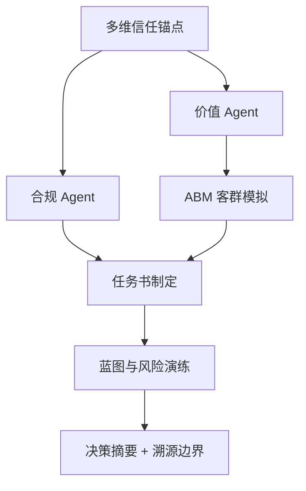

# DDS Agent v2 决策推演报告

## 输入假设
- 地块输入：{'city': '三亚', 'address': '海棠区南田路16号', 'lng': 109.726138, 'lat': 18.39598, 'district': '门址', 'vision': None}
- 客户目标：{'product_type': '改善产品', 'benchmark': None, 'expected_price': 35000.0, 'floor_area_ratio': 2.0, 'year': 2026}

## 决策逻辑图


## CEO 权重引擎 / 综合评分
**preset**: invest
**total_score**: 54.3 / 100
**grade**: B
**overall_confidence**: 0.73
**interpretation**: 置信度较高，模型输入充分、内部一致。 综合得分中等，建议先补齐一级法定硬约束 + 客群校验后再决策。

| Agent | 原始评分 | 置信度 | 权重 | 贡献分 | 评分分布 |
|---|---:|---:|---:|---:|:---:|
| compliance | 55.0 | 0.5 | 0.3 | 8.25 | `[======----]` |
| value | 66.1 | 1.0 | 0.2 | 13.21 | `[=======---]` |
| abm | 100 | 1.0 | 0.15 | 15.0 | `[==========]` |
| unit_mix | 100 | 0.7 | 0.15 | 10.5 | `[==========]` |
| migration | 67.2 | 0.65 | 0.1 | 4.37 | `[=======---]` |
| blueprint | 50 | 0.6 | 0.1 | 3.0 | `[=====-----]` |

## 决策摘要
- 结论：可进入投拓测算，但需先补齐一级法定硬约束后才能定最终拿地价。
- 拿地敏感区间：{'conservative': 20192.0, 'balanced': 23798.0, 'aggressive': 27403.0, 'unit': '元/㎡土地口径粗算'}
- 核心机会：客户目标产品为改善产品，应优先验证低密、私密性、到达仪式感和景观资源是否能支撑溢价。
- 硬性阻断：暂无，但一级硬约束仍需补齐

## L3级线上舆情校验与交叉比对
| 舆情来源 | 爆料时间 | 爆料摘要 | 关联校验匹配 | 关联度得分 | 校验结论 |
| :--- | :--- | :--- | :--- | :--- | :--- |
| 三亚海棠湾高端市场2026Q1报告 | 2026-03-31 | 海棠湾商墅产品2026年Q1成交均价约85000元/㎡，去化周期约14个月。高端康养客群为主要买家。 | 城市匹配(三亚), 概念匹配 | 0.6 | ✅ 高度相关，强力校验 |


## Data Foundation
```json
{
  "level_1_legal_constraints": {
    "status": "missing_level_1_constraints",
    "trust_weight": 1.0,
    "available": false,
    "required_before_final_pricing": [
      "容积率上限",
      "用地性质",
      "限高",
      "退线",
      "绿地率",
      "车位指标",
      "商业比例",
      "产权/分割销售口径"
    ]
  },
  "level_2_gis_physical": {
    "status": "available",
    "trust_weight": 0.7,
    "nearest_poi": {
      "school": {
        "label": "学校",
        "name": "三亚市海棠区人才基地幼儿园",
        "distance_m": 791
      },
      "hospital": {
        "label": "医院",
        "name": "益兴堂大药房(海棠湾8号商业广场店)",
        "distance_m": 415
      },
      "bus": {
        "label": "公交站",
        "name": "8号公馆(公交站)",
        "distance_m": 330
      },
      "mall": {
        "label": "商场",
        "name": "全家乐生活超市(南田路店)",
        "distance_m": 197
      },
      "supermarket": {
        "label": "超市",
        "name": "海棠湾8号商业广场",
        "distance_m": 399
      }
    },
    "competitor_sample_count": 57
  },
  "level_3_market_sentiment": {
    "status": "online_supplement_available",
    "trust_weight": 0.35,
    "proxy_signals": {
      "product_type": "改善产品",
      "benchmark": null,
      "room_type_supply": {
        "3室户型": 45,
        "2室户型": 26,
        "别墅户型": 24,
        "4室户型": 19,
        "5室户型": 8,
        "1室户型": 6,
        "6室户型": 2,
        "商业户型": 2
      },
      "note": "当前用竞品标签、户型结构、对标项目价格作为三级情绪/非标溢价的弱代理。"
    },
    "online_evidence": [
      {
        "query": "三亚海棠湾商墅",
        "title": "三亚海棠湾高端市场2026Q1报告",
        "url": "https://example.com/sanya-report",
        "summary": "海棠湾商墅产品2026年Q1成交均价约85000元/㎡，去化周期约14个月。高端康养客群为主要买家。",
        "data_date": "2026-03-31",
        "confidence": "supplemental",
        "captured_at": "2026-05-12T18:32:14",
        "role": "online_supplement_only",
        "cross_check_score": 0.6,
        "cross_check_matches": [
          "城市匹配(三亚)",
          "概念匹配"
        ],
        "is_highly_relevant": true
      }
    ]
  }
}
```

## Compliance Agent
```json
{
  "role": "合规 Agent",
  "verdict": "conditional",
  "hard_constraints_missing": [
    "容积率上限",
    "用地性质",
    "限高",
    "退线",
    "绿地率",
    "车位指标",
    "商业比例",
    "产权/分割销售口径"
  ],
  "warnings": [
    "容积率 2.0 是客户假设，尚未由出让合同或控规文件确认。",
    "缺少一级法定硬约束，当前只能输出投拓初判，不能作为最终拿地价。"
  ],
  "blockers": [],
  "pricing_boundary": "只能给楼面地价敏感区间，最终价格需等一级数据校准。"
}
```

## Value Agent
```json
{
  "role": "价值 Agent",
  "market_avg_price_cny": 36057.0,
  "benchmark": null,
  "benchmark_premium_ratio": null,
  "opportunities": [
    "客户目标产品为改善产品，应优先验证低密、私密性、到达仪式感和景观资源是否能支撑溢价。"
  ],
  "product_reference": {
    "observed_area_ranges": [
      "108-180㎡",
      "99-160㎡",
      "109-119㎡",
      "83-155㎡",
      "123-190㎡",
      "515-660㎡",
      "138-600㎡",
      "101-139㎡",
      "106-143㎡",
      "102-123㎡",
      "188-342㎡",
      "100-120㎡"
    ],
    "observed_room_types": [
      "3室户型,别墅户型",
      "3室户型,别墅户型",
      "2室户型,3室户型",
      "2室户型,3室户型,别墅户型",
      "3室户型,6室户型",
      "商业户型",
      "3室户型,4室户型,5室户型,6室户型",
      "3室户型,4室户型",
      "2室户型,3室户型",
      "3室户型,4室户型,别墅户型",
      "3室户型,4室户型,5室户型",
      "3室户型,4室户型,5室户型"
    ],
    "top_price_projects": [
      {
        "project_name": "中旅·馥棠公馆",
        "price": 60000.0,
        "area_range": "138-600㎡",
        "room_types": "3室户型,4室户型,5室户型,6室户型"
      },
      {
        "project_name": "海棠故事",
        "price": 58252.0,
        "area_range": "515-660㎡",
        "room_types": "商业户型"
      },
      {
        "project_name": "双大海棠香居",
        "price": 38000.0,
        "area_range": "123-190㎡",
        "room_types": "3室户型,6室户型"
      },
      {
        "project_name": "天骄海棠湾",
        "price": 37000.0,
        "area_range": "65-86㎡",
        "room_types": "2室户型,3室户型"
      },
      {
        "project_name": "天使·海棠明悦",
        "price": 33628.0,
        "area_range": "113-195㎡",
        "room_types": "3室户型,4室户型,别墅户型"
      }
    ]
  },
  "vector_evidence": {
    "status": "ok",
    "source": "vault_fallback",
    "collection": "Vault CSV (近 5 年)",
    "items": [
      {
        "text": "2022年 · 碧桂园海上大都会右岸 (天涯区) · 36000 元/㎡ · 70-84㎡ · 碧桂园集团",
        "metadata": {
          "year": 2022,
          "project_name": "碧桂园海上大都会右岸",
          "district": "天涯区",
          "address": "三亚天涯区三亚湾190号",
          "unit_price": 36000,
          "area_range": "70-84㎡",
          "developer": "碧桂园集团",
          "price_distance": 0.002,
          "product_match": false
        }
      },
      {
        "text": "2023年 · 三亚北秦华府 (吉阳区) · 35992 元/㎡ · 103-136㎡ · nan",
        "metadata": {
          "year": 2023,
          "project_name": "三亚北秦华府",
          "district": "吉阳区",
          "address": "三亚吉阳区榆亚路中段（吉阳区政府南约2公里）",
          "unit_price": 35992,
          "area_range": "103-136㎡",
          "developer": "nan",
          "price_distance": 0.002,
          "product_match": false
        }
      },
      {
        "text": "2025年 · 和花苑A区 (天涯区) · 35849 元/㎡ · 60-132㎡ · 佳兆业",
        "metadata": {
          "year": 2025,
          "project_name": "和花苑A区",
          "district": "天涯区",
          "address": "三亚天涯区凤凰路凤凰路159号凯丰大酒店对面",
          "unit_price": 35849,
          "area_range": "60-132㎡",
          "developer": "佳兆业",
          "price_distance": 0.006,
          "product_match": false
        }
      },
      {
        "text": "2022年 · 紫水岸台 (吉阳区) · 35644 元/㎡ · 40-281㎡ · 阳光城",
        "metadata": {
          "year": 2022,
          "project_name": "紫水岸台",
          "district": "吉阳区",
          "address": "三亚吉阳区吉阳育秀路2号三亚站西南侧",
          "unit_price": 35644,
          "area_range": "40-281㎡",
          "developer": "阳光城",
          "price_distance": 0.011,
          "product_match": false
        }
      },
      {
        "text": "2022年 · 海棠碧水城 (陵水) · 35644 元/㎡ · 49-165㎡ · 美的置业",
        "metadata": {
          "year": 2022,
          "project_name": "海棠碧水城",
          "district": "陵水",
          "address": "三亚陵水土福湾滨海度假区",
          "unit_price": 35644,
          "area_range": "49-165㎡",
          "developer": "美的置业",
          "price_distance": 0.011,
          "product_match": false
        }
      }
    ],
    "note": "chromadb 未配置或无数据，使用 Vault 价格相似度兜底"
  },
  "online_cross_check": {
    "status": "supplemental_only",
    "source_count": 1,
    "sources": [
      {
        "query": "三亚海棠湾商墅",
        "title": "三亚海棠湾高端市场2026Q1报告",
        "url": "https://example.com/sanya-report",
        "summary": "海棠湾商墅产品2026年Q1成交均价约85000元/㎡，去化周期约14个月。高端康养客群为主要买家。",
        "data_date": "2026-03-31",
        "confidence": "supplemental",
        "captured_at": "2026-05-12T18:32:14",
        "role": "online_supplement_only",
        "cross_check_score": 0.6,
        "cross_check_matches": [
          "城市匹配(三亚)",
          "概念匹配"
        ],
        "is_highly_relevant": true
      }
    ]
  }
}
```

## 类似地块证据（向量库/Vault 兜底）
**来源**: vault_fallback · Vault CSV (近 5 年)  
_chromadb 未配置或无数据，使用 Vault 价格相似度兜底_  

| # | 项目 | 区域 | 年份 | 单价 | 面积段 | 开发商 | 相似度 |
|---:|---|---|---:|---:|---|---|---:|
| 1 | 碧桂园海上大都会右岸 | 天涯区 | 2022 | 36000 | 70-84㎡ | 碧桂园集团 | — |
| 2 | 三亚北秦华府 | 吉阳区 | 2023 | 35992 | 103-136㎡ | nan | — |
| 3 | 和花苑A区 | 天涯区 | 2025 | 35849 | 60-132㎡ | 佳兆业 | — |
| 4 | 紫水岸台 | 吉阳区 | 2022 | 35644 | 40-281㎡ | 阳光城 | — |
| 5 | 海棠碧水城 | 陵水 | 2022 | 35644 | 49-165㎡ | 美的置业 | — |

## ABM Market Agent
```json
{
  "role": "ABM 市场模拟 Agent",
  "method": "Random Utility + MNL，蒙特卡洛 N=1000",
  "city": "三亚",
  "product": {
    "name": "改善产品",
    "unit_price": 36057.0,
    "area": 140,
    "pref_score": {
      "景观": 0.65,
      "私密": 0.55,
      "圈层": 0.55,
      "户型": 0.85,
      "通勤": 0.65,
      "学校": 0.7,
      "品牌": 0.6
    }
  },
  "n_personas": 1000,
  "avg_buy_probability": 0.286,
  "top_personas": [
    {
      "name": "度假投资",
      "share": 0.621,
      "raw_count": 250,
      "score": 71.1,
      "wtp_p50": 43133.0,
      "wtp_p90": 49899.0
    },
    {
      "name": "高净值康养",
      "share": 0.262,
      "raw_count": 108,
      "score": 69.4,
      "wtp_p50": 51458.0,
      "wtp_p90": 51945.0
    },
    {
      "name": "外地候鸟-华北",
      "share": 0.078,
      "raw_count": 257,
      "score": 8.7,
      "wtp_p50": 14504.0,
      "wtp_p90": 22893.0
    }
  ],
  "personas": [
    {
      "name": "度假投资",
      "share": 0.621,
      "raw_count": 250,
      "score": 71.1,
      "wtp_p50": 43133.0,
      "wtp_p90": 49899.0
    },
    {
      "name": "高净值康养",
      "share": 0.262,
      "raw_count": 108,
      "score": 69.4,
      "wtp_p50": 51458.0,
      "wtp_p90": 51945.0
    },
    {
      "name": "外地候鸟-华北",
      "share": 0.078,
      "raw_count": 257,
      "score": 8.7,
      "wtp_p50": 14504.0,
      "wtp_p90": 22893.0
    },
    {
      "name": "外地候鸟-西北",
      "share": 0.02,
      "raw_count": 96,
      "score": 5.8,
      "wtp_p50": 12788.0,
      "wtp_p90": 20930.0
    },
    {
      "name": "本地改善",
      "share": 0.014,
      "raw_count": 152,
      "score": 2.6,
      "wtp_p50": 9564.0,
      "wtp_p90": 15514.0
    },
    {
      "name": "外地候鸟-东北",
      "share": 0.005,
      "raw_count": 137,
      "score": 1.1,
      "wtp_p50": 9281.0,
      "wtp_p90": 15095.0
    }
  ],
  "personas_raw": [
    {
      "archetype": "本地改善",
      "age": 37,
      "annual_income": 20.2,
      "total_asset": 120.4,
      "dp_ratio": 0.35,
      "pref": {
        "景观": 0.64,
        "私密": 0.47,
        "圈层": 0.45,
        "户型": 0.84,
        "通勤": 0.46,
        "学校": 0.69,
        "品牌": 0.52
      },
      "risk_aversion": 0.58,
      "budget_ceiling": 258.1,
      "family_size": 5,
      "kids": 1,
      "elderly_cohabit": true,
      "social_class": "B",
      "info_channel": "agent",
      "decision_urgency": 0.71,
      "job_detail": "智能新能源车企研发骨干",
      "life_stage": "三口之家(幼龄段)",
      "current_living": "三亚中环品质两居，车位及空间极其拥挤",
      "living_pain": "小区无地下车库且人车不分流，小孩在楼下玩耍或者推婴儿车极为不安全。",
      "detail_need": "讲究超高得房率（超85%），主卧套房必须配备独立步入式衣帽间与干湿分离双卫。",
      "commute_pref": "无需日常通勤，但要求30分钟内快捷通达凤凰机场或高铁站。",
      "lifestyle_pref": "崇尚度假慢生活，清晨沙滩漫步，午后椰林下午茶，酷爱轻户外及后海冲浪。",
      "funds_source": "名下持有一套旧两居，置换回款 65% + 个人理财储蓄补充 + 公积金商业贷",
      "brand_service_need": "重性价比，不盲信大牌，但要求物业管理有序、绿化修剪及时、人防技防规范。",
      "vacation_frequency": "本地常住人口，四季生活规律，度假频次为常规年假出行。"
    },
    {
      "archetype": "本地改善",
      "age": 45,
      "annual_income": 12.6,
      "total_asset": 64.2,
      "dp_ratio": 0.35,
      "pref": {
        "景观": 0.53,
        "私密": 0.52,
        "圈层": 0.51,
        "户型": 0.96,
        "通勤": 0.47,
        "学校": 0.61,
        "品牌": 0.69
      },
      "risk_aversion": 0.65,
      "budget_ceiling": 137.7,
      "family_size": 5,
      "kids": 1,
      "elderly_cohabit": false,
      "social_class": "B",
      "info_channel": "agent",
      "decision_urgency": 0.84,
      "job_detail": "智能新能源车企研发骨干",
      "life_stage": "三口之家(学龄段)",
      "current_living": "三亚中环品质两居，车位及空间极其拥挤",
      "living_pain": "小区无地下车库且人车不分流，小孩在楼下玩耍或者推婴儿车极为不安全。",
      "detail_need": "讲究超高得房率（超85%），主卧套房必须配备独立步入式衣帽间与干湿分离双卫。",
      "commute_pref": "无需日常通勤，但要求30分钟内快捷通达凤凰机场或高铁站。",
      "lifestyle_pref": "崇尚度假慢生活，清晨沙滩漫步，午后椰林下午茶，酷爱轻户外及后海冲浪。",
      "funds_source": "名下持有一套旧两居，置换回款 65% + 个人理财储蓄补充 + 公积金商业贷",
      "brand_service_need": "重性价比，不盲信大牌，但要求物业管理有序、绿化修剪及时、人防技防规范。",
      "vacation_frequency": "本地常住人口，四季生活规律，度假频次为常规年假出行。"
    },
    {
      "archetype": "本地改善",
      "age": 45,
      "annual_income": 9.8,
      "total_asset": 42.2,
      "dp_ratio": 0.35,
      "pref": {
        "景观": 0.55,
        "私密": 0.48,
        "圈层": 0.4,
        "户型": 0.67,
        "通勤": 0.43,
        "学校": 0.64,
        "品牌": 0.57
      },
      "risk_aversion": 0.39,
      "budget_ceiling": 90.3,
      "family_size": 3,
      "kids": 2,
      "elderly_cohabit": true,
      "social_class": "B",
      "info_channel": "agent",
      "decision_urgency": 0.7,
      "job_detail": "重点中学高级教师",
      "life_stage": "二胎黄金期中大户型",
      "current_living": "三亚中环品质两居，车位及空间极其拥挤",
      "living_pain": "小区无地下车库且人车不分流，小孩在楼下玩耍或者推婴儿车极为不安全。",
      "detail_need": "要求采光通透，全明户型，带多功能嵌入式收纳墙以最大化空间利用。",
      "commute_pref": "无需日常通勤，但要求30分钟内快捷通达凤凰机场或高铁站。",
      "lifestyle_pref": "崇尚度假慢生活，清晨沙滩漫步，午后椰林下午茶，酷爱轻户外及后海冲浪。",
      "funds_source": "名下持有一套旧两居，置换回款 65% + 个人理财储蓄补充 + 公积金商业贷",
      "brand_service_need": "重性价比，不盲信大牌，但要求物业管理有序、绿化修剪及时、人防技防规范。",
      "vacation_frequency": "本地常住人口，四季生活规律，度假频次为常规年假出行。"
    },
    {
      "archetype": "本地改善",
      "age": 38,
      "annual_income": 12.6,
      "total_asset": 56.7,
      "dp_ratio": 0.35,
      "pref": {
        "景观": 0.63,
        "私密": 0.34,
        "圈层": 0.37,
        "户型": 0.75,
        "通勤": 0.66,
        "学校": 0.6,
        "品牌": 0.44
      },
      "risk_aversion": 0.68,
      "budget_ceiling": 121.6,
      "family_size": 4,
      "kids": 1,
      "elderly_cohabit": true,
      "social_class": "B",
      "info_channel": "agent",
      "decision_urgency": 0.63,
      "job_detail": "三甲医院主治医师",
      "life_stage": "三口之家(学龄段)",
      "current_living": "三亚中环品质两居，车位及空间极其拥挤",
      "living_pain": "小区无地下车库且人车不分流，小孩在楼下玩耍或者推婴儿车极为不安全。",
      "detail_need": "讲究超高得房率（超85%），主卧套房必须配备独立步入式衣帽间与干湿分离双卫。",
      "commute_pref": "无需日常通勤，但要求30分钟内快捷通达凤凰机场或高铁站。",
      "lifestyle_pref": "崇尚度假慢生活，清晨沙滩漫步，午后椰林下午茶，酷爱轻户外及后海冲浪。",
      "funds_source": "名下持有一套旧两居，置换回款 65% + 个人理财储蓄补充 + 公积金商业贷",
      "brand_service_need": "重性价比，不盲信大牌，但要求物业管理有序、绿化修剪及时、人防技防规范。",
      "vacation_frequency": "本地常住人口，四季生活规律，度假频次为常规年假出行。"
    },
    {
      "archetype": "本地改善",
      "age": 48,
      "annual_income": 15.2,
      "total_asset": 116.4,
      "dp_ratio": 0.35,
      "pref": {
        "景观": 0.54,
        "私密": 0.47,
        "圈层": 0.31,
        "户型": 0.79,
        "通勤": 0.48,
        "学校": 0.7,
        "品牌": 0.41
      },
      "risk_aversion": 0.63,
      "budget_ceiling": 249.5,
      "family_size": 4,
      "kids": 1,
      "elderly_cohabit": false,
      "social_class": "B",
      "info_channel": "agent",
      "decision_urgency": 0.64,
      "job_detail": "智能新能源车企研发骨干",
      "life_stage": "三口之家(学龄段)",
      "current_living": "三亚中环品质两居，车位及空间极其拥挤",
      "living_pain": "小区无地下车库且人车不分流，小孩在楼下玩耍或者推婴儿车极为不安全。",
      "detail_need": "讲究超高得房率（超85%），主卧套房必须配备独立步入式衣帽间与干湿分离双卫。",
      "commute_pref": "无需日常通勤，但要求30分钟内快捷通达凤凰机场或高铁站。",
      "lifestyle_pref": "崇尚度假慢生活，清晨沙滩漫步，午后椰林下午茶，酷爱轻户外及后海冲浪。",
      "funds_source": "名下持有一套旧两居，置换回款 65% + 个人理财储蓄补充 + 公积金商业贷",
      "brand_service_need": "重性价比，不盲信大牌，但要求物业管理有序、绿化修剪及时、人防技防规范。",
      "vacation_frequency": "本地常住人口，四季生活规律，度假频次为常规年假出行。"
    },
    {
      "archetype": "本地改善",
      "age": 32,
      "annual_income": 22.1,
      "total_asset": 133.1,
      "dp_ratio": 0.35,
      "pref": {
        "景观": 0.55,
        "私密": 0.58,
        "圈层": 0.32,
        "户型": 0.85,
        "通勤": 0.54,
        "学校": 0.66,
        "品牌": 0.42
      },
      "risk_aversion": 0.63,
      "budget_ceiling": 285.2,
      "family_size": 4,
      "kids": 1,
      "elderly_cohabit": true,
      "social_class": "B",
      "info_channel": "agent",
      "decision_urgency": 0.56,
      "job_detail": "国企中层管理",
      "life_stage": "三口之家(幼龄段)",
      "current_living": "三亚中环品质两居，车位及空间极其拥挤",
      "living_pain": "小区无地下车库且人车不分流，小孩在楼下玩耍或者推婴儿车极为不安全。",
      "detail_need": "讲究超高得房率（超85%），主卧套房必须配备独立步入式衣帽间与干湿分离双卫。",
      "commute_pref": "无需日常通勤，但要求30分钟内快捷通达凤凰机场或高铁站。",
      "lifestyle_pref": "崇尚度假慢生活，清晨沙滩漫步，午后椰林下午茶，酷爱轻户外及后海冲浪。",
      "funds_source": "名下持有一套旧两居，置换回款 65% + 个人理财储蓄补充 + 公积金商业贷",
      "brand_service_need": "重性价比，不盲信大牌，但要求物业管理有序、绿化修剪及时、人防技防规范。",
      "vacation_frequency": "本地常住人口，四季生活规律，度假频次为常规年假出行。"
    },
    {
      "archetype": "本地改善",
      "age": 42,
      "annual_income": 20.4,
      "total_asset": 112.6,
      "dp_ratio": 0.35,
      "pref": {
        "景观": 0.56,
        "私密": 0.41,
        "圈层": 0.4,
        "户型": 0.83,
        "通勤": 0.43,
        "学校": 0.63,
        "品牌": 0.43
      },
      "risk_aversion": 0.61,
      "budget_ceiling": 241.3,
      "family_size": 4,
      "kids": 1,
      "elderly_cohabit": false,
      "social_class": "B",
      "info_channel": "agent",
      "decision_urgency": 0.92,
      "job_detail": "三甲医院主治医师",
      "life_stage": "三口之家(学龄段)",
      "current_living": "三亚中环品质两居，车位及空间极其拥挤",
      "living_pain": "小区无地下车库且人车不分流，小孩在楼下玩耍或者推婴儿车极为不安全。",
      "detail_need": "讲究超高得房率（超85%），主卧套房必须配备独立步入式衣帽间与干湿分离双卫。",
      "commute_pref": "无需日常通勤，但要求30分钟内快捷通达凤凰机场或高铁站。",
      "lifestyle_pref": "崇尚度假慢生活，清晨沙滩漫步，午后椰林下午茶，酷爱轻户外及后海冲浪。",
      "funds_source": "名下持有一套旧两居，置换回款 65% + 个人理财储蓄补充 + 公积金商业贷",
      "brand_service_need": "重性价比，不盲信大牌，但要求物业管理有序、绿化修剪及时、人防技防规范。",
      "vacation_frequency": "本地常住人口，四季生活规律，度假频次为常规年假出行。"
    },
    {
      "archetype": "本地改善",
      "age": 33,
      "annual_income": 18.0,
      "total_asset": 93.3,
      "dp_ratio": 0.35,
      "pref": {
        "景观": 0.68,
        "私密": 0.4,
        "圈层": 0.58,
        "户型": 0.66,
        "通勤": 0.6,
        "学校": 0.81,
        "品牌": 0.41
      },
      "risk_aversion": 0.48,
      "budget_ceiling": 200.0,
      "family_size": 4,
      "kids": 1,
      "elderly_cohabit": true,
      "social_class": "B",
      "info_channel": "agent",
      "decision_urgency": 1.0,
      "job_detail": "重点中学高级教师",
      "life_stage": "三口之家(幼龄段)",
      "current_living": "三亚中环品质两居，车位及空间极其拥挤",
      "living_pain": "小区无地下车库且人车不分流，小孩在楼下玩耍或者推婴儿车极为不安全。",
      "detail_need": "核心要求地块属于第一梯队名校学区，且周边500米内解决幼小衔接教育配套。",
      "commute_pref": "无需日常通勤，但要求30分钟内快捷通达凤凰机场或高铁站。",
      "lifestyle_pref": "崇尚度假慢生活，清晨沙滩漫步，午后椰林下午茶，酷爱轻户外及后海冲浪。",
      "funds_source": "名下持有一套旧两居，置换回款 65% + 个人理财储蓄补充 + 公积金商业贷",
      "brand_service_need": "重性价比，不盲信大牌，但要求物业管理有序、绿化修剪及时、人防技防规范。",
      "vacation_frequency": "本地常住人口，四季生活规律，度假频次为常规年假出行。"
    },
    {
      "archetype": "本地改善",
      "age": 36,
      "annual_income": 15.6,
      "total_asset": 76.6,
      "dp_ratio": 0.35,
      "pref": {
        "景观": 0.6,
        "私密": 0.51,
        "圈层": 0.33,
        "户型": 0.74,
        "通勤": 0.52,
        "学校": 0.71,
        "品牌": 0.56
      },
      "risk_aversion": 0.62,
      "budget_ceiling": 164.1,
      "family_size": 4,
      "kids": 0,
      "elderly_cohabit": false,
      "social_class": "B",
      "info_channel": "agent",
      "decision_urgency": 0.83,
      "job_detail": "三甲医院主治医师",
      "life_stage": "成熟期核心家庭",
      "current_living": "三亚中环品质两居，车位及空间极其拥挤",
      "living_pain": "老小区隔音差，邻里滋扰严重，且车位严重匮乏，每晚加班回来抢车位像打仗。",
      "detail_need": "讲究超高得房率（超85%），主卧套房必须配备独立步入式衣帽间与干湿分离双卫。",
      "commute_pref": "无需日常通勤，但要求30分钟内快捷通达凤凰机场或高铁站。",
      "lifestyle_pref": "崇尚度假慢生活，清晨沙滩漫步，午后椰林下午茶，酷爱轻户外及后海冲浪。",
      "funds_source": "名下持有一套旧两居，置换回款 65% + 个人理财储蓄补充 + 公积金商业贷",
      "brand_service_need": "重性价比，不盲信大牌，但要求物业管理有序、绿化修剪及时、人防技防规范。",
      "vacation_frequency": "本地常住人口，四季生活规律，度假频次为常规年假出行。"
    },
    {
      "archetype": "本地改善",
      "age": 38,
      "annual_income": 8.3,
      "total_asset": 39.2,
      "dp_ratio": 0.35,
      "pref": {
        "景观": 0.55,
        "私密": 0.53,
        "圈层": 0.45,
        "户型": 0.82,
        "通勤": 0.45,
        "学校": 0.67,
        "品牌": 0.33
      },
      "risk_aversion": 0.62,
      "budget_ceiling": 84.0,
      "family_size": 4,
      "kids": 2,
      "elderly_cohabit": true,
      "social_class": "B",
      "info_channel": "agent",
      "decision_urgency": 0.87,
      "job_detail": "重点中学高级教师",
      "life_stage": "二胎黄金期中大户型",
      "current_living": "三亚中环品质两居，车位及空间极其拥挤",
      "living_pain": "小区无地下车库且人车不分流，小孩在楼下玩耍或者推婴儿车极为不安全。",
      "detail_need": "讲究超高得房率（超85%），主卧套房必须配备独立步入式衣帽间与干湿分离双卫。",
      "commute_pref": "无需日常通勤，但要求30分钟内快捷通达凤凰机场或高铁站。",
      "lifestyle_pref": "崇尚度假慢生活，清晨沙滩漫步，午后椰林下午茶，酷爱轻户外及后海冲浪。",
      "funds_source": "名下持有一套旧两居，置换回款 65% + 个人理财储蓄补充 + 公积金商业贷",
      "brand_service_need": "重性价比，不盲信大牌，但要求物业管理有序、绿化修剪及时、人防技防规范。",
      "vacation_frequency": "本地常住人口，四季生活规律，度假频次为常规年假出行。"
    },
    {
      "archetype": "本地改善",
      "age": 50,
      "annual_income": 16.1,
      "total_asset": 83.3,
      "dp_ratio": 0.35,
      "pref": {
        "景观": 0.51,
        "私密": 0.35,
        "圈层": 0.28,
        "户型": 0.78,
        "通勤": 0.33,
        "学校": 0.69,
        "品牌": 0.37
      },
      "risk_aversion": 0.57,
      "budget_ceiling": 178.5,
      "family_size": 3,
      "kids": 1,
      "elderly_cohabit": false,
      "social_class": "B",
      "info_channel": "agent",
      "decision_urgency": 0.62,
      "job_detail": "智能新能源车企研发骨干",
      "life_stage": "三口之家(学龄段)",
      "current_living": "三亚中环品质两居，车位及空间极其拥挤",
      "living_pain": "小区无地下车库且人车不分流，小孩在楼下玩耍或者推婴儿车极为不安全。",
      "detail_need": "讲究超高得房率（超85%），主卧套房必须配备独立步入式衣帽间与干湿分离双卫。",
      "commute_pref": "无需日常通勤，但要求30分钟内快捷通达凤凰机场或高铁站。",
      "lifestyle_pref": "崇尚度假慢生活，清晨沙滩漫步，午后椰林下午茶，酷爱轻户外及后海冲浪。",
      "funds_source": "名下持有一套旧两居，置换回款 65% + 个人理财储蓄补充 + 公积金商业贷",
      "brand_service_need": "重性价比，不盲信大牌，但要求物业管理有序、绿化修剪及时、人防技防规范。",
      "vacation_frequency": "本地常住人口，四季生活规律，度假频次为常规年假出行。"
    },
    {
      "archetype": "本地改善",
      "age": 35,
      "annual_income": 19.9,
      "total_asset": 87.8,
      "dp_ratio": 0.35,
      "pref": {
        "景观": 0.6,
        "私密": 0.45,
        "圈层": 0.39,
        "户型": 0.75,
        "通勤": 0.35,
        "学校": 0.65,
        "品牌": 0.73
      },
      "risk_aversion": 0.55,
      "budget_ceiling": 188.2,
      "family_size": 3,
      "kids": 1,
      "elderly_cohabit": false,
      "social_class": "B",
      "info_channel": "agent",
      "decision_urgency": 0.7,
      "job_detail": "智能新能源车企研发骨干",
      "life_stage": "三口之家(幼龄段)",
      "current_living": "三亚中环品质两居，车位及空间极其拥挤",
      "living_pain": "小区无地下车库且人车不分流，小孩在楼下玩耍或者推婴儿车极为不安全。",
      "detail_need": "讲究超高得房率（超85%），主卧套房必须配备独立步入式衣帽间与干湿分离双卫。",
      "commute_pref": "无需日常通勤，但要求30分钟内快捷通达凤凰机场或高铁站。",
      "lifestyle_pref": "崇尚度假慢生活，清晨沙滩漫步，午后椰林下午茶，酷爱轻户外及后海冲浪。",
      "funds_source": "名下持有一套旧两居，置换回款 65% + 个人理财储蓄补充 + 公积金商业贷",
      "brand_service_need": "非仁恒、绿城、万科等金牌开发商不买，极度看重高端精装质量与顶级物业的增值口碑。",
      "vacation_frequency": "本地常住人口，四季生活规律，度假频次为常规年假出行。"
    },
    {
      "archetype": "本地改善",
      "age": 40,
      "annual_income": 8.8,
      "total_asset": 37.2,
      "dp_ratio": 0.35,
      "pref": {
        "景观": 0.55,
        "私密": 0.59,
        "圈层": 0.33,
        "户型": 0.83,
        "通勤": 0.61,
        "学校": 0.76,
        "品牌": 0.48
      },
      "risk_aversion": 0.52,
      "budget_ceiling": 79.6,
      "family_size": 2,
      "kids": 1,
      "elderly_cohabit": true,
      "social_class": "B",
      "info_channel": "agent",
      "decision_urgency": 0.72,
      "job_detail": "区级税务局一级主办",
      "life_stage": "三口之家(学龄段)",
      "current_living": "三亚中环品质两居，车位及空间极其拥挤",
      "living_pain": "小区无地下车库且人车不分流，小孩在楼下玩耍或者推婴儿车极为不安全。",
      "detail_need": "讲究超高得房率（超85%），主卧套房必须配备独立步入式衣帽间与干湿分离双卫。",
      "commute_pref": "无需日常通勤，但要求30分钟内快捷通达凤凰机场或高铁站。",
      "lifestyle_pref": "崇尚度假慢生活，清晨沙滩漫步，午后椰林下午茶，酷爱轻户外及后海冲浪。",
      "funds_source": "名下持有一套旧两居，置换回款 65% + 个人理财储蓄补充 + 公积金商业贷",
      "brand_service_need": "重性价比，不盲信大牌，但要求物业管理有序、绿化修剪及时、人防技防规范。",
      "vacation_frequency": "本地常住人口，四季生活规律，度假频次为常规年假出行。"
    },
    {
      "archetype": "本地改善",
      "age": 48,
      "annual_income": 11.4,
      "total_asset": 79.8,
      "dp_ratio": 0.35,
      "pref": {
        "景观": 0.65,
        "私密": 0.52,
        "圈层": 0.44,
        "户型": 0.88,
        "通勤": 0.56,
        "学校": 0.71,
        "品牌": 0.44
      },
      "risk_aversion": 0.54,
      "budget_ceiling": 171.0,
      "family_size": 4,
      "kids": 0,
      "elderly_cohabit": true,
      "social_class": "B",
      "info_channel": "agent",
      "decision_urgency": 0.78,
      "job_detail": "三甲医院主治医师",
      "life_stage": "成熟期核心家庭",
      "current_living": "三亚中环品质两居，车位及空间极其拥挤",
      "living_pain": "当前房屋属于旧多层无电梯房，父母年纪渐高每天爬楼梯极为吃力。",
      "detail_need": "讲究超高得房率（超85%），主卧套房必须配备独立步入式衣帽间与干湿分离双卫。",
      "commute_pref": "无需日常通勤，但要求30分钟内快捷通达凤凰机场或高铁站。",
      "lifestyle_pref": "崇尚度假慢生活，清晨沙滩漫步，午后椰林下午茶，酷爱轻户外及后海冲浪。",
      "funds_source": "名下持有一套旧两居，置换回款 65% + 个人理财储蓄补充 + 公积金商业贷",
      "brand_service_need": "重性价比，不盲信大牌，但要求物业管理有序、绿化修剪及时、人防技防规范。",
      "vacation_frequency": "本地常住人口，四季生活规律，度假频次为常规年假出行。"
    },
    {
      "archetype": "本地改善",
      "age": 37,
      "annual_income": 31.2,
      "total_asset": 182.0,
      "dp_ratio": 0.35,
      "pref": {
        "景观": 0.68,
        "私密": 0.5,
        "圈层": 0.5,
        "户型": 0.64,
        "通勤": 0.5,
        "学校": 0.7,
        "品牌": 0.5
      },
      "risk_aversion": 0.58,
      "budget_ceiling": 390.0,
      "family_size": 3,
      "kids": 1,
      "elderly_cohabit": false,
      "social_class": "B",
      "info_channel": "agent",
      "decision_urgency": 0.74,
      "job_detail": "国企中层管理",
      "life_stage": "三口之家(幼龄段)",
      "current_living": "三亚中环品质两居，车位及空间极其拥挤",
      "living_pain": "小区无地下车库且人车不分流，小孩在楼下玩耍或者推婴儿车极为不安全。",
      "detail_need": "要求采光通透，全明户型，带多功能嵌入式收纳墙以最大化空间利用。",
      "commute_pref": "无需日常通勤，但要求30分钟内快捷通达凤凰机场或高铁站。",
      "lifestyle_pref": "崇尚度假慢生活，清晨沙滩漫步，午后椰林下午茶，酷爱轻户外及后海冲浪。",
      "funds_source": "名下持有一套旧两居，置换回款 65% + 个人理财储蓄补充 + 公积金商业贷",
      "brand_service_need": "重性价比，不盲信大牌，但要求物业管理有序、绿化修剪及时、人防技防规范。",
      "vacation_frequency": "本地常住人口，四季生活规律，度假频次为常规年假出行。"
    },
    {
      "archetype": "本地改善",
      "age": 34,
      "annual_income": 19.3,
      "total_asset": 103.6,
      "dp_ratio": 0.35,
      "pref": {
        "景观": 0.78,
        "私密": 0.35,
        "圈层": 0.46,
        "户型": 0.73,
        "通勤": 0.56,
        "学校": 0.73,
        "品牌": 0.52
      },
      "risk_aversion": 0.53,
      "budget_ceiling": 222.0,
      "family_size": 5,
      "kids": 1,
      "elderly_cohabit": false,
      "social_class": "B",
      "info_channel": "agent",
      "decision_urgency": 0.52,
      "job_detail": "区级税务局一级主办",
      "life_stage": "三口之家(幼龄段)",
      "current_living": "三亚中环品质两居，车位及空间极其拥挤",
      "living_pain": "小区无地下车库且人车不分流，小孩在楼下玩耍或者推婴儿车极为不安全。",
      "detail_need": "要求有超大面宽南向双阳台（观景家政分离），主卧大飘窗能270度直面自然景观。",
      "commute_pref": "无需日常通勤，但要求30分钟内快捷通达凤凰机场或高铁站。",
      "lifestyle_pref": "崇尚度假慢生活，清晨沙滩漫步，午后椰林下午茶，酷爱轻户外及后海冲浪。",
      "funds_source": "名下持有一套旧两居，置换回款 65% + 个人理财储蓄补充 + 公积金商业贷",
      "brand_service_need": "重性价比，不盲信大牌，但要求物业管理有序、绿化修剪及时、人防技防规范。",
      "vacation_frequency": "本地常住人口，四季生活规律，度假频次为常规年假出行。"
    },
    {
      "archetype": "本地改善",
      "age": 41,
      "annual_income": 7.4,
      "total_asset": 57.4,
      "dp_ratio": 0.35,
      "pref": {
        "景观": 0.69,
        "私密": 0.56,
        "圈层": 0.38,
        "户型": 0.71,
        "通勤": 0.49,
        "学校": 0.7,
        "品牌": 0.45
      },
      "risk_aversion": 0.57,
      "budget_ceiling": 122.9,
      "family_size": 3,
      "kids": 0,
      "elderly_cohabit": false,
      "social_class": "B",
      "info_channel": "agent",
      "decision_urgency": 0.78,
      "job_detail": "国企中层管理",
      "life_stage": "成熟期核心家庭",
      "current_living": "三亚中环品质两居，车位及空间极其拥挤",
      "living_pain": "老小区隔音差，邻里滋扰严重，且车位严重匮乏，每晚加班回来抢车位像打仗。",
      "detail_need": "讲究超高得房率（超85%），主卧套房必须配备独立步入式衣帽间与干湿分离双卫。",
      "commute_pref": "无需日常通勤，但要求30分钟内快捷通达凤凰机场或高铁站。",
      "lifestyle_pref": "崇尚度假慢生活，清晨沙滩漫步，午后椰林下午茶，酷爱轻户外及后海冲浪。",
      "funds_source": "名下持有一套旧两居，置换回款 65% + 个人理财储蓄补充 + 公积金商业贷",
      "brand_service_need": "重性价比，不盲信大牌，但要求物业管理有序、绿化修剪及时、人防技防规范。",
      "vacation_frequency": "本地常住人口，四季生活规律，度假频次为常规年假出行。"
    },
    {
      "archetype": "本地改善",
      "age": 50,
      "annual_income": 12.8,
      "total_asset": 84.0,
      "dp_ratio": 0.35,
      "pref": {
        "景观": 0.61,
        "私密": 0.44,
        "圈层": 0.26,
        "户型": 0.57,
        "通勤": 0.47,
        "学校": 0.58,
        "品牌": 0.4
      },
      "risk_aversion": 0.48,
      "budget_ceiling": 180.1,
      "family_size": 5,
      "kids": 1,
      "elderly_cohabit": false,
      "social_class": "B",
      "info_channel": "agent",
      "decision_urgency": 1.0,
      "job_detail": "三甲医院主治医师",
      "life_stage": "三口之家(学龄段)",
      "current_living": "三亚中环品质两居，车位及空间极其拥挤",
      "living_pain": "小区无地下车库且人车不分流，小孩在楼下玩耍或者推婴儿车极为不安全。",
      "detail_need": "要求采光通透，全明户型，带多功能嵌入式收纳墙以最大化空间利用。",
      "commute_pref": "无需日常通勤，但要求30分钟内快捷通达凤凰机场或高铁站。",
      "lifestyle_pref": "崇尚度假慢生活，清晨沙滩漫步，午后椰林下午茶，酷爱轻户外及后海冲浪。",
      "funds_source": "名下持有一套旧两居，置换回款 65% + 个人理财储蓄补充 + 公积金商业贷",
      "brand_service_need": "重性价比，不盲信大牌，但要求物业管理有序、绿化修剪及时、人防技防规范。",
      "vacation_frequency": "本地常住人口，四季生活规律，度假频次为常规年假出行。"
    },
    {
      "archetype": "本地改善",
      "age": 30,
      "annual_income": 17.2,
      "total_asset": 95.8,
      "dp_ratio": 0.35,
      "pref": {
        "景观": 0.68,
        "私密": 0.52,
        "圈层": 0.55,
        "户型": 0.54,
        "通勤": 0.53,
        "学校": 0.75,
        "品牌": 0.45
      },
      "risk_aversion": 0.54,
      "budget_ceiling": 205.3,
      "family_size": 4,
      "kids": 2,
      "elderly_cohabit": false,
      "social_class": "B",
      "info_channel": "agent",
      "decision_urgency": 0.63,
      "job_detail": "国企中层管理",
      "life_stage": "二胎黄金期中大户型",
      "current_living": "三亚中环品质两居，车位及空间极其拥挤",
      "living_pain": "小区无地下车库且人车不分流，小孩在楼下玩耍或者推婴儿车极为不安全。",
      "detail_need": "核心要求地块属于第一梯队名校学区，且周边500米内解决幼小衔接教育配套。",
      "commute_pref": "无需日常通勤，但要求30分钟内快捷通达凤凰机场或高铁站。",
      "lifestyle_pref": "崇尚度假慢生活，清晨沙滩漫步，午后椰林下午茶，酷爱轻户外及后海冲浪。",
      "funds_source": "名下持有一套旧两居，置换回款 65% + 个人理财储蓄补充 + 公积金商业贷",
      "brand_service_need": "重性价比，不盲信大牌，但要求物业管理有序、绿化修剪及时、人防技防规范。",
      "vacation_frequency": "本地常住人口，四季生活规律，度假频次为常规年假出行。"
    },
    {
      "archetype": "本地改善",
      "age": 38,
      "annual_income": 18.3,
      "total_asset": 83.8,
      "dp_ratio": 0.35,
      "pref": {
        "景观": 0.57,
        "私密": 0.33,
        "圈层": 0.4,
        "户型": 0.78,
        "通勤": 0.56,
        "学校": 0.61,
        "品牌": 0.48
      },
      "risk_aversion": 0.68,
      "budget_ceiling": 179.5,
      "family_size": 4,
      "kids": 0,
      "elderly_cohabit": true,
      "social_class": "B",
      "info_channel": "agent",
      "decision_urgency": 0.75,
      "job_detail": "重点中学高级教师",
      "life_stage": "成熟期核心家庭",
      "current_living": "三亚中环品质两居，车位及空间极其拥挤",
      "living_pain": "当前房屋属于旧多层无电梯房，父母年纪渐高每天爬楼梯极为吃力。",
      "detail_need": "讲究超高得房率（超85%），主卧套房必须配备独立步入式衣帽间与干湿分离双卫。",
      "commute_pref": "无需日常通勤，但要求30分钟内快捷通达凤凰机场或高铁站。",
      "lifestyle_pref": "崇尚度假慢生活，清晨沙滩漫步，午后椰林下午茶，酷爱轻户外及后海冲浪。",
      "funds_source": "名下持有一套旧两居，置换回款 65% + 个人理财储蓄补充 + 公积金商业贷",
      "brand_service_need": "重性价比，不盲信大牌，但要求物业管理有序、绿化修剪及时、人防技防规范。",
      "vacation_frequency": "本地常住人口，四季生活规律，度假频次为常规年假出行。"
    },
    {
      "archetype": "本地改善",
      "age": 38,
      "annual_income": 6.9,
      "total_asset": 52.8,
      "dp_ratio": 0.35,
      "pref": {
        "景观": 0.58,
        "私密": 0.48,
        "圈层": 0.27,
        "户型": 0.85,
        "通勤": 0.53,
        "学校": 0.81,
        "品牌": 0.35
      },
      "risk_aversion": 0.51,
      "budget_ceiling": 113.2,
      "family_size": 5,
      "kids": 0,
      "elderly_cohabit": false,
      "social_class": "B",
      "info_channel": "agent",
      "decision_urgency": 0.84,
      "job_detail": "区级税务局一级主办",
      "life_stage": "成熟期核心家庭",
      "current_living": "三亚中环品质两居，车位及空间极其拥挤",
      "living_pain": "老小区隔音差，邻里滋扰严重，且车位严重匮乏，每晚加班回来抢车位像打仗。",
      "detail_need": "讲究超高得房率（超85%），主卧套房必须配备独立步入式衣帽间与干湿分离双卫。",
      "commute_pref": "无需日常通勤，但要求30分钟内快捷通达凤凰机场或高铁站。",
      "lifestyle_pref": "崇尚度假慢生活，清晨沙滩漫步，午后椰林下午茶，酷爱轻户外及后海冲浪。",
      "funds_source": "名下持有一套旧两居，置换回款 65% + 个人理财储蓄补充 + 公积金商业贷",
      "brand_service_need": "重性价比，不盲信大牌，但要求物业管理有序、绿化修剪及时、人防技防规范。",
      "vacation_frequency": "本地常住人口，四季生活规律，度假频次为常规年假出行。"
    },
    {
      "archetype": "本地改善",
      "age": 46,
      "annual_income": 15.8,
      "total_asset": 94.9,
      "dp_ratio": 0.35,
      "pref": {
        "景观": 0.63,
        "私密": 0.43,
        "圈层": 0.37,
        "户型": 0.67,
        "通勤": 0.42,
        "学校": 0.62,
        "品牌": 0.49
      },
      "risk_aversion": 0.58,
      "budget_ceiling": 203.3,
      "family_size": 4,
      "kids": 2,
      "elderly_cohabit": true,
      "social_class": "B",
      "info_channel": "agent",
      "decision_urgency": 0.93,
      "job_detail": "区级税务局一级主办",
      "life_stage": "二胎黄金期中大户型",
      "current_living": "三亚中环品质两居，车位及空间极其拥挤",
      "living_pain": "小区无地下车库且人车不分流，小孩在楼下玩耍或者推婴儿车极为不安全。",
      "detail_need": "要求采光通透，全明户型，带多功能嵌入式收纳墙以最大化空间利用。",
      "commute_pref": "无需日常通勤，但要求30分钟内快捷通达凤凰机场或高铁站。",
      "lifestyle_pref": "崇尚度假慢生活，清晨沙滩漫步，午后椰林下午茶，酷爱轻户外及后海冲浪。",
      "funds_source": "名下持有一套旧两居，置换回款 65% + 个人理财储蓄补充 + 公积金商业贷",
      "brand_service_need": "重性价比，不盲信大牌，但要求物业管理有序、绿化修剪及时、人防技防规范。",
      "vacation_frequency": "本地常住人口，四季生活规律，度假频次为常规年假出行。"
    },
    {
      "archetype": "本地改善",
      "age": 32,
      "annual_income": 14.7,
      "total_asset": 90.6,
      "dp_ratio": 0.35,
      "pref": {
        "景观": 0.64,
        "私密": 0.53,
        "圈层": 0.29,
        "户型": 0.79,
        "通勤": 0.54,
        "学校": 0.7,
        "品牌": 0.36
      },
      "risk_aversion": 0.6,
      "budget_ceiling": 194.1,
      "family_size": 4,
      "kids": 1,
      "elderly_cohabit": false,
      "social_class": "B",
      "info_channel": "agent",
      "decision_urgency": 0.8,
      "job_detail": "智能新能源车企研发骨干",
      "life_stage": "三口之家(幼龄段)",
      "current_living": "三亚中环品质两居，车位及空间极其拥挤",
      "living_pain": "小区无地下车库且人车不分流，小孩在楼下玩耍或者推婴儿车极为不安全。",
      "detail_need": "讲究超高得房率（超85%），主卧套房必须配备独立步入式衣帽间与干湿分离双卫。",
      "commute_pref": "无需日常通勤，但要求30分钟内快捷通达凤凰机场或高铁站。",
      "lifestyle_pref": "崇尚度假慢生活，清晨沙滩漫步，午后椰林下午茶，酷爱轻户外及后海冲浪。",
      "funds_source": "名下持有一套旧两居，置换回款 65% + 个人理财储蓄补充 + 公积金商业贷",
      "brand_service_need": "重性价比，不盲信大牌，但要求物业管理有序、绿化修剪及时、人防技防规范。",
      "vacation_frequency": "本地常住人口，四季生活规律，度假频次为常规年假出行。"
    },
    {
      "archetype": "本地改善",
      "age": 47,
      "annual_income": 18.4,
      "total_asset": 116.0,
      "dp_ratio": 0.35,
      "pref": {
        "景观": 0.55,
        "私密": 0.37,
        "圈层": 0.39,
        "户型": 0.6,
        "通勤": 0.54,
        "学校": 0.62,
        "品牌": 0.36
      },
      "risk_aversion": 0.52,
      "budget_ceiling": 248.7,
      "family_size": 3,
      "kids": 0,
      "elderly_cohabit": true,
      "social_class": "B",
      "info_channel": "agent",
      "decision_urgency": 0.83,
      "job_detail": "重点中学高级教师",
      "life_stage": "成熟期核心家庭",
      "current_living": "三亚中环品质两居，车位及空间极其拥挤",
      "living_pain": "当前房屋属于旧多层无电梯房，父母年纪渐高每天爬楼梯极为吃力。",
      "detail_need": "要求采光通透，全明户型，带多功能嵌入式收纳墙以最大化空间利用。",
      "commute_pref": "无需日常通勤，但要求30分钟内快捷通达凤凰机场或高铁站。",
      "lifestyle_pref": "崇尚度假慢生活，清晨沙滩漫步，午后椰林下午茶，酷爱轻户外及后海冲浪。",
      "funds_source": "名下持有一套旧两居，置换回款 65% + 个人理财储蓄补充 + 公积金商业贷",
      "brand_service_need": "重性价比，不盲信大牌，但要求物业管理有序、绿化修剪及时、人防技防规范。",
      "vacation_frequency": "本地常住人口，四季生活规律，度假频次为常规年假出行。"
    },
    {
      "archetype": "本地改善",
      "age": 49,
      "annual_income": 22.0,
      "total_asset": 132.4,
      "dp_ratio": 0.35,
      "pref": {
        "景观": 0.7,
        "私密": 0.48,
        "圈层": 0.36,
        "户型": 0.71,
        "通勤": 0.59,
        "学校": 0.64,
        "品牌": 0.41
      },
      "risk_aversion": 0.55,
      "budget_ceiling": 283.6,
      "family_size": 4,
      "kids": 1,
      "elderly_cohabit": false,
      "social_class": "B",
      "info_channel": "agent",
      "decision_urgency": 0.53,
      "job_detail": "重点中学高级教师",
      "life_stage": "三口之家(学龄段)",
      "current_living": "三亚中环品质两居，车位及空间极其拥挤",
      "living_pain": "小区无地下车库且人车不分流，小孩在楼下玩耍或者推婴儿车极为不安全。",
      "detail_need": "讲究超高得房率（超85%），主卧套房必须配备独立步入式衣帽间与干湿分离双卫。",
      "commute_pref": "无需日常通勤，但要求30分钟内快捷通达凤凰机场或高铁站。",
      "lifestyle_pref": "崇尚度假慢生活，清晨沙滩漫步，午后椰林下午茶，酷爱轻户外及后海冲浪。",
      "funds_source": "名下持有一套旧两居，置换回款 65% + 个人理财储蓄补充 + 公积金商业贷",
      "brand_service_need": "重性价比，不盲信大牌，但要求物业管理有序、绿化修剪及时、人防技防规范。",
      "vacation_frequency": "本地常住人口，四季生活规律，度假频次为常规年假出行。"
    },
    {
      "archetype": "外地候鸟-东北",
      "age": 75,
      "annual_income": 28.6,
      "total_asset": 256.1,
      "dp_ratio": 0.5,
      "pref": {
        "景观": 1.0,
        "私密": 0.49,
        "圈层": 0.68,
        "户型": 0.62,
        "通勤": 0.0,
        "学校": 0.0,
        "品牌": 0.5
      },
      "risk_aversion": 0.61,
      "budget_ceiling": 384.1,
      "family_size": 2,
      "kids": 0,
      "elderly_cohabit": false,
      "social_class": "C",
      "info_channel": "network",
      "decision_urgency": 0.51,
      "job_detail": "哈尔滨高校退休处长",
      "life_stage": "高知退休康养",
      "current_living": "与父母同住，三代人拥挤在旧区小户型老房中",
      "living_pain": "老小区隔音差，邻里滋扰严重，且车位严重匮乏，每晚加班回来抢车位像打仗。",
      "detail_need": "要求有超大面宽南向双阳台（观景家政分离），主卧大飘窗能270度直面自然景观。",
      "commute_pref": "无需日常通勤，但要求30分钟内快捷通达凤凰机场或高铁站。",
      "lifestyle_pref": "崇尚度假慢生活，清晨沙滩漫步，午后椰林下午茶，酷爱轻户外及后海冲浪。",
      "funds_source": "名下持有一套旧两居，置换回款 65% + 个人理财储蓄补充 + 公积金商业贷",
      "brand_service_need": "重性价比，不盲信大牌，但要求物业管理有序、绿化修剪及时、人防技防规范。",
      "vacation_frequency": "每年11月至次年3月到此度过漫长冬季，极其依赖周边的康养及适老化服务。"
    },
    {
      "archetype": "外地候鸟-东北",
      "age": 59,
      "annual_income": 15.6,
      "total_asset": 125.5,
      "dp_ratio": 0.5,
      "pref": {
        "景观": 0.77,
        "私密": 0.46,
        "圈层": 0.58,
        "户型": 0.5,
        "通勤": 0.0,
        "学校": 0.03,
        "品牌": 0.55
      },
      "risk_aversion": 0.54,
      "budget_ceiling": 188.3,
      "family_size": 1,
      "kids": 0,
      "elderly_cohabit": false,
      "social_class": "C",
      "info_channel": "network",
      "decision_urgency": 0.3,
      "job_detail": "沈阳大型重工企业退休副厂长",
      "life_stage": "高知退休康养",
      "current_living": "与父母同住，三代人拥挤在旧区小户型老房中",
      "living_pain": "老小区隔音差，邻里滋扰严重，且车位严重匮乏，每晚加班回来抢车位像打仗。",
      "detail_need": "要求有超大面宽南向双阳台（观景家政分离），主卧大飘窗能270度直面自然景观。",
      "commute_pref": "无需日常通勤，但要求30分钟内快捷通达凤凰机场或高铁站。",
      "lifestyle_pref": "崇尚度假慢生活，清晨沙滩漫步，午后椰林下午茶，酷爱轻户外及后海冲浪。",
      "funds_source": "名下持有一套旧两居，置换回款 65% + 个人理财储蓄补充 + 公积金商业贷",
      "brand_service_need": "重性价比，不盲信大牌，但要求物业管理有序、绿化修剪及时、人防技防规范。",
      "vacation_frequency": "每年11月至次年3月到此度过漫长冬季，极其依赖周边的康养及适老化服务。"
    },
    {
      "archetype": "外地候鸟-东北",
      "age": 70,
      "annual_income": 23.7,
      "total_asset": 200.3,
      "dp_ratio": 0.5,
      "pref": {
        "景观": 1.0,
        "私密": 0.62,
        "圈层": 0.47,
        "户型": 0.37,
        "通勤": 0.01,
        "学校": 0.0,
        "品牌": 0.46
      },
      "risk_aversion": 0.66,
      "budget_ceiling": 300.4,
      "family_size": 2,
      "kids": 1,
      "elderly_cohabit": false,
      "social_class": "C",
      "info_channel": "network",
      "decision_urgency": 0.18,
      "job_detail": "沈阳大型重工企业退休副厂长",
      "life_stage": "三口之家(学龄段)",
      "current_living": "与父母同住，三代人拥挤在旧区小户型老房中",
      "living_pain": "小区无地下车库且人车不分流，小孩在楼下玩耍或者推婴儿车极为不安全。",
      "detail_need": "要求有超大面宽南向双阳台（观景家政分离），主卧大飘窗能270度直面自然景观。",
      "commute_pref": "无需日常通勤，但要求30分钟内快捷通达凤凰机场或高铁站。",
      "lifestyle_pref": "崇尚度假慢生活，清晨沙滩漫步，午后椰林下午茶，酷爱轻户外及后海冲浪。",
      "funds_source": "名下持有一套旧两居，置换回款 65% + 个人理财储蓄补充 + 公积金商业贷",
      "brand_service_need": "重性价比，不盲信大牌，但要求物业管理有序、绿化修剪及时、人防技防规范。",
      "vacation_frequency": "每年11月至次年3月到此度过漫长冬季，极其依赖周边的康养及适老化服务。"
    },
    {
      "archetype": "外地候鸟-东北",
      "age": 63,
      "annual_income": 23.6,
      "total_asset": 135.9,
      "dp_ratio": 0.5,
      "pref": {
        "景观": 1.0,
        "私密": 0.69,
        "圈层": 0.46,
        "户型": 0.48,
        "通勤": 0.05,
        "学校": 0.0,
        "品牌": 0.5
      },
      "risk_aversion": 0.65,
      "budget_ceiling": 203.8,
      "family_size": 2,
      "kids": 0,
      "elderly_cohabit": false,
      "social_class": "C",
      "info_channel": "network",
      "decision_urgency": 0.3,
      "job_detail": "哈尔滨高校退休处长",
      "life_stage": "高知退休康养",
      "current_living": "与父母同住，三代人拥挤在旧区小户型老房中",
      "living_pain": "老小区隔音差，邻里滋扰严重，且车位严重匮乏，每晚加班回来抢车位像打仗。",
      "detail_need": "要求有超大面宽南向双阳台（观景家政分离），主卧大飘窗能270度直面自然景观。",
      "commute_pref": "无需日常通勤，但要求30分钟内快捷通达凤凰机场或高铁站。",
      "lifestyle_pref": "崇尚度假慢生活，清晨沙滩漫步，午后椰林下午茶，酷爱轻户外及后海冲浪。",
      "funds_source": "名下持有一套旧两居，置换回款 65% + 个人理财储蓄补充 + 公积金商业贷",
      "brand_service_need": "重性价比，不盲信大牌，但要求物业管理有序、绿化修剪及时、人防技防规范。",
      "vacation_frequency": "每年11月至次年3月到此度过漫长冬季，极其依赖周边的康养及适老化服务。"
    },
    {
      "archetype": "外地候鸟-东北",
      "age": 62,
      "annual_income": 21.9,
      "total_asset": 194.5,
      "dp_ratio": 0.5,
      "pref": {
        "景观": 0.97,
        "私密": 0.56,
        "圈层": 0.52,
        "户型": 0.5,
        "通勤": 0.0,
        "学校": 0.09,
        "品牌": 0.48
      },
      "risk_aversion": 0.6,
      "budget_ceiling": 291.7,
      "family_size": 3,
      "kids": 0,
      "elderly_cohabit": false,
      "social_class": "C",
      "info_channel": "network",
      "decision_urgency": 0.26,
      "job_detail": "沈阳大型重工企业退休副厂长",
      "life_stage": "高知退休康养",
      "current_living": "与父母同住，三代人拥挤在旧区小户型老房中",
      "living_pain": "老小区隔音差，邻里滋扰严重，且车位严重匮乏，每晚加班回来抢车位像打仗。",
      "detail_need": "要求有超大面宽南向双阳台（观景家政分离），主卧大飘窗能270度直面自然景观。",
      "commute_pref": "无需日常通勤，但要求30分钟内快捷通达凤凰机场或高铁站。",
      "lifestyle_pref": "崇尚度假慢生活，清晨沙滩漫步，午后椰林下午茶，酷爱轻户外及后海冲浪。",
      "funds_source": "名下持有一套旧两居，置换回款 65% + 个人理财储蓄补充 + 公积金商业贷",
      "brand_service_need": "重性价比，不盲信大牌，但要求物业管理有序、绿化修剪及时、人防技防规范。",
      "vacation_frequency": "每年11月至次年3月到此度过漫长冬季，极其依赖周边的康养及适老化服务。"
    },
    {
      "archetype": "外地候鸟-东北",
      "age": 76,
      "annual_income": 11.8,
      "total_asset": 76.8,
      "dp_ratio": 0.5,
      "pref": {
        "景观": 0.85,
        "私密": 0.72,
        "圈层": 0.52,
        "户型": 0.5,
        "通勤": 0.11,
        "学校": 0.12,
        "品牌": 0.45
      },
      "risk_aversion": 0.64,
      "budget_ceiling": 115.2,
      "family_size": 1,
      "kids": 0,
      "elderly_cohabit": false,
      "social_class": "C",
      "info_channel": "network",
      "decision_urgency": 0.07,
      "job_detail": "沈阳大型重工企业退休副厂长",
      "life_stage": "高知退休康养",
      "current_living": "与父母同住，三代人拥挤在旧区小户型老房中",
      "living_pain": "老小区隔音差，邻里滋扰严重，且车位严重匮乏，每晚加班回来抢车位像打仗。",
      "detail_need": "要求独立电梯入户，主次卧动线分明，配备独立保姆房和私密后院。",
      "commute_pref": "无需日常通勤，但要求30分钟内快捷通达凤凰机场或高铁站。",
      "lifestyle_pref": "崇尚度假慢生活，清晨沙滩漫步，午后椰林下午茶，酷爱轻户外及后海冲浪。",
      "funds_source": "名下持有一套旧两居，置换回款 65% + 个人理财储蓄补充 + 公积金商业贷",
      "brand_service_need": "重性价比，不盲信大牌，但要求物业管理有序、绿化修剪及时、人防技防规范。",
      "vacation_frequency": "每年11月至次年3月到此度过漫长冬季，极其依赖周边的康养及适老化服务。"
    },
    {
      "archetype": "外地候鸟-东北",
      "age": 63,
      "annual_income": 6.8,
      "total_asset": 51.4,
      "dp_ratio": 0.5,
      "pref": {
        "景观": 0.95,
        "私密": 0.75,
        "圈层": 0.4,
        "户型": 0.5,
        "通勤": 0.02,
        "学校": 0.0,
        "品牌": 0.47
      },
      "risk_aversion": 0.76,
      "budget_ceiling": 77.1,
      "family_size": 3,
      "kids": 0,
      "elderly_cohabit": true,
      "social_class": "C",
      "info_channel": "network",
      "decision_urgency": 0.33,
      "job_detail": "哈尔滨私营物流老板",
      "life_stage": "高知退休康养",
      "current_living": "与父母同住，三代人拥挤在旧区小户型老房中",
      "living_pain": "当前房屋属于旧多层无电梯房，父母年纪渐高每天爬楼梯极为吃力。",
      "detail_need": "要求独立电梯入户，主次卧动线分明，配备独立保姆房和私密后院。",
      "commute_pref": "无需日常通勤，但要求30分钟内快捷通达凤凰机场或高铁站。",
      "lifestyle_pref": "崇尚度假慢生活，清晨沙滩漫步，午后椰林下午茶，酷爱轻户外及后海冲浪。",
      "funds_source": "名下持有一套旧两居，置换回款 65% + 个人理财储蓄补充 + 公积金商业贷",
      "brand_service_need": "重性价比，不盲信大牌，但要求物业管理有序、绿化修剪及时、人防技防规范。",
      "vacation_frequency": "每年11月至次年3月到此度过漫长冬季，极其依赖周边的康养及适老化服务。"
    },
    {
      "archetype": "外地候鸟-东北",
      "age": 70,
      "annual_income": 27.8,
      "total_asset": 158.7,
      "dp_ratio": 0.5,
      "pref": {
        "景观": 0.86,
        "私密": 0.73,
        "圈层": 0.47,
        "户型": 0.32,
        "通勤": 0.0,
        "学校": 0.0,
        "品牌": 0.56
      },
      "risk_aversion": 0.52,
      "budget_ceiling": 238.1,
      "family_size": 3,
      "kids": 0,
      "elderly_cohabit": false,
      "social_class": "C",
      "info_channel": "network",
      "decision_urgency": 0.49,
      "job_detail": "哈尔滨高校退休处长",
      "life_stage": "高知退休康养",
      "current_living": "与父母同住，三代人拥挤在旧区小户型老房中",
      "living_pain": "老小区隔音差，邻里滋扰严重，且车位严重匮乏，每晚加班回来抢车位像打仗。",
      "detail_need": "要求独立电梯入户，主次卧动线分明，配备独立保姆房和私密后院。",
      "commute_pref": "无需日常通勤，但要求30分钟内快捷通达凤凰机场或高铁站。",
      "lifestyle_pref": "崇尚度假慢生活，清晨沙滩漫步，午后椰林下午茶，酷爱轻户外及后海冲浪。",
      "funds_source": "名下持有一套旧两居，置换回款 65% + 个人理财储蓄补充 + 公积金商业贷",
      "brand_service_need": "重性价比，不盲信大牌，但要求物业管理有序、绿化修剪及时、人防技防规范。",
      "vacation_frequency": "每年11月至次年3月到此度过漫长冬季，极其依赖周边的康养及适老化服务。"
    },
    {
      "archetype": "外地候鸟-东北",
      "age": 72,
      "annual_income": 11.0,
      "total_asset": 87.7,
      "dp_ratio": 0.5,
      "pref": {
        "景观": 0.86,
        "私密": 0.73,
        "圈层": 0.51,
        "户型": 0.57,
        "通勤": 0.0,
        "学校": 0.11,
        "品牌": 0.45
      },
      "risk_aversion": 0.59,
      "budget_ceiling": 131.5,
      "family_size": 2,
      "kids": 0,
      "elderly_cohabit": false,
      "social_class": "C",
      "info_channel": "network",
      "decision_urgency": 0.26,
      "job_detail": "沈阳大型重工企业退休副厂长",
      "life_stage": "高知退休康养",
      "current_living": "与父母同住，三代人拥挤在旧区小户型老房中",
      "living_pain": "老小区隔音差，邻里滋扰严重，且车位严重匮乏，每晚加班回来抢车位像打仗。",
      "detail_need": "要求独立电梯入户，主次卧动线分明，配备独立保姆房和私密后院。",
      "commute_pref": "无需日常通勤，但要求30分钟内快捷通达凤凰机场或高铁站。",
      "lifestyle_pref": "崇尚度假慢生活，清晨沙滩漫步，午后椰林下午茶，酷爱轻户外及后海冲浪。",
      "funds_source": "名下持有一套旧两居，置换回款 65% + 个人理财储蓄补充 + 公积金商业贷",
      "brand_service_need": "重性价比，不盲信大牌，但要求物业管理有序、绿化修剪及时、人防技防规范。",
      "vacation_frequency": "每年11月至次年3月到此度过漫长冬季，极其依赖周边的康养及适老化服务。"
    },
    {
      "archetype": "外地候鸟-东北",
      "age": 72,
      "annual_income": 28.4,
      "total_asset": 234.3,
      "dp_ratio": 0.5,
      "pref": {
        "景观": 1.0,
        "私密": 0.66,
        "圈层": 0.48,
        "户型": 0.59,
        "通勤": 0.0,
        "学校": 0.0,
        "品牌": 0.43
      },
      "risk_aversion": 0.51,
      "budget_ceiling": 351.5,
      "family_size": 2,
      "kids": 0,
      "elderly_cohabit": false,
      "social_class": "C",
      "info_channel": "network",
      "decision_urgency": 0.18,
      "job_detail": "哈尔滨私营物流老板",
      "life_stage": "高知退休康养",
      "current_living": "与父母同住，三代人拥挤在旧区小户型老房中",
      "living_pain": "老小区隔音差，邻里滋扰严重，且车位严重匮乏，每晚加班回来抢车位像打仗。",
      "detail_need": "要求有超大面宽南向双阳台（观景家政分离），主卧大飘窗能270度直面自然景观。",
      "commute_pref": "无需日常通勤，但要求30分钟内快捷通达凤凰机场或高铁站。",
      "lifestyle_pref": "崇尚度假慢生活，清晨沙滩漫步，午后椰林下午茶，酷爱轻户外及后海冲浪。",
      "funds_source": "名下持有一套旧两居，置换回款 65% + 个人理财储蓄补充 + 公积金商业贷",
      "brand_service_need": "重性价比，不盲信大牌，但要求物业管理有序、绿化修剪及时、人防技防规范。",
      "vacation_frequency": "每年11月至次年3月到此度过漫长冬季，极其依赖周边的康养及适老化服务。"
    },
    {
      "archetype": "外地候鸟-东北",
      "age": 73,
      "annual_income": 25.7,
      "total_asset": 139.1,
      "dp_ratio": 0.5,
      "pref": {
        "景观": 1.0,
        "私密": 0.56,
        "圈层": 0.47,
        "户型": 0.47,
        "通勤": 0.17,
        "学校": 0.0,
        "品牌": 0.53
      },
      "risk_aversion": 0.55,
      "budget_ceiling": 208.6,
      "family_size": 1,
      "kids": 0,
      "elderly_cohabit": false,
      "social_class": "C",
      "info_channel": "network",
      "decision_urgency": 0.13,
      "job_detail": "沈阳大型重工企业退休副厂长",
      "life_stage": "高知退休康养",
      "current_living": "与父母同住，三代人拥挤在旧区小户型老房中",
      "living_pain": "老小区隔音差，邻里滋扰严重，且车位严重匮乏，每晚加班回来抢车位像打仗。",
      "detail_need": "要求有超大面宽南向双阳台（观景家政分离），主卧大飘窗能270度直面自然景观。",
      "commute_pref": "无需日常通勤，但要求30分钟内快捷通达凤凰机场或高铁站。",
      "lifestyle_pref": "崇尚度假慢生活，清晨沙滩漫步，午后椰林下午茶，酷爱轻户外及后海冲浪。",
      "funds_source": "名下持有一套旧两居，置换回款 65% + 个人理财储蓄补充 + 公积金商业贷",
      "brand_service_need": "重性价比，不盲信大牌，但要求物业管理有序、绿化修剪及时、人防技防规范。",
      "vacation_frequency": "每年11月至次年3月到此度过漫长冬季，极其依赖周边的康养及适老化服务。"
    },
    {
      "archetype": "外地候鸟-东北",
      "age": 77,
      "annual_income": 18.9,
      "total_asset": 160.4,
      "dp_ratio": 0.5,
      "pref": {
        "景观": 1.0,
        "私密": 0.68,
        "圈层": 0.4,
        "户型": 0.57,
        "通勤": 0.0,
        "学校": 0.05,
        "品牌": 0.57
      },
      "risk_aversion": 0.58,
      "budget_ceiling": 240.7,
      "family_size": 1,
      "kids": 0,
      "elderly_cohabit": false,
      "social_class": "C",
      "info_channel": "network",
      "decision_urgency": 0.36,
      "job_detail": "沈阳大型重工企业退休副厂长",
      "life_stage": "高知退休康养",
      "current_living": "与父母同住，三代人拥挤在旧区小户型老房中",
      "living_pain": "老小区隔音差，邻里滋扰严重，且车位严重匮乏，每晚加班回来抢车位像打仗。",
      "detail_need": "要求有超大面宽南向双阳台（观景家政分离），主卧大飘窗能270度直面自然景观。",
      "commute_pref": "无需日常通勤，但要求30分钟内快捷通达凤凰机场或高铁站。",
      "lifestyle_pref": "崇尚度假慢生活，清晨沙滩漫步，午后椰林下午茶，酷爱轻户外及后海冲浪。",
      "funds_source": "名下持有一套旧两居，置换回款 65% + 个人理财储蓄补充 + 公积金商业贷",
      "brand_service_need": "重性价比，不盲信大牌，但要求物业管理有序、绿化修剪及时、人防技防规范。",
      "vacation_frequency": "每年11月至次年3月到此度过漫长冬季，极其依赖周边的康养及适老化服务。"
    },
    {
      "archetype": "外地候鸟-东北",
      "age": 62,
      "annual_income": 29.2,
      "total_asset": 239.6,
      "dp_ratio": 0.5,
      "pref": {
        "景观": 1.0,
        "私密": 0.65,
        "圈层": 0.5,
        "户型": 0.62,
        "通勤": 0.0,
        "学校": 0.13,
        "品牌": 0.51
      },
      "risk_aversion": 0.59,
      "budget_ceiling": 359.4,
      "family_size": 3,
      "kids": 0,
      "elderly_cohabit": false,
      "social_class": "C",
      "info_channel": "network",
      "decision_urgency": 0.78,
      "job_detail": "哈尔滨高校退休处长",
      "life_stage": "高知退休康养",
      "current_living": "与父母同住，三代人拥挤在旧区小户型老房中",
      "living_pain": "老小区隔音差，邻里滋扰严重，且车位严重匮乏，每晚加班回来抢车位像打仗。",
      "detail_need": "要求有超大面宽南向双阳台（观景家政分离），主卧大飘窗能270度直面自然景观。",
      "commute_pref": "无需日常通勤，但要求30分钟内快捷通达凤凰机场或高铁站。",
      "lifestyle_pref": "崇尚度假慢生活，清晨沙滩漫步，午后椰林下午茶，酷爱轻户外及后海冲浪。",
      "funds_source": "名下持有一套旧两居，置换回款 65% + 个人理财储蓄补充 + 公积金商业贷",
      "brand_service_need": "重性价比，不盲信大牌，但要求物业管理有序、绿化修剪及时、人防技防规范。",
      "vacation_frequency": "每年11月至次年3月到此度过漫长冬季，极其依赖周边的康养及适老化服务。"
    },
    {
      "archetype": "外地候鸟-东北",
      "age": 70,
      "annual_income": 36.8,
      "total_asset": 326.7,
      "dp_ratio": 0.5,
      "pref": {
        "景观": 0.92,
        "私密": 0.49,
        "圈层": 0.59,
        "户型": 0.34,
        "通勤": 0.03,
        "学校": 0.0,
        "品牌": 0.48
      },
      "risk_aversion": 0.53,
      "budget_ceiling": 490.0,
      "family_size": 3,
      "kids": 0,
      "elderly_cohabit": false,
      "social_class": "C",
      "info_channel": "network",
      "decision_urgency": 0.14,
      "job_detail": "沈阳大型重工企业退休副厂长",
      "life_stage": "高知退休康养",
      "current_living": "与父母同住，三代人拥挤在旧区小户型老房中",
      "living_pain": "老小区隔音差，邻里滋扰严重，且车位严重匮乏，每晚加班回来抢车位像打仗。",
      "detail_need": "要求有超大面宽南向双阳台（观景家政分离），主卧大飘窗能270度直面自然景观。",
      "commute_pref": "无需日常通勤，但要求30分钟内快捷通达凤凰机场或高铁站。",
      "lifestyle_pref": "崇尚度假慢生活，清晨沙滩漫步，午后椰林下午茶，酷爱轻户外及后海冲浪。",
      "funds_source": "名下持有一套旧两居，置换回款 65% + 个人理财储蓄补充 + 公积金商业贷",
      "brand_service_need": "重性价比，不盲信大牌，但要求物业管理有序、绿化修剪及时、人防技防规范。",
      "vacation_frequency": "每年11月至次年3月到此度过漫长冬季，极其依赖周边的康养及适老化服务。"
    },
    {
      "archetype": "外地候鸟-东北",
      "age": 69,
      "annual_income": 17.1,
      "total_asset": 93.9,
      "dp_ratio": 0.5,
      "pref": {
        "景观": 1.0,
        "私密": 0.88,
        "圈层": 0.46,
        "户型": 0.44,
        "通勤": 0.13,
        "学校": 0.08,
        "品牌": 0.69
      },
      "risk_aversion": 0.65,
      "budget_ceiling": 140.8,
      "family_size": 1,
      "kids": 0,
      "elderly_cohabit": false,
      "social_class": "C",
      "info_channel": "network",
      "decision_urgency": 0.32,
      "job_detail": "沈阳大型重工企业退休副厂长",
      "life_stage": "高知退休康养",
      "current_living": "与父母同住，三代人拥挤在旧区小户型老房中",
      "living_pain": "老小区隔音差，邻里滋扰严重，且车位严重匮乏，每晚加班回来抢车位像打仗。",
      "detail_need": "要求独立电梯入户，主次卧动线分明，配备独立保姆房和私密后院。",
      "commute_pref": "无需日常通勤，但要求30分钟内快捷通达凤凰机场或高铁站。",
      "lifestyle_pref": "崇尚度假慢生活，清晨沙滩漫步，午后椰林下午茶，酷爱轻户外及后海冲浪。",
      "funds_source": "名下持有一套旧两居，置换回款 65% + 个人理财储蓄补充 + 公积金商业贷",
      "brand_service_need": "重性价比，不盲信大牌，但要求物业管理有序、绿化修剪及时、人防技防规范。",
      "vacation_frequency": "每年11月至次年3月到此度过漫长冬季，极其依赖周边的康养及适老化服务。"
    },
    {
      "archetype": "外地候鸟-东北",
      "age": 66,
      "annual_income": 23.3,
      "total_asset": 187.7,
      "dp_ratio": 0.5,
      "pref": {
        "景观": 1.0,
        "私密": 0.81,
        "圈层": 0.45,
        "户型": 0.49,
        "通勤": 0.0,
        "学校": 0.0,
        "品牌": 0.49
      },
      "risk_aversion": 0.45,
      "budget_ceiling": 281.6,
      "family_size": 2,
      "kids": 0,
      "elderly_cohabit": false,
      "social_class": "C",
      "info_channel": "network",
      "decision_urgency": 0.32,
      "job_detail": "沈阳大型重工企业退休副厂长",
      "life_stage": "高知退休康养",
      "current_living": "与父母同住，三代人拥挤在旧区小户型老房中",
      "living_pain": "老小区隔音差，邻里滋扰严重，且车位严重匮乏，每晚加班回来抢车位像打仗。",
      "detail_need": "要求独立电梯入户，主次卧动线分明，配备独立保姆房和私密后院。",
      "commute_pref": "无需日常通勤，但要求30分钟内快捷通达凤凰机场或高铁站。",
      "lifestyle_pref": "崇尚度假慢生活，清晨沙滩漫步，午后椰林下午茶，酷爱轻户外及后海冲浪。",
      "funds_source": "名下持有一套旧两居，置换回款 65% + 个人理财储蓄补充 + 公积金商业贷",
      "brand_service_need": "重性价比，不盲信大牌，但要求物业管理有序、绿化修剪及时、人防技防规范。",
      "vacation_frequency": "每年11月至次年3月到此度过漫长冬季，极其依赖周边的康养及适老化服务。"
    },
    {
      "archetype": "外地候鸟-东北",
      "age": 66,
      "annual_income": 18.1,
      "total_asset": 159.7,
      "dp_ratio": 0.5,
      "pref": {
        "景观": 1.0,
        "私密": 0.66,
        "圈层": 0.42,
        "户型": 0.44,
        "通勤": 0.1,
        "学校": 0.0,
        "品牌": 0.53
      },
      "risk_aversion": 0.58,
      "budget_ceiling": 239.6,
      "family_size": 1,
      "kids": 0,
      "elderly_cohabit": false,
      "social_class": "C",
      "info_channel": "network",
      "decision_urgency": 0.61,
      "job_detail": "哈尔滨私营物流老板",
      "life_stage": "高知退休康养",
      "current_living": "与父母同住，三代人拥挤在旧区小户型老房中",
      "living_pain": "老小区隔音差，邻里滋扰严重，且车位严重匮乏，每晚加班回来抢车位像打仗。",
      "detail_need": "要求有超大面宽南向双阳台（观景家政分离），主卧大飘窗能270度直面自然景观。",
      "commute_pref": "无需日常通勤，但要求30分钟内快捷通达凤凰机场或高铁站。",
      "lifestyle_pref": "崇尚度假慢生活，清晨沙滩漫步，午后椰林下午茶，酷爱轻户外及后海冲浪。",
      "funds_source": "名下持有一套旧两居，置换回款 65% + 个人理财储蓄补充 + 公积金商业贷",
      "brand_service_need": "重性价比，不盲信大牌，但要求物业管理有序、绿化修剪及时、人防技防规范。",
      "vacation_frequency": "每年11月至次年3月到此度过漫长冬季，极其依赖周边的康养及适老化服务。"
    },
    {
      "archetype": "外地候鸟-东北",
      "age": 75,
      "annual_income": 20.5,
      "total_asset": 164.3,
      "dp_ratio": 0.5,
      "pref": {
        "景观": 1.0,
        "私密": 0.74,
        "圈层": 0.4,
        "户型": 0.41,
        "通勤": 0.04,
        "学校": 0.07,
        "品牌": 0.48
      },
      "risk_aversion": 0.71,
      "budget_ceiling": 246.4,
      "family_size": 2,
      "kids": 0,
      "elderly_cohabit": false,
      "social_class": "C",
      "info_channel": "network",
      "decision_urgency": 0.29,
      "job_detail": "哈尔滨高校退休处长",
      "life_stage": "高知退休康养",
      "current_living": "与父母同住，三代人拥挤在旧区小户型老房中",
      "living_pain": "老小区隔音差，邻里滋扰严重，且车位严重匮乏，每晚加班回来抢车位像打仗。",
      "detail_need": "要求独立电梯入户，主次卧动线分明，配备独立保姆房和私密后院。",
      "commute_pref": "无需日常通勤，但要求30分钟内快捷通达凤凰机场或高铁站。",
      "lifestyle_pref": "崇尚度假慢生活，清晨沙滩漫步，午后椰林下午茶，酷爱轻户外及后海冲浪。",
      "funds_source": "名下持有一套旧两居，置换回款 65% + 个人理财储蓄补充 + 公积金商业贷",
      "brand_service_need": "重性价比，不盲信大牌，但要求物业管理有序、绿化修剪及时、人防技防规范。",
      "vacation_frequency": "每年11月至次年3月到此度过漫长冬季，极其依赖周边的康养及适老化服务。"
    },
    {
      "archetype": "外地候鸟-东北",
      "age": 77,
      "annual_income": 31.2,
      "total_asset": 259.4,
      "dp_ratio": 0.5,
      "pref": {
        "景观": 0.87,
        "私密": 0.73,
        "圈层": 0.54,
        "户型": 0.32,
        "通勤": 0.03,
        "学校": 0.02,
        "品牌": 0.47
      },
      "risk_aversion": 0.74,
      "budget_ceiling": 389.1,
      "family_size": 1,
      "kids": 0,
      "elderly_cohabit": false,
      "social_class": "C",
      "info_channel": "network",
      "decision_urgency": 0.23,
      "job_detail": "哈尔滨高校退休处长",
      "life_stage": "高知退休康养",
      "current_living": "与父母同住，三代人拥挤在旧区小户型老房中",
      "living_pain": "老小区隔音差，邻里滋扰严重，且车位严重匮乏，每晚加班回来抢车位像打仗。",
      "detail_need": "要求独立电梯入户，主次卧动线分明，配备独立保姆房和私密后院。",
      "commute_pref": "无需日常通勤，但要求30分钟内快捷通达凤凰机场或高铁站。",
      "lifestyle_pref": "崇尚度假慢生活，清晨沙滩漫步，午后椰林下午茶，酷爱轻户外及后海冲浪。",
      "funds_source": "名下持有一套旧两居，置换回款 65% + 个人理财储蓄补充 + 公积金商业贷",
      "brand_service_need": "重性价比，不盲信大牌，但要求物业管理有序、绿化修剪及时、人防技防规范。",
      "vacation_frequency": "每年11月至次年3月到此度过漫长冬季，极其依赖周边的康养及适老化服务。"
    },
    {
      "archetype": "外地候鸟-东北",
      "age": 60,
      "annual_income": 29.9,
      "total_asset": 199.7,
      "dp_ratio": 0.5,
      "pref": {
        "景观": 0.93,
        "私密": 0.73,
        "圈层": 0.48,
        "户型": 0.52,
        "通勤": 0.0,
        "学校": 0.0,
        "品牌": 0.39
      },
      "risk_aversion": 0.62,
      "budget_ceiling": 299.5,
      "family_size": 1,
      "kids": 0,
      "elderly_cohabit": false,
      "social_class": "C",
      "info_channel": "network",
      "decision_urgency": 0.09,
      "job_detail": "哈尔滨私营物流老板",
      "life_stage": "高知退休康养",
      "current_living": "与父母同住，三代人拥挤在旧区小户型老房中",
      "living_pain": "老小区隔音差，邻里滋扰严重，且车位严重匮乏，每晚加班回来抢车位像打仗。",
      "detail_need": "要求独立电梯入户，主次卧动线分明，配备独立保姆房和私密后院。",
      "commute_pref": "无需日常通勤，但要求30分钟内快捷通达凤凰机场或高铁站。",
      "lifestyle_pref": "崇尚度假慢生活，清晨沙滩漫步，午后椰林下午茶，酷爱轻户外及后海冲浪。",
      "funds_source": "名下持有一套旧两居，置换回款 65% + 个人理财储蓄补充 + 公积金商业贷",
      "brand_service_need": "重性价比，不盲信大牌，但要求物业管理有序、绿化修剪及时、人防技防规范。",
      "vacation_frequency": "每年11月至次年3月到此度过漫长冬季，极其依赖周边的康养及适老化服务。"
    },
    {
      "archetype": "外地候鸟-东北",
      "age": 58,
      "annual_income": 12.4,
      "total_asset": 90.3,
      "dp_ratio": 0.5,
      "pref": {
        "景观": 0.9,
        "私密": 0.76,
        "圈层": 0.44,
        "户型": 0.48,
        "通勤": 0.05,
        "学校": 0.02,
        "品牌": 0.41
      },
      "risk_aversion": 0.58,
      "budget_ceiling": 135.5,
      "family_size": 2,
      "kids": 0,
      "elderly_cohabit": false,
      "social_class": "C",
      "info_channel": "network",
      "decision_urgency": 0.28,
      "job_detail": "哈尔滨私营物流老板",
      "life_stage": "高知退休康养",
      "current_living": "与父母同住，三代人拥挤在旧区小户型老房中",
      "living_pain": "老小区隔音差，邻里滋扰严重，且车位严重匮乏，每晚加班回来抢车位像打仗。",
      "detail_need": "要求独立电梯入户，主次卧动线分明，配备独立保姆房和私密后院。",
      "commute_pref": "无需日常通勤，但要求30分钟内快捷通达凤凰机场或高铁站。",
      "lifestyle_pref": "崇尚度假慢生活，清晨沙滩漫步，午后椰林下午茶，酷爱轻户外及后海冲浪。",
      "funds_source": "名下持有一套旧两居，置换回款 65% + 个人理财储蓄补充 + 公积金商业贷",
      "brand_service_need": "重性价比，不盲信大牌，但要求物业管理有序、绿化修剪及时、人防技防规范。",
      "vacation_frequency": "每年11月至次年3月到此度过漫长冬季，极其依赖周边的康养及适老化服务。"
    },
    {
      "archetype": "外地候鸟-东北",
      "age": 75,
      "annual_income": 22.2,
      "total_asset": 180.3,
      "dp_ratio": 0.5,
      "pref": {
        "景观": 0.92,
        "私密": 0.83,
        "圈层": 0.59,
        "户型": 0.59,
        "通勤": 0.0,
        "学校": 0.0,
        "品牌": 0.56
      },
      "risk_aversion": 0.4,
      "budget_ceiling": 270.5,
      "family_size": 3,
      "kids": 0,
      "elderly_cohabit": false,
      "social_class": "C",
      "info_channel": "network",
      "decision_urgency": 0.16,
      "job_detail": "沈阳大型重工企业退休副厂长",
      "life_stage": "高知退休康养",
      "current_living": "与父母同住，三代人拥挤在旧区小户型老房中",
      "living_pain": "老小区隔音差，邻里滋扰严重，且车位严重匮乏，每晚加班回来抢车位像打仗。",
      "detail_need": "要求独立电梯入户，主次卧动线分明，配备独立保姆房和私密后院。",
      "commute_pref": "无需日常通勤，但要求30分钟内快捷通达凤凰机场或高铁站。",
      "lifestyle_pref": "崇尚度假慢生活，清晨沙滩漫步，午后椰林下午茶，酷爱轻户外及后海冲浪。",
      "funds_source": "名下持有一套旧两居，置换回款 65% + 个人理财储蓄补充 + 公积金商业贷",
      "brand_service_need": "重性价比，不盲信大牌，但要求物业管理有序、绿化修剪及时、人防技防规范。",
      "vacation_frequency": "每年11月至次年3月到此度过漫长冬季，极其依赖周边的康养及适老化服务。"
    },
    {
      "archetype": "外地候鸟-东北",
      "age": 61,
      "annual_income": 7.5,
      "total_asset": 44.5,
      "dp_ratio": 0.5,
      "pref": {
        "景观": 0.88,
        "私密": 0.79,
        "圈层": 0.56,
        "户型": 0.54,
        "通勤": 0.0,
        "学校": 0.0,
        "品牌": 0.54
      },
      "risk_aversion": 0.52,
      "budget_ceiling": 66.8,
      "family_size": 2,
      "kids": 0,
      "elderly_cohabit": false,
      "social_class": "C",
      "info_channel": "network",
      "decision_urgency": 0.1,
      "job_detail": "沈阳大型重工企业退休副厂长",
      "life_stage": "高知退休康养",
      "current_living": "与父母同住，三代人拥挤在旧区小户型老房中",
      "living_pain": "老小区隔音差，邻里滋扰严重，且车位严重匮乏，每晚加班回来抢车位像打仗。",
      "detail_need": "要求独立电梯入户，主次卧动线分明，配备独立保姆房和私密后院。",
      "commute_pref": "无需日常通勤，但要求30分钟内快捷通达凤凰机场或高铁站。",
      "lifestyle_pref": "崇尚度假慢生活，清晨沙滩漫步，午后椰林下午茶，酷爱轻户外及后海冲浪。",
      "funds_source": "名下持有一套旧两居，置换回款 65% + 个人理财储蓄补充 + 公积金商业贷",
      "brand_service_need": "重性价比，不盲信大牌，但要求物业管理有序、绿化修剪及时、人防技防规范。",
      "vacation_frequency": "每年11月至次年3月到此度过漫长冬季，极其依赖周边的康养及适老化服务。"
    },
    {
      "archetype": "外地候鸟-东北",
      "age": 71,
      "annual_income": 32.3,
      "total_asset": 166.1,
      "dp_ratio": 0.5,
      "pref": {
        "景观": 1.0,
        "私密": 0.7,
        "圈层": 0.45,
        "户型": 0.42,
        "通勤": 0.0,
        "学校": 0.0,
        "品牌": 0.55
      },
      "risk_aversion": 0.67,
      "budget_ceiling": 249.2,
      "family_size": 2,
      "kids": 0,
      "elderly_cohabit": false,
      "social_class": "C",
      "info_channel": "network",
      "decision_urgency": 0.29,
      "job_detail": "哈尔滨私营物流老板",
      "life_stage": "高知退休康养",
      "current_living": "与父母同住，三代人拥挤在旧区小户型老房中",
      "living_pain": "老小区隔音差，邻里滋扰严重，且车位严重匮乏，每晚加班回来抢车位像打仗。",
      "detail_need": "要求独立电梯入户，主次卧动线分明，配备独立保姆房和私密后院。",
      "commute_pref": "无需日常通勤，但要求30分钟内快捷通达凤凰机场或高铁站。",
      "lifestyle_pref": "崇尚度假慢生活，清晨沙滩漫步，午后椰林下午茶，酷爱轻户外及后海冲浪。",
      "funds_source": "名下持有一套旧两居，置换回款 65% + 个人理财储蓄补充 + 公积金商业贷",
      "brand_service_need": "重性价比，不盲信大牌，但要求物业管理有序、绿化修剪及时、人防技防规范。",
      "vacation_frequency": "每年11月至次年3月到此度过漫长冬季，极其依赖周边的康养及适老化服务。"
    },
    {
      "archetype": "外地候鸟-东北",
      "age": 71,
      "annual_income": 22.9,
      "total_asset": 189.8,
      "dp_ratio": 0.5,
      "pref": {
        "景观": 1.0,
        "私密": 0.57,
        "圈层": 0.53,
        "户型": 0.42,
        "通勤": 0.12,
        "学校": 0.05,
        "品牌": 0.5
      },
      "risk_aversion": 0.55,
      "budget_ceiling": 284.7,
      "family_size": 2,
      "kids": 0,
      "elderly_cohabit": false,
      "social_class": "C",
      "info_channel": "network",
      "decision_urgency": 0.24,
      "job_detail": "沈阳大型重工企业退休副厂长",
      "life_stage": "高知退休康养",
      "current_living": "与父母同住，三代人拥挤在旧区小户型老房中",
      "living_pain": "老小区隔音差，邻里滋扰严重，且车位严重匮乏，每晚加班回来抢车位像打仗。",
      "detail_need": "要求有超大面宽南向双阳台（观景家政分离），主卧大飘窗能270度直面自然景观。",
      "commute_pref": "无需日常通勤，但要求30分钟内快捷通达凤凰机场或高铁站。",
      "lifestyle_pref": "崇尚度假慢生活，清晨沙滩漫步，午后椰林下午茶，酷爱轻户外及后海冲浪。",
      "funds_source": "名下持有一套旧两居，置换回款 65% + 个人理财储蓄补充 + 公积金商业贷",
      "brand_service_need": "重性价比，不盲信大牌，但要求物业管理有序、绿化修剪及时、人防技防规范。",
      "vacation_frequency": "每年11月至次年3月到此度过漫长冬季，极其依赖周边的康养及适老化服务。"
    },
    {
      "archetype": "度假投资",
      "age": 39,
      "annual_income": 52.1,
      "total_asset": 405.2,
      "dp_ratio": 0.4,
      "pref": {
        "景观": 0.83,
        "私密": 0.65,
        "圈层": 0.63,
        "户型": 0.46,
        "通勤": 0.1,
        "学校": 0.08,
        "品牌": 0.74
      },
      "risk_aversion": 0.45,
      "budget_ceiling": 759.8,
      "family_size": 4,
      "kids": 1,
      "elderly_cohabit": false,
      "social_class": "A",
      "info_channel": "research",
      "decision_urgency": 0.66,
      "job_detail": "高端海景资产收藏家",
      "life_stage": "三口之家(学龄段)",
      "current_living": "市中心私密洋房住宅",
      "living_pain": "无高端私密会所及管家式物业配套，圈层鱼龙混杂，高净值居住体验差。",
      "detail_need": "要求独立电梯入户，主次卧动线分明，配备独立保姆房和私密后院。",
      "commute_pref": "无需日常通勤，但要求30分钟内快捷通达凤凰机场或高铁站。",
      "lifestyle_pref": "周末常去高端商圈消费，热衷打网球和马术，重度手冲咖啡及黑胶唱片发烧友。",
      "funds_source": "名下已有企业股权套现或分红现金，一次性全款付清，基本不加杠杆",
      "brand_service_need": "非仁恒、绿城、万科等金牌开发商不买，极度看重高端精装质量与顶级物业的增值口碑。",
      "vacation_frequency": "每年11月至次年3月到此度过漫长冬季，极其依赖周边的康养及适老化服务。"
    },
    {
      "archetype": "度假投资",
      "age": 44,
      "annual_income": 44.2,
      "total_asset": 420.3,
      "dp_ratio": 0.4,
      "pref": {
        "景观": 0.91,
        "私密": 0.44,
        "圈层": 0.46,
        "户型": 0.41,
        "通勤": 0.0,
        "学校": 0.0,
        "品牌": 0.75
      },
      "risk_aversion": 0.34,
      "budget_ceiling": 788.1,
      "family_size": 3,
      "kids": 1,
      "elderly_cohabit": false,
      "social_class": "A",
      "info_channel": "research",
      "decision_urgency": 0.97,
      "job_detail": "高端海景资产收藏家",
      "life_stage": "三口之家(学龄段)",
      "current_living": "西湖边高精平层",
      "living_pain": "无高端私密会所及管家式物业配套，圈层鱼龙混杂，高净值居住体验差。",
      "detail_need": "要求有超大面宽南向双阳台（观景家政分离），主卧大飘窗能270度直面自然景观。",
      "commute_pref": "无需日常通勤，但要求30分钟内快捷通达凤凰机场或高铁站。",
      "lifestyle_pref": "周末常去高端商圈消费，热衷打网球和马术，重度手冲咖啡及黑胶唱片发烧友。",
      "funds_source": "名下已有企业股权套现或分红现金，一次性全款付清，基本不加杠杆",
      "brand_service_need": "非仁恒、绿城、万科等金牌开发商不买，极度看重高端精装质量与顶级物业的增值口碑。",
      "vacation_frequency": "每年11月至次年3月到此度过漫长冬季，极其依赖周边的康养及适老化服务。"
    },
    {
      "archetype": "度假投资",
      "age": 47,
      "annual_income": 80.0,
      "total_asset": 814.7,
      "dp_ratio": 0.4,
      "pref": {
        "景观": 0.84,
        "私密": 0.72,
        "圈层": 0.5,
        "户型": 0.26,
        "通勤": 0.0,
        "学校": 0.0,
        "品牌": 0.72
      },
      "risk_aversion": 0.28,
      "budget_ceiling": 1527.6,
      "family_size": 3,
      "kids": 1,
      "elderly_cohabit": false,
      "social_class": "A",
      "info_channel": "research",
      "decision_urgency": 0.81,
      "job_detail": "知名中医药连锁投资人",
      "life_stage": "三口之家(学龄段)",
      "current_living": "市中心私密洋房住宅",
      "living_pain": "无高端私密会所及管家式物业配套，圈层鱼龙混杂，高净值居住体验差。",
      "detail_need": "要求独立电梯入户，主次卧动线分明，配备独立保姆房和私密后院。",
      "commute_pref": "无需日常通勤，但要求30分钟内快捷通达凤凰机场或高铁站。",
      "lifestyle_pref": "周末常去高端商圈消费，热衷打网球和马术，重度手冲咖啡及黑胶唱片发烧友。",
      "funds_source": "名下已有企业股权套现或分红现金，一次性全款付清，基本不加杠杆",
      "brand_service_need": "非仁恒、绿城、万科等金牌开发商不买，极度看重高端精装质量与顶级物业的增值口碑。",
      "vacation_frequency": "每年11月至次年3月到此度过漫长冬季，极其依赖周边的康养及适老化服务。"
    },
    {
      "archetype": "度假投资",
      "age": 47,
      "annual_income": 58.5,
      "total_asset": 668.7,
      "dp_ratio": 0.4,
      "pref": {
        "景观": 0.92,
        "私密": 0.58,
        "圈层": 0.5,
        "户型": 0.56,
        "通勤": 0.14,
        "学校": 0.0,
        "品牌": 0.66
      },
      "risk_aversion": 0.41,
      "budget_ceiling": 1253.9,
      "family_size": 3,
      "kids": 1,
      "elderly_cohabit": false,
      "social_class": "A",
      "info_channel": "research",
      "decision_urgency": 1.0,
      "job_detail": "知名中医药连锁投资人",
      "life_stage": "三口之家(学龄段)",
      "current_living": "西湖边高精平层",
      "living_pain": "无高端私密会所及管家式物业配套，圈层鱼龙混杂，高净值居住体验差。",
      "detail_need": "要求有超大面宽南向双阳台（观景家政分离），主卧大飘窗能270度直面自然景观。",
      "commute_pref": "无需日常通勤，但要求30分钟内快捷通达凤凰机场或高铁站。",
      "lifestyle_pref": "周末常去高端商圈消费，热衷打网球和马术，重度手冲咖啡及黑胶唱片发烧友。",
      "funds_source": "名下已有企业股权套现或分红现金，一次性全款付清，基本不加杠杆",
      "brand_service_need": "重性价比，不盲信大牌，但要求物业管理有序、绿化修剪及时、人防技防规范。",
      "vacation_frequency": "每年11月至次年3月到此度过漫长冬季，极其依赖周边的康养及适老化服务。"
    },
    {
      "archetype": "度假投资",
      "age": 41,
      "annual_income": 6.8,
      "total_asset": 58.2,
      "dp_ratio": 0.4,
      "pref": {
        "景观": 0.86,
        "私密": 0.58,
        "圈层": 0.48,
        "户型": 0.57,
        "通勤": 0.03,
        "学校": 0.04,
        "品牌": 0.88
      },
      "risk_aversion": 0.45,
      "budget_ceiling": 109.1,
      "family_size": 2,
      "kids": 1,
      "elderly_cohabit": true,
      "social_class": "A",
      "info_channel": "research",
      "decision_urgency": 0.79,
      "job_detail": "上市公司退休联合创始人",
      "life_stage": "三口之家(学龄段)",
      "current_living": "陆家嘴核心区江景大平层",
      "living_pain": "当前房屋属于旧多层无电梯房，父母年纪渐高每天爬楼梯极为吃力。",
      "detail_need": "要求有超大面宽南向双阳台（观景家政分离），主卧大飘窗能270度直面自然景观。",
      "commute_pref": "无需日常通勤，但要求30分钟内快捷通达凤凰机场或高铁站。",
      "lifestyle_pref": "周末常去高端商圈消费，热衷打网球和马术，重度手冲咖啡及黑胶唱片发烧友。",
      "funds_source": "名下已有企业股权套现或分红现金，一次性全款付清，基本不加杠杆",
      "brand_service_need": "非仁恒、绿城、万科等金牌开发商不买，极度看重高端精装质量与顶级物业的增值口碑。",
      "vacation_frequency": "每年11月至次年3月到此度过漫长冬季，极其依赖周边的康养及适老化服务。"
    },
    {
      "archetype": "度假投资",
      "age": 39,
      "annual_income": 58.7,
      "total_asset": 726.6,
      "dp_ratio": 0.4,
      "pref": {
        "景观": 0.89,
        "私密": 0.63,
        "圈层": 0.4,
        "户型": 0.44,
        "通勤": 0.0,
        "学校": 0.0,
        "品牌": 0.61
      },
      "risk_aversion": 0.45,
      "budget_ceiling": 1362.4,
      "family_size": 3,
      "kids": 1,
      "elderly_cohabit": false,
      "social_class": "A",
      "info_channel": "research",
      "decision_urgency": 0.73,
      "job_detail": "知名中医药连锁投资人",
      "life_stage": "三口之家(学龄段)",
      "current_living": "市中心私密洋房住宅",
      "living_pain": "无高端私密会所及管家式物业配套，圈层鱼龙混杂，高净值居住体验差。",
      "detail_need": "要求有超大面宽南向双阳台（观景家政分离），主卧大飘窗能270度直面自然景观。",
      "commute_pref": "无需日常通勤，但要求30分钟内快捷通达凤凰机场或高铁站。",
      "lifestyle_pref": "周末常去高端商圈消费，热衷打网球和马术，重度手冲咖啡及黑胶唱片发烧友。",
      "funds_source": "名下已有企业股权套现或分红现金，一次性全款付清，基本不加杠杆",
      "brand_service_need": "重性价比，不盲信大牌，但要求物业管理有序、绿化修剪及时、人防技防规范。",
      "vacation_frequency": "每年11月至次年3月到此度过漫长冬季，极其依赖周边的康养及适老化服务。"
    },
    {
      "archetype": "度假投资",
      "age": 50,
      "annual_income": 28.9,
      "total_asset": 273.1,
      "dp_ratio": 0.4,
      "pref": {
        "景观": 0.93,
        "私密": 0.6,
        "圈层": 0.47,
        "户型": 0.33,
        "通勤": 0.0,
        "学校": 0.03,
        "品牌": 0.9
      },
      "risk_aversion": 0.46,
      "budget_ceiling": 512.1,
      "family_size": 4,
      "kids": 1,
      "elderly_cohabit": true,
      "social_class": "A",
      "info_channel": "research",
      "decision_urgency": 1.0,
      "job_detail": "高端海景资产收藏家",
      "life_stage": "三口之家(学龄段)",
      "current_living": "市中心私密洋房住宅",
      "living_pain": "当前房屋属于旧多层无电梯房，父母年纪渐高每天爬楼梯极为吃力。",
      "detail_need": "要求有超大面宽南向双阳台（观景家政分离），主卧大飘窗能270度直面自然景观。",
      "commute_pref": "无需日常通勤，但要求30分钟内快捷通达凤凰机场或高铁站。",
      "lifestyle_pref": "周末常去高端商圈消费，热衷打网球和马术，重度手冲咖啡及黑胶唱片发烧友。",
      "funds_source": "名下已有企业股权套现或分红现金，一次性全款付清，基本不加杠杆",
      "brand_service_need": "非仁恒、绿城、万科等金牌开发商不买，极度看重高端精装质量与顶级物业的增值口碑。",
      "vacation_frequency": "每年11月至次年3月到此度过漫长冬季，极其依赖周边的康养及适老化服务。"
    },
    {
      "archetype": "度假投资",
      "age": 35,
      "annual_income": 45.0,
      "total_asset": 432.4,
      "dp_ratio": 0.4,
      "pref": {
        "景观": 0.95,
        "私密": 0.55,
        "圈层": 0.54,
        "户型": 0.49,
        "通勤": 0.0,
        "学校": 0.0,
        "品牌": 0.8
      },
      "risk_aversion": 0.42,
      "budget_ceiling": 810.7,
      "family_size": 3,
      "kids": 1,
      "elderly_cohabit": false,
      "social_class": "A",
      "info_channel": "research",
      "decision_urgency": 0.94,
      "job_detail": "高端海景资产收藏家",
      "life_stage": "三口之家(幼龄段)",
      "current_living": "西湖边高精平层",
      "living_pain": "无高端私密会所及管家式物业配套，圈层鱼龙混杂，高净值居住体验差。",
      "detail_need": "要求有超大面宽南向双阳台（观景家政分离），主卧大飘窗能270度直面自然景观。",
      "commute_pref": "无需日常通勤，但要求30分钟内快捷通达凤凰机场或高铁站。",
      "lifestyle_pref": "周末常去高端商圈消费，热衷打网球和马术，重度手冲咖啡及黑胶唱片发烧友。",
      "funds_source": "名下已有企业股权套现或分红现金，一次性全款付清，基本不加杠杆",
      "brand_service_need": "非仁恒、绿城、万科等金牌开发商不买，极度看重高端精装质量与顶级物业的增值口碑。",
      "vacation_frequency": "每年11月至次年3月到此度过漫长冬季，极其依赖周边的康养及适老化服务。"
    },
    {
      "archetype": "度假投资",
      "age": 51,
      "annual_income": 39.1,
      "total_asset": 482.9,
      "dp_ratio": 0.4,
      "pref": {
        "景观": 0.74,
        "私密": 0.61,
        "圈层": 0.59,
        "户型": 0.36,
        "通勤": 0.0,
        "学校": 0.01,
        "品牌": 0.69
      },
      "risk_aversion": 0.4,
      "budget_ceiling": 905.5,
      "family_size": 3,
      "kids": 1,
      "elderly_cohabit": false,
      "social_class": "A",
      "info_channel": "research",
      "decision_urgency": 1.0,
      "job_detail": "知名中医药连锁投资人",
      "life_stage": "三口之家(学龄段)",
      "current_living": "陆家嘴核心区江景大平层",
      "living_pain": "无高端私密会所及管家式物业配套，圈层鱼龙混杂，高净值居住体验差。",
      "detail_need": "要求独立电梯入户，主次卧动线分明，配备独立保姆房和私密后院。",
      "commute_pref": "无需日常通勤，但要求30分钟内快捷通达凤凰机场或高铁站。",
      "lifestyle_pref": "周末常去高端商圈消费，热衷打网球和马术，重度手冲咖啡及黑胶唱片发烧友。",
      "funds_source": "名下已有企业股权套现或分红现金，一次性全款付清，基本不加杠杆",
      "brand_service_need": "重性价比，不盲信大牌，但要求物业管理有序、绿化修剪及时、人防技防规范。",
      "vacation_frequency": "每年11月至次年3月到此度过漫长冬季，极其依赖周边的康养及适老化服务。"
    },
    {
      "archetype": "度假投资",
      "age": 53,
      "annual_income": 40.2,
      "total_asset": 422.4,
      "dp_ratio": 0.4,
      "pref": {
        "景观": 0.92,
        "私密": 0.5,
        "圈层": 0.55,
        "户型": 0.42,
        "通勤": 0.02,
        "学校": 0.01,
        "品牌": 0.75
      },
      "risk_aversion": 0.32,
      "budget_ceiling": 792.1,
      "family_size": 3,
      "kids": 2,
      "elderly_cohabit": false,
      "social_class": "A",
      "info_channel": "research",
      "decision_urgency": 1.0,
      "job_detail": "上市公司退休联合创始人",
      "life_stage": "二胎黄金期中大户型",
      "current_living": "西湖边高精平层",
      "living_pain": "无高端私密会所及管家式物业配套，圈层鱼龙混杂，高净值居住体验差。",
      "detail_need": "要求独立电梯入户，主次卧动线分明，配备独立保姆房和私密后院。",
      "commute_pref": "无需日常通勤，但要求30分钟内快捷通达凤凰机场或高铁站。",
      "lifestyle_pref": "周末常去高端商圈消费，热衷打网球和马术，重度手冲咖啡及黑胶唱片发烧友。",
      "funds_source": "名下已有企业股权套现或分红现金，一次性全款付清，基本不加杠杆",
      "brand_service_need": "非仁恒、绿城、万科等金牌开发商不买，极度看重高端精装质量与顶级物业的增值口碑。",
      "vacation_frequency": "每年11月至次年3月到此度过漫长冬季，极其依赖周边的康养及适老化服务。"
    },
    {
      "archetype": "度假投资",
      "age": 42,
      "annual_income": 31.3,
      "total_asset": 402.8,
      "dp_ratio": 0.4,
      "pref": {
        "景观": 0.81,
        "私密": 0.67,
        "圈层": 0.57,
        "户型": 0.48,
        "通勤": 0.09,
        "学校": 0.0,
        "品牌": 0.76
      },
      "risk_aversion": 0.49,
      "budget_ceiling": 755.3,
      "family_size": 4,
      "kids": 2,
      "elderly_cohabit": true,
      "social_class": "A",
      "info_channel": "research",
      "decision_urgency": 0.76,
      "job_detail": "知名中医药连锁投资人",
      "life_stage": "二胎黄金期中大户型",
      "current_living": "陆家嘴核心区江景大平层",
      "living_pain": "当前房屋属于旧多层无电梯房，父母年纪渐高每天爬楼梯极为吃力。",
      "detail_need": "要求有超大面宽南向双阳台（观景家政分离），主卧大飘窗能270度直面自然景观。",
      "commute_pref": "无需日常通勤，但要求30分钟内快捷通达凤凰机场或高铁站。",
      "lifestyle_pref": "周末常去高端商圈消费，热衷打网球和马术，重度手冲咖啡及黑胶唱片发烧友。",
      "funds_source": "名下已有企业股权套现或分红现金，一次性全款付清，基本不加杠杆",
      "brand_service_need": "非仁恒、绿城、万科等金牌开发商不买，极度看重高端精装质量与顶级物业的增值口碑。",
      "vacation_frequency": "每年11月至次年3月到此度过漫长冬季，极其依赖周边的康养及适老化服务。"
    },
    {
      "archetype": "度假投资",
      "age": 43,
      "annual_income": 15.7,
      "total_asset": 117.5,
      "dp_ratio": 0.4,
      "pref": {
        "景观": 0.81,
        "私密": 0.58,
        "圈层": 0.57,
        "户型": 0.51,
        "通勤": 0.0,
        "学校": 0.13,
        "品牌": 0.72
      },
      "risk_aversion": 0.42,
      "budget_ceiling": 220.3,
      "family_size": 4,
      "kids": 1,
      "elderly_cohabit": false,
      "social_class": "A",
      "info_channel": "research",
      "decision_urgency": 0.56,
      "job_detail": "知名中医药连锁投资人",
      "life_stage": "三口之家(学龄段)",
      "current_living": "市中心私密洋房住宅",
      "living_pain": "无高端私密会所及管家式物业配套，圈层鱼龙混杂，高净值居住体验差。",
      "detail_need": "要求有超大面宽南向双阳台（观景家政分离），主卧大飘窗能270度直面自然景观。",
      "commute_pref": "无需日常通勤，但要求30分钟内快捷通达凤凰机场或高铁站。",
      "lifestyle_pref": "周末常去高端商圈消费，热衷打网球和马术，重度手冲咖啡及黑胶唱片发烧友。",
      "funds_source": "名下已有企业股权套现或分红现金，一次性全款付清，基本不加杠杆",
      "brand_service_need": "非仁恒、绿城、万科等金牌开发商不买，极度看重高端精装质量与顶级物业的增值口碑。",
      "vacation_frequency": "每年11月至次年3月到此度过漫长冬季，极其依赖周边的康养及适老化服务。"
    },
    {
      "archetype": "度假投资",
      "age": 54,
      "annual_income": 59.4,
      "total_asset": 720.7,
      "dp_ratio": 0.4,
      "pref": {
        "景观": 0.81,
        "私密": 0.57,
        "圈层": 0.42,
        "户型": 0.45,
        "通勤": 0.11,
        "学校": 0.07,
        "品牌": 0.83
      },
      "risk_aversion": 0.33,
      "budget_ceiling": 1351.3,
      "family_size": 3,
      "kids": 1,
      "elderly_cohabit": false,
      "social_class": "A",
      "info_channel": "research",
      "decision_urgency": 0.83,
      "job_detail": "上市公司退休联合创始人",
      "life_stage": "三口之家(学龄段)",
      "current_living": "陆家嘴核心区江景大平层",
      "living_pain": "无高端私密会所及管家式物业配套，圈层鱼龙混杂，高净值居住体验差。",
      "detail_need": "要求独立电梯入户，主次卧动线分明，配备独立保姆房和私密后院。",
      "commute_pref": "无需日常通勤，但要求30分钟内快捷通达凤凰机场或高铁站。",
      "lifestyle_pref": "周末常去高端商圈消费，热衷打网球和马术，重度手冲咖啡及黑胶唱片发烧友。",
      "funds_source": "名下已有企业股权套现或分红现金，一次性全款付清，基本不加杠杆",
      "brand_service_need": "非仁恒、绿城、万科等金牌开发商不买，极度看重高端精装质量与顶级物业的增值口碑。",
      "vacation_frequency": "每年11月至次年3月到此度过漫长冬季，极其依赖周边的康养及适老化服务。"
    },
    {
      "archetype": "度假投资",
      "age": 41,
      "annual_income": 51.1,
      "total_asset": 603.0,
      "dp_ratio": 0.4,
      "pref": {
        "景观": 0.86,
        "私密": 0.61,
        "圈层": 0.67,
        "户型": 0.41,
        "通勤": 0.01,
        "学校": 0.0,
        "品牌": 0.81
      },
      "risk_aversion": 0.54,
      "budget_ceiling": 1130.6,
      "family_size": 3,
      "kids": 1,
      "elderly_cohabit": false,
      "social_class": "A",
      "info_channel": "research",
      "decision_urgency": 0.63,
      "job_detail": "知名中医药连锁投资人",
      "life_stage": "三口之家(学龄段)",
      "current_living": "西湖边高精平层",
      "living_pain": "无高端私密会所及管家式物业配套，圈层鱼龙混杂，高净值居住体验差。",
      "detail_need": "要求独立电梯入户，主次卧动线分明，配备独立保姆房和私密后院。",
      "commute_pref": "无需日常通勤，但要求30分钟内快捷通达凤凰机场或高铁站。",
      "lifestyle_pref": "周末常去高端商圈消费，热衷打网球和马术，重度手冲咖啡及黑胶唱片发烧友。",
      "funds_source": "名下已有企业股权套现或分红现金，一次性全款付清，基本不加杠杆",
      "brand_service_need": "非仁恒、绿城、万科等金牌开发商不买，极度看重高端精装质量与顶级物业的增值口碑。",
      "vacation_frequency": "每年11月至次年3月到此度过漫长冬季，极其依赖周边的康养及适老化服务。"
    },
    {
      "archetype": "度假投资",
      "age": 51,
      "annual_income": 58.8,
      "total_asset": 545.3,
      "dp_ratio": 0.4,
      "pref": {
        "景观": 0.86,
        "私密": 0.59,
        "圈层": 0.51,
        "户型": 0.51,
        "通勤": 0.04,
        "学校": 0.0,
        "品牌": 0.63
      },
      "risk_aversion": 0.45,
      "budget_ceiling": 1022.4,
      "family_size": 4,
      "kids": 1,
      "elderly_cohabit": false,
      "social_class": "A",
      "info_channel": "research",
      "decision_urgency": 0.71,
      "job_detail": "高端海景资产收藏家",
      "life_stage": "三口之家(学龄段)",
      "current_living": "市中心私密洋房住宅",
      "living_pain": "无高端私密会所及管家式物业配套，圈层鱼龙混杂，高净值居住体验差。",
      "detail_need": "要求独立电梯入户，主次卧动线分明，配备独立保姆房和私密后院。",
      "commute_pref": "无需日常通勤，但要求30分钟内快捷通达凤凰机场或高铁站。",
      "lifestyle_pref": "周末常去高端商圈消费，热衷打网球和马术，重度手冲咖啡及黑胶唱片发烧友。",
      "funds_source": "名下已有企业股权套现或分红现金，一次性全款付清，基本不加杠杆",
      "brand_service_need": "重性价比，不盲信大牌，但要求物业管理有序、绿化修剪及时、人防技防规范。",
      "vacation_frequency": "每年11月至次年3月到此度过漫长冬季，极其依赖周边的康养及适老化服务。"
    },
    {
      "archetype": "度假投资",
      "age": 36,
      "annual_income": 68.7,
      "total_asset": 703.3,
      "dp_ratio": 0.4,
      "pref": {
        "景观": 0.88,
        "私密": 0.5,
        "圈层": 0.49,
        "户型": 0.51,
        "通勤": 0.07,
        "学校": 0.04,
        "品牌": 0.59
      },
      "risk_aversion": 0.32,
      "budget_ceiling": 1318.6,
      "family_size": 4,
      "kids": 2,
      "elderly_cohabit": false,
      "social_class": "A",
      "info_channel": "research",
      "decision_urgency": 0.98,
      "job_detail": "上市公司退休联合创始人",
      "life_stage": "二胎黄金期中大户型",
      "current_living": "市中心私密洋房住宅",
      "living_pain": "无高端私密会所及管家式物业配套，圈层鱼龙混杂，高净值居住体验差。",
      "detail_need": "要求有超大面宽南向双阳台（观景家政分离），主卧大飘窗能270度直面自然景观。",
      "commute_pref": "无需日常通勤，但要求30分钟内快捷通达凤凰机场或高铁站。",
      "lifestyle_pref": "周末常去高端商圈消费，热衷打网球和马术，重度手冲咖啡及黑胶唱片发烧友。",
      "funds_source": "名下已有企业股权套现或分红现金，一次性全款付清，基本不加杠杆",
      "brand_service_need": "重性价比，不盲信大牌，但要求物业管理有序、绿化修剪及时、人防技防规范。",
      "vacation_frequency": "每年11月至次年3月到此度过漫长冬季，极其依赖周边的康养及适老化服务。"
    },
    {
      "archetype": "度假投资",
      "age": 53,
      "annual_income": 67.8,
      "total_asset": 830.9,
      "dp_ratio": 0.4,
      "pref": {
        "景观": 0.79,
        "私密": 0.58,
        "圈层": 0.58,
        "户型": 0.45,
        "通勤": 0.0,
        "学校": 0.0,
        "品牌": 0.7
      },
      "risk_aversion": 0.3,
      "budget_ceiling": 1557.9,
      "family_size": 4,
      "kids": 1,
      "elderly_cohabit": false,
      "social_class": "A",
      "info_channel": "research",
      "decision_urgency": 0.92,
      "job_detail": "知名中医药连锁投资人",
      "life_stage": "三口之家(学龄段)",
      "current_living": "西湖边高精平层",
      "living_pain": "无高端私密会所及管家式物业配套，圈层鱼龙混杂，高净值居住体验差。",
      "detail_need": "要求有超大面宽南向双阳台（观景家政分离），主卧大飘窗能270度直面自然景观。",
      "commute_pref": "无需日常通勤，但要求30分钟内快捷通达凤凰机场或高铁站。",
      "lifestyle_pref": "周末常去高端商圈消费，热衷打网球和马术，重度手冲咖啡及黑胶唱片发烧友。",
      "funds_source": "名下已有企业股权套现或分红现金，一次性全款付清，基本不加杠杆",
      "brand_service_need": "重性价比，不盲信大牌，但要求物业管理有序、绿化修剪及时、人防技防规范。",
      "vacation_frequency": "每年11月至次年3月到此度过漫长冬季，极其依赖周边的康养及适老化服务。"
    },
    {
      "archetype": "度假投资",
      "age": 55,
      "annual_income": 77.8,
      "total_asset": 896.8,
      "dp_ratio": 0.4,
      "pref": {
        "景观": 0.83,
        "私密": 0.69,
        "圈层": 0.53,
        "户型": 0.36,
        "通勤": 0.01,
        "学校": 0.0,
        "品牌": 0.69
      },
      "risk_aversion": 0.38,
      "budget_ceiling": 1681.5,
      "family_size": 5,
      "kids": 1,
      "elderly_cohabit": true,
      "social_class": "A",
      "info_channel": "research",
      "decision_urgency": 0.93,
      "job_detail": "知名中医药连锁投资人",
      "life_stage": "三口之家(学龄段)",
      "current_living": "陆家嘴核心区江景大平层",
      "living_pain": "当前房屋属于旧多层无电梯房，父母年纪渐高每天爬楼梯极为吃力。",
      "detail_need": "要求有超大面宽南向双阳台（观景家政分离），主卧大飘窗能270度直面自然景观。",
      "commute_pref": "无需日常通勤，但要求30分钟内快捷通达凤凰机场或高铁站。",
      "lifestyle_pref": "周末常去高端商圈消费，热衷打网球和马术，重度手冲咖啡及黑胶唱片发烧友。",
      "funds_source": "名下已有企业股权套现或分红现金，一次性全款付清，基本不加杠杆",
      "brand_service_need": "重性价比，不盲信大牌，但要求物业管理有序、绿化修剪及时、人防技防规范。",
      "vacation_frequency": "每年11月至次年3月到此度过漫长冬季，极其依赖周边的康养及适老化服务。"
    },
    {
      "archetype": "度假投资",
      "age": 44,
      "annual_income": 92.6,
      "total_asset": 1031.4,
      "dp_ratio": 0.4,
      "pref": {
        "景观": 0.93,
        "私密": 0.59,
        "圈层": 0.57,
        "户型": 0.38,
        "通勤": 0.0,
        "学校": 0.0,
        "品牌": 0.71
      },
      "risk_aversion": 0.35,
      "budget_ceiling": 1934.0,
      "family_size": 2,
      "kids": 1,
      "elderly_cohabit": false,
      "social_class": "A",
      "info_channel": "research",
      "decision_urgency": 0.66,
      "job_detail": "上市公司退休联合创始人",
      "life_stage": "三口之家(学龄段)",
      "current_living": "西湖边高精平层",
      "living_pain": "无高端私密会所及管家式物业配套，圈层鱼龙混杂，高净值居住体验差。",
      "detail_need": "要求独立电梯入户，主次卧动线分明，配备独立保姆房和私密后院。",
      "commute_pref": "无需日常通勤，但要求30分钟内快捷通达凤凰机场或高铁站。",
      "lifestyle_pref": "周末常去高端商圈消费，热衷打网球和马术，重度手冲咖啡及黑胶唱片发烧友。",
      "funds_source": "名下已有企业股权套现或分红现金，一次性全款付清，基本不加杠杆",
      "brand_service_need": "非仁恒、绿城、万科等金牌开发商不买，极度看重高端精装质量与顶级物业的增值口碑。",
      "vacation_frequency": "每年11月至次年3月到此度过漫长冬季，极其依赖周边的康养及适老化服务。"
    },
    {
      "archetype": "度假投资",
      "age": 49,
      "annual_income": 43.8,
      "total_asset": 416.7,
      "dp_ratio": 0.4,
      "pref": {
        "景观": 0.83,
        "私密": 0.62,
        "圈层": 0.48,
        "户型": 0.51,
        "通勤": 0.0,
        "学校": 0.0,
        "品牌": 0.66
      },
      "risk_aversion": 0.51,
      "budget_ceiling": 781.2,
      "family_size": 3,
      "kids": 1,
      "elderly_cohabit": false,
      "social_class": "A",
      "info_channel": "research",
      "decision_urgency": 0.87,
      "job_detail": "知名中医药连锁投资人",
      "life_stage": "三口之家(学龄段)",
      "current_living": "陆家嘴核心区江景大平层",
      "living_pain": "无高端私密会所及管家式物业配套，圈层鱼龙混杂，高净值居住体验差。",
      "detail_need": "要求独立电梯入户，主次卧动线分明，配备独立保姆房和私密后院。",
      "commute_pref": "无需日常通勤，但要求30分钟内快捷通达凤凰机场或高铁站。",
      "lifestyle_pref": "周末常去高端商圈消费，热衷打网球和马术，重度手冲咖啡及黑胶唱片发烧友。",
      "funds_source": "名下已有企业股权套现或分红现金，一次性全款付清，基本不加杠杆",
      "brand_service_need": "重性价比，不盲信大牌，但要求物业管理有序、绿化修剪及时、人防技防规范。",
      "vacation_frequency": "每年11月至次年3月到此度过漫长冬季，极其依赖周边的康养及适老化服务。"
    },
    {
      "archetype": "度假投资",
      "age": 46,
      "annual_income": 53.5,
      "total_asset": 643.1,
      "dp_ratio": 0.4,
      "pref": {
        "景观": 0.93,
        "私密": 0.77,
        "圈层": 0.47,
        "户型": 0.48,
        "通勤": 0.0,
        "学校": 0.07,
        "品牌": 0.7
      },
      "risk_aversion": 0.33,
      "budget_ceiling": 1205.8,
      "family_size": 3,
      "kids": 2,
      "elderly_cohabit": false,
      "social_class": "A",
      "info_channel": "research",
      "decision_urgency": 0.97,
      "job_detail": "知名中医药连锁投资人",
      "life_stage": "二胎黄金期中大户型",
      "current_living": "市中心私密洋房住宅",
      "living_pain": "无高端私密会所及管家式物业配套，圈层鱼龙混杂，高净值居住体验差。",
      "detail_need": "要求独立电梯入户，主次卧动线分明，配备独立保姆房和私密后院。",
      "commute_pref": "无需日常通勤，但要求30分钟内快捷通达凤凰机场或高铁站。",
      "lifestyle_pref": "周末常去高端商圈消费，热衷打网球和马术，重度手冲咖啡及黑胶唱片发烧友。",
      "funds_source": "名下已有企业股权套现或分红现金，一次性全款付清，基本不加杠杆",
      "brand_service_need": "非仁恒、绿城、万科等金牌开发商不买，极度看重高端精装质量与顶级物业的增值口碑。",
      "vacation_frequency": "每年11月至次年3月到此度过漫长冬季，极其依赖周边的康养及适老化服务。"
    },
    {
      "archetype": "度假投资",
      "age": 48,
      "annual_income": 45.2,
      "total_asset": 419.5,
      "dp_ratio": 0.4,
      "pref": {
        "景观": 0.61,
        "私密": 0.59,
        "圈层": 0.64,
        "户型": 0.49,
        "通勤": 0.0,
        "学校": 0.0,
        "品牌": 0.88
      },
      "risk_aversion": 0.35,
      "budget_ceiling": 786.5,
      "family_size": 3,
      "kids": 1,
      "elderly_cohabit": false,
      "social_class": "A",
      "info_channel": "research",
      "decision_urgency": 0.82,
      "job_detail": "知名中医药连锁投资人",
      "life_stage": "三口之家(学龄段)",
      "current_living": "陆家嘴核心区江景大平层",
      "living_pain": "无高端私密会所及管家式物业配套，圈层鱼龙混杂，高净值居住体验差。",
      "detail_need": "要求采光通透，全明户型，带多功能嵌入式收纳墙以最大化空间利用。",
      "commute_pref": "无需日常通勤，但要求30分钟内快捷通达凤凰机场或高铁站。",
      "lifestyle_pref": "周末常去高端商圈消费，热衷打网球和马术，重度手冲咖啡及黑胶唱片发烧友。",
      "funds_source": "名下已有企业股权套现或分红现金，一次性全款付清，基本不加杠杆",
      "brand_service_need": "非仁恒、绿城、万科等金牌开发商不买，极度看重高端精装质量与顶级物业的增值口碑。",
      "vacation_frequency": "每年11月至次年3月到此度过漫长冬季，极其依赖周边的康养及适老化服务。"
    },
    {
      "archetype": "度假投资",
      "age": 55,
      "annual_income": 37.2,
      "total_asset": 304.7,
      "dp_ratio": 0.4,
      "pref": {
        "景观": 0.86,
        "私密": 0.54,
        "圈层": 0.53,
        "户型": 0.58,
        "通勤": 0.07,
        "学校": 0.0,
        "品牌": 0.82
      },
      "risk_aversion": 0.54,
      "budget_ceiling": 571.3,
      "family_size": 3,
      "kids": 1,
      "elderly_cohabit": false,
      "social_class": "A",
      "info_channel": "research",
      "decision_urgency": 0.87,
      "job_detail": "高端海景资产收藏家",
      "life_stage": "三口之家(学龄段)",
      "current_living": "市中心私密洋房住宅",
      "living_pain": "无高端私密会所及管家式物业配套，圈层鱼龙混杂，高净值居住体验差。",
      "detail_need": "要求独立电梯入户，主次卧动线分明，配备独立保姆房和私密后院。",
      "commute_pref": "无需日常通勤，但要求30分钟内快捷通达凤凰机场或高铁站。",
      "lifestyle_pref": "周末常去高端商圈消费，热衷打网球和马术，重度手冲咖啡及黑胶唱片发烧友。",
      "funds_source": "名下已有企业股权套现或分红现金，一次性全款付清，基本不加杠杆",
      "brand_service_need": "非仁恒、绿城、万科等金牌开发商不买，极度看重高端精装质量与顶级物业的增值口碑。",
      "vacation_frequency": "每年11月至次年3月到此度过漫长冬季，极其依赖周边的康养及适老化服务。"
    },
    {
      "archetype": "度假投资",
      "age": 50,
      "annual_income": 24.8,
      "total_asset": 310.7,
      "dp_ratio": 0.4,
      "pref": {
        "景观": 0.77,
        "私密": 0.65,
        "圈层": 0.6,
        "户型": 0.48,
        "通勤": 0.0,
        "学校": 0.22,
        "品牌": 0.62
      },
      "risk_aversion": 0.41,
      "budget_ceiling": 582.5,
      "family_size": 4,
      "kids": 0,
      "elderly_cohabit": false,
      "social_class": "A",
      "info_channel": "research",
      "decision_urgency": 0.91,
      "job_detail": "高端海景资产收藏家",
      "life_stage": "成熟期核心家庭",
      "current_living": "陆家嘴核心区江景大平层",
      "living_pain": "无高端私密会所及管家式物业配套，圈层鱼龙混杂，高净值居住体验差。",
      "detail_need": "要求独立电梯入户，主次卧动线分明，配备独立保姆房和私密后院。",
      "commute_pref": "无需日常通勤，但要求30分钟内快捷通达凤凰机场或高铁站。",
      "lifestyle_pref": "周末常去高端商圈消费，热衷打网球和马术，重度手冲咖啡及黑胶唱片发烧友。",
      "funds_source": "名下已有企业股权套现或分红现金，一次性全款付清，基本不加杠杆",
      "brand_service_need": "重性价比，不盲信大牌，但要求物业管理有序、绿化修剪及时、人防技防规范。",
      "vacation_frequency": "每年11月至次年3月到此度过漫长冬季，极其依赖周边的康养及适老化服务。"
    },
    {
      "archetype": "度假投资",
      "age": 53,
      "annual_income": 68.2,
      "total_asset": 555.1,
      "dp_ratio": 0.4,
      "pref": {
        "景观": 0.86,
        "私密": 0.58,
        "圈层": 0.56,
        "户型": 0.45,
        "通勤": 0.18,
        "学校": 0.03,
        "品牌": 0.78
      },
      "risk_aversion": 0.52,
      "budget_ceiling": 1040.7,
      "family_size": 4,
      "kids": 1,
      "elderly_cohabit": false,
      "social_class": "A",
      "info_channel": "research",
      "decision_urgency": 0.96,
      "job_detail": "知名中医药连锁投资人",
      "life_stage": "三口之家(学龄段)",
      "current_living": "西湖边高精平层",
      "living_pain": "无高端私密会所及管家式物业配套，圈层鱼龙混杂，高净值居住体验差。",
      "detail_need": "要求有超大面宽南向双阳台（观景家政分离），主卧大飘窗能270度直面自然景观。",
      "commute_pref": "无需日常通勤，但要求30分钟内快捷通达凤凰机场或高铁站。",
      "lifestyle_pref": "周末常去高端商圈消费，热衷打网球和马术，重度手冲咖啡及黑胶唱片发烧友。",
      "funds_source": "名下已有企业股权套现或分红现金，一次性全款付清，基本不加杠杆",
      "brand_service_need": "非仁恒、绿城、万科等金牌开发商不买，极度看重高端精装质量与顶级物业的增值口碑。",
      "vacation_frequency": "每年11月至次年3月到此度过漫长冬季，极其依赖周边的康养及适老化服务。"
    },
    {
      "archetype": "外地候鸟-西北",
      "age": 73,
      "annual_income": 29.5,
      "total_asset": 252.8,
      "dp_ratio": 0.5,
      "pref": {
        "景观": 0.82,
        "私密": 0.66,
        "圈层": 0.5,
        "户型": 0.44,
        "通勤": 0.0,
        "学校": 0.07,
        "品牌": 0.54
      },
      "risk_aversion": 0.6,
      "budget_ceiling": 379.2,
      "family_size": 2,
      "kids": 0,
      "elderly_cohabit": false,
      "social_class": "C",
      "info_channel": "network",
      "decision_urgency": 0.13,
      "job_detail": "西安设计院退休总建筑师",
      "life_stage": "高知退休康养",
      "current_living": "与父母同住，三代人拥挤在旧区小户型老房中",
      "living_pain": "老小区隔音差，邻里滋扰严重，且车位严重匮乏，每晚加班回来抢车位像打仗。",
      "detail_need": "要求有超大面宽南向双阳台（观景家政分离），主卧大飘窗能270度直面自然景观。",
      "commute_pref": "无需日常通勤，但要求30分钟内快捷通达凤凰机场或高铁站。",
      "lifestyle_pref": "崇尚度假慢生活，清晨沙滩漫步，午后椰林下午茶，酷爱轻户外及后海冲浪。",
      "funds_source": "名下持有一套旧两居，置换回款 65% + 个人理财储蓄补充 + 公积金商业贷",
      "brand_service_need": "重性价比，不盲信大牌，但要求物业管理有序、绿化修剪及时、人防技防规范。",
      "vacation_frequency": "每年11月至次年3月到此度过漫长冬季，极其依赖周边的康养及适老化服务。"
    },
    {
      "archetype": "外地候鸟-西北",
      "age": 71,
      "annual_income": 40.9,
      "total_asset": 369.9,
      "dp_ratio": 0.5,
      "pref": {
        "景观": 0.89,
        "私密": 0.65,
        "圈层": 0.58,
        "户型": 0.53,
        "通勤": 0.0,
        "学校": 0.05,
        "品牌": 0.53
      },
      "risk_aversion": 0.58,
      "budget_ceiling": 554.9,
      "family_size": 3,
      "kids": 0,
      "elderly_cohabit": false,
      "social_class": "C",
      "info_channel": "network",
      "decision_urgency": 0.2,
      "job_detail": "西安设计院退休总建筑师",
      "life_stage": "高知退休康养",
      "current_living": "与父母同住，三代人拥挤在旧区小户型老房中",
      "living_pain": "老小区隔音差，邻里滋扰严重，且车位严重匮乏，每晚加班回来抢车位像打仗。",
      "detail_need": "要求独立电梯入户，主次卧动线分明，配备独立保姆房和私密后院。",
      "commute_pref": "无需日常通勤，但要求30分钟内快捷通达凤凰机场或高铁站。",
      "lifestyle_pref": "崇尚度假慢生活，清晨沙滩漫步，午后椰林下午茶，酷爱轻户外及后海冲浪。",
      "funds_source": "名下已有企业股权套现或分红现金，一次性全款付清，基本不加杠杆",
      "brand_service_need": "重性价比，不盲信大牌，但要求物业管理有序、绿化修剪及时、人防技防规范。",
      "vacation_frequency": "每年11月至次年3月到此度过漫长冬季，极其依赖周边的康养及适老化服务。"
    },
    {
      "archetype": "外地候鸟-西北",
      "age": 65,
      "annual_income": 17.3,
      "total_asset": 145.7,
      "dp_ratio": 0.5,
      "pref": {
        "景观": 0.93,
        "私密": 0.73,
        "圈层": 0.52,
        "户型": 0.53,
        "通勤": 0.05,
        "学校": 0.01,
        "品牌": 0.52
      },
      "risk_aversion": 0.46,
      "budget_ceiling": 218.6,
      "family_size": 1,
      "kids": 0,
      "elderly_cohabit": false,
      "social_class": "C",
      "info_channel": "network",
      "decision_urgency": 0.16,
      "job_detail": "兰州煤炭物流运输企业主",
      "life_stage": "高知退休康养",
      "current_living": "与父母同住，三代人拥挤在旧区小户型老房中",
      "living_pain": "老小区隔音差，邻里滋扰严重，且车位严重匮乏，每晚加班回来抢车位像打仗。",
      "detail_need": "要求独立电梯入户，主次卧动线分明，配备独立保姆房和私密后院。",
      "commute_pref": "无需日常通勤，但要求30分钟内快捷通达凤凰机场或高铁站。",
      "lifestyle_pref": "崇尚度假慢生活，清晨沙滩漫步，午后椰林下午茶，酷爱轻户外及后海冲浪。",
      "funds_source": "名下持有一套旧两居，置换回款 65% + 个人理财储蓄补充 + 公积金商业贷",
      "brand_service_need": "重性价比，不盲信大牌，但要求物业管理有序、绿化修剪及时、人防技防规范。",
      "vacation_frequency": "每年11月至次年3月到此度过漫长冬季，极其依赖周边的康养及适老化服务。"
    },
    {
      "archetype": "外地候鸟-西北",
      "age": 61,
      "annual_income": 30.6,
      "total_asset": 292.7,
      "dp_ratio": 0.5,
      "pref": {
        "景观": 0.98,
        "私密": 0.73,
        "圈层": 0.53,
        "户型": 0.62,
        "通勤": 0.0,
        "学校": 0.0,
        "品牌": 0.4
      },
      "risk_aversion": 0.55,
      "budget_ceiling": 439.1,
      "family_size": 2,
      "kids": 0,
      "elderly_cohabit": false,
      "social_class": "C",
      "info_channel": "network",
      "decision_urgency": 0.38,
      "job_detail": "兰州煤炭物流运输企业主",
      "life_stage": "高知退休康养",
      "current_living": "与父母同住，三代人拥挤在旧区小户型老房中",
      "living_pain": "老小区隔音差，邻里滋扰严重，且车位严重匮乏，每晚加班回来抢车位像打仗。",
      "detail_need": "要求独立电梯入户，主次卧动线分明，配备独立保姆房和私密后院。",
      "commute_pref": "无需日常通勤，但要求30分钟内快捷通达凤凰机场或高铁站。",
      "lifestyle_pref": "崇尚度假慢生活，清晨沙滩漫步，午后椰林下午茶，酷爱轻户外及后海冲浪。",
      "funds_source": "名下持有一套旧两居，置换回款 65% + 个人理财储蓄补充 + 公积金商业贷",
      "brand_service_need": "重性价比，不盲信大牌，但要求物业管理有序、绿化修剪及时、人防技防规范。",
      "vacation_frequency": "每年11月至次年3月到此度过漫长冬季，极其依赖周边的康养及适老化服务。"
    },
    {
      "archetype": "外地候鸟-西北",
      "age": 74,
      "annual_income": 25.0,
      "total_asset": 214.8,
      "dp_ratio": 0.5,
      "pref": {
        "景观": 0.84,
        "私密": 0.79,
        "圈层": 0.49,
        "户型": 0.54,
        "通勤": 0.0,
        "学校": 0.14,
        "品牌": 0.5
      },
      "risk_aversion": 0.55,
      "budget_ceiling": 322.2,
      "family_size": 2,
      "kids": 1,
      "elderly_cohabit": true,
      "social_class": "C",
      "info_channel": "network",
      "decision_urgency": 0.43,
      "job_detail": "西安设计院退休总建筑师",
      "life_stage": "三口之家(学龄段)",
      "current_living": "与父母同住，三代人拥挤在旧区小户型老房中",
      "living_pain": "小区无地下车库且人车不分流，小孩在楼下玩耍或者推婴儿车极为不安全。",
      "detail_need": "要求独立电梯入户，主次卧动线分明，配备独立保姆房和私密后院。",
      "commute_pref": "无需日常通勤，但要求30分钟内快捷通达凤凰机场或高铁站。",
      "lifestyle_pref": "崇尚度假慢生活，清晨沙滩漫步，午后椰林下午茶，酷爱轻户外及后海冲浪。",
      "funds_source": "名下持有一套旧两居，置换回款 65% + 个人理财储蓄补充 + 公积金商业贷",
      "brand_service_need": "重性价比，不盲信大牌，但要求物业管理有序、绿化修剪及时、人防技防规范。",
      "vacation_frequency": "每年11月至次年3月到此度过漫长冬季，极其依赖周边的康养及适老化服务。"
    },
    {
      "archetype": "外地候鸟-西北",
      "age": 55,
      "annual_income": 28.4,
      "total_asset": 201.0,
      "dp_ratio": 0.5,
      "pref": {
        "景观": 0.74,
        "私密": 0.86,
        "圈层": 0.5,
        "户型": 0.47,
        "通勤": 0.19,
        "学校": 0.04,
        "品牌": 0.45
      },
      "risk_aversion": 0.62,
      "budget_ceiling": 301.5,
      "family_size": 2,
      "kids": 1,
      "elderly_cohabit": false,
      "social_class": "C",
      "info_channel": "network",
      "decision_urgency": 0.35,
      "job_detail": "西安设计院退休总建筑师",
      "life_stage": "三口之家(学龄段)",
      "current_living": "与父母同住，三代人拥挤在旧区小户型老房中",
      "living_pain": "小区无地下车库且人车不分流，小孩在楼下玩耍或者推婴儿车极为不安全。",
      "detail_need": "要求独立电梯入户，主次卧动线分明，配备独立保姆房和私密后院。",
      "commute_pref": "无需日常通勤，但要求30分钟内快捷通达凤凰机场或高铁站。",
      "lifestyle_pref": "崇尚度假慢生活，清晨沙滩漫步，午后椰林下午茶，酷爱轻户外及后海冲浪。",
      "funds_source": "名下持有一套旧两居，置换回款 65% + 个人理财储蓄补充 + 公积金商业贷",
      "brand_service_need": "重性价比，不盲信大牌，但要求物业管理有序、绿化修剪及时、人防技防规范。",
      "vacation_frequency": "每年11月至次年3月到此度过漫长冬季，极其依赖周边的康养及适老化服务。"
    },
    {
      "archetype": "外地候鸟-西北",
      "age": 59,
      "annual_income": 16.6,
      "total_asset": 112.3,
      "dp_ratio": 0.5,
      "pref": {
        "景观": 0.87,
        "私密": 0.56,
        "圈层": 0.5,
        "户型": 0.55,
        "通勤": 0.04,
        "学校": 0.0,
        "品牌": 0.47
      },
      "risk_aversion": 0.6,
      "budget_ceiling": 168.4,
      "family_size": 2,
      "kids": 0,
      "elderly_cohabit": false,
      "social_class": "C",
      "info_channel": "network",
      "decision_urgency": 0.12,
      "job_detail": "西安设计院退休总建筑师",
      "life_stage": "高知退休康养",
      "current_living": "与父母同住，三代人拥挤在旧区小户型老房中",
      "living_pain": "老小区隔音差，邻里滋扰严重，且车位严重匮乏，每晚加班回来抢车位像打仗。",
      "detail_need": "要求有超大面宽南向双阳台（观景家政分离），主卧大飘窗能270度直面自然景观。",
      "commute_pref": "无需日常通勤，但要求30分钟内快捷通达凤凰机场或高铁站。",
      "lifestyle_pref": "崇尚度假慢生活，清晨沙滩漫步，午后椰林下午茶，酷爱轻户外及后海冲浪。",
      "funds_source": "名下持有一套旧两居，置换回款 65% + 个人理财储蓄补充 + 公积金商业贷",
      "brand_service_need": "重性价比，不盲信大牌，但要求物业管理有序、绿化修剪及时、人防技防规范。",
      "vacation_frequency": "每年11月至次年3月到此度过漫长冬季，极其依赖周边的康养及适老化服务。"
    },
    {
      "archetype": "外地候鸟-西北",
      "age": 69,
      "annual_income": 27.0,
      "total_asset": 158.8,
      "dp_ratio": 0.5,
      "pref": {
        "景观": 0.86,
        "私密": 0.85,
        "圈层": 0.58,
        "户型": 0.62,
        "通勤": 0.04,
        "学校": 0.03,
        "品牌": 0.58
      },
      "risk_aversion": 0.59,
      "budget_ceiling": 238.2,
      "family_size": 1,
      "kids": 0,
      "elderly_cohabit": false,
      "social_class": "C",
      "info_channel": "network",
      "decision_urgency": 0.18,
      "job_detail": "兰州煤炭物流运输企业主",
      "life_stage": "高知退休康养",
      "current_living": "与父母同住，三代人拥挤在旧区小户型老房中",
      "living_pain": "老小区隔音差，邻里滋扰严重，且车位严重匮乏，每晚加班回来抢车位像打仗。",
      "detail_need": "要求独立电梯入户，主次卧动线分明，配备独立保姆房和私密后院。",
      "commute_pref": "无需日常通勤，但要求30分钟内快捷通达凤凰机场或高铁站。",
      "lifestyle_pref": "崇尚度假慢生活，清晨沙滩漫步，午后椰林下午茶，酷爱轻户外及后海冲浪。",
      "funds_source": "名下持有一套旧两居，置换回款 65% + 个人理财储蓄补充 + 公积金商业贷",
      "brand_service_need": "重性价比，不盲信大牌，但要求物业管理有序、绿化修剪及时、人防技防规范。",
      "vacation_frequency": "每年11月至次年3月到此度过漫长冬季，极其依赖周边的康养及适老化服务。"
    },
    {
      "archetype": "外地候鸟-西北",
      "age": 72,
      "annual_income": 17.4,
      "total_asset": 171.4,
      "dp_ratio": 0.5,
      "pref": {
        "景观": 0.97,
        "私密": 0.7,
        "圈层": 0.5,
        "户型": 0.43,
        "通勤": 0.06,
        "学校": 0.08,
        "品牌": 0.6
      },
      "risk_aversion": 0.58,
      "budget_ceiling": 257.0,
      "family_size": 3,
      "kids": 0,
      "elderly_cohabit": false,
      "social_class": "C",
      "info_channel": "network",
      "decision_urgency": 0.22,
      "job_detail": "西安设计院退休总建筑师",
      "life_stage": "高知退休康养",
      "current_living": "与父母同住，三代人拥挤在旧区小户型老房中",
      "living_pain": "老小区隔音差，邻里滋扰严重，且车位严重匮乏，每晚加班回来抢车位像打仗。",
      "detail_need": "要求独立电梯入户，主次卧动线分明，配备独立保姆房和私密后院。",
      "commute_pref": "无需日常通勤，但要求30分钟内快捷通达凤凰机场或高铁站。",
      "lifestyle_pref": "崇尚度假慢生活，清晨沙滩漫步，午后椰林下午茶，酷爱轻户外及后海冲浪。",
      "funds_source": "名下持有一套旧两居，置换回款 65% + 个人理财储蓄补充 + 公积金商业贷",
      "brand_service_need": "重性价比，不盲信大牌，但要求物业管理有序、绿化修剪及时、人防技防规范。",
      "vacation_frequency": "每年11月至次年3月到此度过漫长冬季，极其依赖周边的康养及适老化服务。"
    },
    {
      "archetype": "外地候鸟-西北",
      "age": 59,
      "annual_income": 16.5,
      "total_asset": 100.4,
      "dp_ratio": 0.5,
      "pref": {
        "景观": 0.99,
        "私密": 0.61,
        "圈层": 0.51,
        "户型": 0.51,
        "通勤": 0.03,
        "学校": 0.03,
        "品牌": 0.58
      },
      "risk_aversion": 0.59,
      "budget_ceiling": 150.5,
      "family_size": 2,
      "kids": 0,
      "elderly_cohabit": false,
      "social_class": "C",
      "info_channel": "network",
      "decision_urgency": 0.28,
      "job_detail": "西安设计院退休总建筑师",
      "life_stage": "高知退休康养",
      "current_living": "与父母同住，三代人拥挤在旧区小户型老房中",
      "living_pain": "老小区隔音差，邻里滋扰严重，且车位严重匮乏，每晚加班回来抢车位像打仗。",
      "detail_need": "要求有超大面宽南向双阳台（观景家政分离），主卧大飘窗能270度直面自然景观。",
      "commute_pref": "无需日常通勤，但要求30分钟内快捷通达凤凰机场或高铁站。",
      "lifestyle_pref": "崇尚度假慢生活，清晨沙滩漫步，午后椰林下午茶，酷爱轻户外及后海冲浪。",
      "funds_source": "名下持有一套旧两居，置换回款 65% + 个人理财储蓄补充 + 公积金商业贷",
      "brand_service_need": "重性价比，不盲信大牌，但要求物业管理有序、绿化修剪及时、人防技防规范。",
      "vacation_frequency": "每年11月至次年3月到此度过漫长冬季，极其依赖周边的康养及适老化服务。"
    },
    {
      "archetype": "外地候鸟-西北",
      "age": 68,
      "annual_income": 35.1,
      "total_asset": 270.1,
      "dp_ratio": 0.5,
      "pref": {
        "景观": 0.85,
        "私密": 0.52,
        "圈层": 0.63,
        "户型": 0.59,
        "通勤": 0.22,
        "学校": 0.04,
        "品牌": 0.55
      },
      "risk_aversion": 0.67,
      "budget_ceiling": 405.2,
      "family_size": 2,
      "kids": 0,
      "elderly_cohabit": false,
      "social_class": "C",
      "info_channel": "network",
      "decision_urgency": 0.16,
      "job_detail": "兰州煤炭物流运输企业主",
      "life_stage": "高知退休康养",
      "current_living": "与父母同住，三代人拥挤在旧区小户型老房中",
      "living_pain": "老小区隔音差，邻里滋扰严重，且车位严重匮乏，每晚加班回来抢车位像打仗。",
      "detail_need": "要求有超大面宽南向双阳台（观景家政分离），主卧大飘窗能270度直面自然景观。",
      "commute_pref": "无需日常通勤，但要求30分钟内快捷通达凤凰机场或高铁站。",
      "lifestyle_pref": "崇尚度假慢生活，清晨沙滩漫步，午后椰林下午茶，酷爱轻户外及后海冲浪。",
      "funds_source": "名下持有一套旧两居，置换回款 65% + 个人理财储蓄补充 + 公积金商业贷",
      "brand_service_need": "重性价比，不盲信大牌，但要求物业管理有序、绿化修剪及时、人防技防规范。",
      "vacation_frequency": "每年11月至次年3月到此度过漫长冬季，极其依赖周边的康养及适老化服务。"
    },
    {
      "archetype": "外地候鸟-西北",
      "age": 57,
      "annual_income": 20.8,
      "total_asset": 201.1,
      "dp_ratio": 0.5,
      "pref": {
        "景观": 0.92,
        "私密": 0.63,
        "圈层": 0.52,
        "户型": 0.51,
        "通勤": 0.09,
        "学校": 0.07,
        "品牌": 0.66
      },
      "risk_aversion": 0.47,
      "budget_ceiling": 301.7,
      "family_size": 1,
      "kids": 0,
      "elderly_cohabit": false,
      "social_class": "C",
      "info_channel": "network",
      "decision_urgency": 0.38,
      "job_detail": "兰州煤炭物流运输企业主",
      "life_stage": "高知退休康养",
      "current_living": "与父母同住，三代人拥挤在旧区小户型老房中",
      "living_pain": "老小区隔音差，邻里滋扰严重，且车位严重匮乏，每晚加班回来抢车位像打仗。",
      "detail_need": "要求有超大面宽南向双阳台（观景家政分离），主卧大飘窗能270度直面自然景观。",
      "commute_pref": "无需日常通勤，但要求30分钟内快捷通达凤凰机场或高铁站。",
      "lifestyle_pref": "崇尚度假慢生活，清晨沙滩漫步，午后椰林下午茶，酷爱轻户外及后海冲浪。",
      "funds_source": "名下持有一套旧两居，置换回款 65% + 个人理财储蓄补充 + 公积金商业贷",
      "brand_service_need": "重性价比，不盲信大牌，但要求物业管理有序、绿化修剪及时、人防技防规范。",
      "vacation_frequency": "每年11月至次年3月到此度过漫长冬季，极其依赖周边的康养及适老化服务。"
    },
    {
      "archetype": "外地候鸟-西北",
      "age": 70,
      "annual_income": 25.0,
      "total_asset": 185.3,
      "dp_ratio": 0.5,
      "pref": {
        "景观": 0.85,
        "私密": 0.58,
        "圈层": 0.49,
        "户型": 0.6,
        "通勤": 0.0,
        "学校": 0.08,
        "品牌": 0.61
      },
      "risk_aversion": 0.66,
      "budget_ceiling": 277.9,
      "family_size": 2,
      "kids": 0,
      "elderly_cohabit": true,
      "social_class": "C",
      "info_channel": "network",
      "decision_urgency": 0.24,
      "job_detail": "兰州煤炭物流运输企业主",
      "life_stage": "高知退休康养",
      "current_living": "与父母同住，三代人拥挤在旧区小户型老房中",
      "living_pain": "当前房屋属于旧多层无电梯房，父母年纪渐高每天爬楼梯极为吃力。",
      "detail_need": "要求有超大面宽南向双阳台（观景家政分离），主卧大飘窗能270度直面自然景观。",
      "commute_pref": "无需日常通勤，但要求30分钟内快捷通达凤凰机场或高铁站。",
      "lifestyle_pref": "崇尚度假慢生活，清晨沙滩漫步，午后椰林下午茶，酷爱轻户外及后海冲浪。",
      "funds_source": "名下持有一套旧两居，置换回款 65% + 个人理财储蓄补充 + 公积金商业贷",
      "brand_service_need": "重性价比，不盲信大牌，但要求物业管理有序、绿化修剪及时、人防技防规范。",
      "vacation_frequency": "每年11月至次年3月到此度过漫长冬季，极其依赖周边的康养及适老化服务。"
    },
    {
      "archetype": "外地候鸟-西北",
      "age": 61,
      "annual_income": 27.9,
      "total_asset": 267.4,
      "dp_ratio": 0.5,
      "pref": {
        "景观": 0.86,
        "私密": 0.61,
        "圈层": 0.55,
        "户型": 0.55,
        "通勤": 0.0,
        "学校": 0.06,
        "品牌": 0.56
      },
      "risk_aversion": 0.61,
      "budget_ceiling": 401.0,
      "family_size": 2,
      "kids": 1,
      "elderly_cohabit": false,
      "social_class": "C",
      "info_channel": "network",
      "decision_urgency": 0.35,
      "job_detail": "西安设计院退休总建筑师",
      "life_stage": "三口之家(学龄段)",
      "current_living": "与父母同住，三代人拥挤在旧区小户型老房中",
      "living_pain": "小区无地下车库且人车不分流，小孩在楼下玩耍或者推婴儿车极为不安全。",
      "detail_need": "要求有超大面宽南向双阳台（观景家政分离），主卧大飘窗能270度直面自然景观。",
      "commute_pref": "无需日常通勤，但要求30分钟内快捷通达凤凰机场或高铁站。",
      "lifestyle_pref": "崇尚度假慢生活，清晨沙滩漫步，午后椰林下午茶，酷爱轻户外及后海冲浪。",
      "funds_source": "名下持有一套旧两居，置换回款 65% + 个人理财储蓄补充 + 公积金商业贷",
      "brand_service_need": "重性价比，不盲信大牌，但要求物业管理有序、绿化修剪及时、人防技防规范。",
      "vacation_frequency": "每年11月至次年3月到此度过漫长冬季，极其依赖周边的康养及适老化服务。"
    },
    {
      "archetype": "外地候鸟-西北",
      "age": 68,
      "annual_income": 5.4,
      "total_asset": 51.6,
      "dp_ratio": 0.5,
      "pref": {
        "景观": 0.93,
        "私密": 0.75,
        "圈层": 0.62,
        "户型": 0.48,
        "通勤": 0.0,
        "学校": 0.0,
        "品牌": 0.53
      },
      "risk_aversion": 0.42,
      "budget_ceiling": 77.3,
      "family_size": 2,
      "kids": 0,
      "elderly_cohabit": false,
      "social_class": "C",
      "info_channel": "network",
      "decision_urgency": 0.34,
      "job_detail": "西安设计院退休总建筑师",
      "life_stage": "高知退休康养",
      "current_living": "与父母同住，三代人拥挤在旧区小户型老房中",
      "living_pain": "老小区隔音差，邻里滋扰严重，且车位严重匮乏，每晚加班回来抢车位像打仗。",
      "detail_need": "要求独立电梯入户，主次卧动线分明，配备独立保姆房和私密后院。",
      "commute_pref": "无需日常通勤，但要求30分钟内快捷通达凤凰机场或高铁站。",
      "lifestyle_pref": "崇尚度假慢生活，清晨沙滩漫步，午后椰林下午茶，酷爱轻户外及后海冲浪。",
      "funds_source": "名下持有一套旧两居，置换回款 65% + 个人理财储蓄补充 + 公积金商业贷",
      "brand_service_need": "重性价比，不盲信大牌，但要求物业管理有序、绿化修剪及时、人防技防规范。",
      "vacation_frequency": "每年11月至次年3月到此度过漫长冬季，极其依赖周边的康养及适老化服务。"
    },
    {
      "archetype": "外地候鸟-西北",
      "age": 71,
      "annual_income": 26.7,
      "total_asset": 228.6,
      "dp_ratio": 0.5,
      "pref": {
        "景观": 0.91,
        "私密": 0.45,
        "圈层": 0.7,
        "户型": 0.48,
        "通勤": 0.04,
        "学校": 0.02,
        "品牌": 0.49
      },
      "risk_aversion": 0.56,
      "budget_ceiling": 342.9,
      "family_size": 2,
      "kids": 0,
      "elderly_cohabit": true,
      "social_class": "C",
      "info_channel": "network",
      "decision_urgency": 0.35,
      "job_detail": "兰州煤炭物流运输企业主",
      "life_stage": "高知退休康养",
      "current_living": "与父母同住，三代人拥挤在旧区小户型老房中",
      "living_pain": "当前房屋属于旧多层无电梯房，父母年纪渐高每天爬楼梯极为吃力。",
      "detail_need": "要求有超大面宽南向双阳台（观景家政分离），主卧大飘窗能270度直面自然景观。",
      "commute_pref": "无需日常通勤，但要求30分钟内快捷通达凤凰机场或高铁站。",
      "lifestyle_pref": "崇尚度假慢生活，清晨沙滩漫步，午后椰林下午茶，酷爱轻户外及后海冲浪。",
      "funds_source": "名下持有一套旧两居，置换回款 65% + 个人理财储蓄补充 + 公积金商业贷",
      "brand_service_need": "重性价比，不盲信大牌，但要求物业管理有序、绿化修剪及时、人防技防规范。",
      "vacation_frequency": "每年11月至次年3月到此度过漫长冬季，极其依赖周边的康养及适老化服务。"
    },
    {
      "archetype": "外地候鸟-西北",
      "age": 62,
      "annual_income": 24.2,
      "total_asset": 174.5,
      "dp_ratio": 0.5,
      "pref": {
        "景观": 1.0,
        "私密": 0.85,
        "圈层": 0.52,
        "户型": 0.43,
        "通勤": 0.0,
        "学校": 0.09,
        "品牌": 0.41
      },
      "risk_aversion": 0.56,
      "budget_ceiling": 261.8,
      "family_size": 3,
      "kids": 0,
      "elderly_cohabit": false,
      "social_class": "C",
      "info_channel": "network",
      "decision_urgency": 0.64,
      "job_detail": "西安设计院退休总建筑师",
      "life_stage": "高知退休康养",
      "current_living": "与父母同住，三代人拥挤在旧区小户型老房中",
      "living_pain": "老小区隔音差，邻里滋扰严重，且车位严重匮乏，每晚加班回来抢车位像打仗。",
      "detail_need": "要求独立电梯入户，主次卧动线分明，配备独立保姆房和私密后院。",
      "commute_pref": "无需日常通勤，但要求30分钟内快捷通达凤凰机场或高铁站。",
      "lifestyle_pref": "崇尚度假慢生活，清晨沙滩漫步，午后椰林下午茶，酷爱轻户外及后海冲浪。",
      "funds_source": "名下持有一套旧两居，置换回款 65% + 个人理财储蓄补充 + 公积金商业贷",
      "brand_service_need": "重性价比，不盲信大牌，但要求物业管理有序、绿化修剪及时、人防技防规范。",
      "vacation_frequency": "每年11月至次年3月到此度过漫长冬季，极其依赖周边的康养及适老化服务。"
    },
    {
      "archetype": "外地候鸟-西北",
      "age": 74,
      "annual_income": 16.8,
      "total_asset": 170.2,
      "dp_ratio": 0.5,
      "pref": {
        "景观": 0.9,
        "私密": 0.76,
        "圈层": 0.6,
        "户型": 0.58,
        "通勤": 0.0,
        "学校": 0.0,
        "品牌": 0.51
      },
      "risk_aversion": 0.57,
      "budget_ceiling": 255.4,
      "family_size": 2,
      "kids": 0,
      "elderly_cohabit": false,
      "social_class": "C",
      "info_channel": "network",
      "decision_urgency": 0.31,
      "job_detail": "西安设计院退休总建筑师",
      "life_stage": "高知退休康养",
      "current_living": "与父母同住，三代人拥挤在旧区小户型老房中",
      "living_pain": "老小区隔音差，邻里滋扰严重，且车位严重匮乏，每晚加班回来抢车位像打仗。",
      "detail_need": "要求独立电梯入户，主次卧动线分明，配备独立保姆房和私密后院。",
      "commute_pref": "无需日常通勤，但要求30分钟内快捷通达凤凰机场或高铁站。",
      "lifestyle_pref": "崇尚度假慢生活，清晨沙滩漫步，午后椰林下午茶，酷爱轻户外及后海冲浪。",
      "funds_source": "名下持有一套旧两居，置换回款 65% + 个人理财储蓄补充 + 公积金商业贷",
      "brand_service_need": "重性价比，不盲信大牌，但要求物业管理有序、绿化修剪及时、人防技防规范。",
      "vacation_frequency": "每年11月至次年3月到此度过漫长冬季，极其依赖周边的康养及适老化服务。"
    },
    {
      "archetype": "外地候鸟-西北",
      "age": 61,
      "annual_income": 30.8,
      "total_asset": 256.8,
      "dp_ratio": 0.5,
      "pref": {
        "景观": 1.0,
        "私密": 0.57,
        "圈层": 0.47,
        "户型": 0.64,
        "通勤": 0.0,
        "学校": 0.06,
        "品牌": 0.45
      },
      "risk_aversion": 0.46,
      "budget_ceiling": 385.2,
      "family_size": 3,
      "kids": 0,
      "elderly_cohabit": false,
      "social_class": "C",
      "info_channel": "network",
      "decision_urgency": 0.45,
      "job_detail": "西安设计院退休总建筑师",
      "life_stage": "高知退休康养",
      "current_living": "与父母同住，三代人拥挤在旧区小户型老房中",
      "living_pain": "老小区隔音差，邻里滋扰严重，且车位严重匮乏，每晚加班回来抢车位像打仗。",
      "detail_need": "要求有超大面宽南向双阳台（观景家政分离），主卧大飘窗能270度直面自然景观。",
      "commute_pref": "无需日常通勤，但要求30分钟内快捷通达凤凰机场或高铁站。",
      "lifestyle_pref": "崇尚度假慢生活，清晨沙滩漫步，午后椰林下午茶，酷爱轻户外及后海冲浪。",
      "funds_source": "名下持有一套旧两居，置换回款 65% + 个人理财储蓄补充 + 公积金商业贷",
      "brand_service_need": "重性价比，不盲信大牌，但要求物业管理有序、绿化修剪及时、人防技防规范。",
      "vacation_frequency": "每年11月至次年3月到此度过漫长冬季，极其依赖周边的康养及适老化服务。"
    },
    {
      "archetype": "外地候鸟-西北",
      "age": 75,
      "annual_income": 19.9,
      "total_asset": 147.4,
      "dp_ratio": 0.5,
      "pref": {
        "景观": 0.95,
        "私密": 0.78,
        "圈层": 0.51,
        "户型": 0.53,
        "通勤": 0.0,
        "学校": 0.0,
        "品牌": 0.47
      },
      "risk_aversion": 0.66,
      "budget_ceiling": 221.1,
      "family_size": 2,
      "kids": 0,
      "elderly_cohabit": false,
      "social_class": "C",
      "info_channel": "network",
      "decision_urgency": 0.27,
      "job_detail": "西安设计院退休总建筑师",
      "life_stage": "高知退休康养",
      "current_living": "与父母同住，三代人拥挤在旧区小户型老房中",
      "living_pain": "老小区隔音差，邻里滋扰严重，且车位严重匮乏，每晚加班回来抢车位像打仗。",
      "detail_need": "要求独立电梯入户，主次卧动线分明，配备独立保姆房和私密后院。",
      "commute_pref": "无需日常通勤，但要求30分钟内快捷通达凤凰机场或高铁站。",
      "lifestyle_pref": "崇尚度假慢生活，清晨沙滩漫步，午后椰林下午茶，酷爱轻户外及后海冲浪。",
      "funds_source": "名下持有一套旧两居，置换回款 65% + 个人理财储蓄补充 + 公积金商业贷",
      "brand_service_need": "重性价比，不盲信大牌，但要求物业管理有序、绿化修剪及时、人防技防规范。",
      "vacation_frequency": "每年11月至次年3月到此度过漫长冬季，极其依赖周边的康养及适老化服务。"
    },
    {
      "archetype": "外地候鸟-西北",
      "age": 71,
      "annual_income": 33.7,
      "total_asset": 207.1,
      "dp_ratio": 0.5,
      "pref": {
        "景观": 0.84,
        "私密": 0.6,
        "圈层": 0.47,
        "户型": 0.45,
        "通勤": 0.02,
        "学校": 0.1,
        "品牌": 0.6
      },
      "risk_aversion": 0.54,
      "budget_ceiling": 310.7,
      "family_size": 1,
      "kids": 1,
      "elderly_cohabit": false,
      "social_class": "C",
      "info_channel": "network",
      "decision_urgency": 0.18,
      "job_detail": "西安设计院退休总建筑师",
      "life_stage": "三口之家(学龄段)",
      "current_living": "与父母同住，三代人拥挤在旧区小户型老房中",
      "living_pain": "小区无地下车库且人车不分流，小孩在楼下玩耍或者推婴儿车极为不安全。",
      "detail_need": "要求有超大面宽南向双阳台（观景家政分离），主卧大飘窗能270度直面自然景观。",
      "commute_pref": "无需日常通勤，但要求30分钟内快捷通达凤凰机场或高铁站。",
      "lifestyle_pref": "崇尚度假慢生活，清晨沙滩漫步，午后椰林下午茶，酷爱轻户外及后海冲浪。",
      "funds_source": "名下持有一套旧两居，置换回款 65% + 个人理财储蓄补充 + 公积金商业贷",
      "brand_service_need": "重性价比，不盲信大牌，但要求物业管理有序、绿化修剪及时、人防技防规范。",
      "vacation_frequency": "每年11月至次年3月到此度过漫长冬季，极其依赖周边的康养及适老化服务。"
    },
    {
      "archetype": "外地候鸟-西北",
      "age": 62,
      "annual_income": 20.4,
      "total_asset": 177.0,
      "dp_ratio": 0.5,
      "pref": {
        "景观": 0.72,
        "私密": 0.57,
        "圈层": 0.61,
        "户型": 0.45,
        "通勤": 0.0,
        "学校": 0.0,
        "品牌": 0.51
      },
      "risk_aversion": 0.69,
      "budget_ceiling": 265.4,
      "family_size": 2,
      "kids": 0,
      "elderly_cohabit": false,
      "social_class": "C",
      "info_channel": "network",
      "decision_urgency": 0.43,
      "job_detail": "兰州煤炭物流运输企业主",
      "life_stage": "高知退休康养",
      "current_living": "与父母同住，三代人拥挤在旧区小户型老房中",
      "living_pain": "老小区隔音差，邻里滋扰严重，且车位严重匮乏，每晚加班回来抢车位像打仗。",
      "detail_need": "要求有超大面宽南向双阳台（观景家政分离），主卧大飘窗能270度直面自然景观。",
      "commute_pref": "无需日常通勤，但要求30分钟内快捷通达凤凰机场或高铁站。",
      "lifestyle_pref": "崇尚度假慢生活，清晨沙滩漫步，午后椰林下午茶，酷爱轻户外及后海冲浪。",
      "funds_source": "名下持有一套旧两居，置换回款 65% + 个人理财储蓄补充 + 公积金商业贷",
      "brand_service_need": "重性价比，不盲信大牌，但要求物业管理有序、绿化修剪及时、人防技防规范。",
      "vacation_frequency": "每年11月至次年3月到此度过漫长冬季，极其依赖周边的康养及适老化服务。"
    },
    {
      "archetype": "外地候鸟-西北",
      "age": 59,
      "annual_income": 5.5,
      "total_asset": 33.2,
      "dp_ratio": 0.5,
      "pref": {
        "景观": 0.93,
        "私密": 0.52,
        "圈层": 0.5,
        "户型": 0.64,
        "通勤": 0.0,
        "学校": 0.0,
        "品牌": 0.52
      },
      "risk_aversion": 0.73,
      "budget_ceiling": 49.7,
      "family_size": 1,
      "kids": 0,
      "elderly_cohabit": false,
      "social_class": "C",
      "info_channel": "network",
      "decision_urgency": 0.37,
      "job_detail": "西安设计院退休总建筑师",
      "life_stage": "高知退休康养",
      "current_living": "与父母同住，三代人拥挤在旧区小户型老房中",
      "living_pain": "老小区隔音差，邻里滋扰严重，且车位严重匮乏，每晚加班回来抢车位像打仗。",
      "detail_need": "要求有超大面宽南向双阳台（观景家政分离），主卧大飘窗能270度直面自然景观。",
      "commute_pref": "无需日常通勤，但要求30分钟内快捷通达凤凰机场或高铁站。",
      "lifestyle_pref": "崇尚度假慢生活，清晨沙滩漫步，午后椰林下午茶，酷爱轻户外及后海冲浪。",
      "funds_source": "名下持有一套旧两居，置换回款 65% + 个人理财储蓄补充 + 公积金商业贷",
      "brand_service_need": "重性价比，不盲信大牌，但要求物业管理有序、绿化修剪及时、人防技防规范。",
      "vacation_frequency": "每年11月至次年3月到此度过漫长冬季，极其依赖周边的康养及适老化服务。"
    },
    {
      "archetype": "外地候鸟-西北",
      "age": 67,
      "annual_income": 22.4,
      "total_asset": 134.8,
      "dp_ratio": 0.5,
      "pref": {
        "景观": 0.89,
        "私密": 0.55,
        "圈层": 0.48,
        "户型": 0.52,
        "通勤": 0.05,
        "学校": 0.06,
        "品牌": 0.52
      },
      "risk_aversion": 0.47,
      "budget_ceiling": 202.2,
      "family_size": 1,
      "kids": 0,
      "elderly_cohabit": false,
      "social_class": "C",
      "info_channel": "network",
      "decision_urgency": 0.46,
      "job_detail": "兰州煤炭物流运输企业主",
      "life_stage": "高知退休康养",
      "current_living": "与父母同住，三代人拥挤在旧区小户型老房中",
      "living_pain": "老小区隔音差，邻里滋扰严重，且车位严重匮乏，每晚加班回来抢车位像打仗。",
      "detail_need": "要求有超大面宽南向双阳台（观景家政分离），主卧大飘窗能270度直面自然景观。",
      "commute_pref": "无需日常通勤，但要求30分钟内快捷通达凤凰机场或高铁站。",
      "lifestyle_pref": "崇尚度假慢生活，清晨沙滩漫步，午后椰林下午茶，酷爱轻户外及后海冲浪。",
      "funds_source": "名下持有一套旧两居，置换回款 65% + 个人理财储蓄补充 + 公积金商业贷",
      "brand_service_need": "重性价比，不盲信大牌，但要求物业管理有序、绿化修剪及时、人防技防规范。",
      "vacation_frequency": "每年11月至次年3月到此度过漫长冬季，极其依赖周边的康养及适老化服务。"
    },
    {
      "archetype": "外地候鸟-西北",
      "age": 60,
      "annual_income": 24.7,
      "total_asset": 178.2,
      "dp_ratio": 0.5,
      "pref": {
        "景观": 0.99,
        "私密": 0.54,
        "圈层": 0.54,
        "户型": 0.59,
        "通勤": 0.08,
        "学校": 0.0,
        "品牌": 0.51
      },
      "risk_aversion": 0.59,
      "budget_ceiling": 267.2,
      "family_size": 1,
      "kids": 0,
      "elderly_cohabit": false,
      "social_class": "C",
      "info_channel": "network",
      "decision_urgency": 0.26,
      "job_detail": "兰州煤炭物流运输企业主",
      "life_stage": "高知退休康养",
      "current_living": "与父母同住，三代人拥挤在旧区小户型老房中",
      "living_pain": "老小区隔音差，邻里滋扰严重，且车位严重匮乏，每晚加班回来抢车位像打仗。",
      "detail_need": "要求有超大面宽南向双阳台（观景家政分离），主卧大飘窗能270度直面自然景观。",
      "commute_pref": "无需日常通勤，但要求30分钟内快捷通达凤凰机场或高铁站。",
      "lifestyle_pref": "崇尚度假慢生活，清晨沙滩漫步，午后椰林下午茶，酷爱轻户外及后海冲浪。",
      "funds_source": "名下持有一套旧两居，置换回款 65% + 个人理财储蓄补充 + 公积金商业贷",
      "brand_service_need": "重性价比，不盲信大牌，但要求物业管理有序、绿化修剪及时、人防技防规范。",
      "vacation_frequency": "每年11月至次年3月到此度过漫长冬季，极其依赖周边的康养及适老化服务。"
    },
    {
      "archetype": "高净值康养",
      "age": 63,
      "annual_income": 195.5,
      "total_asset": 2580.2,
      "dp_ratio": 0.6,
      "pref": {
        "景观": 0.98,
        "私密": 0.94,
        "圈层": 0.95,
        "户型": 0.64,
        "通勤": 0.0,
        "学校": 0.0,
        "品牌": 0.9
      },
      "risk_aversion": 0.4,
      "budget_ceiling": 3225.3,
      "family_size": 2,
      "kids": 0,
      "elderly_cohabit": false,
      "social_class": "A",
      "info_channel": "network",
      "decision_urgency": 0.71,
      "job_detail": "上市公司退休联合创始人",
      "life_stage": "高知退休康养",
      "current_living": "市中心私密洋房住宅",
      "living_pain": "无高端私密会所及管家式物业配套，圈层鱼龙混杂，高净值居住体验差。",
      "detail_need": "要求独立电梯入户，主次卧动线分明，配备独立保姆房和私密后院。",
      "commute_pref": "无需日常通勤，但要求30分钟内快捷通达凤凰机场或高铁站。",
      "lifestyle_pref": "周末常去高端商圈消费，热衷打网球和马术，重度手冲咖啡及黑胶唱片发烧友。",
      "funds_source": "名下已有企业股权套现或分红现金，一次性全款付清，基本不加杠杆",
      "brand_service_need": "非仁恒、绿城、万科等金牌开发商不买，极度看重高端精装质量与顶级物业的增值口碑。",
      "vacation_frequency": "本地常住人口，四季生活规律，度假频次为常规年假出行。"
    },
    {
      "archetype": "高净值康养",
      "age": 68,
      "annual_income": 139.3,
      "total_asset": 1368.8,
      "dp_ratio": 0.6,
      "pref": {
        "景观": 0.84,
        "私密": 0.94,
        "圈层": 0.83,
        "户型": 0.67,
        "通勤": 0.01,
        "学校": 0.07,
        "品牌": 0.86
      },
      "risk_aversion": 0.32,
      "budget_ceiling": 1711.0,
      "family_size": 2,
      "kids": 1,
      "elderly_cohabit": true,
      "social_class": "A",
      "info_channel": "network",
      "decision_urgency": 1.0,
      "job_detail": "知名中医药连锁投资人",
      "life_stage": "三口之家(学龄段)",
      "current_living": "陆家嘴核心区江景大平层",
      "living_pain": "当前房屋属于旧多层无电梯房，父母年纪渐高每天爬楼梯极为吃力。",
      "detail_need": "要求独立电梯入户，主次卧动线分明，配备独立保姆房和私密后院。",
      "commute_pref": "无需日常通勤，但要求30分钟内快捷通达凤凰机场或高铁站。",
      "lifestyle_pref": "周末常去高端商圈消费，热衷打网球和马术，重度手冲咖啡及黑胶唱片发烧友。",
      "funds_source": "名下已有企业股权套现或分红现金，一次性全款付清，基本不加杠杆",
      "brand_service_need": "非仁恒、绿城、万科等金牌开发商不买，极度看重高端精装质量与顶级物业的增值口碑。",
      "vacation_frequency": "本地常住人口，四季生活规律，度假频次为常规年假出行。"
    },
    {
      "archetype": "高净值康养",
      "age": 57,
      "annual_income": 200.0,
      "total_asset": 2219.9,
      "dp_ratio": 0.6,
      "pref": {
        "景观": 1.0,
        "私密": 0.89,
        "圈层": 0.75,
        "户型": 0.49,
        "通勤": 0.05,
        "学校": 0.0,
        "品牌": 0.86
      },
      "risk_aversion": 0.53,
      "budget_ceiling": 2774.8,
      "family_size": 2,
      "kids": 0,
      "elderly_cohabit": false,
      "social_class": "A",
      "info_channel": "network",
      "decision_urgency": 0.63,
      "job_detail": "高端海景资产收藏家",
      "life_stage": "高知退休康养",
      "current_living": "市中心私密洋房住宅",
      "living_pain": "无高端私密会所及管家式物业配套，圈层鱼龙混杂，高净值居住体验差。",
      "detail_need": "要求独立电梯入户，主次卧动线分明，配备独立保姆房和私密后院。",
      "commute_pref": "无需日常通勤，但要求30分钟内快捷通达凤凰机场或高铁站。",
      "lifestyle_pref": "周末常去高端商圈消费，热衷打网球和马术，重度手冲咖啡及黑胶唱片发烧友。",
      "funds_source": "名下已有企业股权套现或分红现金，一次性全款付清，基本不加杠杆",
      "brand_service_need": "非仁恒、绿城、万科等金牌开发商不买，极度看重高端精装质量与顶级物业的增值口碑。",
      "vacation_frequency": "本地常住人口，四季生活规律，度假频次为常规年假出行。"
    },
    {
      "archetype": "高净值康养",
      "age": 58,
      "annual_income": 142.0,
      "total_asset": 1601.3,
      "dp_ratio": 0.6,
      "pref": {
        "景观": 0.94,
        "私密": 0.94,
        "圈层": 0.78,
        "户型": 0.68,
        "通勤": 0.0,
        "学校": 0.09,
        "品牌": 0.92
      },
      "risk_aversion": 0.27,
      "budget_ceiling": 2001.6,
      "family_size": 2,
      "kids": 1,
      "elderly_cohabit": false,
      "social_class": "A",
      "info_channel": "network",
      "decision_urgency": 0.61,
      "job_detail": "高端海景资产收藏家",
      "life_stage": "三口之家(学龄段)",
      "current_living": "陆家嘴核心区江景大平层",
      "living_pain": "无高端私密会所及管家式物业配套，圈层鱼龙混杂，高净值居住体验差。",
      "detail_need": "要求独立电梯入户，主次卧动线分明，配备独立保姆房和私密后院。",
      "commute_pref": "无需日常通勤，但要求30分钟内快捷通达凤凰机场或高铁站。",
      "lifestyle_pref": "周末常去高端商圈消费，热衷打网球和马术，重度手冲咖啡及黑胶唱片发烧友。",
      "funds_source": "名下已有企业股权套现或分红现金，一次性全款付清，基本不加杠杆",
      "brand_service_need": "非仁恒、绿城、万科等金牌开发商不买，极度看重高端精装质量与顶级物业的增值口碑。",
      "vacation_frequency": "本地常住人口，四季生活规律，度假频次为常规年假出行。"
    },
    {
      "archetype": "高净值康养",
      "age": 66,
      "annual_income": 111.1,
      "total_asset": 1420.9,
      "dp_ratio": 0.6,
      "pref": {
        "景观": 0.91,
        "私密": 0.91,
        "圈层": 0.87,
        "户型": 0.55,
        "通勤": 0.0,
        "学校": 0.12,
        "品牌": 0.76
      },
      "risk_aversion": 0.31,
      "budget_ceiling": 1776.1,
      "family_size": 3,
      "kids": 0,
      "elderly_cohabit": true,
      "social_class": "A",
      "info_channel": "network",
      "decision_urgency": 0.42,
      "job_detail": "高端海景资产收藏家",
      "life_stage": "高知退休康养",
      "current_living": "西湖边高精平层",
      "living_pain": "当前房屋属于旧多层无电梯房，父母年纪渐高每天爬楼梯极为吃力。",
      "detail_need": "要求独立电梯入户，主次卧动线分明，配备独立保姆房和私密后院。",
      "commute_pref": "无需日常通勤，但要求30分钟内快捷通达凤凰机场或高铁站。",
      "lifestyle_pref": "周末常去高端商圈消费，热衷打网球和马术，重度手冲咖啡及黑胶唱片发烧友。",
      "funds_source": "名下已有企业股权套现或分红现金，一次性全款付清，基本不加杠杆",
      "brand_service_need": "非仁恒、绿城、万科等金牌开发商不买，极度看重高端精装质量与顶级物业的增值口碑。",
      "vacation_frequency": "本地常住人口，四季生活规律，度假频次为常规年假出行。"
    },
    {
      "archetype": "高净值康养",
      "age": 55,
      "annual_income": 312.7,
      "total_asset": 4012.3,
      "dp_ratio": 0.6,
      "pref": {
        "景观": 0.96,
        "私密": 0.96,
        "圈层": 1.0,
        "户型": 0.58,
        "通勤": 0.14,
        "学校": 0.09,
        "品牌": 0.92
      },
      "risk_aversion": 0.2,
      "budget_ceiling": 5015.4,
      "family_size": 1,
      "kids": 1,
      "elderly_cohabit": false,
      "social_class": "A",
      "info_channel": "network",
      "decision_urgency": 0.94,
      "job_detail": "高端海景资产收藏家",
      "life_stage": "三口之家(学龄段)",
      "current_living": "陆家嘴核心区江景大平层",
      "living_pain": "无高端私密会所及管家式物业配套，圈层鱼龙混杂，高净值居住体验差。",
      "detail_need": "要求独立电梯入户，主次卧动线分明，配备独立保姆房和私密后院。",
      "commute_pref": "无需日常通勤，但要求30分钟内快捷通达凤凰机场或高铁站。",
      "lifestyle_pref": "周末常去高端商圈消费，热衷打网球和马术，重度手冲咖啡及黑胶唱片发烧友。",
      "funds_source": "名下已有企业股权套现或分红现金，一次性全款付清，基本不加杠杆",
      "brand_service_need": "非仁恒、绿城、万科等金牌开发商不买，极度看重高端精装质量与顶级物业的增值口碑。",
      "vacation_frequency": "本地常住人口，四季生活规律，度假频次为常规年假出行。"
    },
    {
      "archetype": "高净值康养",
      "age": 62,
      "annual_income": 187.0,
      "total_asset": 2494.6,
      "dp_ratio": 0.6,
      "pref": {
        "景观": 0.98,
        "私密": 0.64,
        "圈层": 0.83,
        "户型": 0.71,
        "通勤": 0.02,
        "学校": 0.01,
        "品牌": 0.78
      },
      "risk_aversion": 0.29,
      "budget_ceiling": 3118.2,
      "family_size": 2,
      "kids": 0,
      "elderly_cohabit": false,
      "social_class": "A",
      "info_channel": "network",
      "decision_urgency": 0.91,
      "job_detail": "知名中医药连锁投资人",
      "life_stage": "高知退休康养",
      "current_living": "西湖边高精平层",
      "living_pain": "无高端私密会所及管家式物业配套，圈层鱼龙混杂，高净值居住体验差。",
      "detail_need": "要求有超大面宽南向双阳台（观景家政分离），主卧大飘窗能270度直面自然景观。",
      "commute_pref": "无需日常通勤，但要求30分钟内快捷通达凤凰机场或高铁站。",
      "lifestyle_pref": "周末常去高端商圈消费，热衷打网球和马术，重度手冲咖啡及黑胶唱片发烧友。",
      "funds_source": "名下已有企业股权套现或分红现金，一次性全款付清，基本不加杠杆",
      "brand_service_need": "非仁恒、绿城、万科等金牌开发商不买，极度看重高端精装质量与顶级物业的增值口碑。",
      "vacation_frequency": "本地常住人口，四季生活规律，度假频次为常规年假出行。"
    },
    {
      "archetype": "高净值康养",
      "age": 55,
      "annual_income": 148.7,
      "total_asset": 1894.7,
      "dp_ratio": 0.6,
      "pref": {
        "景观": 0.99,
        "私密": 1.0,
        "圈层": 0.87,
        "户型": 0.53,
        "通勤": 0.11,
        "学校": 0.0,
        "品牌": 1.0
      },
      "risk_aversion": 0.39,
      "budget_ceiling": 2368.4,
      "family_size": 2,
      "kids": 0,
      "elderly_cohabit": false,
      "social_class": "A",
      "info_channel": "network",
      "decision_urgency": 0.6,
      "job_detail": "高端海景资产收藏家",
      "life_stage": "高知退休康养",
      "current_living": "西湖边高精平层",
      "living_pain": "无高端私密会所及管家式物业配套，圈层鱼龙混杂，高净值居住体验差。",
      "detail_need": "要求独立电梯入户，主次卧动线分明，配备独立保姆房和私密后院。",
      "commute_pref": "无需日常通勤，但要求30分钟内快捷通达凤凰机场或高铁站。",
      "lifestyle_pref": "周末常去高端商圈消费，热衷打网球和马术，重度手冲咖啡及黑胶唱片发烧友。",
      "funds_source": "名下已有企业股权套现或分红现金，一次性全款付清，基本不加杠杆",
      "brand_service_need": "非仁恒、绿城、万科等金牌开发商不买，极度看重高端精装质量与顶级物业的增值口碑。",
      "vacation_frequency": "本地常住人口，四季生活规律，度假频次为常规年假出行。"
    },
    {
      "archetype": "高净值康养",
      "age": 62,
      "annual_income": 260.2,
      "total_asset": 3987.2,
      "dp_ratio": 0.6,
      "pref": {
        "景观": 1.0,
        "私密": 1.0,
        "圈层": 0.72,
        "户型": 0.48,
        "通勤": 0.01,
        "学校": 0.0,
        "品牌": 1.0
      },
      "risk_aversion": 0.28,
      "budget_ceiling": 4984.0,
      "family_size": 1,
      "kids": 0,
      "elderly_cohabit": false,
      "social_class": "A",
      "info_channel": "network",
      "decision_urgency": 0.63,
      "job_detail": "上市公司退休联合创始人",
      "life_stage": "高知退休康养",
      "current_living": "西湖边高精平层",
      "living_pain": "无高端私密会所及管家式物业配套，圈层鱼龙混杂，高净值居住体验差。",
      "detail_need": "要求独立电梯入户，主次卧动线分明，配备独立保姆房和私密后院。",
      "commute_pref": "无需日常通勤，但要求30分钟内快捷通达凤凰机场或高铁站。",
      "lifestyle_pref": "周末常去高端商圈消费，热衷打网球和马术，重度手冲咖啡及黑胶唱片发烧友。",
      "funds_source": "名下已有企业股权套现或分红现金，一次性全款付清，基本不加杠杆",
      "brand_service_need": "非仁恒、绿城、万科等金牌开发商不买，极度看重高端精装质量与顶级物业的增值口碑。",
      "vacation_frequency": "本地常住人口，四季生活规律，度假频次为常规年假出行。"
    },
    {
      "archetype": "高净值康养",
      "age": 61,
      "annual_income": 48.9,
      "total_asset": 702.7,
      "dp_ratio": 0.6,
      "pref": {
        "景观": 0.92,
        "私密": 1.0,
        "圈层": 0.79,
        "户型": 0.61,
        "通勤": 0.11,
        "学校": 0.2,
        "品牌": 0.86
      },
      "risk_aversion": 0.23,
      "budget_ceiling": 878.4,
      "family_size": 2,
      "kids": 0,
      "elderly_cohabit": false,
      "social_class": "A",
      "info_channel": "network",
      "decision_urgency": 0.64,
      "job_detail": "上市公司退休联合创始人",
      "life_stage": "高知退休康养",
      "current_living": "西湖边高精平层",
      "living_pain": "无高端私密会所及管家式物业配套，圈层鱼龙混杂，高净值居住体验差。",
      "detail_need": "要求独立电梯入户，主次卧动线分明，配备独立保姆房和私密后院。",
      "commute_pref": "无需日常通勤，但要求30分钟内快捷通达凤凰机场或高铁站。",
      "lifestyle_pref": "周末常去高端商圈消费，热衷打网球和马术，重度手冲咖啡及黑胶唱片发烧友。",
      "funds_source": "名下已有企业股权套现或分红现金，一次性全款付清，基本不加杠杆",
      "brand_service_need": "非仁恒、绿城、万科等金牌开发商不买，极度看重高端精装质量与顶级物业的增值口碑。",
      "vacation_frequency": "本地常住人口，四季生活规律，度假频次为常规年假出行。"
    },
    {
      "archetype": "高净值康养",
      "age": 69,
      "annual_income": 204.7,
      "total_asset": 3118.5,
      "dp_ratio": 0.6,
      "pref": {
        "景观": 1.0,
        "私密": 0.94,
        "圈层": 0.84,
        "户型": 0.6,
        "通勤": 0.03,
        "学校": 0.0,
        "品牌": 0.87
      },
      "risk_aversion": 0.18,
      "budget_ceiling": 3898.2,
      "family_size": 2,
      "kids": 0,
      "elderly_cohabit": false,
      "social_class": "A",
      "info_channel": "network",
      "decision_urgency": 0.69,
      "job_detail": "高端海景资产收藏家",
      "life_stage": "高知退休康养",
      "current_living": "市中心私密洋房住宅",
      "living_pain": "无高端私密会所及管家式物业配套，圈层鱼龙混杂，高净值居住体验差。",
      "detail_need": "要求独立电梯入户，主次卧动线分明，配备独立保姆房和私密后院。",
      "commute_pref": "无需日常通勤，但要求30分钟内快捷通达凤凰机场或高铁站。",
      "lifestyle_pref": "周末常去高端商圈消费，热衷打网球和马术，重度手冲咖啡及黑胶唱片发烧友。",
      "funds_source": "名下已有企业股权套现或分红现金，一次性全款付清，基本不加杠杆",
      "brand_service_need": "非仁恒、绿城、万科等金牌开发商不买，极度看重高端精装质量与顶级物业的增值口碑。",
      "vacation_frequency": "本地常住人口，四季生活规律，度假频次为常规年假出行。"
    },
    {
      "archetype": "高净值康养",
      "age": 69,
      "annual_income": 85.0,
      "total_asset": 1245.2,
      "dp_ratio": 0.6,
      "pref": {
        "景观": 0.96,
        "私密": 0.73,
        "圈层": 0.74,
        "户型": 0.48,
        "通勤": 0.11,
        "学校": 0.15,
        "品牌": 0.89
      },
      "risk_aversion": 0.4,
      "budget_ceiling": 1556.5,
      "family_size": 2,
      "kids": 0,
      "elderly_cohabit": false,
      "social_class": "A",
      "info_channel": "network",
      "decision_urgency": 0.6,
      "job_detail": "高端海景资产收藏家",
      "life_stage": "高知退休康养",
      "current_living": "市中心私密洋房住宅",
      "living_pain": "无高端私密会所及管家式物业配套，圈层鱼龙混杂，高净值居住体验差。",
      "detail_need": "要求独立电梯入户，主次卧动线分明，配备独立保姆房和私密后院。",
      "commute_pref": "无需日常通勤，但要求30分钟内快捷通达凤凰机场或高铁站。",
      "lifestyle_pref": "周末常去高端商圈消费，热衷打网球和马术，重度手冲咖啡及黑胶唱片发烧友。",
      "funds_source": "名下已有企业股权套现或分红现金，一次性全款付清，基本不加杠杆",
      "brand_service_need": "非仁恒、绿城、万科等金牌开发商不买，极度看重高端精装质量与顶级物业的增值口碑。",
      "vacation_frequency": "本地常住人口，四季生活规律，度假频次为常规年假出行。"
    },
    {
      "archetype": "高净值康养",
      "age": 56,
      "annual_income": 67.2,
      "total_asset": 780.2,
      "dp_ratio": 0.6,
      "pref": {
        "景观": 1.0,
        "私密": 0.79,
        "圈层": 0.79,
        "户型": 0.63,
        "通勤": 0.02,
        "学校": 0.12,
        "品牌": 0.94
      },
      "risk_aversion": 0.22,
      "budget_ceiling": 975.3,
      "family_size": 2,
      "kids": 1,
      "elderly_cohabit": false,
      "social_class": "A",
      "info_channel": "network",
      "decision_urgency": 0.98,
      "job_detail": "知名中医药连锁投资人",
      "life_stage": "三口之家(学龄段)",
      "current_living": "西湖边高精平层",
      "living_pain": "无高端私密会所及管家式物业配套，圈层鱼龙混杂，高净值居住体验差。",
      "detail_need": "要求独立电梯入户，主次卧动线分明，配备独立保姆房和私密后院。",
      "commute_pref": "无需日常通勤，但要求30分钟内快捷通达凤凰机场或高铁站。",
      "lifestyle_pref": "周末常去高端商圈消费，热衷打网球和马术，重度手冲咖啡及黑胶唱片发烧友。",
      "funds_source": "名下已有企业股权套现或分红现金，一次性全款付清，基本不加杠杆",
      "brand_service_need": "非仁恒、绿城、万科等金牌开发商不买，极度看重高端精装质量与顶级物业的增值口碑。",
      "vacation_frequency": "本地常住人口，四季生活规律，度假频次为常规年假出行。"
    },
    {
      "archetype": "高净值康养",
      "age": 56,
      "annual_income": 273.5,
      "total_asset": 3007.6,
      "dp_ratio": 0.6,
      "pref": {
        "景观": 0.91,
        "私密": 0.83,
        "圈层": 0.86,
        "户型": 0.62,
        "通勤": 0.0,
        "学校": 0.05,
        "品牌": 0.78
      },
      "risk_aversion": 0.3,
      "budget_ceiling": 3759.5,
      "family_size": 3,
      "kids": 0,
      "elderly_cohabit": false,
      "social_class": "A",
      "info_channel": "network",
      "decision_urgency": 0.39,
      "job_detail": "知名中医药连锁投资人",
      "life_stage": "高知退休康养",
      "current_living": "市中心私密洋房住宅",
      "living_pain": "无高端私密会所及管家式物业配套，圈层鱼龙混杂，高净值居住体验差。",
      "detail_need": "要求独立电梯入户，主次卧动线分明，配备独立保姆房和私密后院。",
      "commute_pref": "无需日常通勤，但要求30分钟内快捷通达凤凰机场或高铁站。",
      "lifestyle_pref": "周末常去高端商圈消费，热衷打网球和马术，重度手冲咖啡及黑胶唱片发烧友。",
      "funds_source": "名下已有企业股权套现或分红现金，一次性全款付清，基本不加杠杆",
      "brand_service_need": "非仁恒、绿城、万科等金牌开发商不买，极度看重高端精装质量与顶级物业的增值口碑。",
      "vacation_frequency": "本地常住人口，四季生活规律，度假频次为常规年假出行。"
    },
    {
      "archetype": "高净值康养",
      "age": 53,
      "annual_income": 175.4,
      "total_asset": 1825.3,
      "dp_ratio": 0.6,
      "pref": {
        "景观": 1.0,
        "私密": 0.72,
        "圈层": 0.96,
        "户型": 0.61,
        "通勤": 0.03,
        "学校": 0.07,
        "品牌": 0.96
      },
      "risk_aversion": 0.23,
      "budget_ceiling": 2281.6,
      "family_size": 2,
      "kids": 1,
      "elderly_cohabit": false,
      "social_class": "A",
      "info_channel": "network",
      "decision_urgency": 0.57,
      "job_detail": "知名中医药连锁投资人",
      "life_stage": "三口之家(学龄段)",
      "current_living": "陆家嘴核心区江景大平层",
      "living_pain": "无高端私密会所及管家式物业配套，圈层鱼龙混杂，高净值居住体验差。",
      "detail_need": "要求独立电梯入户，主次卧动线分明，配备独立保姆房和私密后院。",
      "commute_pref": "无需日常通勤，但要求30分钟内快捷通达凤凰机场或高铁站。",
      "lifestyle_pref": "周末常去高端商圈消费，热衷打网球和马术，重度手冲咖啡及黑胶唱片发烧友。",
      "funds_source": "名下已有企业股权套现或分红现金，一次性全款付清，基本不加杠杆",
      "brand_service_need": "非仁恒、绿城、万科等金牌开发商不买，极度看重高端精装质量与顶级物业的增值口碑。",
      "vacation_frequency": "本地常住人口，四季生活规律，度假频次为常规年假出行。"
    },
    {
      "archetype": "高净值康养",
      "age": 68,
      "annual_income": 167.8,
      "total_asset": 1626.8,
      "dp_ratio": 0.6,
      "pref": {
        "景观": 1.0,
        "私密": 0.97,
        "圈层": 0.82,
        "户型": 0.67,
        "通勤": 0.0,
        "学校": 0.0,
        "品牌": 0.95
      },
      "risk_aversion": 0.38,
      "budget_ceiling": 2033.5,
      "family_size": 1,
      "kids": 0,
      "elderly_cohabit": false,
      "social_class": "A",
      "info_channel": "network",
      "decision_urgency": 0.43,
      "job_detail": "上市公司退休联合创始人",
      "life_stage": "高知退休康养",
      "current_living": "西湖边高精平层",
      "living_pain": "无高端私密会所及管家式物业配套，圈层鱼龙混杂，高净值居住体验差。",
      "detail_need": "要求独立电梯入户，主次卧动线分明，配备独立保姆房和私密后院。",
      "commute_pref": "无需日常通勤，但要求30分钟内快捷通达凤凰机场或高铁站。",
      "lifestyle_pref": "周末常去高端商圈消费，热衷打网球和马术，重度手冲咖啡及黑胶唱片发烧友。",
      "funds_source": "名下已有企业股权套现或分红现金，一次性全款付清，基本不加杠杆",
      "brand_service_need": "非仁恒、绿城、万科等金牌开发商不买，极度看重高端精装质量与顶级物业的增值口碑。",
      "vacation_frequency": "本地常住人口，四季生活规律，度假频次为常规年假出行。"
    },
    {
      "archetype": "高净值康养",
      "age": 51,
      "annual_income": 85.2,
      "total_asset": 1289.0,
      "dp_ratio": 0.6,
      "pref": {
        "景观": 0.95,
        "私密": 0.93,
        "圈层": 0.84,
        "户型": 0.57,
        "通勤": 0.0,
        "学校": 0.01,
        "品牌": 0.9
      },
      "risk_aversion": 0.43,
      "budget_ceiling": 1611.3,
      "family_size": 1,
      "kids": 1,
      "elderly_cohabit": false,
      "social_class": "A",
      "info_channel": "network",
      "decision_urgency": 0.73,
      "job_detail": "上市公司退休联合创始人",
      "life_stage": "三口之家(学龄段)",
      "current_living": "陆家嘴核心区江景大平层",
      "living_pain": "无高端私密会所及管家式物业配套，圈层鱼龙混杂，高净值居住体验差。",
      "detail_need": "要求独立电梯入户，主次卧动线分明，配备独立保姆房和私密后院。",
      "commute_pref": "无需日常通勤，但要求30分钟内快捷通达凤凰机场或高铁站。",
      "lifestyle_pref": "周末常去高端商圈消费，热衷打网球和马术，重度手冲咖啡及黑胶唱片发烧友。",
      "funds_source": "名下已有企业股权套现或分红现金，一次性全款付清，基本不加杠杆",
      "brand_service_need": "非仁恒、绿城、万科等金牌开发商不买，极度看重高端精装质量与顶级物业的增值口碑。",
      "vacation_frequency": "本地常住人口，四季生活规律，度假频次为常规年假出行。"
    },
    {
      "archetype": "高净值康养",
      "age": 51,
      "annual_income": 200.5,
      "total_asset": 1823.9,
      "dp_ratio": 0.6,
      "pref": {
        "景观": 1.0,
        "私密": 1.0,
        "圈层": 0.91,
        "户型": 0.65,
        "通勤": 0.11,
        "学校": 0.0,
        "品牌": 1.0
      },
      "risk_aversion": 0.1,
      "budget_ceiling": 2279.9,
      "family_size": 3,
      "kids": 0,
      "elderly_cohabit": false,
      "social_class": "A",
      "info_channel": "network",
      "decision_urgency": 0.72,
      "job_detail": "知名中医药连锁投资人",
      "life_stage": "成熟期核心家庭",
      "current_living": "市中心私密洋房住宅",
      "living_pain": "无高端私密会所及管家式物业配套，圈层鱼龙混杂，高净值居住体验差。",
      "detail_need": "要求独立电梯入户，主次卧动线分明，配备独立保姆房和私密后院。",
      "commute_pref": "无需日常通勤，但要求30分钟内快捷通达凤凰机场或高铁站。",
      "lifestyle_pref": "周末常去高端商圈消费，热衷打网球和马术，重度手冲咖啡及黑胶唱片发烧友。",
      "funds_source": "名下已有企业股权套现或分红现金，一次性全款付清，基本不加杠杆",
      "brand_service_need": "非仁恒、绿城、万科等金牌开发商不买，极度看重高端精装质量与顶级物业的增值口碑。",
      "vacation_frequency": "本地常住人口，四季生活规律，度假频次为常规年假出行。"
    },
    {
      "archetype": "高净值康养",
      "age": 55,
      "annual_income": 270.0,
      "total_asset": 2488.6,
      "dp_ratio": 0.6,
      "pref": {
        "景观": 0.94,
        "私密": 1.0,
        "圈层": 0.89,
        "户型": 0.69,
        "通勤": 0.09,
        "学校": 0.01,
        "品牌": 0.84
      },
      "risk_aversion": 0.26,
      "budget_ceiling": 3110.8,
      "family_size": 2,
      "kids": 1,
      "elderly_cohabit": false,
      "social_class": "A",
      "info_channel": "network",
      "decision_urgency": 0.95,
      "job_detail": "高端海景资产收藏家",
      "life_stage": "三口之家(学龄段)",
      "current_living": "陆家嘴核心区江景大平层",
      "living_pain": "无高端私密会所及管家式物业配套，圈层鱼龙混杂，高净值居住体验差。",
      "detail_need": "要求独立电梯入户，主次卧动线分明，配备独立保姆房和私密后院。",
      "commute_pref": "无需日常通勤，但要求30分钟内快捷通达凤凰机场或高铁站。",
      "lifestyle_pref": "周末常去高端商圈消费，热衷打网球和马术，重度手冲咖啡及黑胶唱片发烧友。",
      "funds_source": "名下已有企业股权套现或分红现金，一次性全款付清，基本不加杠杆",
      "brand_service_need": "非仁恒、绿城、万科等金牌开发商不买，极度看重高端精装质量与顶级物业的增值口碑。",
      "vacation_frequency": "本地常住人口，四季生活规律，度假频次为常规年假出行。"
    },
    {
      "archetype": "高净值康养",
      "age": 65,
      "annual_income": 149.4,
      "total_asset": 1850.1,
      "dp_ratio": 0.6,
      "pref": {
        "景观": 0.97,
        "私密": 0.9,
        "圈层": 0.9,
        "户型": 0.63,
        "通勤": 0.0,
        "学校": 0.0,
        "品牌": 0.72
      },
      "risk_aversion": 0.44,
      "budget_ceiling": 2312.7,
      "family_size": 3,
      "kids": 0,
      "elderly_cohabit": false,
      "social_class": "A",
      "info_channel": "network",
      "decision_urgency": 0.48,
      "job_detail": "高端海景资产收藏家",
      "life_stage": "高知退休康养",
      "current_living": "市中心私密洋房住宅",
      "living_pain": "无高端私密会所及管家式物业配套，圈层鱼龙混杂，高净值居住体验差。",
      "detail_need": "要求独立电梯入户，主次卧动线分明，配备独立保姆房和私密后院。",
      "commute_pref": "无需日常通勤，但要求30分钟内快捷通达凤凰机场或高铁站。",
      "lifestyle_pref": "周末常去高端商圈消费，热衷打网球和马术，重度手冲咖啡及黑胶唱片发烧友。",
      "funds_source": "名下已有企业股权套现或分红现金，一次性全款付清，基本不加杠杆",
      "brand_service_need": "非仁恒、绿城、万科等金牌开发商不买，极度看重高端精装质量与顶级物业的增值口碑。",
      "vacation_frequency": "本地常住人口，四季生活规律，度假频次为常规年假出行。"
    },
    {
      "archetype": "高净值康养",
      "age": 61,
      "annual_income": 156.2,
      "total_asset": 2346.5,
      "dp_ratio": 0.6,
      "pref": {
        "景观": 0.97,
        "私密": 0.93,
        "圈层": 0.94,
        "户型": 0.55,
        "通勤": 0.07,
        "学校": 0.16,
        "品牌": 0.87
      },
      "risk_aversion": 0.16,
      "budget_ceiling": 2933.1,
      "family_size": 2,
      "kids": 1,
      "elderly_cohabit": false,
      "social_class": "A",
      "info_channel": "network",
      "decision_urgency": 0.38,
      "job_detail": "高端海景资产收藏家",
      "life_stage": "三口之家(学龄段)",
      "current_living": "市中心私密洋房住宅",
      "living_pain": "无高端私密会所及管家式物业配套，圈层鱼龙混杂，高净值居住体验差。",
      "detail_need": "要求独立电梯入户，主次卧动线分明，配备独立保姆房和私密后院。",
      "commute_pref": "无需日常通勤，但要求30分钟内快捷通达凤凰机场或高铁站。",
      "lifestyle_pref": "周末常去高端商圈消费，热衷打网球和马术，重度手冲咖啡及黑胶唱片发烧友。",
      "funds_source": "名下已有企业股权套现或分红现金，一次性全款付清，基本不加杠杆",
      "brand_service_need": "非仁恒、绿城、万科等金牌开发商不买，极度看重高端精装质量与顶级物业的增值口碑。",
      "vacation_frequency": "本地常住人口，四季生活规律，度假频次为常规年假出行。"
    },
    {
      "archetype": "高净值康养",
      "age": 53,
      "annual_income": 186.4,
      "total_asset": 2731.0,
      "dp_ratio": 0.6,
      "pref": {
        "景观": 1.0,
        "私密": 0.94,
        "圈层": 0.82,
        "户型": 0.65,
        "通勤": 0.09,
        "学校": 0.04,
        "品牌": 0.96
      },
      "risk_aversion": 0.18,
      "budget_ceiling": 3413.7,
      "family_size": 2,
      "kids": 0,
      "elderly_cohabit": false,
      "social_class": "A",
      "info_channel": "network",
      "decision_urgency": 0.75,
      "job_detail": "上市公司退休联合创始人",
      "life_stage": "成熟期核心家庭",
      "current_living": "西湖边高精平层",
      "living_pain": "无高端私密会所及管家式物业配套，圈层鱼龙混杂，高净值居住体验差。",
      "detail_need": "要求独立电梯入户，主次卧动线分明，配备独立保姆房和私密后院。",
      "commute_pref": "无需日常通勤，但要求30分钟内快捷通达凤凰机场或高铁站。",
      "lifestyle_pref": "周末常去高端商圈消费，热衷打网球和马术，重度手冲咖啡及黑胶唱片发烧友。",
      "funds_source": "名下已有企业股权套现或分红现金，一次性全款付清，基本不加杠杆",
      "brand_service_need": "非仁恒、绿城、万科等金牌开发商不买，极度看重高端精装质量与顶级物业的增值口碑。",
      "vacation_frequency": "本地常住人口，四季生活规律，度假频次为常规年假出行。"
    },
    {
      "archetype": "高净值康养",
      "age": 65,
      "annual_income": 67.2,
      "total_asset": 850.9,
      "dp_ratio": 0.6,
      "pref": {
        "景观": 0.75,
        "私密": 1.0,
        "圈层": 0.95,
        "户型": 0.66,
        "通勤": 0.0,
        "学校": 0.04,
        "品牌": 0.94
      },
      "risk_aversion": 0.43,
      "budget_ceiling": 1063.6,
      "family_size": 1,
      "kids": 1,
      "elderly_cohabit": false,
      "social_class": "A",
      "info_channel": "network",
      "decision_urgency": 0.68,
      "job_detail": "上市公司退休联合创始人",
      "life_stage": "三口之家(学龄段)",
      "current_living": "陆家嘴核心区江景大平层",
      "living_pain": "无高端私密会所及管家式物业配套，圈层鱼龙混杂，高净值居住体验差。",
      "detail_need": "要求独立电梯入户，主次卧动线分明，配备独立保姆房和私密后院。",
      "commute_pref": "无需日常通勤，但要求30分钟内快捷通达凤凰机场或高铁站。",
      "lifestyle_pref": "周末常去高端商圈消费，热衷打网球和马术，重度手冲咖啡及黑胶唱片发烧友。",
      "funds_source": "名下已有企业股权套现或分红现金，一次性全款付清，基本不加杠杆",
      "brand_service_need": "非仁恒、绿城、万科等金牌开发商不买，极度看重高端精装质量与顶级物业的增值口碑。",
      "vacation_frequency": "本地常住人口，四季生活规律，度假频次为常规年假出行。"
    },
    {
      "archetype": "高净值康养",
      "age": 53,
      "annual_income": 154.8,
      "total_asset": 1585.4,
      "dp_ratio": 0.6,
      "pref": {
        "景观": 1.0,
        "私密": 1.0,
        "圈层": 0.78,
        "户型": 0.35,
        "通勤": 0.01,
        "学校": 0.05,
        "品牌": 0.75
      },
      "risk_aversion": 0.38,
      "budget_ceiling": 1981.8,
      "family_size": 2,
      "kids": 0,
      "elderly_cohabit": false,
      "social_class": "A",
      "info_channel": "network",
      "decision_urgency": 0.38,
      "job_detail": "高端海景资产收藏家",
      "life_stage": "成熟期核心家庭",
      "current_living": "西湖边高精平层",
      "living_pain": "无高端私密会所及管家式物业配套，圈层鱼龙混杂，高净值居住体验差。",
      "detail_need": "要求独立电梯入户，主次卧动线分明，配备独立保姆房和私密后院。",
      "commute_pref": "无需日常通勤，但要求30分钟内快捷通达凤凰机场或高铁站。",
      "lifestyle_pref": "周末常去高端商圈消费，热衷打网球和马术，重度手冲咖啡及黑胶唱片发烧友。",
      "funds_source": "名下已有企业股权套现或分红现金，一次性全款付清，基本不加杠杆",
      "brand_service_need": "非仁恒、绿城、万科等金牌开发商不买，极度看重高端精装质量与顶级物业的增值口碑。",
      "vacation_frequency": "本地常住人口，四季生活规律，度假频次为常规年假出行。"
    },
    {
      "archetype": "高净值康养",
      "age": 57,
      "annual_income": 149.8,
      "total_asset": 2020.3,
      "dp_ratio": 0.6,
      "pref": {
        "景观": 0.96,
        "私密": 0.89,
        "圈层": 0.79,
        "户型": 0.66,
        "通勤": 0.0,
        "学校": 0.03,
        "品牌": 0.86
      },
      "risk_aversion": 0.25,
      "budget_ceiling": 2525.4,
      "family_size": 3,
      "kids": 1,
      "elderly_cohabit": false,
      "social_class": "A",
      "info_channel": "network",
      "decision_urgency": 0.48,
      "job_detail": "知名中医药连锁投资人",
      "life_stage": "三口之家(学龄段)",
      "current_living": "西湖边高精平层",
      "living_pain": "无高端私密会所及管家式物业配套，圈层鱼龙混杂，高净值居住体验差。",
      "detail_need": "要求独立电梯入户，主次卧动线分明，配备独立保姆房和私密后院。",
      "commute_pref": "无需日常通勤，但要求30分钟内快捷通达凤凰机场或高铁站。",
      "lifestyle_pref": "周末常去高端商圈消费，热衷打网球和马术，重度手冲咖啡及黑胶唱片发烧友。",
      "funds_source": "名下已有企业股权套现或分红现金，一次性全款付清，基本不加杠杆",
      "brand_service_need": "非仁恒、绿城、万科等金牌开发商不买，极度看重高端精装质量与顶级物业的增值口碑。",
      "vacation_frequency": "本地常住人口，四季生活规律，度假频次为常规年假出行。"
    },
    {
      "archetype": "外地候鸟-华北",
      "age": 56,
      "annual_income": 17.9,
      "total_asset": 131.0,
      "dp_ratio": 0.5,
      "pref": {
        "景观": 0.99,
        "私密": 0.73,
        "圈层": 0.59,
        "户型": 0.58,
        "通勤": 0.01,
        "学校": 0.11,
        "品牌": 0.76
      },
      "risk_aversion": 0.58,
      "budget_ceiling": 196.5,
      "family_size": 1,
      "kids": 0,
      "elderly_cohabit": true,
      "social_class": "B",
      "info_channel": "network",
      "decision_urgency": 0.73,
      "job_detail": "高校资深硕导",
      "life_stage": "高知退休康养",
      "current_living": "三亚中环品质两居，车位及空间极其拥挤",
      "living_pain": "当前房屋属于旧多层无电梯房，父母年纪渐高每天爬楼梯极为吃力。",
      "detail_need": "要求独立电梯入户，主次卧动线分明，配备独立保姆房和私密后院。",
      "commute_pref": "无需日常通勤，但要求30分钟内快捷通达凤凰机场或高铁站。",
      "lifestyle_pref": "崇尚度假慢生活，清晨沙滩漫步，午后椰林下午茶，酷爱轻户外及后海冲浪。",
      "funds_source": "名下持有一套旧两居，置换回款 65% + 个人理财储蓄补充 + 公积金商业贷",
      "brand_service_need": "非仁恒、绿城、万科等金牌开发商不买，极度看重高端精装质量与顶级物业的增值口碑。",
      "vacation_frequency": "每年11月至次年3月到此度过漫长冬季，极其依赖周边的康养及适老化服务。"
    },
    {
      "archetype": "外地候鸟-华北",
      "age": 58,
      "annual_income": 18.9,
      "total_asset": 137.7,
      "dp_ratio": 0.5,
      "pref": {
        "景观": 1.0,
        "私密": 0.75,
        "圈层": 0.68,
        "户型": 0.42,
        "通勤": 0.05,
        "学校": 0.06,
        "品牌": 0.66
      },
      "risk_aversion": 0.53,
      "budget_ceiling": 206.6,
      "family_size": 2,
      "kids": 0,
      "elderly_cohabit": false,
      "social_class": "B",
      "info_channel": "network",
      "decision_urgency": 0.35,
      "job_detail": "高校资深硕导",
      "life_stage": "高知退休康养",
      "current_living": "三亚中环品质两居，车位及空间极其拥挤",
      "living_pain": "老小区隔音差，邻里滋扰严重，且车位严重匮乏，每晚加班回来抢车位像打仗。",
      "detail_need": "要求独立电梯入户，主次卧动线分明，配备独立保姆房和私密后院。",
      "commute_pref": "无需日常通勤，但要求30分钟内快捷通达凤凰机场或高铁站。",
      "lifestyle_pref": "崇尚度假慢生活，清晨沙滩漫步，午后椰林下午茶，酷爱轻户外及后海冲浪。",
      "funds_source": "名下持有一套旧两居，置换回款 65% + 个人理财储蓄补充 + 公积金商业贷",
      "brand_service_need": "重性价比，不盲信大牌，但要求物业管理有序、绿化修剪及时、人防技防规范。",
      "vacation_frequency": "每年11月至次年3月到此度过漫长冬季，极其依赖周边的康养及适老化服务。"
    },
    {
      "archetype": "外地候鸟-华北",
      "age": 72,
      "annual_income": 33.4,
      "total_asset": 287.8,
      "dp_ratio": 0.5,
      "pref": {
        "景观": 0.89,
        "私密": 0.62,
        "圈层": 0.77,
        "户型": 0.57,
        "通勤": 0.13,
        "学校": 0.0,
        "品牌": 0.55
      },
      "risk_aversion": 0.45,
      "budget_ceiling": 431.6,
      "family_size": 2,
      "kids": 0,
      "elderly_cohabit": false,
      "social_class": "B",
      "info_channel": "network",
      "decision_urgency": 0.54,
      "job_detail": "央企总部退休总工",
      "life_stage": "高知退休康养",
      "current_living": "三亚中环品质两居，车位及空间极其拥挤",
      "living_pain": "老小区隔音差，邻里滋扰严重，且车位严重匮乏，每晚加班回来抢车位像打仗。",
      "detail_need": "要求有超大面宽南向双阳台（观景家政分离），主卧大飘窗能270度直面自然景观。",
      "commute_pref": "无需日常通勤，但要求30分钟内快捷通达凤凰机场或高铁站。",
      "lifestyle_pref": "崇尚度假慢生活，清晨沙滩漫步，午后椰林下午茶，酷爱轻户外及后海冲浪。",
      "funds_source": "名下持有一套旧两居，置换回款 65% + 个人理财储蓄补充 + 公积金商业贷",
      "brand_service_need": "重性价比，不盲信大牌，但要求物业管理有序、绿化修剪及时、人防技防规范。",
      "vacation_frequency": "每年11月至次年3月到此度过漫长冬季，极其依赖周边的康养及适老化服务。"
    },
    {
      "archetype": "外地候鸟-华北",
      "age": 68,
      "annual_income": 26.0,
      "total_asset": 176.0,
      "dp_ratio": 0.5,
      "pref": {
        "景观": 0.92,
        "私密": 0.55,
        "圈层": 0.64,
        "户型": 0.58,
        "通勤": 0.14,
        "学校": 0.15,
        "品牌": 0.62
      },
      "risk_aversion": 0.48,
      "budget_ceiling": 264.0,
      "family_size": 3,
      "kids": 0,
      "elderly_cohabit": false,
      "social_class": "B",
      "info_channel": "network",
      "decision_urgency": 0.56,
      "job_detail": "高校资深硕导",
      "life_stage": "高知退休康养",
      "current_living": "三亚中环品质两居，车位及空间极其拥挤",
      "living_pain": "老小区隔音差，邻里滋扰严重，且车位严重匮乏，每晚加班回来抢车位像打仗。",
      "detail_need": "要求有超大面宽南向双阳台（观景家政分离），主卧大飘窗能270度直面自然景观。",
      "commute_pref": "无需日常通勤，但要求30分钟内快捷通达凤凰机场或高铁站。",
      "lifestyle_pref": "崇尚度假慢生活，清晨沙滩漫步，午后椰林下午茶，酷爱轻户外及后海冲浪。",
      "funds_source": "名下持有一套旧两居，置换回款 65% + 个人理财储蓄补充 + 公积金商业贷",
      "brand_service_need": "重性价比，不盲信大牌，但要求物业管理有序、绿化修剪及时、人防技防规范。",
      "vacation_frequency": "每年11月至次年3月到此度过漫长冬季，极其依赖周边的康养及适老化服务。"
    },
    {
      "archetype": "外地候鸟-华北",
      "age": 55,
      "annual_income": 30.2,
      "total_asset": 285.8,
      "dp_ratio": 0.5,
      "pref": {
        "景观": 1.0,
        "私密": 0.65,
        "圈层": 0.55,
        "户型": 0.61,
        "通勤": 0.0,
        "学校": 0.03,
        "品牌": 0.47
      },
      "risk_aversion": 0.7,
      "budget_ceiling": 428.7,
      "family_size": 2,
      "kids": 0,
      "elderly_cohabit": false,
      "social_class": "B",
      "info_channel": "network",
      "decision_urgency": 0.34,
      "job_detail": "央企总部退休总工",
      "life_stage": "高知退休康养",
      "current_living": "三亚中环品质两居，车位及空间极其拥挤",
      "living_pain": "老小区隔音差，邻里滋扰严重，且车位严重匮乏，每晚加班回来抢车位像打仗。",
      "detail_need": "要求有超大面宽南向双阳台（观景家政分离），主卧大飘窗能270度直面自然景观。",
      "commute_pref": "无需日常通勤，但要求30分钟内快捷通达凤凰机场或高铁站。",
      "lifestyle_pref": "崇尚度假慢生活，清晨沙滩漫步，午后椰林下午茶，酷爱轻户外及后海冲浪。",
      "funds_source": "名下持有一套旧两居，置换回款 65% + 个人理财储蓄补充 + 公积金商业贷",
      "brand_service_need": "重性价比，不盲信大牌，但要求物业管理有序、绿化修剪及时、人防技防规范。",
      "vacation_frequency": "每年11月至次年3月到此度过漫长冬季，极其依赖周边的康养及适老化服务。"
    },
    {
      "archetype": "外地候鸟-华北",
      "age": 60,
      "annual_income": 29.5,
      "total_asset": 267.5,
      "dp_ratio": 0.5,
      "pref": {
        "景观": 0.85,
        "私密": 0.72,
        "圈层": 0.41,
        "户型": 0.55,
        "通勤": 0.0,
        "学校": 0.0,
        "品牌": 0.56
      },
      "risk_aversion": 0.52,
      "budget_ceiling": 401.3,
      "family_size": 2,
      "kids": 0,
      "elderly_cohabit": false,
      "social_class": "B",
      "info_channel": "network",
      "decision_urgency": 0.58,
      "job_detail": "央企总部退休总工",
      "life_stage": "高知退休康养",
      "current_living": "三亚中环品质两居，车位及空间极其拥挤",
      "living_pain": "老小区隔音差，邻里滋扰严重，且车位严重匮乏，每晚加班回来抢车位像打仗。",
      "detail_need": "要求独立电梯入户，主次卧动线分明，配备独立保姆房和私密后院。",
      "commute_pref": "无需日常通勤，但要求30分钟内快捷通达凤凰机场或高铁站。",
      "lifestyle_pref": "崇尚度假慢生活，清晨沙滩漫步，午后椰林下午茶，酷爱轻户外及后海冲浪。",
      "funds_source": "名下持有一套旧两居，置换回款 65% + 个人理财储蓄补充 + 公积金商业贷",
      "brand_service_need": "重性价比，不盲信大牌，但要求物业管理有序、绿化修剪及时、人防技防规范。",
      "vacation_frequency": "每年11月至次年3月到此度过漫长冬季，极其依赖周边的康养及适老化服务。"
    },
    {
      "archetype": "外地候鸟-华北",
      "age": 63,
      "annual_income": 3.3,
      "total_asset": 24.4,
      "dp_ratio": 0.5,
      "pref": {
        "景观": 0.96,
        "私密": 0.6,
        "圈层": 0.49,
        "户型": 0.3,
        "通勤": 0.08,
        "学校": 0.0,
        "品牌": 0.66
      },
      "risk_aversion": 0.54,
      "budget_ceiling": 36.6,
      "family_size": 1,
      "kids": 0,
      "elderly_cohabit": false,
      "social_class": "B",
      "info_channel": "network",
      "decision_urgency": 0.51,
      "job_detail": "北京三甲医院退休教授",
      "life_stage": "高知退休康养",
      "current_living": "三亚中环品质两居，车位及空间极其拥挤",
      "living_pain": "老小区隔音差，邻里滋扰严重，且车位严重匮乏，每晚加班回来抢车位像打仗。",
      "detail_need": "要求有超大面宽南向双阳台（观景家政分离），主卧大飘窗能270度直面自然景观。",
      "commute_pref": "无需日常通勤，但要求30分钟内快捷通达凤凰机场或高铁站。",
      "lifestyle_pref": "崇尚度假慢生活，清晨沙滩漫步，午后椰林下午茶，酷爱轻户外及后海冲浪。",
      "funds_source": "名下持有一套旧两居，置换回款 65% + 个人理财储蓄补充 + 公积金商业贷",
      "brand_service_need": "重性价比，不盲信大牌，但要求物业管理有序、绿化修剪及时、人防技防规范。",
      "vacation_frequency": "每年11月至次年3月到此度过漫长冬季，极其依赖周边的康养及适老化服务。"
    },
    {
      "archetype": "外地候鸟-华北",
      "age": 61,
      "annual_income": 22.3,
      "total_asset": 220.2,
      "dp_ratio": 0.5,
      "pref": {
        "景观": 0.91,
        "私密": 0.67,
        "圈层": 0.7,
        "户型": 0.43,
        "通勤": 0.0,
        "学校": 0.0,
        "品牌": 0.45
      },
      "risk_aversion": 0.41,
      "budget_ceiling": 330.3,
      "family_size": 2,
      "kids": 0,
      "elderly_cohabit": false,
      "social_class": "B",
      "info_channel": "network",
      "decision_urgency": 0.64,
      "job_detail": "高校资深硕导",
      "life_stage": "高知退休康养",
      "current_living": "三亚中环品质两居，车位及空间极其拥挤",
      "living_pain": "老小区隔音差，邻里滋扰严重，且车位严重匮乏，每晚加班回来抢车位像打仗。",
      "detail_need": "要求有超大面宽南向双阳台（观景家政分离），主卧大飘窗能270度直面自然景观。",
      "commute_pref": "无需日常通勤，但要求30分钟内快捷通达凤凰机场或高铁站。",
      "lifestyle_pref": "崇尚度假慢生活，清晨沙滩漫步，午后椰林下午茶，酷爱轻户外及后海冲浪。",
      "funds_source": "名下持有一套旧两居，置换回款 65% + 个人理财储蓄补充 + 公积金商业贷",
      "brand_service_need": "重性价比，不盲信大牌，但要求物业管理有序、绿化修剪及时、人防技防规范。",
      "vacation_frequency": "每年11月至次年3月到此度过漫长冬季，极其依赖周边的康养及适老化服务。"
    },
    {
      "archetype": "外地候鸟-华北",
      "age": 68,
      "annual_income": 39.9,
      "total_asset": 285.9,
      "dp_ratio": 0.5,
      "pref": {
        "景观": 0.83,
        "私密": 0.53,
        "圈层": 0.69,
        "户型": 0.49,
        "通勤": 0.0,
        "学校": 0.0,
        "品牌": 0.48
      },
      "risk_aversion": 0.53,
      "budget_ceiling": 428.9,
      "family_size": 2,
      "kids": 0,
      "elderly_cohabit": false,
      "social_class": "B",
      "info_channel": "network",
      "decision_urgency": 0.6,
      "job_detail": "高校资深硕导",
      "life_stage": "高知退休康养",
      "current_living": "三亚中环品质两居，车位及空间极其拥挤",
      "living_pain": "老小区隔音差，邻里滋扰严重，且车位严重匮乏，每晚加班回来抢车位像打仗。",
      "detail_need": "要求有超大面宽南向双阳台（观景家政分离），主卧大飘窗能270度直面自然景观。",
      "commute_pref": "无需日常通勤，但要求30分钟内快捷通达凤凰机场或高铁站。",
      "lifestyle_pref": "崇尚度假慢生活，清晨沙滩漫步，午后椰林下午茶，酷爱轻户外及后海冲浪。",
      "funds_source": "名下持有一套旧两居，置换回款 65% + 个人理财储蓄补充 + 公积金商业贷",
      "brand_service_need": "重性价比，不盲信大牌，但要求物业管理有序、绿化修剪及时、人防技防规范。",
      "vacation_frequency": "每年11月至次年3月到此度过漫长冬季，极其依赖周边的康养及适老化服务。"
    },
    {
      "archetype": "外地候鸟-华北",
      "age": 60,
      "annual_income": 14.4,
      "total_asset": 111.5,
      "dp_ratio": 0.5,
      "pref": {
        "景观": 1.0,
        "私密": 0.66,
        "圈层": 0.65,
        "户型": 0.63,
        "通勤": 0.01,
        "学校": 0.0,
        "品牌": 0.54
      },
      "risk_aversion": 0.64,
      "budget_ceiling": 167.3,
      "family_size": 2,
      "kids": 0,
      "elderly_cohabit": false,
      "social_class": "B",
      "info_channel": "network",
      "decision_urgency": 0.52,
      "job_detail": "北京三甲医院退休教授",
      "life_stage": "高知退休康养",
      "current_living": "三亚中环品质两居，车位及空间极其拥挤",
      "living_pain": "老小区隔音差，邻里滋扰严重，且车位严重匮乏，每晚加班回来抢车位像打仗。",
      "detail_need": "要求有超大面宽南向双阳台（观景家政分离），主卧大飘窗能270度直面自然景观。",
      "commute_pref": "无需日常通勤，但要求30分钟内快捷通达凤凰机场或高铁站。",
      "lifestyle_pref": "崇尚度假慢生活，清晨沙滩漫步，午后椰林下午茶，酷爱轻户外及后海冲浪。",
      "funds_source": "名下持有一套旧两居，置换回款 65% + 个人理财储蓄补充 + 公积金商业贷",
      "brand_service_need": "重性价比，不盲信大牌，但要求物业管理有序、绿化修剪及时、人防技防规范。",
      "vacation_frequency": "每年11月至次年3月到此度过漫长冬季，极其依赖周边的康养及适老化服务。"
    },
    {
      "archetype": "外地候鸟-华北",
      "age": 68,
      "annual_income": 32.8,
      "total_asset": 268.7,
      "dp_ratio": 0.5,
      "pref": {
        "景观": 0.92,
        "私密": 0.66,
        "圈层": 0.6,
        "户型": 0.45,
        "通勤": 0.04,
        "学校": 0.0,
        "品牌": 0.48
      },
      "risk_aversion": 0.52,
      "budget_ceiling": 403.1,
      "family_size": 1,
      "kids": 0,
      "elderly_cohabit": false,
      "social_class": "B",
      "info_channel": "network",
      "decision_urgency": 0.44,
      "job_detail": "央企总部退休总工",
      "life_stage": "高知退休康养",
      "current_living": "三亚中环品质两居，车位及空间极其拥挤",
      "living_pain": "老小区隔音差，邻里滋扰严重，且车位严重匮乏，每晚加班回来抢车位像打仗。",
      "detail_need": "要求有超大面宽南向双阳台（观景家政分离），主卧大飘窗能270度直面自然景观。",
      "commute_pref": "无需日常通勤，但要求30分钟内快捷通达凤凰机场或高铁站。",
      "lifestyle_pref": "崇尚度假慢生活，清晨沙滩漫步，午后椰林下午茶，酷爱轻户外及后海冲浪。",
      "funds_source": "名下持有一套旧两居，置换回款 65% + 个人理财储蓄补充 + 公积金商业贷",
      "brand_service_need": "重性价比，不盲信大牌，但要求物业管理有序、绿化修剪及时、人防技防规范。",
      "vacation_frequency": "每年11月至次年3月到此度过漫长冬季，极其依赖周边的康养及适老化服务。"
    },
    {
      "archetype": "外地候鸟-华北",
      "age": 64,
      "annual_income": 29.3,
      "total_asset": 235.7,
      "dp_ratio": 0.5,
      "pref": {
        "景观": 1.0,
        "私密": 0.73,
        "圈层": 0.72,
        "户型": 0.47,
        "通勤": 0.0,
        "学校": 0.01,
        "品牌": 0.53
      },
      "risk_aversion": 0.46,
      "budget_ceiling": 353.5,
      "family_size": 2,
      "kids": 0,
      "elderly_cohabit": false,
      "social_class": "B",
      "info_channel": "network",
      "decision_urgency": 0.36,
      "job_detail": "北京三甲医院退休教授",
      "life_stage": "高知退休康养",
      "current_living": "三亚中环品质两居，车位及空间极其拥挤",
      "living_pain": "老小区隔音差，邻里滋扰严重，且车位严重匮乏，每晚加班回来抢车位像打仗。",
      "detail_need": "要求独立电梯入户，主次卧动线分明，配备独立保姆房和私密后院。",
      "commute_pref": "无需日常通勤，但要求30分钟内快捷通达凤凰机场或高铁站。",
      "lifestyle_pref": "崇尚度假慢生活，清晨沙滩漫步，午后椰林下午茶，酷爱轻户外及后海冲浪。",
      "funds_source": "名下持有一套旧两居，置换回款 65% + 个人理财储蓄补充 + 公积金商业贷",
      "brand_service_need": "重性价比，不盲信大牌，但要求物业管理有序、绿化修剪及时、人防技防规范。",
      "vacation_frequency": "每年11月至次年3月到此度过漫长冬季，极其依赖周边的康养及适老化服务。"
    },
    {
      "archetype": "外地候鸟-华北",
      "age": 61,
      "annual_income": 9.6,
      "total_asset": 74.5,
      "dp_ratio": 0.5,
      "pref": {
        "景观": 0.93,
        "私密": 0.81,
        "圈层": 0.62,
        "户型": 0.5,
        "通勤": 0.0,
        "学校": 0.04,
        "品牌": 0.62
      },
      "risk_aversion": 0.51,
      "budget_ceiling": 111.7,
      "family_size": 3,
      "kids": 0,
      "elderly_cohabit": false,
      "social_class": "B",
      "info_channel": "network",
      "decision_urgency": 0.43,
      "job_detail": "北京三甲医院退休教授",
      "life_stage": "高知退休康养",
      "current_living": "三亚中环品质两居，车位及空间极其拥挤",
      "living_pain": "老小区隔音差，邻里滋扰严重，且车位严重匮乏，每晚加班回来抢车位像打仗。",
      "detail_need": "要求独立电梯入户，主次卧动线分明，配备独立保姆房和私密后院。",
      "commute_pref": "无需日常通勤，但要求30分钟内快捷通达凤凰机场或高铁站。",
      "lifestyle_pref": "崇尚度假慢生活，清晨沙滩漫步，午后椰林下午茶，酷爱轻户外及后海冲浪。",
      "funds_source": "名下持有一套旧两居，置换回款 65% + 个人理财储蓄补充 + 公积金商业贷",
      "brand_service_need": "重性价比，不盲信大牌，但要求物业管理有序、绿化修剪及时、人防技防规范。",
      "vacation_frequency": "每年11月至次年3月到此度过漫长冬季，极其依赖周边的康养及适老化服务。"
    },
    {
      "archetype": "外地候鸟-华北",
      "age": 61,
      "annual_income": 4.8,
      "total_asset": 29.8,
      "dp_ratio": 0.5,
      "pref": {
        "景观": 0.92,
        "私密": 0.58,
        "圈层": 0.6,
        "户型": 0.45,
        "通勤": 0.02,
        "学校": 0.0,
        "品牌": 0.56
      },
      "risk_aversion": 0.63,
      "budget_ceiling": 44.6,
      "family_size": 3,
      "kids": 1,
      "elderly_cohabit": false,
      "social_class": "B",
      "info_channel": "network",
      "decision_urgency": 0.38,
      "job_detail": "北京三甲医院退休教授",
      "life_stage": "三口之家(学龄段)",
      "current_living": "三亚中环品质两居，车位及空间极其拥挤",
      "living_pain": "小区无地下车库且人车不分流，小孩在楼下玩耍或者推婴儿车极为不安全。",
      "detail_need": "要求有超大面宽南向双阳台（观景家政分离），主卧大飘窗能270度直面自然景观。",
      "commute_pref": "无需日常通勤，但要求30分钟内快捷通达凤凰机场或高铁站。",
      "lifestyle_pref": "崇尚度假慢生活，清晨沙滩漫步，午后椰林下午茶，酷爱轻户外及后海冲浪。",
      "funds_source": "名下持有一套旧两居，置换回款 65% + 个人理财储蓄补充 + 公积金商业贷",
      "brand_service_need": "重性价比，不盲信大牌，但要求物业管理有序、绿化修剪及时、人防技防规范。",
      "vacation_frequency": "每年11月至次年3月到此度过漫长冬季，极其依赖周边的康养及适老化服务。"
    },
    {
      "archetype": "外地候鸟-华北",
      "age": 74,
      "annual_income": 39.3,
      "total_asset": 306.5,
      "dp_ratio": 0.5,
      "pref": {
        "景观": 0.93,
        "私密": 0.85,
        "圈层": 0.69,
        "户型": 0.44,
        "通勤": 0.0,
        "学校": 0.05,
        "品牌": 0.61
      },
      "risk_aversion": 0.57,
      "budget_ceiling": 459.7,
      "family_size": 2,
      "kids": 0,
      "elderly_cohabit": false,
      "social_class": "B",
      "info_channel": "network",
      "decision_urgency": 0.64,
      "job_detail": "高校资深硕导",
      "life_stage": "高知退休康养",
      "current_living": "三亚中环品质两居，车位及空间极其拥挤",
      "living_pain": "老小区隔音差，邻里滋扰严重，且车位严重匮乏，每晚加班回来抢车位像打仗。",
      "detail_need": "要求独立电梯入户，主次卧动线分明，配备独立保姆房和私密后院。",
      "commute_pref": "无需日常通勤，但要求30分钟内快捷通达凤凰机场或高铁站。",
      "lifestyle_pref": "崇尚度假慢生活，清晨沙滩漫步，午后椰林下午茶，酷爱轻户外及后海冲浪。",
      "funds_source": "名下持有一套旧两居，置换回款 65% + 个人理财储蓄补充 + 公积金商业贷",
      "brand_service_need": "重性价比，不盲信大牌，但要求物业管理有序、绿化修剪及时、人防技防规范。",
      "vacation_frequency": "每年11月至次年3月到此度过漫长冬季，极其依赖周边的康养及适老化服务。"
    },
    {
      "archetype": "外地候鸟-华北",
      "age": 66,
      "annual_income": 48.3,
      "total_asset": 424.3,
      "dp_ratio": 0.5,
      "pref": {
        "景观": 0.89,
        "私密": 0.62,
        "圈层": 0.73,
        "户型": 0.46,
        "通勤": 0.01,
        "学校": 0.0,
        "品牌": 0.51
      },
      "risk_aversion": 0.56,
      "budget_ceiling": 636.4,
      "family_size": 2,
      "kids": 0,
      "elderly_cohabit": false,
      "social_class": "B",
      "info_channel": "network",
      "decision_urgency": 0.48,
      "job_detail": "北京三甲医院退休教授",
      "life_stage": "高知退休康养",
      "current_living": "三亚中环品质两居，车位及空间极其拥挤",
      "living_pain": "老小区隔音差，邻里滋扰严重，且车位严重匮乏，每晚加班回来抢车位像打仗。",
      "detail_need": "要求有超大面宽南向双阳台（观景家政分离），主卧大飘窗能270度直面自然景观。",
      "commute_pref": "无需日常通勤，但要求30分钟内快捷通达凤凰机场或高铁站。",
      "lifestyle_pref": "崇尚度假慢生活，清晨沙滩漫步，午后椰林下午茶，酷爱轻户外及后海冲浪。",
      "funds_source": "名下持有一套旧两居，置换回款 65% + 个人理财储蓄补充 + 公积金商业贷",
      "brand_service_need": "重性价比，不盲信大牌，但要求物业管理有序、绿化修剪及时、人防技防规范。",
      "vacation_frequency": "每年11月至次年3月到此度过漫长冬季，极其依赖周边的康养及适老化服务。"
    },
    {
      "archetype": "外地候鸟-华北",
      "age": 75,
      "annual_income": 26.6,
      "total_asset": 214.7,
      "dp_ratio": 0.5,
      "pref": {
        "景观": 1.0,
        "私密": 0.68,
        "圈层": 0.62,
        "户型": 0.49,
        "通勤": 0.14,
        "学校": 0.11,
        "品牌": 0.62
      },
      "risk_aversion": 0.51,
      "budget_ceiling": 322.0,
      "family_size": 2,
      "kids": 0,
      "elderly_cohabit": true,
      "social_class": "B",
      "info_channel": "network",
      "decision_urgency": 0.46,
      "job_detail": "央企总部退休总工",
      "life_stage": "高知退休康养",
      "current_living": "三亚中环品质两居，车位及空间极其拥挤",
      "living_pain": "当前房屋属于旧多层无电梯房，父母年纪渐高每天爬楼梯极为吃力。",
      "detail_need": "要求有超大面宽南向双阳台（观景家政分离），主卧大飘窗能270度直面自然景观。",
      "commute_pref": "无需日常通勤，但要求30分钟内快捷通达凤凰机场或高铁站。",
      "lifestyle_pref": "崇尚度假慢生活，清晨沙滩漫步，午后椰林下午茶，酷爱轻户外及后海冲浪。",
      "funds_source": "名下持有一套旧两居，置换回款 65% + 个人理财储蓄补充 + 公积金商业贷",
      "brand_service_need": "重性价比，不盲信大牌，但要求物业管理有序、绿化修剪及时、人防技防规范。",
      "vacation_frequency": "每年11月至次年3月到此度过漫长冬季，极其依赖周边的康养及适老化服务。"
    },
    {
      "archetype": "外地候鸟-华北",
      "age": 61,
      "annual_income": 27.6,
      "total_asset": 224.6,
      "dp_ratio": 0.5,
      "pref": {
        "景观": 0.91,
        "私密": 0.77,
        "圈层": 0.67,
        "户型": 0.43,
        "通勤": 0.12,
        "学校": 0.0,
        "品牌": 0.54
      },
      "risk_aversion": 0.62,
      "budget_ceiling": 337.0,
      "family_size": 2,
      "kids": 0,
      "elderly_cohabit": false,
      "social_class": "B",
      "info_channel": "network",
      "decision_urgency": 0.4,
      "job_detail": "央企总部退休总工",
      "life_stage": "高知退休康养",
      "current_living": "三亚中环品质两居，车位及空间极其拥挤",
      "living_pain": "老小区隔音差，邻里滋扰严重，且车位严重匮乏，每晚加班回来抢车位像打仗。",
      "detail_need": "要求独立电梯入户，主次卧动线分明，配备独立保姆房和私密后院。",
      "commute_pref": "无需日常通勤，但要求30分钟内快捷通达凤凰机场或高铁站。",
      "lifestyle_pref": "崇尚度假慢生活，清晨沙滩漫步，午后椰林下午茶，酷爱轻户外及后海冲浪。",
      "funds_source": "名下持有一套旧两居，置换回款 65% + 个人理财储蓄补充 + 公积金商业贷",
      "brand_service_need": "重性价比，不盲信大牌，但要求物业管理有序、绿化修剪及时、人防技防规范。",
      "vacation_frequency": "每年11月至次年3月到此度过漫长冬季，极其依赖周边的康养及适老化服务。"
    },
    {
      "archetype": "外地候鸟-华北",
      "age": 63,
      "annual_income": 13.7,
      "total_asset": 130.4,
      "dp_ratio": 0.5,
      "pref": {
        "景观": 0.87,
        "私密": 0.62,
        "圈层": 0.54,
        "户型": 0.51,
        "通勤": 0.05,
        "学校": 0.0,
        "品牌": 0.61
      },
      "risk_aversion": 0.62,
      "budget_ceiling": 195.6,
      "family_size": 1,
      "kids": 1,
      "elderly_cohabit": false,
      "social_class": "B",
      "info_channel": "network",
      "decision_urgency": 0.18,
      "job_detail": "央企总部退休总工",
      "life_stage": "三口之家(学龄段)",
      "current_living": "三亚中环品质两居，车位及空间极其拥挤",
      "living_pain": "小区无地下车库且人车不分流，小孩在楼下玩耍或者推婴儿车极为不安全。",
      "detail_need": "要求有超大面宽南向双阳台（观景家政分离），主卧大飘窗能270度直面自然景观。",
      "commute_pref": "无需日常通勤，但要求30分钟内快捷通达凤凰机场或高铁站。",
      "lifestyle_pref": "崇尚度假慢生活，清晨沙滩漫步，午后椰林下午茶，酷爱轻户外及后海冲浪。",
      "funds_source": "名下持有一套旧两居，置换回款 65% + 个人理财储蓄补充 + 公积金商业贷",
      "brand_service_need": "重性价比，不盲信大牌，但要求物业管理有序、绿化修剪及时、人防技防规范。",
      "vacation_frequency": "每年11月至次年3月到此度过漫长冬季，极其依赖周边的康养及适老化服务。"
    },
    {
      "archetype": "外地候鸟-华北",
      "age": 67,
      "annual_income": 20.8,
      "total_asset": 152.0,
      "dp_ratio": 0.5,
      "pref": {
        "景观": 0.89,
        "私密": 0.84,
        "圈层": 0.66,
        "户型": 0.52,
        "通勤": 0.0,
        "学校": 0.07,
        "品牌": 0.5
      },
      "risk_aversion": 0.68,
      "budget_ceiling": 228.0,
      "family_size": 2,
      "kids": 0,
      "elderly_cohabit": false,
      "social_class": "B",
      "info_channel": "network",
      "decision_urgency": 0.72,
      "job_detail": "高校资深硕导",
      "life_stage": "高知退休康养",
      "current_living": "三亚中环品质两居，车位及空间极其拥挤",
      "living_pain": "老小区隔音差，邻里滋扰严重，且车位严重匮乏，每晚加班回来抢车位像打仗。",
      "detail_need": "要求独立电梯入户，主次卧动线分明，配备独立保姆房和私密后院。",
      "commute_pref": "无需日常通勤，但要求30分钟内快捷通达凤凰机场或高铁站。",
      "lifestyle_pref": "崇尚度假慢生活，清晨沙滩漫步，午后椰林下午茶，酷爱轻户外及后海冲浪。",
      "funds_source": "名下持有一套旧两居，置换回款 65% + 个人理财储蓄补充 + 公积金商业贷",
      "brand_service_need": "重性价比，不盲信大牌，但要求物业管理有序、绿化修剪及时、人防技防规范。",
      "vacation_frequency": "每年11月至次年3月到此度过漫长冬季，极其依赖周边的康养及适老化服务。"
    },
    {
      "archetype": "外地候鸟-华北",
      "age": 63,
      "annual_income": 32.3,
      "total_asset": 248.4,
      "dp_ratio": 0.5,
      "pref": {
        "景观": 0.95,
        "私密": 0.64,
        "圈层": 0.57,
        "户型": 0.57,
        "通勤": 0.0,
        "学校": 0.12,
        "品牌": 0.69
      },
      "risk_aversion": 0.38,
      "budget_ceiling": 372.7,
      "family_size": 1,
      "kids": 0,
      "elderly_cohabit": false,
      "social_class": "B",
      "info_channel": "network",
      "decision_urgency": 0.49,
      "job_detail": "北京三甲医院退休教授",
      "life_stage": "高知退休康养",
      "current_living": "三亚中环品质两居，车位及空间极其拥挤",
      "living_pain": "老小区隔音差，邻里滋扰严重，且车位严重匮乏，每晚加班回来抢车位像打仗。",
      "detail_need": "要求有超大面宽南向双阳台（观景家政分离），主卧大飘窗能270度直面自然景观。",
      "commute_pref": "无需日常通勤，但要求30分钟内快捷通达凤凰机场或高铁站。",
      "lifestyle_pref": "崇尚度假慢生活，清晨沙滩漫步，午后椰林下午茶，酷爱轻户外及后海冲浪。",
      "funds_source": "名下持有一套旧两居，置换回款 65% + 个人理财储蓄补充 + 公积金商业贷",
      "brand_service_need": "重性价比，不盲信大牌，但要求物业管理有序、绿化修剪及时、人防技防规范。",
      "vacation_frequency": "每年11月至次年3月到此度过漫长冬季，极其依赖周边的康养及适老化服务。"
    },
    {
      "archetype": "外地候鸟-华北",
      "age": 73,
      "annual_income": 31.1,
      "total_asset": 308.5,
      "dp_ratio": 0.5,
      "pref": {
        "景观": 0.95,
        "私密": 0.71,
        "圈层": 0.7,
        "户型": 0.54,
        "通勤": 0.09,
        "学校": 0.01,
        "品牌": 0.49
      },
      "risk_aversion": 0.48,
      "budget_ceiling": 462.8,
      "family_size": 1,
      "kids": 0,
      "elderly_cohabit": false,
      "social_class": "B",
      "info_channel": "network",
      "decision_urgency": 0.69,
      "job_detail": "央企总部退休总工",
      "life_stage": "高知退休康养",
      "current_living": "三亚中环品质两居，车位及空间极其拥挤",
      "living_pain": "老小区隔音差，邻里滋扰严重，且车位严重匮乏，每晚加班回来抢车位像打仗。",
      "detail_need": "要求独立电梯入户，主次卧动线分明，配备独立保姆房和私密后院。",
      "commute_pref": "无需日常通勤，但要求30分钟内快捷通达凤凰机场或高铁站。",
      "lifestyle_pref": "崇尚度假慢生活，清晨沙滩漫步，午后椰林下午茶，酷爱轻户外及后海冲浪。",
      "funds_source": "名下持有一套旧两居，置换回款 65% + 个人理财储蓄补充 + 公积金商业贷",
      "brand_service_need": "重性价比，不盲信大牌，但要求物业管理有序、绿化修剪及时、人防技防规范。",
      "vacation_frequency": "每年11月至次年3月到此度过漫长冬季，极其依赖周边的康养及适老化服务。"
    },
    {
      "archetype": "外地候鸟-华北",
      "age": 75,
      "annual_income": 23.1,
      "total_asset": 145.4,
      "dp_ratio": 0.5,
      "pref": {
        "景观": 0.94,
        "私密": 0.78,
        "圈层": 0.5,
        "户型": 0.41,
        "通勤": 0.11,
        "学校": 0.03,
        "品牌": 0.58
      },
      "risk_aversion": 0.55,
      "budget_ceiling": 218.2,
      "family_size": 2,
      "kids": 0,
      "elderly_cohabit": false,
      "social_class": "B",
      "info_channel": "network",
      "decision_urgency": 0.37,
      "job_detail": "北京三甲医院退休教授",
      "life_stage": "高知退休康养",
      "current_living": "三亚中环品质两居，车位及空间极其拥挤",
      "living_pain": "老小区隔音差，邻里滋扰严重，且车位严重匮乏，每晚加班回来抢车位像打仗。",
      "detail_need": "要求独立电梯入户，主次卧动线分明，配备独立保姆房和私密后院。",
      "commute_pref": "无需日常通勤，但要求30分钟内快捷通达凤凰机场或高铁站。",
      "lifestyle_pref": "崇尚度假慢生活，清晨沙滩漫步，午后椰林下午茶，酷爱轻户外及后海冲浪。",
      "funds_source": "名下持有一套旧两居，置换回款 65% + 个人理财储蓄补充 + 公积金商业贷",
      "brand_service_need": "重性价比，不盲信大牌，但要求物业管理有序、绿化修剪及时、人防技防规范。",
      "vacation_frequency": "每年11月至次年3月到此度过漫长冬季，极其依赖周边的康养及适老化服务。"
    },
    {
      "archetype": "外地候鸟-华北",
      "age": 55,
      "annual_income": 18.0,
      "total_asset": 144.1,
      "dp_ratio": 0.5,
      "pref": {
        "景观": 0.9,
        "私密": 0.71,
        "圈层": 0.61,
        "户型": 0.44,
        "通勤": 0.01,
        "学校": 0.0,
        "品牌": 0.65
      },
      "risk_aversion": 0.56,
      "budget_ceiling": 216.1,
      "family_size": 3,
      "kids": 0,
      "elderly_cohabit": false,
      "social_class": "B",
      "info_channel": "network",
      "decision_urgency": 0.42,
      "job_detail": "央企总部退休总工",
      "life_stage": "高知退休康养",
      "current_living": "三亚中环品质两居，车位及空间极其拥挤",
      "living_pain": "老小区隔音差，邻里滋扰严重，且车位严重匮乏，每晚加班回来抢车位像打仗。",
      "detail_need": "要求独立电梯入户，主次卧动线分明，配备独立保姆房和私密后院。",
      "commute_pref": "无需日常通勤，但要求30分钟内快捷通达凤凰机场或高铁站。",
      "lifestyle_pref": "崇尚度假慢生活，清晨沙滩漫步，午后椰林下午茶，酷爱轻户外及后海冲浪。",
      "funds_source": "名下持有一套旧两居，置换回款 65% + 个人理财储蓄补充 + 公积金商业贷",
      "brand_service_need": "重性价比，不盲信大牌，但要求物业管理有序、绿化修剪及时、人防技防规范。",
      "vacation_frequency": "每年11月至次年3月到此度过漫长冬季，极其依赖周边的康养及适老化服务。"
    },
    {
      "archetype": "外地候鸟-华北",
      "age": 62,
      "annual_income": 31.8,
      "total_asset": 257.9,
      "dp_ratio": 0.5,
      "pref": {
        "景观": 0.88,
        "私密": 0.72,
        "圈层": 0.7,
        "户型": 0.56,
        "通勤": 0.0,
        "学校": 0.06,
        "品牌": 0.44
      },
      "risk_aversion": 0.53,
      "budget_ceiling": 386.9,
      "family_size": 2,
      "kids": 1,
      "elderly_cohabit": false,
      "social_class": "B",
      "info_channel": "network",
      "decision_urgency": 0.54,
      "job_detail": "央企总部退休总工",
      "life_stage": "三口之家(学龄段)",
      "current_living": "三亚中环品质两居，车位及空间极其拥挤",
      "living_pain": "小区无地下车库且人车不分流，小孩在楼下玩耍或者推婴儿车极为不安全。",
      "detail_need": "要求独立电梯入户，主次卧动线分明，配备独立保姆房和私密后院。",
      "commute_pref": "无需日常通勤，但要求30分钟内快捷通达凤凰机场或高铁站。",
      "lifestyle_pref": "崇尚度假慢生活，清晨沙滩漫步，午后椰林下午茶，酷爱轻户外及后海冲浪。",
      "funds_source": "名下持有一套旧两居，置换回款 65% + 个人理财储蓄补充 + 公积金商业贷",
      "brand_service_need": "重性价比，不盲信大牌，但要求物业管理有序、绿化修剪及时、人防技防规范。",
      "vacation_frequency": "每年11月至次年3月到此度过漫长冬季，极其依赖周边的康养及适老化服务。"
    }
  ],
  "wtp_distribution": [
    {
      "range": "1636-6719",
      "count": 108
    },
    {
      "range": "6719-11802",
      "count": 231
    },
    {
      "range": "11802-16885",
      "count": 191
    },
    {
      "range": "16885-21968",
      "count": 97
    },
    {
      "range": "21968-27051",
      "count": 47
    },
    {
      "range": "27051-32134",
      "count": 39
    },
    {
      "range": "32134-37217",
      "count": 26
    },
    {
      "range": "37217-42300",
      "count": 33
    },
    {
      "range": "42300-47383",
      "count": 16
    },
    {
      "range": "47383-52466",
      "count": 212
    }
  ],
  "wtp_summary": {
    "p10": 6562.0,
    "p50": 15919.0,
    "p90": 50437.0,
    "unit": "元/㎡"
  },
  "sellthrough_curve": [
    {
      "month": 1,
      "monthly_sales": 11.4,
      "cumulative": 11.4
    },
    {
      "month": 2,
      "monthly_sales": 11.4,
      "cumulative": 22.9
    },
    {
      "month": 3,
      "monthly_sales": 11.4,
      "cumulative": 34.3
    },
    {
      "month": 4,
      "monthly_sales": 11.4,
      "cumulative": 45.8
    },
    {
      "month": 5,
      "monthly_sales": 11.4,
      "cumulative": 57.2
    },
    {
      "month": 6,
      "monthly_sales": 8.0,
      "cumulative": 65.3
    },
    {
      "month": 7,
      "monthly_sales": 8.0,
      "cumulative": 73.3
    },
    {
      "month": 8,
      "monthly_sales": 8.0,
      "cumulative": 81.3
    },
    {
      "month": 9,
      "monthly_sales": 8.0,
      "cumulative": 89.3
    },
    {
      "month": 10,
      "monthly_sales": 8.0,
      "cumulative": 97.3
    },
    {
      "month": 11,
      "monthly_sales": 8.0,
      "cumulative": 105.3
    },
    {
      "month": 12,
      "monthly_sales": 5.6,
      "cumulative": 110.9
    },
    {
      "month": 13,
      "monthly_sales": 5.6,
      "cumulative": 116.5
    },
    {
      "month": 14,
      "monthly_sales": 5.6,
      "cumulative": 122.2
    },
    {
      "month": 15,
      "monthly_sales": 5.6,
      "cumulative": 127.8
    },
    {
      "month": 16,
      "monthly_sales": 5.6,
      "cumulative": 133.4
    },
    {
      "month": 17,
      "monthly_sales": 5.6,
      "cumulative": 139.0
    },
    {
      "month": 18,
      "monthly_sales": 3.9,
      "cumulative": 142.9
    },
    {
      "month": 19,
      "monthly_sales": 3.9,
      "cumulative": 146.8
    },
    {
      "month": 20,
      "monthly_sales": 3.9,
      "cumulative": 150.8
    },
    {
      "month": 21,
      "monthly_sales": 3.9,
      "cumulative": 154.7
    },
    {
      "month": 22,
      "monthly_sales": 3.9,
      "cumulative": 158.6
    },
    {
      "month": 23,
      "monthly_sales": 3.9,
      "cumulative": 162.5
    },
    {
      "month": 24,
      "monthly_sales": 2.7,
      "cumulative": 165.3
    }
  ],
  "price_sensitivity": [
    {
      "price_delta": "-10%",
      "avg_buy_prob": 0.303,
      "vs_base_pct": 5.9
    },
    {
      "price_delta": "-5%",
      "avg_buy_prob": 0.289,
      "vs_base_pct": 1.0
    },
    {
      "price_delta": "+5%",
      "avg_buy_prob": 0.28,
      "vs_base_pct": -2.1
    },
    {
      "price_delta": "+10%",
      "avg_buy_prob": 0.271,
      "vs_base_pct": -5.3
    }
  ],
  "confidence": {
    "score": 1.0,
    "level": "高",
    "note": "MVP 阶段使用合成人口分布，L1 真实成交数据接入后置信度可升至 0.9+"
  },
  "top_pains": [
    {
      "pain": "无高端私密会所及管家式物业配套",
      "weight": 0.28,
      "raw_score": 227.1
    },
    {
      "pain": "圈层鱼龙混杂",
      "weight": 0.28,
      "raw_score": 227.1
    },
    {
      "pain": "高净值居住体验差",
      "weight": 0.28,
      "raw_score": 227.1
    },
    {
      "pain": "无电梯",
      "weight": 0.031,
      "raw_score": 25.5
    },
    {
      "pain": "老小区隔音差",
      "weight": 0.029,
      "raw_score": 23.8
    }
  ],
  "top_details": [
    {
      "need": "独立保姆房",
      "weight": 0.494,
      "raw_score": 148.7
    },
    {
      "need": "大面宽南向",
      "weight": 0.424,
      "raw_score": 127.5
    },
    {
      "need": "求采光通透",
      "weight": 0.02,
      "raw_score": 6.2
    },
    {
      "need": "全明户型",
      "weight": 0.02,
      "raw_score": 6.2
    },
    {
      "need": "带多功能嵌入式收纳墙以最大化空间利用",
      "weight": 0.02,
      "raw_score": 6.2
    }
  ],
  "temporal_consistency": {
    "status": "ok",
    "consistency_score": 0.667,
    "level": "高",
    "ref_years": [
      2015,
      2020,
      2024
    ],
    "snapshots": [
      {
        "year": 2015,
        "top3": [
          "高净值康养",
          "本地改善",
          "度假投资"
        ],
        "n_samples": 400
      },
      {
        "year": 2020,
        "top3": [
          "高净值康养",
          "本地改善",
          "度假投资"
        ],
        "n_samples": 400
      },
      {
        "year": 2024,
        "top3": [
          "高净值康养",
          "度假投资",
          "外地候鸟-华北"
        ],
        "n_samples": 400
      }
    ],
    "interpretation": "2015-2024 跨年度 top3 客群高度重合（67%），模型稳定，预测可信。"
  }
}
```

## 客群语义画像（痛点 + 细节需求）
_来自 N=1000 个真实虚拟样本的购房意愿加权聚合_  

### 核心居住痛点

| 排名 | 痛点 | 权重 | 影响权重图表 |
|---:|---|---:|:---:|
| 1 | 无高端私密会所及管家式物业配套 | 28.0% | `[==========]` |
| 2 | 圈层鱼龙混杂 | 28.0% | `[==========]` |
| 3 | 高净值居住体验差 | 28.0% | `[==========]` |
| 4 | 无电梯 | 3.1% | `[=---------]` |
| 5 | 老小区隔音差 | 2.9% | `[=---------]` |

### 核心细节需求

| 排名 | 需求 | 权重 | 影响权重图表 |
|---:|---|---:|:---:|
| 1 | 独立保姆房 | 49.4% | `[==========]` |
| 2 | 大面宽南向 | 42.4% | `[=========-]` |
| 3 | 求采光通透 | 2.0% | `[----------]` |
| 4 | 全明户型 | 2.0% | `[----------]` |
| 5 | 带多功能嵌入式收纳墙以最大化空间利用 | 2.0% | `[----------]` |

## 户型配比 Agent（反向匹配）
**方法**：反向匹配 v1（efu 最高户型分桶 + MNL）  
**总户数**：120  
**总预期销售额**：5.67 亿元  
**整体去化预估**：39.2 月  

| 户型 | 面积 | 单价 | 推荐套数 | 占比 | 占比图表 | 主力客群 | 预期销售额 |
|---|---:|---:|---:|---:|:---:|---|---:|
| 110㎡三房 | 110㎡ | 34254 | 85 | 70.4% | `[=======---]` | 度假投资(38%), 外地候鸟-华北(32%) | 3.20 亿 |
| 140㎡三房 | 140㎡ | 36057 | 3 | 2.3% | `[----------]` | 度假投资(100%) | 0.15 亿 |
| 180㎡大平层 | 180㎡ | 38942 | 33 | 27.3% | `[===-------]` | 度假投资(66%), 高净值康养(34%) | 2.31 亿 |

## 5 年客群迁移 Agent
**方法**：客群马尔可夫迁移 v1  
**累计退出率**：28.8%  

### 关键迁移 (Y0 → Y5)

| 客群 | Y0 | Y5 | 变化 | 趋势 |
|---|---:|---:|---:|---|
| 高净值康养 | 11% | 23% | +12pp | 上升 |
| 外地候鸟-东北 | 14% | 8% | -5pp | 下降 |
| 外地候鸟-华北 | 26% | 21% | -5pp | 下降 |
| 本地改善 | 15% | 19% | +4pp | 上升 |
| 外地候鸟-西北 | 10% | 6% | -3pp | 下降 |

### 年度分布演化

| 年份 | Top 3 客群 |
|---:|---|
| Y0 | 外地候鸟-华北 26%, 度假投资 25%, 本地改善 15% |
| Y1 | 外地候鸟-华北 25%, 度假投资 25%, 本地改善 16% |
| Y2 | 度假投资 24%, 外地候鸟-华北 24%, 本地改善 17% |
| Y3 | 度假投资 24%, 外地候鸟-华北 23%, 高净值康养 19% |
| Y4 | 度假投资 23%, 外地候鸟-华北 22%, 高净值康养 21% |
| Y5 | 高净值康养 23%, 度假投资 23%, 外地候鸟-华北 21% |

## 时间穿越 Agent（历史年份对比）
**城市**: 三亚  
**产品**: 改善产品  
**价格趋势**: 2010 → 2026 (7866 → 34829 元/㎡, 4.43× 增长，年化 CAGR 9.7%)

### 各年快照对比

| 年份 | 均价 | 平均买率 | WTP-p50 | Top3 客群 |
|---:|---:|---:|---:|---|
| Y2010 | 7866 | 0.13 | 1774.0 | 度假投资 77% · 高净值康养 17% · 本地改善 4% |
| Y2020 | 16298 | 0.258 | 6766.0 | 度假投资 54% · 高净值康养 30% · 外地候鸟-华北 10% |
| Y2026 | 34829 | 0.285 | 15200.0 | 度假投资 66% · 高净值康养 23% · 外地候鸟-华北 8% |

### 客群迁徙轨迹

| Archetype | Y2010 | Y2020 | Y2026 |
|---|---:|---:|---:|
| 度假投资 | 77% | 54% | 66% |
| 高净值康养 | 17% | 30% | 23% |
| 本地改善 | 4% | — | — |
| 外地候鸟-华北 | — | 10% | 8% |

## Briefing Engine
```json
{
  "role": "任务书制定 Agent",
  "product_positioning": "以改善产品为方向，先验证低密/私密/景观/康养服务是否支撑高端溢价。",
  "target_price_band": {
    "conservative": 30648.0,
    "balanced": 36057.0,
    "aggressive": 43268.0,
    "unit": "元/㎡"
  },
  "performance_brief": [
    "私密性等级：控制公共界面干扰，强化院落/入户/露台的边界感。",
    "视觉通透度：优先把景观面和主力功能空间绑定，避免只做符号化立面。",
    "垂直动线效率：低密产品需减少无效交通面积，保证可售效率。",
    "到达仪式感：车行、人行、会所或公共入口形成清晰等级。",
    "可售弹性：面积段要覆盖主力客群支付能力，避免只堆大面积高总价。",
    "服务配置：康养、度假、物业服务必须能被客户感知，否则不能计入溢价假设。",
    "【核心居住痛点对冲设计】",
    "  - 痛点 1：无高端私密会所及管家式物业配套 (加权占比 28.0%) ➔ 设计方案：提供专项户型治理/配套对冲策略。",
    "  - 痛点 2：圈层鱼龙混杂 (加权占比 28.0%) ➔ 设计方案：提供专项户型治理/配套对冲策略。",
    "  - 痛点 3：高净值居住体验差 (加权占比 28.0%) ➔ 设计方案：提供专项户型治理/配套对冲策略。",
    "【核心看房细节需求攻坚】",
    "  - 细节 1：独立保姆房 (加权占比 49.4%) ➔ 设计标准：深化图纸该专项细节，列入核心营销点。",
    "  - 细节 2：大面宽南向 (加权占比 42.4%) ➔ 设计标准：深化图纸该专项细节，列入核心营销点。",
    "  - 细节 3：求采光通透 (加权占比 2.0%) ➔ 设计标准：深化图纸该专项细节，列入核心营销点。"
  ],
  "premium_hypotheses": [
    "品牌/稀缺资源/低密私密性可支撑溢价。",
    "普通商业配套和表层景观包装不应被高估为核心溢价。",
    "若一级合规数据不支持商墅口径，产品定位需立即切换。"
  ],
  "compliance_dependency": [
    "容积率上限",
    "用地性质",
    "限高",
    "退线",
    "绿地率",
    "车位指标",
    "商业比例",
    "产权/分割销售口径"
  ],
  "pain_hedging_guide": [
    "【核心居住痛点对冲设计】",
    "  - 痛点 1：无高端私密会所及管家式物业配套 (加权占比 28.0%) ➔ 设计方案：提供专项户型治理/配套对冲策略。",
    "  - 痛点 2：圈层鱼龙混杂 (加权占比 28.0%) ➔ 设计方案：提供专项户型治理/配套对冲策略。",
    "  - 痛点 3：高净值居住体验差 (加权占比 28.0%) ➔ 设计方案：提供专项户型治理/配套对冲策略。",
    "【核心看房细节需求攻坚】",
    "  - 细节 1：独立保姆房 (加权占比 49.4%) ➔ 设计标准：深化图纸该专项细节，列入核心营销点。",
    "  - 细节 2：大面宽南向 (加权占比 42.4%) ➔ 设计标准：深化图纸该专项细节，列入核心营销点。",
    "  - 细节 3：求采光通透 (加权占比 2.0%) ➔ 设计标准：深化图纸该专项细节，列入核心营销点。"
  ]
}
```

## Blueprint Logic
```json
{
  "role": "蓝图与风险 Agent",
  "scenario_prices": {
    "conservative_sale_price": 33000.0,
    "base_sale_price": 36057.0,
    "benchmark_discount_sale_price": null
  },
  "land_value_sensitivity": {
    "conservative_land_value": 20192.0,
    "balanced_land_value": 23798.0,
    "aggressive_land_value": 27403.0,
    "unit": "元/㎡土地口径粗算",
    "floor_area_ratio": 2.0,
    "floor_area_ratio_source": "user_input"
  },
  "risk_curve": [
    {
      "risk": "政策风险",
      "level": "高",
      "trigger": "一级硬约束未补齐"
    },
    {
      "risk": "去化风险",
      "level": "高",
      "trigger": "当前预售价偏离客群WTP上限 227%"
    },
    {
      "risk": "回款瓶颈",
      "level": "中",
      "trigger": "加权首付比例仅 46%，过度依赖银行按揭放款节奏"
    },
    {
      "risk": "项目错配",
      "level": "中",
      "trigger": "商墅若总价过高，会压缩家庭旅居客群"
    }
  ],
  "absorption_simulation": {
    "total_units": 500,
    "sellout_months": 85.1,
    "monthly_absorption_rate_units": 5.9,
    "price_to_wtp_ratio": 2.27,
    "estimated_avg_dp_ratio": 0.46
  },
  "quarterly_cash_flow": {
    "inflows_wan": [
      3527.7,
      7625.1,
      7625.1,
      7625.1,
      7625.1,
      7625.1,
      7625.1,
      7625.1
    ],
    "outflows_wan": [
      80469.9,
      7665.0,
      7665.0,
      7665.0,
      7665.0,
      915.0,
      915.0,
      915.0
    ],
    "net_cash_flow_wan": [
      -76942.2,
      -39.9,
      -39.9,
      -39.9,
      -39.9,
      6710.1,
      6710.1,
      6710.1
    ]
  },
  "financial_indicator": {
    "simulated_irr_annual": "-58.75%",
    "irr_level": "低",
    "note": "项目年化模拟 IRR 表现预警，拿地风险极大，需压降地价"
  },
  "next_data_required": [
    "出让合同/控规图则",
    "可售面积和计容口径",
    "建安成本",
    "税费和融资成本",
    "目标利润率",
    "竞品真实成交/去化速度"
  ]
}
```

## Traceability / 数据边界
```json
{
  "parcel_report_meta": {
    "generated_at": "2026-05-30T09:33:31",
    "target_year": 2026,
    "data_timestamp": "2026-05-27T03:26:11",
    "data_age_days": 3,
    "data_freshness_warning": null,
    "amap_js_key": "1b7f1d2c1a5af932034f72d4ea602283",
    "amap_security_code": "da9ef9ab78e157501fd7f27d08656860",
    "local_data": {
      "total_projects": 16246,
      "csv_files": [
        "三亚（新楼盘-三亚.csv）",
        "上海（新楼盘-上海.csv）",
        "杭州（新楼盘-杭州.csv）",
        "青岛（新楼盘-青岛.csv）"
      ],
      "active_city": "三亚",
      "csv_file": "三亚.csv",
      "csv_mtime": "2026-05-27T03:26:11",
      "data_age_days": 3,
      "data_freshness_warning": null
    }
  },
  "source_scope": "本地样本",
  "location": {},
  "evidence_counts": {
    "nearby_competitors": 57,
    "amenity_categories": 7
  },
  "trust_weights": {
    "level_1": 1.0,
    "level_2": 0.7,
    "level_3": 0.35
  },
  "online_sources": {
    "status": "supplemental_available",
    "count": 1,
    "items": [
      {
        "query": "三亚海棠湾商墅",
        "title": "三亚海棠湾高端市场2026Q1报告",
        "url": "https://example.com/sanya-report",
        "summary": "海棠湾商墅产品2026年Q1成交均价约85000元/㎡，去化周期约14个月。高端康养客群为主要买家。",
        "data_date": "2026-03-31",
        "confidence": "supplemental",
        "captured_at": "2026-05-12T18:32:14",
        "role": "online_supplement_only",
        "cross_check_score": 0.6,
        "cross_check_matches": [
          "城市匹配(三亚)",
          "概念匹配"
        ],
        "is_highly_relevant": true
      }
    ]
  }
}
```

