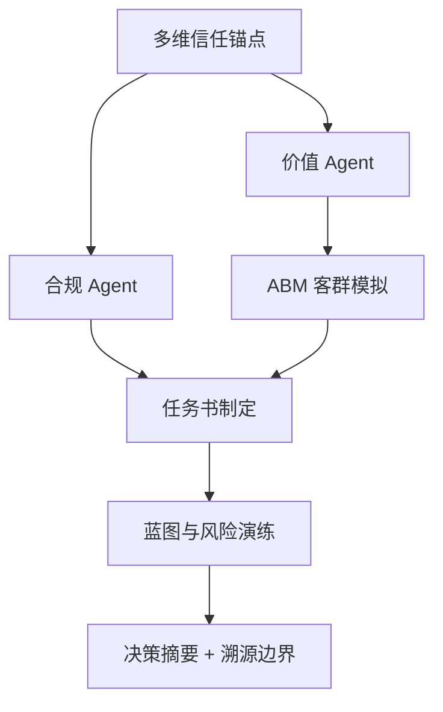

# DDS Agent v2 决策推演报告

## 输入假设
- 地块输入：{'city': '杭州', 'address': '120.193234,30.29133', 'lng': 120.193234, 'lat': 30.29133, 'district': None, 'vision': '大平层'}
- 客户目标：{'product_type': '改善产品', 'benchmark': None, 'expected_price': 50000.0, 'floor_area_ratio': 2.0, 'year': 2026}

## 决策逻辑图


## CEO 权重引擎 / 综合评分
**preset**: invest
**total_score**: 57.7 / 100
**grade**: B+
**overall_confidence**: 0.73
**interpretation**: 置信度较高，模型输入充分、内部一致。 综合得分中等，建议先补齐一级法定硬约束 + 客群校验后再决策。

| Agent | 原始评分 | 置信度 | 权重 | 贡献分 | 评分分布 |
|---|---:|---:|---:|---:|:---:|
| compliance | 55.0 | 0.5 | 0.3 | 8.25 | `[======----]` |
| value | 79.3 | 1.0 | 0.2 | 15.87 | `[========--]` |
| abm | 100 | 1.0 | 0.15 | 15.0 | `[==========]` |
| unit_mix | 100 | 0.7 | 0.15 | 10.5 | `[==========]` |
| migration | 78.2 | 0.65 | 0.1 | 5.08 | `[========--]` |
| blueprint | 50 | 0.6 | 0.1 | 3.0 | `[=====-----]` |

## 决策摘要
- 结论：可进入投拓测算，但需先补齐一级法定硬约束后才能定最终拿地价。
- 拿地敏感区间：{'conservative': 27634.0, 'balanced': 32569.0, 'aggressive': 37504.0, 'unit': '元/㎡土地口径粗算'}
- 核心机会：客户目标产品为改善产品，应优先验证低密、私密性、到达仪式感和景观资源是否能支撑溢价。
- 硬性阻断：暂无，但一级硬约束仍需补齐

## L3级线上舆情校验与交叉比对
| 舆情来源 | 爆料时间 | 爆料摘要 | 关联校验匹配 | 关联度得分 | 校验结论 |
| :--- | :--- | :--- | :--- | :--- | :--- |
| 三亚海棠湾高端市场2026Q1报告 | 2026-03-31 | 海棠湾商墅产品2026年Q1成交均价约85000元/㎡，去化周期约14个月。高端康养客群为主要买家。 | 概念匹配 | 0.2 | ⚠️ 弱相关，仅供参考 |


## Data Foundation
```json
{
  "level_1_legal_constraints": {
    "status": "missing_level_1_constraints",
    "trust_weight": 1.0,
    "available": false,
    "required_before_final_pricing": [
      "容积率上限",
      "用地性质",
      "限高",
      "退线",
      "绿地率",
      "车位指标",
      "商业比例",
      "产权/分割销售口径"
    ]
  },
  "level_2_gis_physical": {
    "status": "available",
    "trust_weight": 0.7,
    "nearest_poi": {
      "school": {
        "label": "学校",
        "name": "杭州天杭教育集团桂苑校区",
        "distance_m": 126
      },
      "hospital": {
        "label": "医院",
        "name": "智慧堂中医诊所",
        "distance_m": 34
      },
      "subway": {
        "label": "地铁站",
        "name": "闸弄口地铁站A口",
        "distance_m": 678
      },
      "bus": {
        "label": "公交站",
        "name": "第二社会福利院(公交站)",
        "distance_m": 101
      },
      "mall": {
        "label": "商场",
        "name": "杭州华联(董家桥路店)",
        "distance_m": 51
      },
      "park": {
        "label": "公园",
        "name": "三里新城中央公园",
        "distance_m": 258
      },
      "supermarket": {
        "label": "超市",
        "name": "东方时代",
        "distance_m": 350
      }
    },
    "competitor_sample_count": 60
  },
  "level_3_market_sentiment": {
    "status": "online_supplement_available",
    "trust_weight": 0.35,
    "proxy_signals": {
      "product_type": "改善产品",
      "benchmark": null,
      "room_type_supply": {
        "4室户型": 30,
        "5室户型": 19,
        "商业户型": 18,
        "3室户型": 11,
        "6室户型": 2,
        "别墅户型": 1
      },
      "note": "当前用竞品标签、户型结构、对标项目价格作为三级情绪/非标溢价的弱代理。"
    },
    "online_evidence": [
      {
        "query": "三亚海棠湾商墅",
        "title": "三亚海棠湾高端市场2026Q1报告",
        "url": "https://example.com/sanya-report",
        "summary": "海棠湾商墅产品2026年Q1成交均价约85000元/㎡，去化周期约14个月。高端康养客群为主要买家。",
        "data_date": "2026-03-31",
        "confidence": "supplemental",
        "captured_at": "2026-05-12T18:32:14",
        "role": "online_supplement_only",
        "cross_check_score": 0.2,
        "cross_check_matches": [
          "概念匹配"
        ],
        "is_highly_relevant": false
      }
    ]
  }
}
```

## Compliance Agent
```json
{
  "role": "合规 Agent",
  "verdict": "conditional",
  "hard_constraints_missing": [
    "容积率上限",
    "用地性质",
    "限高",
    "退线",
    "绿地率",
    "车位指标",
    "商业比例",
    "产权/分割销售口径"
  ],
  "warnings": [
    "容积率 2.0 是客户假设，尚未由出让合同或控规文件确认。",
    "缺少一级法定硬约束，当前只能输出投拓初判，不能作为最终拿地价。"
  ],
  "blockers": [],
  "pricing_boundary": "只能给楼面地价敏感区间，最终价格需等一级数据校准。"
}
```

## Value Agent
```json
{
  "role": "价值 Agent",
  "market_avg_price_cny": 49347.0,
  "benchmark": null,
  "benchmark_premium_ratio": null,
  "opportunities": [
    "客户目标产品为改善产品，应优先验证低密、私密性、到达仪式感和景观资源是否能支撑溢价。"
  ],
  "product_reference": {
    "observed_area_ranges": [
      "1249-2581㎡",
      "355㎡",
      "58-95㎡",
      "315㎡",
      "315-350㎡",
      "305-406㎡",
      "350㎡",
      "nan",
      "308-311㎡",
      "336-430㎡",
      "nan",
      "735㎡"
    ],
    "observed_room_types": [
      "商业户型",
      "商业户型",
      "商业户型",
      "商业户型",
      "商业户型",
      "商业户型",
      "商业户型",
      "nan",
      "商业户型",
      "商业户型",
      "nan",
      "商业户型"
    ],
    "top_price_projects": [
      {
        "project_name": "英蓝岫町华庭",
        "price": 119999.0,
        "area_range": "180-240㎡",
        "room_types": "3室户型,5室户型"
      },
      {
        "project_name": "凤起钱潮",
        "price": 111600.0,
        "area_range": "137-232㎡",
        "room_types": "3室户型,4室户型,5室户型"
      },
      {
        "project_name": "ONE53",
        "price": 85000.0,
        "area_range": "244-438㎡",
        "room_types": "商业户型"
      },
      {
        "project_name": "江河鸣翠公寓",
        "price": 80000.0,
        "area_range": "nan",
        "room_types": "nan"
      },
      {
        "project_name": "喧泽大厦",
        "price": 74728.0,
        "area_range": "735㎡",
        "room_types": "商业户型"
      }
    ]
  },
  "vector_evidence": {
    "status": "ok",
    "source": "chromadb",
    "collection": "competitor_projects",
    "items": [
      {
        "text": "杭州下城市中心的碧美好名城，地址杭州下城市中心杭氧街与胜南支路交叉口，物业类型商业，建筑类型高层，户型2室，面积55㎡，最新价格元/㎡，参考价格元/㎡，开发商碧桂园，容积率1.9，绿化率30%，装修带装修，物业费5元/㎡/月，标签[\"大阳台\", \"复式\", \"装修交付\", \"轨交房\", \"卧室全朝南\"]",
        "metadata": {
          "project_name": "碧美好名城",
          "district": "下城",
          "city": "杭州",
          "year": 2011,
          "developer": "碧桂园",
          "unit_price": 0,
          "property_type": "商业",
          "source": "vault"
        },
        "distance": 0.1761,
        "collection": "competitor_projects"
      },
      {
        "text": "杭州下城市中心的嘉北辰筑，地址杭州下城市中心杭氧街与胜南支路交叉口，物业类型商业，建筑类型高层，户型2室，面积55㎡，最新价格元/㎡，参考价格元/㎡，开发商融创，容积率1.9，绿化率30%，装修带装修，物业费5元/㎡/月，标签[\"大阳台\", \"复式\", \"装修交付\", \"轨交房\", \"卧室全朝南\"]",
        "metadata": {
          "city": "杭州",
          "project_name": "嘉北辰筑",
          "unit_price": 0,
          "source": "vault",
          "developer": "融创",
          "year": 2017,
          "property_type": "商业",
          "district": "下城"
        },
        "distance": 0.1806,
        "collection": "competitor_projects"
      },
      {
        "text": "杭州下城市中心的武林梅林雅苑，地址杭州下城市中心杭氧街与胜南支路交叉口，物业类型商业，建筑类型高层，户型2室，面积55㎡，最新价格元/㎡，参考价格元/㎡，开发商朗诗，容积率1.9，绿化率30%，装修带装修，物业费5元/㎡/月，标签[\"大阳台\", \"复式\", \"装修交付\", \"轨交房\", \"卧室全朝南\"]",
        "metadata": {
          "year": 2016,
          "source": "vault",
          "project_name": "武林梅林雅苑",
          "district": "下城",
          "unit_price": 0,
          "property_type": "商业",
          "developer": "朗诗",
          "city": "杭州"
        },
        "distance": 0.1813,
        "collection": "competitor_projects"
      },
      {
        "text": "杭州下城市中心的海理想府，地址杭州下城市中心杭氧街与胜南支路交叉口，物业类型商业，建筑类型高层，户型2室，面积55㎡，最新价格元/㎡，参考价格元/㎡，开发商滨江集团，容积率1.9，绿化率30%，装修带装修，物业费5元/㎡/月，标签[\"大阳台\", \"复式\", \"装修交付\", \"轨交房\", \"卧室全朝南\"]",
        "metadata": {
          "unit_price": 0,
          "district": "下城",
          "project_name": "海理想府",
          "year": 2024,
          "developer": "滨江集团",
          "city": "杭州",
          "source": "vault",
          "property_type": "商业"
        },
        "distance": 0.1821,
        "collection": "competitor_projects"
      },
      {
        "text": "杭州下城市中心的锦苑，地址杭州下城市中心杭氧街与胜南支路交叉口，物业类型商业，建筑类型高层，户型2室，面积55㎡，最新价格元/㎡，参考价格元/㎡，开发商金茂，容积率1.9，绿化率30%，装修带装修，物业费5元/㎡/月，标签[\"大阳台\", \"复式\", \"装修交付\", \"轨交房\", \"卧室全朝南\"]",
        "metadata": {
          "source": "vault",
          "year": 2013,
          "city": "杭州",
          "unit_price": 0,
          "property_type": "商业",
          "project_name": "锦苑",
          "developer": "金茂",
          "district": "下城"
        },
        "distance": 0.1835,
        "collection": "competitor_projects"
      }
    ]
  },
  "online_cross_check": {
    "status": "supplemental_only",
    "source_count": 1,
    "sources": [
      {
        "query": "三亚海棠湾商墅",
        "title": "三亚海棠湾高端市场2026Q1报告",
        "url": "https://example.com/sanya-report",
        "summary": "海棠湾商墅产品2026年Q1成交均价约85000元/㎡，去化周期约14个月。高端康养客群为主要买家。",
        "data_date": "2026-03-31",
        "confidence": "supplemental",
        "captured_at": "2026-05-12T18:32:14",
        "role": "online_supplement_only",
        "cross_check_score": 0.2,
        "cross_check_matches": [
          "概念匹配"
        ],
        "is_highly_relevant": false
      }
    ]
  }
}
```

## 类似地块证据（向量库/Vault 兜底）
**来源**: chromadb · competitor_projects  

| # | 项目 | 区域 | 年份 | 单价 | 面积段 | 开发商 | 相似度 |
|---:|---|---|---:|---:|---|---|---:|
| 1 | 碧美好名城 | 下城 | 2011 | 0 | - | 碧桂园 | 82% |
| 2 | 嘉北辰筑 | 下城 | 2017 | 0 | - | 融创 | 82% |
| 3 | 武林梅林雅苑 | 下城 | 2016 | 0 | - | 朗诗 | 82% |
| 4 | 海理想府 | 下城 | 2024 | 0 | - | 滨江集团 | 82% |
| 5 | 锦苑 | 下城 | 2013 | 0 | - | 金茂 | 82% |

## ABM Market Agent
```json
{
  "role": "ABM 市场模拟 Agent",
  "method": "Random Utility + MNL，蒙特卡洛 N=1000",
  "city": "杭州",
  "product": {
    "name": "改善产品",
    "unit_price": 49347.0,
    "area": 140,
    "pref_score": {
      "景观": 0.65,
      "私密": 0.55,
      "圈层": 0.55,
      "户型": 0.85,
      "通勤": 0.65,
      "学校": 0.7,
      "品牌": 0.6
    }
  },
  "n_personas": 1000,
  "avg_buy_probability": 0.527,
  "top_personas": [
    {
      "name": "互联网工程师",
      "share": 0.401,
      "raw_count": 339,
      "score": 62.3,
      "wtp_p50": 42254.0,
      "wtp_p90": 66420.0
    },
    {
      "name": "浙商投资",
      "share": 0.288,
      "raw_count": 197,
      "score": 77.0,
      "wtp_p50": 69309.0,
      "wtp_p90": 70315.0
    },
    {
      "name": "本地改善",
      "share": 0.189,
      "raw_count": 249,
      "score": 39.9,
      "wtp_p50": 30487.0,
      "wtp_p90": 51424.0
    }
  ],
  "personas": [
    {
      "name": "互联网工程师",
      "share": 0.401,
      "raw_count": 339,
      "score": 62.3,
      "wtp_p50": 42254.0,
      "wtp_p90": 66420.0
    },
    {
      "name": "浙商投资",
      "share": 0.288,
      "raw_count": 197,
      "score": 77.0,
      "wtp_p50": 69309.0,
      "wtp_p90": 70315.0
    },
    {
      "name": "本地改善",
      "share": 0.189,
      "raw_count": 249,
      "score": 39.9,
      "wtp_p50": 30487.0,
      "wtp_p90": 51424.0
    },
    {
      "name": "学区刚需",
      "share": 0.089,
      "raw_count": 156,
      "score": 30.1,
      "wtp_p50": 26364.0,
      "wtp_p90": 39971.0
    },
    {
      "name": "人才落户",
      "share": 0.033,
      "raw_count": 59,
      "score": 29.7,
      "wtp_p50": 27520.0,
      "wtp_p90": 40668.0
    }
  ],
  "personas_raw": [
    {
      "archetype": "互联网工程师",
      "age": 38,
      "annual_income": 51.3,
      "total_asset": 337.4,
      "dp_ratio": 0.3,
      "pref": {
        "景观": 0.46,
        "私密": 0.42,
        "圈层": 0.56,
        "户型": 0.9,
        "通勤": 0.97,
        "学校": 0.57,
        "品牌": 0.56
      },
      "risk_aversion": 0.5,
      "budget_ceiling": 843.5,
      "family_size": 4,
      "kids": 1,
      "elderly_cohabit": false,
      "social_class": "B",
      "info_channel": "social",
      "decision_urgency": 0.88,
      "job_detail": "电商系统架构师",
      "life_stage": "三口之家(学龄段)",
      "current_living": "杭州中环品质两居，车位及空间极其拥挤",
      "living_pain": "小区无地下车库且人车不分流，小孩在楼下玩耍或者推婴儿车极为不安全。",
      "detail_need": "讲究超高得房率（超85%），主卧套房必须配备独立步入式衣帽间与干湿分离双卫。",
      "commute_pref": "在阿里西溪园区/钱江新城上班，期望有便利的高架或地铁接驳。",
      "lifestyle_pref": "倡导轻户外，周末常带家人自驾野营或山系徒步，注重生活情调与手作咖啡。",
      "funds_source": "名下持有一套旧两居，置换回款 65% + 个人理财储蓄补充 + 公积金商业贷",
      "brand_service_need": "重性价比，不盲信大牌，但要求物业管理有序、绿化修剪及时、人防技防规范。",
      "vacation_frequency": "常年本地稳定居住，工作日职住通勤动线规则单一。"
    },
    {
      "archetype": "互联网工程师",
      "age": 32,
      "annual_income": 21.0,
      "total_asset": 126.7,
      "dp_ratio": 0.3,
      "pref": {
        "景观": 0.4,
        "私密": 0.58,
        "圈层": 0.54,
        "户型": 0.95,
        "通勤": 0.96,
        "学校": 0.78,
        "品牌": 0.59
      },
      "risk_aversion": 0.41,
      "budget_ceiling": 316.8,
      "family_size": 3,
      "kids": 2,
      "elderly_cohabit": true,
      "social_class": "B",
      "info_channel": "social",
      "decision_urgency": 0.92,
      "job_detail": "阿里 P7 资深技术专家",
      "life_stage": "二胎黄金期中大户型",
      "current_living": "杭州中环品质两居，车位及空间极其拥挤",
      "living_pain": "小区无地下车库且人车不分流，小孩在楼下玩耍或者推婴儿车极为不安全。",
      "detail_need": "讲究超高得房率（超85%），主卧套房必须配备独立步入式衣帽间与干湿分离双卫。",
      "commute_pref": "在阿里西溪园区/钱江新城上班，期望有便利的高架或地铁接驳。",
      "lifestyle_pref": "倡导轻户外，周末常带家人自驾野营或山系徒步，注重生活情调与手作咖啡。",
      "funds_source": "夫妻双方积蓄 + 双方父母出资赞助首付 + 公积金商业组合贷款",
      "brand_service_need": "重性价比，不盲信大牌，但要求物业管理有序、绿化修剪及时、人防技防规范。",
      "vacation_frequency": "常年本地稳定居住，工作日职住通勤动线规则单一。"
    },
    {
      "archetype": "互联网工程师",
      "age": 33,
      "annual_income": 29.6,
      "total_asset": 229.5,
      "dp_ratio": 0.3,
      "pref": {
        "景观": 0.48,
        "私密": 0.44,
        "圈层": 0.63,
        "户型": 0.79,
        "通勤": 0.82,
        "学校": 0.8,
        "品牌": 0.73
      },
      "risk_aversion": 0.66,
      "budget_ceiling": 573.9,
      "family_size": 4,
      "kids": 1,
      "elderly_cohabit": false,
      "social_class": "B",
      "info_channel": "social",
      "decision_urgency": 0.52,
      "job_detail": "大厂 AI 大模型算法总监",
      "life_stage": "三口之家(幼龄段)",
      "current_living": "杭州中环品质两居，车位及空间极其拥挤",
      "living_pain": "小区无地下车库且人车不分流，小孩在楼下玩耍或者推婴儿车极为不安全。",
      "detail_need": "要求独立电梯入户，主次卧动线分明，配备独立保姆房和私密后院。",
      "commute_pref": "在阿里西溪园区/钱江新城上班，期望有便利的高架或地铁接驳。",
      "lifestyle_pref": "倡导轻户外，周末常带家人自驾野营或山系徒步，注重生活情调与手作咖啡。",
      "funds_source": "夫妻双方积蓄 + 双方父母出资赞助首付 + 公积金商业组合贷款",
      "brand_service_need": "非仁恒、绿城、万科等金牌开发商不买，极度看重高端精装质量与顶级物业的增值口碑。",
      "vacation_frequency": "常年本地稳定居住，工作日职住通勤动线规则单一。"
    },
    {
      "archetype": "互联网工程师",
      "age": 32,
      "annual_income": 81.5,
      "total_asset": 507.7,
      "dp_ratio": 0.3,
      "pref": {
        "景观": 0.55,
        "私密": 0.41,
        "圈层": 0.52,
        "户型": 0.81,
        "通勤": 0.82,
        "学校": 0.6,
        "品牌": 0.65
      },
      "risk_aversion": 0.43,
      "budget_ceiling": 1269.4,
      "family_size": 3,
      "kids": 1,
      "elderly_cohabit": false,
      "social_class": "B",
      "info_channel": "social",
      "decision_urgency": 0.94,
      "job_detail": "阿里 P7 资深技术专家",
      "life_stage": "三口之家(幼龄段)",
      "current_living": "杭州中环品质两居，车位及空间极其拥挤",
      "living_pain": "小区无地下车库且人车不分流，小孩在楼下玩耍或者推婴儿车极为不安全。",
      "detail_need": "讲究超高得房率（超85%），主卧套房必须配备独立步入式衣帽间与干湿分离双卫。",
      "commute_pref": "在阿里西溪园区/钱江新城上班，期望有便利的高架或地铁接驳。",
      "lifestyle_pref": "倡导轻户外，周末常带家人自驾野营或山系徒步，注重生活情调与手作咖啡。",
      "funds_source": "夫妻双方积蓄 + 双方父母出资赞助首付 + 公积金商业组合贷款",
      "brand_service_need": "重性价比，不盲信大牌，但要求物业管理有序、绿化修剪及时、人防技防规范。",
      "vacation_frequency": "常年本地稳定居住，工作日职住通勤动线规则单一。"
    },
    {
      "archetype": "互联网工程师",
      "age": 37,
      "annual_income": 65.8,
      "total_asset": 383.1,
      "dp_ratio": 0.3,
      "pref": {
        "景观": 0.4,
        "私密": 0.52,
        "圈层": 0.53,
        "户型": 0.99,
        "通勤": 0.68,
        "学校": 0.73,
        "品牌": 0.65
      },
      "risk_aversion": 0.51,
      "budget_ceiling": 957.8,
      "family_size": 5,
      "kids": 2,
      "elderly_cohabit": false,
      "social_class": "B",
      "info_channel": "social",
      "decision_urgency": 0.85,
      "job_detail": "大厂 AI 大模型算法总监",
      "life_stage": "二胎黄金期中大户型",
      "current_living": "杭州中环品质两居，车位及空间极其拥挤",
      "living_pain": "小区无地下车库且人车不分流，小孩在楼下玩耍或者推婴儿车极为不安全。",
      "detail_need": "要求独立电梯入户，主次卧动线分明，配备独立保姆房和私密后院。",
      "commute_pref": "在阿里西溪园区/钱江新城上班，期望有便利的高架或地铁接驳。",
      "lifestyle_pref": "倡导轻户外，周末常带家人自驾野营或山系徒步，注重生活情调与手作咖啡。",
      "funds_source": "夫妻双方积蓄 + 双方父母出资赞助首付 + 公积金商业组合贷款",
      "brand_service_need": "重性价比，不盲信大牌，但要求物业管理有序、绿化修剪及时、人防技防规范。",
      "vacation_frequency": "常年本地稳定居住，工作日职住通勤动线规则单一。"
    },
    {
      "archetype": "互联网工程师",
      "age": 39,
      "annual_income": 22.5,
      "total_asset": 123.8,
      "dp_ratio": 0.3,
      "pref": {
        "景观": 0.53,
        "私密": 0.39,
        "圈层": 0.56,
        "户型": 0.84,
        "通勤": 0.8,
        "学校": 0.74,
        "品牌": 0.63
      },
      "risk_aversion": 0.69,
      "budget_ceiling": 309.5,
      "family_size": 3,
      "kids": 1,
      "elderly_cohabit": true,
      "social_class": "B",
      "info_channel": "social",
      "decision_urgency": 0.59,
      "job_detail": "独角兽前端负责人",
      "life_stage": "三口之家(学龄段)",
      "current_living": "杭州中环品质两居，车位及空间极其拥挤",
      "living_pain": "小区无地下车库且人车不分流，小孩在楼下玩耍或者推婴儿车极为不安全。",
      "detail_need": "讲究超高得房率（超85%），主卧套房必须配备独立步入式衣帽间与干湿分离双卫。",
      "commute_pref": "在阿里西溪园区/钱江新城上班，期望有便利的高架或地铁接驳。",
      "lifestyle_pref": "倡导轻户外，周末常带家人自驾野营或山系徒步，注重生活情调与手作咖啡。",
      "funds_source": "夫妻双方积蓄 + 双方父母出资赞助首付 + 公积金商业组合贷款",
      "brand_service_need": "重性价比，不盲信大牌，但要求物业管理有序、绿化修剪及时、人防技防规范。",
      "vacation_frequency": "常年本地稳定居住，工作日职住通勤动线规则单一。"
    },
    {
      "archetype": "互联网工程师",
      "age": 39,
      "annual_income": 36.9,
      "total_asset": 223.5,
      "dp_ratio": 0.3,
      "pref": {
        "景观": 0.61,
        "私密": 0.42,
        "圈层": 0.5,
        "户型": 0.82,
        "通勤": 0.71,
        "学校": 0.66,
        "品牌": 0.65
      },
      "risk_aversion": 0.61,
      "budget_ceiling": 558.6,
      "family_size": 3,
      "kids": 1,
      "elderly_cohabit": false,
      "social_class": "B",
      "info_channel": "social",
      "decision_urgency": 0.89,
      "job_detail": "独角兽前端负责人",
      "life_stage": "三口之家(学龄段)",
      "current_living": "杭州中环品质两居，车位及空间极其拥挤",
      "living_pain": "小区无地下车库且人车不分流，小孩在楼下玩耍或者推婴儿车极为不安全。",
      "detail_need": "要求独立电梯入户，主次卧动线分明，配备独立保姆房和私密后院。",
      "commute_pref": "在阿里西溪园区/钱江新城上班，期望有便利的高架或地铁接驳。",
      "lifestyle_pref": "倡导轻户外，周末常带家人自驾野营或山系徒步，注重生活情调与手作咖啡。",
      "funds_source": "名下已有企业股权套现或分红现金，一次性全款付清，基本不加杠杆",
      "brand_service_need": "重性价比，不盲信大牌，但要求物业管理有序、绿化修剪及时、人防技防规范。",
      "vacation_frequency": "常年本地稳定居住，工作日职住通勤动线规则单一。"
    },
    {
      "archetype": "互联网工程师",
      "age": 40,
      "annual_income": 62.0,
      "total_asset": 354.4,
      "dp_ratio": 0.3,
      "pref": {
        "景观": 0.61,
        "私密": 0.48,
        "圈层": 0.52,
        "户型": 0.72,
        "通勤": 0.76,
        "学校": 0.78,
        "品牌": 0.63
      },
      "risk_aversion": 0.52,
      "budget_ceiling": 886.1,
      "family_size": 4,
      "kids": 0,
      "elderly_cohabit": true,
      "social_class": "B",
      "info_channel": "social",
      "decision_urgency": 0.76,
      "job_detail": "阿里 P7 资深技术专家",
      "life_stage": "成熟期核心家庭",
      "current_living": "杭州中环品质两居，车位及空间极其拥挤",
      "living_pain": "当前房屋属于旧多层无电梯房，父母年纪渐高每天爬楼梯极为吃力。",
      "detail_need": "要求独立电梯入户，主次卧动线分明，配备独立保姆房和私密后院。",
      "commute_pref": "在阿里西溪园区/钱江新城上班，期望有便利的高架或地铁接驳。",
      "lifestyle_pref": "倡导轻户外，周末常带家人自驾野营或山系徒步，注重生活情调与手作咖啡。",
      "funds_source": "名下已有企业股权套现或分红现金，一次性全款付清，基本不加杠杆",
      "brand_service_need": "重性价比，不盲信大牌，但要求物业管理有序、绿化修剪及时、人防技防规范。",
      "vacation_frequency": "常年本地稳定居住，工作日职住通勤动线规则单一。"
    },
    {
      "archetype": "互联网工程师",
      "age": 36,
      "annual_income": 69.7,
      "total_asset": 451.8,
      "dp_ratio": 0.3,
      "pref": {
        "景观": 0.44,
        "私密": 0.51,
        "圈层": 0.56,
        "户型": 0.86,
        "通勤": 0.94,
        "学校": 0.77,
        "品牌": 0.45
      },
      "risk_aversion": 0.5,
      "budget_ceiling": 1129.5,
      "family_size": 3,
      "kids": 1,
      "elderly_cohabit": false,
      "social_class": "B",
      "info_channel": "social",
      "decision_urgency": 1.0,
      "job_detail": "大厂 AI 大模型算法总监",
      "life_stage": "三口之家(幼龄段)",
      "current_living": "杭州中环品质两居，车位及空间极其拥挤",
      "living_pain": "小区无地下车库且人车不分流，小孩在楼下玩耍或者推婴儿车极为不安全。",
      "detail_need": "讲究超高得房率（超85%），主卧套房必须配备独立步入式衣帽间与干湿分离双卫。",
      "commute_pref": "在阿里西溪园区/钱江新城上班，期望有便利的高架或地铁接驳。",
      "lifestyle_pref": "倡导轻户外，周末常带家人自驾野营或山系徒步，注重生活情调与手作咖啡。",
      "funds_source": "夫妻双方积蓄 + 双方父母出资赞助首付 + 公积金商业组合贷款",
      "brand_service_need": "重性价比，不盲信大牌，但要求物业管理有序、绿化修剪及时、人防技防规范。",
      "vacation_frequency": "常年本地稳定居住，工作日职住通勤动线规则单一。"
    },
    {
      "archetype": "互联网工程师",
      "age": 35,
      "annual_income": 80.7,
      "total_asset": 605.2,
      "dp_ratio": 0.3,
      "pref": {
        "景观": 0.51,
        "私密": 0.34,
        "圈层": 0.5,
        "户型": 0.77,
        "通勤": 0.8,
        "学校": 0.68,
        "品牌": 0.65
      },
      "risk_aversion": 0.5,
      "budget_ceiling": 1513.1,
      "family_size": 3,
      "kids": 1,
      "elderly_cohabit": false,
      "social_class": "B",
      "info_channel": "social",
      "decision_urgency": 0.92,
      "job_detail": "阿里 P7 资深技术专家",
      "life_stage": "三口之家(幼龄段)",
      "current_living": "杭州中环品质两居，车位及空间极其拥挤",
      "living_pain": "小区无地下车库且人车不分流，小孩在楼下玩耍或者推婴儿车极为不安全。",
      "detail_need": "讲究超高得房率（超85%），主卧套房必须配备独立步入式衣帽间与干湿分离双卫。",
      "commute_pref": "在阿里西溪园区/钱江新城上班，期望有便利的高架或地铁接驳。",
      "lifestyle_pref": "倡导轻户外，周末常带家人自驾野营或山系徒步，注重生活情调与手作咖啡。",
      "funds_source": "名下持有一套旧两居，置换回款 65% + 个人理财储蓄补充 + 公积金商业贷",
      "brand_service_need": "重性价比，不盲信大牌，但要求物业管理有序、绿化修剪及时、人防技防规范。",
      "vacation_frequency": "常年本地稳定居住，工作日职住通勤动线规则单一。"
    },
    {
      "archetype": "互联网工程师",
      "age": 38,
      "annual_income": 39.6,
      "total_asset": 282.2,
      "dp_ratio": 0.3,
      "pref": {
        "景观": 0.35,
        "私密": 0.46,
        "圈层": 0.56,
        "户型": 0.96,
        "通勤": 0.69,
        "学校": 0.72,
        "品牌": 0.52
      },
      "risk_aversion": 0.5,
      "budget_ceiling": 705.6,
      "family_size": 3,
      "kids": 2,
      "elderly_cohabit": false,
      "social_class": "B",
      "info_channel": "social",
      "decision_urgency": 0.72,
      "job_detail": "阿里 P7 资深技术专家",
      "life_stage": "二胎黄金期中大户型",
      "current_living": "杭州中环品质两居，车位及空间极其拥挤",
      "living_pain": "小区无地下车库且人车不分流，小孩在楼下玩耍或者推婴儿车极为不安全。",
      "detail_need": "讲究超高得房率（超85%），主卧套房必须配备独立步入式衣帽间与干湿分离双卫。",
      "commute_pref": "在阿里西溪园区/钱江新城上班，期望有便利的高架或地铁接驳。",
      "lifestyle_pref": "倡导轻户外，周末常带家人自驾野营或山系徒步，注重生活情调与手作咖啡。",
      "funds_source": "夫妻双方积蓄 + 双方父母出资赞助首付 + 公积金商业组合贷款",
      "brand_service_need": "重性价比，不盲信大牌，但要求物业管理有序、绿化修剪及时、人防技防规范。",
      "vacation_frequency": "常年本地稳定居住，工作日职住通勤动线规则单一。"
    },
    {
      "archetype": "互联网工程师",
      "age": 38,
      "annual_income": 43.7,
      "total_asset": 324.4,
      "dp_ratio": 0.3,
      "pref": {
        "景观": 0.56,
        "私密": 0.38,
        "圈层": 0.58,
        "户型": 0.97,
        "通勤": 0.78,
        "学校": 0.76,
        "品牌": 0.55
      },
      "risk_aversion": 0.36,
      "budget_ceiling": 811.1,
      "family_size": 3,
      "kids": 1,
      "elderly_cohabit": false,
      "social_class": "B",
      "info_channel": "social",
      "decision_urgency": 0.86,
      "job_detail": "大厂 AI 大模型算法总监",
      "life_stage": "三口之家(学龄段)",
      "current_living": "杭州中环品质两居，车位及空间极其拥挤",
      "living_pain": "小区无地下车库且人车不分流，小孩在楼下玩耍或者推婴儿车极为不安全。",
      "detail_need": "要求独立电梯入户，主次卧动线分明，配备独立保姆房和私密后院。",
      "commute_pref": "在阿里西溪园区/钱江新城上班，期望有便利的高架或地铁接驳。",
      "lifestyle_pref": "倡导轻户外，周末常带家人自驾野营或山系徒步，注重生活情调与手作咖啡。",
      "funds_source": "名下已有企业股权套现或分红现金，一次性全款付清，基本不加杠杆",
      "brand_service_need": "重性价比，不盲信大牌，但要求物业管理有序、绿化修剪及时、人防技防规范。",
      "vacation_frequency": "常年本地稳定居住，工作日职住通勤动线规则单一。"
    },
    {
      "archetype": "互联网工程师",
      "age": 31,
      "annual_income": 78.0,
      "total_asset": 529.9,
      "dp_ratio": 0.3,
      "pref": {
        "景观": 0.54,
        "私密": 0.38,
        "圈层": 0.59,
        "户型": 0.69,
        "通勤": 1.0,
        "学校": 0.47,
        "品牌": 0.57
      },
      "risk_aversion": 0.61,
      "budget_ceiling": 1324.8,
      "family_size": 4,
      "kids": 1,
      "elderly_cohabit": false,
      "social_class": "B",
      "info_channel": "social",
      "decision_urgency": 1.0,
      "job_detail": "大厂 AI 大模型算法总监",
      "life_stage": "三口之家(幼龄段)",
      "current_living": "杭州中环品质两居，车位及空间极其拥挤",
      "living_pain": "小区无地下车库且人车不分流，小孩在楼下玩耍或者推婴儿车极为不安全。",
      "detail_need": "要求采光通透，全明户型，带多功能嵌入式收纳墙以最大化空间利用。",
      "commute_pref": "在阿里西溪园区/钱江新城上班，期望有便利的高架或地铁接驳。",
      "lifestyle_pref": "倡导轻户外，周末常带家人自驾野营或山系徒步，注重生活情调与手作咖啡。",
      "funds_source": "夫妻双方积蓄 + 双方父母出资赞助首付 + 公积金商业组合贷款",
      "brand_service_need": "重性价比，不盲信大牌，但要求物业管理有序、绿化修剪及时、人防技防规范。",
      "vacation_frequency": "常年本地稳定居住，工作日职住通勤动线规则单一。"
    },
    {
      "archetype": "互联网工程师",
      "age": 32,
      "annual_income": 47.8,
      "total_asset": 333.6,
      "dp_ratio": 0.3,
      "pref": {
        "景观": 0.57,
        "私密": 0.43,
        "圈层": 0.51,
        "户型": 0.71,
        "通勤": 0.85,
        "学校": 0.59,
        "品牌": 0.58
      },
      "risk_aversion": 0.55,
      "budget_ceiling": 834.1,
      "family_size": 3,
      "kids": 1,
      "elderly_cohabit": false,
      "social_class": "B",
      "info_channel": "social",
      "decision_urgency": 0.99,
      "job_detail": "独角兽前端负责人",
      "life_stage": "三口之家(幼龄段)",
      "current_living": "杭州中环品质两居，车位及空间极其拥挤",
      "living_pain": "小区无地下车库且人车不分流，小孩在楼下玩耍或者推婴儿车极为不安全。",
      "detail_need": "讲究超高得房率（超85%），主卧套房必须配备独立步入式衣帽间与干湿分离双卫。",
      "commute_pref": "在阿里西溪园区/钱江新城上班，期望有便利的高架或地铁接驳。",
      "lifestyle_pref": "倡导轻户外，周末常带家人自驾野营或山系徒步，注重生活情调与手作咖啡。",
      "funds_source": "夫妻双方积蓄 + 双方父母出资赞助首付 + 公积金商业组合贷款",
      "brand_service_need": "重性价比，不盲信大牌，但要求物业管理有序、绿化修剪及时、人防技防规范。",
      "vacation_frequency": "常年本地稳定居住，工作日职住通勤动线规则单一。"
    },
    {
      "archetype": "互联网工程师",
      "age": 31,
      "annual_income": 58.0,
      "total_asset": 244.7,
      "dp_ratio": 0.3,
      "pref": {
        "景观": 0.43,
        "私密": 0.54,
        "圈层": 0.54,
        "户型": 0.81,
        "通勤": 0.91,
        "学校": 0.66,
        "品牌": 0.45
      },
      "risk_aversion": 0.62,
      "budget_ceiling": 611.7,
      "family_size": 3,
      "kids": 1,
      "elderly_cohabit": false,
      "social_class": "B",
      "info_channel": "social",
      "decision_urgency": 0.49,
      "job_detail": "大厂 AI 大模型算法总监",
      "life_stage": "三口之家(幼龄段)",
      "current_living": "杭州中环品质两居，车位及空间极其拥挤",
      "living_pain": "小区无地下车库且人车不分流，小孩在楼下玩耍或者推婴儿车极为不安全。",
      "detail_need": "讲究超高得房率（超85%），主卧套房必须配备独立步入式衣帽间与干湿分离双卫。",
      "commute_pref": "在阿里西溪园区/钱江新城上班，期望有便利的高架或地铁接驳。",
      "lifestyle_pref": "倡导轻户外，周末常带家人自驾野营或山系徒步，注重生活情调与手作咖啡。",
      "funds_source": "夫妻双方积蓄 + 双方父母出资赞助首付 + 公积金商业组合贷款",
      "brand_service_need": "重性价比，不盲信大牌，但要求物业管理有序、绿化修剪及时、人防技防规范。",
      "vacation_frequency": "常年本地稳定居住，工作日职住通勤动线规则单一。"
    },
    {
      "archetype": "互联网工程师",
      "age": 34,
      "annual_income": 65.2,
      "total_asset": 422.9,
      "dp_ratio": 0.3,
      "pref": {
        "景观": 0.43,
        "私密": 0.45,
        "圈层": 0.61,
        "户型": 0.76,
        "通勤": 0.94,
        "学校": 0.86,
        "品牌": 0.61
      },
      "risk_aversion": 0.36,
      "budget_ceiling": 1057.2,
      "family_size": 3,
      "kids": 1,
      "elderly_cohabit": false,
      "social_class": "B",
      "info_channel": "social",
      "decision_urgency": 0.68,
      "job_detail": "大厂 AI 大模型算法总监",
      "life_stage": "三口之家(幼龄段)",
      "current_living": "杭州中环品质两居，车位及空间极其拥挤",
      "living_pain": "小区无地下车库且人车不分流，小孩在楼下玩耍或者推婴儿车极为不安全。",
      "detail_need": "要求独立电梯入户，主次卧动线分明，配备独立保姆房和私密后院。",
      "commute_pref": "在阿里西溪园区/钱江新城上班，期望有便利的高架或地铁接驳。",
      "lifestyle_pref": "倡导轻户外，周末常带家人自驾野营或山系徒步，注重生活情调与手作咖啡。",
      "funds_source": "夫妻双方积蓄 + 双方父母出资赞助首付 + 公积金商业组合贷款",
      "brand_service_need": "重性价比，不盲信大牌，但要求物业管理有序、绿化修剪及时、人防技防规范。",
      "vacation_frequency": "常年本地稳定居住，工作日职住通勤动线规则单一。"
    },
    {
      "archetype": "互联网工程师",
      "age": 36,
      "annual_income": 96.6,
      "total_asset": 487.6,
      "dp_ratio": 0.3,
      "pref": {
        "景观": 0.54,
        "私密": 0.44,
        "圈层": 0.48,
        "户型": 0.73,
        "通勤": 0.84,
        "学校": 0.73,
        "品牌": 0.62
      },
      "risk_aversion": 0.53,
      "budget_ceiling": 1219.1,
      "family_size": 3,
      "kids": 1,
      "elderly_cohabit": false,
      "social_class": "B",
      "info_channel": "social",
      "decision_urgency": 1.0,
      "job_detail": "独角兽前端负责人",
      "life_stage": "三口之家(幼龄段)",
      "current_living": "杭州中环品质两居，车位及空间极其拥挤",
      "living_pain": "小区无地下车库且人车不分流，小孩在楼下玩耍或者推婴儿车极为不安全。",
      "detail_need": "讲究超高得房率（超85%），主卧套房必须配备独立步入式衣帽间与干湿分离双卫。",
      "commute_pref": "在阿里西溪园区/钱江新城上班，期望有便利的高架或地铁接驳。",
      "lifestyle_pref": "倡导轻户外，周末常带家人自驾野营或山系徒步，注重生活情调与手作咖啡。",
      "funds_source": "名下持有一套旧两居，置换回款 65% + 个人理财储蓄补充 + 公积金商业贷",
      "brand_service_need": "重性价比，不盲信大牌，但要求物业管理有序、绿化修剪及时、人防技防规范。",
      "vacation_frequency": "常年本地稳定居住，工作日职住通勤动线规则单一。"
    },
    {
      "archetype": "互联网工程师",
      "age": 33,
      "annual_income": 51.5,
      "total_asset": 246.6,
      "dp_ratio": 0.3,
      "pref": {
        "景观": 0.5,
        "私密": 0.44,
        "圈层": 0.49,
        "户型": 0.81,
        "通勤": 0.93,
        "学校": 0.82,
        "品牌": 0.6
      },
      "risk_aversion": 0.49,
      "budget_ceiling": 616.4,
      "family_size": 3,
      "kids": 0,
      "elderly_cohabit": false,
      "social_class": "B",
      "info_channel": "social",
      "decision_urgency": 0.72,
      "job_detail": "独角兽前端负责人",
      "life_stage": "新婚过渡两居",
      "current_living": "杭州中环品质两居，车位及空间极其拥挤",
      "living_pain": "老小区隔音差，邻里滋扰严重，且车位严重匮乏，每晚加班回来抢车位像打仗。",
      "detail_need": "讲究超高得房率（超85%），主卧套房必须配备独立步入式衣帽间与干湿分离双卫。",
      "commute_pref": "在阿里西溪园区/钱江新城上班，期望有便利的高架或地铁接驳。",
      "lifestyle_pref": "倡导轻户外，周末常带家人自驾野营或山系徒步，注重生活情调与手作咖啡。",
      "funds_source": "夫妻双方积蓄 + 双方父母出资赞助首付 + 公积金商业组合贷款",
      "brand_service_need": "重性价比，不盲信大牌，但要求物业管理有序、绿化修剪及时、人防技防规范。",
      "vacation_frequency": "常年本地稳定居住，工作日职住通勤动线规则单一。"
    },
    {
      "archetype": "互联网工程师",
      "age": 31,
      "annual_income": 116.0,
      "total_asset": 752.5,
      "dp_ratio": 0.3,
      "pref": {
        "景观": 0.44,
        "私密": 0.47,
        "圈层": 0.54,
        "户型": 0.52,
        "通勤": 0.85,
        "学校": 0.73,
        "品牌": 0.75
      },
      "risk_aversion": 0.51,
      "budget_ceiling": 1881.3,
      "family_size": 3,
      "kids": 0,
      "elderly_cohabit": false,
      "social_class": "B",
      "info_channel": "social",
      "decision_urgency": 0.84,
      "job_detail": "电商系统架构师",
      "life_stage": "新婚过渡两居",
      "current_living": "杭州中环品质两居，车位及空间极其拥挤",
      "living_pain": "老小区隔音差，邻里滋扰严重，且车位严重匮乏，每晚加班回来抢车位像打仗。",
      "detail_need": "核心要求地块属于第一梯队名校学区，且周边500米内解决幼小衔接教育配套。",
      "commute_pref": "在阿里西溪园区/钱江新城上班，期望有便利的高架或地铁接驳。",
      "lifestyle_pref": "倡导轻户外，周末常带家人自驾野营或山系徒步，注重生活情调与手作咖啡。",
      "funds_source": "夫妻双方积蓄 + 双方父母出资赞助首付 + 公积金商业组合贷款",
      "brand_service_need": "非仁恒、绿城、万科等金牌开发商不买，极度看重高端精装质量与顶级物业的增值口碑。",
      "vacation_frequency": "常年本地稳定居住，工作日职住通勤动线规则单一。"
    },
    {
      "archetype": "互联网工程师",
      "age": 40,
      "annual_income": 28.3,
      "total_asset": 192.6,
      "dp_ratio": 0.3,
      "pref": {
        "景观": 0.59,
        "私密": 0.5,
        "圈层": 0.63,
        "户型": 0.79,
        "通勤": 0.86,
        "学校": 0.83,
        "品牌": 0.51
      },
      "risk_aversion": 0.61,
      "budget_ceiling": 481.4,
      "family_size": 3,
      "kids": 3,
      "elderly_cohabit": false,
      "social_class": "B",
      "info_channel": "social",
      "decision_urgency": 0.89,
      "job_detail": "电商系统架构师",
      "life_stage": "二胎黄金期中大户型",
      "current_living": "杭州中环品质两居，车位及空间极其拥挤",
      "living_pain": "小区无地下车库且人车不分流，小孩在楼下玩耍或者推婴儿车极为不安全。",
      "detail_need": "讲究超高得房率（超85%），主卧套房必须配备独立步入式衣帽间与干湿分离双卫。",
      "commute_pref": "在阿里西溪园区/钱江新城上班，期望有便利的高架或地铁接驳。",
      "lifestyle_pref": "倡导轻户外，周末常带家人自驾野营或山系徒步，注重生活情调与手作咖啡。",
      "funds_source": "名下持有一套旧两居，置换回款 65% + 个人理财储蓄补充 + 公积金商业贷",
      "brand_service_need": "重性价比，不盲信大牌，但要求物业管理有序、绿化修剪及时、人防技防规范。",
      "vacation_frequency": "常年本地稳定居住，工作日职住通勤动线规则单一。"
    },
    {
      "archetype": "互联网工程师",
      "age": 39,
      "annual_income": 79.1,
      "total_asset": 333.1,
      "dp_ratio": 0.3,
      "pref": {
        "景观": 0.5,
        "私密": 0.39,
        "圈层": 0.49,
        "户型": 1.0,
        "通勤": 0.94,
        "学校": 0.71,
        "品牌": 0.63
      },
      "risk_aversion": 0.44,
      "budget_ceiling": 832.7,
      "family_size": 3,
      "kids": 0,
      "elderly_cohabit": false,
      "social_class": "B",
      "info_channel": "social",
      "decision_urgency": 1.0,
      "job_detail": "电商系统架构师",
      "life_stage": "成熟期核心家庭",
      "current_living": "杭州中环品质两居，车位及空间极其拥挤",
      "living_pain": "老小区隔音差，邻里滋扰严重，且车位严重匮乏，每晚加班回来抢车位像打仗。",
      "detail_need": "要求独立电梯入户，主次卧动线分明，配备独立保姆房和私密后院。",
      "commute_pref": "在阿里西溪园区/钱江新城上班，期望有便利的高架或地铁接驳。",
      "lifestyle_pref": "倡导轻户外，周末常带家人自驾野营或山系徒步，注重生活情调与手作咖啡。",
      "funds_source": "名下已有企业股权套现或分红现金，一次性全款付清，基本不加杠杆",
      "brand_service_need": "重性价比，不盲信大牌，但要求物业管理有序、绿化修剪及时、人防技防规范。",
      "vacation_frequency": "常年本地稳定居住，工作日职住通勤动线规则单一。"
    },
    {
      "archetype": "互联网工程师",
      "age": 37,
      "annual_income": 97.5,
      "total_asset": 663.2,
      "dp_ratio": 0.3,
      "pref": {
        "景观": 0.64,
        "私密": 0.36,
        "圈层": 0.63,
        "户型": 0.74,
        "通勤": 1.0,
        "学校": 0.59,
        "品牌": 0.39
      },
      "risk_aversion": 0.45,
      "budget_ceiling": 1658.1,
      "family_size": 3,
      "kids": 1,
      "elderly_cohabit": false,
      "social_class": "B",
      "info_channel": "social",
      "decision_urgency": 0.87,
      "job_detail": "独角兽前端负责人",
      "life_stage": "三口之家(幼龄段)",
      "current_living": "杭州中环品质两居，车位及空间极其拥挤",
      "living_pain": "小区无地下车库且人车不分流，小孩在楼下玩耍或者推婴儿车极为不安全。",
      "detail_need": "讲究超高得房率（超85%），主卧套房必须配备独立步入式衣帽间与干湿分离双卫。",
      "commute_pref": "在阿里西溪园区/钱江新城上班，期望有便利的高架或地铁接驳。",
      "lifestyle_pref": "倡导轻户外，周末常带家人自驾野营或山系徒步，注重生活情调与手作咖啡。",
      "funds_source": "名下持有一套旧两居，置换回款 65% + 个人理财储蓄补充 + 公积金商业贷",
      "brand_service_need": "重性价比，不盲信大牌，但要求物业管理有序、绿化修剪及时、人防技防规范。",
      "vacation_frequency": "常年本地稳定居住，工作日职住通勤动线规则单一。"
    },
    {
      "archetype": "互联网工程师",
      "age": 33,
      "annual_income": 71.2,
      "total_asset": 352.1,
      "dp_ratio": 0.3,
      "pref": {
        "景观": 0.54,
        "私密": 0.49,
        "圈层": 0.66,
        "户型": 0.81,
        "通勤": 0.82,
        "学校": 0.5,
        "品牌": 0.58
      },
      "risk_aversion": 0.52,
      "budget_ceiling": 880.2,
      "family_size": 3,
      "kids": 1,
      "elderly_cohabit": true,
      "social_class": "B",
      "info_channel": "social",
      "decision_urgency": 0.94,
      "job_detail": "大厂 AI 大模型算法总监",
      "life_stage": "三口之家(幼龄段)",
      "current_living": "杭州中环品质两居，车位及空间极其拥挤",
      "living_pain": "小区无地下车库且人车不分流，小孩在楼下玩耍或者推婴儿车极为不安全。",
      "detail_need": "讲究超高得房率（超85%），主卧套房必须配备独立步入式衣帽间与干湿分离双卫。",
      "commute_pref": "在阿里西溪园区/钱江新城上班，期望有便利的高架或地铁接驳。",
      "lifestyle_pref": "倡导轻户外，周末常带家人自驾野营或山系徒步，注重生活情调与手作咖啡。",
      "funds_source": "夫妻双方积蓄 + 双方父母出资赞助首付 + 公积金商业组合贷款",
      "brand_service_need": "重性价比，不盲信大牌，但要求物业管理有序、绿化修剪及时、人防技防规范。",
      "vacation_frequency": "常年本地稳定居住，工作日职住通勤动线规则单一。"
    },
    {
      "archetype": "互联网工程师",
      "age": 35,
      "annual_income": 39.8,
      "total_asset": 283.6,
      "dp_ratio": 0.3,
      "pref": {
        "景观": 0.46,
        "私密": 0.46,
        "圈层": 0.61,
        "户型": 0.74,
        "通勤": 0.93,
        "学校": 0.85,
        "品牌": 0.73
      },
      "risk_aversion": 0.64,
      "budget_ceiling": 708.9,
      "family_size": 3,
      "kids": 1,
      "elderly_cohabit": true,
      "social_class": "B",
      "info_channel": "social",
      "decision_urgency": 1.0,
      "job_detail": "阿里 P7 资深技术专家",
      "life_stage": "三口之家(幼龄段)",
      "current_living": "杭州中环品质两居，车位及空间极其拥挤",
      "living_pain": "小区无地下车库且人车不分流，小孩在楼下玩耍或者推婴儿车极为不安全。",
      "detail_need": "讲究超高得房率（超85%），主卧套房必须配备独立步入式衣帽间与干湿分离双卫。",
      "commute_pref": "在阿里西溪园区/钱江新城上班，期望有便利的高架或地铁接驳。",
      "lifestyle_pref": "倡导轻户外，周末常带家人自驾野营或山系徒步，注重生活情调与手作咖啡。",
      "funds_source": "名下持有一套旧两居，置换回款 65% + 个人理财储蓄补充 + 公积金商业贷",
      "brand_service_need": "非仁恒、绿城、万科等金牌开发商不买，极度看重高端精装质量与顶级物业的增值口碑。",
      "vacation_frequency": "常年本地稳定居住，工作日职住通勤动线规则单一。"
    },
    {
      "archetype": "互联网工程师",
      "age": 32,
      "annual_income": 74.7,
      "total_asset": 392.2,
      "dp_ratio": 0.3,
      "pref": {
        "景观": 0.49,
        "私密": 0.36,
        "圈层": 0.63,
        "户型": 0.73,
        "通勤": 0.77,
        "学校": 0.66,
        "品牌": 0.57
      },
      "risk_aversion": 0.55,
      "budget_ceiling": 980.4,
      "family_size": 2,
      "kids": 1,
      "elderly_cohabit": false,
      "social_class": "B",
      "info_channel": "social",
      "decision_urgency": 0.99,
      "job_detail": "大厂 AI 大模型算法总监",
      "life_stage": "三口之家(幼龄段)",
      "current_living": "杭州中环品质两居，车位及空间极其拥挤",
      "living_pain": "小区无地下车库且人车不分流，小孩在楼下玩耍或者推婴儿车极为不安全。",
      "detail_need": "讲究超高得房率（超85%），主卧套房必须配备独立步入式衣帽间与干湿分离双卫。",
      "commute_pref": "在阿里西溪园区/钱江新城上班，期望有便利的高架或地铁接驳。",
      "lifestyle_pref": "倡导轻户外，周末常带家人自驾野营或山系徒步，注重生活情调与手作咖啡。",
      "funds_source": "夫妻双方积蓄 + 双方父母出资赞助首付 + 公积金商业组合贷款",
      "brand_service_need": "重性价比，不盲信大牌，但要求物业管理有序、绿化修剪及时、人防技防规范。",
      "vacation_frequency": "常年本地稳定居住，工作日职住通勤动线规则单一。"
    },
    {
      "archetype": "学区刚需",
      "age": 36,
      "annual_income": 26.9,
      "total_asset": 171.6,
      "dp_ratio": 0.3,
      "pref": {
        "景观": 0.27,
        "私密": 0.26,
        "圈层": 0.53,
        "户型": 0.75,
        "通勤": 0.53,
        "学校": 0.78,
        "品牌": 0.51
      },
      "risk_aversion": 0.5,
      "budget_ceiling": 429.0,
      "family_size": 2,
      "kids": 0,
      "elderly_cohabit": true,
      "social_class": "C",
      "info_channel": "agent",
      "decision_urgency": 0.82,
      "job_detail": "区级税务局一级主办",
      "life_stage": "成熟期核心家庭",
      "current_living": "与父母同住，三代人拥挤在旧区小户型老房中",
      "living_pain": "当前房屋属于旧多层无电梯房，父母年纪渐高每天爬楼梯极为吃力。",
      "detail_need": "讲究超高得房率（超85%），主卧套房必须配备独立步入式衣帽间与干湿分离双卫。",
      "commute_pref": "在阿里西溪园区/钱江新城上班，期望有便利的高架或地铁接驳。",
      "lifestyle_pref": "爱猫狗，喜欢烹饪和插花，主打经济舒适的生活小确幸。",
      "funds_source": "名下持有一套旧两居，置换回款 65% + 个人理财储蓄补充 + 公积金商业贷",
      "brand_service_need": "重性价比，不盲信大牌，但要求物业管理有序、绿化修剪及时、人防技防规范。",
      "vacation_frequency": "常年本地稳定居住，工作日职住通勤动线规则单一。"
    },
    {
      "archetype": "学区刚需",
      "age": 30,
      "annual_income": 16.7,
      "total_asset": 146.4,
      "dp_ratio": 0.3,
      "pref": {
        "景观": 0.28,
        "私密": 0.24,
        "圈层": 0.37,
        "户型": 0.75,
        "通勤": 0.66,
        "学校": 0.98,
        "品牌": 0.43
      },
      "risk_aversion": 0.52,
      "budget_ceiling": 365.9,
      "family_size": 2,
      "kids": 1,
      "elderly_cohabit": true,
      "social_class": "C",
      "info_channel": "agent",
      "decision_urgency": 0.86,
      "job_detail": "区级税务局一级主办",
      "life_stage": "三口之家(幼龄段)",
      "current_living": "与父母同住，三代人拥挤在旧区小户型老房中",
      "living_pain": "小区无地下车库且人车不分流，小孩在楼下玩耍或者推婴儿车极为不安全。",
      "detail_need": "讲究超高得房率（超85%），主卧套房必须配备独立步入式衣帽间与干湿分离双卫。",
      "commute_pref": "在阿里西溪园区/钱江新城上班，期望有便利的高架或地铁接驳。",
      "lifestyle_pref": "爱猫狗，喜欢烹饪和插花，主打经济舒适的生活小确幸。",
      "funds_source": "名下持有一套旧两居，置换回款 65% + 个人理财储蓄补充 + 公积金商业贷",
      "brand_service_need": "重性价比，不盲信大牌，但要求物业管理有序、绿化修剪及时、人防技防规范。",
      "vacation_frequency": "常年本地稳定居住，工作日职住通勤动线规则单一。"
    },
    {
      "archetype": "学区刚需",
      "age": 33,
      "annual_income": 24.1,
      "total_asset": 197.2,
      "dp_ratio": 0.3,
      "pref": {
        "景观": 0.31,
        "私密": 0.3,
        "圈层": 0.39,
        "户型": 0.71,
        "通勤": 0.64,
        "学校": 1.0,
        "品牌": 0.44
      },
      "risk_aversion": 0.68,
      "budget_ceiling": 492.9,
      "family_size": 3,
      "kids": 2,
      "elderly_cohabit": false,
      "social_class": "C",
      "info_channel": "agent",
      "decision_urgency": 0.73,
      "job_detail": "智能新能源车企研发骨干",
      "life_stage": "二胎黄金期中大户型",
      "current_living": "与父母同住，三代人拥挤在旧区小户型老房中",
      "living_pain": "小区无地下车库且人车不分流，小孩在楼下玩耍或者推婴儿车极为不安全。",
      "detail_need": "讲究超高得房率（超85%），主卧套房必须配备独立步入式衣帽间与干湿分离双卫。",
      "commute_pref": "在阿里西溪园区/钱江新城上班，期望有便利的高架或地铁接驳。",
      "lifestyle_pref": "爱猫狗，喜欢烹饪和插花，主打经济舒适的生活小确幸。",
      "funds_source": "名下持有一套旧两居，置换回款 65% + 个人理财储蓄补充 + 公积金商业贷",
      "brand_service_need": "重性价比，不盲信大牌，但要求物业管理有序、绿化修剪及时、人防技防规范。",
      "vacation_frequency": "常年本地稳定居住，工作日职住通勤动线规则单一。"
    },
    {
      "archetype": "学区刚需",
      "age": 31,
      "annual_income": 22.9,
      "total_asset": 147.0,
      "dp_ratio": 0.3,
      "pref": {
        "景观": 0.29,
        "私密": 0.21,
        "圈层": 0.42,
        "户型": 0.69,
        "通勤": 0.58,
        "学校": 0.84,
        "品牌": 0.49
      },
      "risk_aversion": 0.63,
      "budget_ceiling": 367.6,
      "family_size": 3,
      "kids": 0,
      "elderly_cohabit": true,
      "social_class": "C",
      "info_channel": "agent",
      "decision_urgency": 1.0,
      "job_detail": "三甲医院主治医师",
      "life_stage": "新婚过渡两居",
      "current_living": "与父母同住，三代人拥挤在旧区小户型老房中",
      "living_pain": "当前房屋属于旧多层无电梯房，父母年纪渐高每天爬楼梯极为吃力。",
      "detail_need": "核心要求地块属于第一梯队名校学区，且周边500米内解决幼小衔接教育配套。",
      "commute_pref": "在阿里西溪园区/钱江新城上班，期望有便利的高架或地铁接驳。",
      "lifestyle_pref": "爱猫狗，喜欢烹饪和插花，主打经济舒适的生活小确幸。",
      "funds_source": "名下持有一套旧两居，置换回款 65% + 个人理财储蓄补充 + 公积金商业贷",
      "brand_service_need": "重性价比，不盲信大牌，但要求物业管理有序、绿化修剪及时、人防技防规范。",
      "vacation_frequency": "常年本地稳定居住，工作日职住通勤动线规则单一。"
    },
    {
      "archetype": "学区刚需",
      "age": 33,
      "annual_income": 17.3,
      "total_asset": 91.2,
      "dp_ratio": 0.3,
      "pref": {
        "景观": 0.25,
        "私密": 0.32,
        "圈层": 0.39,
        "户型": 0.56,
        "通勤": 0.66,
        "学校": 0.73,
        "品牌": 0.61
      },
      "risk_aversion": 0.33,
      "budget_ceiling": 228.0,
      "family_size": 2,
      "kids": 1,
      "elderly_cohabit": true,
      "social_class": "C",
      "info_channel": "agent",
      "decision_urgency": 1.0,
      "job_detail": "重点中学高级教师",
      "life_stage": "三口之家(幼龄段)",
      "current_living": "与父母同住，三代人拥挤在旧区小户型老房中",
      "living_pain": "小区无地下车库且人车不分流，小孩在楼下玩耍或者推婴儿车极为不安全。",
      "detail_need": "核心要求地块属于第一梯队名校学区，且周边500米内解决幼小衔接教育配套。",
      "commute_pref": "在阿里西溪园区/钱江新城上班，期望有便利的高架或地铁接驳。",
      "lifestyle_pref": "爱猫狗，喜欢烹饪和插花，主打经济舒适的生活小确幸。",
      "funds_source": "名下持有一套旧两居，置换回款 65% + 个人理财储蓄补充 + 公积金商业贷",
      "brand_service_need": "重性价比，不盲信大牌，但要求物业管理有序、绿化修剪及时、人防技防规范。",
      "vacation_frequency": "常年本地稳定居住，工作日职住通勤动线规则单一。"
    },
    {
      "archetype": "学区刚需",
      "age": 31,
      "annual_income": 31.7,
      "total_asset": 171.8,
      "dp_ratio": 0.3,
      "pref": {
        "景观": 0.35,
        "私密": 0.32,
        "圈层": 0.44,
        "户型": 0.75,
        "通勤": 0.64,
        "学校": 1.0,
        "品牌": 0.45
      },
      "risk_aversion": 0.46,
      "budget_ceiling": 429.6,
      "family_size": 3,
      "kids": 1,
      "elderly_cohabit": false,
      "social_class": "C",
      "info_channel": "agent",
      "decision_urgency": 1.0,
      "job_detail": "智能新能源车企研发骨干",
      "life_stage": "三口之家(幼龄段)",
      "current_living": "与父母同住，三代人拥挤在旧区小户型老房中",
      "living_pain": "小区无地下车库且人车不分流，小孩在楼下玩耍或者推婴儿车极为不安全。",
      "detail_need": "讲究超高得房率（超85%），主卧套房必须配备独立步入式衣帽间与干湿分离双卫。",
      "commute_pref": "在阿里西溪园区/钱江新城上班，期望有便利的高架或地铁接驳。",
      "lifestyle_pref": "爱猫狗，喜欢烹饪和插花，主打经济舒适的生活小确幸。",
      "funds_source": "名下持有一套旧两居，置换回款 65% + 个人理财储蓄补充 + 公积金商业贷",
      "brand_service_need": "重性价比，不盲信大牌，但要求物业管理有序、绿化修剪及时、人防技防规范。",
      "vacation_frequency": "常年本地稳定居住，工作日职住通勤动线规则单一。"
    },
    {
      "archetype": "学区刚需",
      "age": 40,
      "annual_income": 48.6,
      "total_asset": 287.1,
      "dp_ratio": 0.3,
      "pref": {
        "景观": 0.29,
        "私密": 0.23,
        "圈层": 0.43,
        "户型": 0.65,
        "通勤": 0.6,
        "学校": 1.0,
        "品牌": 0.6
      },
      "risk_aversion": 0.54,
      "budget_ceiling": 717.7,
      "family_size": 3,
      "kids": 2,
      "elderly_cohabit": false,
      "social_class": "C",
      "info_channel": "agent",
      "decision_urgency": 0.95,
      "job_detail": "区级税务局一级主办",
      "life_stage": "二胎黄金期中大户型",
      "current_living": "与父母同住，三代人拥挤在旧区小户型老房中",
      "living_pain": "小区无地下车库且人车不分流，小孩在楼下玩耍或者推婴儿车极为不安全。",
      "detail_need": "核心要求地块属于第一梯队名校学区，且周边500米内解决幼小衔接教育配套。",
      "commute_pref": "在阿里西溪园区/钱江新城上班，期望有便利的高架或地铁接驳。",
      "lifestyle_pref": "爱猫狗，喜欢烹饪和插花，主打经济舒适的生活小确幸。",
      "funds_source": "名下持有一套旧两居，置换回款 65% + 个人理财储蓄补充 + 公积金商业贷",
      "brand_service_need": "重性价比，不盲信大牌，但要求物业管理有序、绿化修剪及时、人防技防规范。",
      "vacation_frequency": "常年本地稳定居住，工作日职住通勤动线规则单一。"
    },
    {
      "archetype": "学区刚需",
      "age": 44,
      "annual_income": 69.8,
      "total_asset": 518.0,
      "dp_ratio": 0.3,
      "pref": {
        "景观": 0.29,
        "私密": 0.34,
        "圈层": 0.33,
        "户型": 0.65,
        "通勤": 0.59,
        "学校": 0.95,
        "品牌": 0.54
      },
      "risk_aversion": 0.58,
      "budget_ceiling": 1295.1,
      "family_size": 2,
      "kids": 1,
      "elderly_cohabit": false,
      "social_class": "C",
      "info_channel": "agent",
      "decision_urgency": 0.64,
      "job_detail": "国企中层管理",
      "life_stage": "三口之家(学龄段)",
      "current_living": "与父母同住，三代人拥挤在旧区小户型老房中",
      "living_pain": "小区无地下车库且人车不分流，小孩在楼下玩耍或者推婴儿车极为不安全。",
      "detail_need": "核心要求地块属于第一梯队名校学区，且周边500米内解决幼小衔接教育配套。",
      "commute_pref": "在阿里西溪园区/钱江新城上班，期望有便利的高架或地铁接驳。",
      "lifestyle_pref": "爱猫狗，喜欢烹饪和插花，主打经济舒适的生活小确幸。",
      "funds_source": "名下持有一套旧两居，置换回款 65% + 个人理财储蓄补充 + 公积金商业贷",
      "brand_service_need": "重性价比，不盲信大牌，但要求物业管理有序、绿化修剪及时、人防技防规范。",
      "vacation_frequency": "常年本地稳定居住，工作日职住通勤动线规则单一。"
    },
    {
      "archetype": "学区刚需",
      "age": 36,
      "annual_income": 8.8,
      "total_asset": 60.7,
      "dp_ratio": 0.3,
      "pref": {
        "景观": 0.26,
        "私密": 0.35,
        "圈层": 0.49,
        "户型": 0.8,
        "通勤": 0.67,
        "学校": 1.0,
        "品牌": 0.62
      },
      "risk_aversion": 0.53,
      "budget_ceiling": 151.7,
      "family_size": 2,
      "kids": 1,
      "elderly_cohabit": false,
      "social_class": "C",
      "info_channel": "agent",
      "decision_urgency": 1.0,
      "job_detail": "重点中学高级教师",
      "life_stage": "三口之家(幼龄段)",
      "current_living": "与父母同住，三代人拥挤在旧区小户型老房中",
      "living_pain": "小区无地下车库且人车不分流，小孩在楼下玩耍或者推婴儿车极为不安全。",
      "detail_need": "讲究超高得房率（超85%），主卧套房必须配备独立步入式衣帽间与干湿分离双卫。",
      "commute_pref": "在阿里西溪园区/钱江新城上班，期望有便利的高架或地铁接驳。",
      "lifestyle_pref": "爱猫狗，喜欢烹饪和插花，主打经济舒适的生活小确幸。",
      "funds_source": "名下持有一套旧两居，置换回款 65% + 个人理财储蓄补充 + 公积金商业贷",
      "brand_service_need": "重性价比，不盲信大牌，但要求物业管理有序、绿化修剪及时、人防技防规范。",
      "vacation_frequency": "常年本地稳定居住，工作日职住通勤动线规则单一。"
    },
    {
      "archetype": "学区刚需",
      "age": 35,
      "annual_income": 31.9,
      "total_asset": 279.2,
      "dp_ratio": 0.3,
      "pref": {
        "景观": 0.18,
        "私密": 0.39,
        "圈层": 0.45,
        "户型": 0.75,
        "通勤": 0.64,
        "学校": 0.98,
        "品牌": 0.42
      },
      "risk_aversion": 0.58,
      "budget_ceiling": 697.9,
      "family_size": 3,
      "kids": 1,
      "elderly_cohabit": false,
      "social_class": "C",
      "info_channel": "agent",
      "decision_urgency": 0.92,
      "job_detail": "重点中学高级教师",
      "life_stage": "三口之家(幼龄段)",
      "current_living": "与父母同住，三代人拥挤在旧区小户型老房中",
      "living_pain": "小区无地下车库且人车不分流，小孩在楼下玩耍或者推婴儿车极为不安全。",
      "detail_need": "讲究超高得房率（超85%），主卧套房必须配备独立步入式衣帽间与干湿分离双卫。",
      "commute_pref": "在阿里西溪园区/钱江新城上班，期望有便利的高架或地铁接驳。",
      "lifestyle_pref": "爱猫狗，喜欢烹饪和插花，主打经济舒适的生活小确幸。",
      "funds_source": "名下持有一套旧两居，置换回款 65% + 个人理财储蓄补充 + 公积金商业贷",
      "brand_service_need": "重性价比，不盲信大牌，但要求物业管理有序、绿化修剪及时、人防技防规范。",
      "vacation_frequency": "常年本地稳定居住，工作日职住通勤动线规则单一。"
    },
    {
      "archetype": "学区刚需",
      "age": 41,
      "annual_income": 48.4,
      "total_asset": 287.7,
      "dp_ratio": 0.3,
      "pref": {
        "景观": 0.24,
        "私密": 0.14,
        "圈层": 0.44,
        "户型": 0.63,
        "通勤": 0.69,
        "学校": 0.83,
        "品牌": 0.48
      },
      "risk_aversion": 0.57,
      "budget_ceiling": 719.1,
      "family_size": 3,
      "kids": 1,
      "elderly_cohabit": true,
      "social_class": "C",
      "info_channel": "agent",
      "decision_urgency": 1.0,
      "job_detail": "重点中学高级教师",
      "life_stage": "三口之家(学龄段)",
      "current_living": "与父母同住，三代人拥挤在旧区小户型老房中",
      "living_pain": "小区无地下车库且人车不分流，小孩在楼下玩耍或者推婴儿车极为不安全。",
      "detail_need": "要求独立电梯入户，主次卧动线分明，配备独立保姆房和私密后院。",
      "commute_pref": "在阿里西溪园区/钱江新城上班，期望有便利的高架或地铁接驳。",
      "lifestyle_pref": "爱猫狗，喜欢烹饪和插花，主打经济舒适的生活小确幸。",
      "funds_source": "名下已有企业股权套现或分红现金，一次性全款付清，基本不加杠杆",
      "brand_service_need": "重性价比，不盲信大牌，但要求物业管理有序、绿化修剪及时、人防技防规范。",
      "vacation_frequency": "常年本地稳定居住，工作日职住通勤动线规则单一。"
    },
    {
      "archetype": "学区刚需",
      "age": 37,
      "annual_income": 26.8,
      "total_asset": 186.2,
      "dp_ratio": 0.3,
      "pref": {
        "景观": 0.25,
        "私密": 0.27,
        "圈层": 0.25,
        "户型": 0.6,
        "通勤": 0.58,
        "学校": 0.83,
        "品牌": 0.49
      },
      "risk_aversion": 0.47,
      "budget_ceiling": 465.6,
      "family_size": 3,
      "kids": 1,
      "elderly_cohabit": false,
      "social_class": "C",
      "info_channel": "agent",
      "decision_urgency": 0.79,
      "job_detail": "国企中层管理",
      "life_stage": "三口之家(幼龄段)",
      "current_living": "与父母同住，三代人拥挤在旧区小户型老房中",
      "living_pain": "小区无地下车库且人车不分流，小孩在楼下玩耍或者推婴儿车极为不安全。",
      "detail_need": "核心要求地块属于第一梯队名校学区，且周边500米内解决幼小衔接教育配套。",
      "commute_pref": "在阿里西溪园区/钱江新城上班，期望有便利的高架或地铁接驳。",
      "lifestyle_pref": "爱猫狗，喜欢烹饪和插花，主打经济舒适的生活小确幸。",
      "funds_source": "名下持有一套旧两居，置换回款 65% + 个人理财储蓄补充 + 公积金商业贷",
      "brand_service_need": "重性价比，不盲信大牌，但要求物业管理有序、绿化修剪及时、人防技防规范。",
      "vacation_frequency": "常年本地稳定居住，工作日职住通勤动线规则单一。"
    },
    {
      "archetype": "学区刚需",
      "age": 44,
      "annual_income": 35.8,
      "total_asset": 273.7,
      "dp_ratio": 0.3,
      "pref": {
        "景观": 0.3,
        "私密": 0.34,
        "圈层": 0.32,
        "户型": 0.83,
        "通勤": 0.53,
        "学校": 0.89,
        "品牌": 0.56
      },
      "risk_aversion": 0.61,
      "budget_ceiling": 684.2,
      "family_size": 2,
      "kids": 0,
      "elderly_cohabit": false,
      "social_class": "C",
      "info_channel": "agent",
      "decision_urgency": 0.95,
      "job_detail": "智能新能源车企研发骨干",
      "life_stage": "成熟期核心家庭",
      "current_living": "与父母同住，三代人拥挤在旧区小户型老房中",
      "living_pain": "老小区隔音差，邻里滋扰严重，且车位严重匮乏，每晚加班回来抢车位像打仗。",
      "detail_need": "要求独立电梯入户，主次卧动线分明，配备独立保姆房和私密后院。",
      "commute_pref": "在阿里西溪园区/钱江新城上班，期望有便利的高架或地铁接驳。",
      "lifestyle_pref": "爱猫狗，喜欢烹饪和插花，主打经济舒适的生活小确幸。",
      "funds_source": "名下已有企业股权套现或分红现金，一次性全款付清，基本不加杠杆",
      "brand_service_need": "重性价比，不盲信大牌，但要求物业管理有序、绿化修剪及时、人防技防规范。",
      "vacation_frequency": "常年本地稳定居住，工作日职住通勤动线规则单一。"
    },
    {
      "archetype": "学区刚需",
      "age": 41,
      "annual_income": 25.2,
      "total_asset": 151.7,
      "dp_ratio": 0.3,
      "pref": {
        "景观": 0.33,
        "私密": 0.39,
        "圈层": 0.38,
        "户型": 0.83,
        "通勤": 0.56,
        "学校": 0.9,
        "品牌": 0.55
      },
      "risk_aversion": 0.44,
      "budget_ceiling": 379.2,
      "family_size": 3,
      "kids": 1,
      "elderly_cohabit": false,
      "social_class": "C",
      "info_channel": "agent",
      "decision_urgency": 0.57,
      "job_detail": "国企中层管理",
      "life_stage": "三口之家(学龄段)",
      "current_living": "与父母同住，三代人拥挤在旧区小户型老房中",
      "living_pain": "小区无地下车库且人车不分流，小孩在楼下玩耍或者推婴儿车极为不安全。",
      "detail_need": "讲究超高得房率（超85%），主卧套房必须配备独立步入式衣帽间与干湿分离双卫。",
      "commute_pref": "在阿里西溪园区/钱江新城上班，期望有便利的高架或地铁接驳。",
      "lifestyle_pref": "爱猫狗，喜欢烹饪和插花，主打经济舒适的生活小确幸。",
      "funds_source": "名下持有一套旧两居，置换回款 65% + 个人理财储蓄补充 + 公积金商业贷",
      "brand_service_need": "重性价比，不盲信大牌，但要求物业管理有序、绿化修剪及时、人防技防规范。",
      "vacation_frequency": "常年本地稳定居住，工作日职住通勤动线规则单一。"
    },
    {
      "archetype": "学区刚需",
      "age": 37,
      "annual_income": 33.8,
      "total_asset": 225.4,
      "dp_ratio": 0.3,
      "pref": {
        "景观": 0.28,
        "私密": 0.23,
        "圈层": 0.48,
        "户型": 0.74,
        "通勤": 0.67,
        "学校": 0.8,
        "品牌": 0.52
      },
      "risk_aversion": 0.54,
      "budget_ceiling": 563.5,
      "family_size": 2,
      "kids": 2,
      "elderly_cohabit": false,
      "social_class": "C",
      "info_channel": "agent",
      "decision_urgency": 1.0,
      "job_detail": "智能新能源车企研发骨干",
      "life_stage": "二胎黄金期中大户型",
      "current_living": "与父母同住，三代人拥挤在旧区小户型老房中",
      "living_pain": "小区无地下车库且人车不分流，小孩在楼下玩耍或者推婴儿车极为不安全。",
      "detail_need": "讲究超高得房率（超85%），主卧套房必须配备独立步入式衣帽间与干湿分离双卫。",
      "commute_pref": "在阿里西溪园区/钱江新城上班，期望有便利的高架或地铁接驳。",
      "lifestyle_pref": "爱猫狗，喜欢烹饪和插花，主打经济舒适的生活小确幸。",
      "funds_source": "名下持有一套旧两居，置换回款 65% + 个人理财储蓄补充 + 公积金商业贷",
      "brand_service_need": "重性价比，不盲信大牌，但要求物业管理有序、绿化修剪及时、人防技防规范。",
      "vacation_frequency": "常年本地稳定居住，工作日职住通勤动线规则单一。"
    },
    {
      "archetype": "学区刚需",
      "age": 34,
      "annual_income": 39.3,
      "total_asset": 223.2,
      "dp_ratio": 0.3,
      "pref": {
        "景观": 0.41,
        "私密": 0.21,
        "圈层": 0.42,
        "户型": 0.63,
        "通勤": 0.59,
        "学校": 0.92,
        "品牌": 0.46
      },
      "risk_aversion": 0.6,
      "budget_ceiling": 557.9,
      "family_size": 3,
      "kids": 1,
      "elderly_cohabit": false,
      "social_class": "C",
      "info_channel": "agent",
      "decision_urgency": 1.0,
      "job_detail": "三甲医院主治医师",
      "life_stage": "三口之家(幼龄段)",
      "current_living": "与父母同住，三代人拥挤在旧区小户型老房中",
      "living_pain": "小区无地下车库且人车不分流，小孩在楼下玩耍或者推婴儿车极为不安全。",
      "detail_need": "核心要求地块属于第一梯队名校学区，且周边500米内解决幼小衔接教育配套。",
      "commute_pref": "在阿里西溪园区/钱江新城上班，期望有便利的高架或地铁接驳。",
      "lifestyle_pref": "爱猫狗，喜欢烹饪和插花，主打经济舒适的生活小确幸。",
      "funds_source": "名下持有一套旧两居，置换回款 65% + 个人理财储蓄补充 + 公积金商业贷",
      "brand_service_need": "重性价比，不盲信大牌，但要求物业管理有序、绿化修剪及时、人防技防规范。",
      "vacation_frequency": "常年本地稳定居住，工作日职住通勤动线规则单一。"
    },
    {
      "archetype": "学区刚需",
      "age": 33,
      "annual_income": 41.6,
      "total_asset": 352.8,
      "dp_ratio": 0.3,
      "pref": {
        "景观": 0.34,
        "私密": 0.39,
        "圈层": 0.55,
        "户型": 0.75,
        "通勤": 0.52,
        "学校": 1.0,
        "品牌": 0.57
      },
      "risk_aversion": 0.42,
      "budget_ceiling": 882.0,
      "family_size": 3,
      "kids": 1,
      "elderly_cohabit": false,
      "social_class": "C",
      "info_channel": "agent",
      "decision_urgency": 1.0,
      "job_detail": "国企中层管理",
      "life_stage": "三口之家(幼龄段)",
      "current_living": "与父母同住，三代人拥挤在旧区小户型老房中",
      "living_pain": "小区无地下车库且人车不分流，小孩在楼下玩耍或者推婴儿车极为不安全。",
      "detail_need": "讲究超高得房率（超85%），主卧套房必须配备独立步入式衣帽间与干湿分离双卫。",
      "commute_pref": "在阿里西溪园区/钱江新城上班，期望有便利的高架或地铁接驳。",
      "lifestyle_pref": "爱猫狗，喜欢烹饪和插花，主打经济舒适的生活小确幸。",
      "funds_source": "名下持有一套旧两居，置换回款 65% + 个人理财储蓄补充 + 公积金商业贷",
      "brand_service_need": "重性价比，不盲信大牌，但要求物业管理有序、绿化修剪及时、人防技防规范。",
      "vacation_frequency": "常年本地稳定居住，工作日职住通勤动线规则单一。"
    },
    {
      "archetype": "学区刚需",
      "age": 41,
      "annual_income": 36.7,
      "total_asset": 204.0,
      "dp_ratio": 0.3,
      "pref": {
        "景观": 0.23,
        "私密": 0.29,
        "圈层": 0.4,
        "户型": 0.67,
        "通勤": 0.42,
        "学校": 0.84,
        "品牌": 0.44
      },
      "risk_aversion": 0.47,
      "budget_ceiling": 509.9,
      "family_size": 3,
      "kids": 1,
      "elderly_cohabit": true,
      "social_class": "C",
      "info_channel": "agent",
      "decision_urgency": 0.94,
      "job_detail": "区级税务局一级主办",
      "life_stage": "三口之家(学龄段)",
      "current_living": "与父母同住，三代人拥挤在旧区小户型老房中",
      "living_pain": "小区无地下车库且人车不分流，小孩在楼下玩耍或者推婴儿车极为不安全。",
      "detail_need": "核心要求地块属于第一梯队名校学区，且周边500米内解决幼小衔接教育配套。",
      "commute_pref": "在阿里西溪园区/钱江新城上班，期望有便利的高架或地铁接驳。",
      "lifestyle_pref": "爱猫狗，喜欢烹饪和插花，主打经济舒适的生活小确幸。",
      "funds_source": "名下持有一套旧两居，置换回款 65% + 个人理财储蓄补充 + 公积金商业贷",
      "brand_service_need": "重性价比，不盲信大牌，但要求物业管理有序、绿化修剪及时、人防技防规范。",
      "vacation_frequency": "常年本地稳定居住，工作日职住通勤动线规则单一。"
    },
    {
      "archetype": "学区刚需",
      "age": 31,
      "annual_income": 21.8,
      "total_asset": 123.2,
      "dp_ratio": 0.3,
      "pref": {
        "景观": 0.34,
        "私密": 0.3,
        "圈层": 0.52,
        "户型": 0.78,
        "通勤": 0.54,
        "学校": 0.84,
        "品牌": 0.51
      },
      "risk_aversion": 0.46,
      "budget_ceiling": 307.9,
      "family_size": 2,
      "kids": 1,
      "elderly_cohabit": false,
      "social_class": "C",
      "info_channel": "agent",
      "decision_urgency": 1.0,
      "job_detail": "国企中层管理",
      "life_stage": "三口之家(幼龄段)",
      "current_living": "与父母同住，三代人拥挤在旧区小户型老房中",
      "living_pain": "小区无地下车库且人车不分流，小孩在楼下玩耍或者推婴儿车极为不安全。",
      "detail_need": "讲究超高得房率（超85%），主卧套房必须配备独立步入式衣帽间与干湿分离双卫。",
      "commute_pref": "在阿里西溪园区/钱江新城上班，期望有便利的高架或地铁接驳。",
      "lifestyle_pref": "爱猫狗，喜欢烹饪和插花，主打经济舒适的生活小确幸。",
      "funds_source": "名下持有一套旧两居，置换回款 65% + 个人理财储蓄补充 + 公积金商业贷",
      "brand_service_need": "重性价比，不盲信大牌，但要求物业管理有序、绿化修剪及时、人防技防规范。",
      "vacation_frequency": "常年本地稳定居住，工作日职住通勤动线规则单一。"
    },
    {
      "archetype": "学区刚需",
      "age": 44,
      "annual_income": 12.0,
      "total_asset": 68.4,
      "dp_ratio": 0.3,
      "pref": {
        "景观": 0.16,
        "私密": 0.26,
        "圈层": 0.31,
        "户型": 0.79,
        "通勤": 0.65,
        "学校": 0.86,
        "品牌": 0.63
      },
      "risk_aversion": 0.65,
      "budget_ceiling": 171.0,
      "family_size": 2,
      "kids": 2,
      "elderly_cohabit": false,
      "social_class": "C",
      "info_channel": "agent",
      "decision_urgency": 1.0,
      "job_detail": "三甲医院主治医师",
      "life_stage": "二胎黄金期中大户型",
      "current_living": "与父母同住，三代人拥挤在旧区小户型老房中",
      "living_pain": "小区无地下车库且人车不分流，小孩在楼下玩耍或者推婴儿车极为不安全。",
      "detail_need": "讲究超高得房率（超85%），主卧套房必须配备独立步入式衣帽间与干湿分离双卫。",
      "commute_pref": "在阿里西溪园区/钱江新城上班，期望有便利的高架或地铁接驳。",
      "lifestyle_pref": "爱猫狗，喜欢烹饪和插花，主打经济舒适的生活小确幸。",
      "funds_source": "名下持有一套旧两居，置换回款 65% + 个人理财储蓄补充 + 公积金商业贷",
      "brand_service_need": "重性价比，不盲信大牌，但要求物业管理有序、绿化修剪及时、人防技防规范。",
      "vacation_frequency": "常年本地稳定居住，工作日职住通勤动线规则单一。"
    },
    {
      "archetype": "学区刚需",
      "age": 37,
      "annual_income": 42.6,
      "total_asset": 348.5,
      "dp_ratio": 0.3,
      "pref": {
        "景观": 0.26,
        "私密": 0.24,
        "圈层": 0.44,
        "户型": 0.58,
        "通勤": 0.55,
        "学校": 1.0,
        "品牌": 0.59
      },
      "risk_aversion": 0.61,
      "budget_ceiling": 871.1,
      "family_size": 3,
      "kids": 1,
      "elderly_cohabit": false,
      "social_class": "C",
      "info_channel": "agent",
      "decision_urgency": 0.85,
      "job_detail": "智能新能源车企研发骨干",
      "life_stage": "三口之家(幼龄段)",
      "current_living": "与父母同住，三代人拥挤在旧区小户型老房中",
      "living_pain": "小区无地下车库且人车不分流，小孩在楼下玩耍或者推婴儿车极为不安全。",
      "detail_need": "核心要求地块属于第一梯队名校学区，且周边500米内解决幼小衔接教育配套。",
      "commute_pref": "在阿里西溪园区/钱江新城上班，期望有便利的高架或地铁接驳。",
      "lifestyle_pref": "爱猫狗，喜欢烹饪和插花，主打经济舒适的生活小确幸。",
      "funds_source": "名下持有一套旧两居，置换回款 65% + 个人理财储蓄补充 + 公积金商业贷",
      "brand_service_need": "重性价比，不盲信大牌，但要求物业管理有序、绿化修剪及时、人防技防规范。",
      "vacation_frequency": "常年本地稳定居住，工作日职住通勤动线规则单一。"
    },
    {
      "archetype": "学区刚需",
      "age": 40,
      "annual_income": 24.4,
      "total_asset": 163.0,
      "dp_ratio": 0.3,
      "pref": {
        "景观": 0.24,
        "私密": 0.34,
        "圈层": 0.3,
        "户型": 0.63,
        "通勤": 0.53,
        "学校": 0.87,
        "品牌": 0.59
      },
      "risk_aversion": 0.57,
      "budget_ceiling": 407.6,
      "family_size": 3,
      "kids": 1,
      "elderly_cohabit": true,
      "social_class": "C",
      "info_channel": "agent",
      "decision_urgency": 0.83,
      "job_detail": "国企中层管理",
      "life_stage": "三口之家(学龄段)",
      "current_living": "与父母同住，三代人拥挤在旧区小户型老房中",
      "living_pain": "小区无地下车库且人车不分流，小孩在楼下玩耍或者推婴儿车极为不安全。",
      "detail_need": "核心要求地块属于第一梯队名校学区，且周边500米内解决幼小衔接教育配套。",
      "commute_pref": "在阿里西溪园区/钱江新城上班，期望有便利的高架或地铁接驳。",
      "lifestyle_pref": "爱猫狗，喜欢烹饪和插花，主打经济舒适的生活小确幸。",
      "funds_source": "名下持有一套旧两居，置换回款 65% + 个人理财储蓄补充 + 公积金商业贷",
      "brand_service_need": "重性价比，不盲信大牌，但要求物业管理有序、绿化修剪及时、人防技防规范。",
      "vacation_frequency": "常年本地稳定居住，工作日职住通勤动线规则单一。"
    },
    {
      "archetype": "学区刚需",
      "age": 35,
      "annual_income": 43.8,
      "total_asset": 263.7,
      "dp_ratio": 0.3,
      "pref": {
        "景观": 0.39,
        "私密": 0.38,
        "圈层": 0.46,
        "户型": 0.62,
        "通勤": 0.53,
        "学校": 0.99,
        "品牌": 0.42
      },
      "risk_aversion": 0.5,
      "budget_ceiling": 659.2,
      "family_size": 3,
      "kids": 1,
      "elderly_cohabit": false,
      "social_class": "C",
      "info_channel": "agent",
      "decision_urgency": 0.75,
      "job_detail": "三甲医院主治医师",
      "life_stage": "三口之家(幼龄段)",
      "current_living": "与父母同住，三代人拥挤在旧区小户型老房中",
      "living_pain": "小区无地下车库且人车不分流，小孩在楼下玩耍或者推婴儿车极为不安全。",
      "detail_need": "要求独立电梯入户，主次卧动线分明，配备独立保姆房和私密后院。",
      "commute_pref": "在阿里西溪园区/钱江新城上班，期望有便利的高架或地铁接驳。",
      "lifestyle_pref": "爱猫狗，喜欢烹饪和插花，主打经济舒适的生活小确幸。",
      "funds_source": "名下已有企业股权套现或分红现金，一次性全款付清，基本不加杠杆",
      "brand_service_need": "重性价比，不盲信大牌，但要求物业管理有序、绿化修剪及时、人防技防规范。",
      "vacation_frequency": "常年本地稳定居住，工作日职住通勤动线规则单一。"
    },
    {
      "archetype": "学区刚需",
      "age": 43,
      "annual_income": 18.8,
      "total_asset": 129.9,
      "dp_ratio": 0.3,
      "pref": {
        "景观": 0.19,
        "私密": 0.24,
        "圈层": 0.26,
        "户型": 0.83,
        "通勤": 0.68,
        "学校": 0.93,
        "品牌": 0.47
      },
      "risk_aversion": 0.58,
      "budget_ceiling": 324.7,
      "family_size": 3,
      "kids": 1,
      "elderly_cohabit": true,
      "social_class": "C",
      "info_channel": "agent",
      "decision_urgency": 0.91,
      "job_detail": "重点中学高级教师",
      "life_stage": "三口之家(学龄段)",
      "current_living": "与父母同住，三代人拥挤在旧区小户型老房中",
      "living_pain": "小区无地下车库且人车不分流，小孩在楼下玩耍或者推婴儿车极为不安全。",
      "detail_need": "讲究超高得房率（超85%），主卧套房必须配备独立步入式衣帽间与干湿分离双卫。",
      "commute_pref": "在阿里西溪园区/钱江新城上班，期望有便利的高架或地铁接驳。",
      "lifestyle_pref": "爱猫狗，喜欢烹饪和插花，主打经济舒适的生活小确幸。",
      "funds_source": "名下持有一套旧两居，置换回款 65% + 个人理财储蓄补充 + 公积金商业贷",
      "brand_service_need": "重性价比，不盲信大牌，但要求物业管理有序、绿化修剪及时、人防技防规范。",
      "vacation_frequency": "常年本地稳定居住，工作日职住通勤动线规则单一。"
    },
    {
      "archetype": "学区刚需",
      "age": 38,
      "annual_income": 30.4,
      "total_asset": 268.7,
      "dp_ratio": 0.3,
      "pref": {
        "景观": 0.33,
        "私密": 0.44,
        "圈层": 0.45,
        "户型": 0.68,
        "通勤": 0.6,
        "学校": 1.0,
        "品牌": 0.43
      },
      "risk_aversion": 0.62,
      "budget_ceiling": 671.7,
      "family_size": 4,
      "kids": 1,
      "elderly_cohabit": false,
      "social_class": "C",
      "info_channel": "agent",
      "decision_urgency": 0.65,
      "job_detail": "重点中学高级教师",
      "life_stage": "三口之家(学龄段)",
      "current_living": "与父母同住，三代人拥挤在旧区小户型老房中",
      "living_pain": "小区无地下车库且人车不分流，小孩在楼下玩耍或者推婴儿车极为不安全。",
      "detail_need": "核心要求地块属于第一梯队名校学区，且周边500米内解决幼小衔接教育配套。",
      "commute_pref": "在阿里西溪园区/钱江新城上班，期望有便利的高架或地铁接驳。",
      "lifestyle_pref": "爱猫狗，喜欢烹饪和插花，主打经济舒适的生活小确幸。",
      "funds_source": "名下持有一套旧两居，置换回款 65% + 个人理财储蓄补充 + 公积金商业贷",
      "brand_service_need": "重性价比，不盲信大牌，但要求物业管理有序、绿化修剪及时、人防技防规范。",
      "vacation_frequency": "常年本地稳定居住，工作日职住通勤动线规则单一。"
    },
    {
      "archetype": "浙商投资",
      "age": 49,
      "annual_income": 41.1,
      "total_asset": 324.2,
      "dp_ratio": 0.5,
      "pref": {
        "景观": 0.53,
        "私密": 0.58,
        "圈层": 0.79,
        "户型": 0.53,
        "通勤": 0.23,
        "学校": 0.42,
        "品牌": 0.79
      },
      "risk_aversion": 0.34,
      "budget_ceiling": 486.4,
      "family_size": 3,
      "kids": 1,
      "elderly_cohabit": false,
      "social_class": "A",
      "info_channel": "network",
      "decision_urgency": 0.67,
      "job_detail": "温州阀门制造厂投资人",
      "life_stage": "三口之家(学龄段)",
      "current_living": "陆家嘴核心区江景大平层",
      "living_pain": "无高端私密会所及管家式物业配套，圈层鱼龙混杂，高净值居住体验差。",
      "detail_need": "要求采光通透，全明户型，带多功能嵌入式收纳墙以最大化空间利用。",
      "commute_pref": "在阿里西溪园区/钱江新城上班，期望有便利的高架或地铁接驳。",
      "lifestyle_pref": "周末常去高端商圈消费，热衷打网球和马术，重度手冲咖啡及黑胶唱片发烧友。",
      "funds_source": "名下已有企业股权套现或分红现金，一次性全款付清，基本不加杠杆",
      "brand_service_need": "非仁恒、绿城、万科等金牌开发商不买，极度看重高端精装质量与顶级物业的增值口碑。",
      "vacation_frequency": "常年本地稳定居住，工作日职住通勤动线规则单一。"
    },
    {
      "archetype": "浙商投资",
      "age": 57,
      "annual_income": 16.4,
      "total_asset": 179.4,
      "dp_ratio": 0.5,
      "pref": {
        "景观": 0.56,
        "私密": 0.62,
        "圈层": 0.76,
        "户型": 0.48,
        "通勤": 0.25,
        "学校": 0.52,
        "品牌": 0.83
      },
      "risk_aversion": 0.51,
      "budget_ceiling": 269.2,
      "family_size": 3,
      "kids": 1,
      "elderly_cohabit": false,
      "social_class": "A",
      "info_channel": "network",
      "decision_urgency": 0.74,
      "job_detail": "温州阀门制造厂投资人",
      "life_stage": "三口之家(学龄段)",
      "current_living": "陆家嘴核心区江景大平层",
      "living_pain": "无高端私密会所及管家式物业配套，圈层鱼龙混杂，高净值居住体验差。",
      "detail_need": "要求采光通透，全明户型，带多功能嵌入式收纳墙以最大化空间利用。",
      "commute_pref": "在阿里西溪园区/钱江新城上班，期望有便利的高架或地铁接驳。",
      "lifestyle_pref": "周末常去高端商圈消费，热衷打网球和马术，重度手冲咖啡及黑胶唱片发烧友。",
      "funds_source": "名下已有企业股权套现或分红现金，一次性全款付清，基本不加杠杆",
      "brand_service_need": "非仁恒、绿城、万科等金牌开发商不买，极度看重高端精装质量与顶级物业的增值口碑。",
      "vacation_frequency": "常年本地稳定居住，工作日职住通勤动线规则单一。"
    },
    {
      "archetype": "浙商投资",
      "age": 51,
      "annual_income": 17.7,
      "total_asset": 223.4,
      "dp_ratio": 0.5,
      "pref": {
        "景观": 0.52,
        "私密": 0.66,
        "圈层": 0.72,
        "户型": 0.54,
        "通勤": 0.28,
        "学校": 0.27,
        "品牌": 0.75
      },
      "risk_aversion": 0.41,
      "budget_ceiling": 335.1,
      "family_size": 4,
      "kids": 1,
      "elderly_cohabit": false,
      "social_class": "A",
      "info_channel": "network",
      "decision_urgency": 0.91,
      "job_detail": "绍兴纺织印染厂老板",
      "life_stage": "三口之家(学龄段)",
      "current_living": "陆家嘴核心区江景大平层",
      "living_pain": "无高端私密会所及管家式物业配套，圈层鱼龙混杂，高净值居住体验差。",
      "detail_need": "要求采光通透，全明户型，带多功能嵌入式收纳墙以最大化空间利用。",
      "commute_pref": "在阿里西溪园区/钱江新城上班，期望有便利的高架或地铁接驳。",
      "lifestyle_pref": "周末常去高端商圈消费，热衷打网球和马术，重度手冲咖啡及黑胶唱片发烧友。",
      "funds_source": "名下已有企业股权套现或分红现金，一次性全款付清，基本不加杠杆",
      "brand_service_need": "非仁恒、绿城、万科等金牌开发商不买，极度看重高端精装质量与顶级物业的增值口碑。",
      "vacation_frequency": "常年本地稳定居住，工作日职住通勤动线规则单一。"
    },
    {
      "archetype": "浙商投资",
      "age": 48,
      "annual_income": 258.7,
      "total_asset": 3035.5,
      "dp_ratio": 0.5,
      "pref": {
        "景观": 0.6,
        "私密": 0.6,
        "圈层": 0.71,
        "户型": 0.54,
        "通勤": 0.43,
        "学校": 0.34,
        "品牌": 0.89
      },
      "risk_aversion": 0.5,
      "budget_ceiling": 4553.2,
      "family_size": 4,
      "kids": 2,
      "elderly_cohabit": false,
      "social_class": "A",
      "info_channel": "network",
      "decision_urgency": 0.87,
      "job_detail": "温州阀门制造厂投资人",
      "life_stage": "二胎黄金期中大户型",
      "current_living": "陆家嘴核心区江景大平层",
      "living_pain": "无高端私密会所及管家式物业配套，圈层鱼龙混杂，高净值居住体验差。",
      "detail_need": "要求采光通透，全明户型，带多功能嵌入式收纳墙以最大化空间利用。",
      "commute_pref": "在阿里西溪园区/钱江新城上班，期望有便利的高架或地铁接驳。",
      "lifestyle_pref": "周末常去高端商圈消费，热衷打网球和马术，重度手冲咖啡及黑胶唱片发烧友。",
      "funds_source": "名下已有企业股权套现或分红现金，一次性全款付清，基本不加杠杆",
      "brand_service_need": "非仁恒、绿城、万科等金牌开发商不买，极度看重高端精装质量与顶级物业的增值口碑。",
      "vacation_frequency": "常年本地稳定居住，工作日职住通勤动线规则单一。"
    },
    {
      "archetype": "浙商投资",
      "age": 57,
      "annual_income": 76.8,
      "total_asset": 774.9,
      "dp_ratio": 0.5,
      "pref": {
        "景观": 0.54,
        "私密": 0.61,
        "圈层": 0.66,
        "户型": 0.51,
        "通勤": 0.2,
        "学校": 0.28,
        "品牌": 0.84
      },
      "risk_aversion": 0.46,
      "budget_ceiling": 1162.4,
      "family_size": 5,
      "kids": 1,
      "elderly_cohabit": false,
      "social_class": "A",
      "info_channel": "network",
      "decision_urgency": 0.6,
      "job_detail": "义乌小商品外贸巨头",
      "life_stage": "三口之家(学龄段)",
      "current_living": "陆家嘴核心区江景大平层",
      "living_pain": "无高端私密会所及管家式物业配套，圈层鱼龙混杂，高净值居住体验差。",
      "detail_need": "要求独立电梯入户，主次卧动线分明，配备独立保姆房和私密后院。",
      "commute_pref": "在阿里西溪园区/钱江新城上班，期望有便利的高架或地铁接驳。",
      "lifestyle_pref": "周末常去高端商圈消费，热衷打网球和马术，重度手冲咖啡及黑胶唱片发烧友。",
      "funds_source": "名下已有企业股权套现或分红现金，一次性全款付清，基本不加杠杆",
      "brand_service_need": "非仁恒、绿城、万科等金牌开发商不买，极度看重高端精装质量与顶级物业的增值口碑。",
      "vacation_frequency": "常年本地稳定居住，工作日职住通勤动线规则单一。"
    },
    {
      "archetype": "浙商投资",
      "age": 45,
      "annual_income": 130.2,
      "total_asset": 1029.8,
      "dp_ratio": 0.5,
      "pref": {
        "景观": 0.67,
        "私密": 0.38,
        "圈层": 0.7,
        "户型": 0.45,
        "通勤": 0.32,
        "学校": 0.36,
        "品牌": 0.9
      },
      "risk_aversion": 0.47,
      "budget_ceiling": 1544.7,
      "family_size": 6,
      "kids": 1,
      "elderly_cohabit": true,
      "social_class": "A",
      "info_channel": "network",
      "decision_urgency": 0.7,
      "job_detail": "绍兴纺织印染厂老板",
      "life_stage": "三口之家(学龄段)",
      "current_living": "陆家嘴核心区江景大平层",
      "living_pain": "当前房屋属于旧多层无电梯房，父母年纪渐高每天爬楼梯极为吃力。",
      "detail_need": "要求采光通透，全明户型，带多功能嵌入式收纳墙以最大化空间利用。",
      "commute_pref": "在阿里西溪园区/钱江新城上班，期望有便利的高架或地铁接驳。",
      "lifestyle_pref": "周末常去高端商圈消费，热衷打网球和马术，重度手冲咖啡及黑胶唱片发烧友。",
      "funds_source": "名下已有企业股权套现或分红现金，一次性全款付清，基本不加杠杆",
      "brand_service_need": "非仁恒、绿城、万科等金牌开发商不买，极度看重高端精装质量与顶级物业的增值口碑。",
      "vacation_frequency": "常年本地稳定居住，工作日职住通勤动线规则单一。"
    },
    {
      "archetype": "浙商投资",
      "age": 44,
      "annual_income": 222.8,
      "total_asset": 2307.6,
      "dp_ratio": 0.5,
      "pref": {
        "景观": 0.51,
        "私密": 0.66,
        "圈层": 0.64,
        "户型": 0.6,
        "通勤": 0.25,
        "学校": 0.26,
        "品牌": 0.75
      },
      "risk_aversion": 0.48,
      "budget_ceiling": 3461.4,
      "family_size": 4,
      "kids": 1,
      "elderly_cohabit": false,
      "social_class": "A",
      "info_channel": "network",
      "decision_urgency": 0.79,
      "job_detail": "义乌小商品外贸巨头",
      "life_stage": "三口之家(学龄段)",
      "current_living": "市中心私密洋房住宅",
      "living_pain": "无高端私密会所及管家式物业配套，圈层鱼龙混杂，高净值居住体验差。",
      "detail_need": "要求独立电梯入户，主次卧动线分明，配备独立保姆房和私密后院。",
      "commute_pref": "在阿里西溪园区/钱江新城上班，期望有便利的高架或地铁接驳。",
      "lifestyle_pref": "周末常去高端商圈消费，热衷打网球和马术，重度手冲咖啡及黑胶唱片发烧友。",
      "funds_source": "名下已有企业股权套现或分红现金，一次性全款付清，基本不加杠杆",
      "brand_service_need": "非仁恒、绿城、万科等金牌开发商不买，极度看重高端精装质量与顶级物业的增值口碑。",
      "vacation_frequency": "常年本地稳定居住，工作日职住通勤动线规则单一。"
    },
    {
      "archetype": "浙商投资",
      "age": 41,
      "annual_income": 182.5,
      "total_asset": 1514.7,
      "dp_ratio": 0.5,
      "pref": {
        "景观": 0.66,
        "私密": 0.63,
        "圈层": 0.62,
        "户型": 0.6,
        "通勤": 0.43,
        "学校": 0.43,
        "品牌": 0.91
      },
      "risk_aversion": 0.5,
      "budget_ceiling": 2272.0,
      "family_size": 4,
      "kids": 2,
      "elderly_cohabit": false,
      "social_class": "A",
      "info_channel": "network",
      "decision_urgency": 0.79,
      "job_detail": "绍兴纺织印染厂老板",
      "life_stage": "二胎黄金期中大户型",
      "current_living": "市中心私密洋房住宅",
      "living_pain": "无高端私密会所及管家式物业配套，圈层鱼龙混杂，高净值居住体验差。",
      "detail_need": "要求采光通透，全明户型，带多功能嵌入式收纳墙以最大化空间利用。",
      "commute_pref": "在阿里西溪园区/钱江新城上班，期望有便利的高架或地铁接驳。",
      "lifestyle_pref": "周末常去高端商圈消费，热衷打网球和马术，重度手冲咖啡及黑胶唱片发烧友。",
      "funds_source": "名下已有企业股权套现或分红现金，一次性全款付清，基本不加杠杆",
      "brand_service_need": "非仁恒、绿城、万科等金牌开发商不买，极度看重高端精装质量与顶级物业的增值口碑。",
      "vacation_frequency": "常年本地稳定居住，工作日职住通勤动线规则单一。"
    },
    {
      "archetype": "浙商投资",
      "age": 50,
      "annual_income": 134.2,
      "total_asset": 1470.9,
      "dp_ratio": 0.5,
      "pref": {
        "景观": 0.55,
        "私密": 0.66,
        "圈层": 0.73,
        "户型": 0.56,
        "通勤": 0.35,
        "学校": 0.33,
        "品牌": 0.99
      },
      "risk_aversion": 0.49,
      "budget_ceiling": 2206.3,
      "family_size": 3,
      "kids": 0,
      "elderly_cohabit": false,
      "social_class": "A",
      "info_channel": "network",
      "decision_urgency": 0.94,
      "job_detail": "绍兴纺织印染厂老板",
      "life_stage": "成熟期核心家庭",
      "current_living": "西湖边高精平层",
      "living_pain": "无高端私密会所及管家式物业配套，圈层鱼龙混杂，高净值居住体验差。",
      "detail_need": "要求采光通透，全明户型，带多功能嵌入式收纳墙以最大化空间利用。",
      "commute_pref": "在阿里西溪园区/钱江新城上班，期望有便利的高架或地铁接驳。",
      "lifestyle_pref": "周末常去高端商圈消费，热衷打网球和马术，重度手冲咖啡及黑胶唱片发烧友。",
      "funds_source": "名下已有企业股权套现或分红现金，一次性全款付清，基本不加杠杆",
      "brand_service_need": "非仁恒、绿城、万科等金牌开发商不买，极度看重高端精装质量与顶级物业的增值口碑。",
      "vacation_frequency": "常年本地稳定居住，工作日职住通勤动线规则单一。"
    },
    {
      "archetype": "浙商投资",
      "age": 49,
      "annual_income": 112.3,
      "total_asset": 1305.5,
      "dp_ratio": 0.5,
      "pref": {
        "景观": 0.64,
        "私密": 0.58,
        "圈层": 0.59,
        "户型": 0.47,
        "通勤": 0.37,
        "学校": 0.46,
        "品牌": 0.88
      },
      "risk_aversion": 0.48,
      "budget_ceiling": 1958.2,
      "family_size": 4,
      "kids": 1,
      "elderly_cohabit": false,
      "social_class": "A",
      "info_channel": "network",
      "decision_urgency": 0.94,
      "job_detail": "绍兴纺织印染厂老板",
      "life_stage": "三口之家(学龄段)",
      "current_living": "陆家嘴核心区江景大平层",
      "living_pain": "无高端私密会所及管家式物业配套，圈层鱼龙混杂，高净值居住体验差。",
      "detail_need": "要求采光通透，全明户型，带多功能嵌入式收纳墙以最大化空间利用。",
      "commute_pref": "在阿里西溪园区/钱江新城上班，期望有便利的高架或地铁接驳。",
      "lifestyle_pref": "周末常去高端商圈消费，热衷打网球和马术，重度手冲咖啡及黑胶唱片发烧友。",
      "funds_source": "名下已有企业股权套现或分红现金，一次性全款付清，基本不加杠杆",
      "brand_service_need": "非仁恒、绿城、万科等金牌开发商不买，极度看重高端精装质量与顶级物业的增值口碑。",
      "vacation_frequency": "常年本地稳定居住，工作日职住通勤动线规则单一。"
    },
    {
      "archetype": "浙商投资",
      "age": 51,
      "annual_income": 26.8,
      "total_asset": 281.8,
      "dp_ratio": 0.5,
      "pref": {
        "景观": 0.58,
        "私密": 0.56,
        "圈层": 0.73,
        "户型": 0.43,
        "通勤": 0.38,
        "学校": 0.45,
        "品牌": 0.71
      },
      "risk_aversion": 0.49,
      "budget_ceiling": 422.7,
      "family_size": 3,
      "kids": 2,
      "elderly_cohabit": false,
      "social_class": "A",
      "info_channel": "network",
      "decision_urgency": 0.69,
      "job_detail": "温州阀门制造厂投资人",
      "life_stage": "二胎黄金期中大户型",
      "current_living": "陆家嘴核心区江景大平层",
      "living_pain": "无高端私密会所及管家式物业配套，圈层鱼龙混杂，高净值居住体验差。",
      "detail_need": "要求采光通透，全明户型，带多功能嵌入式收纳墙以最大化空间利用。",
      "commute_pref": "在阿里西溪园区/钱江新城上班，期望有便利的高架或地铁接驳。",
      "lifestyle_pref": "周末常去高端商圈消费，热衷打网球和马术，重度手冲咖啡及黑胶唱片发烧友。",
      "funds_source": "名下已有企业股权套现或分红现金，一次性全款付清，基本不加杠杆",
      "brand_service_need": "非仁恒、绿城、万科等金牌开发商不买，极度看重高端精装质量与顶级物业的增值口碑。",
      "vacation_frequency": "常年本地稳定居住，工作日职住通勤动线规则单一。"
    },
    {
      "archetype": "浙商投资",
      "age": 58,
      "annual_income": 141.0,
      "total_asset": 1787.0,
      "dp_ratio": 0.5,
      "pref": {
        "景观": 0.57,
        "私密": 0.47,
        "圈层": 0.63,
        "户型": 0.65,
        "通勤": 0.44,
        "学校": 0.41,
        "品牌": 0.77
      },
      "risk_aversion": 0.57,
      "budget_ceiling": 2680.4,
      "family_size": 4,
      "kids": 2,
      "elderly_cohabit": false,
      "social_class": "A",
      "info_channel": "network",
      "decision_urgency": 0.94,
      "job_detail": "绍兴纺织印染厂老板",
      "life_stage": "二胎黄金期中大户型",
      "current_living": "陆家嘴核心区江景大平层",
      "living_pain": "无高端私密会所及管家式物业配套，圈层鱼龙混杂，高净值居住体验差。",
      "detail_need": "要求采光通透，全明户型，带多功能嵌入式收纳墙以最大化空间利用。",
      "commute_pref": "在阿里西溪园区/钱江新城上班，期望有便利的高架或地铁接驳。",
      "lifestyle_pref": "周末常去高端商圈消费，热衷打网球和马术，重度手冲咖啡及黑胶唱片发烧友。",
      "funds_source": "名下已有企业股权套现或分红现金，一次性全款付清，基本不加杠杆",
      "brand_service_need": "非仁恒、绿城、万科等金牌开发商不买，极度看重高端精装质量与顶级物业的增值口碑。",
      "vacation_frequency": "常年本地稳定居住，工作日职住通勤动线规则单一。"
    },
    {
      "archetype": "浙商投资",
      "age": 57,
      "annual_income": 62.6,
      "total_asset": 475.6,
      "dp_ratio": 0.5,
      "pref": {
        "景观": 0.69,
        "私密": 0.59,
        "圈层": 0.95,
        "户型": 0.35,
        "通勤": 0.35,
        "学校": 0.48,
        "品牌": 0.81
      },
      "risk_aversion": 0.45,
      "budget_ceiling": 713.4,
      "family_size": 5,
      "kids": 2,
      "elderly_cohabit": false,
      "social_class": "A",
      "info_channel": "network",
      "decision_urgency": 0.7,
      "job_detail": "义乌小商品外贸巨头",
      "life_stage": "二胎黄金期中大户型",
      "current_living": "市中心私密洋房住宅",
      "living_pain": "无高端私密会所及管家式物业配套，圈层鱼龙混杂，高净值居住体验差。",
      "detail_need": "要求采光通透，全明户型，带多功能嵌入式收纳墙以最大化空间利用。",
      "commute_pref": "在阿里西溪园区/钱江新城上班，期望有便利的高架或地铁接驳。",
      "lifestyle_pref": "周末常去高端商圈消费，热衷打网球和马术，重度手冲咖啡及黑胶唱片发烧友。",
      "funds_source": "名下已有企业股权套现或分红现金，一次性全款付清，基本不加杠杆",
      "brand_service_need": "非仁恒、绿城、万科等金牌开发商不买，极度看重高端精装质量与顶级物业的增值口碑。",
      "vacation_frequency": "常年本地稳定居住，工作日职住通勤动线规则单一。"
    },
    {
      "archetype": "浙商投资",
      "age": 43,
      "annual_income": 40.4,
      "total_asset": 377.9,
      "dp_ratio": 0.5,
      "pref": {
        "景观": 0.59,
        "私密": 0.34,
        "圈层": 0.74,
        "户型": 0.4,
        "通勤": 0.36,
        "学校": 0.45,
        "品牌": 0.74
      },
      "risk_aversion": 0.46,
      "budget_ceiling": 566.9,
      "family_size": 4,
      "kids": 2,
      "elderly_cohabit": false,
      "social_class": "A",
      "info_channel": "network",
      "decision_urgency": 0.95,
      "job_detail": "温州阀门制造厂投资人",
      "life_stage": "二胎黄金期中大户型",
      "current_living": "陆家嘴核心区江景大平层",
      "living_pain": "无高端私密会所及管家式物业配套，圈层鱼龙混杂，高净值居住体验差。",
      "detail_need": "要求采光通透，全明户型，带多功能嵌入式收纳墙以最大化空间利用。",
      "commute_pref": "在阿里西溪园区/钱江新城上班，期望有便利的高架或地铁接驳。",
      "lifestyle_pref": "周末常去高端商圈消费，热衷打网球和马术，重度手冲咖啡及黑胶唱片发烧友。",
      "funds_source": "名下已有企业股权套现或分红现金，一次性全款付清，基本不加杠杆",
      "brand_service_need": "非仁恒、绿城、万科等金牌开发商不买，极度看重高端精装质量与顶级物业的增值口碑。",
      "vacation_frequency": "常年本地稳定居住，工作日职住通勤动线规则单一。"
    },
    {
      "archetype": "浙商投资",
      "age": 45,
      "annual_income": 103.2,
      "total_asset": 1282.3,
      "dp_ratio": 0.5,
      "pref": {
        "景观": 0.6,
        "私密": 0.6,
        "圈层": 0.75,
        "户型": 0.6,
        "通勤": 0.42,
        "学校": 0.38,
        "品牌": 0.9
      },
      "risk_aversion": 0.44,
      "budget_ceiling": 1923.5,
      "family_size": 4,
      "kids": 1,
      "elderly_cohabit": false,
      "social_class": "A",
      "info_channel": "network",
      "decision_urgency": 0.75,
      "job_detail": "义乌小商品外贸巨头",
      "life_stage": "三口之家(学龄段)",
      "current_living": "西湖边高精平层",
      "living_pain": "无高端私密会所及管家式物业配套，圈层鱼龙混杂，高净值居住体验差。",
      "detail_need": "要求独立电梯入户，主次卧动线分明，配备独立保姆房和私密后院。",
      "commute_pref": "在阿里西溪园区/钱江新城上班，期望有便利的高架或地铁接驳。",
      "lifestyle_pref": "周末常去高端商圈消费，热衷打网球和马术，重度手冲咖啡及黑胶唱片发烧友。",
      "funds_source": "名下已有企业股权套现或分红现金，一次性全款付清，基本不加杠杆",
      "brand_service_need": "非仁恒、绿城、万科等金牌开发商不买，极度看重高端精装质量与顶级物业的增值口碑。",
      "vacation_frequency": "常年本地稳定居住，工作日职住通勤动线规则单一。"
    },
    {
      "archetype": "浙商投资",
      "age": 45,
      "annual_income": 63.7,
      "total_asset": 545.9,
      "dp_ratio": 0.5,
      "pref": {
        "景观": 0.43,
        "私密": 0.49,
        "圈层": 0.59,
        "户型": 0.45,
        "通勤": 0.28,
        "学校": 0.47,
        "品牌": 0.79
      },
      "risk_aversion": 0.35,
      "budget_ceiling": 818.8,
      "family_size": 3,
      "kids": 1,
      "elderly_cohabit": false,
      "social_class": "A",
      "info_channel": "network",
      "decision_urgency": 0.84,
      "job_detail": "绍兴纺织印染厂老板",
      "life_stage": "三口之家(学龄段)",
      "current_living": "市中心私密洋房住宅",
      "living_pain": "无高端私密会所及管家式物业配套，圈层鱼龙混杂，高净值居住体验差。",
      "detail_need": "要求采光通透，全明户型，带多功能嵌入式收纳墙以最大化空间利用。",
      "commute_pref": "在阿里西溪园区/钱江新城上班，期望有便利的高架或地铁接驳。",
      "lifestyle_pref": "周末常去高端商圈消费，热衷打网球和马术，重度手冲咖啡及黑胶唱片发烧友。",
      "funds_source": "名下已有企业股权套现或分红现金，一次性全款付清，基本不加杠杆",
      "brand_service_need": "非仁恒、绿城、万科等金牌开发商不买，极度看重高端精装质量与顶级物业的增值口碑。",
      "vacation_frequency": "常年本地稳定居住，工作日职住通勤动线规则单一。"
    },
    {
      "archetype": "浙商投资",
      "age": 58,
      "annual_income": 21.7,
      "total_asset": 270.4,
      "dp_ratio": 0.5,
      "pref": {
        "景观": 0.71,
        "私密": 0.56,
        "圈层": 0.72,
        "户型": 0.42,
        "通勤": 0.27,
        "学校": 0.5,
        "品牌": 0.86
      },
      "risk_aversion": 0.34,
      "budget_ceiling": 405.6,
      "family_size": 4,
      "kids": 1,
      "elderly_cohabit": true,
      "social_class": "A",
      "info_channel": "network",
      "decision_urgency": 0.88,
      "job_detail": "义乌小商品外贸巨头",
      "life_stage": "三口之家(学龄段)",
      "current_living": "市中心私密洋房住宅",
      "living_pain": "当前房屋属于旧多层无电梯房，父母年纪渐高每天爬楼梯极为吃力。",
      "detail_need": "要求有超大面宽南向双阳台（观景家政分离），主卧大飘窗能270度直面自然景观。",
      "commute_pref": "在阿里西溪园区/钱江新城上班，期望有便利的高架或地铁接驳。",
      "lifestyle_pref": "周末常去高端商圈消费，热衷打网球和马术，重度手冲咖啡及黑胶唱片发烧友。",
      "funds_source": "名下已有企业股权套现或分红现金，一次性全款付清，基本不加杠杆",
      "brand_service_need": "非仁恒、绿城、万科等金牌开发商不买，极度看重高端精装质量与顶级物业的增值口碑。",
      "vacation_frequency": "常年本地稳定居住，工作日职住通勤动线规则单一。"
    },
    {
      "archetype": "浙商投资",
      "age": 45,
      "annual_income": 112.4,
      "total_asset": 1135.5,
      "dp_ratio": 0.5,
      "pref": {
        "景观": 0.55,
        "私密": 0.54,
        "圈层": 0.73,
        "户型": 0.6,
        "通勤": 0.48,
        "学校": 0.26,
        "品牌": 0.66
      },
      "risk_aversion": 0.42,
      "budget_ceiling": 1703.2,
      "family_size": 4,
      "kids": 2,
      "elderly_cohabit": true,
      "social_class": "A",
      "info_channel": "network",
      "decision_urgency": 0.91,
      "job_detail": "义乌小商品外贸巨头",
      "life_stage": "二胎黄金期中大户型",
      "current_living": "市中心私密洋房住宅",
      "living_pain": "当前房屋属于旧多层无电梯房，父母年纪渐高每天爬楼梯极为吃力。",
      "detail_need": "要求采光通透，全明户型，带多功能嵌入式收纳墙以最大化空间利用。",
      "commute_pref": "在阿里西溪园区/钱江新城上班，期望有便利的高架或地铁接驳。",
      "lifestyle_pref": "周末常去高端商圈消费，热衷打网球和马术，重度手冲咖啡及黑胶唱片发烧友。",
      "funds_source": "名下已有企业股权套现或分红现金，一次性全款付清，基本不加杠杆",
      "brand_service_need": "重性价比，不盲信大牌，但要求物业管理有序、绿化修剪及时、人防技防规范。",
      "vacation_frequency": "常年本地稳定居住，工作日职住通勤动线规则单一。"
    },
    {
      "archetype": "浙商投资",
      "age": 43,
      "annual_income": 71.4,
      "total_asset": 833.4,
      "dp_ratio": 0.5,
      "pref": {
        "景观": 0.77,
        "私密": 0.5,
        "圈层": 0.68,
        "户型": 0.46,
        "通勤": 0.34,
        "学校": 0.38,
        "品牌": 0.85
      },
      "risk_aversion": 0.47,
      "budget_ceiling": 1250.1,
      "family_size": 3,
      "kids": 2,
      "elderly_cohabit": false,
      "social_class": "A",
      "info_channel": "network",
      "decision_urgency": 0.68,
      "job_detail": "义乌小商品外贸巨头",
      "life_stage": "二胎黄金期中大户型",
      "current_living": "西湖边高精平层",
      "living_pain": "无高端私密会所及管家式物业配套，圈层鱼龙混杂，高净值居住体验差。",
      "detail_need": "要求有超大面宽南向双阳台（观景家政分离），主卧大飘窗能270度直面自然景观。",
      "commute_pref": "在阿里西溪园区/钱江新城上班，期望有便利的高架或地铁接驳。",
      "lifestyle_pref": "周末常去高端商圈消费，热衷打网球和马术，重度手冲咖啡及黑胶唱片发烧友。",
      "funds_source": "名下已有企业股权套现或分红现金，一次性全款付清，基本不加杠杆",
      "brand_service_need": "非仁恒、绿城、万科等金牌开发商不买，极度看重高端精装质量与顶级物业的增值口碑。",
      "vacation_frequency": "常年本地稳定居住，工作日职住通勤动线规则单一。"
    },
    {
      "archetype": "浙商投资",
      "age": 49,
      "annual_income": 69.5,
      "total_asset": 812.9,
      "dp_ratio": 0.5,
      "pref": {
        "景观": 0.6,
        "私密": 0.36,
        "圈层": 0.73,
        "户型": 0.5,
        "通勤": 0.41,
        "学校": 0.32,
        "品牌": 1.0
      },
      "risk_aversion": 0.49,
      "budget_ceiling": 1219.3,
      "family_size": 3,
      "kids": 1,
      "elderly_cohabit": false,
      "social_class": "A",
      "info_channel": "network",
      "decision_urgency": 1.0,
      "job_detail": "绍兴纺织印染厂老板",
      "life_stage": "三口之家(学龄段)",
      "current_living": "西湖边高精平层",
      "living_pain": "无高端私密会所及管家式物业配套，圈层鱼龙混杂，高净值居住体验差。",
      "detail_need": "要求独立电梯入户，主次卧动线分明，配备独立保姆房和私密后院。",
      "commute_pref": "在阿里西溪园区/钱江新城上班，期望有便利的高架或地铁接驳。",
      "lifestyle_pref": "周末常去高端商圈消费，热衷打网球和马术，重度手冲咖啡及黑胶唱片发烧友。",
      "funds_source": "名下已有企业股权套现或分红现金，一次性全款付清，基本不加杠杆",
      "brand_service_need": "非仁恒、绿城、万科等金牌开发商不买，极度看重高端精装质量与顶级物业的增值口碑。",
      "vacation_frequency": "常年本地稳定居住，工作日职住通勤动线规则单一。"
    },
    {
      "archetype": "浙商投资",
      "age": 41,
      "annual_income": 163.3,
      "total_asset": 1841.8,
      "dp_ratio": 0.5,
      "pref": {
        "景观": 0.65,
        "私密": 0.53,
        "圈层": 0.79,
        "户型": 0.52,
        "通勤": 0.36,
        "学校": 0.56,
        "品牌": 0.74
      },
      "risk_aversion": 0.5,
      "budget_ceiling": 2762.8,
      "family_size": 4,
      "kids": 2,
      "elderly_cohabit": true,
      "social_class": "A",
      "info_channel": "network",
      "decision_urgency": 0.83,
      "job_detail": "绍兴纺织印染厂老板",
      "life_stage": "二胎黄金期中大户型",
      "current_living": "市中心私密洋房住宅",
      "living_pain": "当前房屋属于旧多层无电梯房，父母年纪渐高每天爬楼梯极为吃力。",
      "detail_need": "要求采光通透，全明户型，带多功能嵌入式收纳墙以最大化空间利用。",
      "commute_pref": "在阿里西溪园区/钱江新城上班，期望有便利的高架或地铁接驳。",
      "lifestyle_pref": "周末常去高端商圈消费，热衷打网球和马术，重度手冲咖啡及黑胶唱片发烧友。",
      "funds_source": "名下已有企业股权套现或分红现金，一次性全款付清，基本不加杠杆",
      "brand_service_need": "非仁恒、绿城、万科等金牌开发商不买，极度看重高端精装质量与顶级物业的增值口碑。",
      "vacation_frequency": "常年本地稳定居住，工作日职住通勤动线规则单一。"
    },
    {
      "archetype": "浙商投资",
      "age": 43,
      "annual_income": 54.3,
      "total_asset": 617.6,
      "dp_ratio": 0.5,
      "pref": {
        "景观": 0.77,
        "私密": 0.61,
        "圈层": 0.55,
        "户型": 0.57,
        "通勤": 0.44,
        "学校": 0.27,
        "品牌": 0.94
      },
      "risk_aversion": 0.6,
      "budget_ceiling": 926.4,
      "family_size": 3,
      "kids": 1,
      "elderly_cohabit": true,
      "social_class": "A",
      "info_channel": "network",
      "decision_urgency": 0.86,
      "job_detail": "绍兴纺织印染厂老板",
      "life_stage": "三口之家(学龄段)",
      "current_living": "市中心私密洋房住宅",
      "living_pain": "当前房屋属于旧多层无电梯房，父母年纪渐高每天爬楼梯极为吃力。",
      "detail_need": "要求独立电梯入户，主次卧动线分明，配备独立保姆房和私密后院。",
      "commute_pref": "在阿里西溪园区/钱江新城上班，期望有便利的高架或地铁接驳。",
      "lifestyle_pref": "周末常去高端商圈消费，热衷打网球和马术，重度手冲咖啡及黑胶唱片发烧友。",
      "funds_source": "名下已有企业股权套现或分红现金，一次性全款付清，基本不加杠杆",
      "brand_service_need": "非仁恒、绿城、万科等金牌开发商不买，极度看重高端精装质量与顶级物业的增值口碑。",
      "vacation_frequency": "常年本地稳定居住，工作日职住通勤动线规则单一。"
    },
    {
      "archetype": "浙商投资",
      "age": 55,
      "annual_income": 222.5,
      "total_asset": 2136.7,
      "dp_ratio": 0.5,
      "pref": {
        "景观": 0.62,
        "私密": 0.54,
        "圈层": 0.9,
        "户型": 0.5,
        "通勤": 0.27,
        "学校": 0.41,
        "品牌": 0.85
      },
      "risk_aversion": 0.51,
      "budget_ceiling": 3205.1,
      "family_size": 3,
      "kids": 0,
      "elderly_cohabit": false,
      "social_class": "A",
      "info_channel": "network",
      "decision_urgency": 0.79,
      "job_detail": "绍兴纺织印染厂老板",
      "life_stage": "高知退休康养",
      "current_living": "市中心私密洋房住宅",
      "living_pain": "无高端私密会所及管家式物业配套，圈层鱼龙混杂，高净值居住体验差。",
      "detail_need": "要求独立电梯入户，主次卧动线分明，配备独立保姆房和私密后院。",
      "commute_pref": "在阿里西溪园区/钱江新城上班，期望有便利的高架或地铁接驳。",
      "lifestyle_pref": "周末常去高端商圈消费，热衷打网球和马术，重度手冲咖啡及黑胶唱片发烧友。",
      "funds_source": "名下已有企业股权套现或分红现金，一次性全款付清，基本不加杠杆",
      "brand_service_need": "非仁恒、绿城、万科等金牌开发商不买，极度看重高端精装质量与顶级物业的增值口碑。",
      "vacation_frequency": "常年本地稳定居住，工作日职住通勤动线规则单一。"
    },
    {
      "archetype": "浙商投资",
      "age": 43,
      "annual_income": 58.4,
      "total_asset": 548.2,
      "dp_ratio": 0.5,
      "pref": {
        "景观": 0.6,
        "私密": 0.65,
        "圈层": 0.8,
        "户型": 0.63,
        "通勤": 0.51,
        "学校": 0.54,
        "品牌": 0.86
      },
      "risk_aversion": 0.4,
      "budget_ceiling": 822.3,
      "family_size": 4,
      "kids": 1,
      "elderly_cohabit": false,
      "social_class": "A",
      "info_channel": "network",
      "decision_urgency": 0.96,
      "job_detail": "温州阀门制造厂投资人",
      "life_stage": "三口之家(学龄段)",
      "current_living": "西湖边高精平层",
      "living_pain": "无高端私密会所及管家式物业配套，圈层鱼龙混杂，高净值居住体验差。",
      "detail_need": "要求独立电梯入户，主次卧动线分明，配备独立保姆房和私密后院。",
      "commute_pref": "在阿里西溪园区/钱江新城上班，期望有便利的高架或地铁接驳。",
      "lifestyle_pref": "周末常去高端商圈消费，热衷打网球和马术，重度手冲咖啡及黑胶唱片发烧友。",
      "funds_source": "名下已有企业股权套现或分红现金，一次性全款付清，基本不加杠杆",
      "brand_service_need": "非仁恒、绿城、万科等金牌开发商不买，极度看重高端精装质量与顶级物业的增值口碑。",
      "vacation_frequency": "常年本地稳定居住，工作日职住通勤动线规则单一。"
    },
    {
      "archetype": "浙商投资",
      "age": 48,
      "annual_income": 185.8,
      "total_asset": 2153.5,
      "dp_ratio": 0.5,
      "pref": {
        "景观": 0.59,
        "私密": 0.66,
        "圈层": 0.75,
        "户型": 0.42,
        "通勤": 0.32,
        "学校": 0.47,
        "品牌": 0.8
      },
      "risk_aversion": 0.39,
      "budget_ceiling": 3230.2,
      "family_size": 5,
      "kids": 1,
      "elderly_cohabit": false,
      "social_class": "A",
      "info_channel": "network",
      "decision_urgency": 0.97,
      "job_detail": "义乌小商品外贸巨头",
      "life_stage": "三口之家(学龄段)",
      "current_living": "市中心私密洋房住宅",
      "living_pain": "无高端私密会所及管家式物业配套，圈层鱼龙混杂，高净值居住体验差。",
      "detail_need": "要求独立电梯入户，主次卧动线分明，配备独立保姆房和私密后院。",
      "commute_pref": "在阿里西溪园区/钱江新城上班，期望有便利的高架或地铁接驳。",
      "lifestyle_pref": "周末常去高端商圈消费，热衷打网球和马术，重度手冲咖啡及黑胶唱片发烧友。",
      "funds_source": "名下已有企业股权套现或分红现金，一次性全款付清，基本不加杠杆",
      "brand_service_need": "非仁恒、绿城、万科等金牌开发商不买，极度看重高端精装质量与顶级物业的增值口碑。",
      "vacation_frequency": "常年本地稳定居住，工作日职住通勤动线规则单一。"
    },
    {
      "archetype": "本地改善",
      "age": 38,
      "annual_income": 30.5,
      "total_asset": 324.6,
      "dp_ratio": 0.4,
      "pref": {
        "景观": 0.53,
        "私密": 0.4,
        "圈层": 0.55,
        "户型": 0.79,
        "通勤": 0.7,
        "学校": 0.78,
        "品牌": 0.62
      },
      "risk_aversion": 0.55,
      "budget_ceiling": 608.6,
      "family_size": 5,
      "kids": 1,
      "elderly_cohabit": false,
      "social_class": "B",
      "info_channel": "agent",
      "decision_urgency": 0.78,
      "job_detail": "三甲医院主治医师",
      "life_stage": "三口之家(学龄段)",
      "current_living": "杭州中环品质两居，车位及空间极其拥挤",
      "living_pain": "小区无地下车库且人车不分流，小孩在楼下玩耍或者推婴儿车极为不安全。",
      "detail_need": "讲究超高得房率（超85%），主卧套房必须配备独立步入式衣帽间与干湿分离双卫。",
      "commute_pref": "在阿里西溪园区/钱江新城上班，期望有便利的高架或地铁接驳。",
      "lifestyle_pref": "倡导轻户外，周末常带家人自驾野营或山系徒步，注重生活情调与手作咖啡。",
      "funds_source": "名下持有一套旧两居，置换回款 65% + 个人理财储蓄补充 + 公积金商业贷",
      "brand_service_need": "重性价比，不盲信大牌，但要求物业管理有序、绿化修剪及时、人防技防规范。",
      "vacation_frequency": "常年本地稳定居住，工作日职住通勤动线规则单一。"
    },
    {
      "archetype": "本地改善",
      "age": 47,
      "annual_income": 39.5,
      "total_asset": 417.4,
      "dp_ratio": 0.4,
      "pref": {
        "景观": 0.47,
        "私密": 0.49,
        "圈层": 0.48,
        "户型": 0.82,
        "通勤": 0.56,
        "学校": 0.85,
        "品牌": 0.57
      },
      "risk_aversion": 0.45,
      "budget_ceiling": 782.6,
      "family_size": 3,
      "kids": 1,
      "elderly_cohabit": true,
      "social_class": "B",
      "info_channel": "agent",
      "decision_urgency": 0.85,
      "job_detail": "智能新能源车企研发骨干",
      "life_stage": "三口之家(学龄段)",
      "current_living": "杭州中环品质两居，车位及空间极其拥挤",
      "living_pain": "小区无地下车库且人车不分流，小孩在楼下玩耍或者推婴儿车极为不安全。",
      "detail_need": "要求独立电梯入户，主次卧动线分明，配备独立保姆房和私密后院。",
      "commute_pref": "在阿里西溪园区/钱江新城上班，期望有便利的高架或地铁接驳。",
      "lifestyle_pref": "倡导轻户外，周末常带家人自驾野营或山系徒步，注重生活情调与手作咖啡。",
      "funds_source": "名下已有企业股权套现或分红现金，一次性全款付清，基本不加杠杆",
      "brand_service_need": "重性价比，不盲信大牌，但要求物业管理有序、绿化修剪及时、人防技防规范。",
      "vacation_frequency": "常年本地稳定居住，工作日职住通勤动线规则单一。"
    },
    {
      "archetype": "本地改善",
      "age": 55,
      "annual_income": 38.5,
      "total_asset": 254.0,
      "dp_ratio": 0.4,
      "pref": {
        "景观": 0.43,
        "私密": 0.5,
        "圈层": 0.4,
        "户型": 0.83,
        "通勤": 0.77,
        "学校": 0.8,
        "品牌": 0.48
      },
      "risk_aversion": 0.48,
      "budget_ceiling": 476.3,
      "family_size": 4,
      "kids": 1,
      "elderly_cohabit": true,
      "social_class": "B",
      "info_channel": "agent",
      "decision_urgency": 1.0,
      "job_detail": "智能新能源车企研发骨干",
      "life_stage": "三口之家(学龄段)",
      "current_living": "杭州中环品质两居，车位及空间极其拥挤",
      "living_pain": "小区无地下车库且人车不分流，小孩在楼下玩耍或者推婴儿车极为不安全。",
      "detail_need": "讲究超高得房率（超85%），主卧套房必须配备独立步入式衣帽间与干湿分离双卫。",
      "commute_pref": "在阿里西溪园区/钱江新城上班，期望有便利的高架或地铁接驳。",
      "lifestyle_pref": "倡导轻户外，周末常带家人自驾野营或山系徒步，注重生活情调与手作咖啡。",
      "funds_source": "名下持有一套旧两居，置换回款 65% + 个人理财储蓄补充 + 公积金商业贷",
      "brand_service_need": "重性价比，不盲信大牌，但要求物业管理有序、绿化修剪及时、人防技防规范。",
      "vacation_frequency": "常年本地稳定居住，工作日职住通勤动线规则单一。"
    },
    {
      "archetype": "本地改善",
      "age": 45,
      "annual_income": 31.9,
      "total_asset": 372.8,
      "dp_ratio": 0.4,
      "pref": {
        "景观": 0.62,
        "私密": 0.54,
        "圈层": 0.5,
        "户型": 0.71,
        "通勤": 0.79,
        "学校": 0.77,
        "品牌": 0.67
      },
      "risk_aversion": 0.39,
      "budget_ceiling": 699.1,
      "family_size": 5,
      "kids": 1,
      "elderly_cohabit": true,
      "social_class": "B",
      "info_channel": "agent",
      "decision_urgency": 0.9,
      "job_detail": "国企中层管理",
      "life_stage": "三口之家(学龄段)",
      "current_living": "杭州中环品质两居，车位及空间极其拥挤",
      "living_pain": "小区无地下车库且人车不分流，小孩在楼下玩耍或者推婴儿车极为不安全。",
      "detail_need": "讲究超高得房率（超85%），主卧套房必须配备独立步入式衣帽间与干湿分离双卫。",
      "commute_pref": "在阿里西溪园区/钱江新城上班，期望有便利的高架或地铁接驳。",
      "lifestyle_pref": "倡导轻户外，周末常带家人自驾野营或山系徒步，注重生活情调与手作咖啡。",
      "funds_source": "名下持有一套旧两居，置换回款 65% + 个人理财储蓄补充 + 公积金商业贷",
      "brand_service_need": "重性价比，不盲信大牌，但要求物业管理有序、绿化修剪及时、人防技防规范。",
      "vacation_frequency": "常年本地稳定居住，工作日职住通勤动线规则单一。"
    },
    {
      "archetype": "本地改善",
      "age": 38,
      "annual_income": 34.7,
      "total_asset": 258.6,
      "dp_ratio": 0.4,
      "pref": {
        "景观": 0.46,
        "私密": 0.35,
        "圈层": 0.6,
        "户型": 0.79,
        "通勤": 0.74,
        "学校": 0.79,
        "品牌": 0.62
      },
      "risk_aversion": 0.53,
      "budget_ceiling": 484.9,
      "family_size": 4,
      "kids": 1,
      "elderly_cohabit": true,
      "social_class": "B",
      "info_channel": "agent",
      "decision_urgency": 0.58,
      "job_detail": "三甲医院主治医师",
      "life_stage": "三口之家(学龄段)",
      "current_living": "杭州中环品质两居，车位及空间极其拥挤",
      "living_pain": "小区无地下车库且人车不分流，小孩在楼下玩耍或者推婴儿车极为不安全。",
      "detail_need": "讲究超高得房率（超85%），主卧套房必须配备独立步入式衣帽间与干湿分离双卫。",
      "commute_pref": "在阿里西溪园区/钱江新城上班，期望有便利的高架或地铁接驳。",
      "lifestyle_pref": "倡导轻户外，周末常带家人自驾野营或山系徒步，注重生活情调与手作咖啡。",
      "funds_source": "名下持有一套旧两居，置换回款 65% + 个人理财储蓄补充 + 公积金商业贷",
      "brand_service_need": "重性价比，不盲信大牌，但要求物业管理有序、绿化修剪及时、人防技防规范。",
      "vacation_frequency": "常年本地稳定居住，工作日职住通勤动线规则单一。"
    },
    {
      "archetype": "本地改善",
      "age": 51,
      "annual_income": 34.4,
      "total_asset": 336.1,
      "dp_ratio": 0.4,
      "pref": {
        "景观": 0.54,
        "私密": 0.43,
        "圈层": 0.57,
        "户型": 0.96,
        "通勤": 0.71,
        "学校": 0.72,
        "品牌": 0.53
      },
      "risk_aversion": 0.44,
      "budget_ceiling": 630.3,
      "family_size": 4,
      "kids": 2,
      "elderly_cohabit": false,
      "social_class": "B",
      "info_channel": "agent",
      "decision_urgency": 0.55,
      "job_detail": "国企中层管理",
      "life_stage": "二胎黄金期中大户型",
      "current_living": "杭州中环品质两居，车位及空间极其拥挤",
      "living_pain": "小区无地下车库且人车不分流，小孩在楼下玩耍或者推婴儿车极为不安全。",
      "detail_need": "要求独立电梯入户，主次卧动线分明，配备独立保姆房和私密后院。",
      "commute_pref": "在阿里西溪园区/钱江新城上班，期望有便利的高架或地铁接驳。",
      "lifestyle_pref": "倡导轻户外，周末常带家人自驾野营或山系徒步，注重生活情调与手作咖啡。",
      "funds_source": "名下已有企业股权套现或分红现金，一次性全款付清，基本不加杠杆",
      "brand_service_need": "重性价比，不盲信大牌，但要求物业管理有序、绿化修剪及时、人防技防规范。",
      "vacation_frequency": "常年本地稳定居住，工作日职住通勤动线规则单一。"
    },
    {
      "archetype": "本地改善",
      "age": 40,
      "annual_income": 19.5,
      "total_asset": 186.4,
      "dp_ratio": 0.4,
      "pref": {
        "景观": 0.57,
        "私密": 0.49,
        "圈层": 0.49,
        "户型": 0.83,
        "通勤": 0.76,
        "学校": 0.7,
        "品牌": 0.51
      },
      "risk_aversion": 0.65,
      "budget_ceiling": 349.5,
      "family_size": 3,
      "kids": 1,
      "elderly_cohabit": false,
      "social_class": "B",
      "info_channel": "agent",
      "decision_urgency": 0.98,
      "job_detail": "重点中学高级教师",
      "life_stage": "三口之家(学龄段)",
      "current_living": "杭州中环品质两居，车位及空间极其拥挤",
      "living_pain": "小区无地下车库且人车不分流，小孩在楼下玩耍或者推婴儿车极为不安全。",
      "detail_need": "讲究超高得房率（超85%），主卧套房必须配备独立步入式衣帽间与干湿分离双卫。",
      "commute_pref": "在阿里西溪园区/钱江新城上班，期望有便利的高架或地铁接驳。",
      "lifestyle_pref": "倡导轻户外，周末常带家人自驾野营或山系徒步，注重生活情调与手作咖啡。",
      "funds_source": "名下持有一套旧两居，置换回款 65% + 个人理财储蓄补充 + 公积金商业贷",
      "brand_service_need": "重性价比，不盲信大牌，但要求物业管理有序、绿化修剪及时、人防技防规范。",
      "vacation_frequency": "常年本地稳定居住，工作日职住通勤动线规则单一。"
    },
    {
      "archetype": "本地改善",
      "age": 35,
      "annual_income": 39.4,
      "total_asset": 297.6,
      "dp_ratio": 0.4,
      "pref": {
        "景观": 0.67,
        "私密": 0.4,
        "圈层": 0.53,
        "户型": 0.8,
        "通勤": 0.68,
        "学校": 0.74,
        "品牌": 0.57
      },
      "risk_aversion": 0.41,
      "budget_ceiling": 557.9,
      "family_size": 6,
      "kids": 2,
      "elderly_cohabit": false,
      "social_class": "B",
      "info_channel": "agent",
      "decision_urgency": 0.66,
      "job_detail": "区级税务局一级主办",
      "life_stage": "二胎黄金期中大户型",
      "current_living": "杭州中环品质两居，车位及空间极其拥挤",
      "living_pain": "小区无地下车库且人车不分流，小孩在楼下玩耍或者推婴儿车极为不安全。",
      "detail_need": "要求独立电梯入户，主次卧动线分明，配备独立保姆房和私密后院。",
      "commute_pref": "在阿里西溪园区/钱江新城上班，期望有便利的高架或地铁接驳。",
      "lifestyle_pref": "倡导轻户外，周末常带家人自驾野营或山系徒步，注重生活情调与手作咖啡。",
      "funds_source": "名下已有企业股权套现或分红现金，一次性全款付清，基本不加杠杆",
      "brand_service_need": "重性价比，不盲信大牌，但要求物业管理有序、绿化修剪及时、人防技防规范。",
      "vacation_frequency": "常年本地稳定居住，工作日职住通勤动线规则单一。"
    },
    {
      "archetype": "本地改善",
      "age": 51,
      "annual_income": 67.5,
      "total_asset": 599.0,
      "dp_ratio": 0.4,
      "pref": {
        "景观": 0.59,
        "私密": 0.58,
        "圈层": 0.6,
        "户型": 0.89,
        "通勤": 0.59,
        "学校": 0.73,
        "品牌": 0.69
      },
      "risk_aversion": 0.51,
      "budget_ceiling": 1123.2,
      "family_size": 4,
      "kids": 1,
      "elderly_cohabit": false,
      "social_class": "B",
      "info_channel": "agent",
      "decision_urgency": 0.98,
      "job_detail": "国企中层管理",
      "life_stage": "三口之家(学龄段)",
      "current_living": "杭州中环品质两居，车位及空间极其拥挤",
      "living_pain": "小区无地下车库且人车不分流，小孩在楼下玩耍或者推婴儿车极为不安全。",
      "detail_need": "讲究超高得房率（超85%），主卧套房必须配备独立步入式衣帽间与干湿分离双卫。",
      "commute_pref": "在阿里西溪园区/钱江新城上班，期望有便利的高架或地铁接驳。",
      "lifestyle_pref": "倡导轻户外，周末常带家人自驾野营或山系徒步，注重生活情调与手作咖啡。",
      "funds_source": "名下持有一套旧两居，置换回款 65% + 个人理财储蓄补充 + 公积金商业贷",
      "brand_service_need": "重性价比，不盲信大牌，但要求物业管理有序、绿化修剪及时、人防技防规范。",
      "vacation_frequency": "常年本地稳定居住，工作日职住通勤动线规则单一。"
    },
    {
      "archetype": "本地改善",
      "age": 48,
      "annual_income": 58.9,
      "total_asset": 521.5,
      "dp_ratio": 0.4,
      "pref": {
        "景观": 0.49,
        "私密": 0.36,
        "圈层": 0.54,
        "户型": 0.95,
        "通勤": 0.66,
        "学校": 0.72,
        "品牌": 0.63
      },
      "risk_aversion": 0.61,
      "budget_ceiling": 977.7,
      "family_size": 3,
      "kids": 0,
      "elderly_cohabit": false,
      "social_class": "B",
      "info_channel": "agent",
      "decision_urgency": 0.67,
      "job_detail": "区级税务局一级主办",
      "life_stage": "成熟期核心家庭",
      "current_living": "杭州中环品质两居，车位及空间极其拥挤",
      "living_pain": "老小区隔音差，邻里滋扰严重，且车位严重匮乏，每晚加班回来抢车位像打仗。",
      "detail_need": "要求独立电梯入户，主次卧动线分明，配备独立保姆房和私密后院。",
      "commute_pref": "在阿里西溪园区/钱江新城上班，期望有便利的高架或地铁接驳。",
      "lifestyle_pref": "倡导轻户外，周末常带家人自驾野营或山系徒步，注重生活情调与手作咖啡。",
      "funds_source": "名下已有企业股权套现或分红现金，一次性全款付清，基本不加杠杆",
      "brand_service_need": "重性价比，不盲信大牌，但要求物业管理有序、绿化修剪及时、人防技防规范。",
      "vacation_frequency": "常年本地稳定居住，工作日职住通勤动线规则单一。"
    },
    {
      "archetype": "本地改善",
      "age": 50,
      "annual_income": 55.2,
      "total_asset": 576.6,
      "dp_ratio": 0.4,
      "pref": {
        "景观": 0.6,
        "私密": 0.53,
        "圈层": 0.4,
        "户型": 0.88,
        "通勤": 0.76,
        "学校": 0.74,
        "品牌": 0.57
      },
      "risk_aversion": 0.43,
      "budget_ceiling": 1081.1,
      "family_size": 4,
      "kids": 1,
      "elderly_cohabit": false,
      "social_class": "B",
      "info_channel": "agent",
      "decision_urgency": 0.73,
      "job_detail": "重点中学高级教师",
      "life_stage": "三口之家(学龄段)",
      "current_living": "杭州中环品质两居，车位及空间极其拥挤",
      "living_pain": "小区无地下车库且人车不分流，小孩在楼下玩耍或者推婴儿车极为不安全。",
      "detail_need": "要求独立电梯入户，主次卧动线分明，配备独立保姆房和私密后院。",
      "commute_pref": "在阿里西溪园区/钱江新城上班，期望有便利的高架或地铁接驳。",
      "lifestyle_pref": "倡导轻户外，周末常带家人自驾野营或山系徒步，注重生活情调与手作咖啡。",
      "funds_source": "名下已有企业股权套现或分红现金，一次性全款付清，基本不加杠杆",
      "brand_service_need": "重性价比，不盲信大牌，但要求物业管理有序、绿化修剪及时、人防技防规范。",
      "vacation_frequency": "常年本地稳定居住，工作日职住通勤动线规则单一。"
    },
    {
      "archetype": "本地改善",
      "age": 46,
      "annual_income": 57.6,
      "total_asset": 513.8,
      "dp_ratio": 0.4,
      "pref": {
        "景观": 0.54,
        "私密": 0.54,
        "圈层": 0.48,
        "户型": 0.95,
        "通勤": 0.55,
        "学校": 0.65,
        "品牌": 0.64
      },
      "risk_aversion": 0.55,
      "budget_ceiling": 963.3,
      "family_size": 4,
      "kids": 1,
      "elderly_cohabit": true,
      "social_class": "B",
      "info_channel": "agent",
      "decision_urgency": 0.64,
      "job_detail": "区级税务局一级主办",
      "life_stage": "三口之家(学龄段)",
      "current_living": "杭州中环品质两居，车位及空间极其拥挤",
      "living_pain": "小区无地下车库且人车不分流，小孩在楼下玩耍或者推婴儿车极为不安全。",
      "detail_need": "要求独立电梯入户，主次卧动线分明，配备独立保姆房和私密后院。",
      "commute_pref": "在阿里西溪园区/钱江新城上班，期望有便利的高架或地铁接驳。",
      "lifestyle_pref": "倡导轻户外，周末常带家人自驾野营或山系徒步，注重生活情调与手作咖啡。",
      "funds_source": "名下已有企业股权套现或分红现金，一次性全款付清，基本不加杠杆",
      "brand_service_need": "重性价比，不盲信大牌，但要求物业管理有序、绿化修剪及时、人防技防规范。",
      "vacation_frequency": "常年本地稳定居住，工作日职住通勤动线规则单一。"
    },
    {
      "archetype": "本地改善",
      "age": 43,
      "annual_income": 17.4,
      "total_asset": 109.7,
      "dp_ratio": 0.4,
      "pref": {
        "景观": 0.57,
        "私密": 0.5,
        "圈层": 0.39,
        "户型": 0.84,
        "通勤": 0.68,
        "学校": 0.71,
        "品牌": 0.63
      },
      "risk_aversion": 0.48,
      "budget_ceiling": 205.7,
      "family_size": 4,
      "kids": 0,
      "elderly_cohabit": true,
      "social_class": "B",
      "info_channel": "agent",
      "decision_urgency": 0.76,
      "job_detail": "智能新能源车企研发骨干",
      "life_stage": "成熟期核心家庭",
      "current_living": "杭州中环品质两居，车位及空间极其拥挤",
      "living_pain": "当前房屋属于旧多层无电梯房，父母年纪渐高每天爬楼梯极为吃力。",
      "detail_need": "讲究超高得房率（超85%），主卧套房必须配备独立步入式衣帽间与干湿分离双卫。",
      "commute_pref": "在阿里西溪园区/钱江新城上班，期望有便利的高架或地铁接驳。",
      "lifestyle_pref": "倡导轻户外，周末常带家人自驾野营或山系徒步，注重生活情调与手作咖啡。",
      "funds_source": "名下持有一套旧两居，置换回款 65% + 个人理财储蓄补充 + 公积金商业贷",
      "brand_service_need": "重性价比，不盲信大牌，但要求物业管理有序、绿化修剪及时、人防技防规范。",
      "vacation_frequency": "常年本地稳定居住，工作日职住通勤动线规则单一。"
    },
    {
      "archetype": "本地改善",
      "age": 35,
      "annual_income": 25.4,
      "total_asset": 228.1,
      "dp_ratio": 0.4,
      "pref": {
        "景观": 0.56,
        "私密": 0.49,
        "圈层": 0.38,
        "户型": 0.73,
        "通勤": 0.66,
        "学校": 0.7,
        "品牌": 0.52
      },
      "risk_aversion": 0.44,
      "budget_ceiling": 427.6,
      "family_size": 4,
      "kids": 1,
      "elderly_cohabit": false,
      "social_class": "B",
      "info_channel": "agent",
      "decision_urgency": 0.32,
      "job_detail": "三甲医院主治医师",
      "life_stage": "三口之家(幼龄段)",
      "current_living": "杭州中环品质两居，车位及空间极其拥挤",
      "living_pain": "小区无地下车库且人车不分流，小孩在楼下玩耍或者推婴儿车极为不安全。",
      "detail_need": "讲究超高得房率（超85%），主卧套房必须配备独立步入式衣帽间与干湿分离双卫。",
      "commute_pref": "在阿里西溪园区/钱江新城上班，期望有便利的高架或地铁接驳。",
      "lifestyle_pref": "倡导轻户外，周末常带家人自驾野营或山系徒步，注重生活情调与手作咖啡。",
      "funds_source": "名下持有一套旧两居，置换回款 65% + 个人理财储蓄补充 + 公积金商业贷",
      "brand_service_need": "重性价比，不盲信大牌，但要求物业管理有序、绿化修剪及时、人防技防规范。",
      "vacation_frequency": "常年本地稳定居住，工作日职住通勤动线规则单一。"
    },
    {
      "archetype": "本地改善",
      "age": 43,
      "annual_income": 53.4,
      "total_asset": 433.7,
      "dp_ratio": 0.4,
      "pref": {
        "景观": 0.47,
        "私密": 0.42,
        "圈层": 0.4,
        "户型": 0.89,
        "通勤": 0.66,
        "学校": 0.77,
        "品牌": 0.56
      },
      "risk_aversion": 0.51,
      "budget_ceiling": 813.2,
      "family_size": 3,
      "kids": 1,
      "elderly_cohabit": false,
      "social_class": "B",
      "info_channel": "agent",
      "decision_urgency": 0.64,
      "job_detail": "三甲医院主治医师",
      "life_stage": "三口之家(学龄段)",
      "current_living": "杭州中环品质两居，车位及空间极其拥挤",
      "living_pain": "小区无地下车库且人车不分流，小孩在楼下玩耍或者推婴儿车极为不安全。",
      "detail_need": "讲究超高得房率（超85%），主卧套房必须配备独立步入式衣帽间与干湿分离双卫。",
      "commute_pref": "在阿里西溪园区/钱江新城上班，期望有便利的高架或地铁接驳。",
      "lifestyle_pref": "倡导轻户外，周末常带家人自驾野营或山系徒步，注重生活情调与手作咖啡。",
      "funds_source": "名下持有一套旧两居，置换回款 65% + 个人理财储蓄补充 + 公积金商业贷",
      "brand_service_need": "重性价比，不盲信大牌，但要求物业管理有序、绿化修剪及时、人防技防规范。",
      "vacation_frequency": "常年本地稳定居住，工作日职住通勤动线规则单一。"
    },
    {
      "archetype": "本地改善",
      "age": 35,
      "annual_income": 45.0,
      "total_asset": 284.2,
      "dp_ratio": 0.4,
      "pref": {
        "景观": 0.42,
        "私密": 0.47,
        "圈层": 0.56,
        "户型": 0.73,
        "通勤": 0.62,
        "学校": 0.89,
        "品牌": 0.58
      },
      "risk_aversion": 0.38,
      "budget_ceiling": 532.9,
      "family_size": 4,
      "kids": 2,
      "elderly_cohabit": false,
      "social_class": "B",
      "info_channel": "agent",
      "decision_urgency": 0.52,
      "job_detail": "重点中学高级教师",
      "life_stage": "二胎黄金期中大户型",
      "current_living": "杭州中环品质两居，车位及空间极其拥挤",
      "living_pain": "小区无地下车库且人车不分流，小孩在楼下玩耍或者推婴儿车极为不安全。",
      "detail_need": "要求独立电梯入户，主次卧动线分明，配备独立保姆房和私密后院。",
      "commute_pref": "在阿里西溪园区/钱江新城上班，期望有便利的高架或地铁接驳。",
      "lifestyle_pref": "倡导轻户外，周末常带家人自驾野营或山系徒步，注重生活情调与手作咖啡。",
      "funds_source": "名下已有企业股权套现或分红现金，一次性全款付清，基本不加杠杆",
      "brand_service_need": "重性价比，不盲信大牌，但要求物业管理有序、绿化修剪及时、人防技防规范。",
      "vacation_frequency": "常年本地稳定居住，工作日职住通勤动线规则单一。"
    },
    {
      "archetype": "本地改善",
      "age": 51,
      "annual_income": 32.0,
      "total_asset": 266.8,
      "dp_ratio": 0.4,
      "pref": {
        "景观": 0.54,
        "私密": 0.46,
        "圈层": 0.36,
        "户型": 0.82,
        "通勤": 0.72,
        "学校": 0.86,
        "品牌": 0.55
      },
      "risk_aversion": 0.49,
      "budget_ceiling": 500.3,
      "family_size": 3,
      "kids": 0,
      "elderly_cohabit": true,
      "social_class": "B",
      "info_channel": "agent",
      "decision_urgency": 0.74,
      "job_detail": "区级税务局一级主办",
      "life_stage": "成熟期核心家庭",
      "current_living": "杭州中环品质两居，车位及空间极其拥挤",
      "living_pain": "当前房屋属于旧多层无电梯房，父母年纪渐高每天爬楼梯极为吃力。",
      "detail_need": "讲究超高得房率（超85%），主卧套房必须配备独立步入式衣帽间与干湿分离双卫。",
      "commute_pref": "在阿里西溪园区/钱江新城上班，期望有便利的高架或地铁接驳。",
      "lifestyle_pref": "倡导轻户外，周末常带家人自驾野营或山系徒步，注重生活情调与手作咖啡。",
      "funds_source": "名下持有一套旧两居，置换回款 65% + 个人理财储蓄补充 + 公积金商业贷",
      "brand_service_need": "重性价比，不盲信大牌，但要求物业管理有序、绿化修剪及时、人防技防规范。",
      "vacation_frequency": "常年本地稳定居住，工作日职住通勤动线规则单一。"
    },
    {
      "archetype": "本地改善",
      "age": 51,
      "annual_income": 35.4,
      "total_asset": 373.2,
      "dp_ratio": 0.4,
      "pref": {
        "景观": 0.74,
        "私密": 0.44,
        "圈层": 0.59,
        "户型": 0.78,
        "通勤": 0.73,
        "学校": 0.77,
        "品牌": 0.6
      },
      "risk_aversion": 0.52,
      "budget_ceiling": 699.7,
      "family_size": 4,
      "kids": 1,
      "elderly_cohabit": true,
      "social_class": "B",
      "info_channel": "agent",
      "decision_urgency": 0.53,
      "job_detail": "三甲医院主治医师",
      "life_stage": "三口之家(学龄段)",
      "current_living": "杭州中环品质两居，车位及空间极其拥挤",
      "living_pain": "小区无地下车库且人车不分流，小孩在楼下玩耍或者推婴儿车极为不安全。",
      "detail_need": "要求独立电梯入户，主次卧动线分明，配备独立保姆房和私密后院。",
      "commute_pref": "在阿里西溪园区/钱江新城上班，期望有便利的高架或地铁接驳。",
      "lifestyle_pref": "倡导轻户外，周末常带家人自驾野营或山系徒步，注重生活情调与手作咖啡。",
      "funds_source": "名下已有企业股权套现或分红现金，一次性全款付清，基本不加杠杆",
      "brand_service_need": "重性价比，不盲信大牌，但要求物业管理有序、绿化修剪及时、人防技防规范。",
      "vacation_frequency": "常年本地稳定居住，工作日职住通勤动线规则单一。"
    },
    {
      "archetype": "本地改善",
      "age": 49,
      "annual_income": 44.3,
      "total_asset": 430.8,
      "dp_ratio": 0.4,
      "pref": {
        "景观": 0.59,
        "私密": 0.48,
        "圈层": 0.62,
        "户型": 0.91,
        "通勤": 0.6,
        "学校": 0.82,
        "品牌": 0.49
      },
      "risk_aversion": 0.53,
      "budget_ceiling": 807.7,
      "family_size": 4,
      "kids": 1,
      "elderly_cohabit": true,
      "social_class": "B",
      "info_channel": "agent",
      "decision_urgency": 0.94,
      "job_detail": "三甲医院主治医师",
      "life_stage": "三口之家(学龄段)",
      "current_living": "杭州中环品质两居，车位及空间极其拥挤",
      "living_pain": "小区无地下车库且人车不分流，小孩在楼下玩耍或者推婴儿车极为不安全。",
      "detail_need": "讲究超高得房率（超85%），主卧套房必须配备独立步入式衣帽间与干湿分离双卫。",
      "commute_pref": "在阿里西溪园区/钱江新城上班，期望有便利的高架或地铁接驳。",
      "lifestyle_pref": "倡导轻户外，周末常带家人自驾野营或山系徒步，注重生活情调与手作咖啡。",
      "funds_source": "名下持有一套旧两居，置换回款 65% + 个人理财储蓄补充 + 公积金商业贷",
      "brand_service_need": "重性价比，不盲信大牌，但要求物业管理有序、绿化修剪及时、人防技防规范。",
      "vacation_frequency": "常年本地稳定居住，工作日职住通勤动线规则单一。"
    },
    {
      "archetype": "本地改善",
      "age": 40,
      "annual_income": 57.0,
      "total_asset": 489.1,
      "dp_ratio": 0.4,
      "pref": {
        "景观": 0.47,
        "私密": 0.53,
        "圈层": 0.59,
        "户型": 0.81,
        "通勤": 0.83,
        "学校": 0.77,
        "品牌": 0.59
      },
      "risk_aversion": 0.47,
      "budget_ceiling": 917.1,
      "family_size": 4,
      "kids": 0,
      "elderly_cohabit": true,
      "social_class": "B",
      "info_channel": "agent",
      "decision_urgency": 0.57,
      "job_detail": "智能新能源车企研发骨干",
      "life_stage": "成熟期核心家庭",
      "current_living": "杭州中环品质两居，车位及空间极其拥挤",
      "living_pain": "当前房屋属于旧多层无电梯房，父母年纪渐高每天爬楼梯极为吃力。",
      "detail_need": "讲究超高得房率（超85%），主卧套房必须配备独立步入式衣帽间与干湿分离双卫。",
      "commute_pref": "在阿里西溪园区/钱江新城上班，期望有便利的高架或地铁接驳。",
      "lifestyle_pref": "倡导轻户外，周末常带家人自驾野营或山系徒步，注重生活情调与手作咖啡。",
      "funds_source": "名下持有一套旧两居，置换回款 65% + 个人理财储蓄补充 + 公积金商业贷",
      "brand_service_need": "重性价比，不盲信大牌，但要求物业管理有序、绿化修剪及时、人防技防规范。",
      "vacation_frequency": "常年本地稳定居住，工作日职住通勤动线规则单一。"
    },
    {
      "archetype": "本地改善",
      "age": 52,
      "annual_income": 24.7,
      "total_asset": 265.0,
      "dp_ratio": 0.4,
      "pref": {
        "景观": 0.51,
        "私密": 0.48,
        "圈层": 0.61,
        "户型": 0.96,
        "通勤": 0.61,
        "学校": 0.72,
        "品牌": 0.59
      },
      "risk_aversion": 0.42,
      "budget_ceiling": 496.8,
      "family_size": 3,
      "kids": 1,
      "elderly_cohabit": true,
      "social_class": "B",
      "info_channel": "agent",
      "decision_urgency": 0.79,
      "job_detail": "区级税务局一级主办",
      "life_stage": "三口之家(学龄段)",
      "current_living": "杭州中环品质两居，车位及空间极其拥挤",
      "living_pain": "小区无地下车库且人车不分流，小孩在楼下玩耍或者推婴儿车极为不安全。",
      "detail_need": "讲究超高得房率（超85%），主卧套房必须配备独立步入式衣帽间与干湿分离双卫。",
      "commute_pref": "在阿里西溪园区/钱江新城上班，期望有便利的高架或地铁接驳。",
      "lifestyle_pref": "倡导轻户外，周末常带家人自驾野营或山系徒步，注重生活情调与手作咖啡。",
      "funds_source": "名下持有一套旧两居，置换回款 65% + 个人理财储蓄补充 + 公积金商业贷",
      "brand_service_need": "重性价比，不盲信大牌，但要求物业管理有序、绿化修剪及时、人防技防规范。",
      "vacation_frequency": "常年本地稳定居住，工作日职住通勤动线规则单一。"
    },
    {
      "archetype": "本地改善",
      "age": 44,
      "annual_income": 51.6,
      "total_asset": 423.1,
      "dp_ratio": 0.4,
      "pref": {
        "景观": 0.47,
        "私密": 0.4,
        "圈层": 0.4,
        "户型": 0.85,
        "通勤": 0.68,
        "学校": 0.79,
        "品牌": 0.52
      },
      "risk_aversion": 0.41,
      "budget_ceiling": 793.2,
      "family_size": 4,
      "kids": 1,
      "elderly_cohabit": false,
      "social_class": "B",
      "info_channel": "agent",
      "decision_urgency": 0.66,
      "job_detail": "智能新能源车企研发骨干",
      "life_stage": "三口之家(学龄段)",
      "current_living": "杭州中环品质两居，车位及空间极其拥挤",
      "living_pain": "小区无地下车库且人车不分流，小孩在楼下玩耍或者推婴儿车极为不安全。",
      "detail_need": "要求独立电梯入户，主次卧动线分明，配备独立保姆房和私密后院。",
      "commute_pref": "在阿里西溪园区/钱江新城上班，期望有便利的高架或地铁接驳。",
      "lifestyle_pref": "倡导轻户外，周末常带家人自驾野营或山系徒步，注重生活情调与手作咖啡。",
      "funds_source": "名下已有企业股权套现或分红现金，一次性全款付清，基本不加杠杆",
      "brand_service_need": "重性价比，不盲信大牌，但要求物业管理有序、绿化修剪及时、人防技防规范。",
      "vacation_frequency": "常年本地稳定居住，工作日职住通勤动线规则单一。"
    },
    {
      "archetype": "本地改善",
      "age": 53,
      "annual_income": 35.8,
      "total_asset": 320.6,
      "dp_ratio": 0.4,
      "pref": {
        "景观": 0.62,
        "私密": 0.46,
        "圈层": 0.44,
        "户型": 0.9,
        "通勤": 0.8,
        "学校": 0.75,
        "品牌": 0.66
      },
      "risk_aversion": 0.38,
      "budget_ceiling": 601.0,
      "family_size": 4,
      "kids": 2,
      "elderly_cohabit": false,
      "social_class": "B",
      "info_channel": "agent",
      "decision_urgency": 0.74,
      "job_detail": "国企中层管理",
      "life_stage": "二胎黄金期中大户型",
      "current_living": "杭州中环品质两居，车位及空间极其拥挤",
      "living_pain": "小区无地下车库且人车不分流，小孩在楼下玩耍或者推婴儿车极为不安全。",
      "detail_need": "要求独立电梯入户，主次卧动线分明，配备独立保姆房和私密后院。",
      "commute_pref": "在阿里西溪园区/钱江新城上班，期望有便利的高架或地铁接驳。",
      "lifestyle_pref": "倡导轻户外，周末常带家人自驾野营或山系徒步，注重生活情调与手作咖啡。",
      "funds_source": "名下已有企业股权套现或分红现金，一次性全款付清，基本不加杠杆",
      "brand_service_need": "重性价比，不盲信大牌，但要求物业管理有序、绿化修剪及时、人防技防规范。",
      "vacation_frequency": "常年本地稳定居住，工作日职住通勤动线规则单一。"
    },
    {
      "archetype": "本地改善",
      "age": 46,
      "annual_income": 38.7,
      "total_asset": 307.1,
      "dp_ratio": 0.4,
      "pref": {
        "景观": 0.53,
        "私密": 0.57,
        "圈层": 0.52,
        "户型": 0.85,
        "通勤": 0.73,
        "学校": 0.79,
        "品牌": 0.68
      },
      "risk_aversion": 0.3,
      "budget_ceiling": 575.9,
      "family_size": 4,
      "kids": 1,
      "elderly_cohabit": true,
      "social_class": "B",
      "info_channel": "agent",
      "decision_urgency": 0.6,
      "job_detail": "重点中学高级教师",
      "life_stage": "三口之家(学龄段)",
      "current_living": "杭州中环品质两居，车位及空间极其拥挤",
      "living_pain": "小区无地下车库且人车不分流，小孩在楼下玩耍或者推婴儿车极为不安全。",
      "detail_need": "讲究超高得房率（超85%），主卧套房必须配备独立步入式衣帽间与干湿分离双卫。",
      "commute_pref": "在阿里西溪园区/钱江新城上班，期望有便利的高架或地铁接驳。",
      "lifestyle_pref": "倡导轻户外，周末常带家人自驾野营或山系徒步，注重生活情调与手作咖啡。",
      "funds_source": "名下持有一套旧两居，置换回款 65% + 个人理财储蓄补充 + 公积金商业贷",
      "brand_service_need": "重性价比，不盲信大牌，但要求物业管理有序、绿化修剪及时、人防技防规范。",
      "vacation_frequency": "常年本地稳定居住，工作日职住通勤动线规则单一。"
    },
    {
      "archetype": "本地改善",
      "age": 48,
      "annual_income": 19.9,
      "total_asset": 154.1,
      "dp_ratio": 0.4,
      "pref": {
        "景观": 0.41,
        "私密": 0.49,
        "圈层": 0.64,
        "户型": 0.93,
        "通勤": 0.76,
        "学校": 0.77,
        "品牌": 0.55
      },
      "risk_aversion": 0.51,
      "budget_ceiling": 288.9,
      "family_size": 5,
      "kids": 1,
      "elderly_cohabit": true,
      "social_class": "B",
      "info_channel": "agent",
      "decision_urgency": 0.59,
      "job_detail": "智能新能源车企研发骨干",
      "life_stage": "三口之家(学龄段)",
      "current_living": "杭州中环品质两居，车位及空间极其拥挤",
      "living_pain": "小区无地下车库且人车不分流，小孩在楼下玩耍或者推婴儿车极为不安全。",
      "detail_need": "讲究超高得房率（超85%），主卧套房必须配备独立步入式衣帽间与干湿分离双卫。",
      "commute_pref": "在阿里西溪园区/钱江新城上班，期望有便利的高架或地铁接驳。",
      "lifestyle_pref": "倡导轻户外，周末常带家人自驾野营或山系徒步，注重生活情调与手作咖啡。",
      "funds_source": "名下持有一套旧两居，置换回款 65% + 个人理财储蓄补充 + 公积金商业贷",
      "brand_service_need": "重性价比，不盲信大牌，但要求物业管理有序、绿化修剪及时、人防技防规范。",
      "vacation_frequency": "常年本地稳定居住，工作日职住通勤动线规则单一。"
    },
    {
      "archetype": "人才落户",
      "age": 28,
      "annual_income": 46.0,
      "total_asset": 296.0,
      "dp_ratio": 0.3,
      "pref": {
        "景观": 0.28,
        "私密": 0.31,
        "圈层": 0.51,
        "户型": 0.79,
        "通勤": 0.75,
        "学校": 0.57,
        "品牌": 0.58
      },
      "risk_aversion": 0.68,
      "budget_ceiling": 739.9,
      "family_size": 1,
      "kids": 0,
      "elderly_cohabit": false,
      "social_class": "B",
      "info_channel": "research",
      "decision_urgency": 0.97,
      "job_detail": "重点中学高级教师",
      "life_stage": "单身贵族首套",
      "current_living": "杭州中环品质两居，车位及空间极其拥挤",
      "living_pain": "老小区隔音差，邻里滋扰严重，且车位严重匮乏，每晚加班回来抢车位像打仗。",
      "detail_need": "要求独立电梯入户，主次卧动线分明，配备独立保姆房和私密后院。",
      "commute_pref": "在阿里西溪园区/钱江新城上班，期望有便利的高架或地铁接驳。",
      "lifestyle_pref": "倡导轻户外，周末常带家人自驾野营或山系徒步，注重生活情调与手作咖啡。",
      "funds_source": "夫妻双方积蓄 + 双方父母出资赞助首付 + 公积金商业组合贷款",
      "brand_service_need": "重性价比，不盲信大牌，但要求物业管理有序、绿化修剪及时、人防技防规范。",
      "vacation_frequency": "常年本地稳定居住，工作日职住通勤动线规则单一。"
    },
    {
      "archetype": "人才落户",
      "age": 29,
      "annual_income": 45.6,
      "total_asset": 200.4,
      "dp_ratio": 0.3,
      "pref": {
        "景观": 0.52,
        "私密": 0.29,
        "圈层": 0.49,
        "户型": 0.77,
        "通勤": 0.68,
        "学校": 0.48,
        "品牌": 0.58
      },
      "risk_aversion": 0.54,
      "budget_ceiling": 501.1,
      "family_size": 2,
      "kids": 0,
      "elderly_cohabit": false,
      "social_class": "B",
      "info_channel": "research",
      "decision_urgency": 0.76,
      "job_detail": "三甲医院主治医师",
      "life_stage": "单身贵族首套",
      "current_living": "杭州中环品质两居，车位及空间极其拥挤",
      "living_pain": "老小区隔音差，邻里滋扰严重，且车位严重匮乏，每晚加班回来抢车位像打仗。",
      "detail_need": "讲究超高得房率（超85%），主卧套房必须配备独立步入式衣帽间与干湿分离双卫。",
      "commute_pref": "在阿里西溪园区/钱江新城上班，期望有便利的高架或地铁接驳。",
      "lifestyle_pref": "倡导轻户外，周末常带家人自驾野营或山系徒步，注重生活情调与手作咖啡。",
      "funds_source": "夫妻双方积蓄 + 双方父母出资赞助首付 + 公积金商业组合贷款",
      "brand_service_need": "重性价比，不盲信大牌，但要求物业管理有序、绿化修剪及时、人防技防规范。",
      "vacation_frequency": "常年本地稳定居住，工作日职住通勤动线规则单一。"
    },
    {
      "archetype": "人才落户",
      "age": 35,
      "annual_income": 21.6,
      "total_asset": 113.0,
      "dp_ratio": 0.3,
      "pref": {
        "景观": 0.38,
        "私密": 0.4,
        "圈层": 0.43,
        "户型": 0.87,
        "通勤": 0.9,
        "学校": 0.56,
        "品牌": 0.77
      },
      "risk_aversion": 0.58,
      "budget_ceiling": 282.4,
      "family_size": 1,
      "kids": 0,
      "elderly_cohabit": false,
      "social_class": "B",
      "info_channel": "research",
      "decision_urgency": 0.65,
      "job_detail": "三甲医院主治医师",
      "life_stage": "新婚过渡两居",
      "current_living": "杭州中环品质两居，车位及空间极其拥挤",
      "living_pain": "老小区隔音差，邻里滋扰严重，且车位严重匮乏，每晚加班回来抢车位像打仗。",
      "detail_need": "讲究超高得房率（超85%），主卧套房必须配备独立步入式衣帽间与干湿分离双卫。",
      "commute_pref": "在阿里西溪园区/钱江新城上班，期望有便利的高架或地铁接驳。",
      "lifestyle_pref": "倡导轻户外，周末常带家人自驾野营或山系徒步，注重生活情调与手作咖啡。",
      "funds_source": "夫妻双方积蓄 + 双方父母出资赞助首付 + 公积金商业组合贷款",
      "brand_service_need": "非仁恒、绿城、万科等金牌开发商不买，极度看重高端精装质量与顶级物业的增值口碑。",
      "vacation_frequency": "常年本地稳定居住，工作日职住通勤动线规则单一。"
    },
    {
      "archetype": "人才落户",
      "age": 29,
      "annual_income": 32.9,
      "total_asset": 127.2,
      "dp_ratio": 0.3,
      "pref": {
        "景观": 0.49,
        "私密": 0.31,
        "圈层": 0.49,
        "户型": 0.78,
        "通勤": 0.79,
        "学校": 0.51,
        "品牌": 0.54
      },
      "risk_aversion": 0.65,
      "budget_ceiling": 317.9,
      "family_size": 3,
      "kids": 0,
      "elderly_cohabit": false,
      "social_class": "B",
      "info_channel": "research",
      "decision_urgency": 0.74,
      "job_detail": "国企中层管理",
      "life_stage": "单身贵族首套",
      "current_living": "杭州中环品质两居，车位及空间极其拥挤",
      "living_pain": "老小区隔音差，邻里滋扰严重，且车位严重匮乏，每晚加班回来抢车位像打仗。",
      "detail_need": "讲究超高得房率（超85%），主卧套房必须配备独立步入式衣帽间与干湿分离双卫。",
      "commute_pref": "在阿里西溪园区/钱江新城上班，期望有便利的高架或地铁接驳。",
      "lifestyle_pref": "倡导轻户外，周末常带家人自驾野营或山系徒步，注重生活情调与手作咖啡。",
      "funds_source": "夫妻双方积蓄 + 双方父母出资赞助首付 + 公积金商业组合贷款",
      "brand_service_need": "重性价比，不盲信大牌，但要求物业管理有序、绿化修剪及时、人防技防规范。",
      "vacation_frequency": "常年本地稳定居住，工作日职住通勤动线规则单一。"
    },
    {
      "archetype": "人才落户",
      "age": 35,
      "annual_income": 37.4,
      "total_asset": 159.4,
      "dp_ratio": 0.3,
      "pref": {
        "景观": 0.33,
        "私密": 0.54,
        "圈层": 0.44,
        "户型": 0.79,
        "通勤": 0.91,
        "学校": 0.62,
        "品牌": 0.42
      },
      "risk_aversion": 0.54,
      "budget_ceiling": 398.6,
      "family_size": 2,
      "kids": 1,
      "elderly_cohabit": false,
      "social_class": "B",
      "info_channel": "research",
      "decision_urgency": 1.0,
      "job_detail": "智能新能源车企研发骨干",
      "life_stage": "三口之家(幼龄段)",
      "current_living": "杭州中环品质两居，车位及空间极其拥挤",
      "living_pain": "小区无地下车库且人车不分流，小孩在楼下玩耍或者推婴儿车极为不安全。",
      "detail_need": "讲究超高得房率（超85%），主卧套房必须配备独立步入式衣帽间与干湿分离双卫。",
      "commute_pref": "在阿里西溪园区/钱江新城上班，期望有便利的高架或地铁接驳。",
      "lifestyle_pref": "倡导轻户外，周末常带家人自驾野营或山系徒步，注重生活情调与手作咖啡。",
      "funds_source": "夫妻双方积蓄 + 双方父母出资赞助首付 + 公积金商业组合贷款",
      "brand_service_need": "重性价比，不盲信大牌，但要求物业管理有序、绿化修剪及时、人防技防规范。",
      "vacation_frequency": "常年本地稳定居住，工作日职住通勤动线规则单一。"
    },
    {
      "archetype": "人才落户",
      "age": 34,
      "annual_income": 50.1,
      "total_asset": 177.3,
      "dp_ratio": 0.3,
      "pref": {
        "景观": 0.37,
        "私密": 0.29,
        "圈层": 0.5,
        "户型": 0.89,
        "通勤": 0.88,
        "学校": 0.56,
        "品牌": 0.42
      },
      "risk_aversion": 0.57,
      "budget_ceiling": 443.1,
      "family_size": 2,
      "kids": 0,
      "elderly_cohabit": false,
      "social_class": "B",
      "info_channel": "research",
      "decision_urgency": 0.73,
      "job_detail": "区级税务局一级主办",
      "life_stage": "新婚过渡两居",
      "current_living": "杭州中环品质两居，车位及空间极其拥挤",
      "living_pain": "老小区隔音差，邻里滋扰严重，且车位严重匮乏，每晚加班回来抢车位像打仗。",
      "detail_need": "讲究超高得房率（超85%），主卧套房必须配备独立步入式衣帽间与干湿分离双卫。",
      "commute_pref": "在阿里西溪园区/钱江新城上班，期望有便利的高架或地铁接驳。",
      "lifestyle_pref": "倡导轻户外，周末常带家人自驾野营或山系徒步，注重生活情调与手作咖啡。",
      "funds_source": "夫妻双方积蓄 + 双方父母出资赞助首付 + 公积金商业组合贷款",
      "brand_service_need": "重性价比，不盲信大牌，但要求物业管理有序、绿化修剪及时、人防技防规范。",
      "vacation_frequency": "常年本地稳定居住，工作日职住通勤动线规则单一。"
    },
    {
      "archetype": "人才落户",
      "age": 38,
      "annual_income": 48.2,
      "total_asset": 181.7,
      "dp_ratio": 0.3,
      "pref": {
        "景观": 0.34,
        "私密": 0.36,
        "圈层": 0.46,
        "户型": 0.95,
        "通勤": 0.9,
        "学校": 0.5,
        "品牌": 0.55
      },
      "risk_aversion": 0.46,
      "budget_ceiling": 454.1,
      "family_size": 2,
      "kids": 0,
      "elderly_cohabit": false,
      "social_class": "B",
      "info_channel": "research",
      "decision_urgency": 0.93,
      "job_detail": "智能新能源车企研发骨干",
      "life_stage": "成熟期核心家庭",
      "current_living": "杭州中环品质两居，车位及空间极其拥挤",
      "living_pain": "老小区隔音差，邻里滋扰严重，且车位严重匮乏，每晚加班回来抢车位像打仗。",
      "detail_need": "讲究超高得房率（超85%），主卧套房必须配备独立步入式衣帽间与干湿分离双卫。",
      "commute_pref": "在阿里西溪园区/钱江新城上班，期望有便利的高架或地铁接驳。",
      "lifestyle_pref": "倡导轻户外，周末常带家人自驾野营或山系徒步，注重生活情调与手作咖啡。",
      "funds_source": "夫妻双方积蓄 + 双方父母出资赞助首付 + 公积金商业组合贷款",
      "brand_service_need": "重性价比，不盲信大牌，但要求物业管理有序、绿化修剪及时、人防技防规范。",
      "vacation_frequency": "常年本地稳定居住，工作日职住通勤动线规则单一。"
    },
    {
      "archetype": "人才落户",
      "age": 37,
      "annual_income": 49.9,
      "total_asset": 183.1,
      "dp_ratio": 0.3,
      "pref": {
        "景观": 0.45,
        "私密": 0.31,
        "圈层": 0.64,
        "户型": 0.7,
        "通勤": 0.79,
        "学校": 0.56,
        "品牌": 0.59
      },
      "risk_aversion": 0.49,
      "budget_ceiling": 457.8,
      "family_size": 2,
      "kids": 1,
      "elderly_cohabit": false,
      "social_class": "B",
      "info_channel": "research",
      "decision_urgency": 0.85,
      "job_detail": "三甲医院主治医师",
      "life_stage": "三口之家(幼龄段)",
      "current_living": "杭州中环品质两居，车位及空间极其拥挤",
      "living_pain": "小区无地下车库且人车不分流，小孩在楼下玩耍或者推婴儿车极为不安全。",
      "detail_need": "要求采光通透，全明户型，带多功能嵌入式收纳墙以最大化空间利用。",
      "commute_pref": "在阿里西溪园区/钱江新城上班，期望有便利的高架或地铁接驳。",
      "lifestyle_pref": "倡导轻户外，周末常带家人自驾野营或山系徒步，注重生活情调与手作咖啡。",
      "funds_source": "名下持有一套旧两居，置换回款 65% + 个人理财储蓄补充 + 公积金商业贷",
      "brand_service_need": "重性价比，不盲信大牌，但要求物业管理有序、绿化修剪及时、人防技防规范。",
      "vacation_frequency": "常年本地稳定居住，工作日职住通勤动线规则单一。"
    },
    {
      "archetype": "人才落户",
      "age": 30,
      "annual_income": 10.7,
      "total_asset": 64.4,
      "dp_ratio": 0.3,
      "pref": {
        "景观": 0.3,
        "私密": 0.36,
        "圈层": 0.51,
        "户型": 0.63,
        "通勤": 0.81,
        "学校": 0.6,
        "品牌": 0.55
      },
      "risk_aversion": 0.68,
      "budget_ceiling": 161.0,
      "family_size": 4,
      "kids": 0,
      "elderly_cohabit": false,
      "social_class": "B",
      "info_channel": "research",
      "decision_urgency": 0.76,
      "job_detail": "区级税务局一级主办",
      "life_stage": "新婚过渡两居",
      "current_living": "杭州中环品质两居，车位及空间极其拥挤",
      "living_pain": "老小区隔音差，邻里滋扰严重，且车位严重匮乏，每晚加班回来抢车位像打仗。",
      "detail_need": "要求采光通透，全明户型，带多功能嵌入式收纳墙以最大化空间利用。",
      "commute_pref": "在阿里西溪园区/钱江新城上班，期望有便利的高架或地铁接驳。",
      "lifestyle_pref": "倡导轻户外，周末常带家人自驾野营或山系徒步，注重生活情调与手作咖啡。",
      "funds_source": "夫妻双方积蓄 + 双方父母出资赞助首付 + 公积金商业组合贷款",
      "brand_service_need": "重性价比，不盲信大牌，但要求物业管理有序、绿化修剪及时、人防技防规范。",
      "vacation_frequency": "常年本地稳定居住，工作日职住通勤动线规则单一。"
    },
    {
      "archetype": "人才落户",
      "age": 28,
      "annual_income": 57.5,
      "total_asset": 270.8,
      "dp_ratio": 0.3,
      "pref": {
        "景观": 0.42,
        "私密": 0.37,
        "圈层": 0.55,
        "户型": 0.7,
        "通勤": 0.79,
        "学校": 0.73,
        "品牌": 0.67
      },
      "risk_aversion": 0.51,
      "budget_ceiling": 677.0,
      "family_size": 2,
      "kids": 0,
      "elderly_cohabit": false,
      "social_class": "B",
      "info_channel": "research",
      "decision_urgency": 0.7,
      "job_detail": "三甲医院主治医师",
      "life_stage": "单身贵族首套",
      "current_living": "杭州中环品质两居，车位及空间极其拥挤",
      "living_pain": "老小区隔音差，邻里滋扰严重，且车位严重匮乏，每晚加班回来抢车位像打仗。",
      "detail_need": "核心要求地块属于第一梯队名校学区，且周边500米内解决幼小衔接教育配套。",
      "commute_pref": "在阿里西溪园区/钱江新城上班，期望有便利的高架或地铁接驳。",
      "lifestyle_pref": "倡导轻户外，周末常带家人自驾野营或山系徒步，注重生活情调与手作咖啡。",
      "funds_source": "夫妻双方积蓄 + 双方父母出资赞助首付 + 公积金商业组合贷款",
      "brand_service_need": "重性价比，不盲信大牌，但要求物业管理有序、绿化修剪及时、人防技防规范。",
      "vacation_frequency": "常年本地稳定居住，工作日职住通勤动线规则单一。"
    },
    {
      "archetype": "人才落户",
      "age": 36,
      "annual_income": 66.1,
      "total_asset": 313.4,
      "dp_ratio": 0.3,
      "pref": {
        "景观": 0.34,
        "私密": 0.33,
        "圈层": 0.42,
        "户型": 0.72,
        "通勤": 0.8,
        "学校": 0.72,
        "品牌": 0.49
      },
      "risk_aversion": 0.56,
      "budget_ceiling": 783.5,
      "family_size": 2,
      "kids": 0,
      "elderly_cohabit": false,
      "social_class": "B",
      "info_channel": "research",
      "decision_urgency": 0.68,
      "job_detail": "智能新能源车企研发骨干",
      "life_stage": "成熟期核心家庭",
      "current_living": "杭州中环品质两居，车位及空间极其拥挤",
      "living_pain": "老小区隔音差，邻里滋扰严重，且车位严重匮乏，每晚加班回来抢车位像打仗。",
      "detail_need": "要求独立电梯入户，主次卧动线分明，配备独立保姆房和私密后院。",
      "commute_pref": "在阿里西溪园区/钱江新城上班，期望有便利的高架或地铁接驳。",
      "lifestyle_pref": "倡导轻户外，周末常带家人自驾野营或山系徒步，注重生活情调与手作咖啡。",
      "funds_source": "夫妻双方积蓄 + 双方父母出资赞助首付 + 公积金商业组合贷款",
      "brand_service_need": "重性价比，不盲信大牌，但要求物业管理有序、绿化修剪及时、人防技防规范。",
      "vacation_frequency": "常年本地稳定居住，工作日职住通勤动线规则单一。"
    },
    {
      "archetype": "人才落户",
      "age": 30,
      "annual_income": 69.8,
      "total_asset": 269.5,
      "dp_ratio": 0.3,
      "pref": {
        "景观": 0.52,
        "私密": 0.35,
        "圈层": 0.52,
        "户型": 0.74,
        "通勤": 0.84,
        "学校": 0.74,
        "品牌": 0.48
      },
      "risk_aversion": 0.53,
      "budget_ceiling": 673.8,
      "family_size": 2,
      "kids": 1,
      "elderly_cohabit": false,
      "social_class": "B",
      "info_channel": "research",
      "decision_urgency": 0.96,
      "job_detail": "三甲医院主治医师",
      "life_stage": "三口之家(幼龄段)",
      "current_living": "杭州中环品质两居，车位及空间极其拥挤",
      "living_pain": "小区无地下车库且人车不分流，小孩在楼下玩耍或者推婴儿车极为不安全。",
      "detail_need": "讲究超高得房率（超85%），主卧套房必须配备独立步入式衣帽间与干湿分离双卫。",
      "commute_pref": "在阿里西溪园区/钱江新城上班，期望有便利的高架或地铁接驳。",
      "lifestyle_pref": "倡导轻户外，周末常带家人自驾野营或山系徒步，注重生活情调与手作咖啡。",
      "funds_source": "夫妻双方积蓄 + 双方父母出资赞助首付 + 公积金商业组合贷款",
      "brand_service_need": "重性价比，不盲信大牌，但要求物业管理有序、绿化修剪及时、人防技防规范。",
      "vacation_frequency": "常年本地稳定居住，工作日职住通勤动线规则单一。"
    },
    {
      "archetype": "人才落户",
      "age": 32,
      "annual_income": 19.1,
      "total_asset": 109.3,
      "dp_ratio": 0.3,
      "pref": {
        "景观": 0.36,
        "私密": 0.3,
        "圈层": 0.58,
        "户型": 0.9,
        "通勤": 0.7,
        "学校": 0.53,
        "品牌": 0.48
      },
      "risk_aversion": 0.63,
      "budget_ceiling": 273.3,
      "family_size": 2,
      "kids": 0,
      "elderly_cohabit": false,
      "social_class": "B",
      "info_channel": "research",
      "decision_urgency": 0.84,
      "job_detail": "三甲医院主治医师",
      "life_stage": "新婚过渡两居",
      "current_living": "杭州中环品质两居，车位及空间极其拥挤",
      "living_pain": "老小区隔音差，邻里滋扰严重，且车位严重匮乏，每晚加班回来抢车位像打仗。",
      "detail_need": "讲究超高得房率（超85%），主卧套房必须配备独立步入式衣帽间与干湿分离双卫。",
      "commute_pref": "在阿里西溪园区/钱江新城上班，期望有便利的高架或地铁接驳。",
      "lifestyle_pref": "倡导轻户外，周末常带家人自驾野营或山系徒步，注重生活情调与手作咖啡。",
      "funds_source": "夫妻双方积蓄 + 双方父母出资赞助首付 + 公积金商业组合贷款",
      "brand_service_need": "重性价比，不盲信大牌，但要求物业管理有序、绿化修剪及时、人防技防规范。",
      "vacation_frequency": "常年本地稳定居住，工作日职住通勤动线规则单一。"
    },
    {
      "archetype": "人才落户",
      "age": 29,
      "annual_income": 32.0,
      "total_asset": 167.0,
      "dp_ratio": 0.3,
      "pref": {
        "景观": 0.43,
        "私密": 0.35,
        "圈层": 0.54,
        "户型": 0.61,
        "通勤": 0.86,
        "学校": 0.58,
        "品牌": 0.44
      },
      "risk_aversion": 0.54,
      "budget_ceiling": 417.4,
      "family_size": 2,
      "kids": 0,
      "elderly_cohabit": false,
      "social_class": "B",
      "info_channel": "research",
      "decision_urgency": 0.92,
      "job_detail": "区级税务局一级主办",
      "life_stage": "单身贵族首套",
      "current_living": "杭州中环品质两居，车位及空间极其拥挤",
      "living_pain": "老小区隔音差，邻里滋扰严重，且车位严重匮乏，每晚加班回来抢车位像打仗。",
      "detail_need": "要求采光通透，全明户型，带多功能嵌入式收纳墙以最大化空间利用。",
      "commute_pref": "在阿里西溪园区/钱江新城上班，期望有便利的高架或地铁接驳。",
      "lifestyle_pref": "倡导轻户外，周末常带家人自驾野营或山系徒步，注重生活情调与手作咖啡。",
      "funds_source": "夫妻双方积蓄 + 双方父母出资赞助首付 + 公积金商业组合贷款",
      "brand_service_need": "重性价比，不盲信大牌，但要求物业管理有序、绿化修剪及时、人防技防规范。",
      "vacation_frequency": "常年本地稳定居住，工作日职住通勤动线规则单一。"
    },
    {
      "archetype": "人才落户",
      "age": 34,
      "annual_income": 55.3,
      "total_asset": 240.5,
      "dp_ratio": 0.3,
      "pref": {
        "景观": 0.29,
        "私密": 0.37,
        "圈层": 0.59,
        "户型": 0.8,
        "通勤": 0.99,
        "学校": 0.73,
        "品牌": 0.55
      },
      "risk_aversion": 0.76,
      "budget_ceiling": 601.3,
      "family_size": 1,
      "kids": 0,
      "elderly_cohabit": false,
      "social_class": "B",
      "info_channel": "research",
      "decision_urgency": 0.77,
      "job_detail": "三甲医院主治医师",
      "life_stage": "新婚过渡两居",
      "current_living": "杭州中环品质两居，车位及空间极其拥挤",
      "living_pain": "老小区隔音差，邻里滋扰严重，且车位严重匮乏，每晚加班回来抢车位像打仗。",
      "detail_need": "讲究超高得房率（超85%），主卧套房必须配备独立步入式衣帽间与干湿分离双卫。",
      "commute_pref": "在阿里西溪园区/钱江新城上班，期望有便利的高架或地铁接驳。",
      "lifestyle_pref": "倡导轻户外，周末常带家人自驾野营或山系徒步，注重生活情调与手作咖啡。",
      "funds_source": "夫妻双方积蓄 + 双方父母出资赞助首付 + 公积金商业组合贷款",
      "brand_service_need": "重性价比，不盲信大牌，但要求物业管理有序、绿化修剪及时、人防技防规范。",
      "vacation_frequency": "常年本地稳定居住，工作日职住通勤动线规则单一。"
    },
    {
      "archetype": "人才落户",
      "age": 36,
      "annual_income": 58.2,
      "total_asset": 337.3,
      "dp_ratio": 0.3,
      "pref": {
        "景观": 0.39,
        "私密": 0.25,
        "圈层": 0.37,
        "户型": 0.76,
        "通勤": 0.95,
        "学校": 0.5,
        "品牌": 0.64
      },
      "risk_aversion": 0.7,
      "budget_ceiling": 843.2,
      "family_size": 2,
      "kids": 0,
      "elderly_cohabit": false,
      "social_class": "B",
      "info_channel": "research",
      "decision_urgency": 0.81,
      "job_detail": "三甲医院主治医师",
      "life_stage": "成熟期核心家庭",
      "current_living": "杭州中环品质两居，车位及空间极其拥挤",
      "living_pain": "老小区隔音差，邻里滋扰严重，且车位严重匮乏，每晚加班回来抢车位像打仗。",
      "detail_need": "讲究超高得房率（超85%），主卧套房必须配备独立步入式衣帽间与干湿分离双卫。",
      "commute_pref": "在阿里西溪园区/钱江新城上班，期望有便利的高架或地铁接驳。",
      "lifestyle_pref": "倡导轻户外，周末常带家人自驾野营或山系徒步，注重生活情调与手作咖啡。",
      "funds_source": "夫妻双方积蓄 + 双方父母出资赞助首付 + 公积金商业组合贷款",
      "brand_service_need": "重性价比，不盲信大牌，但要求物业管理有序、绿化修剪及时、人防技防规范。",
      "vacation_frequency": "常年本地稳定居住，工作日职住通勤动线规则单一。"
    },
    {
      "archetype": "人才落户",
      "age": 35,
      "annual_income": 53.5,
      "total_asset": 271.3,
      "dp_ratio": 0.3,
      "pref": {
        "景观": 0.37,
        "私密": 0.44,
        "圈层": 0.47,
        "户型": 0.63,
        "通勤": 0.83,
        "学校": 0.57,
        "品牌": 0.55
      },
      "risk_aversion": 0.51,
      "budget_ceiling": 678.3,
      "family_size": 2,
      "kids": 0,
      "elderly_cohabit": false,
      "social_class": "B",
      "info_channel": "research",
      "decision_urgency": 0.96,
      "job_detail": "区级税务局一级主办",
      "life_stage": "新婚过渡两居",
      "current_living": "杭州中环品质两居，车位及空间极其拥挤",
      "living_pain": "老小区隔音差，邻里滋扰严重，且车位严重匮乏，每晚加班回来抢车位像打仗。",
      "detail_need": "要求采光通透，全明户型，带多功能嵌入式收纳墙以最大化空间利用。",
      "commute_pref": "在阿里西溪园区/钱江新城上班，期望有便利的高架或地铁接驳。",
      "lifestyle_pref": "倡导轻户外，周末常带家人自驾野营或山系徒步，注重生活情调与手作咖啡。",
      "funds_source": "夫妻双方积蓄 + 双方父母出资赞助首付 + 公积金商业组合贷款",
      "brand_service_need": "重性价比，不盲信大牌，但要求物业管理有序、绿化修剪及时、人防技防规范。",
      "vacation_frequency": "常年本地稳定居住，工作日职住通勤动线规则单一。"
    },
    {
      "archetype": "人才落户",
      "age": 34,
      "annual_income": 43.5,
      "total_asset": 212.9,
      "dp_ratio": 0.3,
      "pref": {
        "景观": 0.38,
        "私密": 0.31,
        "圈层": 0.55,
        "户型": 0.77,
        "通勤": 0.9,
        "学校": 0.59,
        "品牌": 0.58
      },
      "risk_aversion": 0.67,
      "budget_ceiling": 532.3,
      "family_size": 2,
      "kids": 1,
      "elderly_cohabit": false,
      "social_class": "B",
      "info_channel": "research",
      "decision_urgency": 0.64,
      "job_detail": "三甲医院主治医师",
      "life_stage": "三口之家(幼龄段)",
      "current_living": "杭州中环品质两居，车位及空间极其拥挤",
      "living_pain": "小区无地下车库且人车不分流，小孩在楼下玩耍或者推婴儿车极为不安全。",
      "detail_need": "要求独立电梯入户，主次卧动线分明，配备独立保姆房和私密后院。",
      "commute_pref": "在阿里西溪园区/钱江新城上班，期望有便利的高架或地铁接驳。",
      "lifestyle_pref": "倡导轻户外，周末常带家人自驾野营或山系徒步，注重生活情调与手作咖啡。",
      "funds_source": "夫妻双方积蓄 + 双方父母出资赞助首付 + 公积金商业组合贷款",
      "brand_service_need": "重性价比，不盲信大牌，但要求物业管理有序、绿化修剪及时、人防技防规范。",
      "vacation_frequency": "常年本地稳定居住，工作日职住通勤动线规则单一。"
    },
    {
      "archetype": "人才落户",
      "age": 29,
      "annual_income": 36.4,
      "total_asset": 224.0,
      "dp_ratio": 0.3,
      "pref": {
        "景观": 0.34,
        "私密": 0.39,
        "圈层": 0.48,
        "户型": 0.74,
        "通勤": 0.9,
        "学校": 0.52,
        "品牌": 0.56
      },
      "risk_aversion": 0.63,
      "budget_ceiling": 560.1,
      "family_size": 1,
      "kids": 0,
      "elderly_cohabit": false,
      "social_class": "B",
      "info_channel": "research",
      "decision_urgency": 0.96,
      "job_detail": "国企中层管理",
      "life_stage": "单身贵族首套",
      "current_living": "杭州中环品质两居，车位及空间极其拥挤",
      "living_pain": "老小区隔音差，邻里滋扰严重，且车位严重匮乏，每晚加班回来抢车位像打仗。",
      "detail_need": "讲究超高得房率（超85%），主卧套房必须配备独立步入式衣帽间与干湿分离双卫。",
      "commute_pref": "在阿里西溪园区/钱江新城上班，期望有便利的高架或地铁接驳。",
      "lifestyle_pref": "倡导轻户外，周末常带家人自驾野营或山系徒步，注重生活情调与手作咖啡。",
      "funds_source": "夫妻双方积蓄 + 双方父母出资赞助首付 + 公积金商业组合贷款",
      "brand_service_need": "重性价比，不盲信大牌，但要求物业管理有序、绿化修剪及时、人防技防规范。",
      "vacation_frequency": "常年本地稳定居住，工作日职住通勤动线规则单一。"
    },
    {
      "archetype": "人才落户",
      "age": 28,
      "annual_income": 11.5,
      "total_asset": 43.9,
      "dp_ratio": 0.3,
      "pref": {
        "景观": 0.38,
        "私密": 0.41,
        "圈层": 0.51,
        "户型": 0.74,
        "通勤": 0.89,
        "学校": 0.6,
        "品牌": 0.5
      },
      "risk_aversion": 0.72,
      "budget_ceiling": 109.8,
      "family_size": 4,
      "kids": 0,
      "elderly_cohabit": false,
      "social_class": "B",
      "info_channel": "research",
      "decision_urgency": 0.76,
      "job_detail": "三甲医院主治医师",
      "life_stage": "单身贵族首套",
      "current_living": "杭州中环品质两居，车位及空间极其拥挤",
      "living_pain": "老小区隔音差，邻里滋扰严重，且车位严重匮乏，每晚加班回来抢车位像打仗。",
      "detail_need": "讲究超高得房率（超85%），主卧套房必须配备独立步入式衣帽间与干湿分离双卫。",
      "commute_pref": "在阿里西溪园区/钱江新城上班，期望有便利的高架或地铁接驳。",
      "lifestyle_pref": "倡导轻户外，周末常带家人自驾野营或山系徒步，注重生活情调与手作咖啡。",
      "funds_source": "夫妻双方积蓄 + 双方父母出资赞助首付 + 公积金商业组合贷款",
      "brand_service_need": "重性价比，不盲信大牌，但要求物业管理有序、绿化修剪及时、人防技防规范。",
      "vacation_frequency": "常年本地稳定居住，工作日职住通勤动线规则单一。"
    },
    {
      "archetype": "人才落户",
      "age": 37,
      "annual_income": 56.5,
      "total_asset": 233.8,
      "dp_ratio": 0.3,
      "pref": {
        "景观": 0.56,
        "私密": 0.35,
        "圈层": 0.62,
        "户型": 0.83,
        "通勤": 0.91,
        "学校": 0.57,
        "品牌": 0.53
      },
      "risk_aversion": 0.61,
      "budget_ceiling": 584.4,
      "family_size": 2,
      "kids": 0,
      "elderly_cohabit": false,
      "social_class": "B",
      "info_channel": "research",
      "decision_urgency": 0.99,
      "job_detail": "国企中层管理",
      "life_stage": "成熟期核心家庭",
      "current_living": "杭州中环品质两居，车位及空间极其拥挤",
      "living_pain": "老小区隔音差，邻里滋扰严重，且车位严重匮乏，每晚加班回来抢车位像打仗。",
      "detail_need": "讲究超高得房率（超85%），主卧套房必须配备独立步入式衣帽间与干湿分离双卫。",
      "commute_pref": "在阿里西溪园区/钱江新城上班，期望有便利的高架或地铁接驳。",
      "lifestyle_pref": "倡导轻户外，周末常带家人自驾野营或山系徒步，注重生活情调与手作咖啡。",
      "funds_source": "名下持有一套旧两居，置换回款 65% + 个人理财储蓄补充 + 公积金商业贷",
      "brand_service_need": "重性价比，不盲信大牌，但要求物业管理有序、绿化修剪及时、人防技防规范。",
      "vacation_frequency": "常年本地稳定居住，工作日职住通勤动线规则单一。"
    },
    {
      "archetype": "人才落户",
      "age": 38,
      "annual_income": 54.1,
      "total_asset": 311.1,
      "dp_ratio": 0.3,
      "pref": {
        "景观": 0.51,
        "私密": 0.33,
        "圈层": 0.43,
        "户型": 0.73,
        "通勤": 0.99,
        "学校": 0.46,
        "品牌": 0.61
      },
      "risk_aversion": 0.65,
      "budget_ceiling": 777.8,
      "family_size": 2,
      "kids": 0,
      "elderly_cohabit": false,
      "social_class": "B",
      "info_channel": "research",
      "decision_urgency": 0.96,
      "job_detail": "智能新能源车企研发骨干",
      "life_stage": "成熟期核心家庭",
      "current_living": "杭州中环品质两居，车位及空间极其拥挤",
      "living_pain": "老小区隔音差，邻里滋扰严重，且车位严重匮乏，每晚加班回来抢车位像打仗。",
      "detail_need": "要求独立电梯入户，主次卧动线分明，配备独立保姆房和私密后院。",
      "commute_pref": "在阿里西溪园区/钱江新城上班，期望有便利的高架或地铁接驳。",
      "lifestyle_pref": "倡导轻户外，周末常带家人自驾野营或山系徒步，注重生活情调与手作咖啡。",
      "funds_source": "名下已有企业股权套现或分红现金，一次性全款付清，基本不加杠杆",
      "brand_service_need": "重性价比，不盲信大牌，但要求物业管理有序、绿化修剪及时、人防技防规范。",
      "vacation_frequency": "常年本地稳定居住，工作日职住通勤动线规则单一。"
    },
    {
      "archetype": "人才落户",
      "age": 30,
      "annual_income": 37.5,
      "total_asset": 228.0,
      "dp_ratio": 0.3,
      "pref": {
        "景观": 0.47,
        "私密": 0.41,
        "圈层": 0.52,
        "户型": 0.72,
        "通勤": 0.8,
        "学校": 0.64,
        "品牌": 0.43
      },
      "risk_aversion": 0.72,
      "budget_ceiling": 570.0,
      "family_size": 2,
      "kids": 0,
      "elderly_cohabit": false,
      "social_class": "B",
      "info_channel": "research",
      "decision_urgency": 1.0,
      "job_detail": "区级税务局一级主办",
      "life_stage": "新婚过渡两居",
      "current_living": "杭州中环品质两居，车位及空间极其拥挤",
      "living_pain": "老小区隔音差，邻里滋扰严重，且车位严重匮乏，每晚加班回来抢车位像打仗。",
      "detail_need": "要求独立电梯入户，主次卧动线分明，配备独立保姆房和私密后院。",
      "commute_pref": "在阿里西溪园区/钱江新城上班，期望有便利的高架或地铁接驳。",
      "lifestyle_pref": "倡导轻户外，周末常带家人自驾野营或山系徒步，注重生活情调与手作咖啡。",
      "funds_source": "夫妻双方积蓄 + 双方父母出资赞助首付 + 公积金商业组合贷款",
      "brand_service_need": "重性价比，不盲信大牌，但要求物业管理有序、绿化修剪及时、人防技防规范。",
      "vacation_frequency": "常年本地稳定居住，工作日职住通勤动线规则单一。"
    },
    {
      "archetype": "人才落户",
      "age": 28,
      "annual_income": 40.7,
      "total_asset": 252.6,
      "dp_ratio": 0.3,
      "pref": {
        "景观": 0.45,
        "私密": 0.39,
        "圈层": 0.5,
        "户型": 0.83,
        "通勤": 0.85,
        "学校": 0.54,
        "品牌": 0.58
      },
      "risk_aversion": 0.6,
      "budget_ceiling": 631.4,
      "family_size": 1,
      "kids": 0,
      "elderly_cohabit": false,
      "social_class": "B",
      "info_channel": "research",
      "decision_urgency": 0.84,
      "job_detail": "三甲医院主治医师",
      "life_stage": "单身贵族首套",
      "current_living": "杭州中环品质两居，车位及空间极其拥挤",
      "living_pain": "老小区隔音差，邻里滋扰严重，且车位严重匮乏，每晚加班回来抢车位像打仗。",
      "detail_need": "讲究超高得房率（超85%），主卧套房必须配备独立步入式衣帽间与干湿分离双卫。",
      "commute_pref": "在阿里西溪园区/钱江新城上班，期望有便利的高架或地铁接驳。",
      "lifestyle_pref": "倡导轻户外，周末常带家人自驾野营或山系徒步，注重生活情调与手作咖啡。",
      "funds_source": "夫妻双方积蓄 + 双方父母出资赞助首付 + 公积金商业组合贷款",
      "brand_service_need": "重性价比，不盲信大牌，但要求物业管理有序、绿化修剪及时、人防技防规范。",
      "vacation_frequency": "常年本地稳定居住，工作日职住通勤动线规则单一。"
    },
    {
      "archetype": "人才落户",
      "age": 31,
      "annual_income": 38.3,
      "total_asset": 234.2,
      "dp_ratio": 0.3,
      "pref": {
        "景观": 0.56,
        "私密": 0.4,
        "圈层": 0.46,
        "户型": 0.69,
        "通勤": 0.64,
        "学校": 0.75,
        "品牌": 0.47
      },
      "risk_aversion": 0.76,
      "budget_ceiling": 585.5,
      "family_size": 2,
      "kids": 0,
      "elderly_cohabit": false,
      "social_class": "B",
      "info_channel": "research",
      "decision_urgency": 0.95,
      "job_detail": "智能新能源车企研发骨干",
      "life_stage": "新婚过渡两居",
      "current_living": "杭州中环品质两居，车位及空间极其拥挤",
      "living_pain": "老小区隔音差，邻里滋扰严重，且车位严重匮乏，每晚加班回来抢车位像打仗。",
      "detail_need": "要求独立电梯入户，主次卧动线分明，配备独立保姆房和私密后院。",
      "commute_pref": "在阿里西溪园区/钱江新城上班，期望有便利的高架或地铁接驳。",
      "lifestyle_pref": "倡导轻户外，周末常带家人自驾野营或山系徒步，注重生活情调与手作咖啡。",
      "funds_source": "夫妻双方积蓄 + 双方父母出资赞助首付 + 公积金商业组合贷款",
      "brand_service_need": "重性价比，不盲信大牌，但要求物业管理有序、绿化修剪及时、人防技防规范。",
      "vacation_frequency": "常年本地稳定居住，工作日职住通勤动线规则单一。"
    }
  ],
  "wtp_distribution": [
    {
      "range": "3339-10319",
      "count": 28
    },
    {
      "range": "10319-17299",
      "count": 78
    },
    {
      "range": "17299-24279",
      "count": 121
    },
    {
      "range": "24279-31259",
      "count": 153
    },
    {
      "range": "31259-38240",
      "count": 147
    },
    {
      "range": "38240-45220",
      "count": 113
    },
    {
      "range": "45220-52200",
      "count": 83
    },
    {
      "range": "52200-59180",
      "count": 70
    },
    {
      "range": "59180-66160",
      "count": 25
    },
    {
      "range": "66160-73141",
      "count": 182
    }
  ],
  "wtp_summary": {
    "p10": 16827.0,
    "p50": 36399.0,
    "p90": 69664.0,
    "unit": "元/㎡"
  },
  "sellthrough_curve": [
    {
      "month": 1,
      "monthly_sales": 21.1,
      "cumulative": 21.1
    },
    {
      "month": 2,
      "monthly_sales": 21.1,
      "cumulative": 42.1
    },
    {
      "month": 3,
      "monthly_sales": 21.1,
      "cumulative": 63.2
    },
    {
      "month": 4,
      "monthly_sales": 21.1,
      "cumulative": 84.3
    },
    {
      "month": 5,
      "monthly_sales": 21.1,
      "cumulative": 105.3
    },
    {
      "month": 6,
      "monthly_sales": 14.7,
      "cumulative": 120.1
    },
    {
      "month": 7,
      "monthly_sales": 14.7,
      "cumulative": 134.8
    },
    {
      "month": 8,
      "monthly_sales": 14.7,
      "cumulative": 149.6
    },
    {
      "month": 9,
      "monthly_sales": 14.7,
      "cumulative": 164.3
    },
    {
      "month": 10,
      "monthly_sales": 14.7,
      "cumulative": 179.1
    },
    {
      "month": 11,
      "monthly_sales": 14.7,
      "cumulative": 193.8
    },
    {
      "month": 12,
      "monthly_sales": 10.3,
      "cumulative": 204.2
    },
    {
      "month": 13,
      "monthly_sales": 10.3,
      "cumulative": 214.5
    },
    {
      "month": 14,
      "monthly_sales": 10.3,
      "cumulative": 224.8
    },
    {
      "month": 15,
      "monthly_sales": 10.3,
      "cumulative": 235.1
    },
    {
      "month": 16,
      "monthly_sales": 10.3,
      "cumulative": 245.4
    },
    {
      "month": 17,
      "monthly_sales": 10.3,
      "cumulative": 255.8
    },
    {
      "month": 18,
      "monthly_sales": 7.2,
      "cumulative": 263.0
    },
    {
      "month": 19,
      "monthly_sales": 7.2,
      "cumulative": 270.2
    },
    {
      "month": 20,
      "monthly_sales": 7.2,
      "cumulative": 277.4
    },
    {
      "month": 21,
      "monthly_sales": 7.2,
      "cumulative": 284.7
    },
    {
      "month": 22,
      "monthly_sales": 7.2,
      "cumulative": 291.9
    },
    {
      "month": 23,
      "monthly_sales": 7.2,
      "cumulative": 299.1
    },
    {
      "month": 24,
      "monthly_sales": 5.1,
      "cumulative": 304.2
    }
  ],
  "price_sensitivity": [
    {
      "price_delta": "-10%",
      "avg_buy_prob": 0.593,
      "vs_base_pct": 12.5
    },
    {
      "price_delta": "-5%",
      "avg_buy_prob": 0.565,
      "vs_base_pct": 7.2
    },
    {
      "price_delta": "+5%",
      "avg_buy_prob": 0.503,
      "vs_base_pct": -4.4
    },
    {
      "price_delta": "+10%",
      "avg_buy_prob": 0.463,
      "vs_base_pct": -12.0
    }
  ],
  "confidence": {
    "score": 1.0,
    "level": "高",
    "note": "MVP 阶段使用合成人口分布，L1 真实成交数据接入后置信度可升至 0.9+"
  },
  "top_pains": [
    {
      "pain": "人车不分流",
      "weight": 0.328,
      "raw_score": 301.1
    },
    {
      "pain": "无高端私密会所及管家式物业配套",
      "weight": 0.126,
      "raw_score": 115.9
    },
    {
      "pain": "圈层鱼龙混杂",
      "weight": 0.126,
      "raw_score": 115.9
    },
    {
      "pain": "高净值居住体验差",
      "weight": 0.126,
      "raw_score": 115.9
    },
    {
      "pain": "无电梯",
      "weight": 0.064,
      "raw_score": 58.6
    }
  ],
  "top_details": [
    {
      "need": "讲究超高得房率（超85%）",
      "weight": 0.21,
      "raw_score": 206.7
    },
    {
      "need": "主卧套房必须配备独立步入式衣帽间与干湿分离双卫",
      "weight": 0.21,
      "raw_score": 206.7
    },
    {
      "need": "独立保姆房",
      "weight": 0.178,
      "raw_score": 175.1
    },
    {
      "need": "求采光通透",
      "weight": 0.116,
      "raw_score": 113.9
    },
    {
      "need": "全明户型",
      "weight": 0.116,
      "raw_score": 113.9
    }
  ],
  "temporal_consistency": {
    "status": "ok",
    "consistency_score": 0.667,
    "level": "高",
    "ref_years": [
      2015,
      2020,
      2024
    ],
    "snapshots": [
      {
        "year": 2015,
        "top3": [
          "本地改善",
          "学区刚需",
          "互联网工程师"
        ],
        "n_samples": 400
      },
      {
        "year": 2020,
        "top3": [
          "本地改善",
          "浙商投资",
          "互联网工程师"
        ],
        "n_samples": 400
      },
      {
        "year": 2024,
        "top3": [
          "本地改善",
          "浙商投资",
          "互联网工程师"
        ],
        "n_samples": 400
      }
    ],
    "interpretation": "2015-2024 跨年度 top3 客群高度重合（67%），模型稳定，预测可信。"
  }
}
```

## 客群语义画像（痛点 + 细节需求）
_来自 N=1000 个真实虚拟样本的购房意愿加权聚合_  

### 核心居住痛点

| 排名 | 痛点 | 权重 | 影响权重图表 |
|---:|---|---:|:---:|
| 1 | 人车不分流 | 32.8% | `[==========]` |
| 2 | 无高端私密会所及管家式物业配套 | 12.6% | `[====------]` |
| 3 | 圈层鱼龙混杂 | 12.6% | `[====------]` |
| 4 | 高净值居住体验差 | 12.6% | `[====------]` |
| 5 | 无电梯 | 6.4% | `[==--------]` |

### 核心细节需求

| 排名 | 需求 | 权重 | 影响权重图表 |
|---:|---|---:|:---:|
| 1 | 讲究超高得房率（超85%） | 21.0% | `[==========]` |
| 2 | 主卧套房必须配备独立步入式衣帽间与干湿分离双卫 | 21.0% | `[==========]` |
| 3 | 独立保姆房 | 17.8% | `[========--]` |
| 4 | 求采光通透 | 11.6% | `[======----]` |
| 5 | 全明户型 | 11.6% | `[======----]` |

## 户型配比 Agent（反向匹配）
**方法**：反向匹配 v1（efu 最高户型分桶 + MNL）  
**总户数**：120  
**总预期销售额**：6.88 亿元  
**整体去化预估**：14.9 月  

| 户型 | 面积 | 单价 | 推荐套数 | 占比 | 占比图表 | 主力客群 | 预期销售额 |
|---|---:|---:|---:|---:|:---:|---|---:|
| 110㎡三房 | 110㎡ | 46880 | 99 | 82.4% | `[========--]` | 互联网工程师(42%), 本地改善(26%) | 5.11 亿 |
| 140㎡三房 | 140㎡ | 49347 | 9 | 7.6% | `[=---------]` | 互联网工程师(58%), 本地改善(28%) | 0.62 亿 |
| 180㎡大平层 | 180㎡ | 53295 | 12 | 10.0% | `[=---------]` | 浙商投资(98%), 互联网工程师(2%) | 1.15 亿 |

## 5 年客群迁移 Agent
**方法**：客群马尔可夫迁移 v1  
**累计退出率**：17.8%  

### 关键迁移 (Y0 → Y5)

| 客群 | Y0 | Y5 | 变化 | 趋势 |
|---|---:|---:|---:|---|
| 本地改善 | 25% | 44% | +19pp | 上升 |
| 互联网工程师 | 34% | 24% | -10pp | 下降 |
| 学区刚需 | 16% | 8% | -8pp | 下降 |
| 高净值康养 | 0% | 4% | +4pp | 上升 |
| 人才落户 | 6% | 3% | -3pp | 下降 |

### 年度分布演化

| 年份 | Top 3 客群 |
|---:|---|
| Y0 | 互联网工程师 34%, 本地改善 25%, 浙商投资 20% |
| Y1 | 互联网工程师 32%, 本地改善 30%, 浙商投资 19% |
| Y2 | 本地改善 34%, 互联网工程师 30%, 浙商投资 19% |
| Y3 | 本地改善 38%, 互联网工程师 28%, 浙商投资 18% |
| Y4 | 本地改善 41%, 互联网工程师 26%, 浙商投资 18% |
| Y5 | 本地改善 44%, 互联网工程师 24%, 浙商投资 17% |

## 时间穿越 Agent（历史年份对比）
**城市**: 杭州  
**产品**: 改善产品  
**价格趋势**: 2010 → 2026 (7870 → 28049 元/㎡, 3.56× 增长，年化 CAGR 8.3%)

### 各年快照对比

| 年份 | 均价 | 平均买率 | WTP-p50 | Top3 客群 |
|---:|---:|---:|---:|---|
| Y2010 | 7870 | 0.087 | 2132.0 | 浙商投资 78% · 互联网工程师 10% · 本地改善 8% |
| Y2020 | 16298 | 0.502 | 12234.0 | 互联网工程师 38% · 浙商投资 26% · 本地改善 21% |
| Y2026 | 28049 | 0.726 | 35654.0 | 互联网工程师 35% · 本地改善 26% · 浙商投资 18% |

### 客群迁徙轨迹

| Archetype | Y2010 | Y2020 | Y2026 |
|---|---:|---:|---:|
| 浙商投资 | 78% | 26% | 18% |
| 互联网工程师 | 10% | 38% | 35% |
| 本地改善 | 8% | 21% | 26% |

## Briefing Engine
```json
{
  "role": "任务书制定 Agent",
  "product_positioning": "以改善产品为方向，先验证低密/私密/景观/康养服务是否支撑高端溢价。",
  "target_price_band": {
    "conservative": 41945.0,
    "balanced": 49347.0,
    "aggressive": 59216.0,
    "unit": "元/㎡"
  },
  "performance_brief": [
    "私密性等级：控制公共界面干扰，强化院落/入户/露台的边界感。",
    "视觉通透度：优先把景观面和主力功能空间绑定，避免只做符号化立面。",
    "垂直动线效率：低密产品需减少无效交通面积，保证可售效率。",
    "到达仪式感：车行、人行、会所或公共入口形成清晰等级。",
    "可售弹性：面积段要覆盖主力客群支付能力，避免只堆大面积高总价。",
    "服务配置：康养、度假、物业服务必须能被客户感知，否则不能计入溢价假设。",
    "【核心居住痛点对冲设计】",
    "  - 痛点 1：人车不分流 (加权占比 32.8%) ➔ 设计方案：提供专项户型治理/配套对冲策略。",
    "  - 痛点 2：无高端私密会所及管家式物业配套 (加权占比 12.6%) ➔ 设计方案：提供专项户型治理/配套对冲策略。",
    "  - 痛点 3：圈层鱼龙混杂 (加权占比 12.6%) ➔ 设计方案：提供专项户型治理/配套对冲策略。",
    "【核心看房细节需求攻坚】",
    "  - 细节 1：讲究超高得房率（超85%） (加权占比 21.0%) ➔ 设计标准：深化图纸该专项细节，列入核心营销点。",
    "  - 细节 2：主卧套房必须配备独立步入式衣帽间与干湿分离双卫 (加权占比 21.0%) ➔ 设计标准：深化图纸该专项细节，列入核心营销点。",
    "  - 细节 3：独立保姆房 (加权占比 17.8%) ➔ 设计标准：深化图纸该专项细节，列入核心营销点。"
  ],
  "premium_hypotheses": [
    "品牌/稀缺资源/低密私密性可支撑溢价。",
    "普通商业配套和表层景观包装不应被高估为核心溢价。",
    "若一级合规数据不支持商墅口径，产品定位需立即切换。"
  ],
  "compliance_dependency": [
    "容积率上限",
    "用地性质",
    "限高",
    "退线",
    "绿地率",
    "车位指标",
    "商业比例",
    "产权/分割销售口径"
  ],
  "pain_hedging_guide": [
    "【核心居住痛点对冲设计】",
    "  - 痛点 1：人车不分流 (加权占比 32.8%) ➔ 设计方案：提供专项户型治理/配套对冲策略。",
    "  - 痛点 2：无高端私密会所及管家式物业配套 (加权占比 12.6%) ➔ 设计方案：提供专项户型治理/配套对冲策略。",
    "  - 痛点 3：圈层鱼龙混杂 (加权占比 12.6%) ➔ 设计方案：提供专项户型治理/配套对冲策略。",
    "【核心看房细节需求攻坚】",
    "  - 细节 1：讲究超高得房率（超85%） (加权占比 21.0%) ➔ 设计标准：深化图纸该专项细节，列入核心营销点。",
    "  - 细节 2：主卧套房必须配备独立步入式衣帽间与干湿分离双卫 (加权占比 21.0%) ➔ 设计标准：深化图纸该专项细节，列入核心营销点。",
    "  - 细节 3：独立保姆房 (加权占比 17.8%) ➔ 设计标准：深化图纸该专项细节，列入核心营销点。"
  ]
}
```

## Blueprint Logic
```json
{
  "role": "蓝图与风险 Agent",
  "scenario_prices": {
    "conservative_sale_price": 47000.0,
    "base_sale_price": 49347.0,
    "benchmark_discount_sale_price": null
  },
  "land_value_sensitivity": {
    "conservative_land_value": 27634.0,
    "balanced_land_value": 32569.0,
    "aggressive_land_value": 37504.0,
    "unit": "元/㎡土地口径粗算",
    "floor_area_ratio": 2.0,
    "floor_area_ratio_source": "user_input"
  },
  "risk_curve": [
    {
      "risk": "政策风险",
      "level": "高",
      "trigger": "一级硬约束未补齐"
    },
    {
      "risk": "去化风险",
      "level": "高",
      "trigger": "当前预售价偏离客群WTP上限 136%"
    },
    {
      "risk": "回款瓶颈",
      "level": "中",
      "trigger": "加权首付比例仅 39%，过度依赖银行按揭放款节奏"
    },
    {
      "risk": "项目错配",
      "level": "中",
      "trigger": "商墅若总价过高，会压缩家庭旅居客群"
    }
  ],
  "absorption_simulation": {
    "total_units": 500,
    "sellout_months": 17.5,
    "monthly_absorption_rate_units": 28.6,
    "price_to_wtp_ratio": 1.36,
    "estimated_avg_dp_ratio": 0.39
  },
  "quarterly_cash_flow": {
    "inflows_wan": [
      19673.9,
      50819.9,
      50819.9,
      50819.9,
      50819.9,
      47398.6,
      25729.7,
      0.0
    ],
    "outflows_wan": [
      111911.2,
      12848.4,
      12848.4,
      12848.4,
      12848.4,
      5687.8,
      3087.6,
      0.0
    ],
    "net_cash_flow_wan": [
      -92237.3,
      37971.5,
      37971.5,
      37971.5,
      37971.5,
      41710.8,
      22642.2,
      0.0
    ]
  },
  "financial_indicator": {
    "simulated_irr_annual": "213.77%",
    "irr_level": "高",
    "note": "项目年化模拟 IRR 表现优异，可强力推进"
  },
  "next_data_required": [
    "出让合同/控规图则",
    "可售面积和计容口径",
    "建安成本",
    "税费和融资成本",
    "目标利润率",
    "竞品真实成交/去化速度"
  ]
}
```

## Traceability / 数据边界
```json
{
  "parcel_report_meta": {
    "generated_at": "2026-05-31T00:43:20",
    "target_year": 2026,
    "data_timestamp": "2026-05-27T11:26:14",
    "data_age_days": 3,
    "data_freshness_warning": null,
    "amap_js_key": "1b7f1d2c1a5af932034f72d4ea602283",
    "amap_security_code": "da9ef9ab78e157501fd7f27d08656860",
    "local_data": {
      "total_projects": 16246,
      "csv_files": [
        "三亚（新楼盘-三亚.csv）",
        "上海（新楼盘-上海.csv）",
        "杭州（新楼盘-杭州.csv）",
        "青岛（新楼盘-青岛.csv）"
      ],
      "active_city": "杭州",
      "csv_file": "杭州.csv",
      "csv_mtime": "2026-05-27T11:26:14",
      "data_age_days": 3,
      "data_freshness_warning": null
    }
  },
  "source_scope": "本地样本",
  "location": {},
  "evidence_counts": {
    "nearby_competitors": 60,
    "amenity_categories": 7
  },
  "trust_weights": {
    "level_1": 1.0,
    "level_2": 0.7,
    "level_3": 0.35
  },
  "online_sources": {
    "status": "supplemental_available",
    "count": 1,
    "items": [
      {
        "query": "三亚海棠湾商墅",
        "title": "三亚海棠湾高端市场2026Q1报告",
        "url": "https://example.com/sanya-report",
        "summary": "海棠湾商墅产品2026年Q1成交均价约85000元/㎡，去化周期约14个月。高端康养客群为主要买家。",
        "data_date": "2026-03-31",
        "confidence": "supplemental",
        "captured_at": "2026-05-12T18:32:14",
        "role": "online_supplement_only",
        "cross_check_score": 0.2,
        "cross_check_matches": [
          "概念匹配"
        ],
        "is_highly_relevant": false
      }
    ]
  }
}
```

