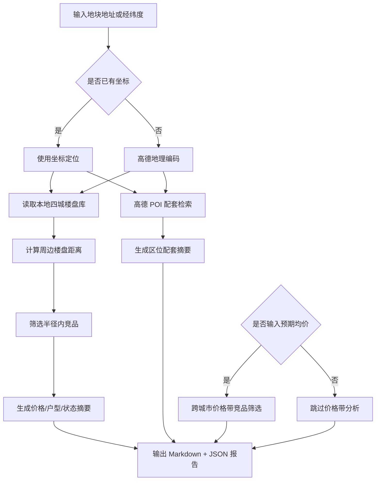

# DDS 地块画像报告 — 杭州

## 输入摘要
- 城市：杭州
- 区域：滨江区
- 地址：杭州滨江区浦沿
- 坐标：120.154489, 30.1734（来源：amap_geocode）
- 预期均价：33000.0 元/㎡

## 逻辑流程图初稿

## 周边竞品分析
- 样本数：14
- 有效价格样本：13
- 均价：32838.0 元/㎡
- 价格区间：22000.0 - 50080.0 元/㎡

### 竞品列表
| 楼盘 | 城市 | 区域 | 状态 | 均价元/㎡ | 距离km | 面积段 | 户型 | 开发商 |
| --- | --- | --- | --- | --- | --- | --- | --- | --- |
| 揽晖美寓 | 杭州 | 滨江区 | 尾盘 | 40556.0 | 0.9 | 105-165㎡ | 3室户型,4室户型 | 杭州滨宝置业有限公司 |
| 海威领界 | 杭州 | 滨江区 | 在售 | 25000.0 | 2.1 | 1049㎡ | 商业户型 | 杭州弘威置业有限公司 |
| 英冠绿城·春来晴翠 | 杭州 | 滨江区 | 在售 | 33009.0 | 2.2 | 105-169㎡ | 3室户型,4室户型 | 杭州绿英置业有限公司 |
| 鸣涛里 | 杭州 | 萧山区 | 在售 | — | 2.6 | 186-364㎡ | 2室户型,3室户型,4室户型 | 杭州滨卓房地产开发有限公司 |
| 钱塘ONE | 杭州 | 西湖区 | 在售 | 37000.0 | 3.6 | 22-128㎡ | 商业户型 | 杭州汇辉置业有限公司 |
| 之江门公寓 | 杭州 | 西湖区 | 在售 | 35000.0 | 3.8 | 55㎡ | 商业户型 | 杭州大湾房地产有限公司 |
| 中融蓝城Co.C理想城 | 杭州 | 西湖区 | 在售 | 25000.0 | 4.0 | 29-53㎡ | 商业户型 | 杭州中融控股集团有限公司 |
| 华润沄璟文华轩 | 杭州 | 西湖区 | 在售 | 50080.0 | 4.0 | 145-215㎡ | 4室户型 | 杭州华润江澋房地产开发有限公司 |
| 绿城卓越傲旋城公寓 | 杭州 | 滨江区 | 在售 | 31000.0 | 4.1 | 57-312㎡ | 商业户型 | 杭州恒兴置业有限公司 |
| 绿城知海棠 | 杭州 | 西湖区 | 在售 | 31761.0 | 4.3 | 106-164㎡ | 3室户型,4室户型 | 绿城房地产集团有限公司,杭州浙秋置业有限公司 |
| 之江印 | 杭州 | 西湖区 | 在售 | 29000.0 | 4.3 | 32-41㎡ | 商业户型 | 杭州元山置业有限公司 |
| 之江长九中心 | 杭州 | 西湖区 | 在售 | 22000.0 | 4.7 | — | — | 浙江长九珊瑚沙置业有限公司 |
| 建发云启之江 | 杭州 | 西湖区 | 尾盘 | 37482.0 | 4.7 | 103-229㎡ | 3室户型,4室户型,5室户型 | 杭州启坤置业有限公司,杭州启原置业有限公司 |
| 西投银泰城 | 杭州 | 西湖区 | 在售 | 30000.0 | 4.8 | 310-320㎡ | — | 杭州之江银泰建设发展有限公司,杭州西投银泰建设发展有限公司 |

## 区位配套分析
- 学校：最近 浙江机电职业技术大学设计艺术系，约 70m
- 医院：最近 老百姓大药房(立业园店)，约 228m
- 地铁站：最近 中医药大学地铁站D口，约 754m
- 公交站：最近 滨文路明德路口(公交站)，约 141m
- 商场：最近 左邻·右舍，约 232m
- 公园：最近 高教公园，约 174m
- 超市：最近 映创城，约 803m

## 预期均价竞品参照
当前全国分析基于本地四城样本：三亚、杭州、上海、青岛，后续可扩展全国 CSV/在线抓取数据源。
- 预期均价：33000.0 元/㎡
- 筛选价格带：28050.0 - 37950.0 元/㎡
- 城市分布：{'上海': 13, '三亚': 8, '杭州': 7, '青岛': 2}

| 楼盘 | 城市 | 区域 | 状态 | 均价元/㎡ | 价差 | 面积段 | 户型 | 开发商 |
| --- | --- | --- | --- | --- | --- | --- | --- | --- |
| 龙栖湾新半岛 | 三亚 | 乐东 | 尾盘 | 33000.0 | 0.0 | 47-92㎡ | 商业户型 | 海南龙栖祥湾置业有限公司 |
| 保利碧桂园悦府 | 三亚 | 吉阳区 | 尾盘 | 33000.0 | 0.0 | 101-151㎡ | 3室户型,4室户型 | 三亚不夜城置业有限公司 |
| 三亚·东岸蓝湾 | 三亚 | 吉阳区 | 在售 | 33000.0 | 0.0 | 102-143㎡ | 3室户型,4室户型 | 海南和鑫地产开发有限公司 |
| 凤凰水城 | 三亚 | 天涯区 | 在售 | 33000.0 | 0.0 | 101-175㎡ | 3室户型,4室户型,别墅户型 | 三亚凤凰新城实业有限公司 |
| 开创·白玉海棠 | 三亚 | 海棠区 | 在售 | 33000.0 | 0.0 | 108-180㎡ | 3室户型,别墅户型 | 三亚绵阳开创房地产开发有限公司 |
| 海棠湾8号温泉公馆 | 三亚 | 海棠区 | 在售 | 33000.0 | 0.0 | 83-155㎡ | 2室户型,3室户型,别墅户型 | 三亚天宝盛投资有限公司 |
| 长基听棠 | 三亚 | 海棠区 | 在售 | 33000.0 | 0.0 | 52-203㎡ | 1室户型,2室户型,3室户型,别墅户型 | 三亚新海裕实业有限公司 |
| 华悦海棠 | 三亚 | 海棠区 | 尾盘 | 33000.0 | 0.0 | 86-110㎡ | 2室户型,3室户型 | 海南旭茂投资有限公司 |
| 133世界广场写字楼 | 上海 | 杨浦区 | 尾盘 | 33000.0 | 0.0 | — | — | 上海物源经济发展有限公司 |
| 九亭中心 | 上海 | 松江区 | 尾盘 | 33000.0 | 0.0 | — | — | 上海旭亭置业有限公司 |
| 绿地缤纷广场 | 上海 | 浦东 | 尾盘 | 33000.0 | 0.0 | — | — | 上海绿地东煜置业有限公司 |
| 港城云樾观海 | 上海 | 浦东 | 在售 | 33000.0 | 0.0 | 88-195㎡ | 3室户型,4室户型,别墅户型 | 上海曜港房地产有限公司 |
| 临港天宸 | 上海 | 浦东 | 在售 | 33000.0 | 0.0 | 99-185㎡ | 3室户型,4室户型 | 上海宸御置业有限公司 |
| 雅戈尔星海云境 | 上海 | 浦东 | 在售 | 33000.0 | 0.0 | 78-139㎡ | 2室户型,3室户型,4室户型 | 上海雅原置业有限公司 |
| 上实望海 | 上海 | 浦东 | 在售 | 33000.0 | 0.0 | 100-120㎡ | 3室户型 | 上海城开宜浩房地产开发有限公司 |
| 国芳中心SOHO | 杭州 | 上城区 | 在售 | 33000.0 | 0.0 | 53-80㎡ | 商业户型 | 杭州国芳置业有限公司 |
| 港郦中心 | 杭州 | 余杭区 | 在售 | 33000.0 | 0.0 | 32-55㎡ | 商业户型 | 杭州港郦置业有限公司 |
| 西投德信云湖印 | 杭州 | 西湖区 | 在售 | 33000.0 | 0.0 | 346㎡ | 商业户型 | 杭州西投德信商业发展有限公司 |
| 青铁鼎峰·云上观澜 | 青岛 | 市南区 | 在售 | 33000.0 | 0.0 | 110-204㎡ | 3室户型,4室户型 | 青岛青铁南岛置业有限公司 |
| 英冠绿城·春来晴翠 | 杭州 | 滨江区 | 在售 | 33009.0 | 9.0 | 105-169㎡ | 3室户型,4室户型 | 杭州绿英置业有限公司 |
| 港城悦庭 | 上海 | 浦东 | 在售 | 32956.0 | 44.0 | 92-141㎡ | 3室户型 | 上海海港新城房地产（集团）有限公司 |
| 建发观唐府 | 上海 | 金山区 | 在售 | 33088.0 | 88.0 | 93-188㎡ | 3室户型,4室户型,别墅户型 | 上海兆琰房地产开发有限公司 |
| 上实·听海 | 上海 | 浦东 | 在售 | 32908.0 | 92.0 | 100-144㎡ | 3室户型,4室户型 | 上海城浩置业有限公司 |
| 金地新乐里 | 上海 | 松江区 | 在售 | 33220.0 | 220.0 | 92-100㎡ | 3室户型 | 上海鑫瑞诚房地产开发有限公司 |
| 建发·朗玥 | 上海 | 金山区 | 在售 | 33385.0 | 385.0 | 97-203㎡ | 3室户型,4室户型 | 上海兆玖房地产开发有限公司 |
| 保利恒尊·崇璟和颂府 | 杭州 | 萧山区 | 在售 | 33430.0 | 430.0 | 106-133㎡ | 3室户型,4室户型 | 杭州保尊置业有限公司 |
| 佳运·汇龙府 | 上海 | 金山区 | 在售 | 32500.0 | 500.0 | 123-210㎡ | 3室户型,4室户型,5室户型 | 上海佳运金城房地产开发有限公司 |
| 国汇萧山路88号 | 青岛 | 西海岸新区 | 在售 | 33500.0 | 500.0 | 173-231㎡ | 4室户型,别墅户型 | 青岛锦地隆翔置业发展有限公司 |
| 龙湖·御潮印 | 杭州 | 萧山区 | 在售 | 32431.0 | 569.0 | 98-168㎡ | 3室户型,4室户型 | 杭州金开丰和置业有限公司 |
| 中建玉湖之星 | 杭州 | 余杭区 | 在售 | 32396.0 | 604.0 | 115-185㎡ | 3室户型,4室户型 | 杭州星程房地产开发有限公司 |

## 数据边界与下一步
- 当前竞品库覆盖本地四城：三亚、杭州、上海、青岛。
- 周边配套来自高德 Web 服务实时 POI。
- 下一步可接入全国楼盘 CSV 或在线抓取任务，将价格带分析从本地 MVP 扩展为真实全国范围。
