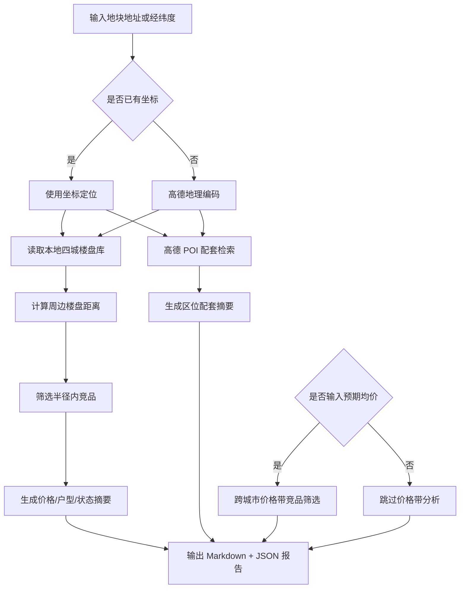

# DDS 地块画像报告 — 三亚

## 输入摘要
- 城市：三亚
- 区域：帮我分析三亚海棠区
- 地址：三亚海棠区南田路16号
- 坐标：109.726138, 18.39598（来源：amap_geocode）
- 预期均价：160000.0 元/㎡

## 逻辑流程图初稿

## 周边竞品分析
- 样本数：30
- 有效价格样本：15
- 均价：35712.0 元/㎡
- 价格区间：26800.0 - 60000.0 元/㎡

### 竞品列表
| 楼盘 | 城市 | 区域 | 状态 | 均价元/㎡ | 距离km | 面积段 | 户型 | 开发商 |
| --- | --- | --- | --- | --- | --- | --- | --- | --- |
| 开创·白玉海棠 | 三亚 | 海棠区 | 在售 | 33000.0 | 0.4 | 108-180㎡ | 3室户型,别墅户型 | 三亚绵阳开创房地产开发有限公司 |
| 和泓海棠府 | 三亚 | 海棠区 | 尾盘 | 30000.0 | 0.4 | 100-120㎡ | 3室户型,4室户型,5室户型 | 三亚顺泽房地产开发有限公司 |
| 尚海棠 | 三亚 | 海棠区 | 尾盘 | — | 0.4 | 66-145㎡ | 1室户型,2室户型,3室户型,别墅户型 | — |
| 保利栖棠 | 三亚 | 海棠区 | 尾盘 | — | 0.5 | — | — | 三亚保锦实业发展有限公司 |
| 盛海棠 | 三亚 | 海棠区 | 在售 | 26800.0 | 0.5 | 99-160㎡ | 3室户型,别墅户型 | 海南益胜实业开发有限公司 |
| 东方宇亿·海棠壹号院 | 三亚 | 海棠区 | 在售 | 28000.0 | 0.7 | 109-119㎡ | 2室户型,3室户型 | 海南山海颐园投资有限公司 |
| 海棠月色 | 三亚 | 海棠区 | 在售 | 29000.0 | 1.0 | 57-143㎡ | 2室户型,3室户型,5室户型 | 海南红山房地产开发有限公司 |
| 海棠湾8号温泉公馆 | 三亚 | 海棠区 | 在售 | 33000.0 | 1.0 | 83-155㎡ | 2室户型,3室户型,别墅户型 | 三亚天宝盛投资有限公司 |
| 陶然湾 | 三亚 | 海棠区 | 尾盘 | — | 1.1 | 62-151㎡ | 1室户型,2室户型,3室户型,别墅户型 | — |
| 天使·海棠明悦 | 三亚 | 海棠区 | 尾盘 | 33628.0 | 1.3 | 113-195㎡ | 3室户型,4室户型,别墅户型 | 海南霖润房地产开发有限公司 |
| 华悦海棠 | 三亚 | 海棠区 | 尾盘 | 33000.0 | 1.3 | 86-110㎡ | 2室户型,3室户型 | 海南旭茂投资有限公司 |
| 恒润·中御海棠 | 三亚 | 海棠区 | 在售 | — | 1.4 | 106-143㎡ | 2室户型,3室户型 | 海南恒润实业发展有限公司 |
| 海棠·泰岳府 | 三亚 | 海棠区 | 尾盘 | — | 1.6 | 37-132㎡ | 1室户型,2室户型,3室户型 | — |
| 海棠花开 | 三亚 | 海棠区 | 尾盘 | 32000.0 | 1.6 | 86-93㎡ | 2室户型,别墅户型 | 三亚中业南田投资有限公司 |
| 佳兆业海棠伴山 | 三亚 | 海棠区 | 在售 | — | 1.8 | 102-123㎡ | 3室户型,4室户型,别墅户型 | 三亚佰佳世纪房地产开发有限公司 |
| 方大太阳城 | 三亚 | 海棠区 | 尾盘 | — | 1.8 | 68-113㎡ | 1室户型,2室户型,3室户型 | — |
| 联投海棠韵 | 三亚 | 海棠区 | 尾盘 | — | 1.9 | 40-101㎡ | 2室户型,别墅户型 | — |
| 天骄海棠湾 | 三亚 | 海棠区 | 尾盘 | 37000.0 | 2.0 | 65-86㎡ | 2室户型,3室户型 | 三亚伟奇投资有限公司 |
| 融创一池半海 | 三亚 | 海棠区 | 尾盘 | — | 2.1 | 119-145㎡ | 别墅户型 | 三亚庆华圳置业有限公司 |
| 长基听棠 | 三亚 | 海棠区 | 在售 | 33000.0 | 2.1 | 52-203㎡ | 1室户型,2室户型,3室户型,别墅户型 | 三亚新海裕实业有限公司 |

## 区位配套分析
- 学校：最近 三亚市海棠区人才基地幼儿园，约 791m
- 医院：最近 益兴堂大药房(海棠湾8号商业广场店)，约 415m
- 地铁站：暂无数据
- 公交站：最近 8号公馆(公交站)，约 330m
- 商场：最近 全家乐生活超市(南田路店)，约 197m
- 公园：暂无数据
- 超市：最近 海棠湾8号商业广场，约 399m

## 预期均价竞品参照
当前全国分析基于本地四城样本：三亚、杭州、上海、青岛，后续可扩展全国 CSV/在线抓取数据源。
- 预期均价：160000.0 元/㎡
- 筛选价格带：136000.0 - 184000.0 元/㎡
- 城市分布：{'上海': 28, '三亚': 2}

| 楼盘 | 城市 | 区域 | 状态 | 均价元/㎡ | 价差 | 面积段 | 户型 | 开发商 |
| --- | --- | --- | --- | --- | --- | --- | --- | --- |
| 中鹰·黑森林 | 上海 | 普陀区 | 在售 | 160000.0 | 0.0 | 131-434㎡ | 2室户型,3室户型,4室户型,5室户型 | 上海中鹰置业有限公司 |
| 绿发浦江园 | 上海 | 黄浦区 | 在售 | 160000.0 | 0.0 | 143-195㎡ | 3室户型,4室户型 | 上海绿发实业投资有限公司 |
| 绿城外滩兰庭 | 上海 | 黄浦区 | 尾盘 | 163000.0 | 3000.0 | 161-402㎡ | 2室户型,3室户型,4室户型,5室户型,6室户型 | 上海华浙外滩置业有限公司 |
| 凯德茂名公馆 | 上海 | 黄浦区 | 尾盘 | 168000.0 | 8000.0 | 144-578㎡ | 2室户型,3室户型,4室户型,5室户型,6室户型 | 凯德置地（中国）投资有限公司 |
| 金茂璞元 | 上海 | 虹口区 | 在售 | 168100.0 | 8100.0 | 130-200㎡ | 3室户型,4室户型 | 上海沁茂佳置业有限公司 |
| 海棠湾·云境 | 三亚 | 海棠区 | 在售 | 150000.0 | 10000.0 | 118-347㎡ | 商业户型 | 三亚国美旅业有限公司 |
| 云锦东方一期/二期 | 上海 | 徐汇区 | 尾盘 | 150000.0 | 10000.0 | 199-474㎡ | 3室户型,4室户型,5室户型 | 上海东航置业有限公司 |
| 海泰北外滩 | 上海 | 虹口区 | 在售 | 170000.0 | 10000.0 | 370-740㎡ | 3室户型,4室户型,6室户型 | 上海海泰北外滩房地产有限公司 |
| 外滩瑞府 | 上海 | 虹口区 | 在售 | 148500.0 | 11500.0 | 124-240㎡ | 3室户型,4室户型 | 上海华润瑞宸置业有限公司 |
| 康定壹拾玖 | 上海 | 静安区 | 在售 | 171800.0 | 11800.0 | 120-238㎡ | 3室户型,4室户型 | 上海招瑞置业有限公司 |
| 绿城黄浦ONE | 上海 | 黄浦区 | 在售 | 172000.0 | 12000.0 | 155-193㎡ | 3室户型,4室户型 | 上海良康房地产开发有限公司 |
| 海玥黄浦源 | 上海 | 黄浦区 | 在售 | 145600.0 | 14400.0 | 93-577㎡ | 1室户型,3室户型,4室户型,5室户型,6室户型,别墅户型 | 上海建工九龙房产有限公司 |
| 保利棠隐 | 三亚 | 海棠区 | 在售 | 175000.0 | 15000.0 | 135-143㎡ | — | 三亚论坛中心建设有限公司 |
| 华发仁恒苏河世纪 | 上海 | 静安区 | 在售 | 145000.0 | 15000.0 | 480-498㎡ | 5室户型 | 上海晋镧房地产开发有限公司 |
| 昌平云岸 | 上海 | 静安区 | 在售 | 145000.0 | 15000.0 | 94-196㎡ | 1室户型,2室户型,3室户型,4室户型 | 上海中远泰兴置业有限公司 |
| 露香园二期 | 上海 | 黄浦区 | 在售 | 176000.0 | 16000.0 | 377-882㎡ | 4室户型,5室户型,别墅户型 | 上海露香园建设发展有限公司 |
| 中粮·北外滩壹号 | 上海 | 虹口区 | 在售 | 143868.0 | 16132.0 | 185-228㎡ | 4室户型 | 上海耀耀禄建设发展有限公司 |
| 能建·西岸誉府 | 上海 | 徐汇区 | 尾盘 | 143000.0 | 17000.0 | 100-143㎡ | 3室户型,4室户型 | 中能建（上海）建设发展有限公司 |
| 绿地海珀外滩 | 上海 | 黄浦区 | 尾盘 | 142500.0 | 17500.0 | 117-301㎡ | 2室户型,3室户型,4室户型,5室户型 | 中民外滩房地产开发有限公司 |
| 香港置地启元 | 上海 | 徐汇区 | 尾盘 | 178000.0 | 18000.0 | 277-547㎡ | 4室户型,5室户型 | 上海浦辰置业有限公司 |
| 天潼198 | 上海 | 虹口区 | 在售 | 178000.0 | 18000.0 | 298-641㎡ | 4室户型,5室户型 | 上海新湖房地产开发有限公司 |
| 鸿印里 | 上海 | 静安区 | 尾盘 | 142000.0 | 18000.0 | 83-226㎡ | 1室户型,2室户型,3室户型,4室户型 | 上海静投城市建设发展有限公司 |
| 保利外滩曜丨Park77 | 上海 | 杨浦区 | 在售 | 141950.0 | 18050.0 | 115-140㎡ | 3室户型,4室户型 | 上海友登实业有限公司 |
| 安澜上海 | 上海 | 徐汇区 | 在售 | 179100.0 | 19100.0 | 195-588㎡ | 4室户型,5室户型 | 上海新百安经济发展有限公司 |
| 花样年·卢湾68 | 上海 | 黄浦区 | 尾盘 | 140000.0 | 20000.0 | 130-361㎡ | 2室户型,3室户型,4室户型,5室户型 | 深圳前海嘉年鼎盛投资管理有限公司 |
| 保利世博天悦 | 上海 | 浦东 | 在售 | 180097.0 | 20097.0 | 174-252㎡ | 3室户型,4室户型,5室户型 | 上海华辕实业有限公司 |
| 外滩道 | 上海 | 杨浦区 | 在售 | 138800.0 | 21200.0 | 100-220㎡ | 3室户型,4室户型 | 上海锦富滨贸置业有限公司 |
| 中建·玖上琅宸 | 上海 | 静安区 | 在售 | 138064.0 | 21936.0 | 128-280㎡ | 3室户型,4室户型 | 上海玖知置业有限公司 |
| 北外滩虹口源·717 | 上海 | 虹口区 | 在售 | 138000.0 | 22000.0 | 101-356㎡ | 2室户型,3室户型,4室户型 | 上海聚博房地产开发有限公司 |
| 中興路一號 Oriental One | 上海 | 静安区 | 在售 | 137500.0 | 22500.0 | 77-106㎡ | 1室户型,2室户型 | 上海恺冠臻房地产开发有限公司 |

## 数据边界与下一步
- 当前竞品库覆盖本地四城：三亚、杭州、上海、青岛。
- 周边配套来自高德 Web 服务实时 POI。
- 下一步可接入全国楼盘 CSV 或在线抓取任务，将价格带分析从本地 MVP 扩展为真实全国范围。
