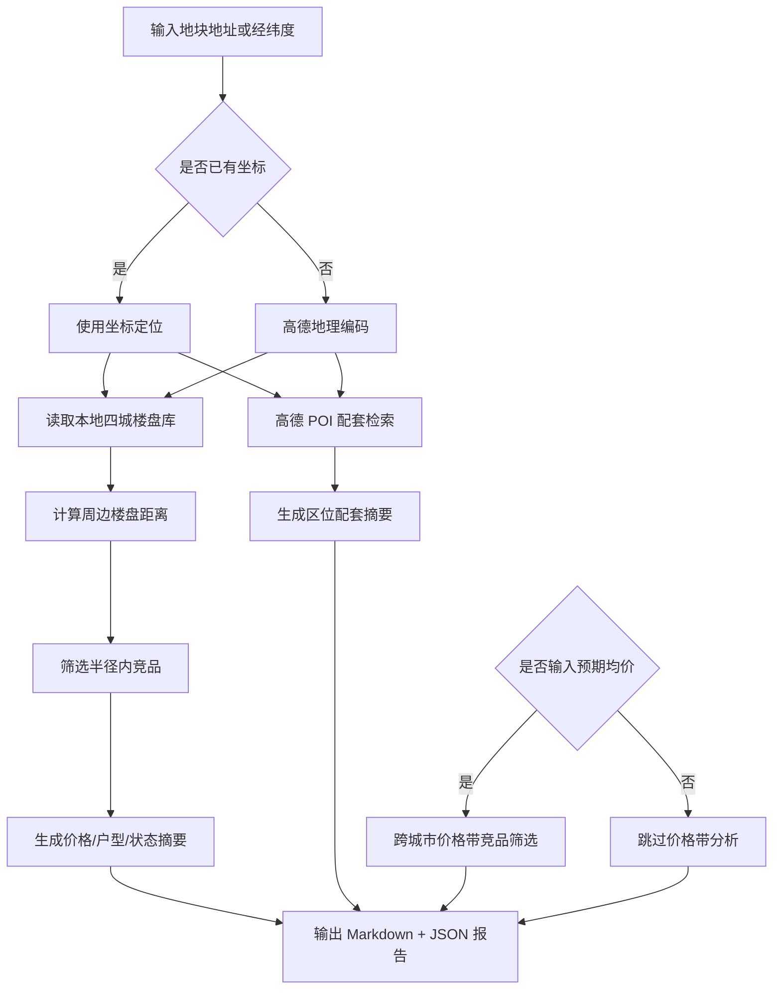

# DDS 地块画像报告 — 三亚

## 输入摘要
- 城市：三亚
- 区域：帮我分析三亚海棠区
- 地址：三亚海棠区南田路16号
- 坐标：109.726138, 18.39598（来源：amap_geocode）
- 预期均价：35000.0 元/㎡

## 逻辑流程图初稿

## 周边竞品分析
- 样本数：30
- 有效价格样本：15
- 均价：35712.0 元/㎡
- 价格区间：26800.0 - 60000.0 元/㎡

### 竞品列表
| 楼盘 | 城市 | 区域 | 状态 | 均价元/㎡ | 距离km | 面积段 | 户型 | 开发商 |
| --- | --- | --- | --- | --- | --- | --- | --- | --- |
| 开创·白玉海棠 | 三亚 | 海棠区 | 在售 | 33000.0 | 0.4 | 108-180㎡ | 3室户型,别墅户型 | 三亚绵阳开创房地产开发有限公司 |
| 和泓海棠府 | 三亚 | 海棠区 | 尾盘 | 30000.0 | 0.4 | 100-120㎡ | 3室户型,4室户型,5室户型 | 三亚顺泽房地产开发有限公司 |
| 尚海棠 | 三亚 | 海棠区 | 尾盘 | — | 0.4 | 66-145㎡ | 1室户型,2室户型,3室户型,别墅户型 | — |
| 保利栖棠 | 三亚 | 海棠区 | 尾盘 | — | 0.5 | — | — | 三亚保锦实业发展有限公司 |
| 盛海棠 | 三亚 | 海棠区 | 在售 | 26800.0 | 0.5 | 99-160㎡ | 3室户型,别墅户型 | 海南益胜实业开发有限公司 |
| 东方宇亿·海棠壹号院 | 三亚 | 海棠区 | 在售 | 28000.0 | 0.7 | 109-119㎡ | 2室户型,3室户型 | 海南山海颐园投资有限公司 |
| 海棠月色 | 三亚 | 海棠区 | 在售 | 29000.0 | 1.0 | 57-143㎡ | 2室户型,3室户型,5室户型 | 海南红山房地产开发有限公司 |
| 海棠湾8号温泉公馆 | 三亚 | 海棠区 | 在售 | 33000.0 | 1.0 | 83-155㎡ | 2室户型,3室户型,别墅户型 | 三亚天宝盛投资有限公司 |
| 陶然湾 | 三亚 | 海棠区 | 尾盘 | — | 1.1 | 62-151㎡ | 1室户型,2室户型,3室户型,别墅户型 | — |
| 天使·海棠明悦 | 三亚 | 海棠区 | 尾盘 | 33628.0 | 1.3 | 113-195㎡ | 3室户型,4室户型,别墅户型 | 海南霖润房地产开发有限公司 |
| 华悦海棠 | 三亚 | 海棠区 | 尾盘 | 33000.0 | 1.3 | 86-110㎡ | 2室户型,3室户型 | 海南旭茂投资有限公司 |
| 恒润·中御海棠 | 三亚 | 海棠区 | 在售 | — | 1.4 | 106-143㎡ | 2室户型,3室户型 | 海南恒润实业发展有限公司 |
| 海棠·泰岳府 | 三亚 | 海棠区 | 尾盘 | — | 1.6 | 37-132㎡ | 1室户型,2室户型,3室户型 | — |
| 海棠花开 | 三亚 | 海棠区 | 尾盘 | 32000.0 | 1.6 | 86-93㎡ | 2室户型,别墅户型 | 三亚中业南田投资有限公司 |
| 佳兆业海棠伴山 | 三亚 | 海棠区 | 在售 | — | 1.8 | 102-123㎡ | 3室户型,4室户型,别墅户型 | 三亚佰佳世纪房地产开发有限公司 |
| 方大太阳城 | 三亚 | 海棠区 | 尾盘 | — | 1.8 | 68-113㎡ | 1室户型,2室户型,3室户型 | — |
| 联投海棠韵 | 三亚 | 海棠区 | 尾盘 | — | 1.9 | 40-101㎡ | 2室户型,别墅户型 | — |
| 天骄海棠湾 | 三亚 | 海棠区 | 尾盘 | 37000.0 | 2.0 | 65-86㎡ | 2室户型,3室户型 | 三亚伟奇投资有限公司 |
| 融创一池半海 | 三亚 | 海棠区 | 尾盘 | — | 2.1 | 119-145㎡ | 别墅户型 | 三亚庆华圳置业有限公司 |
| 长基听棠 | 三亚 | 海棠区 | 在售 | 33000.0 | 2.1 | 52-203㎡ | 1室户型,2室户型,3室户型,别墅户型 | 三亚新海裕实业有限公司 |

## 区位配套分析
- 学校：最近 三亚市海棠区人才基地幼儿园，约 791m
- 医院：最近 益兴堂大药房(海棠湾8号商业广场店)，约 415m
- 地铁站：暂无数据
- 公交站：最近 8号公馆(公交站)，约 330m
- 商场：最近 全家乐生活超市(南田路店)，约 197m
- 公园：暂无数据
- 超市：最近 海棠湾8号商业广场，约 399m

## 预期均价竞品参照
当前全国分析基于本地四城样本：三亚、杭州、上海、青岛，后续可扩展全国 CSV/在线抓取数据源。
- 预期均价：35000.0 元/㎡
- 筛选价格带：29750.0 - 40250.0 元/㎡
- 城市分布：{'三亚': 16, '上海': 6, '杭州': 6, '青岛': 2}

| 楼盘 | 城市 | 区域 | 状态 | 均价元/㎡ | 价差 | 面积段 | 户型 | 开发商 |
| --- | --- | --- | --- | --- | --- | --- | --- | --- |
| 嘉宝花园二期 | 三亚 | 吉阳区 | 尾盘 | 35000.0 | 0.0 | 56-129㎡ | 1室户型,2室户型,3室户型 | 三亚嘉宝实业有限公司 |
| 三亚金万隆商旅综合体 | 三亚 | 吉阳区 | 在售 | 35000.0 | 0.0 | 70-140㎡ | — | 三亚安尚实业有限公司 |
| 国锐亚沙村 | 三亚 | 吉阳区 | 在售 | 35000.0 | 0.0 | 101-143㎡ | 2室户型,3室户型 | 三亚国奥体育产业园一区投资有限公司 |
| 山林君悦 | 三亚 | 吉阳区 | 在售 | 35000.0 | 0.0 | 86-118㎡ | 3室户型,4室户型 | 三亚震旦实业开发有限公司 |
| 名人豪苑 | 三亚 | 吉阳区 | 在售 | 35000.0 | 0.0 | 102-155㎡ | 2室户型,3室户型,4室户型 | 三亚林鑫实业有限公司 |
| 绿城亚龙湾 | 三亚 | 吉阳区 | 在售 | 35000.0 | 0.0 | 88-2200㎡ | 商业户型 | 三亚科技创新投资有限公司 |
| 天泽·幸福里 | 三亚 | 吉阳区 | 在售 | 35000.0 | 0.0 | 104-130㎡ | 3室户型,4室户型 | 海南远达投资有限公司 |
| 三亚御府 | 三亚 | 吉阳区 | 在售 | 35000.0 | 0.0 | 161-190㎡ | 3室户型,4室户型 | 海南华盛天涯投资有限公司 |
| 三亚国瑞红塘湾 | 三亚 | 天涯区 | 在售 | 35000.0 | 0.0 | 54-253㎡ | 商业户型 | 三亚景恒置业有限公司 |
| 瀚星中心假日 | 三亚 | 天涯区 | 在售 | 35000.0 | 0.0 | 51-64㎡ | 商业户型 | 吉林市瀚星房地产开发有限公司 |
| 保利海晏 | 三亚 | 海棠区 | 在售 | 35000.0 | 0.0 | 107-203㎡ | 2室户型,3室户型,4室户型 | 保利（三亚）房地产开发有限公司 |
| 华润海棠湾 | 三亚 | 海棠区 | 在售 | 35000.0 | 0.0 | 114-343㎡ | 3室户型,4室户型 | 三亚润投投资有限公司 |
| 绿城·凤鸣观棠 | 三亚 | 海棠区 | 在售 | 35000.0 | 0.0 | 113-281㎡ | 2室户型,3室户型,4室户型 | 三亚棠华置业有限公司 |
| 枫河丽舍 | 上海 | 浦东 | 尾盘 | 35000.0 | 0.0 | 58-62㎡ | 商办户型 | 上海康实置业有限公司 |
| 云泓之城 | 杭州 | 余杭区 | 在售 | 35000.0 | 0.0 | 82-107㎡ | — | 杭州西曙置业有限公司 |
| 嘉合未来金座 | 杭州 | 余杭区 | 在售 | 35000.0 | 0.0 | 30-33㎡ | 商业户型 | 杭州嘉合置业有限公司 |
| 中南未来里 | 杭州 | 余杭区 | 在售 | 35000.0 | 0.0 | 35-73㎡ | 商业户型 | 杭州中璟邦达置业有限公司 |
| 望朝中心 | 杭州 | 萧山区 | 在售 | 35000.0 | 0.0 | 372-732㎡ | 商业户型 | 浙江诚稻置业有限公司 |
| 之江门公寓 | 杭州 | 西湖区 | 在售 | 35000.0 | 0.0 | 55㎡ | 商业户型 | 杭州大湾房地产有限公司 |
| 青建金宸府 | 青岛 | 崂山区 | 在售 | 35000.0 | 0.0 | 145-203㎡ | 4室户型 | 青岛青建国和置业有限公司 |
| 璞逸世园 | 青岛 | 李沧区 | 在售 | 35000.0 | 0.0 | 170-270㎡ | 4室户型 | 青岛世园兴茂置业有限公司 |
| 三亚亚沙村 | 三亚 | 吉阳区 | 尾盘 | 34960.0 | 40.0 | 108-142㎡ | 3室户型,4室户型 | 三亚国奥体育产业园三区投资有限公司 |
| 华庭香郡 | 三亚 | 吉阳区 | 尾盘 | 34868.0 | 132.0 | 108-133㎡ | 3室户型,4室户型 | 三亚上品华庭地产有限公司 |
| 悦山湖 | 三亚 | 吉阳区 | 在售 | 34800.0 | 200.0 | 81-122㎡ | 2室户型,3室户型 | 三亚新澳投资置业有限公司 |
| 新长宁·水韵名邸 | 上海 | 青浦区 | 在售 | 34800.0 | 200.0 | 82-133㎡ | 2室户型,3室户型,4室户型 | 上海长怿企业发展有限公司 |
| 大名城映辰 | 上海 | 青浦区 | 在售 | 34800.0 | 200.0 | 98-124㎡ | 3室户型,4室户型 | 上海苏翀置业有限公司 |
| 金融街·奉贤金悦府 | 上海 | 奉贤区 | 在售 | 35282.0 | 282.0 | 89-99㎡ | 3室户型 | 上海融廷置业有限公司 |
| 深嘉上府 | 上海 | 嘉定区 | 在售 | 34650.0 | 350.0 | 88-99㎡ | 3室户型 | 上海深业科能建设有限公司 |
| 正荣·悦珑府 | 上海 | 嘉定区 | 尾盘 | 34641.0 | 359.0 | 75-89㎡ | 2室户型,3室户型 | 上海正曙置业发展有限公司 |
| 云树望山院 | 杭州 | 西湖区 | 在售 | 35400.0 | 400.0 | 248-360㎡ | 3室户型,4室户型,别墅户型 | 杭州晨悦房地产开发有限公司 |

## 数据边界与下一步
- 当前竞品库覆盖本地四城：三亚、杭州、上海、青岛。
- 周边配套来自高德 Web 服务实时 POI。
- 下一步可接入全国楼盘 CSV 或在线抓取任务，将价格带分析从本地 MVP 扩展为真实全国范围。
