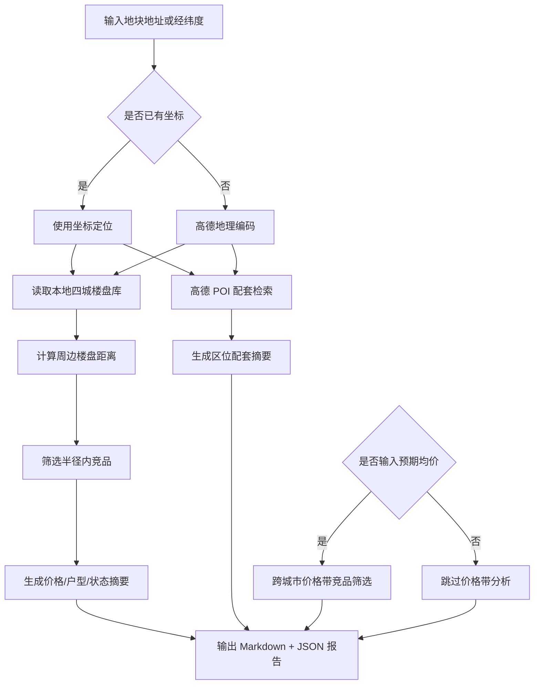

# DDS 地块画像报告 — 三亚

## 输入摘要
- 城市：三亚
- 区域：帮我分析三亚海棠湾
- 地址：三亚海棠湾三灶村
- 坐标：109.722095, 18.316415（来源：amap_geocode）
- 预期均价：12000.0 元/㎡

## 逻辑流程图初稿

## 周边竞品分析
- 样本数：23
- 有效价格样本：11
- 均价：78636.0 元/㎡
- 价格区间：35000.0 - 175000.0 元/㎡

### 竞品列表
| 楼盘 | 城市 | 区域 | 状态 | 均价元/㎡ | 距离km | 面积段 | 户型 | 开发商 |
| --- | --- | --- | --- | --- | --- | --- | --- | --- |
| 国寿嘉园逸境 | 三亚 | 海棠区 | 在售 | 50000.0 | 0.3 | 96-128㎡ | 商业户型 | 嘉园逸境（三亚）健康投资有限公司 |
| 恒大养生谷 | 三亚 | 海棠区 | 尾盘 | — | 0.5 | 35-83㎡ | 商业户型 | — |
| 海棠101 | 三亚 | 海棠区 | 尾盘 | 100000.0 | 0.8 | 175-275㎡ | 商业户型 | 三亚海泰投资管理有限公司 |
| 三亚中体奥林匹克湾 | 三亚 | 海棠区 | 尾盘 | — | 0.8 | — | — | — |
| 艺海棠 | 三亚 | 海棠区 | 在售 | 70000.0 | 1.1 | 95-168㎡ | 2室户型,3室户型 | 海南中海三邦友房地产开发有限责任公司 |
| 海棠中央 | 三亚 | 海棠区 | 尾盘 | — | 1.2 | 83-107㎡ | 2室户型 | — |
| 碧桂园海棠墅 | 三亚 | 海棠区 | 尾盘 | — | 1.3 | 109-159㎡ | 3室户型,别墅户型 | 海南雄狮旅业有限公司 |
| 碧桂园齐瓦颂 | 三亚 | 海棠区 | 尾盘 | — | 1.3 | 68-139㎡ | 商业户型 | 齐瓦颂（三亚）养生社区开发有限公司 |
| 海棠湾·云境 | 三亚 | 海棠区 | 在售 | 150000.0 | 1.3 | 118-347㎡ | 商业户型 | 三亚国美旅业有限公司 |
| 保利海晏 | 三亚 | 海棠区 | 在售 | 35000.0 | 1.7 | 107-203㎡ | 2室户型,3室户型,4室户型 | 保利（三亚）房地产开发有限公司 |
| 绿地悦澜湾·7号 | 三亚 | 吉阳区 | 尾盘 | — | 1.7 | 57-132㎡ | 商业户型 | 四川宏凌实业有限公司 |
| 国家海岸保利海棠二期 | 三亚 | 海棠区 | 尾盘 | — | 1.7 | 69-78㎡ | 商业户型 | 保利（三亚）房地产开发有限公司 |
| 保利C+国际博览中心 | 三亚 | 海棠区 | 在售 | 65000.0 | 1.8 | 57-144㎡ | 商业户型 | 海南裕楚商业有限公司 |
| 保利棠隐 | 三亚 | 海棠区 | 在售 | 175000.0 | 1.9 | 135-143㎡ | — | 三亚论坛中心建设有限公司 |
| 国家海岸•保利财富中心 | 三亚 | 海棠区 | 尾盘 | — | 2.0 | 303㎡ | 别墅户型 | 三亚论坛中心建设有限公司 |
| 国家海岸•保利海棠 | 三亚 | 海棠区 | 尾盘 | — | 2.2 | 65-88㎡ | 2室户型,3室户型 | — |
| 中交海棠麓湖 | 三亚 | 海棠区 | 尾盘 | — | 2.2 | 111-201㎡ | 别墅户型 | 三亚中交瀚星投资有限公司 |
| 海棠华著 | 三亚 | 海棠区 | 尾盘 | — | 2.6 | 78-600㎡ | 别墅户型 | 三亚巨源旅业开发有限公司 |
| 海棠湾银海 | 三亚 | 海棠区 | 尾盘 | — | 2.8 | 357-730㎡ | 别墅户型 | 三亚皇圃大酒店有限公司 |
| 绿城·凤鸣观棠 | 三亚 | 海棠区 | 在售 | 35000.0 | 3.1 | 113-281㎡ | 2室户型,3室户型,4室户型 | 三亚棠华置业有限公司 |

## 区位配套分析
- 学校：最近 三亚市海棠区第三幼儿园，约 1084m
- 医院：最近 中国太平海棠人家康养公寓健康管理中心，约 840m
- 地铁站：暂无数据
- 公交站：最近 碧桂园齐瓦颂(公交站)，约 272m
- 商场：最近 小欧小卖部，约 173m
- 公园：最近 海棠广场，约 1041m
- 超市：暂无数据

## 预期均价竞品参照
当前全国分析基于本地四城样本：三亚、杭州、上海、青岛，后续可扩展全国 CSV/在线抓取数据源。
- 预期均价：12000.0 元/㎡
- 筛选价格带：10200.0 - 13800.0 元/㎡
- 城市分布：{'青岛': 24, '杭州': 4, '三亚': 2}

| 楼盘 | 城市 | 区域 | 状态 | 均价元/㎡ | 价差 | 面积段 | 户型 | 开发商 |
| --- | --- | --- | --- | --- | --- | --- | --- | --- |
| 乐恒上京海 | 三亚 | 东方 | 在售 | 12000.0 | 0.0 | 56-157㎡ | 商业户型 | 海南乐恒置业有限公司 |
| 奥城望 | 杭州 | 桐庐县 | 在售 | 12000.0 | 0.0 | 90-246㎡ | 3室户型,4室户型,别墅户型 | 莱茵达（桐庐）体育发展有限公司 |
| 华师家园 | 杭州 | 桐庐县 | 在售 | 12000.0 | 0.0 | 89-131㎡ | 3室户型,4室户型 | 杭州桐庐恒泽投资有限公司 |
| 千岛湖青溪银泰城泰悦居 | 杭州 | 淳安县 | 在售 | 12000.0 | 0.0 | 82-129㎡ | 2室户型,3室户型,4室户型 | 淳安银泰置地有限公司 |
| 金鼎云台府 | 青岛 | 城阳区 | 在售 | 12000.0 | 0.0 | 115-220㎡ | 3室户型,4室户型 | 青岛鼎深智达置业有限公司 |
| 鑫江合院四期 | 青岛 | 城阳区 | 在售 | 12000.0 | 0.0 | 95-163㎡ | 3室户型,别墅户型 | 青岛韵霖置业有限公司 |
| 中欧金茂锦棠 | 青岛 | 城阳区 | 在售 | 12000.0 | 0.0 | 125-192㎡ | 3室户型,4室户型 | 青岛东方伊甸园文化旅游开发有限公司 |
| 海信云墅 | 青岛 | 城阳区 | 在售 | 12000.0 | 0.0 | 170-200㎡ | 商业户型 | 青岛恒海峰置业有限公司 |
| 天一仁和珑樾一品 | 青岛 | 城阳区 | 在售 | 12000.0 | 0.0 | 89-142㎡ | 3室户型,4室户型 | 青岛天一兴阳置业有限公司 |
| 龙湖·观萃 | 青岛 | 胶州市 | 在售 | 12000.0 | 0.0 | 126-190㎡ | 3室户型,4室户型 | 青岛锦昊嘉辉置业有限公司 |
| 青岛印象·和 | 青岛 | 西海岸新区 | 在售 | 12000.0 | 0.0 | 97-118㎡ | 3室户型 | 青岛西海岸智诚房地产开发有限公司 |
| 城发灵湾瑞城 | 青岛 | 西海岸新区 | 在售 | 12000.0 | 0.0 | 109-143㎡ | 3室户型,4室户型 | 城发集团（青岛）启盛投资开发有限公司 |
| 铭澜府 | 青岛 | 西海岸新区 | 在售 | 12000.0 | 0.0 | 78-240㎡ | 2室户型,3室户型,4室户型,别墅户型 | 青岛西海蓝屿投资有限公司 |
| 保利源诚领秀海 | 青岛 | 西海岸新区 | 在售 | 12000.0 | 0.0 | 105-165㎡ | 3室户型,4室户型 | 青岛源诚和璋置业有限公司,青岛源诚西海岸置业有限公司 |
| 海信·星海湾 | 青岛 | 西海岸新区 | 在售 | 12000.0 | 0.0 | 89-143㎡ | 2室户型,3室户型,4室户型 | 青岛灵海汇置业有限公司 |
| 鑫江新城 | 青岛 | 城阳区 | 在售 | 12200.0 | 200.0 | 95-140㎡ | 3室户型,4室户型 | 青岛韵霖置业有限公司 |
| 御海悦府 | 青岛 | 西海岸新区 | 在售 | 11800.0 | 200.0 | 109-142㎡ | 3室户型 | 青岛海铭房地产有限公司 |
| 江南雅苑 | 三亚 | 乐东 | 在售 | 12500.0 | 500.0 | 52-101㎡ | 1室户型,2室户型,3室户型 | 乐东福安房地产开发有限公司 |
| 青溪美庐 | 杭州 | 临安区 | 在售 | 12500.0 | 500.0 | 41-160㎡ | 1室户型,2室户型,别墅户型 | 杭州荣鑫房产有限公司 |
| 紫金华府 | 青岛 | 即墨区 | 在售 | 12500.0 | 500.0 | 90-172㎡ | 3室户型,4室户型 | 青岛和晟裕泰房地产有限公司 |
| 中冶德贤公馆 | 青岛 | 即墨区 | 在售 | 12500.0 | 500.0 | 89-160㎡ | 3室户型,4室户型 | 青岛中冶名华发展有限公司 |
| 永合华府 | 青岛 | 即墨区 | 在售 | 11500.0 | 500.0 | 107-160㎡ | 3室户型,4室户型 | 青岛盈丰置业有限公司 |
| 北岸雅望 | 青岛 | 城阳区 | 在售 | 11500.0 | 500.0 | 89-143㎡ | 3室户型 | 青岛北岸新城置业有限公司 |
| 青特悦海府 | 青岛 | 城阳区 | 在售 | 12500.0 | 500.0 | 170㎡ | 别墅户型 | 青岛青特华奕置业有限公司 |
| 北京城建国誉府 | 青岛 | 城阳区 | 在售 | 12500.0 | 500.0 | 89-178㎡ | 3室户型,4室户型,别墅户型 | 北京城建（青岛）投资发展有限公司 |
| 鑫江玫瑰园五期 | 青岛 | 城阳区 | 在售 | 11500.0 | 500.0 | 97-143㎡ | 3室户型 | 青岛韵霖置业有限公司 |
| 青特缦云 | 青岛 | 城阳区 | 在售 | 11500.0 | 500.0 | 160-184㎡ | 3室户型 | 青岛青特华奕置业有限公司 |
| 阳光·壹号 | 青岛 | 胶州市 | 在售 | 12500.0 | 500.0 | 120-160㎡ | 3室户型 | 阳光新天地投资集团（胶州）置业有限公司 |
| 海悦澜庭 | 青岛 | 西海岸新区 | 在售 | 12500.0 | 500.0 | 77-174㎡ | 2室户型,3室户型,4室户型 | 哈尔滨工程大学青岛船舶科技有限公司 |
| 碧水明珠 | 青岛 | 西海岸新区 | 在售 | 12500.0 | 500.0 | 67-137㎡ | 1室户型,2室户型,3室户型 | 山东兴华建设集团房地产开发有限公司 |

## 数据边界与下一步
- 当前竞品库覆盖本地四城：三亚、杭州、上海、青岛。
- 周边配套来自高德 Web 服务实时 POI。
- 下一步可接入全国楼盘 CSV 或在线抓取任务，将价格带分析从本地 MVP 扩展为真实全国范围。
