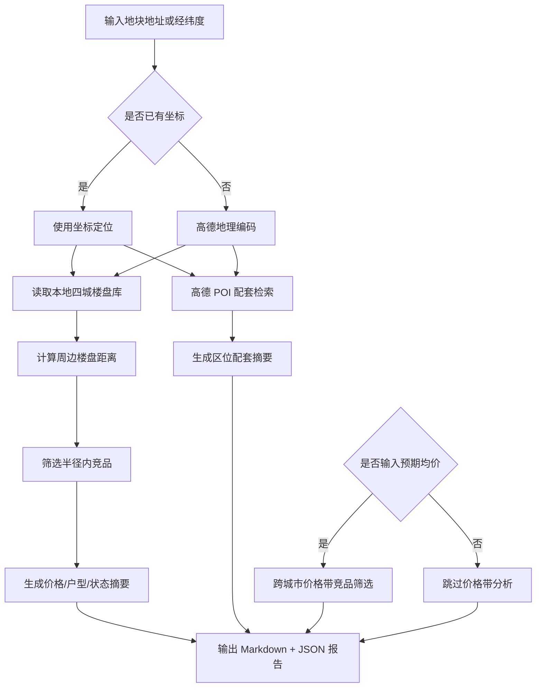

# DDS 地块画像报告 — 三亚

## 输入摘要
- 城市：三亚
- 区域：帮我分析三亚海棠湾
- 地址：三亚海棠湾三灶村
- 坐标：109.722095, 18.316415（来源：amap_geocode）
- 预期均价：未输入 元/㎡

## 逻辑流程图初稿

## 周边竞品分析
- 样本数：23
- 有效价格样本：11
- 均价：78636.0 元/㎡
- 价格区间：35000.0 - 175000.0 元/㎡

### 竞品列表
| 楼盘 | 城市 | 区域 | 状态 | 均价元/㎡ | 距离km | 面积段 | 户型 | 开发商 |
| --- | --- | --- | --- | --- | --- | --- | --- | --- |
| 国寿嘉园逸境 | 三亚 | 海棠区 | 在售 | 50000.0 | 0.3 | 96-128㎡ | 商业户型 | 嘉园逸境（三亚）健康投资有限公司 |
| 恒大养生谷 | 三亚 | 海棠区 | 尾盘 | — | 0.5 | 35-83㎡ | 商业户型 | — |
| 海棠101 | 三亚 | 海棠区 | 尾盘 | 100000.0 | 0.8 | 175-275㎡ | 商业户型 | 三亚海泰投资管理有限公司 |
| 三亚中体奥林匹克湾 | 三亚 | 海棠区 | 尾盘 | — | 0.8 | — | — | — |
| 艺海棠 | 三亚 | 海棠区 | 在售 | 70000.0 | 1.1 | 95-168㎡ | 2室户型,3室户型 | 海南中海三邦友房地产开发有限责任公司 |
| 海棠中央 | 三亚 | 海棠区 | 尾盘 | — | 1.2 | 83-107㎡ | 2室户型 | — |
| 碧桂园海棠墅 | 三亚 | 海棠区 | 尾盘 | — | 1.3 | 109-159㎡ | 3室户型,别墅户型 | 海南雄狮旅业有限公司 |
| 碧桂园齐瓦颂 | 三亚 | 海棠区 | 尾盘 | — | 1.3 | 68-139㎡ | 商业户型 | 齐瓦颂（三亚）养生社区开发有限公司 |
| 海棠湾·云境 | 三亚 | 海棠区 | 在售 | 150000.0 | 1.3 | 118-347㎡ | 商业户型 | 三亚国美旅业有限公司 |
| 保利海晏 | 三亚 | 海棠区 | 在售 | 35000.0 | 1.7 | 107-203㎡ | 2室户型,3室户型,4室户型 | 保利（三亚）房地产开发有限公司 |
| 绿地悦澜湾·7号 | 三亚 | 吉阳区 | 尾盘 | — | 1.7 | 57-132㎡ | 商业户型 | 四川宏凌实业有限公司 |
| 国家海岸保利海棠二期 | 三亚 | 海棠区 | 尾盘 | — | 1.7 | 69-78㎡ | 商业户型 | 保利（三亚）房地产开发有限公司 |
| 保利C+国际博览中心 | 三亚 | 海棠区 | 在售 | 65000.0 | 1.8 | 57-144㎡ | 商业户型 | 海南裕楚商业有限公司 |
| 保利棠隐 | 三亚 | 海棠区 | 在售 | 175000.0 | 1.9 | 135-143㎡ | — | 三亚论坛中心建设有限公司 |
| 国家海岸•保利财富中心 | 三亚 | 海棠区 | 尾盘 | — | 2.0 | 303㎡ | 别墅户型 | 三亚论坛中心建设有限公司 |
| 国家海岸•保利海棠 | 三亚 | 海棠区 | 尾盘 | — | 2.2 | 65-88㎡ | 2室户型,3室户型 | — |
| 中交海棠麓湖 | 三亚 | 海棠区 | 尾盘 | — | 2.2 | 111-201㎡ | 别墅户型 | 三亚中交瀚星投资有限公司 |
| 海棠华著 | 三亚 | 海棠区 | 尾盘 | — | 2.6 | 78-600㎡ | 别墅户型 | 三亚巨源旅业开发有限公司 |
| 海棠湾银海 | 三亚 | 海棠区 | 尾盘 | — | 2.8 | 357-730㎡ | 别墅户型 | 三亚皇圃大酒店有限公司 |
| 绿城·凤鸣观棠 | 三亚 | 海棠区 | 在售 | 35000.0 | 3.1 | 113-281㎡ | 2室户型,3室户型,4室户型 | 三亚棠华置业有限公司 |

## 区位配套分析
- 学校：最近 三亚市海棠区第三幼儿园，约 1084m
- 医院：最近 中国太平海棠人家康养公寓健康管理中心，约 840m
- 地铁站：暂无数据
- 公交站：最近 碧桂园齐瓦颂(公交站)，约 272m
- 商场：最近 小欧小卖部，约 173m
- 公园：最近 海棠广场，约 1041m
- 超市：暂无数据

## 数据边界与下一步
- 当前竞品库覆盖本地四城：三亚、杭州、上海、青岛。
- 周边配套来自高德 Web 服务实时 POI。
- 下一步可接入全国楼盘 CSV 或在线抓取任务，将价格带分析从本地 MVP 扩展为真实全国范围。
