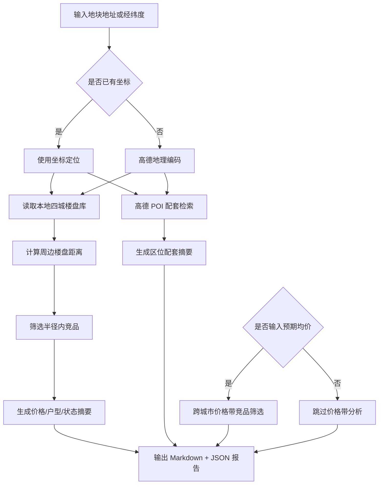

# DDS 地块画像报告 — 三亚

## 输入摘要
- 城市：三亚
- 区域：海棠区
- 地址：三亚海棠区青田村
- 坐标：109.678675, 18.283274（来源：amap_geocode）
- 预期均价：43000.0 元/㎡

## 逻辑流程图初稿

## 周边竞品分析
- 样本数：30
- 有效价格样本：12
- 均价：82474.0 元/㎡
- 价格区间：35000.0 - 175000.0 元/㎡

### 竞品列表
| 楼盘 | 城市 | 区域 | 状态 | 均价元/㎡ | 距离km | 面积段 | 户型 | 开发商 |
| --- | --- | --- | --- | --- | --- | --- | --- | --- |
| 新湖海棠春晓 | 三亚 | 海棠区 | 在售 | 100000.0 | 0.6 | 200-228㎡ | 商业户型 | 海南满天星旅业开发有限公司 |
| 绿城·凤鸣观棠 | 三亚 | 海棠区 | 在售 | 35000.0 | 3.6 | 113-281㎡ | 2室户型,3室户型,4室户型 | 三亚棠华置业有限公司 |
| 国家海岸•保利海棠 | 三亚 | 海棠区 | 尾盘 | — | 3.7 | 65-88㎡ | 2室户型,3室户型 | — |
| 华皓亚龙府 | 三亚 | 吉阳区 | 尾盘 | — | 3.7 | 55-215㎡ | 1室户型,2室户型,3室户型,别墅户型 | 三亚华甸养生谷开发有限公司 |
| 保利C+国际博览中心 | 三亚 | 海棠区 | 在售 | 65000.0 | 4.1 | 57-144㎡ | 商业户型 | 海南裕楚商业有限公司 |
| 国家海岸保利海棠二期 | 三亚 | 海棠区 | 尾盘 | — | 4.2 | 69-78㎡ | 商业户型 | 保利（三亚）房地产开发有限公司 |
| 保利海晏 | 三亚 | 海棠区 | 在售 | 35000.0 | 4.2 | 107-203㎡ | 2室户型,3室户型,4室户型 | 保利（三亚）房地产开发有限公司 |
| 中交海棠麓湖 | 三亚 | 海棠区 | 尾盘 | — | 4.5 | 111-201㎡ | 别墅户型 | 三亚中交瀚星投资有限公司 |
| 绿地悦澜湾·7号 | 三亚 | 吉阳区 | 尾盘 | — | 4.6 | 57-132㎡ | 商业户型 | 四川宏凌实业有限公司 |
| 铂悦亚龙湾 | 三亚 | 吉阳区 | 尾盘 | — | 5.2 | 120-368㎡ | 别墅户型 | 三亚海力投资置业有限公司 |
| 申亚翡翠谷 | 三亚 | 吉阳区 | 尾盘 | — | 5.3 | 184-360㎡ | 别墅户型 | — |
| 亚龙湾石溪墅 | 三亚 | 吉阳区 | 尾盘 | — | 5.3 | 63-456㎡ | 1室户型,2室户型,别墅户型 | — |
| 三亚中体奥林匹克湾 | 三亚 | 海棠区 | 尾盘 | — | 5.3 | — | — | — |
| 恒大养生谷 | 三亚 | 海棠区 | 尾盘 | — | 5.4 | 35-83㎡ | 商业户型 | — |
| 国寿嘉园逸境 | 三亚 | 海棠区 | 在售 | 50000.0 | 5.7 | 96-128㎡ | 商业户型 | 嘉园逸境（三亚）健康投资有限公司 |
| 华宇皇冠会馆别墅 | 三亚 | 吉阳区 | 尾盘 | — | 5.9 | 529-615㎡ | 别墅户型 | — |
| 海棠101 | 三亚 | 海棠区 | 尾盘 | 100000.0 | 6.4 | 175-275㎡ | 商业户型 | 三亚海泰投资管理有限公司 |
| 申亚亚龙湾壹号三期 | 三亚 | 吉阳区 | 在售 | 52500.0 | 6.5 | 62-251㎡ | 商业户型 | 海南申亚置业有限公司 |
| 海棠湾·云境 | 三亚 | 海棠区 | 在售 | 150000.0 | 6.5 | 118-347㎡ | 商业户型 | 三亚国美旅业有限公司 |
| 亚龙湾公主郡 | 三亚 | 吉阳区 | 尾盘 | — | 6.5 | 76-672㎡ | 1室户型,2室户型,3室户型,别墅户型 | — |

## 区位配套分析
- 学校：最近 三亚市海棠区青田第一幼儿园，约 417m
- 医院：最近 上工谷运动医学康复医疗中心，约 138m
- 地铁站：暂无数据
- 公交站：最近 上工谷(公交站)，约 374m
- 商场：最近 老李便利店(青田风情小镇店)，约 374m
- 公园：暂无数据
- 超市：暂无数据

## 预期均价竞品参照
当前全国分析基于本地四城样本：三亚、杭州、上海、青岛，后续可扩展全国 CSV/在线抓取数据源。
- 预期均价：43000.0 元/㎡
- 筛选价格带：36550.0 - 49450.0 元/㎡
- 城市分布：{'上海': 23, '三亚': 4, '杭州': 2, '青岛': 1}

| 楼盘 | 城市 | 区域 | 状态 | 均价元/㎡ | 价差 | 面积段 | 户型 | 开发商 |
| --- | --- | --- | --- | --- | --- | --- | --- | --- |
| 半山首府 | 三亚 | 吉阳区 | 在售 | 43000.0 | 0.0 | 102-132㎡ | 2室户型,3室户型 | 海南冠洋四通投资有限公司 |
| 锦华茗园 | 上海 | 嘉定区 | 在售 | 43000.0 | 0.0 | — | — | 上海盛城房地产有限公司 |
| 招商中旅·揽阅 | 上海 | 闵行区 | 在售 | 43000.0 | 0.0 | 96-135㎡ | 3室户型,4室户型 | 上海招旅置业有限公司 |
| 首创禧瑞云启 | 上海 | 青浦区 | 尾盘 | 43000.0 | 0.0 | 70-112㎡ | 1室户型,3室户型 | 上海首璞置业有限公司 |
| 揽潮誉道 | 杭州 | 上城区 | 在售 | 43000.0 | 0.0 | 315㎡ | 商业户型 | 杭州滨江建筑集团有限公司 |
| 德信御临云峰 | 杭州 | 上城区 | 在售 | 43000.0 | 0.0 | 336-430㎡ | 商业户型 | 杭州德信云昊置业有限公司 |
| 海信·君玺 | 青岛 | 崂山区 | 在售 | 43000.0 | 0.0 | 120-207㎡ | 3室户型,4室户型 | 青岛海信信邦置业有限公司 |
| 奉发·右岸晶邸 | 上海 | 奉贤区 | 在售 | 43100.0 | 100.0 | 91-163㎡ | 3室户型,5室户型,别墅户型 | 上海建瀚置业有限公司 |
| 大华星曜 | 上海 | 闵行区 | 在售 | 42877.0 | 123.0 | 89-135㎡ | 3室户型,4室户型 | 上海鲲华房地产开发有限公司 |
| 保利建发印象青城 | 上海 | 青浦区 | 在售 | 42861.0 | 139.0 | 91-175㎡ | 3室户型,4室户型,别墅户型 | 上海盛兆荟房地产开发有限公司 |
| 新黄浦江南里 | 上海 | 青浦区 | 尾盘 | 42792.0 | 208.0 | 99-175㎡ | 3室户型,别墅户型 | 上海浦伦稳晟置业有限公司 |
| 天安象屿·西江悦 | 上海 | 宝山区 | 尾盘 | 42752.0 | 248.0 | 82-138㎡ | 3室户型,4室户型,别墅户型 | 上海光祥房地产开发有限公司 |
| 上江南贤庐 | 上海 | 奉贤区 | 在售 | 43268.0 | 268.0 | 107-441㎡ | 2室户型,3室户型,4室户型,5室户型 | 上海上江南贤庐置业有限公司 |
| 国贸海屿佘山 | 上海 | 松江区 | 在售 | 43290.0 | 290.0 | 93-165㎡ | 3室户型,别墅户型 | 上海贸华房地产有限公司 |
| 安联湖山悦 | 上海 | 青浦区 | 尾盘 | 43389.0 | 389.0 | 88-132㎡ | 3室户型,别墅户型 | 上海迈信置业有限公司 |
| 新城尚品 | 上海 | 松江区 | 在售 | 43474.0 | 474.0 | 70-165㎡ | 1室户型,2室户型,3室户型,4室户型 | 上海莘松绿嘉房地产有限公司 |
| 金地·嘉悦湾 | 上海 | 嘉定区 | 尾盘 | 43706.0 | 706.0 | — | — | 上海陆鑫房地产开发有限公司 |
| 滨江雅著 | 上海 | 闵行区 | 在售 | 43725.0 | 725.0 | 101㎡ | 2室户型,3室户型 | 上海紫旺房地产开发经营有限公司 |
| 众禾嘉苑 | 上海 | 嘉定区 | 在售 | 43855.0 | 855.0 | 94-122㎡ | 3室户型 | 上海大众众望城市建设开发有限公司 |
| 盛青·云驰 | 上海 | 青浦区 | 尾盘 | 43895.0 | 895.0 | 80-114㎡ | 2室户型,3室户型,4室户型 | 上海中睿房地产经营有限公司,上海盛驰置业有限公司 |
| 保利建发·璟玥府 | 上海 | 嘉定区 | 在售 | 43982.0 | 982.0 | 91-160㎡ | 3室户型,4室户型,5室户型,别墅户型 | 上海锦兆利置业有限公司 |
| 爱上山·自由小镇 | 三亚 | 天涯区 | 在售 | 42000.0 | 1000.0 | 43-67㎡ | — | 三亚春瑞实业有限公司 |
| 天正三亚湾壹号 | 三亚 | 天涯区 | 在售 | 42000.0 | 1000.0 | 126-213㎡ | 3室户型,4室户型,5室户型 | 三亚永基房地产开发有限公司 |
| 三亚璞海 | 三亚 | 崖州区 | 尾盘 | 42000.0 | 1000.0 | 66-134㎡ | 商业户型 | 三亚嘉鹏科技发展有限公司 |
| 奉发·左岸晶邸 | 上海 | 奉贤区 | 在售 | 42000.0 | 1000.0 | 99-153㎡ | 3室户型,4室户型,别墅户型 | 上海煜领置业有限公司 |
| 大名城映云间 | 上海 | 松江区 | 尾盘 | 44000.0 | 1000.0 | 88-138㎡ | 3室户型,4室户型,别墅户型 | 上海秀弛实业有限公司 |
| 国贸梧桐原 | 上海 | 松江区 | 尾盘 | 44000.0 | 1000.0 | 75-127㎡ | 2室户型,3室户型,4室户型 | 上海贸洲房地产有限公司 |
| 浦发东悦城 | 上海 | 浦东 | 尾盘 | 42000.0 | 1000.0 | 71-180㎡ | 1室户型,2室户型,3室户型,4室户型 | 上海鼎坤房地产有限公司 |
| 同润朱韵澜庭 | 上海 | 青浦区 | 在售 | 42000.0 | 1000.0 | 89-143㎡ | 3室户型,别墅户型 | 上海垄洙房地产开发有限公司 |
| 恒文虹桥星尚湾 | 上海 | 青浦区 | 尾盘 | 42000.0 | 1000.0 | 89-161㎡ | 2室户型,3室户型,4室户型,别墅户型 | 上海文基置业有限公司 |

## 数据边界与下一步
- 当前竞品库覆盖本地四城：三亚、杭州、上海、青岛。
- 周边配套来自高德 Web 服务实时 POI。
- 下一步可接入全国楼盘 CSV 或在线抓取任务，将价格带分析从本地 MVP 扩展为真实全国范围。
