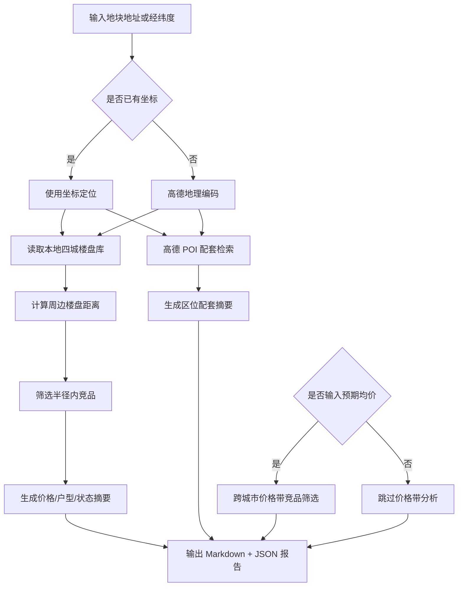

# DDS 地块画像报告 — 杭州

## 输入摘要
- 城市：杭州
- 区域：未指定
- 地址：杭州滨江区浦沿路
- 坐标：120.152568, 30.161305（来源：amap_geocode）
- 预期均价：40000.0 元/㎡

## 逻辑流程图初稿

## 周边竞品分析
- 样本数：14
- 有效价格样本：13
- 均价：32838.0 元/㎡
- 价格区间：22000.0 - 50080.0 元/㎡

### 竞品列表
| 楼盘 | 城市 | 区域 | 状态 | 均价元/㎡ | 距离km | 面积段 | 户型 | 开发商 |
| --- | --- | --- | --- | --- | --- | --- | --- | --- |
| 揽晖美寓 | 杭州 | 滨江区 | 尾盘 | 40556.0 | 1.1 | 105-165㎡ | 3室户型,4室户型 | 杭州滨宝置业有限公司 |
| 英冠绿城·春来晴翠 | 杭州 | 滨江区 | 在售 | 33009.0 | 1.3 | 105-169㎡ | 3室户型,4室户型 | 杭州绿英置业有限公司 |
| 鸣涛里 | 杭州 | 萧山区 | 在售 | — | 1.6 | 186-364㎡ | 2室户型,3室户型,4室户型 | 杭州滨卓房地产开发有限公司 |
| 钱塘ONE | 杭州 | 西湖区 | 在售 | 37000.0 | 2.9 | 22-128㎡ | 商业户型 | 杭州汇辉置业有限公司 |
| 绿城知海棠 | 杭州 | 西湖区 | 在售 | 31761.0 | 3.3 | 106-164㎡ | 3室户型,4室户型 | 绿城房地产集团有限公司,杭州浙秋置业有限公司 |
| 海威领界 | 杭州 | 滨江区 | 在售 | 25000.0 | 3.4 | 1049㎡ | 商业户型 | 杭州弘威置业有限公司 |
| 华润沄璟文华轩 | 杭州 | 西湖区 | 在售 | 50080.0 | 3.9 | 145-215㎡ | 4室户型 | 杭州华润江澋房地产开发有限公司 |
| 之江门公寓 | 杭州 | 西湖区 | 在售 | 35000.0 | 3.9 | 55㎡ | 商业户型 | 杭州大湾房地产有限公司 |
| 西投银泰城 | 杭州 | 西湖区 | 在售 | 30000.0 | 4.2 | 310-320㎡ | — | 杭州之江银泰建设发展有限公司,杭州西投银泰建设发展有限公司 |
| 中融蓝城Co.C理想城 | 杭州 | 西湖区 | 在售 | 25000.0 | 4.2 | 29-53㎡ | 商业户型 | 杭州中融控股集团有限公司 |
| 之江印 | 杭州 | 西湖区 | 在售 | 29000.0 | 4.2 | 32-41㎡ | 商业户型 | 杭州元山置业有限公司 |
| 建发云启之江 | 杭州 | 西湖区 | 尾盘 | 37482.0 | 4.3 | 103-229㎡ | 3室户型,4室户型,5室户型 | 杭州启坤置业有限公司,杭州启原置业有限公司 |
| 之江长九中心 | 杭州 | 西湖区 | 在售 | 22000.0 | 4.7 | — | — | 浙江长九珊瑚沙置业有限公司 |
| 绿城卓越傲旋城公寓 | 杭州 | 滨江区 | 在售 | 31000.0 | 5.0 | 57-312㎡ | 商业户型 | 杭州恒兴置业有限公司 |

## 区位配套分析
- 学校：最近 浦沿小学D幢，约 275m
- 医院：最近 杭嘉口腔，约 101m
- 地铁站：最近 浦沿地铁站A口，约 131m
- 公交站：最近 地铁浦沿站C口(公交站)，约 145m
- 商场：最近 供销生活超市(浦沿店)，约 70m
- 公园：最近 浦沿明悦公园，约 548m
- 超市：最近 金盛嘉悦广场，约 260m

## 预期均价竞品参照
当前全国分析基于本地四城样本：三亚、杭州、上海、青岛，后续可扩展全国 CSV/在线抓取数据源。
- 预期均价：40000.0 元/㎡
- 筛选价格带：34000.0 - 46000.0 元/㎡
- 城市分布：{'上海': 11, '杭州': 9, '三亚': 8, '青岛': 2}

| 楼盘 | 城市 | 区域 | 状态 | 均价元/㎡ | 价差 | 面积段 | 户型 | 开发商 |
| --- | --- | --- | --- | --- | --- | --- | --- | --- |
| 万科海上大都会左岸 | 三亚 | 天涯区 | 尾盘 | 40000.0 | 0.0 | 117-161㎡ | 3室户型,4室户型 | 三亚碧海锦晟酒店管理有限公司 |
| 万科·三亚湾 | 三亚 | 天涯区 | 在售 | 40000.0 | 0.0 | 123-189㎡ | 3室户型,4室户型 | 海南万睿房地产开发有限公司 |
| 中投悦府 | 三亚 | 天涯区 | 在售 | 40000.0 | 0.0 | 82-126㎡ | 2室户型,3室户型 | 海南中投合通实业发展有限公司 |
| 紫金国际中心 | 三亚 | 天涯区 | 在售 | 40000.0 | 0.0 | 331-733㎡ | 商业户型 | 紫金海外投资有限公司 |
| 碧桂园三亚郡 | 三亚 | 天涯区 | 尾盘 | 40000.0 | 0.0 | 100-144㎡ | 3室户型,4室户型 | 三亚联合实业有限公司 |
| 香水湾18°院 | 三亚 | 陵水 | 在售 | 40000.0 | 0.0 | 124-176㎡ | 2室户型,3室户型 | 海南盈新文化旅游发展有限公司 |
| 中国铁建·熙语 | 上海 | 奉贤区 | 在售 | 40000.0 | 0.0 | 81-148㎡ | 2室户型,3室户型,4室户型,别墅户型 | 上海京泓润房地产开发有限公司 |
| 葛洲坝融创虹桥玫瑰公馆 | 上海 | 青浦区 | 尾盘 | 40000.0 | 0.0 | 85-119㎡ | 3室户型,4室户型 | — |
| 宸颂星街 | 杭州 | 上城区 | 在售 | 40000.0 | 0.0 | — | — | 杭州龙瑄房地产开发有限公司 |
| 大麗和和中心 | 杭州 | 余杭区 | 在售 | 40000.0 | 0.0 | 186㎡ | 商业户型 | 杭州泰福置业有限公司 |
| 杭与城天街地标铺 | 杭州 | 余杭区 | 在售 | 40000.0 | 0.0 | — | — | 杭州嘉腾交控西站有限公司 |
| 世纪国泰中心 | 杭州 | 萧山区 | 在售 | 40000.0 | 0.0 | 535㎡ | 商业户型 | 杭州国泰世纪置业有限公司 |
| 海信璟悦 | 青岛 | 崂山区 | 在售 | 40000.0 | 0.0 | 128-220㎡ | 3室户型,4室户型 | 青岛海信信邦置业有限公司 |
| 海信国际中心 | 青岛 | 崂山区 | 在售 | 40000.0 | 0.0 | 65-135㎡ | 商业户型 | 青岛海信信邦置业有限公司 |
| 恒文璞悦江南 | 上海 | 青浦区 | 在售 | 40052.0 | 52.0 | 88-145㎡ | 3室户型,别墅户型 | 上海文欢置业有限公司 |
| 滨江咏舟府 | 杭州 | 余杭区 | 在售 | 40060.0 | 60.0 | 123-173㎡ | 4室户型 | 杭州滨韵房地产开发有限公司 |
| 君御公馆 | 上海 | 浦东 | 在售 | 39900.0 | 100.0 | 90-175㎡ | 3室户型,4室户型 | 上海宏士达房地产开发有限公司 |
| 佳运名邸 | 上海 | 宝山区 | 在售 | 39837.0 | 163.0 | 87-133㎡ | 3室户型,4室户型 | 上海佳运宝城房地产开发有限公司 |
| 上海·嘉芯荟 | 上海 | 嘉定区 | 在售 | 39600.0 | 400.0 | 89-102㎡ | 2室户型,3室户型 | 上海隽冈置业有限公司 |
| 赞成翠悦半岛 | 杭州 | 萧山区 | 尾盘 | 39600.0 | 400.0 | 90-166㎡ | 3室户型,4室户型,别墅户型 | 杭州赞成金御房地产开发有限公司 |
| 大名城映湖 | 上海 | 青浦区 | 尾盘 | 39592.0 | 408.0 | 77-123㎡ | 2室户型,3室户型,4室户型 | 上海苏翀置业有限公司 |
| 滨悦翡丽轩 | 杭州 | 萧山区 | 在售 | 39500.0 | 500.0 | 138-167㎡ | 4室户型 | 江苏联益房地产开发有限公司 |
| 滨江兴耀·锦上观澜 | 杭州 | 萧山区 | 在售 | 39450.0 | 550.0 | 112-171㎡ | 3室户型,4室户型 | 杭州滨亿房地产开发有限公司 |
| 揽晖美寓 | 杭州 | 滨江区 | 尾盘 | 40556.0 | 556.0 | 105-165㎡ | 3室户型,4室户型 | 杭州滨宝置业有限公司 |
| 金融街·美兰金悦府 | 上海 | 宝山区 | 在售 | 40587.0 | 587.0 | 89-102㎡ | 3室户型 | 上海融捷置业有限公司 |
| 荣景苑三期 | 上海 | 松江区 | 在售 | 40800.0 | 800.0 | 69-105㎡ | 1室户型,2室户型,3室户型 | 上海松腾置业有限责任公司 |
| 联发·时光新澍 | 上海 | 青浦区 | 在售 | 40893.0 | 893.0 | 116-155㎡ | 3室户型,4室户型 | 上海新澍浦泓房地产开发有限公司 |
| 吉祥16号 | 三亚 | 天涯区 | 在售 | 39000.0 | 1000.0 | 130-229㎡ | 2室户型,3室户型,4室户型 | 海建吉祥（三亚）置业有限公司 |
| 爱上山·梦想小镇 | 三亚 | 天涯区 | 在售 | 39000.0 | 1000.0 | 55-78㎡ | — | 三亚槟榔河实业有限公司 |
| 南山·嘉荟领峯 | 上海 | 嘉定区 | 尾盘 | 41000.0 | 1000.0 | 105-140㎡ | 3室户型,4室户型 | 上海南樾实业发展有限公司 |

## 数据边界与下一步
- 当前竞品库覆盖本地四城：三亚、杭州、上海、青岛。
- 周边配套来自高德 Web 服务实时 POI。
- 下一步可接入全国楼盘 CSV 或在线抓取任务，将价格带分析从本地 MVP 扩展为真实全国范围。
