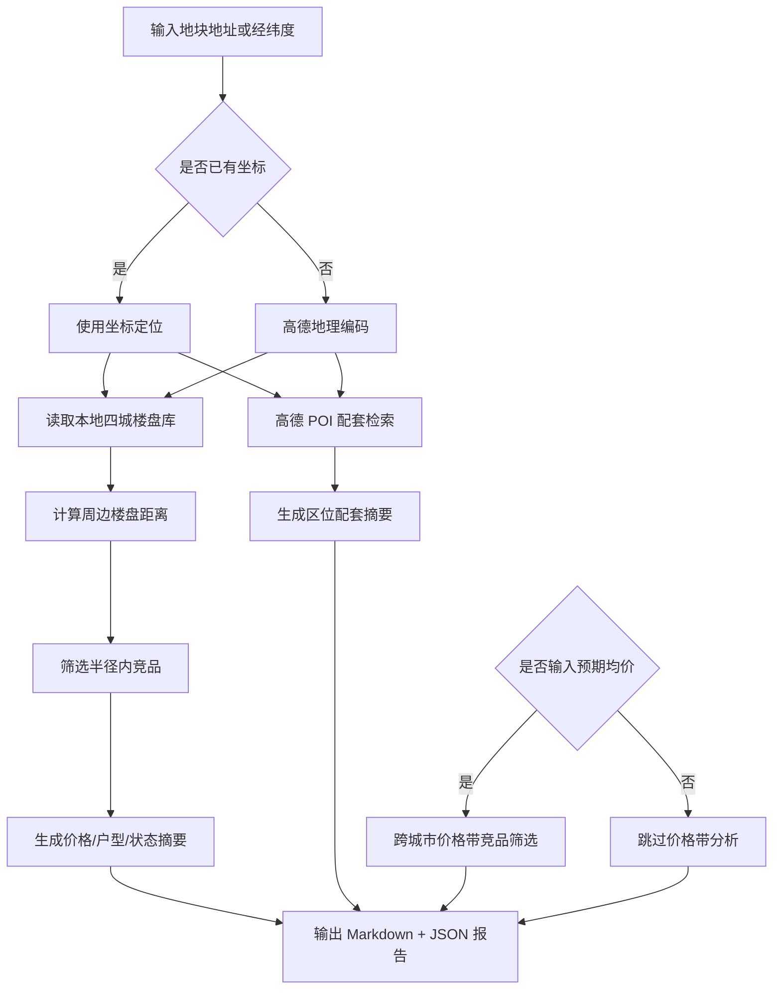

# DDS 地块画像报告 — 上海

## 输入摘要
- 城市：上海
- 区域：未指定
- 地址：上海浦东新区张江路
- 坐标：121.619283, 31.201332（来源：amap_geocode）
- 预期均价：65000.0 元/㎡

## 逻辑流程图初稿

## 周边竞品分析
- 样本数：30
- 有效价格样本：4
- 均价：87342.0 元/㎡
- 价格区间：68000.0 - 105037.0 元/㎡

### 竞品列表
| 楼盘 | 城市 | 区域 | 状态 | 均价元/㎡ | 距离km | 面积段 | 户型 | 开发商 |
| --- | --- | --- | --- | --- | --- | --- | --- | --- |
| 汇智湖畔家园 | 上海 | 浦东 | 尾盘 | — | 0.8 | 74-148㎡ | 1室户型,2室户型,3室户型 | — |
| 德宏大厦 | 上海 | 浦东 | 尾盘 | — | 1.1 | — | — | 上海德宏实业有限公司 |
| 中建御华园 | 上海 | 浦东 | 尾盘 | 84700.0 | 1.4 | 99-318㎡ | 3室户型,别墅户型 | 上海中建张江投资发展有限公司 |
| 阳光花城 | 上海 | 浦东 | 尾盘 | — | 1.6 | 317-518㎡ | 5室户型,6室户型 | — |
| 万科翡翠公园 | 上海 | 浦东 | 尾盘 | — | 1.8 | 85-150㎡ | 2室户型,3室户型,4室户型 | — |
| 城市经典三期夏宫 | 上海 | 浦东 | 尾盘 | — | 1.9 | 230-340㎡ | 2室户型,3室户型,4室户型 | — |
| 万科翡翠公园商铺 | 上海 | 浦东 | 尾盘 | — | 1.9 | 70-600㎡ | — | — |
| 东郊紫园 | 上海 | 浦东 | 尾盘 | — | 2.1 | 247-551㎡ | 5室户型 | — |
| 绿地M-TOWN | 上海 | 浦东 | 尾盘 | — | 2.2 | 130㎡ | 商办户型 | — |
| 圣宇豪庭 | 上海 | 浦东 | 尾盘 | 68000.0 | 2.2 | 137-308㎡ | 3室户型,4室户型,5室户型 | 上海浦东金三角房地产实业有限公司 |
| 日月光水岸花园 | 上海 | 浦东 | 尾盘 | — | 2.4 | 78-145㎡ | 2室户型,3室户型 | — |
| 盛大天地青春里2.0 | 上海 | 浦东 | 尾盘 | — | 2.5 | — | — | — |
| 中建朗阅府 | 上海 | 浦东 | 尾盘 | — | 2.6 | 88-184㎡ | 3室户型,4室户型,别墅户型 | 上海中建东孚投资发展有限公司 |
| 长城中环墅 | 上海 | 浦东 | 尾盘 | — | 2.6 | 255㎡ | 3室户型 | — |
| 华发四季 | 上海 | 浦东 | 尾盘 | — | 2.7 | 89-149㎡ | 3室户型,4室户型 | — |
| 张江三湘海尚 | 上海 | 浦东 | 尾盘 | — | 2.9 | 87-136㎡ | 2室户型,3室户型 | — |
| 东园雅集轩 | 上海 | 浦东 | 尾盘 | — | 2.9 | 456-535㎡ | 别墅户型 | — |
| 东郊花园 | 上海 | 浦东 | 尾盘 | — | 2.9 | 400㎡ | 别墅户型 | — |
| 史丹福花园 | 上海 | 浦东 | 在售 | — | 3.1 | — | — | 上海斯米克房地产有限公司 |
| 浦开摩登江南里 | 上海 | 浦东 | 在售 | — | 3.1 | 150-280㎡ | 别墅户型 | 上海浦东土地控股（集团）有限公司 |

## 区位配套分析
- 学校：最近 贝贝树幼儿园，约 508m
- 医院：最近 世托世家，约 155m
- 地铁站：最近 广兰路地铁站4号口，约 1065m
- 公交站：最近 张江路高科中路(公交站)，约 107m
- 商场：最近 乐享e购，约 121m
- 公园：最近 森屿湾口袋公园，约 481m
- 超市：最近 张江商业广场，约 639m

## 预期均价竞品参照
当前全国分析基于本地四城样本：三亚、杭州、上海、青岛，后续可扩展全国 CSV/在线抓取数据源。
- 预期均价：65000.0 元/㎡
- 筛选价格带：55250.0 - 74750.0 元/㎡
- 城市分布：{'上海': 21, '杭州': 4, '青岛': 3, '三亚': 2}

| 楼盘 | 城市 | 区域 | 状态 | 均价元/㎡ | 价差 | 面积段 | 户型 | 开发商 |
| --- | --- | --- | --- | --- | --- | --- | --- | --- |
| 保利C+国际博览中心 | 三亚 | 海棠区 | 在售 | 65000.0 | 0.0 | 57-144㎡ | 商业户型 | 海南裕楚商业有限公司 |
| 中展璞荟 | 上海 | 松江区 | 尾盘 | 65000.0 | 0.0 | — | — | 上海融慧置业有限公司 |
| 港城中环汇·云启 | 上海 | 浦东 | 在售 | 65000.0 | 0.0 | 79-187㎡ | 2室户型,3室户型,4室户型,5室户型 | 上海康城企业管理有限公司 |
| 保利光合上城/跃城 | 上海 | 闵行区 | 在售 | 65000.0 | 0.0 | 93-143㎡ | 3室户型,4室户型 | 上海广沅置业有限公司 |
| 蟠龙里 | 上海 | 青浦区 | 在售 | 65000.0 | 0.0 | 100-145㎡ | 3室户型,4室户型 | 上海同青置业有限公司 |
| 中海御道 | 杭州 | 上城区 | 在售 | 65000.0 | 0.0 | 75-185㎡ | 1室户型,2室户型,3室户型 | 杭州中海宏鲲房地产有限公司 |
| 梵悦·凌云 | 青岛 | 市南区 | 在售 | 65000.0 | 0.0 | 357㎡ | 商业户型 | 青岛新锐家禾置业有限公司 |
| 金地虹悦湾 | 上海 | 青浦区 | 尾盘 | 64902.0 | 98.0 | 95-148㎡ | 3室户型,别墅户型 | 上海鑫荟房地产开发有限公司 |
| 大华公园柏翠 | 上海 | 宝山区 | 在售 | 65327.0 | 327.0 | 101-142㎡ | 3室户型,4室户型 | 上海华行房地产开发有限公司 |
| 陆家嘴·锦绣云澜 | 上海 | 浦东 | 在售 | 65333.0 | 333.0 | 89-168㎡ | 3室户型,4室户型 | 上海佳川置业有限公司 |
| 佳运·瑞璟湾 | 上海 | 宝山区 | 在售 | 65696.0 | 696.0 | 98-166㎡ | 3室户型,4室户型 | 上海佳运锦程房地产开发有限公司 |
| 绿城蕙澜月华里 | 杭州 | 上城区 | 在售 | 64136.0 | 864.0 | 188-280㎡ | 4室户型,5室户型 | 杭州浙易置业有限公司 |
| 东岸观邸 | 上海 | 浦东 | 在售 | 64000.0 | 1000.0 | 83-155㎡ | 3室户型,4室户型 | 上海国际旅游度假区川沙开发建设有限公司 |
| 华发蟠龙四季 | 上海 | 青浦区 | 尾盘 | 64000.0 | 1000.0 | 101-150㎡ | 3室户型,4室户型 | 上海徐菁房地产开发有限公司 |
| 海潮望月城·潮印 | 杭州 | 上城区 | 在售 | 66000.0 | 1000.0 | — | — | 杭州滨来置业有限公司 |
| 中环金茂府 | 上海 | 宝山区 | 在售 | 66258.0 | 1258.0 | 100-228㎡ | 3室户型,4室户型,5室户型 | 上海霄茂置业有限公司 |
| 虹桥公馆3期 | 上海 | 青浦区 | 尾盘 | 63732.0 | 1268.0 | 92-132㎡ | 3室户型,4室户型 | 上海招政置业有限公司 |
| 华发四季河滨 | 上海 | 宝山区 | 尾盘 | 66310.0 | 1310.0 | 74-121㎡ | 2室户型,3室户型,别墅户型 | 上海顾泓房地产开发有限公司 |
| 聚丰雅居 | 上海 | 宝山区 | 在售 | 63519.0 | 1481.0 | 104-148㎡ | 3室户型,4室户型 | 上海祁连房地产开发总公司 |
| 绿城湖映金沙轩 | 杭州 | 钱塘区 | 在售 | 66484.0 | 1484.0 | 129-400㎡ | 3室户型,4室户型 | 杭州绿城浙佑置业有限公司 |
| 绿城·留香园 | 上海 | 嘉定区 | 尾盘 | 63043.0 | 1957.0 | 95-170㎡ | 3室户型,4室户型 | 上海绿憬置业有限公司 |
| 爱上山II·艺术小镇 | 三亚 | 天涯区 | 在售 | 67000.0 | 2000.0 | 45-108㎡ | — | 三亚春瑞实业有限公司 |
| 经纬·至臻豪庭 | 上海 | 宝山区 | 尾盘 | 63000.0 | 2000.0 | 138-172㎡ | 3室户型,4室户型 | 经纬置地有限公司 |
| 吴淞道1号 | 上海 | 宝山区 | 在售 | 63000.0 | 2000.0 | 99-145㎡ | 3室户型,4室户型 | 上海实淞房地产开发有限公司 |
| 虹桥灿耀星城 | 上海 | 青浦区 | 在售 | 63000.0 | 2000.0 | 70-88㎡ | 2室户型,3室户型 | 上海新徐泾城实业有限公司 |
| 招商虹桥璀璨时代 | 上海 | 青浦区 | 尾盘 | 63000.0 | 2000.0 | 91-120㎡ | 3室户型 | 上海招卓置业有限公司 |
| 海信依云小镇·安纳 | 青岛 | 崂山区 | 在售 | 63000.0 | 2000.0 | 153-273㎡ | 3室户型,4室户型,5室户型 | 青岛海信五环房地产开发有限公司 |
| 银丰玖玺城·珺府 | 青岛 | 崂山区 | 在售 | 67000.0 | 2000.0 | 127-313㎡ | 2室户型,3室户型,4室户型 | 青岛高科技工业园山东头房地产开发公司 |
| 绿城·春晓园 | 上海 | 青浦区 | 在售 | 62743.0 | 2257.0 | 100-150㎡ | 3室户型,4室户型 | 上海绿彰置业有限公司 |
| 中环铂樾 | 上海 | 宝山区 | 在售 | 67396.0 | 2396.0 | 110-139㎡ | 3室户型,4室户型 | 上海东润鸣熙置业有限公司 |

## 数据边界与下一步
- 当前竞品库覆盖本地四城：三亚、杭州、上海、青岛。
- 周边配套来自高德 Web 服务实时 POI。
- 下一步可接入全国楼盘 CSV 或在线抓取任务，将价格带分析从本地 MVP 扩展为真实全国范围。
