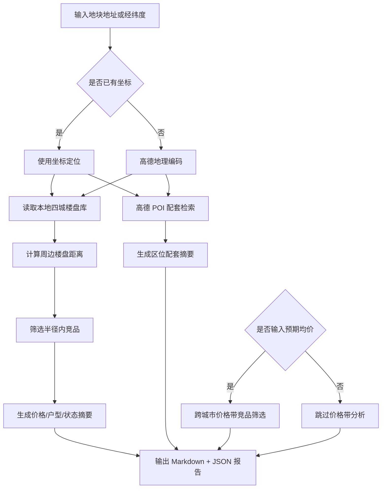

# DDS 地块画像报告 — 北京

## 输入摘要
- 城市：北京
- 区域：未指定
- 地址：朝阳区
- 坐标：116.443136, 39.921444（来源：amap_geocode）
- 预期均价：未输入 元/㎡

## 逻辑流程图初稿

## 周边竞品分析
- 样本数：30
- 有效价格样本：29
- 均价：8700.0 元/㎡
- 价格区间：5400.0 - 15000.0 元/㎡
- 注意：半径内样本不足，已补充同区或同城样本。

### 竞品列表
| 楼盘 | 城市 | 区域 | 状态 | 均价元/㎡ | 距离km | 面积段 | 户型 | 开发商 |
| --- | --- | --- | --- | --- | --- | --- | --- | --- |
| 和达翡翠城 | 青岛 | 平度市 | 在售 | 6000.0 | 464.5 | 95-121㎡ | 3室户型 | 青岛和达昇平实业有限公司 |
| 海信城 | 青岛 | 平度市 | 在售 | 6800.0 | 466.3 | 105-196㎡ | 3室户型,4室户型 | 青岛海瑞达置业有限公司 |
| 绿城·春风雅园 | 青岛 | 平度市 | 在售 | 9500.0 | 466.5 | 125-185㎡ | 3室户型,4室户型 | 平度市城市更新发展有限公司 |
| 海信学府里 | 青岛 | 平度市 | 在售 | 8200.0 | 467.8 | 106-198㎡ | 3室户型,4室户型 | 青岛信博置业有限公司 |
| 奥润熙湖华府 | 青岛 | 莱西市 | 在售 | 6500.0 | 480.2 | 66-255㎡ | 1室户型,2室户型,3室户型,4室户型,5室户型 | 青岛仁和房地产开发有限公司 |
| 海信九麓府 | 青岛 | 莱西市 | 在售 | 6500.0 | 488.5 | 100-200㎡ | 3室户型,4室户型 | 青岛海信昌荣置业有限公司 |
| 乐好国际城 | 青岛 | 莱西市 | 在售 | 6500.0 | 489.7 | 120-156㎡ | 3室户型,4室户型 | 青岛乐好正壹置业有限公司 |
| 华商金都 | 青岛 | 莱西市 | 在售 | 6500.0 | 490.3 | 108-120㎡ | 3室户型 | 青岛华炫置业有限公司 |
| 河畔嘉园 | 青岛 | 莱西市 | 在售 | 6000.0 | 491.2 | — | — | 青岛天美置业有限公司 |
| 华商金岸 | 青岛 | 莱西市 | 在售 | — | 492.0 | 93-171㎡ | 2室户型,3室户型,4室户型 | 青岛华商置业有限公司 |
| 澜山悦府 | 青岛 | 胶州市 | 在售 | 7800.0 | 503.9 | 97-143㎡ | 3室户型,4室户型 | 青岛中仁房地产有限公司 |
| 信达·君和蓝庭 | 青岛 | 胶州市 | 在售 | 5400.0 | 507.9 | 89-115㎡ | 3室户型 | 青岛金泰盛源置业有限公司 |
| 龙湖紫都城天越 | 青岛 | 胶州市 | 在售 | 6500.0 | 509.6 | 100-143㎡ | 3室户型,4室户型 | 青岛龙泽嘉悦置业有限公司 |
| 绿城·凤栖海棠 | 青岛 | 胶州市 | 在售 | 13500.0 | 512.4 | 133-370㎡ | 3室户型,4室户型,5室户型 | 青岛鸿锦悦城置业有限公司 |
| 水岸名邦 | 青岛 | 胶州市 | 在售 | 14000.0 | 514.1 | 133-171㎡ | 3室户型,4室户型 | 青岛上合城乡融合发展集团有限公司 |
| 阳光·壹号 | 青岛 | 胶州市 | 在售 | 12500.0 | 514.4 | 120-160㎡ | 3室户型 | 阳光新天地投资集团（胶州）置业有限公司 |
| 宝佳雲湖甲第 | 青岛 | 胶州市 | 在售 | 15000.0 | 514.7 | 121-246㎡ | 3室户型,4室户型 | 青岛宝佳置业有限公司 |
| 龙湖·观萃 | 青岛 | 胶州市 | 在售 | 12000.0 | 515.6 | 126-190㎡ | 3室户型,4室户型 | 青岛锦昊嘉辉置业有限公司 |
| 中海学仕里 | 青岛 | 胶州市 | 在售 | 10000.0 | 515.9 | 108-140㎡ | 3室户型 | 青岛市联明地产有限公司 |
| 龙湖蓝岸郦城 | 青岛 | 即墨区 | 在售 | 5800.0 | 516.8 | 89-107㎡ | 3室户型 | 青岛安洛惠庭置业有限公司 |

## 区位配套分析
- 学校：最近 北京市陈经纶中学，约 372m
- 医院：最近 明颐堂养生艾灸馆，约 62m
- 地铁站：最近 东大桥地铁站G口，约 597m
- 公交站：最近 朝外市场街(公交站)，约 202m
- 商场：最近 朝外Men雅宝商城，约 100m
- 公园：最近 东岳文化广场，约 168m
- 超市：最近 朝外Men雅宝商城，约 100m

## 数据边界与下一步
- 当前竞品库覆盖本地四城：三亚、杭州、上海、青岛。
- 周边配套来自高德 Web 服务实时 POI。
- 下一步可接入全国楼盘 CSV 或在线抓取任务，将价格带分析从本地 MVP 扩展为真实全国范围。
