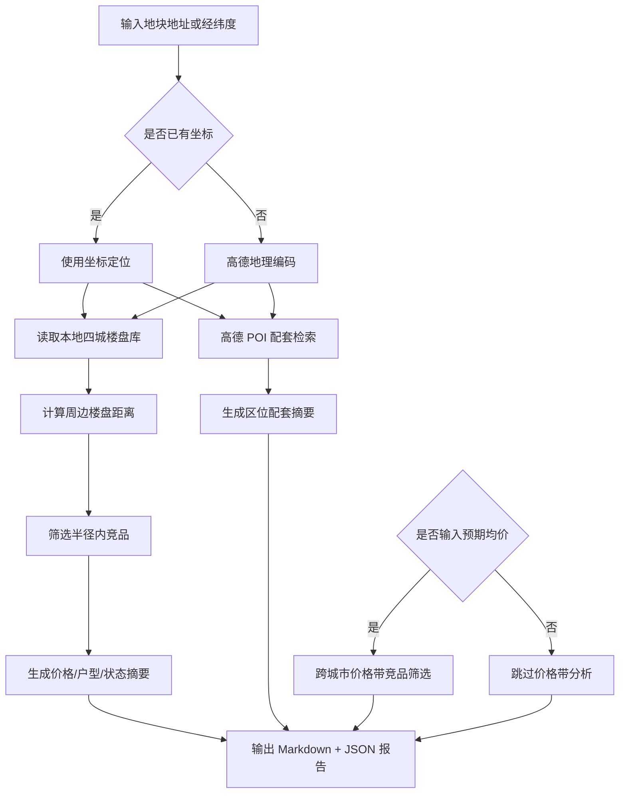

# DDS 地块画像报告 — 上海

## 输入摘要
- 城市：上海
- 区域：我分析2020年上海黄浦区
- 地址：上海黄浦区
- 坐标：121.487193, 31.220485（来源：offline_proxy_match）
- 预期均价：35000.0 元/㎡

## 逻辑流程图初稿

## 周边竞品分析
- 样本数：13
- 有效价格样本：10
- 均价：155149.0 元/㎡
- 价格区间：124191.0 - 180097.0 元/㎡

### 竞品列表
| 楼盘 | 城市 | 区域 | 状态 | 均价元/㎡ | 距离km | 面积段 | 户型 | 开发商 |
| --- | --- | --- | --- | --- | --- | --- | --- | --- |
| 中海·顺昌玖里 | 上海 | 黄浦区 | 尾盘 | — | 0.0 | 151-495㎡ | 3室户型,4室户型,别墅户型 | 上海中海海华房地产有限公司 |
| 中海·恒昌玖里 | 上海 | 黄浦区 | 尾盘 | — | 0.2 | 199-450㎡ | 别墅户型 | 上海中海海华房地产有限公司 |
| 绿城黄浦ONE | 上海 | 黄浦区 | 在售 | 172000.0 | 0.9 | 155-193㎡ | 3室户型,4室户型 | 上海良康房地产开发有限公司 |
| 士林润园 | 上海 | 黄浦区 | 在售 | — | 1.2 | 220-400㎡ | 别墅户型 | 上海士林置业有限公司 |
| 露香园二期 | 上海 | 黄浦区 | 在售 | 176000.0 | 1.3 | 377-882㎡ | 4室户型,5室户型,别墅户型 | 上海露香园建设发展有限公司 |
| 绿发浦江园 | 上海 | 黄浦区 | 在售 | 160000.0 | 1.9 | 143-195㎡ | 3室户型,4室户型 | 上海绿发实业投资有限公司 |
| 保利世博天悦 | 上海 | 浦东 | 在售 | 180097.0 | 2.9 | 174-252㎡ | 3室户型,4室户型,5室户型 | 上海华辕实业有限公司 |
| 海玥黄浦源 | 上海 | 黄浦区 | 在售 | 145600.0 | 3.1 | 93-577㎡ | 1室户型,3室户型,4室户型,5室户型,6室户型,别墅户型 | 上海建工九龙房产有限公司 |
| 湾上Domus | 上海 | 静安区 | 在售 | 134600.0 | 3.6 | 138-248㎡ | 3室户型,4室户型 | 上海晟诺置业有限公司 |
| 昌平云岸 | 上海 | 静安区 | 在售 | 145000.0 | 3.8 | 94-196㎡ | 1室户型,2室户型,3室户型,4室户型 | 上海中远泰兴置业有限公司 |
| 香港置地启元 | 上海 | 徐汇区 | 尾盘 | 178000.0 | 3.9 | 277-547㎡ | 4室户型,5室户型 | 上海浦辰置业有限公司 |
| 静安玺樾 | 上海 | 静安区 | 在售 | 124191.0 | 4.6 | 94-165㎡ | 2室户型,3室户型,4室户型 | 上海静安城市更新投资发展有限公司 |
| 信安里·忻园 | 上海 | 静安区 | 在售 | 136000.0 | 4.8 | 90-541㎡ | 1室户型,2室户型,别墅户型 | 上海信瓴置业有限公司 |

## 区位配套分析
- 学校：未获取（<urlopen error _ssl.c:1003: The handshake operation timed out>）
- 医院：未获取（<urlopen error _ssl.c:1003: The handshake operation timed out>）
- 地铁站：未获取（<urlopen error _ssl.c:1003: The handshake operation timed out>）
- 公交站：未获取（<urlopen error _ssl.c:1003: The handshake operation timed out>）
- 商场：未获取（<urlopen error _ssl.c:1003: The handshake operation timed out>）
- 公园：未获取（<urlopen error _ssl.c:1003: The handshake operation timed out>）
- 超市：未获取（<urlopen error _ssl.c:1003: The handshake operation timed out>）

## 预期均价竞品参照
当前全国分析基于本地四城样本：三亚、杭州、上海、青岛，后续可扩展全国 CSV/在线抓取数据源。
- 预期均价：35000.0 元/㎡
- 筛选价格带：29750.0 - 40250.0 元/㎡
- 城市分布：{'三亚': 10, '杭州': 10, '上海': 7, '青岛': 3}

| 楼盘 | 城市 | 区域 | 状态 | 均价元/㎡ | 价差 | 面积段 | 户型 | 开发商 |
| --- | --- | --- | --- | --- | --- | --- | --- | --- |
| 国锐亚沙村 | 三亚 | 吉阳区 | 在售 | 35000.0 | 0.0 | 101-143㎡ | 2室户型,3室户型 | 三亚国奥体育产业园一区投资有限公司 |
| 保利海晏 | 三亚 | 海棠区 | 在售 | 35000.0 | 0.0 | 107-203㎡ | 2室户型,3室户型,4室户型 | 保利（三亚）房地产开发有限公司 |
| 绿城·凤鸣观棠 | 三亚 | 海棠区 | 在售 | 35000.0 | 0.0 | 113-281㎡ | 2室户型,3室户型,4室户型 | 三亚棠华置业有限公司 |
| 深嘉上府 | 上海 | 嘉定区 | 在售 | 34650.0 | 350.0 | 88-99㎡ | 3室户型 | 上海深业科能建设有限公司 |
| 云树望山院 | 杭州 | 西湖区 | 在售 | 35400.0 | 400.0 | 248-360㎡ | 3室户型,4室户型,别墅户型 | 杭州晨悦房地产开发有限公司 |
| 天和·尚海荟庭 | 上海 | 奉贤区 | 在售 | 35888.0 | 888.0 | 68-119㎡ | 1室户型,3室户型,4室户型 | 上海好越开发建设有限公司 |
| 春曼雅庐 | 杭州 | 临平区 | 尾盘 | 34000.0 | 1000.0 | 176-270㎡ | 4室户型,5室户型,别墅户型 | 杭州滨意房地产开发有限公司 |
| 绿城凤咏朝阳 | 杭州 | 拱墅区 | 在售 | 36000.0 | 1000.0 | nan | nan | 杭州合品置业有限公司 |
| 中海璞翠云集 | 杭州 | 萧山区 | 在售 | 34000.0 | 1000.0 | 110-156㎡ | 3室户型,4室户型 | 杭州海睿房地产有限公司 |
| 君一·海尚府 | 青岛 | 崂山区 | 在售 | 34000.0 | 1000.0 | 118-348㎡ | 3室户型,4室户型,5室户型 | 青岛海云创智商业发展有限公司 |
| 建发·朗玥 | 上海 | 金山区 | 在售 | 33385.0 | 1615.0 | 97-203㎡ | 3室户型,4室户型 | 上海兆玖房地产开发有限公司 |
| 凤凰水城 | 三亚 | 天涯区 | 在售 | 33000.0 | 2000.0 | 101-175㎡ | 3室户型,4室户型,别墅户型 | 三亚凤凰新城实业有限公司 |
| 上实·听海 | 上海 | 浦东 | 在售 | 32908.0 | 2092.0 | 100-144㎡ | 3室户型,4室户型 | 上海城浩置业有限公司 |
| 建发云启之江 | 杭州 | 西湖区 | 尾盘 | 37482.0 | 2482.0 | 103-229㎡ | 3室户型,4室户型,5室户型 | 杭州启坤置业有限公司,杭州启原置业有限公司 |
| 万科·嘉澜地 | 三亚 | 吉阳区 | 在售 | 32000.0 | 3000.0 | 132-240㎡ | 3室户型,4室户型 | 三亚鹿鸣佳苑开发建设有限公司 |
| 悦菩提 | 三亚 | 吉阳区 | 在售 | 32000.0 | 3000.0 | 62-150㎡ | 2室户型,3室户型,4室户型 | 三亚大兴春光投资有限公司 |
| 保利天珺 | 三亚 | 吉阳区 | 在售 | 32000.0 | 3000.0 | 113-238㎡ | 3室户型,4室户型,5室户型 | 三亚保荣投资发展有限公司,三亚保岭投资发展有限公司,三亚保瑞实业发展有限公司,海南鸿瓴置业有限公司 |
| 海映江湾 | 三亚 | 吉阳区 | 在售 | 38000.0 | 3000.0 | 62-144㎡ | 2室户型,3室户型,4室户型 | 海南东朋祥泰房地产开发有限公司 |
| 凯德璟高府 | 杭州 | 钱塘区 | 在售 | 38300.0 | 3300.0 | 106-169㎡ | 3室户型,4室户型 | 杭州前潮房地产开发有限公司 |
| 保利天珺商铺 | 青岛 | 市北区 | 在售 | 31680.0 | 3320.0 | 43-142㎡ | nan | 青岛利盛置业有限公司 |
| 杭铁·和映云筑 | 杭州 | 西湖区 | 在售 | 31440.0 | 3560.0 | 115-180㎡ | 3室户型,4室户型 | 杭州西锦置业有限公司 |
| 兴耀沐晴川 | 杭州 | 钱塘区 | 尾盘 | 31345.0 | 3655.0 | 105-138㎡ | 3室户型,4室户型 | 杭州星淞置业有限公司 |
| 招商蛇口璀璨映澜 | 杭州 | 临平区 | 在售 | 30711.0 | 4289.0 | 99-128㎡ | 3室户型,4室户型 | 杭州北桦房地产开发有限公司 |
| 未来港·元启 | 上海 | 浦东 | 在售 | 30046.0 | 4954.0 | 68-310㎡ | 2室户型,3室户型,4室户型,5室户型 | 上海云瑆经济发展有限公司 |
| 滨江翠栖府 | 杭州 | 萧山区 | 在售 | 30020.0 | 4980.0 | 97-139㎡ | 3室户型,4室户型 | 杭州滨惠房地产开发有限公司 |
| 香水湾18°院 | 三亚 | 陵水 | 在售 | 40000.0 | 5000.0 | 124-176㎡ | 2室户型,3室户型 | 海南盈新文化旅游发展有限公司 |
| 绿城蓝湾小镇 | 三亚 | 陵水 | 在售 | 30000.0 | 5000.0 | 53-1000㎡ | 1室户型,2室户型,3室户型,4室户型,5室户型,别墅户型 | 海南绿城高地投资有限公司 |
| 海信璟悦 | 青岛 | 崂山区 | 在售 | 40000.0 | 5000.0 | 128-220㎡ | 3室户型,4室户型 | 青岛海信信邦置业有限公司 |
| 淀湖山庄 | 上海 | 青浦区 | 在售 | 29983.0 | 5017.0 | nan | nan | 上海久凯房地产开发有限公司 |
| 恒文璞悦江南 | 上海 | 青浦区 | 在售 | 40052.0 | 5052.0 | 88-145㎡ | 3室户型,别墅户型 | 上海文欢置业有限公司 |

## 数据边界与下一步
- 当前竞品库覆盖本地四城：三亚、杭州、上海、青岛。
- 周边配套来自高德 Web 服务实时 POI。
- 下一步可接入全国楼盘 CSV 或在线抓取任务，将价格带分析从本地 MVP 扩展为真实全国范围。
