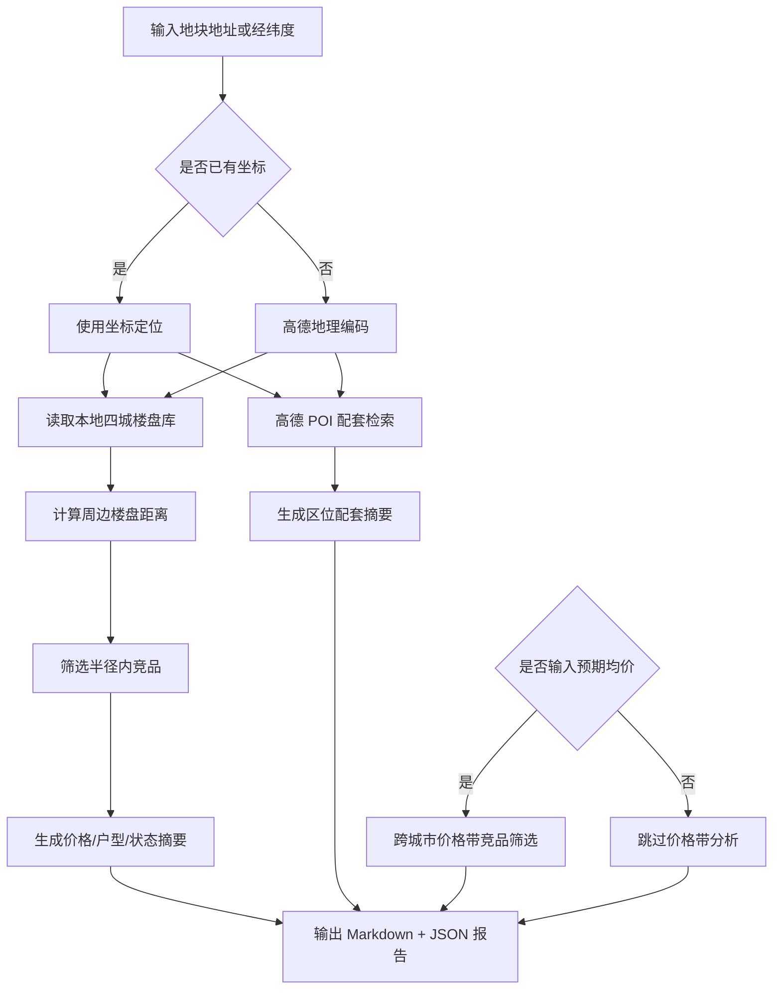

# DDS 地块画像报告 — 杭州

## 输入摘要
- 城市：杭州
- 区域：未指定
- 地址：杭州市拱墅区祥泰街398号
- 坐标：119.750575, 30.237445（来源：offline_proxy_match）
- 预期均价：未输入 元/㎡

## 逻辑流程图初稿

## 周边竞品分析
- 样本数：4
- 有效价格样本：1
- 均价：12704.0 元/㎡
- 价格区间：12704.0 - 12704.0 元/㎡
- 注意：半径内样本不足，已补充同区或同城样本。

### 竞品列表
| 楼盘 | 城市 | 区域 | 状态 | 均价元/㎡ | 距离km | 面积段 | 户型 | 开发商 |
| --- | --- | --- | --- | --- | --- | --- | --- | --- |
| 桃李映湖 | 杭州 | 临安区 | 在售 | — | 0.0 | 185-244㎡ | 别墅户型 | 杭州市临安区国瑞置业有限公司 |
| 平峰晓庐 | 杭州 | 临安区 | 在售 | — | 2.9 | 89-200㎡ | 3室户型,4室户型,别墅户型 | 杭州临安锦海房地产开发有限责任公司 |
| 桃李西径 | 杭州 | 临安区 | 在售 | 12704.0 | 3.5 | 43-298㎡ | 1室户型,2室户型,3室户型,4室户型,别墅户型 | 杭州临安新都房地产开发有限公司 |
| 锦天府 | 杭州 | 临安区 | 在售 | — | 4.4 | 215-284㎡ | 别墅户型 | 杭州美顺企业管理有限公司 |

## 区位配套分析
- 学校：未获取（<urlopen error _ssl.c:1003: The handshake operation timed out>）
- 医院：未获取（<urlopen error _ssl.c:1003: The handshake operation timed out>）
- 地铁站：未获取（<urlopen error _ssl.c:1003: The handshake operation timed out>）
- 公交站：未获取（<urlopen error _ssl.c:1003: The handshake operation timed out>）
- 商场：未获取（<urlopen error _ssl.c:1003: The handshake operation timed out>）
- 公园：未获取（<urlopen error _ssl.c:1003: The handshake operation timed out>）
- 超市：未获取（<urlopen error _ssl.c:1003: The handshake operation timed out>）

## 数据边界与下一步
- 当前竞品库覆盖本地四城：三亚、杭州、上海、青岛。
- 周边配套来自高德 Web 服务实时 POI。
- 下一步可接入全国楼盘 CSV 或在线抓取任务，将价格带分析从本地 MVP 扩展为真实全国范围。
