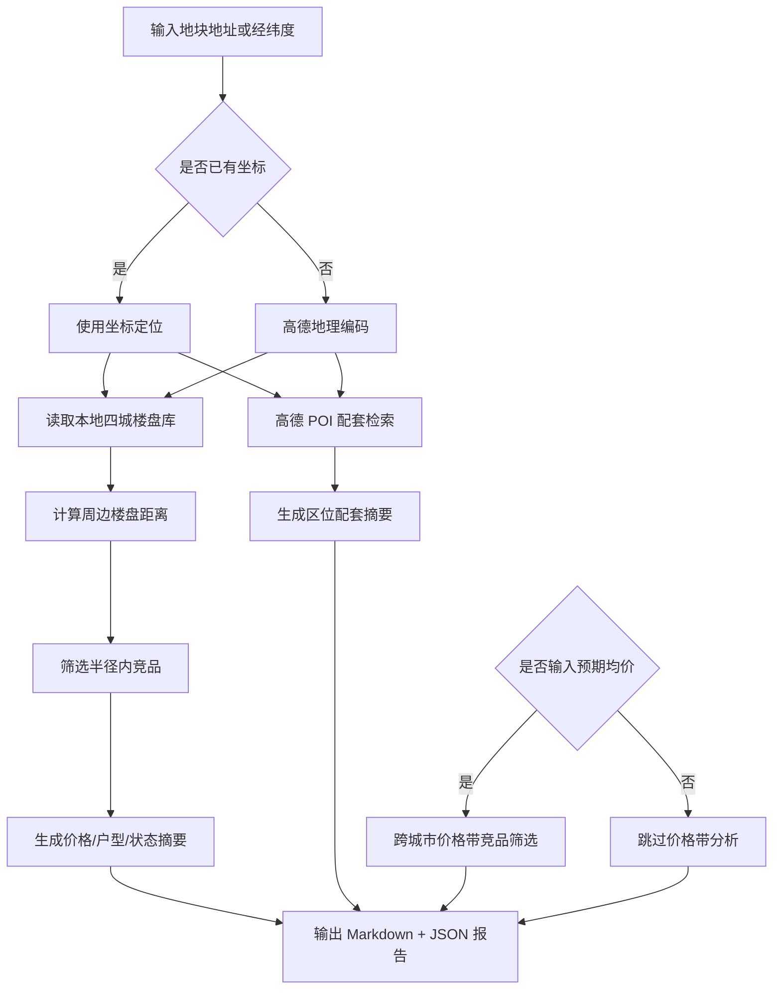

# DDS 地块画像报告 — 三亚

## 数据可信度 [T5]
- **可用单价样本**: 10 条
- **样本来源**: 21 条真实竞品（+38 条合成历史用于密度参考）
- **数据快照**: 2026 年
- **数据备注**: [信息] 价格统计基于 21 条真实数据，另有 38 条合成数据用于样本密度参考

## 输入摘要
- 城市：三亚
- 区域：海棠区
- 地址：未指定
- 坐标：109.71899, 18.4104（来源：coordinates）
- 预期均价：未输入 元/㎡

## 逻辑流程图初稿

## 周边竞品分析
- 样本数：21
- 有效价格样本：10
- 均价：32343.0 元/㎡
- 价格区间：26800.0 - 38000.0 元/㎡

### 竞品列表
| 楼盘 | 城市 | 区域 | 状态 | 均价元/㎡ | 距离km | 面积段 | 户型 | 开发商 |
| --- | --- | --- | --- | --- | --- | --- | --- | --- |
| 东方宇亿·海棠壹号院 | 三亚 | 海棠区 | 在售 | 28000.0 | 1.2 | 109-119㎡ | 2室户型,3室户型 | 海南山海颐园投资有限公司 |
| 长基听棠 | 三亚 | 海棠区 | 在售 | 33000.0 | 1.3 | 52-203㎡ | 1室户型,2室户型,3室户型,别墅户型 | 三亚新海裕实业有限公司 |
| 海棠湾8号温泉公馆 | 三亚 | 海棠区 | 在售 | 33000.0 | 1.4 | 83-155㎡ | 2室户型,3室户型,别墅户型 | 三亚天宝盛投资有限公司 |
| 开创·白玉海棠 | 三亚 | 海棠区 | 在售 | 33000.0 | 1.4 | 108-180㎡ | 3室户型,别墅户型 | 三亚绵阳开创房地产开发有限公司 |
| 双大海棠香居 | 三亚 | 海棠区 | 在售 | 38000.0 | 1.4 | 123-190㎡ | 3室户型,6室户型 | 海口宝峰实业有限公司 |
| 盛海棠 | 三亚 | 海棠区 | 在售 | 26800.0 | 1.4 | 99-160㎡ | 3室户型,别墅户型 | 海南益胜实业开发有限公司 |
| 海棠月色 | 三亚 | 海棠区 | 在售 | 29000.0 | 2.2 | 57-143㎡ | 2室户型,3室户型,5室户型 | 海南红山房地产开发有限公司 |
| 海棠故事 | 三亚 | 海棠区 | 在售 | 58252.0 | 4.1 | 515-660㎡ | 商业户型 | 三亚故事文化产业发展有限公司 |
| 中旅·馥棠公馆 | 三亚 | 海棠区 | 在售 | 60000.0 | 4.4 | 138-600㎡ | 3室户型,4室户型,5室户型,6室户型 | 中旅（三亚）置业有限公司 |
| 佳兆业海棠伴山 | 三亚 | 海棠区 | 在售 | — | 0.0 | 102-123㎡ | 3室户型,4室户型,别墅户型 | 三亚佰佳世纪房地产开发有限公司 |
| 恒润·中御海棠 | 三亚 | 海棠区 | 在售 | — | 0.4 | 106-143㎡ | 2室户型,3室户型 | 海南恒润实业发展有限公司 |
| 海棠花开 | 三亚 | 海棠区 | 尾盘 | 32000.0 | 0.2 | 86-93㎡ | 2室户型,别墅户型 | 三亚中业南田投资有限公司 |
| 华悦海棠 | 三亚 | 海棠区 | 尾盘 | 33000.0 | 0.5 | 86-110㎡ | 2室户型,3室户型 | 海南旭茂投资有限公司 |
| 金地水木海棠 | 三亚 | 海棠区 | 尾盘 | 31000.0 | 1.4 | 106-140㎡ | 3室户型,4室户型 | 三亚南田温泉金地置业有限公司 |
| 天骄海棠湾 | 三亚 | 海棠区 | 尾盘 | 37000.0 | 1.6 | 65-86㎡ | 2室户型,3室户型 | 三亚伟奇投资有限公司 |
| 天使·海棠明悦 | 三亚 | 海棠区 | 尾盘 | 33628.0 | 1.8 | 113-195㎡ | 3室户型,4室户型,别墅户型 | 海南霖润房地产开发有限公司 |
| 和泓海棠府 | 三亚 | 海棠区 | 尾盘 | 30000.0 | 2.0 | 100-120㎡ | 3室户型,4室户型,5室户型 | 三亚顺泽房地产开发有限公司 |
| 方大太阳城 | 三亚 | 海棠区 | 尾盘 | — | 0.1 | 68-113㎡ | 1室户型,2室户型,3室户型 | — |
| 海棠·泰岳府 | 三亚 | 海棠区 | 尾盘 | — | 0.2 | 37-132㎡ | 1室户型,2室户型,3室户型 | — |
| 龙棠大观 | 三亚 | 海棠区 | 尾盘 | — | 0.8 | 96-209㎡ | 2室户型,3室户型,4室户型 | 三亚美海龙房地产开发有限公司 |

## 区位配套分析
- 学校：最近 湾镇温泉小学，约 1088m
- 医院：最近 长基·听棠长基听堂健康小屋，约 544m
- 地铁站：暂无数据
- 公交站：最近 龙棠大观(公交站)，约 255m
- 商场：最近 静静超市，约 558m
- 公园：暂无数据
- 超市：最近 海棠湾8号商业广场，约 1421m

## 数据边界与下一步
- 当前竞品库覆盖本地四城：三亚、杭州、上海、青岛。
- 周边配套来自高德 Web 服务实时 POI。
- 下一步可接入全国楼盘 CSV 或在线抓取任务，将价格带分析从本地 MVP 扩展为真实全国范围。
