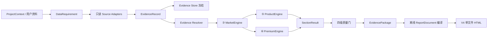

# DDS V2 真实证据闭环

## 目的与边界

本文解释 DDS V2 如何把“章节存在”与“结论可信、可交付”分开处理。它描述当前代码中的事实边界，不是完成声明：Agent 产品化、真实业务参数校准和最终浏览器交付验收仍需继续。

V2 的核心规则是：**永不静默缺失，但允许明确的 `unknown`、`conflict`、`stale` 和不可评估状态。** 没有可追溯来源时，系统不得生成看似真实的城市或全国基准值。

## 数据流

Agent 可以规划需要什么数据、调用顺序以及补证动作；查询、计算、证据资格判断、冻结和门禁由确定性模块执行。内容生成不得新增 `SectionResult` 之外的客户可见数字。

## 唯一事实来源

| 事实 | 唯一实现 | 兼容入口 |
| --- | --- | --- |
| 领域数据类型 | `src/dds/domain/models.py` | `domain/project.py`、`evidence.py`、`decisions.py`、`sections.py`、`report_status.py` |
| 十二单元与质量门契约 | `src/dds/contracts.py` | `domain/sections.py`、`domain/report_status.py` |
| 报告冻结与编译 | `src/dds/reporting/compiler.py` | `reporting/builder.py` |
| 离线资源解析 | `src/dds/reporting/assets.py` | `reporting/asset_resolver.py` |

兼容入口只重新导出同一 Python 对象，不复制 dataclass、枚举、常量或校验逻辑。

## 证据与解析状态

`EvidenceRecord` 保存值、单位、证据类型、来源标识、来源引用或哈希、观察时间、地域、方法、样本量和限制条件。来源标签本身不是溯源；至少还需来源引用或来源哈希。

证据解析使用以下状态：

- `verified`：来源和约束满足要求，可作为已验证输入。
- `estimated`：基于可追溯证据进行分析估计，不能伪装为观察事实。
- `simulated`：模型模拟结果。
- `unknown`：证据不足，值保持未知。
- `conflict`：可追溯来源之间存在未解决冲突。
- `stale`：证据超过允许时效。

章节层继续使用 `resolved / partial / unknown / human_input / not_applicable`，用于表达决策单元是否已达到当前用途的门槛。两套状态职责不同，不应互换。

## 四级质量门

| 门禁 | 回答的问题 | 失败后的行为 |
| --- | --- | --- |
| `structure_valid` | 十二单元、外层 key、内部 ID 和必填结构是否一致 | 拒绝进入后续门禁 |
| `evidence_valid` | 来源、时间、地域、单位、类型和 metadata 是否合法 | 保留缺口，不伪造替代值 |
| `decision_ready` | ③⑤⑥的最低输入门槛是否满足 | 允许工作报告，禁止把结论标成可决策 |
| `delivery_ready` | 冻结包、编译器、资源策略和交付检查是否通过 | 不覆盖旧交付物 |

`valid=True` 只表示对应检查通过，不能跨级推导。例如，结构完整的报告仍可能因为竞品少于 3 个而不允许输出单点定价。

## 当前实现映射

- `data/repository.py` 提供参数化 DuckDB 查询；`data/adapters/` 负责本地新房、成交、土地、宏观和用户资料转换。
- `data/evidence_store.py` 以规范化 JSON、语义哈希和原子写入冻结项目证据。
- `engines/market.py` 实施结构化竞品筛选；向量结果不能直接成为最终竞品集合。
- `engines/product.py` 实施已有方案审计与三方向概念方案两种模式。
- `engines/premium.py` 在缺基准、结果变量、成本、方法或来源时返回不可评估，不生成溢价数值。
- `engine/contract_enforcer.py` 分离四道质量门。
- `reporting/compiler.py`、迁移的 V4 contracts/template/profile 和受控 `AssetResolver` 构成离线报告内核。
- `services/delivery_service.py` 要求浏览器 QA 与具体 HTML 字节哈希绑定，失败时不得覆盖旧产物。

## 尚未闭合的边界

- `arch-front-html` bridge 已有代码路径，但最终三视口、打印布局及运行时兼容验收尚未在本状态文档中宣告完成。
- M6 的 Agent 编排、完整 API、幂等重试和运行日志仍是分阶段产品化工作；现有骨架不等于生产就绪。
- 真实武汉纵向切片已进入代码与测试收口阶段，最终是否可决策仍由证据门槛和全套回归结果决定。
- 网页采集、云发布、CAD/GH 几何深化和旧 Web UI 不属于首轮交付范围。

## 变更约束

新增字段或状态时，应先修改唯一实现及其单元测试，再由兼容模块导出。不得在模板、Agent prompt 或兼容模块中创建第二套同名定义。任何客户可见数字都必须能回指 `EvidenceRecord` 或显式公式。
